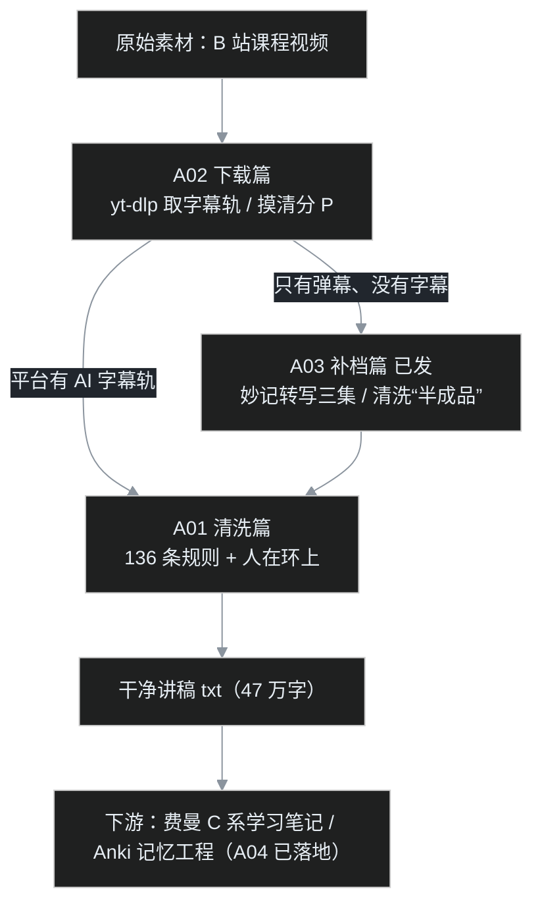

> 🗺 [博客地图](/post/47.html) ｜ 全部系列的总入口

这个系列从一个很具体的麻烦开始：叶扬硬盘里躺着一门 39 集的课程，平台只给 AI 自动生成的字幕，错字连篇到「木亥佛教」「solo 王」遍地跑；另一门 30 集的课干脆连字幕轨都没有。收拾这堆烂摊子的过程，顺手沉淀成了一个系列。

如果说 C 系学习笔记回答的是「课里讲了什么」，A 系回答的就是另一个问题：**程序员怎样把 AI 塞进自己的数据流水线，让它干真活、而且干得可以审计、可以重来。**

## 一、这个系列的三条规矩

1. **真实项目驱动，不写玩具 demo。** 每一篇的数据都来自叶扬自己的磁盘：多少个文件、多少行、命中多少次，全部跑脚本复核，数字不凭印象。
2. **工程纪律高于模型玄学。** 出错可枚举的环节用确定性脚本（Software 1.0），开放域理解才交给模型（Software 2.0）；能写断言就不靠肉眼，退出码 0 不等于成功。
3. **人在环上（on the loop），不是人在环中。** AI 负责发现候选，人负责拍板，规则负责执行——这条线在 [A01](/post/43.html) 里有完整展开。

## 二、全景流水线

整个系列挂在同一条数据链路上，每篇负责一段：

给不写代码的读者一句话版：**先把原料从网上弄下来，没有文稿的自己语音转文字，再用一套自动规则把错字修干净，最后得到可以安心学习的文本。** A 系讲的就是这条流水线上每一段的工程细节。

## 三、路线图

✅ 已发布 / ⏳ 计划中 / 🔜 下一篇。状态只在这张表和下面的发布日志里维护：发一篇，叶扬回来勾一篇。

| 编号 | 主题 | 解决的问题 | 状态 |
|---|---|---|---|
| A00 | 本文：系列总览 | 全景流水线、选题规矩、进度查询 | ✅ |
| A01 | [136 条规则打败大模型：四万八千行 AI 字幕清洗战](/post/43.html) | AI 字幕错字怎么系统修；什么时候信规则、什么时候信模型；人在环上 | ✅ |
| A02 | [退出码 0，但硬盘上只有一个文件：65 集 AI 字幕下载记](/post/44.html) | yt-dlp 假成功、29 个同名分 P、cookie 凭据、HTTP 412、断言怎么写 | ✅ |
| A03 | [ASR 交来的是“半成品”：三集补档实战](/post/66.html) | 飞书妙记转写、零宽字符、无时间码 txt、跨 cue 切断、五轮扩规、一次性任务选型，产物接回 A01 | ✅ |
| A04 | [246 张卡只考了背诵：从费曼定稿到间隔重复](/post/67.html) | 旧卡 Bloom 诊断、五类深化卡、SQLite＋genanki、SM-2/FSRS、闭环回流 | ✅ |
| 候选 | 本地 whisper.cpp 部署手记 | 模型选型、显存、中文识别质量、批量转写 | ⏳ |

候选池不承诺顺序、不承诺全写；有真实数据和真实坑了才升级成正式编号。

## 四、发布日志

- **2026-09-18 · [A01 字幕清洗战](/post/43.html)**：65 个字幕文件、47762 文本行、136 条规则、命中 1230 次修正全部脚本复核；Software 1.0/2.0 选型框架、长短语规则排序坑、UTF-8 报告绕开 GBK 控制台。当晚按 Karpathy 风格重写过一版。
- **2026-09-18 · [A02 字幕下载记](/post/44.html)**：两次「假成功」破案——合集 URL 对 29 个同名分 P 只产出一个 `NA` 文件却退出码 0、36/39 集缺三集逐集证伪；SESSDATA 凭据三纪律（只计数不读内容、用完即删、不进同步目录）、`--sleep-requests` 防 412；李元祥 30 集（BV1dt4y1m7FK）只有弹幕，留给 A03。
- **2026-09-19 · A00 系列总览**：本文。
- **2026-09-21 · [A03 补档实战](/post/66.html)**：飞书妙记补转 P02/P04/P27 三集；18,432 个零宽字符、无时间码 txt、跨 cue 切断；fix_subs.py 三轮扩五轮、规则约 200→约 500；一次性任务选型（不自建 ASR）；下游变现番外一/二＋C04 补十事。
- **2026-09-22 · [A04 记忆工程](/post/67.html)**：旧 32 张卡全部停在 Bloom 第一层的诊断；五类深化卡（分界辨析/推理链填空/反方质询/类比破洞/题眼）；SQLite 三表真源＋genanki 渲染，全库 152 notes→246 cards；间隔重复从 SM-2 到 FSRS（S/D/R 三状态、FSRS-6 21 参数、个人复习史拟合参数）；复习失败回流。个人保留率数据待几个月真实复习后补。

## 五、边界与读法

- 这个系列只发**工程方法**：脚本思路、排查过程、数字与教训。课程字幕和讲稿原文是叶扬的个人学习材料，**不公开发布**。
- 每篇独立可读，但按编号读体验最好——A03 的转写产物会直接接进 A01 的清洗规则，是同一条管线的上下游。
- 叶扬是写前后端和数据库的程序员，类比默认面向同行；不写代码的读者记住每篇里那句大白话版即可，不影响主线。

A04 已发布（[见此](/post/67.html)）。下一篇待定：候选 **本地 whisper.cpp 部署手记**——等真有长期批量的转写需求再动手；以及几个月真实复习数据攒够之后，带个人保留率回来给 A04 补账。

