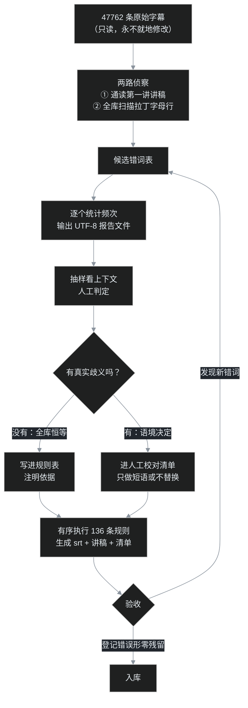

先说结论：拿到四万八千行错误百出的 AI 字幕后，叶扬没有把它们丢给大模型，而是写了 136 条有序规则。效果更好——而且好的原因和"AI 够不够强"没有关系，和任务的形状有关系。

叶扬是程序员，日常写前后端和数据库；最近在学一门印度佛教史课程，39 集，每集一小时上下。为了通勤能读、日后能检索，叶扬把 B 站的 AI 字幕整批拉了下来。拉下来一看，质量比预想的差很多，而且差得极有规律。

先看几行原始字幕，猜猜原意是什么：

| AI 字幕写的 | 实际讲的是 |
| --- | --- |
| 到**木亥**佛教时代，**出其大圣** | 到**部派**佛教时代，**初期大乘** |
| **平婆 solo 王**说 | **频婆娑罗王**说 |
| 船借**阿 sir** 一号 | 传借**阿阇梨**一号 |
| 等觉叫**阿 B8 字**啊 | 等觉叫**阿鞞跋致**啊 |
| **吴浊**菩萨跟**世清**菩萨 | **无著**菩萨跟**世亲**菩萨 |
| 你是**差弟弟** | 你是**刹帝利** |
| 好，**配色**是士农工商，好**手头颅手头螺** | **吠舍**是士农工商，**首陀罗** |
| 佛家对法的定义是认持**自信** | 认持**自性** |

"频婆娑罗王"是佛陀同时代的国王，被识别成了"平婆 solo 王"；佛教核心概念"自性"，两百多行里全部写成了"自信"。不洗一遍，这批字幕既没法读，也没法搜。

这是新开的「AI 工作流」系列第一篇。这个系列记的是叶扬在真实工程里遇到的问题——数据清洗、工具链、前后端、数据库——以及 AI 在每一层到底该站在哪。本篇先讲这批字幕的清洗。下载的故事（登录 cookie、412 风控、29 个同名分 P）放下一篇。

## 一、错误的形状

这批语料的规模：

- 两套课程，共 **65 个 srt 文件、47762 条字幕**；
- 其中 **356 条混进了拉丁字母**——大量是佛教术语被识别成了英文或拼音 token；
- 全部讲稿约 **47 万字**。

粗看几十条之后，结论很清楚：错误不是随机散布的噪声，而是**高度系统性**的。分四类：

1. **音近替换**：大圣/大胜/大盛/大神 → 大乘；小圣 → 小乘；元起 → 缘起；无名 → 无明。
2. **术语缺位**："部派""唯识""结集"这些词不在日常语料里，被强行映射到常用词——木亥佛教、维氏（唯识）、集结（结集）。
3. **跨语言乱入**：语音模型拿拉丁字母凑音——P 字佛（辟支佛）、阿 sir（阿阇梨）、solo 王（娑罗/频婆娑罗）、4Z（四部）。
4. **专有名词**：贵霜王朝被写成贵州/贵春/贵商/归庄王朝，笈多王朝有五种写法，戒日王朝成了烈日王朝。

系统性错误意味着一件关键的事：**它是一个封闭词表上的确定性映射，可以枚举。**

请记住这句判断，后面所有决策都是从它推出来的。

## 二、为什么第一选择不是大模型

2026 年了，看到几万行脏文本，第一反应难道不是丢给大模型："帮我把佛教术语错误改对"吗？

这里要先引入一个框架。Karpathy 把软件分成三个时代：[Software 1.0](https://karpathy.github.io/2017/11/13/software/) 是程序员手写明确规则，2.0 是用数据训出神经网络权重，[3.0](https://x.com/karpathy/status/1886192184808149383) 是用自然语言提示 LLM——"最热门的新编程语言是英语"。清洗字幕听起来是语言任务，直觉该用 3.0。

但直觉错了。这个任务的形状是 1.0 的：词表封闭、答案确定、要反复全量重跑。把它交给 3.0，会撞上四个工程问题：

1. **不可复现。** 同一批输入跑两次，模型给的修订不完全一样。而清洗是多轮迭代——第一轮的产物是第二轮的基线，基线必须稳定。生产管这叫 flaky build，没人想要一个每次构建结果不同的编译器。
2. **不可审计。** 136 条规则，每条写明匹配什么、换成什么、为什么，错了能定位到具体那一行。模型吐回来 47 万字修订稿，你没法 code review——只能重新通读一遍，人力一分没省。
3. **没法写测试。** 规则的验收可以是一条硬杠杠：登记过的错误形，全库 grep 必须零残留。prompt 没有回归测试。
4. **尾部行为不受控。** 平均案例上模型大概率表现不错，但它有一种人类不会犯的失败模式：遇到拿不准的术语，**自信地换成一个听上去合理的词**。"木亥佛教"至少一看就错；一个通顺但不存在的佛学概念混在正确文本里，你永远发现不了。报错不可怕，静默返回错误答案才可怕。

这也是为什么叶扬对现在各种"端到端 AI"演示保持警惕：demo 展示的是平均案例，部署考验的是最难的 5%。可靠性不由平均值决定，由尾部决定。

顺带一说，语音识别本身就是锯齿状智能的活样本：模型在日常口语上的表现接近超人，在"阿鞞跋致""补特伽罗"上犯的错没有任何人类会犯。能力不是均匀分布的，是锯齿状的——凹陷点必须人工兜底。

但这不是一篇"规则派战胜模型派"的檄文。真实分工是三句话：

> **AI 负责发现候选，人负责判定，规则负责执行。**

通读讲稿、扫出可疑词，是叶扬和 AI 协作完成的；"这个词在这门课里是不是恒等于那个术语"，由人拍板；拍板之后的一千多次机械替换，交给一条命令。人在环上设计系统，而不是人肉替换 1230 次，更不是被移出决策链。这是钢铁侠套装，不是钢铁侠机器人。

## 三、清洗流水线

整套流程长这样：



注意那个回流箭头：流程实际跑了两遍以上。第二轮规则几乎全部来自"通读清洗后的第一讲讲稿"——机器把已知错误扫干净之后，藏得更深的错误才浮出来。这和调 bug 一样：修完一层，测试重新跑红，下一层才可见。

脚本本体是一个 321 行的 Python 文件 `fix_subs.py`，零第三方依赖，核心数据结构就是一张有序规则表，每条规则三元组：**匹配模式、替换词、说明**：

```python
RULES = [
    # —— 初期/后期大乘的音近变体（必须排在"大圣→大乘"之前）——
    (r"(出席|出奇|初级|初奇|出其|出齐)大[圣胜盛神]", "初期大乘", "初期大乘(音近变体)"),
    (r"后齐大[圣胜盛神]", "后期大乘", "后期大乘(音近变体)"),
    # —— 乘 ——
    (r"大[圣胜盛神]", "大乘", "大乘"),
    (r"小[圣胜]", "小乘", "小乘"),
    # —— 跨语言乱入 ——
    (r"阿[sS]ir", "阿阇梨", "阿阇梨"),
    (r"平婆solo王|平坡solo王", "频婆娑罗王", "频婆娑罗王"),
    (r"P字佛", "辟支佛", "辟支佛"),
    (r"阿B8字|阿B拔字", "阿鞞跋致", "阿鞞跋致"),
    # ……共 136 条
]
```

一条命令跑完，产出三样东西：修正后的 srt（序号时间码原样保留，可以挂回播放器）、纯文本讲稿、人工校对清单。原始字幕目录全程只读——这是整条流水线的安全带。

## 四、四条军规

值钱的不是这 136 条规则本身（换一门课就得换词表），是定规则时的四条纪律。每一条在普通软件工程里都有对应物。

### 军规一：先量化，再动手

训练神经网络的头号纪律是什么？第一步永远不是碰模型代码，是彻底检查数据。Karpathy 在 [《A Recipe for Training Neural Networks》](https://karpathy.github.io/2019/04/25/recipe/) 里给过一条具体建议：把样本按损失降序排列，你保证会发现意料之外的、奇怪的、但有用的东西。

洗字幕一模一样：每个候选词，**先统计全库频次，再抽上下文判定**，绝不看到一个错词就全局替换。频次决定优先级，上下文决定能不能替。最终实测命中 **1230 次**，排前五的是：

| 修正项 | 次数 |
| --- | --- |
| 大乘（大圣/大胜/大盛/大神等） | 825 |
| 自性（自信） | 253 |
| 小乘（小圣/小生等） | 172 |
| 部派（布派/木亥/步派等） | 143 |
| 般若（波若等） | 86 |

825 次的错误排第一优先级，只出现一两次的记下来顺带处理。数据自己会告诉你先修什么。

环境小坑：Windows 控制台默认 GBK 编码，Python 打印中文频次表会乱码甚至崩溃。对策是让脚本把报告写成 UTF-8 文件再读，不跟控制台较劲。

### 军规二：分清安全替换和语境替换——precision 优先

这是 precision 和 recall 的权衡，而叶扬明确倒向 precision：**宁可漏改进清单，不可错改伤正文。**

**安全替换**：错误形在本语料里恒等于目标词，闭眼替。"摩羯"21 次全是"摩揭陀"（摩羯座不可能出现在印度佛教史课上）；"集结"全是"结集"，"涅盘"全是"涅槃"——安全。

**语境替换**：错误形本身是个真实常用词，只做短语，或者不替、进清单：

- **自信 → 自性**：最棘手的一个。253 行，万一是现代用法怎么办？叶扬先随机抽了几十行，又把不带"无"字的一百多行全部过目——清净自性、离言自性、自性与神我，没有一个是"自信一点"的那个自信，这才写进规则。合并这个 PR 的依据是抽样证据，不是感觉。
- **休息 → 修行**：老师既会说"出家修行"，也会说"先休息一下"。规则只认短语，"先休息一下"原样保留进清单。
- **思路 → 丝路**、**D → 地/谛**：全部进清单，不替。

最后的产物是 **196 条真正需要人工核对的清单**，外加 **317 条中英混排**——其中大多数是老师口头引用 BBC、DVD、slogan，属正常表达，可直接忽略。好的系统不只输出修正，还输出一份诚实的"我不确定列表"。

### 军规三：规则有序，长短语在前——像编译器的 pass

规则表从上到下顺序执行，这就埋了雷：通用规则排在前面，会把短语规则的素材先吃掉。

"出席大圣"实际是"初期大乘"。如果通用的 `大圣 → 大乘` 先跑，文本先变成"出席大乘"——一个谁也没见过的新错误，再没有规则救得回来。所以长短语规则必须排在通用规则之前：

```python
(r"(出席|出奇|初级|初奇|出其|出齐)大[圣胜盛神]", "初期大乘", ...),  # 先跑
(r"大[圣胜盛神]", "大乘", ...),                                    # 后跑
```

规则还会互相喂料（A 的产物命中 B），顺序本身就是语义的一部分。叶扬还亲手制造过一次反向事故：短语写宽了，"在家休息"被误替成"出家修行"，方向都反了。修法是收紧短语、全库重跑、grep 确认零残留——规则的好处正在这种时候兑现：误伤可以精确定位、可以回滚、可以补一条测试。模型的一次发挥失常，你连案发现场都找不到。

### 军规四：全部脚本化，输入只读，一秒重建

原始 srt 永远不动；所有知识沉淀在规则表里；产物一键重建。这就是字幕界的 CI：

1. 规则迭代后全库重跑只要一秒，不怕"改了规则要不要重来"；
2. 另一套 30 集老课将来用语音识别出字幕后，同一张词表直接复用，术语错误是同一批；
3. 每条规则带中文说明，三个月后的自己看得懂当时为什么这么写。

讲稿生成也顺手做了两件事：去时间码、合断句，并**每隔 5 分钟插一个〔mm:ss〕锚点**。读到不通顺的地方，照锚点跳回视频原位置核对——纯文本相对字幕的最大价值。

## 五、验收，以及一个意外收获

清洗工程最容易自欺欺人：跑了脚本，感觉通顺了，就算完。叶扬的验收是两道硬杠杠：

1. **登记过的错误形，全库零残留**——逐个 grep，一个不剩，这就是回归测试；
2. **正确词的词频要合理**——大乘 825、部派 143、自性 253、唯识约 70、无著 6、世亲 7，对照课程大纲，该高频的高频、该低频的低频。这是在检查输出的分布形状，而不只是抽查几个样例。

此外白捡一个元数据层面的发现：比对两套课程的分 P 时发现，39 集那套的第 25 讲之后其实是**重录版**——25–28 讲重录第 1 讲，29 讲重录第 3 讲，32–39 讲对应 8–22 讲。学习要按主题并轨，不能傻按编号顺序看，否则同一批内容学两遍。这种"文本之外的结构问题"，只有把语料整体拉通之后才看得出来。

## 六、规则会在什么时候输

这套方法成立有一个前提，必须说清楚：**错误分布高度集中、而且可以枚举。** 术语密集的课程字幕恰好满足——136 条规则覆盖 1230 处错误，边界情况交给清单。

换成开放域的日常语音、多人闲聊、带口音的即兴讲话，错误词表无穷无尽，规则会输，而且会输得很难看——那才是模型的主场。

所以比"用规则还是用模型"更重要的一步，是先判断语料长什么样：**错误是系统性的还是随机的，是封闭词表还是开放世界。** 语料的形状，决定工具的形状。这句话对选数据库、选框架、选架构，同样成立。

## 急诊室

- **替换完反而多出新词**：先查规则顺序，大概率是通用规则抢跑；再查两条规则是否互相喂料。
- **控制台中文全乱码**：别和 GBK 较劲，脚本直接写 UTF-8 报告文件。
- **看到拉丁字母就判错**：317 条混排里大多数是 BBC、DVD、slogan、型号名。先统计再判定，这条纪律对字母同样适用。
- **规则误伤无法回滚**：如果你就地改了原始字幕，就真回不去了。输入只读、产物重建，是安全带。
- **AI 改稿看着通顺但不敢用**：警惕"过度润色"和"合理的幻觉"。让人无法判断对错的修订，比保留原样更糟。

## 写在最后

136 条规则不是笨办法的耻辱柱。每一条，都是叶扬真正读懂一处错误之后留下的证据；规则表写满的那天，对这批语料的理解也就建完了。

这大概是 Software 1.0 在 3.0 时代最公平的地方：模型给你的答案是模型的，你手写下来的每一行规则，都是你自己的。

下一篇 A02，回到这条流水线的起点：**四万八千行字幕是怎么从 B 站批量拉下来的**——为什么不登录根本看不到字幕轨、连打 30 个请求会被 412 风控、29 个同名分 P 怎么逼出循环下载法。工具是开源的 [yt-dlp](https://github.com/yt-dlp/yt-dlp)，但正确的打开方式有不少讲究。

> 说明：课程字幕仅供个人学习使用，本文不发布任何字幕原文与讲稿内容，只展示错误词例与方法。这套流程对任何讲座、课程、会议录音的转写文本都适用。
