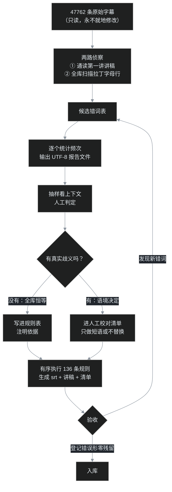

# A01｜"木亥佛教"与"solo王"：四万八千行 AI 字幕，136 条规则的清洗战

叶扬最近在学一门印度佛教史的课程，39 集，每集一小时上下。为了通勤时能读、日后能检索，叶扬把 B 站的 AI 字幕整批拉了下来。拉下来一看，质量比预想的差很多，而且差得极有规律。

先看几行原始字幕，猜猜原意是什么：

| AI 字幕写的 | 实际讲的是 |
| --- | --- |
| 到**木亥**佛教时代，**出其大圣** | 到**部派**佛教时代，**初期大乘** |
| **平婆 solo 王**说 | **频婆娑罗王**说 |
| 船借**阿 sir** 一号 | 传借**阿阇梨**一号 |
| 等觉叫**阿 B8 字**啊 | 等觉叫**阿鞞跋致**啊 |
| **吴浊**菩萨跟**世清**菩萨 | **无著**菩萨跟**世亲**菩萨 |
| 你是**差弟弟** | 你是**刹帝利** |
| 好，**配色**是士农工商，好**手头颅手头螺** | **吠舍**是士农工商，**首陀罗** |
| 佛家对法的定义是认持**自信** | 认持**自性** |

"频婆娑罗王"是佛陀同时代的国王，被识别成了"平婆 solo 王"；佛教核心概念"自性"，两百多行里全部写成了"自信"。如果不洗一遍，这批字幕既没法读，也没法搜。

这是新开的「AI 工作流」系列第一篇：记录一个非程序员怎样用开源工具加 AI，把一件真实的体力活跑通。本篇专攻其中最有意思的一段——**字幕清洗**。下载的故事（登录 cookie、412 风控、29 个同名分 P）放下一篇。

## 一、先摸清错误的形状

这批语料的规模：

- 两套课程，共 **65 个 srt 文件、47762 条字幕**；
- 其中 **356 条混进了拉丁字母**——大量是佛教术语被识别成了英文或拼音 token；
- 全部讲稿约 **47 万字**。

粗看几十条之后，叶扬发现错误不是随机散布的噪音，而是**高度系统性**的。可以分成四类：

1. **音近替换**：大圣/大胜/大盛/大神 → 大乘；小圣 → 小乘；元起 → 缘起；无名 → 无明。
2. **术语缺位**："部派""唯识""结集"这些词不在日常语料里，被强行映射到常用词——木亥佛教、维氏（唯识）、集结（结集）。
3. **跨语言乱入**：语音模型拿拉丁字母凑音——P 字佛（辟支佛）、阿 sir（阿阇梨）、solo 王（娑罗/频婆娑罗）、4Z（四部）。
4. **专有名词**：贵霜王朝被写成贵州/贵春/贵商/归庄王朝，笈多王朝有五种写法，戒日王朝成了烈日王朝。

系统性错误意味着一个诱人的可能：**它是可以枚举的**。这正是规则派的战场。

## 二、为什么没让大模型直接改

2026 年了，看到几万条脏文本，第一反应难道不是丢给大模型："帮我把佛教术语错误改对"吗？

叶扬认真想过这条路，最后没有选它当主力，理由有四个：

1. **要可复现**。规则是死的，同一个词这次改什么、下次还改什么，65 个文件一把尺子量到底。大模型同一批跑两次，结果可能不完全一样，而字幕清洗是多轮迭代——第一轮的产物要成为第二轮的基线，不可复现就无法累积。
2. **要可审计**。每一条规则都写明"什么模式、换成什么、为什么"，错了能定位到具体那一行规则。模型给的 47 万字修订稿，没有 diff 级别的审计方法——你只能重新读一遍，等于没省人力。
3. **要零成本可重跑**。以后还有别的课程要洗（叶扬手头另一套 30 集的老课没有 AI 字幕，要走本地语音识别），脚本一秒重跑，不花一分 token。
4. **模型有两种新错误**：一是**过度改写**，把口语化但正确的表达"润色"成书面语，讲稿就失去了现场感；二是**幻觉补全**，遇到拿不准的术语，模型会自信地编一个听上去合理的词，比"木亥佛教"更危险——错得像对的。

但这**不是**"规则胜过 AI"的故事。真正的分工是：

> **AI 负责发现候选，人负责判定，规则负责执行。**

通读讲稿、扫出可疑词这一步，是叶扬和 AI 协作完成的；"这个词在这门课里是不是恒等于那个术语"，由人拍板；拍板之后的几千次机械替换，交给一条命令。人在环上（on the loop），不在环里当替换零件。

## 三、清洗流水线

整套流程长这样：



注意那个回流箭头：这套流程实际跑了两遍以上。第二轮规则几乎全部来自"通读清洗后的第一讲讲稿"——机器把已知错误扫干净之后，藏得更深的错误才浮出来。

脚本本体是一个 321 行的 Python 文件 `fix_subs.py`，无第三方依赖，核心数据结构就是一张有序规则表，每条规则三元组：**匹配模式、替换词、说明**：

```python
RULES = [
    # —— 初期/后期大乘的音近变体（必须排在"大圣→大乘"之前）——
    (r"(出席|出奇|初级|初奇|出其|出齐)大[圣胜盛神]", "初期大乘", "初期大乘(音近变体)"),
    (r"后齐大[圣胜盛神]", "后期大乘", "后期大乘(音近变体)"),
    # —— 乘 ——
    (r"大[圣胜盛神]", "大乘", "大乘"),
    (r"小[圣胜]", "小乘", "小乘"),
    # —— 跨语言乱入 ——
    (r"阿[sS]ir", "阿阇梨", "阿阇梨"),
    (r"平婆solo王|平坡solo王", "频婆娑罗王", "频婆娑罗王"),
    (r"P字佛", "辟支佛", "辟支佛"),
    (r"阿B8字|阿B拔字", "阿鞞跋致", "阿鞞跋致"),
    # ……共 136 条
]
```

一条命令跑完，产出三样东西：修正后的 srt（序号时间码原样保留，可以挂回播放器）、纯文本讲稿、人工校对清单。原始字幕目录全程只读。

## 四、四条军规

真正值钱的不是这 136 条规则本身（换一门课就得换词表），而是定规则时的四条纪律。

### 军规一：先定量，后替换

每个候选词，**先统计它在全库出现多少次，再抽上下文人工判定**，绝不看到一个错词就全局替换。

原因很朴素：频次决定优先级，上下文决定能不能替。"大乘"的各种错误形出现了 800 多次，排第一优先；而有些错词只出现一两次，记下来顺带处理即可。统计报告还顺手回答了"这轮清洗到底修了多少东西"——最终实测命中 **1230 次**，排前五的是：

| 修正项 | 次数 |
| --- | --- |
| 大乘（大圣/大胜/大盛/大神等） | 825 |
| 自性（自信） | 253 |
| 小乘（小圣/小生等） | 172 |
| 部派（布派/木亥/步派等） | 100+ |
| 般若（波若等） | 86 |

一个环境小坑：Windows 控制台默认 GBK 编码，Python 打印中文频次表会乱码甚至崩溃。对策是**永远让脚本把报告写成 UTF-8 文件再读**，不依赖控制台。

### 军规二：区分"安全替换"和"语境替换"

这是最重要的一条。

**安全替换**：这个错误形在本语料里恒等于目标词，闭眼替。

- "摩羯"出现 21 次，抽查全是"摩揭陀"（摩揭陀国），而黄道十二宫的摩羯座不可能出现在印度佛教史课上——安全。
- "集结"全是"结集"（经典结集），"涅盘"全是"涅槃"——安全。

**语境替换**：错误形本身是个真实存在的常用词，必须只做短语，或者干脆不替、进人工清单。

- **自信 → 自性**：最棘手的一个。"自信"出现 253 行，万一是现代用法怎么办？叶扬先随机抽了几十行，又把不带"无"字的一百多行全部过目——清净自性、离言自性、自性与神我……没有一个是"自信一点"的那个自信，这才写进规则。判定依据是语料，不是感觉。
- **休息 → 修行**：老师既会说"出家修行"，也会说"先休息一下"。规则只认短语：`出家休息|在家休息|想要休息 → 修行`，"先休息一下"原样保留，进清单人工看。
- **思路 → 丝路**、**D → 地/谛**：同理，全部进清单，不替。

后来的结果是：自动清单里留下 **196 条真正需要人工核对的**，另有 **317 条中英混排**——其中大多数是老师口头引用 BBC、DVD、slogan，属于正常表达，可直接忽略。分清"机器能做的"和"只有人能做的"，比追求全自动重要得多。

### 军规三：规则有序，长短语在前

规则表是**从上到下顺序执行**的，这就埋了一个雷：通用规则如果排在前面，会把短语规则的素材先吃掉。

比如"出席大圣"实际是"初期大乘"。如果通用的 `大圣 → 大乘` 排前面，文本就先变成了"出席大乘"——一个谁也没见过的错误，再没有规则能救它。所以所有长短语规则必须排在通用规则之前：

```python
(r"(出席|出奇|初级|初奇|出其|出齐)大[圣胜盛神]", "初期大乘", ...),  # 先跑
(r"大[圣胜盛神]", "大乘", ...),                                    # 后跑
```

叶扬还亲手制造过一次反向事故：短语规则写宽了，把"在家休息"误替成了"出家修行"——方向都反了。修法是收紧短语表、重跑全库，再 grep 确认错误形零残留。**规则的好处正是在这种时候体现的：误伤可以精确定位、可以回滚、可以补一条测试。** 大模型的一次发挥失常，你连案发现场都找不到。

### 军规四：全部脚本化，一次编写、多次重跑

原始 srt 永远不动；所有知识沉淀在规则表里；产物一键重建。这带来三个好处：

1. 规则迭代后全库重跑只要一秒，不怕"改了规则要不要重来"；
2. 另一套 30 集老课将来用语音识别出字幕后，**同一张规则表直接复用**，术语错误是同一批；
3. 每条规则都带着中文说明，三个月后的自己看得懂当时为什么这么写。

讲稿生成也顺手做了：去时间码、合断句，并**每隔 5 分钟插入一个〔mm:ss〕锚点**。读到不通顺的地方，照着锚点就能跳回视频原位置核对——这是纯文本讲稿相对字幕的最大价值。

## 五、验收，以及一个意外收获

清洗类工程最容易自欺欺人：跑了脚本，感觉通顺了，就算完了。叶扬的验收是两道硬杠杠：

1. **登记过的错误形，全库零残留**——逐个 grep，一个都不能剩；
2. **正确词的词频要合理**——大乘 825、部派 143、自性 253、唯识约 70、无著 6、世亲 7……对照课程大纲，该高频的高频、该低频的低频。

此外还白捡一个元数据层面的发现：比对两套课程的分 P 时发现，39 集那套的第 25 讲之后其实是**重录版**——25–28 讲重录第 1 讲，29 讲重录第 3 讲，32–39 讲对应 8–22 讲。学习时要按主题并轨，不能傻按编号顺序看，否则同一批内容学两遍。这种"字幕之外的结构问题"，只有把文本整体拉通之后才看得出来。

## 六、急诊室

- **替换完反而多出新词**：先查规则顺序，大概率是通用规则抢跑；再查两条规则是否互相喂料（A 的产物命中 B）。
- **控制台中文全乱码**：别和 GBK 较劲，脚本直接写 UTF-8 报告文件。
- **看到拉丁字母就判错**：317 条混排里大多数是 BBC、DVD、slogan、型号名。先统计再判定，这条纪律对字母一样适用。
- **规则误伤无法回滚**：如果你就地改了原始字幕，就真回不去了。**输入只读、产物重建**是这套流程的安全带。
- **AI 改稿看着通顺但不敢用**：警惕"过度润色"和"合理的幻觉"。让人判断不了对错的修订，比保留原样更糟。

## 小结

这套方法没有一招鲜，它成立有一个前提：**错误分布高度集中、而且可以枚举**。一门术语密集的课程字幕恰好满足——一百多条规则覆盖了一千多处错误，剩下的边界情况老老实实交给清单。换成开放域的日常语音，规则表会无穷无尽，那才是模型的主场。

所以比"用规则还是用模型"更重要的一步，是先判断你的语料长什么样：**错误是系统性的还是随机的，是封闭词表还是开放世界。** 语料的形状，决定工具的形状。

下一篇 A02，回到这条流水线的起点：**47000 行字幕是怎么从 B 站批量拉下来的**——为什么不登录根本看不到字幕轨、连打 30 个请求会被 412 风控、29 个同名分 P 怎么逼出循环下载法。工具是开源的 [yt-dlp](https://github.com/yt-dlp/yt-dlp)，但正确的打开方式有不少讲究。

> 说明：课程字幕仅供个人学习使用，本文不发布任何字幕原文与讲稿内容，只展示错误词例与方法。这套流程对任何讲座、课程、会议录音的转写文本都适用。
