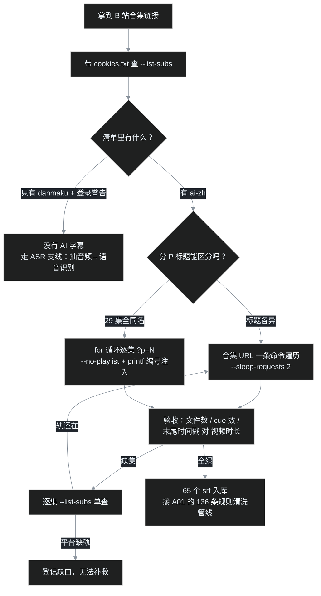

# A02｜退出码 0，但硬盘上只有一个文件：65 集 AI 字幕下载记

比报错危险得多的，是程序报告成功。

这批字幕的下载过程里，叶扬被"成功"骗了两次：一次命令干干净净退出，硬盘上却只有一个字幕文件；另一次三十多集批量拉取一路绿灯，清点时发现少了三集，而平台连一句警告都没给。

上一篇讲完 136 条规则怎么清洗字幕，这一篇往回走一步：**那 47762 行字幕，是怎么到硬盘上的。** 工具是开源的 [yt-dlp](https://github.com/yt-dlp/yt-dlp)（本机版本 2026.08.19），但 B 站这个目标给它备了好几样非标状况。

## 一、先问字幕在哪：三种形态

动手下载之前，先得搞清楚字幕到底存放在哪。叶扬对本地一个 mp4 跑了 ffprobe，流信息里只有两条：

```
Stream #0:0 Video: av1 1920x1080
Stream #0:1 Audio: aac 44100 Hz stereo
（没有 subtitle stream）
```

字幕在世界上只有三种存法，提取工具完全不同：

| 形态 | 位置 | 提取方式 |
| --- | --- | --- |
| 外挂/网络字幕轨 | 文件之外，平台 API 下发，播放器现场渲染 | yt-dlp 直接拉 srt |
| 内封字幕流 | 容器里独立的 subtitle stream | `ffmpeg -map 0:s` 无损导出 |
| 硬烧字幕 | 画进像素 | 只能 OCR |

B 站的 CC/AI 字幕是第一种：**它根本不在 mp4 里**，是一条走 API 的独立轨（`ai-zh`）。所以 ffmpeg 对它无能为力——不是参数不对，是目标不在那儿。

这又是"任务的形状决定工具"：先花两分钟看清数据在哪，省得对着 ffmpeg 调一下午。

## 二、第一次查询就被骗：未登录的假阴性

装好 yt-dlp，叶扬先按惯例查一眼这集有哪些字幕：

```bash
yt-dlp --list-subs "https://www.bilibili.com/video/BV1vewnzqEuA/?p=8"
```

返回里只有一行 `danmaku xml`，外加一条警告：`Subtitles are only available when logged in`。

这里有个高频误判：**未登录时 B 站不返回字幕轨清单，这不等于没有字幕。** `danmaku` 是弹幕——观众发的评论，不是讲课内容。接口的行为是"不给你看清单"，不是"清单是空的"。做过接口的都熟悉这种语义：401 和 404 是两回事，把"没权限看"读成"资源不存在"，后面所有决策全歪。

要看真实清单，必须带登录态。

## 三、登录态这把钥匙，以及一个等价于密码的文件

yt-dlp 吃 cookie 有两种方式。

第一种是直接从浏览器读：`--cookies-from-browser edge`。但浏览器运行时会**独占锁住 cookie 数据库**，叶扬实测五个 msedge 进程在后台挂着，读取直接报 `Could not copy Chrome cookie database`。注意 Edge/Chrome 默认允许后台常驻，点窗口右上角的 × 不够，要确认任务管理器里进程全部消失——为了下个字幕把浏览器整个关掉，代价也大了点。

第二种、也是最终采用的方式：用 "Get cookies.txt LOCALLY" 一类扩展，在 bilibili.com 页面导出 Netscape 格式的 `cookies.txt`，用 `--cookies cookies.txt` 传入。浏览器照常开，互不打扰。

文件到手后只做计数校验，**不打印内容**：

```bash
head -1 cookies.txt        # 应为 # Netscape HTTP Cookie File
grep -c bilibili cookies.txt   # 应有若干行
grep -c SESSDATA cookies.txt   # 必须为 1
```

`SESSDATA` 这一条就是登录态本体，等价于账号密码：拿到的人可以直接操作这个 B 站账号。所以纪律有三条：校验只计数不 cat、用完立刻删除、绝不放在会同步网盘的目录里。这和生产环境对待 token 的方式没有区别——凭据的价值和文件名保不保露无关。

带 cookie 再查一次，真正的清单出来了：

```
Language  Formats
danmaku   xml
ai-zh     srt      ← 有这行，零算力直取
```

## 四、合集 A：一条命令，和一次 HTTP 412

第一个目标合集 `BV1vewnzqEuA`，39 集，每集一小时上下，标题各不相同。这种"正常合集"一条命令就能遍历：

```bash
yt-dlp --cookies cookies.txt \
  --skip-download \
  --write-subs --sub-langs ai-zh \
  --sleep-requests 2 \
  -o "%(playlist_index)02d - %(title)s.%(ext)s" \
  "https://www.bilibili.com/video/BV1vewnzqEuA/"
```

参数没有一个是多余的：

| 参数 | 作用 | 省略的后果 |
| --- | --- | --- |
| `--skip-download` | 只要字幕 | 把 39 集视频全下下来 |
| `--write-subs` | 写出文件 | 只查不存 |
| `--sub-langs ai-zh` | 只要 AI 字幕轨 | 连弹幕 xml 一起拉 |
| `--sleep-requests 2` | 请求间隔 2 秒 | **大概率吃 412** |
| `-o "%(playlist_index)02d - ..."` | 编号+标题命名 | 文件名对不上集数 |
| 合集 URL（不加 `--no-playlist`） | 遍历整个合集 | 只下当前一集 |

`--sleep-requests 2` 不是礼貌加分项，是硬约束。叶扬实测连续快速打约 30 个请求后，服务器开始回 [HTTP 412 Precondition Failed](https://developer.mozilla.org/en-US/docs/Web/HTTP/Status/412)——风控的明确信号：你不像人，像脚本。加上两秒间隔，三十多集约两分钟跑完，字幕总体积只有 2–3 MB。

跑完第一次清点，怪事来了：**39 集，只产出 36 个 srt，缺 02、04、27。**

命令全程没报错。怎么办？逐集单查：

```bash
yt-dlp --cookies cookies.txt --no-playlist --list-subs \
  "https://www.bilibili.com/video/BV1vewnzqEuA/?p=2"
```

三集查完，清单里真的没有 `ai-zh`——是**平台本身没给这三集跑字幕**，yt-dlp 静默跳过了。下载失败和资源不存在，必须用独立查询区分开，否则你会把平台的缺口当成自己的故障，反复重跑一个永远不会成功的命令。

## 五、合集 B：退出码 0，文件只有一个

真正的主菜是第二个合集 `BV1DBto6DEvY`。命令几乎一样，跑完终端一片祥和，退出码 0。叶扬去目录里一看——

**只有一个文件：`NA - 印度佛教史.ai-zh.srt`。**

`NA` 是 yt-dlp 取不到 `playlist_index` 时的占位符。意思是：合集遍历根本没生效，工具把整个链接当成单个视频处理，下了一轨字幕，然后报告成功。

### 先证明它确实有 29 集

"会不会这链接本来就只有一集？"不能凭感觉，得找独立证据。用 yt-dlp 查各分 P 的时长：615.3 秒、1025.0 秒、542.2 秒、430.9 秒——四个 `?p=N` 拿到四个不同时长，铁证是多 P。

那总共有多少 P？匿名访问合集稿件接口返回 `code:62002`（稿件不可见），拿不到分页清单。叶扬的探法是**带着 cookie 二分探测边界**：依次试 p=5、8、12、16、24、32，p29 成功、p30 失败——29 集，确定。这和调试时二分定位回归区间是同一个动作：边界未知，就用对数次查询把它夹出来。

### 同名，是第二个坑

就算让遍历生效，29 个分 P 的标题还**完全相同**，都叫"印度佛教史"。输出模板里的 `%(title)s` 无法区分它们，文件互相覆盖——一个文件名被写 29 遍，最后只剩一集内容。

最终解法：绕开合集遍历，shell 循环逐集直打 `?p=N`，编号用 `printf '%02d'` 手动注入：

```bash
for p in $(seq 1 29); do
  n=$(printf '%02d' "$p")
  yt-dlp --cookies cookies.txt --no-playlist --skip-download \
    --write-subs --sub-langs ai-zh --sleep-requests 2 \
    -o "$n - %(title)s.%(ext)s" \
    "https://www.bilibili.com/video/BV1DBto6DEvY/?p=$p"
done
```

两个关键开关：`--no-playlist` 强制把每个 URL 当单集处理（配合循环，恰好与合集 A 的用法相反——同一个参数，两种场景，方向完全反过来）；两位序号解决同名覆盖。跑完 29 个文件齐全，抽查内容各不相同：01 集 219 条 cue、15 集 297 条、29 集 292 条。

整条决策链画成图：



## 六、验收：报成功不等于下全

两次"假成功"教会叶扬一件事：**批量下载必须带验收，而且验收数据要来自独立于下载工具的源头。**

每集的检查有两项：cue 条数、最后一条 cue 的末尾时间戳。后者要对得上视频实际时长：

```bash
for f in *.srt; do
  printf "%s | %s 条 | 末尾 %s\n" \
    "$f" \
    "$(grep -c ' --> ' "$f")" \
    "$(grep ' --> ' "$f" | tail -1 | cut -d' ' -f3)"
done
```

以第 8 集为例：939 条 cue，末尾 `00:56:15,150`，视频时长 56:18——差三秒，完整覆盖。

但这里有个反向陷阱：末尾时间戳"偏早"不一定是截断。A 合集的 25、28 集本身就短，只有 15:39、19:43，字幕末尾与时长一致，是完整的短集。判断"截断"之前，你必须先知道视频有多长——这就是为什么验收要引用独立数据源：yt-dlp 自己报的成功不算数，文件自己的末尾时间戳也只能算半个证据，三者对上才闭环。这和写测试一个道理：断言里的期望值不能由被测函数自己生成。

顺带一提，这批字幕后来还查出一个更隐蔽的"元数据级意外"：39 集那套第 25 讲之后是重录版，多集对应前面的内容——这种结构问题只有把语料整体拉通才看得见，细节在 A01 里讲过。

## 七、旁支：Git Bash、ffmpeg 与中文路径

下载本身没撞上这个坑，但 ASR 支线会，先记下来：在 Git Bash 里让 ffmpeg 处理中文文件名，会报 `Invalid argument`。原因是 Git Bash 按 UTF-8 传命令行参数，ffmpeg 是原生 Win32 程序，按 ANSI 解码，两边对不上。

绕过办法是临时把文件改成 ASCII 名，处理完再改回来；还原命令前用 `;` 不用 `&&`，保证无论前面成败改名都一定执行。而 yt-dlp 是 Python 程序，走的是宽字符 API，中文路径全程没事——**同一个文件名，在不同运行时眼里是两种字节序列**，这类问题不搞清原理，重试一百遍也是同样的错。

## 八、没有 ai-zh 的那 30 集

第三套课程是李元祥《印度佛教史》（`BV1dt4y1m7FK`，30 集，2020 年前后的老视频）。p1–p4 和 p30 全查过，清单里一律只有 `danmaku`——平台当年没给它跑 AI 字幕，yt-dlp 这条路彻底走不通，只剩自己做语音识别：

| 引擎 | 适用场景 |
| --- | --- |
| [faster-whisper](https://github.com/SYSTRAN/faster-whisper) | 有 N 卡首选，比原版快约 4 倍 |
| [whisper.cpp](https://github.com/ggml-org/whisper.cpp) | 纯 CPU，Windows 有预编译 exe，无 Python 依赖 |
| m-bain/whisperX | 要词级时间戳/说话人分离 |
| [FunASR](https://github.com/modelscope/FunASR)（SenseVoice） | 中文讲座，标点与识别常优于 whisper |

抽音频用 [ffmpeg](https://ffmpeg.org) 转 16kHz 单声道 wav 即可。另有一个针对术语课的关键技巧：把"补特伽罗""犊子部""摩揭陀"这类词喂给引擎当热词（whisper 系用 `--initial_prompt`/`hotwords`，FunASR 用热词表），识别率会肉眼可见地好一截——巧的是，那套课的下载清单里每集标题本身就是现成的术语表。

这场仗还没真打（本机是 CPU 环境，大概率走飞书妙记或 whisper.cpp），所以这篇只给地图，不写战报。

## 急诊室

- **`HTTP Error 412`**：请求太勤被风控。加 `--sleep-requests 2`，已经被拦就停几分钟再继续。
- **`Could not copy Chrome cookie database`**：浏览器锁着 cookie 库。完全退出浏览器进程，或改用扩展导出的 cookies.txt。
- **`Subtitles are only available when logged in`**：cookie 缺失或过期，重新导出。
- **只得到一个 `NA - xxx.srt` 还报成功**：同名分 P，合集遍历失效。上 `--no-playlist` 循环加 `printf %02d` 编号。
- **文件数比集数少**：逐集 `--list-subs` 单查，先分清是平台缺轨还是下载失败——别为重不了的东西写重试。
- **cue 末尾时间戳偏早**：先查视频真实时长再下结论，短集不是截断。
- **ffmpeg `Invalid argument`（中文路径）**：Git Bash 与原生 Win32 的编码错位，临时 ASCII 文件名绕过；yt-dlp 不受影响。

## 写在最后

退出码 0 是程序能给出的最便宜的承诺。它只说"我这边没出错"，从来没说"你要的东西齐了"。

这一趟下载里真正值钱的动作，没有一个是 yt-dlp 替叶扬做的：识别假阴性、二分探出 29 集边界、发现同名覆盖、拿视频时长反查字幕完整性。工具负责搬字节，人负责定义什么叫"完成"。

等那 30 集老课的语音识别真跑完，A03 再交 ASR 支线的战报。

> 说明：课程字幕仅供个人学习使用，不发布、不再分发；cookies.txt 用完即删。本文流程对 B 站任何带 AI 字幕的合集都适用，请把节奏放慢，对平台的服务器友好一点。
