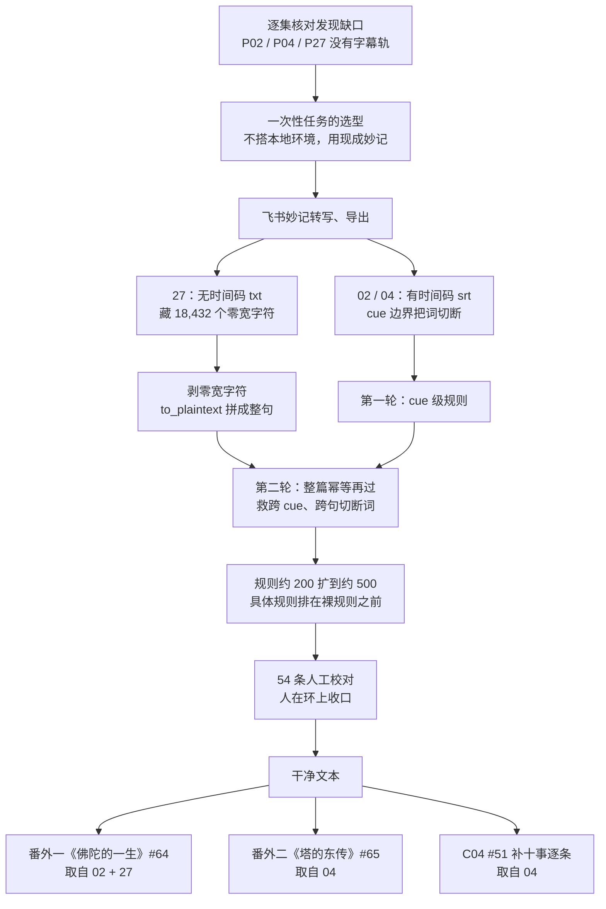

> 这是叶扬「AI 工作流」系列第三篇。前两篇讲了两条线：[A02 下载篇](/post/44.html) 怎样把平台上的字幕逐集取回来，[A01 清洗篇](/post/43.html) 怎样把四万八千行脏文本洗成可阅读的版本。这篇补的是整条流水线里最别扭的一环——有三集，平台上压根没有字幕轨，文本得自己造；而造出来的东西，离"能用"还隔着一整篇文章的距离。

## 小白问题：转写不就是一键导出的事吗？

视频传上飞书妙记，自动转写，转完导出 srt——听起来是一条直线，五分钟的事。

那为什么这三集补档，最后折腾出 fix_subs.py 从三轮扩到五轮、规则从约 200 条涨到约 500 条，还连带写出两篇番外？

因为"导出"两个字背后，藏着三件一键服务不会替你处理的事：**导出来的文本里有看不见的字符、有的导出通道连时间码都没有、好好一个词会在两句话的接缝处被切成两半。** 转写引擎负责把声音变成字，但"变成字"和"变成能用的文本"之间，还有一公里。这篇文章讲的就是这一公里。

## 一、先说时间线：清洗篇先发，原料后补

按流水线的逻辑顺序，这一篇本该排在 A01 前面——先有脏文本，才谈得上清洗。实际发生的顺序恰好反过来，这里先交代清楚，免得后面读着拧巴：

- 9 月 18 日，[A01 清洗篇](/post/43.html) 先发，处理的是 65 个平台自带的 AI 字幕；
- 也是那两天，[A02 下载篇](/post/44.html) 做逐集核对时发现：主课 39 集里，**P02、P04、P27 三集根本没有字幕轨**。清单上差三集，没有任何取巧的下载办法——yt-dlp 只能取到音频，要文字，只剩自己转写；
- 9 月 20 日，三集转写稿补档到位。清洗管线临时扩容接货，当天处理完；
- 接下来两天，三集内容全部变现：两篇番外加一处补遗。

换句话说，A01 里那套规则不是一次写完的——**有约 300 条规则，是借着这次补档、两天内扩充出来的。** 这篇文章讲的就是逼出这些规则的全过程。

## 二、选型：一次性任务，别自己造轮子

发现缺口之后，第一个问题不是"用什么模型转写"，而是"**这事儿值不值得搭一套环境**"。

A03 原本的规划，是四引擎本地部署实测：whisper.cpp、FunASR 之类，一个一个编译、部署、跑对比。这是重型方案，它真正适合的场景是三个条件同时成立——**长期有音频、批量要转写、内容隐私敏感不能出本机**。而眼前只是三集的一次性少量缺口，三个条件没有一个完整，为它搭环境，纯属给自己找活。

把市面上的路子摊开看，一次性任务其实有一堆省事的选择：

| 方案 | 成本 | 省事程度 | 隐私 | 主要的坑 |
|---|---|---|---|---|
| 飞书妙记 | 免费（占存储额度） | ★★★★★ | 音频上传云端 | txt 导出带零宽字符、有时无时间码 |
| 剪映专业版 | 免费、跑在本地 | ★★★★ | 不出本机 | 批量要逐集手动操作 |
| Whisper API | 约 $0.006/分钟（以官网价格为准） | ★★★★ | 音频上传云端 | 要 API key、网络要通 |
| gpt-4o-mini-transcribe | 更低价档位（以官网为准） | ★★★★ | 音频上传云端 | 同上 |
| 通义听悟 | 注册送时长、有免费额度 | ★★★★ | 音频上传云端 | 长音频受额度限制 |
| 国内 API 平台（如硅基流动一类） | 多有免费额度、可直连 | ★★★ | 上传云端 | 长音频要自己切片 |
| FunASR / whisper.cpp 本地部署 | 免费、吃自己机器 | ★★ | 不出本机 | 编译、模型选型、批量都要自己管 |

（表里的价格是写作时的约数，各家调整频繁，真要付费下单前以官网实时价格为准。）

这张表能给出一个比"选哪个"更有用的判断框架：**先问这批转写有没有下游，再在"省事"那一列里选第一个够用的。** 一次性任务，用钱和现成服务买时间；长期、批量、要隐私的任务，才值得自建。

具体到这三集：飞书妙记已经用顺手了，日常中文转写质量可靠，免费，导出 srt 也是现成功能——专名错得有多离谱，是后面才领教的。没有理由换。于是三集音频传上去，转写，导出。

到这一步为止，确实只用了五分钟。"顺手"也正好到此为止。

## 三、妙记交来的是三种"半成品"

导出的三份文件打开一看，是三种不同的形态，每种带各自的毛病。

**第一种，02 和 04：有时间码的 srt。** 文件名带着 `_原文.srt` 的后缀，时长分别约 72 分钟和 67 分钟，cue 结构齐整，每一条都有时间戳——这是最接近"成品"的一种。但逐行读下去会发现：**词常常在一个 cue 的边界被切断**，上半句结尾和下半句开头各挂半拉字，因为转写切 cue 是按声音停顿走的，不管语义边界在哪。

**第二种，27：没有时间码的纯文本 txt。** 这是妙记的另一种导出通道，整份文件是连续的大段句子，没有 cue、没有任何时间戳。好处是读起来连贯，坏处是管线里原来所有按 cue 处理的逻辑——逐条修、逐条计数——全部用不上，得为它单独开一个通道。

**第三种，还是 27 的 txt：里面藏着 18,432 个零宽字符。**

这是三份文件里最阴的一个。所谓零宽字符，是 U+200B 起这一类**占位但不显示**的 Unicode 码点（文件里还混着 BOM、FEFF 一类不可见标记）。它们在任何编辑器里都看不见——屏幕上是干干净净的句子，光标扫过去才会发现有的"字缝"要多按一下方向键。可正则匹配会被它们打断，"比丘"两个字中间夹一个零宽空格，匹配"比丘"的规则就整条失效；字数统计也被灌水，统计出来的字数凭空多出一截。**18,432 个，一个不少地藏在文本里，肉眼一个都看不见。**

三种形态摆在一起：

| 产物 | 导出通道 | 时间码 | 特殊污染 | 进入管线的入口 |
|---|---|---|---|---|
| 02 | srt | 有 | cue 边界切断词 | cue 级处理 |
| 04 | srt | 有 | cue 边界切断词 | cue 级处理 |
| 27 | txt | 无 | 18,432 个零宽字符 | 先剥字符、再走整篇通道 |

到这里能看清一件事：**转写引擎的工作止于"把声音变成字"，而"字"不等于"文本"。** 格式不一、污染隐形、边界破碎——这些一键服务不管，只能在接入层自己接。

## 四、管线改造：三轮扩五轮，规则约 200 涨到约 500

三集补档不能手工处理——不是三集改不起，而是改完必须和前面 62 集口径一致，还得留下可复核的修正记录。于是清洗管线 fix_subs.py 开始扩容。

**第一件事是给无时间码 txt 单独开门。** 原脚本的结构是按 cue 逐条处理，对连续文本无从下口。改造后 main() 新增一条通道：先剥掉零宽字符，再把整篇文本当作一个整体走规则；同时在命名上兼容 `_原文.srt` 这种新后缀，让脚本能认出补档文件。

**第二件事是新增"txt 整篇二轮"，专门救被切断的词。** 这是本次扩容里最关键的设计。流程是这样：

1. 第一轮：cue 级逐条过规则，该修的修；
2. 随后用 `to_plaintext` 把所有 cue（或整篇 txt）拼成完整句子；
3. 第二轮：同一套规则在完整句子上**再幂等地过一遍**。

为什么必须有第二轮？因为大量切断发生在 cue 与 cue 的接缝处——"斯陀"在一条 cue 末尾，"含"在下一条开头，逐条处理时两边都不构成完整词，规则认不出来。一旦拼成整句，"斯陀含"三个字凑齐，规则立刻命中。第二轮能成立的前提是所有替换都设计成**收敛映射**：只把错词改成对词、且对词不会再被别的规则改动，因此多跑几遍结果相同，幂等安全。

**第三件事是规则本身的扩充。** 从约 200 条涨到约 500 条，分两次加：第四轮约 170 条，是对着全语料做词频统计核查后补的高频模式——律藏、部派、佛传这一类反复出现的专名；第五轮约 130 条，是通读三集补档后收拾的残留。

规则多了，新麻烦立刻就来了——接下来这两个"血案"，都是规则自己制造的事故。

### 血案一：一条全局替换，误伤了一个果位

清洗语料里"湿婆"这个词经常被 ASR 误成相近发音，于是写了一条全局裸规则：`狮驼 → 湿婆`。规则一跑，全语料扫描，抓到一个意想不到的受害者——**二果"斯陀含"**。

斯陀含（sakṛdāgāmin）是声闻修行的第二个果位，ASR 转写成了"狮驼含"三个字。裸规则不管上下文，见"狮驼"就换，"狮驼含"当场变成"湿婆含"——一个哪部经里都不存在的词。一个果位，就这么被一条清洗规则抹掉了。

救法是补一条更具体的规则：`狮驼含 | 湿婆含 → 斯陀含`，并且**必须排在裸"狮驼"规则的前面**。规则匹配永远是"具体的先于宽泛的"，先把三个字的果位捞出来，剩下的才交给裸规则。全语料 grep 复查，确认误伤仅此一处，救回之后再无"湿婆含"。

### 血案二：又一条裸规则，杀掉了科学语境的真词

类似的坑第二度出现。ASR 常把"羯磨"转成"梯度"，于是又写了裸规则 `梯度 → 羯磨`。一跑才发现，课程里讲到科学话题时，**"梯度"是个正经真词**——坡度、变化率，本意如此，全被换成了"羯磨"。

这条裸规则整个作废，降级成**长短语规则**：只有"梯度结摩""梯度呃"这种明显是 ASR 噪声的完整短语才替换，单个"梯度"一律不碰。

吃过两次亏之后，反过来排查同类裸规则，把确认安全的挑出来：`摩羯 → 摩揭陀`（全语料没有星座语境）、`实物上 → 实务上`（抽查 11 处全部成立）、`出嫁 → 出家`（全真）。每一条都先 grep 全语料确认没有别的受害者，才敢保留。

还有一类更绕的事故叫**产物串自伤**：A 规则的输出，转手被 B 规则再咬一口。比如某条规则把文本改成"比丘介丘尼界"，后面的规则又把这个中间产物当成错词再改一遍，越改越花。这类救回规则——`比丘介丘尼界 → 比丘比丘尼戒`、`八大乘地 → 八大圣地`、`湿婆含 → 斯陀含`——统一放在每一轮的**最前面**，先把上一轮可能造成的伤口包扎好，再跑正式规则。

### 监视词瘦身：75 条降到 54 条

脚本里有一张 RE_SUSPECT 监视词清单，专抓"看着就可疑"的残留，供人工最后过一遍。规则扩了，可疑条目反而该变少——因为很多原来挂可疑的词，现在有确定规则直接修掉了。这次把高误报的监视词删了一批：删"为世"（因为"世尊"总被误报）、"金经"（金刚经）、以及"绿点""阿森""阿罕""休息""步派"这一批已消化或常误报的词。需人工校对的条目从 75 条降到 **54 条**。

另有 335 条中英混排——句子里夹着 YouTube、Google、3D 一类英文词——大多是转写时保留的口头表达，不是错误，不强求归零。

这里有个验收口径要讲明白：**这些转写稿是阅读源，不是发布物。** 要做到的是核心专名——人名、地名、部派、经名、果位——准确到位，读起来不被噪声绊倒。54 条需校对条目收敛即可；至于严重失真的口语串、口头赘语，刻意不修，修了反而浪费规则。

## 五、下游：三集补档，两天全部变现

清洗完的文本没有躺在文件夹里。两天之内，三集内容按题材分流，全部变成了文章：

- **02 和 27 讲的是佛传**——诞生、苦行、转法轮、最后游化，合起来写成番外一《佛陀的一生》（[#64](/post/64.html)），核心框架是佛传叙事的四个层级；
- **04 讲的是结集、部派和塔**，塔的一条线写成番外二《塔的东传》（[#65](/post/65.html)）；
- 同样是 04 里带出的"十事"名目，顺手补进 C04《僧团为什么吵分裂》（[#51](/post/51.html)），把原来只写了一条金银净的段落扩成十事逐条。

同一次补档，三集，没有硬塞进一篇文章，而是**按题材路由到三个选题**——两篇新番外加一处旧文补遗。原料的利用率，这是这轮补档里最让叶扬满意的一笔。

整条补档到变现的流程：

## 六、一个程序员类比：对接一个"脏 API"

这套流程，程序员同行大概都见过——**对接第三方回调**。

对方文档白纸黑字写着：标准 JSON，UTF-8 编码，字段齐全。真接到生产环境里，来的数据是另一回事：编码声明是 UTF-8，内容里混着 BOM；字段名对得上，值里夹着零宽空格；有的字段说有，长度一长就被截断。你改不了对方服务，也等不来对方修，唯一的办法是在接入层做**防御性解析**：先剥掉不可见污染，再按规则修字段，修完断言字段数量和格式，全过了才敢往下游传。

txt 里那 18,432 个零宽字符，就是这种 bug 最典型的样子——日志里看字符串好好的，一 parse 就炸，不把字符一个个打印成码点，根本不知道敌人藏在哪。cue 边界切断词，对应的则是流式接口常见的半包粘包：一整包数据分两次到，第一次只有半句话，你不能拿到半包就处理，得等拼齐了再解析。txt 第二轮"拼完整句再跑规则"，干的正是这件事。

不写代码的读者，可以这么理解：网上买"净菜"，商品页写着已洗好切好，开袋一看，里面还混着包装碎和没冲净的泥。真正花时间的不是炒菜，是收货验收和二次冲洗——这篇文章讲的全是冲洗的工序。

照例自己戳三个洞：

1. **防御性解析救得了格式，救不了内容。** 零宽字符能剥，切断词能拼，但转写本身把某个专名认错了、规则又没覆盖到，再严实的解析也拦不住——这就是最后还留 54 条人工校对的原因，人在环上不是偷懒没自动化，是刻意留的防线；
2. **规则越多越脆。** 血案一和血案二都是规则自己造的事故：清洗工具本身变成了新的污染源。所以每加一条裸规则，先 grep 全语料找受害者，这道工序省不掉；
3. **这套管线只在 65 集的规模下才值。** 真要是只有三集音频，一个下午手工改完，写脚本扩规则的时间够手工改十遍。规模决定方案，这一点下面吵架现场展开。

## 七、吵架现场

**这三集，手工改是不是更快？——过度工程之辩。**

反方理由很实在：三集音频，几个小时的文本，熟练的人坐在那儿一个下午就改完了。写脚本、调规则、grep 排查误伤、再处理规则自己制造的血案——折腾这些的时间，够手工改十遍。为三集做这么一套，是典型的过度工程。

正方的回应是：规则是资产，不是一次性消耗。这次加的约 300 条规则，处理的不只是三集——全语料里同类型的残留被一并修掉，未来再补任何一集，脚本现成、口径一致。手工改三集当然快，但手工改无法保证和前面 62 集的用词统一，也留不下可复核的修正记录；而脚本每改一处，都有据可查。**判断该不该写脚本，不看眼前这一单的量，看同类活儿总共会有多少。**

**免费的云端服务，到底图什么？**

第二场争论围绕着妙记本身。服务免费、好用、中文质量高，但导出的 txt 里带着 18,432 个隐形字符、有的通道连时间码都不给。这是产品的无心之失，还是有意为之——比如防文本被轻易搬运、给导出物做可追踪的标记？两派都只能猜，没有官方说法能坐实。能确定的是：**免费产品的边界划在哪，用户就得在边界外自己补多少**，选型时"坑"那一列的价值就在这里。

**把音频传上云端，合适吗？**

第三场是隐私。个人学习用的课程音频，上传到飞书妙记换省事，这笔交易对叶扬成立——内容不涉密、不涉及别人的隐私。但同样的选择搬到公司材料、客户录音、未公开会议上就不成立，那种场景只能回本地方案。选型表里特意留了"隐私"一列，因为**省事与否是同一套答案，能不能传是另一道题**，两道题分开答。

## 八、叶扬的卡壳角

**1. 零宽字符到底是不是故意的？** 18,432 这个数量整齐、分布均匀，看着像有意嵌入；但导出 srt 又不带这些痕迹，又像只是 txt 渲染管道的无心产物。查不到官方说明，就只能老老实实描述现象、按现象处理，不把猜测写成结论。工程上"不知道为什么"不丢人，把不知道的东西讲成确定的，才会出事。

**2. 为什么 54 条不继续加规则吃掉？** 理论上，每一条人工校对项都可以再写一条规则硬修。实际上规则越多，边际收益越低——越往后的规则越生僻、越依赖上下文，也就越容易制造新的血案。54 这个数字不是没能力继续压，是**刻意给人留的位置**：自动化负责大规模的、确定的收敛，人负责罕见的、要判断的最后一层。这个分工是设计出来的，不是自动化没做完的残留。

**3. 那 30 集没有字幕的课，到底还转不转？** [A02 下载篇](/post/44.html) 结尾留过一笔：另有李元祥的 30 集课程（BV1dt4y1m7FK），平台上只有弹幕，整门课都需要自己转写。现在答案明确了：**没有下游的原料，不值得生产。** C 系已经完结，这门课没有配套的写作或制卡计划，把三十来个小时的音频全部转写出来，只会让文件夹多一批没人读的文本。工具备着、选型表摆着，哪天真有了下游——要做笔记、要制卡——再花点小钱用现成服务跑一遍，一个周末的事。**先找下游，再造原料；不为工具找活。**

## 术语表

| 术语 | 大白话 |
|---|---|
| ASR | 自动语音识别，把声音自动转成文字的技术 |
| 飞书妙记 | 飞书的音视频转写工具，上传后自动出文字稿 |
| srt | 最常见的字幕文件格式，每条文字带进出时间码 |
| cue | 字幕文件里的一条：一段时间码配一句文字 |
| 时间码 | 每句字幕对应的"几分几秒到几分几秒" |
| 零宽字符 | U+200B 一类占位置、但屏幕上完全不显示的字符 |
| BOM / FEFF | 文件开头或文本里的一种不可见标记，常混在导出文本中 |
| 跨 cue 切断 | 一个词正好被分到两条字幕里，一半在尾巴、一半在下一条开头 |
| 收敛映射 | 替换只把错的改成对的，结果稳定、重复执行不会变样 |
| 幂等 | 同一操作跑一遍和跑十遍结果相同 |
| 热词 | 提前告诉转写引擎的专有名词，帮它认得更准 |
| Whisper | OpenAI 的语音识别模型，有本地版也有按分钟计费的 API |
| 防御性解析 | 不相信外来数据完全合规，接入时先查错、清洗再使用的做法 |
| 人在环上 | 自动化处理大头，关键判断保留给人把关 |
| 半包粘包 | 流式数据分多次到达、半句先来的现象，要拼齐再处理 |

## 收尾

这三集补档最有价值的不是又拿到三集文本，而是逼出了一条经验：**"转写完成"四个字只代表声音变成了字，从字到能用的文本，中间有隐形字符要剥、有接缝要拼、有规则自身的事故要防。** 这一公里走通之后，整条流水线才算真正闭环——不管字幕是平台给的，还是自己造的。

下一篇待定。候选池里摆着一个干净文本的新下游：**Anki / FSRS 自动制卡**——把转写稿里的专名和问答自动生成记忆卡片。等真做起来，再带数字回来更新 [A00 总览](/post/46.html) 那张表。
