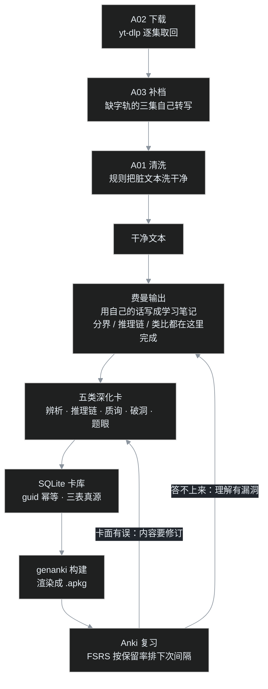

> 这是叶扬「AI 工作流」系列第四篇。[A02 下载篇](/post/44.html) 把课程字幕逐集取回，[A03 补档篇](/post/66.html) 给三集缺字轨的课程造了文本，[A01 清洗篇](/post/43.html) 把四万八千行脏文本洗成了干净版本。流水线走到这里，原料齐了——然后呢？这一篇回答的是整条链路上最后、也最少被认真对待的一段：**干净文本不会自己跑进脑子，从"硬盘里有"到"几个月后还记得"，中间差着一整套工程。**

## 小白问题：写个脚本从文本里自动抽问答，记忆这件事不就自动化了？

文本是干净的，名词术语都在里面，写个脚本（或者让大模型）扫一遍，把"什么是 X""X 有哪几类"抽成问答卡，导入记忆软件——听起来十分钟收工，全自动，闭环了。

叶扬一开始也是这么想的。卡做出来了，三十二张，导入手机，每天复习。用了一阵之后感觉微妙：**每张卡都答得上来，但脑子里像存了一柜子标签，线团在旁边，没有一根穿进去。** 能背出"八不"是哪八个，被问"八不否定的到底是什么生灭、现象的生灭还成不成立"，当场卡住；能默写阿赖耶识的定义，被问"它和灵魂到底差在哪"，只能重复定义里的字。

卡是好卡，软件也是好软件，问题出在更上游：**这套流程自动生成的，只是"字符串的背诵"，不是"理解的提取"。** 这篇文章讲的，就是叶扬怎么把这套记忆系统拆掉重做——做什么原料、切什么卡片、存什么数据库、用什么算法排复习，一路到真正的闭环。

## 一、先给旧卡做一次代码审查：它们全卡在 Bloom 第一层

动手改之前先诊断。旧卡三十二张：二十张问答、十二张填空，全部来自对干净文本的直接抽取。

教育心理学里有一把现成的尺子，叫 **Bloom 认知层级**（Bloom's taxonomy；1956 年提出，2001 年修订版把六层定为记忆—理解—应用—分析—评价—创造）。它描述的是"认识一个东西"由浅到深的六个层次，越往上越接近"能用出来"而不是"见过"。

拿这把尺子量旧卡，结果非常整齐：

| 旧卡的典型问法 | 实际训练的层级 |
|---|---|
| 什么是阿赖耶识？ | 记忆（复述定义） |
| 八不是哪八个？四谛是哪四谛？ | 记忆（列举） |
| 唯识三祖是谁？ | 记忆（人名） |
| 十二缘起的顺序是？ | 记忆（顺序） |

**三十二张卡，全部停在第一层"记忆"，没有一张测试理解以上的东西。** 这解释了那种微妙感：每天复习都在通过，通不过的考题生活照样出——因为生活出的题在第三层、第四层。

诊断到这里，顺手排掉第一个直觉方案："那把卡的背面写长一点、解释多放一点，不就深了吗？"——没有。长背面增加的只是**背诵量**：原来背三十字，现在背三百字，考的仍然是"复述"，认知层级一层没动。深化要改的不是答案的长度，是**提问站在哪一层**。

## 二、换原料：制卡的输入不该是原始文本，而是已经完成的理解

为什么"自动抽卡"注定只能抽出第一层卡？看看输入里有什么。

原始文本（即使是干净的）里显式存在的信息，只有名词、定义、列举、顺序——"阿赖耶识是……""八不是……""三祖是……"。脚本和大模型再能干，也只能抽取文本里**已经写在面上**的东西。至于"阿赖耶和灵魂怎么区分""被人反驳说这就是灵魂改个名该怎么接""checkpoint 的比喻哪里会误导人"——这些东西在原始文本里不以成品形态存在，它们是**学习者要自己做出来的理解**，抽不出来。

所以重做的第一步不是改卡片，是往流水线中间加一道工序：

```
干净文本  →  费曼输出（用自己的话写成学习笔记）  →  从定稿笔记压缩成卡片
```

费曼学习法（Feynman Technique）的操作不复杂：学完一段，合上书，用自己的话把它讲出来，讲不顺的地方就是没懂，回去补，再讲，直到顺。叶扬把这门 39 讲课程的费曼输出做成了一个学习笔记系列，十七篇，每篇都要求自己用大白话把概念讲透，并且配一个程序员同行一看就懂的类比。

关键在顺序：**写费曼笔记的时候，第三层、第四层的活儿已经干完了。** 分界是怎么划的、推理是怎么一步步走的、反方会怎么打、类比的洞在哪——全在定稿里。这时候再做卡，不是从原始文本里抽取不存在的东西，而是把**已经完成的高层思考切成小块**。同样是做卡，输入换了，输出的认知层级整个抬上去。

程序员对这个局面不陌生：从源码里自动提取所有标识符拼测试用例，跑出来覆盖率报表很好看，但测的全是 getter/setter，行为逻辑一行没测；按规格和行为去写测试，每一条才真的在断言"系统做对了没有"。制卡同理——**先有理解的规格，才有值得切的卡。**

## 三、五类深化卡：把理解切成最小、可判分的断言

原料对了，接下来是切法。叶扬给自己定了两条卡的验收标准，跟写单元测试一个道理：

- **最小**：一张卡只考一个点，不写小作文；
- **可判分**：有明确的对错，复习时零点几秒能判定自己过没过，不搞"言之有理即可"。

按这两条标准，把定稿笔记里的理解拆成五类深化卡，另加一类经典比喻卡：

| 卡型 | 问的是什么 | 例子 |
|---|---|---|
| ① 分界辨析卡 | 两个像的东西，分界线划在哪 | "空（无自性）"和"什么都没有（恶取空）"的分界线是什么？ |
| ② 推理链填空卡 | 挖掉推理词，考"为什么" | "恰恰因为{{c1::\_\_\_}}，种子才发芽、人才改变、修行才成佛" |
| ③ 反方质询卡 | 给一个真实的反驳，请你接 | "闭眼朝悬崖走十步试试？既然万法唯识，变张桌子出来看看？" |
| ④ 类比破洞卡 | 先写类比怎么对应，再戳洞 | checkpoint 类比对应阿赖耶的哪三面？它又有哪三个破洞？ |
| ⑤ 题眼卡（一篇一张） | 表面在问什么、真正交付什么 | 这一篇表面在问"立阿赖耶是不是开倒车"，真正要交付什么？ |
| 经典喻卡 | 古老比喻里压缩的论证 | "一切种子如瀑流"同时说出了阿赖耶的哪两面？ |

逐类看为什么它们落在 Bloom 高层：

**分界辨析**是分析层的活儿——"空"和"恶取空"字面像，得拆开两者的定义边界才能答；答"阿赖耶 vs 灵魂"要列出四条界线（常与无常、一与多、定命与可改、终局相反），这是从记忆里调名词完全不同的操作。

**推理链填空**挖的不是名词是逻辑关节。普通填空卡"八不是\_\_"背得出来就过；推理链挖的是"因为无自性，所以才\_\_"——得让推理在脑子里真跑一遍。做这类卡有个细节：同一张卡里可以挖多个空，Anki 会按空拆成多张卡片，一个推理链从几个位置考。

**反方质询**是应用层：给你一个现场（往往还挺咄咄逼人），要把学过的东西调出来组织成回应。课程里学到的每个概念，叶扬都尽量找一个最狠的问法写进卡里——"悬崖派""灵魂马甲论""贝克莱主教"，平时接得住，考试（和争论）时才不慌。

**类比破洞卡是程序员特供**，也是这套卡里叶扬最看重的一类。类比帮助理解，但每个类比都在撒谎：checkpoint 是物质文件，阿赖耶不是大脑里的东西；监控仪表盘背后有真实服务器，圆成实却不是"现象背后的另一个实体"。一张卡正面写"类比怎么对应"，背面必须自己戳破洞——**理解一个类比的边界，才算真的理解了这个类比**，否则就是把比喻当结论。

**题眼卡一篇只配一张**，问"这一篇表面在问 X，真正要交付的 Y 是什么"。它训练的是抓主旨：读完一篇（或学完一讲）合上材料，一句话说出它到底在解决什么问题。这是评价层的动作，也是费曼输出时最难的一步——答得出题眼，说明这一篇在你这儿是一个整体，不是一堆散名词。

数字记账：这套卡从 C03 一篇样板（20 条笔记、27 张卡）起步，验证好用之后铺到 C06 龙树中观（40 条、66 张）和 C07 唯识（60 条、100 张），加上保留的三十二张旧卡，全库 **152 条笔记、246 张卡**。

## 四、内容工程：SQLite 当真源，genanki 当渲染器

卡片上了规模，新的麻烦从"学习问题"变成了"工程问题"。

早期卡存在两个 CSV 里，想改一处表述，得在表格里肉眼定位；想知道某张卡属于哪一讲，靠翻行；同一句话不小心导入两次，重复卡得复习时才发现。干过程序员的对这个症状太熟了——**内容和表现焊在一起、没有唯一主键、没有幂等保证**，数据量一小就乱，量一大必崩。

重构的思路没有任何新意，是写了几十年的老模式：**数据与表现分离**。

**真源用一个 SQLite 数据库，三张表：**

```sql
notes (guid, deck, note_type, front, back, source, mix, link, source_post)
tags  (id, name)
note_tags (note_id, tag_id)   -- 多对多
```

- `notes` 是卡片笔记本体：问答卡存正面背面，填空卡存带挖空标记的文本，外加出处、易混点、关联、来源篇目；
- `tags` 与 `note_tags` 是多对多的标签关系——一张卡可以同时是"辨析卡"和"空义链"，删标签不影响笔记本体；
- 每条笔记有一个确定性 **guid**（全局唯一编号，由卡片内容哈希得到），写入用 upsert：同一个编号，存在就更新、不存在就插入。效果是**整套种子脚本跑一遍和跑十遍结果完全相同，绝不产生重复卡**——幂等，跟清洗管线里"收敛映射"是同一条纪律；
- 牌组名字里的 `::` 表示层级，Anki 会自动渲染成父牌组和子牌组。

**渲染交给 genanki**（一个生成 Anki 牌组文件的 Python 库），它只负责把数据库里的记录灌进牌组文件：模型（字段、卡片模板、样式）、牌组、笔记三样东西打包成 `.apkg`。它是构建器，不是真源——删掉重新跑一遍，文件原样回来。

整套工程四类脚本，分工干净：

| 脚本 | 职责 |
|---|---|
| `cards_db.py` | 数据库 schema、连接、upsert、统计 |
| `seed_cards.py` | 读旧卡 CSV 与各篇种子，幂等灌库 |
| `build_cards_c03/c06/c07.py` | 各篇的卡片数据；c06/c07 自带 register 入库 |
| `build_apkg.py` | 从数据库渲染出最终 `.apkg` |

一个细节解释笔记数和卡片数为什么不一样（152 笔记 → 246 卡）：填空笔记一条里往往挖好几个空，Anki 按空拆卡，每个空是一张独立卡片；这正是前面说的"一个推理链从几个位置考"。

这套架构写博客的同行大概会觉得眼熟：**一个内容数据库加一个静态构建器**，数据是 Markdown 还是 SQLite、构建产物是 HTML 还是 apkg，结构一模一样。它带来的好处也一样：改内容只动真源，产物随时整体重建，每一次增删都有脚本和版本控制可审计。卡片库从此不是"两个越来越不敢碰的表格"，是一套可以放心改的系统。

## 五、间隔重复的数学：为什么"快忘了再复习"不是玄学

卡的问题解决了，剩下最后一个问题：**什么时候复习？**

每天把 246 张卡全过一遍，时间先扛不住；考前集中刷一遍，考后一周清零——这是绝大多数人背过就忘的标准剧情。记忆软件给出的答案是"间隔重复"（spaced repetition）：**在快要忘掉、但还没完全忘的时候复习，间隔越拉越长。** 这听起来像经验之谈，背后其实是一百四十年的实验和几代算法。

### 遗忘曲线：艾宾浩斯，1885

最早把"遗忘"当成可测量现象的是德国人艾宾浩斯（Hermann Ebbinghaus），1885 年出书。实验对象就是本人：背一批无意义音节（为了排除已有知识的干扰），隔不同时间再背，测量"重新背会要省多少力气"。结论画成曲线就是著名的遗忘曲线——**记忆随时间先快后慢地衰减**；同批实验还发现，分次学习比集中学习记得牢，这叫间隔效应。心理学能做定量实验，从艾宾浩斯开始。

后来的研究又补上两块：**主动回忆**（active recall，从脑子里往外掏比从外面往里灌有效）和**测试效应**（testing effect，考一遍的记忆效果好比重读一遍）。间隔复习卡这个形式之所以成立，是因为"先想再翻看答案"这个动作同时占了这两条。

### SM-2：一个乘数启发式，1987

1987 年，波兰人 Wozniak 为 SuperMemo 设计了 SM-2 算法，这是后来所有记忆软件调度的祖师爷，规则简单到可以手算：

- 每张卡带一个 **EF**（ease factor，难度系数），初值 2.5，最低 1.3——数字越大表示越好记；
- 第一次复习间隔 1 天，第二次 6 天，之后是 `上次间隔 × EF`；
- 复习时打 0–5 分：低于 3 分算没记住，间隔推倒重来；3 分以上按上面的公式走，EF 再根据评分微调（评分越低，EF 掉得越多）。

用程序员的话说，SM-2 是一个**反馈调节的乘数控制器**：记住了就把间隔乘大，没记住就重置，卡越顺手乘数越大。粗糙，但意外有效，Anki 的早期调度就是它的改型（加入了新卡的学习小步、及格"毕业"、遗忘后重学这些机制）。

### FSRS：直接给记忆状态建模

SM-2 有个绕不开的短板：EF 是个凑出来的经验数字，它不描述"记忆现在到底是什么状态"，间隔靠乘法外推，预测"我到哪天大约会忘"全凭手感。2022 年，开源社区拿出了新一代算法 **FSRS**（Free Spaced Repetition Scheduler；研究基础来自墨墨团队发表在 KDD 2022 和 TKDE 2023 的两篇论文，Anki 从 23.10 版起内置），思路直接得多：**不给规则，给记忆建状态模型。**

FSRS 用三个量描述一张卡此刻的记忆状态：

| 变量 | 含义 |
|---|---|
| **S 稳定性**（Stability） | 记忆有多牢；定义为"可提取性掉到 90% 时经过的天数"，S 越大，忘得越慢 |
| **D 难度**（Difficulty） | 这张卡本身有多难记，范围 1–10，复习后向均值回归 |
| **R 可提取性**（Retrievability） | 此刻能把它回忆出来的概率，随距上次复习的时间下降 |

遗忘曲线直接写成公式（最新的 FSRS-6，共 21 个参数）：

<math-renderer>

$$R(t,S)=\left(1+factor\cdot\frac{t}{S}\right)^{-w_{20}}$$

</math-renderer>

其中常数的取法专门保证 t = S 时 R 恰好等于 90%——**稳定性 S 的定义就是"保留率九成时的那个间隔"**。于是"下次什么时候复习"有了精确的求法：把你想要的保留率（默认 90%）代进公式，反解出 t，那一天就是下次复习日。评分照样四档（重来/困难/良好/容易），打分之后按公式更新这张卡的 S 和 D。

还有一个部件叫 optimizer：**把你自己的全部复习历史拿去做拟合，求出最贴合你记忆的那 21 个参数。** 同样一张卡，不同人的遗忘速度真不一样，FSRS 不要求所有人共用一套出厂参数——用你的数据训练你的模型。整套算法的优化目标说得很直白：**在约定的保留率下，让复习次数尽量少。** 记忆是目标，时间是成本。

两代算法摆在一起，差别就是程序员熟悉的那条路线分野：**SM-2 是规则引擎（手写启发式乘数），FSRS 是数据驱动的状态空间模型（三个状态变量、可预测的概率、按个人数据拟合参数）。** 不是玄学之争，是软件工程里见过很多次的同一种换代。

## 六、整条闭环长什么样

从下载到复习，整条流水线现在第一次连成了环：



注意最后两条回流边——它们是"闭环"和"流水线"的区别所在：**复习不是终点，是巡检。**

## 七、一个程序员类比：卡是单元测试，间隔重复是定时 CI

这套东西用软件工程一打比方，每个零件都能对上号：

- **一张卡就是一个测试用例**：最小输入、单一断言、明确的通过条件；
- **旧浅卡是 `assert x is not None`**——只测了"字段存在"，数字好看，行为零覆盖；深化卡测的是边界条件和业务逻辑；
- **让大模型从原文自动抽卡**，等于让工具按类名自动生成一堆 getter/setter 测试，覆盖率冲到百分之百，一个真行为都没验证；
- **间隔重复是 CI 定时全量重跑**：刚写完（刚学完）谁都会，时间一长回归 bug（记忆消退）就冒头，靠定时巡检拦着；
- **复习答不上来是红测试**。正确动作是回去改"实现"——重读、重写那段理解——而不是把断言改松让它绿。

照老规矩，叶扬自己给这个类比戳三个洞：

1. **测试得是你自己写的才有效。** 这里有条硬研究撑着：生成效应（generation effect，Slamecka 与 Graf，1978）——同样的内容，自己生成一遍比单纯读一遍记得牢得多。所以这些卡即使是 AI 起草的，导入之后也必须用自己的话过一遍；不过这道手，你持有的就是一套别人写的测试，绿不绿都不算你的能力。
2. **测试套件自己会腐烂。** 卡面会有歧义、答案会过时、两张卡会悄悄考同一件事，套件需要定期重构和删并；卡的数量不等于记忆的质量，五百张烂卡的巡检成本能把任何软件压垮。
3. **全绿也可能是假的。** 看着眼熟（familiarity）和真提取得出来是两套机制，复习时骗评分（明明没想出来点"良好"）等于给测试加 `.skip` 再冒充全绿。点"重来"不丢人，假数据才会真害人——FSRS 的参数全靠这些评分拟合，骗一次，后面所有的排期一起歪。

## 八、吵架现场

**大模型都能批量生成问答了，手工设计卡片是不是开倒车？**

反方的论据很硬：现在让大模型读一篇文章，几十上百张问答卡几秒钟就吐出来，还自动配答案。一张张手写（哪怕只是改写）效率低得像手洗。

正方的回应是分清"候选"和"成品"：**大模型生成的卡是上好的草稿，不是可以直接用的测试。** 自动抽卡的天花板前面讲过——它只能抽取文本表面显式存在的信息，产出的天然是第一层卡；而分界、质询、类比破洞这些，需要做过理解的人来切，模型可以提议，拍板得是人。这跟 A01 清洗篇的分工一脉相承：AI 在环上负责发现候选，人负责拍板，规则负责执行。真正"开倒车"的是反过来——把草稿直接当成品，连断言对不对都不看。

**间隔重复练的是条件反射式熟练，会不会把人练笨？**

第二棍来自教育立场：天天对着卡片快速按键，练的是不是不认意义的机械反应？应试教育那一套？

拆开看：**如果卡全是"名词↔释义"，这个指控成立**——反复辨识标签确实只是熟练。但反方质询、分界辨析、推理链这些卡，训练的是"在需要时把理解调出来"的提取通路，恰恰是"会背不会用"的反面药。而且要想清楚分工：理解本身在费曼输出那一步已经做过了，卡片不负责产生理解，负责**保住理解**——一个管建，一个管防回归，两个环节各干各的，指望卡片替你完成思考，和指望 CI 替你写代码一样不现实。

**Anki 现成又免费，自己折腾数据库和脚本是不是手痒？**

第三场争论最实在：用现成软件就行了，写一套脚本、建数据库，是不是程序员的建造欲发作？

这里要把两件事分开。**调度算法绝对不该自己写**——尤其 FSRS 这一级，状态模型加参数拟合是深坑，自研零收益，直接用 Anki。但**把内容真源握在自己的数据库里、用脚本构建卡片**，是另一回事，它防的是供应商锁定：软件会过时、格式会变、账号会丢，而一套 SQL 加几段 Python，十年后照样能读出、能重建。造轮子和持有数据是两件事——**算法用别人的，内容是自己的**，这条线在失火预案里也是同一个思路。

## 九、卡壳角

**1. 246 张卡，每天的复习量会不会把人淹了？**

不会自动淹，但会手动淹。Anki 的机制是"到期才出现＋新卡每天有上限"（默认每天 20 张新卡），老卡被 FSRS 推到几个月一复习的时候，每天的量是稳的。真正的风险是早期攒卡太猛：一口气导入几百张，新卡队列排到下个月，每天像还债。教训是**制卡速度要跟消化速度匹配**，卡是口粮不是库存。

**2. 关于效果，有哪些数字现在还不能写？**

叶扬得老实交代：卡刚建完，"记住了多少""节省了多少时间""保留率是不是真的九成"——这些个人数据**现在一个都没有**，文章里引用的全是公开研究和算法的公开设计。FSRS 的 optimizer 也需要攒够几百条真实复习记录，参数才拟合得准。A 系的老规矩是数字不凭印象，所以这篇只交付机制，不交付疗效；几个月真实复习之后，数据回来再补。现在就拍胸脯说"过目不忘"，那是卖课。

**3. 有了卡，是不是就不用再回头读原文了？**

要警惕这个倾向。卡片是理解的压缩格式，压缩必有损失——一张辨析卡背后是一整段论证，一个比喻背后是一整篇上下文。卡的用途是保活和查漏：复习时发现某张卡只会背答案、讲不通道理，那就是信号，得回到笔记和原始材料把那段重建一遍。**卡是索引和巡检单，不是替代品**；把索引当全书，迟早有一天发现卡上的字都认得，意思没了。

## 术语表

| 术语 | 大白话 |
|---|---|
| Bloom 认知层级 | 衡量"认识得有多深"的六层尺子：记忆、理解、应用、分析、评价、创造 |
| 费曼学习法 | 合上书用自己的话讲，讲不顺就是没懂，回去补了再讲 |
| 生成效应 | 同样的内容，自己生成一遍比单纯读一遍记得牢 |
| 测试效应 | 考（主动回忆）一遍，比重读一遍记忆效果好 |
| 主动回忆 | 从脑子里往外掏答案，而不是反复看材料 |
| 间隔重复 | 快忘时复习、逐次拉长间隔的排程方法 |
| SM-2 | 1987 年的经典调度算法：用难度系数当乘数，1 天、6 天、之后乘系数 |
| EF（难度系数） | SM-2 里表示"这张卡多好记"的数字，初值 2.5 |
| FSRS | 新一代间隔重复算法：给记忆建状态模型、按概率排期，Anki 23.10 起内置 |
| 稳定性 S | 记忆的牢固程度，定义为保留率掉到 90% 时的间隔天数 |
| 难度 D | 卡片本身的难记程度，1–10 |
| 可提取性 R | 此刻能回忆出答案的概率 |
| 保留率 | 约定的"到期时能答出"的概率，FSRS 默认目标 90% |
| genanki | 用 Python 生成 Anki 牌组文件的库 |
| guid / 幂等 | 内容的唯一编号；同一操作重复执行结果不变，不产生重复 |
| 填空卡（cloze） | 把文字挖空让你填，一条挖几个空就拆成几张卡 |

## 收尾

把四篇连起来看，这条数据流水线的终点终于落地了：**A02 取回来 → A03 补齐 → A01 洗干净 → 费曼消化成理解 → 切成深化卡 → 间隔复习保活 → 答不上来就回流重建。**

回头看最容易误判的地方，是以为终点在"存下来"：字幕下全了、文本洗干净了、笔记发出来了——这些都是生产环节，货还在仓库里。真正的终点是几个月、几年之后，**那些东西还在不在、用不用得出来**。从"我有一份干净文本"到"我随时能调用它"，靠的不是记性好，是把记忆本身当成一个可以设计、可以度量、可以持续运转的系统。

下一篇还没定。候选池里留着两个：一个是 A03 选型表里那个重型方案——本地 whisper.cpp 部署手记，等真有长期批量的转写需求再动手；另一个是等几个月真实复习数据攒够，带着个人保留率回来给这篇补账。有真实需求、有真实数字，再开工。

> 说明：本文为个人学习笔记，只讲工程方法与公开的记忆科学研究，不引用任何课程字幕原文，不代表任何宗教立场。参考资料：Anki 官方手册、FSRS 项目（open-spaced-repetition）、KDD 2022《A Stochastic Shortest Path Algorithm for Optimizing Spaced Repetition Scheduling》、TKDE 2023《Optimizing Spaced Repetition Schedule by Capturing the Dynamics of Memory》、Ebbinghaus《Memory: A Contribution to Experimental Psychology》(1885)。
