# B00｜地基篇总览：18 秒搭起 Gmeek，先认识 Issues、Actions 和 Pages 三块基石

> 叶扬的博客开张三天，已经攒下二十多篇教程（G00 总揽 + G01–G18 + 两篇番外），它们全在回答一个问题：**博客搭好之后，还能怎么玩？** 但叶扬最近被好几个朋友问到一个更朴素的问题：「我连博客都还没有，第一篇到底该看你哪一篇？」
>
> 问得好。答案是：哪一篇都不太合适——G01 教你加 About 页，可那时候你连仓库都还没建。于是就有了这套**地基篇（B 系列）**：面向零起点的读者，从「一个 GitHub 账号都没有」讲起，先搭出能写文章的基础版，再谈装修。本文是地基篇的第 0 篇，只做两件事：**给你一张全景地图，再把脚下这块地基的地质构造讲清楚。** 具体操作都在后续 B01–B08，一篇一个主题，不跳步。

## 一、Gmeek 是什么：一个「住在 GitHub 里」的博客

[Gmeek](https://github.com/Meekdai/Gmeek) 是个人博客框架，作者 [Meekdai](https://github.com/Meekdai)，自我定位是「超轻量级个人博客模板」。它最不一样的地方是：**没有服务器、没有数据库、不用本地部署**。写文章在 GitHub Issues 里写，生成网页靠 GitHub Actions，网页托管在 GitHub Pages——三样东西全是 GitHub 自带的免费功能，所以官方口号叫 **All in GitHub**，从搭建到写出第一篇号称只要 18 秒。

写这套教程时（2026 年 9 月），上游仓库 2.4k star、381 次提交、30 个 tag、最新 release 是 v2.22。作者更新频率不高（核心代码最近一次改动在几个月前），但项目并没有死——issue 里有人回，PR 也还在合并。这种「慢节奏」对博客框架反而是优点：**你不会这个月刚装修完，下个月框架大改逼着重来。**

顺便交个底：叶扬给上游提过三个改进 PR（[#319](https://github.com/Meekdai/Gmeek/pull/319)、[#320](https://github.com/Meekdai/Gmeek/pull/320)、[#321](https://github.com/Meekdai/Gmeek/pull/321)），目前都还在排队等合并，这段开源回馈的完整过程记录在[番外二](/post/28.html)里。所以接下来的内容不是二手教程——叶扬既在**用**这个框架，也读过它的每一行核心代码，还在给它贡献代码。

## 二、三块基石：Issues、Actions、Pages

理解 Gmeek，不用先学任何博客术语，只要认识 GitHub 的三个功能。叶扬打个比方：GitHub 是一个免费提供的「新媒体园区」，这三个功能分别是编辑部、印刷厂和报刊亭。

### 1. GitHub Issues —— 你的编辑部（后台写作区）

Issues 本来是程序员报 bug 的地方：一个标题、一段支持 Markdown 的正文、几个标签。Gmeek 把它直接当成了文章编辑器——**每一篇打开的 issue 就是一篇文章**，issue 编号就是文章 ID，标签除了分类之外还兼任「是否发布」的开关（不打标签的 issue 不会成文，这个坑 B01 会细说）。

好处非常实在：写作后台自带 Markdown 编辑器、草稿（open/closed）、版本历史、评论（读者评论也是 issue 评论，由 [utterances](https://utteranc.es/) 接回来）、手机 App。你完全不用碰任何建站软件。

### 2. GitHub Actions —— 你的印刷厂（云端构建机）

Actions 是 GitHub 的免费云端流水线：**仓库里发生指定事件时，自动在一台云端 Ubuntu 虚拟机上跑一串命令。** Gmeek 的工作流监听三件事：

- issue **新建或编辑** → 增量构建（只重建这一篇 + 列表 + RSS）；
- **手动点按钮**（Actions 页的 Run workflow）→ 全局重建；
- **每天 UTC 16:00（北京时间 0 点）定时** → 全局重建，相当于免费的自愈保险。

上面这张图里已经有 129 次构建记录。绿色对勾 = 印刷成功；红叉 = 这次构建挂了，点进去能看到完整日志。B05 会专门教你怎么读这份「印刷厂值班日志」。

### 3. GitHub Pages —— 你的报刊亭（静态网页托管）

Pages 是 GitHub 的静态网站托管服务：仓库里的 HTML 文件，直接通过 `https://用户名.github.io` 这个地址对外访问，自带 HTTPS 和全球 CDN，免费、无流量费（只要不违法乱纪）。Gmeek 构建出来的 `docs/` 目录就是整个网站的全部文件，Actions 把它打包成 artifact 交给 Pages 发布。

三块基石怎么接力，一张图看懂：

```mermaid
%%{init: {'theme':'dark','themeVariables':{'background':'#0d1117','primaryColor':'#1f6feb','primaryTextColor':'#ffffff','primaryBorderColor':'#79c0ff','secondaryColor':'#21262d','tertiaryColor':'#30363d','lineColor':'#8b949e','textColor':'#e6edf3','clusterBkg':'#161b22','clusterBorder':'#58a6ff','edgeLabelBackground':'#21262d','fontSize':'15px'}}}%%
flowchart LR
    W[你在 Issues 写 Markdown<br/>至少打一个标签] -->|"opened / edited 事件 → runOne"| A{{GitHub Actions<br/>build Gmeek}}
    T[手动 Run workflow<br/>每日北京时间 0 点定时] -.->|全局构建 runAll| A
    A --> R
    subgraph R [云端 Ubuntu 构建机 /opt/Gmeek]
        direction TB
        C1[克隆上游引擎<br/>按 GMEEK_VERSION 切版本] --> C2[python Gmeek.py<br/>用 PyGithub 拉取 issue]
        C2 --> C3[Markdown 转 HTML<br/>Jinja2 套四个模板]
        C3 --> C4[(docs/ 产物<br/>页面 + postList.json + rss.xml)]
    end
    C4 --> G[自动 commit 并 push<br/>docs/ backup/ blogBase.json]
    C4 --> P[打包 artifact 部署]
    G --> REP[(你的博客仓库)]
    P --> PG[GitHub Pages<br/>HTTPS + 全球 CDN]
    PG --> U[读者访问<br/>用户名.github.io]
```

注意图里两个出口：构建产物**一边 push 回你自己的仓库**（所以网站源码在仓库里永远有一份完整副本），**一边走 artifact 部署到 Pages**。这是 Gmeek 工作流和 GitHub Pages 两种部署模式的混合用法，B06 会拆开讲。

## 三、18 秒四步走：官方安装流程全貌

动手之前，先看一眼官方 [README](https://github.com/Meekdai/Gmeek#安装) 给出的完整流程，心里有个全貌（B01 会带着你逐步操作，并把每一步的坑标出来）：

1. **创建仓库**：用官方的 [Gmeek-template 模板](https://github.com/new?template_name=Gmeek-template&template_owner=Meekdai)一键生成自己的仓库，建议命名为 `用户名.github.io`；
2. **启用 Pages**：仓库 Settings → Pages → Source 选 **GitHub Actions**（这一步最容易忘）；
3. **开始写作**：新建一篇 issue，写正文，**必须至少打一个标签**，保存后 Actions 自动开跑，一两分钟后 `https://用户名.github.io` 就能访问；
4. **手动全局生成**：只有两种情况需要——改了 `config.json`，或者站点出现奇怪问题。

四步走完，一个能写文章、能评论、能被订阅的博客就上线了。地基篇要教的 80% 都是这四步背后的「为什么」和「万一呢」。

## 四、三个仓库，别搞混

初学 Gmeek 最容易晕的是：教程里反复出现三个 GitHub 仓库，名字还都差不多。叶扬先把它们分清楚：

| 仓库 | 地址 | 角色 | 你会改它吗 |
|---|---|---|---|
| **引擎仓库** | [Meekdai/Gmeek](https://github.com/Meekdai/Gmeek) | 框架本体：`Gmeek.py`（525 行 Python）、4 个 Jinja2 模板、6 个官方插件 | 只读，构建时 Actions 自动 clone |
| **模板仓库** | [Meekdai/Gmeek-template](https://github.com/Meekdai/Gmeek-template) | 一键生成博客的「毛坯房模板」：工作流 + 一个最小 config.json | 只读，点一次 Use this template |
| **你的博客仓库** | `你的用户名/用户名.github.io` | 从模板复制而来，存你的文章、配置、插件、构建产物 | **天天改**，所有写作都在这里 |

模板仓库里的初始 `config.json` 只有 6 行、4 个必填字段，这就是「毛坯房」的全部配置：

- `title`：博客标题；`subTitle`：副标题/一句话介绍；`avatarUrl`：头像地址；`GMEEK_VERSION`：引擎版本，写 `"last"` 表示永远用最新 release，也可以锁具体 tag（升级策略 B07 讲）。

至于你自己的仓库，长着长着就会从「毛坯五件套」变成下面这样。这是叶扬的仓库现在的样子：

两相对照，每个文件/目录的来历如下：

| 路径 | 谁生成的 | 作用 |
|---|---|---|
| `.github/workflows/Gmeek.yml` | 模板自带（可自行改造） | Actions 工作流定义：监听什么事件、跑哪些命令 |
| `config.json` | 模板自带，你来改 | 全站配置，全站唯一需要手写的文件 |
| `README.md` | **构建时自动重写** | 展示文章数/评论数/字数统计；非定时构建会整体覆盖，手改会丢（本站用 `README.custom.md` + `tools/build-readme.py` 幂等拼接保住自定义区块） |
| `docs/` | 构建产物 | 整个网站的静态文件，也是 Pages 的部署来源 |
| `backup/` | 构建产物 | 每篇 issue 的 Markdown 原文备份，clone 仓库即得到整站离线副本 |
| `blogBase.json` | 构建产物 | 站点数据快照（文章列表、固定页、配置），增量构建靠它「记住」旧文章 |
| `static/` | 你自己加（初始为空目录） | 原样复制进网站根目录：插件 JS、favicon、robots.txt、图片等都放这里 |
| `sitemap_gen.py`、`tools/`、`README.custom.md` | 本站自研增量 | G04/G11/番外等进阶教程的产物，**基础版一个都不需要** |

一句话记忆：**模板给你工作流和配置；引擎在构建时才被下载；你日常只碰 issue、偶尔碰 config.json；其余全是自动生成的。**

## 五、一次构建里到底发生了什么

这一节是地基篇的「内功心法」，看懂了后面 80% 的坑都能自己推理出来。打开你仓库里的 [.github/workflows/Gmeek.yml](https://github.com/Meekdai/Gmeek/blob/main/.github/workflows/Gmeek.yml)，`build` 作业按顺序做这几件事（叶扬把本站加的两个小步骤也标了出来）：

1. **Checkout**：拉取你的博客仓库到构建机；
2. **Setup Pages**：登记 GitHub Pages 部署环境；
3. **装 jq、装 Python 3.8**：准备工具链；
4. **Clone source code**：把**引擎仓库** clone 到 `/opt/Gmeek`，并按你 config 里的 `GMEEK_VERSION` checkout 到对应 tag；
5. **Install dependencies**：装引擎依赖（PyGithub、Jinja2、xpinyin、feedgen 等 6 个包）；
6. **Generate new html**（核心）：把你的仓库文件**整个覆盖进引擎目录**，再执行 `python Gmeek.py <TOKEN> <仓库名> --issue_number <事件里的 issue 号>`，最后把生成的 `docs/`、`backup/`、`blogBase.json` 拷回工作区；
7. （本站加）`sitemap_gen.py` 生成 sitemap.xml；`build-readme.py` 拼回 README 自定义区块；
8. **update html**：配置 git 身份，`git add .` 全部提交并 push 回你的仓库；
9. **Upload artifact → Deploy**：把 `docs/` 交给 Pages 发布上线。

第 6 步的 Python 入口还有**三分支逻辑**，读 [Gmeek.py 末尾的入口代码](https://github.com/Meekdai/Gmeek/blob/main/Gmeek.py)可以看到：

- 仓库里**没有** `blogBase.json`（第一次构建）→ 无条件跑 `runAll()`；
- 有 blogBase.json 但没带 issue 号（手动按钮、定时任务）→ 跑 `runAll()`：**清空 docs/ 和 backup/ 重建，重新复制 static/**，遍历全部 issue；
- 带了 issue 号（你新建/编辑了文章）→ 跑 `runOne()`：从 blogBase.json 读出旧数据合并，只重建这一篇、列表页和 RSS。

由此可以直接推出两条「民间定律」，后续教程会反复验证：

> **定律一：改了 config.json 必须手动全局重建。** 因为增量构建只处理那一篇 issue，根本不重读配置（G01 加 About 页时叶扬踩过）。
>
> **定律二：往 static/ 里放了新文件（比如新插件、新图片），也要全局重建一次才会上线。** 因为复制 static/ 的动作只在 `runAll()` 的清空重建流程里，`runOne()` 不做这一步。

另外两个实现细节顺带记住：文章**置顶**就是在 GitHub 上 Pin 这个 issue（引擎扫描 issue 时间线上的 pinned 事件）；**删文章**就是 Close issue 后全局重建（增量构建遇到 closed 状态只会跳过，列表要靠全量刷新）。

## 六、引擎内部导游图：525 行 Python 和四个模板

B 系列不要求你会写 Python，但看懂引擎的「房间分布」，以后查问题、翻源码就不会迷路。核心就一个文件 [Gmeek.py](https://github.com/Meekdai/Gmeek/blob/main/Gmeek.py)，里面只有一个 `GMEEK` 类，叶扬按职责把它的方法分成五组：

| 方法 | 职责 | 通俗解释 |
|---|---|---|
| `__init__` / `defaultConfig` | 连仓库、拉全部标签、用户配置与默认值合并 | 开机自检：你没写的配置项用默认值，`homeUrl` 还能按仓库名自动推导 |
| `cleanFile` | 清空 docs/backup，复制 static/ | 全局重建前的「擦黑板」 |
| `markdown2html` / `renderHtml` | 调 GitHub API 渲染 Markdown，Jinja2 套模板 | 印刷厂的版心 |
| `createPostHtml` / `createPlistHtml` / `createFeedXml` | 生成文章页、列表分页、RSS | 三种成品：单篇、列表、订阅源 |
| `addOnePostJson` | 把一个 issue 解析成文章数据（标签分流普通文章/固定页、置顶、字数、评论数） | 单篇文章的总装车间，无标签 issue 在这里被跳过 |
| `runAll` / `runOne` / `createFileName` | 全量/增量调度、URL 文件名生成（拼音/编号/俄语转写） | 厂长办公室 |

模板在 [`templates/`](https://github.com/Meekdai/Gmeek/tree/main/templates) 目录，是 [Jinja2](https://jinja.palletsprojects.com/) 语法的 HTML，继承关系一目了然：

- `base.html`：全站骨架——`<head>`、亮暗主题切换、评论 iframe 联动、四个内容插槽（`head/style/header/content/script`）；
- `plist.html`：首页和分页列表（**注意它有个官方设定：600px 以下自动隐藏大标题，只留头像**，所以手机打开本站首页看不到「叶扬的博客」五个字不是 bug）；
- `post.html`：文章页；
- `tag.html`：标签聚合 + 客户端搜索页；
- `footer.html`：页脚（运行天数、备案位）。

界面样式没有自己造轮子，直接引入 GitHub 同源的设计系统 [Primer CSS](https://primer.style/css)（默认走南科大镜像，国内访问快），所以 Gmeek 的页面长得和 GitHub 几乎一模一样，亮暗主题、代码高亮都是同款。

插件则是另一个优雅设计：**`plugins/` 里一个自包含 JS 文件，在 config.json 的 `script` 字段里引一下就生效**，不碰模板、不要构建，删掉引用即回退。比如这个文章归档页，整页列表都是浏览器打开后由插件读取 `postList.json` 实时渲染的：

插件怎么写属于进阶内容（G08–G10 是自研插件三连），地基篇你只要知道「**配置里加一行 `<script>` 就能装插件**」即可。

## 七、地基篇路线图：B01–B08

规划八篇，每篇控制在一个主题内，建议按顺序读：

| 编号 | 主题 | 你会学会 | 对应基本功 |
|---|---|---|---|
| B01 | 18 秒建站实录 | 注册账号到第一篇带标签文章上线全流程；仓库命名、Pages 开关、标签开关三个必考点 | 四步走 1–3 |
| B02 | config.json 入门 | 四个必填字段怎么填、JSON 逗号规则、改完务必全局重建；`last` 与锁版本 | 四步走 4 + 配置 |
| B03 | 在 Issues 里过日子 | Markdown 写作、编辑改稿、Pin 置顶、Close 删文、末行 timestamp 补发旧文 | 日常写作 |
| B04 | 评论与关于页 | 安装 utterances app 开通评论；`singlePage` 做一个不进文章流的 About 固定页 | 自带功能 |
| B05 | Actions 篇：读懂绿色对勾 | 工作流 YAML 逐行讲解、三种触发方式、红叉日志怎么查、自动提交是什么 | 原理（一） |
| B06 | Pages 篇：网页如何被全世界访问 | artifact 部署 vs 分支部署、URL 推导、HTTPS/CDN/缓存、可选的自定义域名 | 原理（二） |
| B07 | 备份、搬家与升级 | backup 离线副本、blogBase.json 的作用、GMEEK_VERSION 升级策略、换账号迁移 | 运维 |
| B08 | 轻装修与进阶指路 | 三态主题、页脚版权与运行天数、favicon、RSS 订阅；一站打通后指路 G 系列 | 收尾 |

状态同样会在本文和 [G00 总揽（issue #5）](/post/5.html)里持续更新：发一篇勾一篇。

## 八、进阶篇地图：地基之后往哪走

本站已有的 G 系列就是「装修好了之后」的世界，按主题分四片，入口都在 [G00 总揽](/post/5.html)：

- **配置与装修**：G01 About 页深化、G02 页脚版权与运行天数、G03 自制 favicon 与社交分享封面；
- **写作体验**：G05 图片灯箱、G06 单篇文章隐藏配置、G07 Alert/公式/Mermaid 写作三件套、G14 手机端目录、G15 Mermaid 自动加载、G16 滚动高亮目录；
- **自研插件**：G08 上一篇/下一篇、G09 阅读时长、G10 时间线归档、G12 外链新窗口、G13 数字分页条、G17 SEO 四件套、G18 BFC 浮动修复；
- **运维与开源**：G04 搜索引擎提交、G11 robots/404、G17 SEO、番外 CDP 截图流水线（#26）、番外二给上游提 PR（#28）。

地基篇与进阶篇的关系一句话：**B 系列让你拥有一个博客，G 系列让你拥有「你的」博客。**

## 学前准备

最后列一下 B01 开工前你要准备的东西，真的不多：

1. 一个 GitHub 账号（免费），并完成邮箱验证；
2. 一个现代浏览器（Edge / Chrome 均可）；
3. 全程**不需要**在本地装 Python、Git 或任何编辑器——所有操作在网页上完成（叶扬自己用命令行只是因为要批量管理和改插件代码，那是进阶玩家的事）；
4. 一个心态：报错不可怕，Actions 的红叉日志会说话，而且每天凌晨还有一次定时全局重建帮你兜底。

## 参考链接

- 引擎仓库：<https://github.com/Meekdai/Gmeek>
- 模板仓库（建站入口）：<https://github.com/Meekdai/Gmeek-template>
- 官方快速上手：<https://blog.meekdai.com/post/Gmeek-kuai-su-shang-shou.html>
- 官方进阶插件教程：<https://blog.meekdai.com/post/%E3%80%90Gmeek-jin-jie-%E3%80%91-cha-jian-gong-neng-de-shi-yong.html>
- 本站 G00 进阶总揽：[Gmeek 插件与功能全景调研](/post/5.html)
- 前传（叶扬自己的建站故事）：[用 GitHub Issues 写博客：Gmeek 搭建全过程与原理](/post/1.html)
- Primer CSS：<https://primer.style/css>
- utterances 评论：<https://utteranc.es/>

## 小结

- Gmeek = **Issues 写作 + Actions 构建 + Pages 托管**，三块免费的 GitHub 基石拼出一个零服务器博客；
- 仓库有三个：引擎只读、模板点一次、你自己的天天用；构建时引擎才被下载，你的文件覆盖进去一起编译；
- 两条保命定律：**改 config 要全局重建，加 static 文件也要全局重建**；增量构建只服务于「发文章」这一件事；
- 基础篇 B01–B08 负责把毛坯房盖好，G 系列负责精装修——下一篇 B01，叶扬带你走一遍 18 秒建站，每个按钮都截图为证。
