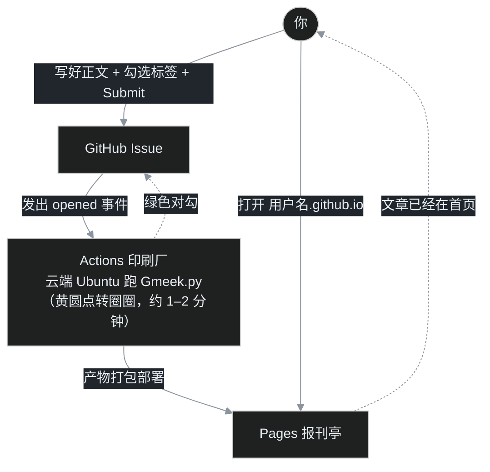

# B01｜18 秒建站实录：从一个 GitHub 账号到第一篇文章上线

> [B00](/post/30.html) 把地图画好了：Issues 是编辑部、Actions 是印刷厂、Pages 是报刊亭。这一篇叶扬带你走完全程——从注册账号开始，每个按钮都截图为证，中间三个最容易卡住的地方会用大字标出来。全程不需要在电脑上装任何东西，只要一个浏览器。
>
> 官方号称 18 秒搭好。叶扬实测：**点鼠标的部分确实只要 18 秒**，等云端印刷的一两分钟里，你可以去倒杯水。

## 零、开工前：一个 GitHub 账号

打开 [github.com/signup](https://github.com/signup)，用邮箱注册：填邮箱、设密码、起一个用户名，跟着验证邮件确认即可。

这里只有一件事要郑重对待：**用户名就是你未来的域名。**

你起的名字叫 `abc123`，博客地址就是 `https://abc123.github.io`；叫 `xiaoye2026`，地址就是 `https://xiaoye2026.github.io`。用户名将来虽然能改，但牵一发动全身，建议直接起一个你愿意用很多年的 ID（叶扬的账号就是 yeyangchen2009，博客地址也由此而来）。

注册完登录，我们开始。

## 一、第 1 步：用模板一键创建仓库（18 秒都花在这）

Gmeek 官方把一个博客需要的全部脚手架放进了模板仓库 [Meekdai/Gmeek-template](https://github.com/Meekdai/Gmeek-template)，长这样：


**点这个链接直接进入建仓表单**（它带着模板参数，比手动找按钮快）：

> <https://github.com/new?template_name=Gmeek-template&template_owner=Meekdai>

表单里只需要关心三个地方：


1. **Owner**：选你自己的账号；
2. **Repository name（仓库名）**：必须填 `你的用户名.github.io`，一个字符都不能差。叶扬填的是 `yeyangchen2009.github.io`；
3. 保持 **Public（公开）** 选中，然后点绿色的 **Create repository**。

为什么仓库名这么死板？因为 GitHub Pages 有条特殊规矩：名叫 `用户名.github.io` 的仓库是「用户站」，直接占用根域名 `https://用户名.github.io/`；要是起了别的名字（比如 `my-blog`），它就变成「项目站」，网址会变成 `https://用户名.github.io/my-blog/`，后面所有路径都要矮一级。Gmeek 默认按根域名设计，**新手请严格照做，不要自由发挥仓库名**。

几秒钟后，你就拥有了一个内容和模板一模一样的新仓库——毛坯房交付完成。

## 二、第 2 步：把 Pages 发布源切到 GitHub Actions（最容易忘）

进入新仓库的 **Settings（设置）** 标签页，左侧菜单找到 **Pages**，在 **Build and deployment → Source** 下拉里选择 **GitHub Actions**：


这是四步里**遗忘率最高**的一步，也是新手第一大坑的来源：

- 选 **GitHub Actions**：网页由工作流构建出的 artifact 发布，这是 Gmeek 的工作方式；
- 保持默认的 **Deploy from a branch**：GitHub 只托管分支上的现成文件，Gmeek 构建了也没人发布——症状是「Actions 一片绿勾，网址打开却是 404」，极其迷惑。

选一次就好，以后不用再碰。

## 三、第 3 步：写第一篇 issue——记得给它一张「出版许可证」

回到仓库首页，点 **Issues** 标签，再点绿色的 **New issue**。

### 3.1 新仓库没有标签，先建一个

如果你是第一次打开 Issues，右侧的 **Labels** 区域空空如也——这是第三个必考点的伏笔：**Gmeek 规定一篇 issue 至少带一个标签才会生成文章**，标签就是出版许可证，没贴标签的 issue 只是仓库里的一条备忘。

点 Labels 旁边的齿轮（或仓库的 Labels 管理页），选 **New label**：

- Label name 随便起，新手建议就叫 `博客`（叶扬自己用「博客」「Gmeek」两个标签分类）；
- Description 留空即可；
- 颜色随手选一个——这个颜色以后会成为该标签文章在列表里的主题色点缀。

保存。

### 3.2 写正文

回到 New issue 页面：

- **Title**：文章标题，比如 `我的第一篇博客：开张大吉`；
- 正文框用 **Markdown** 写作，新手先试这几样就够了：`#` 加空格是小标题，`-` 加空格是列表，`**文字**` 加粗，图片直接截图后 Ctrl+V 粘贴（GitHub 会自动上传）；
- 在右侧 **Labels** 下拉里勾上刚建的「博客」标签：


最后点绿色的 **Submit new issue**。

这一刻，issue 页面下方会立刻出现一行提示，告诉你有一个 workflow 被触发了——印刷厂开机。

## 四、见证奇迹的两分钟：黄圆点变成绿对勾

打开仓库的 **Actions** 标签页，你会看到一条新的运行记录，标题就是你刚发的文章名，旁边先是一个黄色的转圈圈：


这张图里藏着 B00 讲过的三种触发方式，对照着看特别直观：

- **Issue #31 opened by yeyangchen2009**：你刚发文章触发的增量构建，自动；
- **Manually run**：手动按按钮的全局重建（第 4 步就会用到）；
- **Scheduled**：每天北京时间零点的定时全局重建，免费的自愈保险。

一次构建大约 40 秒到 2 分钟。状态变化是这样的：



等黄圆点变成**绿对勾**，打开浏览器访问：

```text
https://你的用户名.github.io
```

你的文章已经躺在首页了。把这个地址发给任何人，对方无需登录、无需 GitHub 账号就能读到。叶扬的站点现在长这样（你的第一次会长得很像，只是标题和文章数还是模板的初始状态——别急，下一篇 B02 就教你改成自己的）：


顺便消除一个疑惑：**用手机打开，首页可能看不到博客大标题，只有头像**——这是官方模板在窄屏下的刻意设计，不是你装错了。

## 五、第 4 步：手动全局重建，先混个脸熟

四步安装法的最后一步平时用不到，但 B00 推出的两条定律请记住：**改了 config.json，或者往仓库里加了新文件后页面不对劲，就需要它。**

操作位置在 Actions → 左侧选 **build Gmeek** → 右侧的 **Run workflow** 下拉 → 再点绿色 **Run workflow**：


点完会多出一条 `Manually run` 记录——就是上一张图里见过的那个类型。它和发文构建的区别是：**手动构建会清空产物、遍历你的全部 issue 重建一遍**，所以任何「改了但没生效」的疑难杂症，先来一发手动全局重建，往往药到病除。

## 六、完工验收清单

四步走完，对照打勾：

- [ ] 仓库名严格等于 `用户名.github.io`；
- [ ] Settings → Pages → Source 已选 **GitHub Actions**；
- [ ] 第一篇 issue 勾选了至少一个标签后才 Submit；
- [ ] Actions 里对应记录是**绿对勾**（不是黄圆点、更不是红叉）；
- [ ] 浏览器无痕窗口打开 `https://用户名.github.io` 能看到文章（用无痕窗口是为了绕开本地缓存）。

## 七、翻车急诊室

| 症状 | 病因 | 处方 |
|---|---|---|
| 打开域名是 404 / GitHub 默认页 | 十有八九是第 2 步没做，Source 没切到 GitHub Actions | 回 Settings → Pages 改完，再手动 Run workflow |
| 网址变成 `用户名.github.io/仓库名/` | 仓库名没按 `用户名.github.io` 起 | 仓库 Settings 最下方改名；改不动就新建 |
| Submit issue 后 Actions 毫无反应 | 文章没贴标签 | 打开 issue，右侧补上标签，再编辑触发一次 |
| Actions 是红叉 | 构建中途报错，新手最常见是以后改 config.json 时漏了逗号 | 点进那条记录看红色日志，把报错行搜一搜；实在看不懂就手动 Run workflow 重来，每天凌晨还有定时构建兜底 |
| 绿勾了但首页没文章 | 构建/CDN 还在传播，或标签没贴 | 等 1–2 分钟，用无痕窗口再看；检查 issue 标签 |
| 博客标题是不认识的占位文字 | 模板自带的默认 config.json 还没改 | 不是故障——这正是下一篇 B02 的主题 |

## 小结

- 四步的本质：**模板复制一个仓库 → 告诉 Pages 由 Actions 发布 → 贴标签的 issue 触发构建 → 出问题就手动全局重建**；
- 三个必考点：仓库名、Pages 开关、issue 标签，新手翻车几乎都在这三处；
- 你现在拥有的是一套零服务器、零成本、数据全部在自己仓库里的博客，写作只需要一个浏览器。

毛坯房已经交付。下一篇 B02 我们装修第一件家具：把 `config.json` 里的站名、副标题、头像改成你自己的，并搞懂 `last` 和锁版本的取舍。

## 参考链接

- [Gmeek 引擎仓库](https://github.com/Meekdai/Gmeek)
- [Gmeek-template 模板仓库（建站入口）](https://github.com/Meekdai/Gmeek-template)
- [官方快速上手指南](https://blog.meekdai.com/post/Gmeek-kuai-su-shang-shou.html)
- [GitHub Pages 官方文档：About user/organization sites](https://docs.github.com/en/pages/getting-started-with-github-pages/about-github-pages#types-of-github-pages-sites)
- 上一篇：[B00 地基篇总览](/post/30.html)
- 前传：[用 GitHub Issues 写博客：Gmeek 搭建全过程与原理](/post/1.html)


