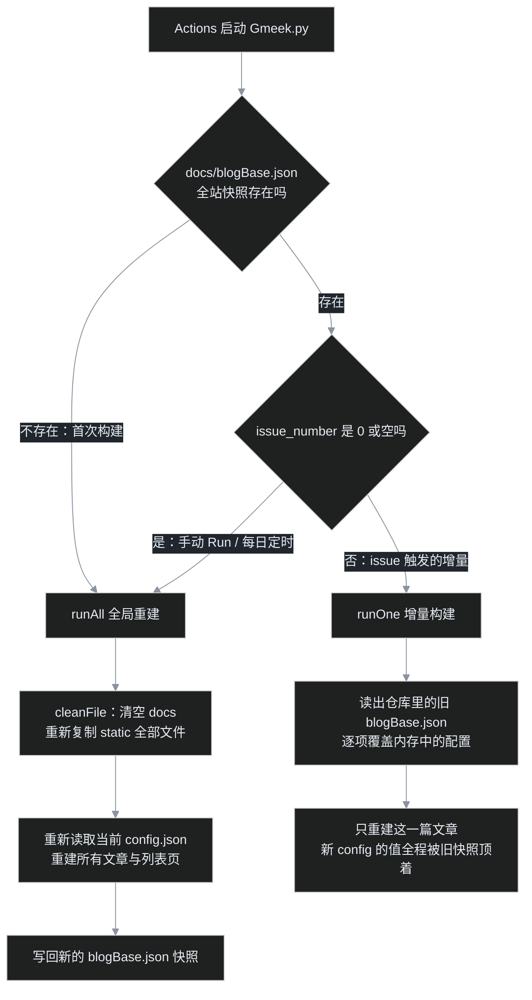

> [B01](/post/32.html) 走完，博客已经能访问、第一篇文章也上线了。但首页抬头一看，站名还赫然写着 **Blog Title**，副标题是 **Blog description**，浏览器标签上的小图标也是个来路不明的默认图标——毛坯房交付时，开发商挂的样板间标牌还没摘。
>
> 这一篇叶扬带你认识装修总闸 `config.json`：四个必填字段逐个拆掉，亲手把站名、签名、头像换成自己的。另外附赠两条读源码读出来的冷知识：**为什么改完配置首页毫无反应**，以及 `GMEEK_VERSION` 里的 `last` 到底" last "在哪。

## 一、config.json 是谁：仓库里唯一的装修总闸

打开你自己的博客仓库（`用户名/用户名.github.io`），根目录下文件不多，`config.json` 就是其中之一。点进去长这样（下图是叶扬博客现在的版本，已经装修过，字段比较多）：


而 B01 刚建完仓的时候，这个文件只有孤零零四行字段，是模板放进来的出厂配置：

```json
{
    "title": "Blog Title",
    "subTitle": "Blog description",
    "avatarUrl": "https://github.githubassets.com/favicons/favicon.svg",
    "GMEEK_VERSION": "last"
}
```

关于这个文件，先建立三个认知：

1. **它只在云端构建时被读取。** 你在仓库里改完保存，本地、服务器上都没有任何常驻程序盯着它；只有 GitHub Actions 跑 Gmeek 构建脚本时，才会把它读进内存。
2. **没写的字段不等于没有。** Gmeek 源码 [`defaultConfig()`](https://github.com/Meekdai/Gmeek/blob/main/Gmeek.py#L90) 里准备了一整份默认值字典，随后用 `self.blogBase={**dconfig,**config}` 合并——你写了的字段盖掉默认值，没写的字段一律用默认的。所以四行配置也能撑起一个完整博客。
3. **它是纯文本 JSON。** 不需要任何专业工具，GitHub 网页上就能改，但要守 JSON 的语法规矩（第五节细讲）。

## 二、四个必填字段逐个拆

### 1. `title`：站名

首页最醒目的大标题、浏览器标签页上显示的名字、RSS 订阅里的站点名，都取自这里。模板给的占位值是 `"Blog Title"`，改成你想要的名字即可，比如叶扬填的是 `"叶扬的博客"`。

顺带一说，源码里还有个可选字段 `displayTitle`：不填时默认等于 `title`；将来想让浏览器标签显示短名、首页显示长名，可以研究它。新手忽略。

### 2. `subTitle`：一句话签名

站名下面那行小字，用来交代你是谁、博客写什么。写不写随你，但留着 `"Blog description"` 实在太像忘记交作业，建议哪怕填一句"随便写写"也比占位文字强。叶扬填的是 `"我是叶扬，人生苦短，我用AI～"`。

### 3. `avatarUrl`：头像地址

这是四个字段里唯一需要动点脑筋的：它要填的是**一张图片的网址**，不是本地上传的文件。新手最省事的玩法：

```
https://github.com/你的用户名.png
```

比如叶扬的就是 `https://github.com/yeyangchen2009.png`。这是 GitHub 隐藏的固定地址，任何用户的头像都能这么取。好处显而易见：**以后在 GitHub 换头像，博客头像自动跟着换**，一个字都不用改。

模板默认填的那个 `githubassets.com/favicons/favicon.svg` 是 GitHub 自己的标志，属于"样板间挂画"，务必换掉。

再透传一个源码细节：站点小图标 `faviconUrl` 和社交分享卡片图 `ogImage`，**只要你不显式配置，都会默认继承 `avatarUrl`**（见 [Gmeek.py 第 100–104 行](https://github.com/Meekdai/Gmeek/blob/main/Gmeek.py#L100)）。也就是说头像改好，浏览器标签上的小图标、分享到微信/Twitter 时的卡片图，三处一起换新，一鱼三吃。

### 4. `GMEEK_VERSION`：引擎版本，先认识，别动

这个字段最唬人，但新手阶段**保持 `"last"` 就是最佳实践**。它到底控制什么、为什么还能填别的值，第六节专门讲。

## 三、动手：在网页上改一次

不用装 Git，不用敲命令，全程浏览器：

1. 在仓库根目录点进 `config.json`；
2. 点右上角的**铅笔图标**（Edit this file），进入网页编辑器；
3. 编辑器带行号和语法高亮，把 `title`、`subTitle`、`avatarUrl` 三个值改成自己的，其他一概不碰；


4. 点右上角绿色 **Commit changes...** 按钮，弹窗里再点一次绿色 **Commit changes** 确认（Commit message 保持默认即可）。

注意了：**点完 Commit，你去刷新博客首页——什么都不会变。**

这不是 bug，而且原因比你想的更有意思。

## 四、核心机制：改完配置，为什么首页毫无反应

B00 讲过一条定律：普通发文走增量构建，只有手动触发才是全局重建。这一节叶扬把源码翻开，看看到底是哪几行代码在"挡"你的新配置。

Gmeek 构建脚本 [`Gmeek.py` 的主流程](https://github.com/Meekdai/Gmeek/blob/main/Gmeek.py#L457)启动后，要回答两个问题：



关键在左边那条岔路。issue 触发增量构建时，脚本会执行这几行（[Gmeek.py 第 469–474 行](https://github.com/Meekdai/Gmeek/blob/main/Gmeek.py#L469)）：

```python
f = open("blogBase.json", "r")
oldBlogBase = json.loads(f.read())
for key, value in oldBlogBase.items():
    blog.blogBase[key] = value   # 用旧快照，把刚从新 config.json 读来的值一个个顶回去
```

`blogBase.json` 是上一次**全局**重建时写下的全站快照（站名、头像、所有文章目录都在里面）。增量构建启动时，它会被原样读回、逐项覆盖内存配置——所以哪怕你把 `config.json` 改成花，只要跑的是增量构建，印刷厂里用的还是上一次全局重建时的旧厂址。

再补一刀：**提交 config.json 这个动作本身根本不触发构建**。模板自带的工作流 [`.github/workflows/Gmeek.yml`](https://github.com/Meekdai/Gmeek-template/blob/main/.github/workflows/Gmeek.yml) 只监听三种情况——`issues`（发文/改文）、`workflow_dispatch`（手动）、`schedule`（每日定时），没有 `push`。

两个事实合起来，结论非常明确：

> **改完 config.json，必须去 Actions 手动 Run workflow 触发一次全局重建。**

具体按钮 B01 已经按过一次，就是这个下拉：


顺带把另一条定律也补齐了：`runAll` 的第一步 [`cleanFile()`](https://github.com/Meekdai/Gmeek/blob/main/Gmeek.py#L59) 会清空输出目录、把 `static/` 文件夹重新整体复制一遍。**以后你往 `static/` 里放新图片、新文件，同样要靠全局重建才会上线**——叶扬这个博客的每篇配图都是这么走的。

如果懒得手动，每天凌晨（北京时间 0 点，对应 UTC 16:00）的定时构建也是一次 `runAll`，新配置届时自然生效。但写教程的人建议：改完就按，别等。

## 五、JSON 三戒：构建红叉绝大多数死在这

`config.json` 是 JSON 格式，规矩少，但每条都是刚性的：

1. **字段名和文本值必须用英文双引号包起来**，单引号不行，中文引号 `" "` 更不行；
2. **字段与字段之间用逗号隔开**；
3. **最后一个字段后面不许留逗号**（JSON 比 Python 严格，尾随逗号直接判死刑），花括号、方括号也要成对。

看一个最典型的翻车现场——就是在最后一行 `"GMEEK_VERSION": "last",` 手滑留了个逗号：


提交前自检，任选一种：

- 电脑上有 Python：仓库目录里敲 `python -m json.tool config.json`，报错会精确指到第几行第几列；
- 装了 jq：`jq . config.json`，效果一样；
- 什么都没有：在 GitHub 网页编辑器里盯紧逗号——语法出错时代码下面会出现红色波浪提示，**不要点 Commit**。

JSON 语法坏掉的后果是构建直接红叉，全站停在上一次成功的版本，所以这一步别省。

## 六、`"last"` 与锁版本：自动更新的便利与代价

回到第四个字段。工作流里有这么几行 shell（在 [Gmeek.yml](https://github.com/Meekdai/Gmeek-template/blob/main/.github/workflows/Gmeek.yml) 的 "Clone source code" 步骤）：

```bash
GMEEK_VERSION=$(jq -r ".GMEEK_VERSION" config.json)
git clone https://github.com/Meekdai/Gmeek
lastTag=$(git describe --tags $(git rev-list --tags --max-count=1))
if [ $GMEEK_VERSION == 'last' ]; then
    git checkout $lastTag        # last = 截止构建时刻最新的 release 标签
else
    git checkout $GMEEK_VERSION  # 否则检出你亲手填的那个标签
fi
```

注意 `last` **不是一个具体版本号**，而是"构建那一刻的最新 release 标签"。这意味着：

- 填 `"last"`：每次全局重建、每天凌晨的定时构建，都会自动飘到当时最新版，新功能白拿，当然也可能摊上新版的 bug；
- 填具体标签（如 `"v2.24"`）：引擎被钉死在这个版本，天塌下来页面行为都不变；想升级时自己改号、手动全局重建。

版本号去哪查？引擎仓库的 Tags 页，按时间倒序排得明明白白：


新手策略一句话：**平时老老实实 `last`；万一某天凌晨定时构建后博客行为异常，去 Tags 页查上个稳定版本号（比如 `v2.25` 的上一个是 `v2.24`），填进 config.json 手动全局重建，先锁回去止血，再去给作者提 issue。**

## 七、翻车急诊室

| 症状 | 病因 | 处方 |
|---|---|---|
| Commit 配置后首页毫无变化 | 漏了全局重建；且提交 config 不触发任何工作流 | Actions → build Gmeek → Run workflow |
| 手动重建完还是没变 | CDN 缓存，或浏览器本地缓存 | 等 1–2 分钟，Ctrl+F5 强刷 / 无痕窗口验证 |
| Actions 红叉，日志里有 `json.decoder` 字样 | JSON 语法坏了，八成是尾逗号或中文引号 | 按第五节自检，修好后再全局重建 |
| 头像位置是个裂图 | URL 填错，或图床禁止外链（防盗链） | 浏览器无痕窗口直接打开那个 URL 验证；新手换回 `https://github.com/用户名.png` |
| 锁定版本后，别人博客的新功能自己没有 | 版本钉死了，升级要手动 | 去 Tags 页确认稳定新版，改号后全局重建 |
| 浏览器标签图标 / 分享卡片图没跟着头像变 | 之前显式配过 `faviconUrl` / `ogImage` | 配过就不会继承头像；删掉这两个字段或改成新图地址 |

## 八、其他字段先混个脸熟

装修总闸远不止四个开关，源码默认值里躺着一批。叶扬挑常用的列一张脸熟表，**现在不用记，知道它们归 config.json 管就行**，后续地基篇会逐个讲到：

| 字段 | 作用（不填时的默认值） |
|---|---|
| `faviconUrl` / `ogImage` | 标签小图标 / 社交分享卡片图（默认继承头像） |
| `singlePage` | 独立页面清单，如关于页、归档页（默认空） |
| `bottomText` | 页脚自定义文字 |
| `startSite` | 站点上线日期，控制首页"本站已运行 N 天"类展示 |
| `onePageListNum` | 首页每页文章数（默认 15） |
| `urlMode` | 文章链接风格：默认 `pinyin` 取标题拼音，可选 `issue` 用编号 |
| `i18n` / `themeMode` / `dayTheme` / `nightTheme` | 语言、明暗主题模式与配色 |
| `iconList` / `script` / `style` / `allHead` | 自定义图标、注入脚本与样式——进阶玩家的乐园 |
| `email` / `filingNum` / `exlink` / `needComment` | 联系邮箱、备案号、外链映射、评论开关 |

完整版以 [Gmeek 官方 README 的参数说明](https://github.com/Meekdai/Gmeek)和源码 [`defaultConfig()`](https://github.com/Meekdai/Gmeek/blob/main/Gmeek.py#L90) 为准。叶扬博客现在那份 18 行配置，就是从四行起步、一个个字段长出来的，不急。

## 小结

- `config.json` 是全站唯一的装修总闸，云端构建时才读取，没写的字段由源码默认值兜底；
- 新手必改三件套：`title` 站名、`subTitle` 签名、`avatarUrl` 头像（`https://github.com/用户名.png` 自动跟随），`GMEEK_VERSION` 保持 `last`；
- 两条源码级定律：**改配置必须手动全局重建**（增量构建被 `blogBase.json` 旧快照整体覆盖），**新增 static 文件也必须全局重建**（只在 `runAll` 的 `cleanFile` 阶段复制）；
- JSON 三戒：双引号、字段间逗号、末尾无逗号，提交前用 `python -m json.tool` 或 `jq` 自检；
- `last` 是浮动的最新 release，翻车时填具体 tag 锁版止血。

验收清单：① 首页大标题与副标题已是自己的；② 头像、标签小图标三处一致；③ Actions 最近一次是手动触发的绿勾；④ 无痕窗口打开域名确认更新。

招牌换好了，店也正式像自己的店了。下一篇 B03，叶扬带你回到编辑部：在 Issues 里过日子——Markdown 怎么排版、文章怎么修改、不想要的稿子怎么下架。

## 参考链接

- [Gmeek 引擎仓库（源码与 README 参数表）](https://github.com/Meekdai/Gmeek)
- [Gmeek.py 源码：defaultConfig 默认值](https://github.com/Meekdai/Gmeek/blob/main/Gmeek.py#L90)
- [Gmeek.py 源码：runAll / runOne 与旧快照覆盖逻辑](https://github.com/Meekdai/Gmeek/blob/main/Gmeek.py#L404)
- [Gmeek-template 工作流 Gmeek.yml（版本检出与三种触发方式）](https://github.com/Meekdai/Gmeek-template/blob/main/.github/workflows/Gmeek.yml)
- [Gmeek Tags 页（版本号查询）](https://github.com/Meekdai/Gmeek/tags)
- 上一篇：[B01｜18 秒建站实录](/post/32.html)
- 地基篇目录：[B00｜从零开始的地基篇总览](/post/30.html)
