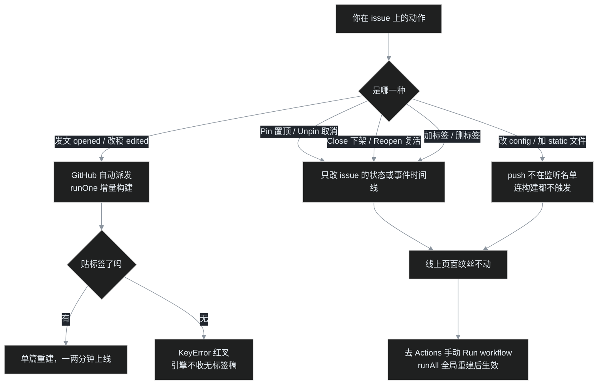

> [B02](/post/34.html) 把招牌换好之后，编辑部其实只用过一次——开张那篇发刊词。真正住进来以后，每天打交道的是这些事：新写一篇、改个错别字、把目录长期顶在最上面、写坏的稿子下架、再把几年前的旧文补发进时间线。
>
> 这一篇叶扬把编辑部的全套日常走一遍。动作都在 GitHub 网页上，简单到不好意思写教程，但每个动作**会不会触发印刷厂开工、会不会动文章的位置**，源码里全有明确答案。这一篇照例把答案翻给你看。

## 一、发稿台：New issue 页面的三件套

仓库顶部 **Issues** 标签页 → 绿色 **New issue** 按钮，就是发稿台。三样东西：

1. **标题框**：文章的标题，也是首页列表、浏览器标签、RSS 订阅里显示的名字；
2. **正文框**：用 Markdown 写作的地方；
3. **右侧 Labels**：标签选择器，B01 已经按过一次。


写的时候可以随时切到 **Preview** 标签看效果。这里有一颗很多人不知道的定心丸：你在 Preview 里看到的渲染效果，**和博客页面上最终的样子出自同一个引擎**。Gmeek 构建时并不自己解析 Markdown，而是把正文 POST 给 GitHub 官方的 `/markdown` 接口、模式指定为 `gfm`（GitHub Flavored Markdown），拿回渲染好的 HTML（见 [Gmeek.py 的 markdown2html](https://github.com/Meekdai/Gmeek/blob/main/Gmeek.py#L128)）。所以 Preview 即所得，不存在"编辑器里一个样、博客上另一个样"。


## 二、Markdown 日常够用清单

不用学全语法，写博客真正高频的就这些：

| 写法 | 效果 |
|---|---|
| `# 标题` / `## 小标题` | 一到六级标题，二级标题最常用 |
| `**粗体**`、`*斜体*`、`~~删除线~~` | 强调 |
| `- 条目` 或 `1. 条目` | 无序 / 有序列表，行首写 `- [ ]` 是任务列表 |
| `> 引用` | 引用块；`> [!NOTE]` 起头是彩色提示块（进阶玩法见 [G07](/post/13.html)） |
| `[文字](网址)` | 链接 |
| `` `代码` `` 与三个反引号围栏 | 行内代码与代码块 |
| `` | 插图 |
| `| 列 | 列 |` 加分隔行 | 表格 |
| `---` 单独一行 | 分隔线 |

**插图对新手最友好的方式是粘贴**：在正文框里直接 Ctrl+V（或把文件拖进来），GitHub 会自动把图片传到它自己的图床 `user-images.githubusercontent.com` 并把 Markdown 地址填好，你什么都不用管，也不必往仓库的 `static/` 文件夹里塞东西。想要灯箱放大、图片完全由自己仓库托管的进阶玩法，G05 [《给文章图片装一盏灯》](/post/11.html)讲过。

公式和流程图（Mermaid）也是支持的，但属于加菜，G07 那篇有完整演示，这里先不展开。

## 三、标签仍是命根子：无标签的稿子引擎不收

B01 强调过"发文必须贴标签"，这一篇可以把源码翻开看为什么。引擎处理一篇 issue 的第一道门是（[Gmeek.py:315](https://github.com/Meekdai/Gmeek/blob/main/Gmeek.py#L315)）：

```python
def addOnePostJson(self, issue):
    if len(issue.labels) >= 1:      # 至少有一个标签，后面才有故事
        ...
```

没有标签的 issue，引擎不把它收进任何文章列表；紧接着按编号取文章数据时还会因为找不到而抛出 **KeyError**，这一趟构建直接红叉。这不是假设——叶扬这个博客的 issue #22 当年就是一张没贴标签的工单，结结实实触发了一次这个红叉，后来修复思路还给上游提了 PR（来龙去脉见 [G15](/post/24.html) 与[番外二](/post/28.html)）。直到现在，无标签 issue 仍会被这道门挡住。

标签还有两个进阶规矩：

- **第一个标签（labels[0]）是"主标签"**：它决定这篇是普通文章还是固定页——主标签命中 `config.json` 里 `singlePage` 名单的（比如 `about`、`archive`），生成的是独立页面，不进文章流；
- **多贴的标签进分类页**：每篇文章贴几个标签，就会出现在 `/tag.html` 对应的分类里，标签胶囊上的数字就是各分类的篇数：


## 四、改稿：保存就自动重建，但有两样东西不会变

文章发出去以后发现错别字？打开 issue 点铅笔（或右下角 `...` → Edit），改完 **Save changes**，收工。

Gmeek 监听了 issue 的 `edited` 事件，保存即自动触发一次增量构建，一两分钟后线上就是新稿。但有两件事值得提前知道，免得以后纳闷：

1. **改稿不改变文章的位置和日期。** 文章的时间取的是 **issue 的创建时间**，不是最后编辑时间（[Gmeek.py:366](https://github.com/Meekdai/Gmeek/blob/main/Gmeek.py#L366)：`issue.created_at`）。一篇 9 月 13 日发的文章，9 月 30 日改十遍，它还安安静静排在 9 月 13 日那个位置。这正是博客该有的样子——更新不刷屏。
2. **`urlMode:"issue"` 下，改标题不影响网址。** 文章 URL 是编号制（`/post/34.html`），标题随便改，旧链接永远有效。

另外每次构建，引擎都会把当期所有文章的全文自动备份进仓库的 `backup/` 文件夹（一篇一个 Markdown 文件），等于 GitHub 帮你存稿之外，印刷厂又归档了一份。

## 五、核心章：编辑部事件表——哪些动作会自动开工

新读者最常见的连环困惑是："我置顶了怎么没反应？""我把文章关了怎么页面还在？"答案全在工作流文件的触发条件里。模板自带的 [Gmeek.yml](https://github.com/Meekdai/Gmeek-template/blob/main/.github/workflows/Gmeek.yml) 写得很克制：

```yaml
on:
  workflow_dispatch:        # 手动
  issues:
    types: [opened, edited] # 只有"发文"和"改稿"两种
  schedule:
    - cron: "0 16 * * *"    # 每天 UTC 16:00（北京时间 0 点）兜底
```

也就是说，**只有发新文、改旧文会自动触发构建**；其余编辑部动作一律只改 issue 本身的状态，印刷厂毫不知情：



去 Actions 页翻运行记录，这套规律一目了然：标题里带文章名的是 `issues` 触发（opened/edited），叫 "build Gmeek" 的是手动，还有按点出现的 Scheduled：


记住一句话：**发文改稿自动到，置顶下架标签动，改配置加图片——全部手动跑一遍。**

## 六、置顶 Pin：把一篇长期钉在首页第一行

适合置顶的是"总揽""目录""关于这个博客"这类长期有效的文章。操作：打开目标 issue，把**右侧边栏一路拉到底**，在 Participants 下方的操作区里找到 **Pin issue**，点一下即可（已置顶时这里变成 Unpin issue）。老版本 GitHub 把这个入口藏在帖子右下角的 `...` 菜单里，新版网页已经搬到侧栏底部，和 Transfer、Lock、Delete 这些"重型操作"放在一起：


Pin 完首页不会立刻有变化——对上一章的表了，Pin 不在自动触发名单里。**手动 Run workflow 全局重建后**，引擎会翻阅这篇 issue 的事件时间线，看到 `pinned` 事件就把内部标记 `top` 置为 1（[Gmeek.py:350-354](https://github.com/Meekdai/Gmeek/blob/main/Gmeek.py#L350)），首页排序键是 `(top, createdAt)`，置顶文于是排到所有普通文章之上：


注意两个细节：置顶只动排序，**日期标签仍是原始发文日期**（上图这篇是 9 月 13 日，却排在 9 月 17 日的文章前面）；全站可以置顶多篇，多篇之间再按日期排。

## 七、下架 Close：文章怎么"消失"，以及后悔药

不想要的稿子怎么删？Gmeek 的设计是**不主张物理删除**：打开 issue → 底部 **Close issue**：


关掉之后会经历一个有点反直觉的过程：

1. Close 不触发构建，**此刻旧文章页还在网上，依旧能访问**；
2. 等你手动 Run workflow 跑全局重建时，引擎只遍历 open 状态的 issue，closed 的稿子不再进入文章列表；输出目录又是整个清空重生成的，旧 HTML 随之消失——这时文章页才真正 404、从首页和 RSS 里退场；
3. issue 本身仍保留在仓库的 Closed 列表里，正文、评论都在。

后悔了？Reopen 重开 issue，再手动跑一次全局重建，文章原样回来。这比真的删除数据安全得多。

## 八、补发旧文：文末一行 timestamp

从其他平台搬家、或者想补发一篇几年前写的旧文，新 issue 的创建时间必然是今天，硬插进文章流会霸榜榜首。Gmeek 给了一个小灶：在正文**最后一行**写一段隐藏 JSON 注释：

```html
<!-- ##{"timestamp": 1577836800}## -->
```

`timestamp` 是**秒级 Unix 时间戳**（上例是 2020-01-01 00:00 UTC），引擎读到它就用它替代创建时间（[Gmeek.py:363](https://github.com/Meekdai/Gmeek/blob/main/Gmeek.py#L363)），文章于是归位到 2020 年。它牵动的不止排序：首页位置、日期标签颜色、RSS 发布时间都会跟着走。时间戳不会算？搜索 "unix timestamp 转换"，任意小工具都能按日期换出来。

这段末行 JSON 还能给单篇文章挂专属样式、脚本、封面图，完整玩法是 [G06《文章末尾的秘密》](/post/12.html)的主题。

## 九、翻车急诊室

| 症状 | 病因 | 处方 |
|---|---|---|
| 发文后博客没文章，Actions 还红叉 | 没贴标签，引擎 KeyError | 补标签，再 Edit 一次触发重建 |
| Pin / Close / 改标签后线上没变化 | 这些动作都不触发构建 | 手动 Run workflow 全局重建 |
| Close 后文章页居然还能打开 | 还没跑全局重建，旧 HTML 仍在 | 手动 runAll；想恢复就 Reopen 后再 runAll |
| 粘贴的图是裂的 | 图还没传完就点了 Submit | 等编辑框里图片预览出来再提交 |
| 改完标题收藏夹里的旧链接失效 | 你用的是路径型 URL（标题拼音制） | 编号制（`/post/N.html`）无此问题；路径站改标题要同步通知读者 |
| 补发旧文时间不生效 | JSON 没放在正文最后一行，或时间戳写成了毫秒 | 末行无尾空行，秒级 10 位数；参考 G06 |
| 标题里的 `/ : ?` 在文件名里变成 `-` | 文件名非法字符会被正则清洗 | 正常保护机制，不影响标题显示 |

## 小结

- 发文三要素：标题、Markdown 正文、至少一个标签；Preview 与博客同用 GitHub GFM 引擎，所见即所得；
- 改稿自动重建，但**位置和日期只认 issue 创建时间**，编号制 URL 不随标题变；
- 自动触发只有 `opened`/`edited`：Pin、Close、Reopen、标签变动、改 config、加 static，全部手动 runAll；
- 置顶=事件时间线里的 `pinned` → `top=1`，只动排序不动日期；下架=Close + 全局重建，Reopen 是后悔药；
- 补发旧文靠末行 JSON 的秒级 `timestamp`。

至此，编辑部的日常你已经全都会了。下一篇 B04，叶扬给博客装上两样有人气的东西：文章底部的**评论区**（utterances，评论直接变成 GitHub issue 回复）和一张正式的 **About 关于页**（用 `singlePage` 做不进文章流的固定页）。

## 参考链接

- [Gmeek.py 源码：markdown2html / addOnePostJson / runOne](https://github.com/Meekdai/Gmeek/blob/main/Gmeek.py#L128)
- [Gmeek.py 源码：pinned 事件与排序键](https://github.com/Meekdai/Gmeek/blob/main/Gmeek.py#L349)
- [Gmeek-template 工作流（触发事件名单）](https://github.com/Meekdai/Gmeek-template/blob/main/.github/workflows/Gmeek.yml)
- [GitHub Docs：Pinning an issue](https://docs.github.com/en/issues/tracking-your-work-with-issues/pinning-an-issue-to-your-repository)
- 进阶阅读：[G06 文章末尾的秘密](/post/12.html)、[G07 写作三件套](/post/13.html)、[G15 Mermaid 翻车记](/post/24.html)
- 上一篇：[B02｜毛坯房装修：认识 config.json](/post/34.html)
- 地基篇目录：[B00｜从零开始的地基篇总览](/post/30.html)
