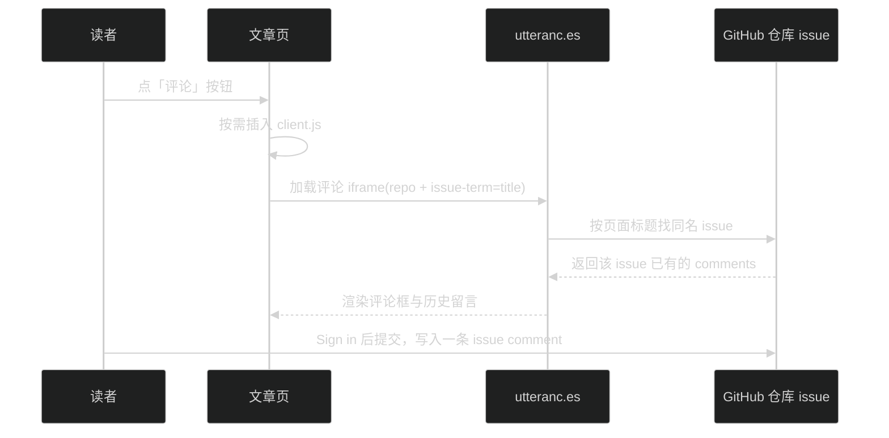

> [B03](/post/35.html) 把编辑部的日常过了一遍：发稿、改稿、置顶、下架，印刷厂都伺候得好好的。可有一件事叶扬一直没好意思说——这间博客精装完、开业到现在，门口连个**门铃**都没有。
>
> 读者读完文章想说两句，拉到页面最底下，干干净净，只能自己摸去 GitHub 仓库翻 issue、登录、留言，热情先凉一半。这一篇叶扬给博客装上两样门面：文章底部的**评论区**（门铃），和一张正式的 **About 关于页**（名片）。两样都不花钱，而且装完你会发现，它们跟前面 B 系列讲过的 issue、Actions，全是同一套水电。

## 一、utterances 是什么：拿 issue 当评论库的小挂件

Gmeek 选用的评论方案叫 **utterances**。它在官网的自我介绍只有一句："A lightweight comments widget built on GitHub issues"——一个建在 GitHub issue 之上的轻量评论挂件。主页在 [utteranc.es](https://utteranc.es)，源码开源在 [utterance/utterances](https://github.com/utterance/utterances)。

原理三句话：

1. 文章页里放进一段它提供的 `client.js`；
2. 脚本在页面中生成一个 **iframe**（嵌套小窗口），窗口里就是一整套评论区界面；
3. 读者点 **Sign in with GitHub** 授权后留言，评论以 **issue comment** 的形式，存进你仓库的某个 issue。

没有独立服务器，没有评论数据库，也没有另一套注册体系——**GitHub issue 就是评论数据库，GitHub 账号就是评论账号**。这跟 Gmeek 简直是天作之合：文章本身是 issue，评论还是 issue，一鱼两吃。唯一的"代价"是留言者需要有 GitHub 账号；对一个托管在 GitHub 上的技术博客来说，这几乎不构成门槛。

## 二、开通三步，其实只有一步要动手

### 第一步：给仓库安装 utterances App（唯一的动作）

打开 App 安装页 [github.com/apps/utterances](https://github.com/apps/utterances)，页面上能看到这个挂件的自我介绍与它申请的权限：

点 **Install**，接下来选择把 App 装到哪个账号下：

选定账号后还要选**仓库范围**：所有仓库，还是只挑指定仓库。App 申请的是 issues 的读写权限——它要代表留言的读者，往对应 issue 底下追加 comment。按最小权限原则，选 **Only select repositories** 并指定博客仓库这一个就够了，不必 All repositories。

### 第二步：Gmeek 这边什么都不用配

这是 Gmeek 替你省事的地方：评论开关 `needComment` 的默认值就是 `1`（[Gmeek.py 第 91 行](https://github.com/Meekdai/Gmeek/blob/main/Gmeek.py#L91)的默认配置里写着 `"needComment":1`）。连 utterances 官网让你自己复制粘贴的那段 `client.js`，模板也都提前写好了，`repo` 字段还会自动填成你自己的仓库名。

所以这一步真的什么都不用做。只有一种情况需要动手：哪天想**全站关闭评论**，才在 `config.json` 里显式加一行 `needComment:0`。

### 第三步：拉到文末，点按钮验收

打开任意一篇文章，一路滚到最底部，一个宽宽的 **评论** 按钮就在那里：

点下去，按钮先变成 `loading`，随后评论框从下方展开：

上方是当前评论条数与 `powered by utteranc.es`，中间是 **Write / Preview** 两个标签，右下角一颗蓝色 **Sign in with GitHub**。登录、写两句、点 Comment，留言就成了——可以马上去这篇文章对应的 issue 页面看，评论原样躺在 issue 的回复区里。

这里有个值得一说的贴心设计：**评论脚本不是文章一打开就下载的**。看 [post.html 的 openComments](https://github.com/Meekdai/Gmeek/blob/main/templates/post.html#L91)，那段 `<script>` 是在按钮的 `onclick` 触发时，才由 JS 当场创建并插进页面的（脚本地址写死为 `https://utteranc.es/client.js`）。不点不加载——为每个只是读文章的人省下一次跨站请求；万一哪天评论服务抽风，文章本体也永远安然无恙。

## 三、评论去哪了：挂在"文章自己那个 issue"上

装完 utterances，不少人心里会打鼓：评论到底存哪了？会不会在我仓库里乱开新 issue？叶扬把模板翻到底，给个准话。

`openComments` 里真正决定评论去向的是两个字段：仓库名（自动填你的仓库）和 **`issue-term = title`**。意思是让 utterances 拿"当前网页的 `<title>`"，去指定仓库里找**同名 issue**，找到，就把评论区挂在那个 issue 下面。而 Gmeek 文章页的 `<title>` 就是 issue 标题，一字不差——于是：

> 在 `/post/35.html` 页面下发的评论，就是 issue **#35** 里的一条 comment。

这正好回收了 [B03](/post/35.html) 急诊室留下的担心：**utterances 不会新建 issue**。它只有在仓库里连一个同名 issue 都找不到时才会自建一个；而 Gmeek 的每个文章页都源自一个真实存在的 issue，同名 issue 必然在，永远走"复用"这一支。所以无标签 issue 把构建绊成 KeyError 那种事故，评论区这条线上根本碰不到。

再说**换肤**。手动明暗模式下，`openComments` 会读浏览器里的主题记录：暗色给 `dark-blue`、亮色给 `github-light`、从没选过就给 `preferred-color-scheme` 跟随系统；等读者点月亮或太阳切换站点主题，页面还会通过 `postMessage` 通知 iframe 跟着换。评论区和你的博客，永远是一个色号。

## 四、About 名片：一个贴着 about 标签的 issue

帖子和固定页，是 Gmeek 里的两种货。帖子住在 `/post/N.html`，按时间排进行文流；**固定页**（关于、归档这类）住在网站根目录，不进文章列表，却在页头拥有一个固定入口。

做一张 About 页简单到离谱：照常 **New issue**，标题写「关于叶扬」，正文用 Markdown 自我介绍，关键只有一个动作——在右侧 Labels 贴上 **`about`** 标签，提交。

构建时，引擎发现这个 issue 的第一个标签命中了 `config.json` 里的固定页名单（本站配置是 `"singlePage": ["about", "archive"]`），就把它分流处理：[addOnePostJson](https://github.com/Meekdai/Gmeek/blob/main/Gmeek.py#L315) 里，首标签在 `singlePage` 名单中的 issue 进 `singeListJson`，文件名直接**拿标签名当名字**（[createFileName](https://github.com/Meekdai/Gmeek/blob/main/Gmeek.py#L434) 的 `useLabel` 分支）。于是 `about` 标签长出的页面，地址就是干干净净的 `/about.html`：

固定页的入口出现在网站页头。渲染列表页时，引擎会把内置图标键和 `singlePage` 名单里的每一个键合并，各生成一个按钮：

`about` 是 Gmeek 内置认识的键，自动配一枚人形图标，`archive` 配盒子图标。要是哪天你自己新设一个标签（比如 `friends`）做友链页，页头会出现入口、但图标是空的——这时就得在 `config.json` 的 `iconList` 里给它补一个图标（`iconList` 的配法在 [B02](/post/34.html) 讲过）。正文写法则与普通文章完全一致，Markdown、图片、链接照用；固定页还会自动隐去页脚那行版权小字，看起来更像一张"正式页面"。

## 五、翻车急诊室

| 症状 | 原因 | 处方 |
|---|---|---|
| 点「评论」后一直 loading，框迟迟不出来 | iframe 要同时连通 utteranc.es 与 github.com，当前网络慢或受限时特别明显；这个嵌套窗口对运行环境很敏感 | 多等十几秒、换个网络再试；文章本体不依赖它，阅读不受影响 |
| 列表页标题旁的评论数小徽标不涨、不出现 | 评论数是**构建期**读 `issue.get_comments().totalCount` 静态写进页面的（[Gmeek.py 第 333 行](https://github.com/Meekdai/Gmeek/blob/main/Gmeek.py#L333)、[plist.html 第 93 行](https://github.com/Meekdai/Gmeek/blob/main/templates/plist.html#L93)）；新评论不在 Actions 的触发名单里 | 评论内容本身实时可见；数字手动 runAll 一次，或等每天北京时间 0 点的定时全量构建自动刷新 |
| 留言时反复要求登录，或提示没有权限 | 仓库没装 utterances App，或安装时选错了账号 / 仓库范围 | 回 App 页面检查 Installation settings，确认覆盖到博客仓库 |
| About 页打开是 404 | 标签字符串与 `singlePage` 名单不完全一致（如大小写、多空格），或贴标签后没有任何构建被触发 | 标签改成精确的 `about`；随手编辑一次该 issue，或手动 runAll |
| 全站文章底下都找不到评论按钮 | `config.json` 里把 `needComment` 改成了 `0` | 删掉这一行，恢复默认值 `1` 后重建 |

## 小结

- 评论区 = utterances：**给仓库装一次 App 是唯一的手动动作**，Gmeek 侧默认全开、脚本自带、仓库名自动填；
- 评论经 `issue-term=title` 直接挂在文章自己那个同名 issue 下，**不新建 issue**，与无标签 issue 的构建事故两条线；
- 脚本按需加载，明暗主题联动；评论内容实时，但列表页的评论数徽标是构建期产物，靠手动或每日定时构建刷新；
- About 页 = 第一个标签命中 `singlePage` 名单的普通 issue，输出为根目录下的 `/about.html`，并获得页头固定入口；自造页名记得在 `iconList` 配图标。

门铃装好了，名片也挂上了，博客终于像个能接待客人的地方。下一篇 B05，叶扬把这一系列里一直听见响声、却从没正式介绍过的"印刷厂"请上台面——**GitHub Actions**：工作流到底被哪些事件点火、每天 0 点那次 runAll 默默干了什么、手动构建和 issue 触发有什么区别。今天埋的"评论数为什么不实时"这个伏笔，到时一并回收。

## 参考链接

- [utterances 官网](https://utteranc.es) 与 [源码仓库 utterance/utterances](https://github.com/utterance/utterances)
- [utterances GitHub App 安装页](https://github.com/apps/utterances)
- [Gmeek 模板 post.html：评论按钮与 openComments](https://github.com/Meekdai/Gmeek/blob/main/templates/post.html#L91)
- [Gmeek.py 源码：默认配置 needComment](https://github.com/Meekdai/Gmeek/blob/main/Gmeek.py#L91)
- [Gmeek.py 源码：固定页分流 addOnePostJson](https://github.com/Meekdai/Gmeek/blob/main/Gmeek.py#L315)
- [Gmeek.py 源码：构建期读取评论数](https://github.com/Meekdai/Gmeek/blob/main/Gmeek.py#L333)
- [Gmeek.py 源码：固定页文件名取标签名](https://github.com/Meekdai/Gmeek/blob/main/Gmeek.py#L434)
- 上一篇：[B03｜在 Issues 里过日子](/post/35.html)
- 地基篇目录：[B00｜从零开始的地基篇总览](/post/30.html)