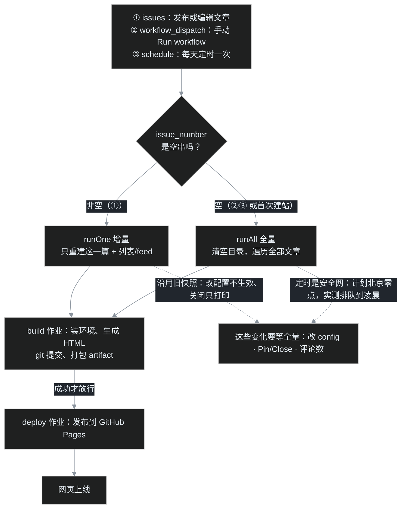

# B05｜读懂印刷厂值班日志：GitHub Actions 的三种点火、全量与增量、红叉怎么查

> B04 给博客装好了评论区，叶扬当时留了个悬念：文章刚收到一条评论，列表上的评论数字却不立刻涨，要等上一阵才更新。这一篇就去幕后看个究竟——评论只是导火索，真正的主角是这座博客的全自动印刷厂：**GitHub Actions**。
>
> 这篇不教你写工作流，只教你**读懂值班日志**：印刷厂几点上班、谁能点火、全量和增量有什么区别、红叉出现了按什么顺序查。读完之后，Actions 页面上那些密密麻麻的英文记录，在你眼里会变成一份条理清楚的值班表。

## 零、从"评论数不涨"说起

先回忆现象：B04 装完 utterances，读者在文章下面留了言，评论区本身秒开秒显示——因为评论数据存在第三方服务那里，跟博客仓库无关。但文章卡片上那个评论数字，是 Gmeek **构建网页时**数出来写进 HTML 的，评论发生时不会触发任何重建。

那数字什么时候更新？答案取决于印刷厂什么时候再次开工。而开工时机，全写在一份叫 `Gmeek.yml` 的值班表里。这一篇要讲的，就是这份表，以及它背后的两种印刷模式。

## 一、Actions 在哪：每次开工都留一条值班记录

GitHub Actions 是 GitHub 自带的自动化流水线：仓库里发生某件事，就自动启动一台云端虚拟机，按剧本跑一串命令，跑完销毁，按分钟计的公开仓库免费。

入口在仓库顶部的 **Actions** 标签。B01 建站那天叶扬第一次手动触发构建，看到的就是下面这张列表——每一行是一次"运行（run）"，左边的小圆圈表示成败，右边写着触发方式：


列表里值得认识三种字样，正好对应三种点火方式，下一章细讲：

- **issues**：有人新建或编辑了 issue（对 Gmeek 来说就是发文章、改文章）；
- **workflow_dispatch**：人在网页上手动点了 **Run workflow**；
- **schedule**：定时器到点自动开火。

一次 run 不是一锅粥，它由一个或多个**作业（job）**组成，Gmeek 的 run 固定有两个：`Generate blog`（印刷）和 `Deploy blog`（投递）。作业里再分若干**步骤（step）**。层级关系记住：**run → job → step**，查故障时就是沿着这条线往下找。

## 二、值班表 Gmeek.yml 逐行读

Actions 的剧本是仓库里的一个 YAML 文件，路径固定在 `.github/workflows/`。Gmeek 一键安装时会自动放好，名字就叫 `Gmeek.yml`，全文 95 行，不长：


叶扬挑关键行翻译成人话：

```yaml
on:
  workflow_dispatch:          # ① 允许手动点 Run workflow
  issues:
    types: [opened, edited]    # ② issue 新建或被编辑时触发
  schedule:
    - cron: "0 16 * * *"      # ③ 国际标准时间每天 16:00 = 北京零点
```

`on:` 就是点火条件清单。注意它**只监听 opened 和 edited**——加标签（labeled）、关闭（closed）、发评论（issue_comment）、push 代码，统统不在清单上。这一条请先存进脑子，第三章会反复用到。

再看作业头上的守卫：

```yaml
if: ${{ github.event.repository.owner.id == github.event.sender.id
       || github.event_name == 'schedule' }}
```

意思是：**只有仓库主人自己触发的运行才放行**，定时触发无条件放行。这条守卫防的是 fork 与陌生人——别人给你的仓库提 issue，不会白白燃起一台虚拟机。这也是为什么 Gmeek 要求用自己的账号建仓库，而不是在别人仓库里投稿。

后面的 `permissions: write-all` 是作业的工牌：允许它往仓库推代码、部署 Pages。两个作业的关系是：

```yaml
jobs:
  build:    { name: Generate blog, runs-on: ubuntu-24.04, ... }
  deploy:   { needs: build, ... }   # 必须等 build 成功才开工
```

`needs: build` 决定了那个经典画面：**build 红了，deploy 直接变灰（skipped）**，第六章会亲眼见到。

## 三、三种点火，两种印法：runAll 与 runOne

这是全篇的核心。三种点火方式最终只汇入两条印刷路线，先看图（本博客的 mermaid 运行时实时渲染）：



工作流把触发它的那个 issue 编号通过命令行参数传给 Gmeek 主程序：

```bash
python Gmeek.py $TOKEN $REPO --issue_number '${{ github.event.issue.number }}'
```

而主程序的岔路口写得明明白白（见 [Gmeek.py 第 457–476 行](https://github.com/Meekdai/Gmeek/blob/main/Gmeek.py#L457-L476)）：

- **没有 blogBase.json**（首次建站）：不管谁来，`runAll` 全量；
- **issue_number 是 0 或空串**（手动触发、定时触发都不带编号）：`runAll` 全量；
- **带着具体编号**（发文章、改文章）：`runOne` 增量。

两条路线干的活差很多。`runAll`（[第 404 行](https://github.com/Meekdai/Gmeek/blob/main/Gmeek.py#L404-L420)）一上来先 `cleanFile()` 清空产物目录，把 static 素材重新拷一遍，然后遍历仓库里**全部**文章逐篇重建，最后重生列表页与 feed；`runOne`（[第 422 行](https://github.com/Meekdai/Gmeek.py#L422-L432)）只重建指定的那一篇，外加列表和 feed——它开工前还会把**旧的 blogBase 快照整个读回来沿用**（第 471–473 行）。

理解了这条岔路，地基篇前几篇埋的所有"反直觉"瞬间一次性全部破案：

**B02 的悬案：改了 config.json 为什么不生效？** 因为发新文章触发的是 runOne，它沿用的是旧快照里的旧配置，config 里改的头像、昵称、插件开关全都不进场。想让改动生效，就得让它跑一次**不带编号的全量**——去 Actions 页面手动 **Run workflow**，或者安心等午夜的定时班车。

**B03 的悬案：Pin issue 为什么不触发构建？** 因为置顶在 GitHub 那里根本不发 opened/edited 事件，工作流压根没被点着；关闭文章同理——runOne 里对关闭状态的处理只有一行打印：`issue is closed`（第 432 行），网页不删也不改。想让关闭、置顶在页面上落实，同样要靠一次全量重建。

**本篇开场的评论数：** 评论数是构建那一刻调用接口数的（[第 333 行](https://github.com/Meekdai/Gmeek/blob/main/Gmeek.py#L333) `get_comments().totalCount`），发评论不触发任何事件。它下次更新，要么是这篇文章被编辑（走一次 runOne，数字重数），要么是任何一次全量（所有文章一起重数）。

**定时班车的小脾气：** `cron: "0 16 * * *"` 写的是国际标准时间 16:00，即北京零点整。但 GitHub [官方文档](https://docs.github.com/en/actions/reference/workflows-and-actions/events-that-trigger-workflows#schedule)实话实说：定时任务在高负载时段会排队延迟，只保证尽量在该窗口内执行，不保证准点。这个仓库最近五天的实际开火时间是北京凌晨 **02:37 到 04:12** 之间，最晚的一班晚点四个多小时（官方还警告高负载时排队任务可能被直接丢弃）。所以它是"安全网"，不是"闹钟"——等着上线的改动，永远手动 Run workflow，别等班车。

一句话总结第三章：**发改文章走增量，又快又省；配置、置顶、关闭、评论数这些"周边变化"，都要等全量。**

## 四、一次全绿的 run：build 作业的十三道工序

光看 YAML 不过瘾，进一次真实的成功 run 里逛逛。下面这张是一次 issues 触发的 build 作业页，十三道步骤全绿，总耗时 29 秒：


对照 `Gmeek.yml` 从上往下看，每一步都在给"印刷"做准备或收尾：

1. **Set up job / Checkout**：开机、把仓库拉到虚拟机；
2. **Setup Pages**：读取 GitHub Pages 配置；
3. **Get config.json**：打印配置内容，顺手装个 jq 工具；
4. **Set up Python**：Python 3.8 环境就位；
5. **Clone source code**：把上游 `Meekdai/Gmeek` 克隆到 `/opt/Gmeek`——版本号由 config 里的 `GMEEK_VERSION` 决定，填 `last` 就检出最新 release；
6. **Install dependencies**：安装 PyGithub、markdown 等依赖；
7. **Generate new html**：**真正的印刷工序**，执行 `python Gmeek.py ... --issue_number '编号'`，全量还是增量就在这一步内部分流；
8. **Generate sitemap.xml**：更新站点地图（B02 讲过的 SEO 物料）；
9. **Rebuild README**：按 README.custom.md 等模板重拼仓库首页说明；
10. **update html**：把产物 `git commit && git push` 回仓库——下一章的主角；
11. **Upload artifact**：把整站打包成名叫 `github-pages` 的构建产物；
12. 最后 **Post Set up Python / Complete job** 是 GitHub 自动加的清理步。

build 作业拿着产物收工，deploy 作业才登场：下载 artifact、调用 Pages 部署接口，把网页正式挂上 `*.github.io`。两个作业之间传递的就是那个 artifact 包，这也是为什么 deploy 写了 `needs: build`——没有包裹，投递员不出门。

## 五、🎉auto update by Gmeek action：机器人自己的提交

第四章第 10 步值得单独讲，因为很多新同学第一次看到都会心里一紧：**我没提交代码啊，仓库里怎么多了一堆 commit？**

打开仓库的提交历史，人和机器人的提交交错排列：


凡是以 **🎉auto update by Gmeek action** 开头的提交，都是 build 作业第 10 步自动推的：每次印刷结束，工作流把新生成的 HTML、blogBase.json、README.md 等产物提交回 main 分支，于是 GitHub 仓库本身同时扮演了"源码仓"和"成品仓"两个角色。作者身份显示为配置里的公开邮箱，提交信息固定不变，所以历史里会出现一排排长得一模一样的"机器人打卡"。

理解了这条，就明白两件事：一是**不要手改 docs/ 下的生成产物**，下次构建必被覆盖，要改内容就改 issue、要改样式就改 static/ 模板或插件；二是这些自动提交属于正常现象，不是账号被盗——它们的作者清一色是 Actions 机器人，时间与 Actions 列表里的 run 一一对应。

## 六、红叉怎么查：两次真实故障的现场教学

Actions 用久了，红叉迟早出现。叶扬把这个仓库建站以来仅有的三次失败翻出两次最典型的，教一套固定的排查动作。先给个定心丸：在有据可查的最近 **167 次运行里，164 次成功、3 次失败**，而且三次全部有明确的外部原因，没有一次是玄学。

### 排查四步法

1. 进 **Summary** 页，看两个 job 哪个先红；
2. 点进红 job，找**第一个变红的步骤**——后面的灰色 skipped 是被连累的，不是病灶；
3. 展开该步骤日志，`##[error]` 行会高亮，Python 报错（Traceback）**从下往上**读，最后一行才是真正的死因；
4. 黄色 warning（比如 Node.js 20 deprecation）只是提醒，不影响成败，别被它带偏。

### 病例一：build 红，deploy 灰——文章没挂标签

2026-09-15，叶扬新建了 #22 号 issue（就是后来修 mermaid 自动加载的那篇），构建红了：


左图信息已经能读出一半：**Generate blog 红，Deploy blog 灰**——这正是 `needs: build` 的效力，投递员没出门，问题在印刷车间。点进红 job：


第一个红步骤是 **Generate new html**，后面的 sitemap、提交、打包全灰。展开日志，Traceback 最后一行写着：

```text
File "Gmeek.py", line 427, in runOne
    self.createPostHtml(self.blogBase[listJsonName]["P"+number_str])
KeyError: None
```

从下往上读：`KeyError: None` 意思是程序拿一个叫 None 的键去字典里找东西，没找到。为什么是 None？因为这篇 issue 创建时**忘了挂"博客"标签**——Gmeek 靠第一个标签判断文章归属与配色，没有标签，归属就是 None，增量印刷当场卡死。处方很简单：回到 issue 挂上"博客"标签，再去 Actions 手动 **Run workflow** 跑一次全量，文章就归队了。这次红叉的完整现场现在还挂在 [run 34912730993](https://github.com/yeyangchen2009/yeyangchen2009.github.io/actions/runs/34912730993)，可以亲手点开对照。

### 病例二：build 绿，deploy 红——Pages 还没切到 Actions 模式

第二种红叉更迷惑人：印刷车间一切正常，投递员摔了。


这是建站第一天 2026-09-13 的一次手动运行。build 全绿，deploy 在第 5 秒报：

```text
Error: Failed to create deployment (status: 500) ...
Server error, is githubstatus.com reporting a Pages outage?
Please re-run the deployment at a later time.
```

日志客气地提示"是不是 GitHub 自己挂了，晚点再试"。但真实原因不是平台故障，而是**仓库的 Pages 发布来源当时还没切换成 GitHub Actions**（默认是从分支部署）——deploy 动作去创建部署，服务端不认，回了个 500。到设置里把 Source 切成 **GitHub Actions**，再点 **Re-run all jobs** 重跑，立刻转绿。这个设置页长什么样、怎么切，正是下一篇 B06 的主场，这里先记住结论：**build 绿 deploy 红，病灶十有八九在 Pages 配置，不在文章内容。**

### 红叉之后的三个救命动作

- **Re-run all jobs**：run 页右上角的重跑按钮。偶发的网络抖动、平台 500，重跑一次常常就好；
- **手动 Run workflow（全量兜底）**：标签漏挂、配置刚改、置顶关闭要生效，全靠它立刻来一次 runAll，不用等凌晨的班车；
- **定时班车**：就算什么都不做，每天凌晨那次 schedule 也会自动全量——这是它存在的终极意义，一张每天自动巡检的安全网。

## 七、翻车急诊室与小结

### 翻车急诊室

| 症状 | 病因 | 处方 |
|---|---|---|
| 改了 config.json，刷新网站毫无变化 | 发文章触发的是 runOne，沿用旧配置快照 | Actions 页手动 Run workflow 走全量；或等凌晨定时 |
| 新评论早就显示了，卡片评论数不涨 | 评论不触发构建，数字是构建时数的 | 编辑一次该文章（runOne 重数），或等全量 |
| Close/Pin 之后页面毫无反应 | closed/labeled 不在 `on:` 清单里；关闭只打印一行 | 手动 Run workflow 全量重建 |
| 整个 run 红了，deploy 显示 skipped | build 失败，deploy 被 `needs` 连坐 | 查 build 第一个红步骤，别在 deploy 身上找原因 |
| `KeyError: None` 一类报错 | 文章 issue 没挂标签，程序找不到归属 | 挂好"博客"标签，手动全量重跑 |
| build 绿、deploy 红，提示 status 500 | Pages 发布来源没切到 GitHub Actions | 仓库 Settings → Pages → Source 改 GitHub Actions，Re-run（详见 B06） |
| 半夜的定时构建两三点才出现 | schedule 高峰期排队，不保证准点 | 正常现象；急着上线就手动触发 |

### 小结

- GitHub Actions 的层级是 **run → job → step**，Gmeek 有 build（印刷）与 deploy（投递）两个 job，后者 `needs` 前者；
- 三种点火：**issues 开/编辑、手动 Run workflow、定时 schedule**；后两者与首次建站走 runAll 全量，发改文章走 runOne 增量；
- 增量只重建一篇并沿用旧快照——**改配置、置顶关闭、评论数都得等全量**；全量可手动召唤，定时班车每天凌晨兜底但会晚点；
- 每次构建第 10 步自动提交 🎉auto update by Gmeek action，产物进仓库是正常机制，别手改 docs/；
- 查红叉四步：Summary 找红 job → 找第一个红 step → 日志看 `##[error]`、Traceback 从下往上读 → warning 不算病。

下一篇 **B06 就去拜访投递员的东家：GitHub Pages**。build 全绿却 404、Pages 设置页到底怎么选、自定义域名与 HTTPS、为什么改了文章偶尔要 Ctrl+F5——印刷厂把纸印好了，投递这一站也有不少讲究。

## 参考链接

- [Gmeek 主程序 Gmeek.py（runAll / runOne / 主入口在第 404–476 行）](https://github.com/Meekdai/Gmeek/blob/main/Gmeek.py#L404-L476)
- [GitHub 官方文档：触发工作流的事件（含 schedule 延迟说明）](https://docs.github.com/en/actions/reference/workflows-and-actions/events-that-trigger-workflows#schedule)
- [GitHub 官方文档：手动触发 workflow_dispatch](https://docs.github.com/en/actions/reference/workflows-and-actions/events-that-trigger-workflows#workflow_dispatch)
- 地基篇前文：[B01｜18 秒建站实录：从一个 GitHub 账号到第一篇文章上线](/post/32.html)、[B02｜毛坯房装修：认识 config.json](/post/34.html)、[B03｜在 Issues 里过日子：写稿、改稿、置顶与下架](/post/35.html)、[B04｜门铃与名片：评论区与 About 关于页](/post/36.html)
