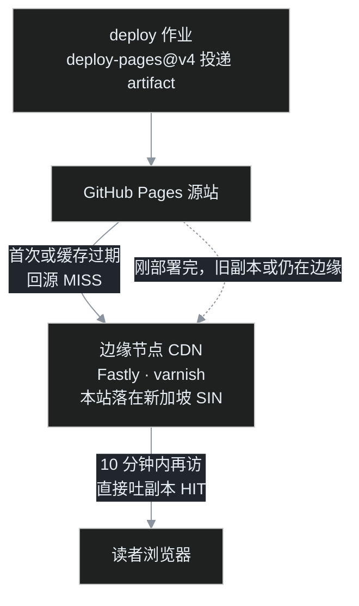

> B05 的两个红叉病例里，叶扬把悬念留在了第二例：build 作业全绿，deploy 作业却在第 5 秒报 `Failed to create deployment (status: 500)`。印刷厂把纸印好了，投递站却没开门。这一篇就去看投递站的真面目——**GitHub Pages**，看它到底把网页放在哪、读者打开链接时经历了什么、为什么绿勾之后还要等十分钟、以及如何换成自己的域名。

## 一、Pages 是什么：开在 GitHub 里的免费静态托管

官方的定义很直白：GitHub Pages 是一项**静态网站托管服务**，直接从仓库里取 HTML、CSS、JavaScript 文件，经过可选的构建过程后发布网站（[官方文档原话](https://docs.github.com/en/pages/getting-started-with-github-pages/what-is-github-pages)）。注意"静态"两个字——这里跑不了 PHP、Python 后端和数据库，能执行的只有浏览器里的 JS。Gmeek 正好是"构建时把所有内容烤成静态 HTML"，与 Pages 天生一对。

读文章不花钱也不占本地磁盘，但托管方肯定有成本，所以官方给了额度，本章先建立个印象，第七章细算：站点发布体积 ≤1GB、软带宽 100GB/月（[Pages limits](https://docs.github.com/en/pages/getting-started-with-github-pages/github-pages-limits)）。对一个文字加截图的博客来说，100GB 流量大约是每月几十万次浏览，绰绰有余。

## 二、两种站点，两种出版来源

### 两种站点类型

官方把 Pages 站点分成[两类](https://docs.github.com/en/pages/getting-started-with-github-pages/what-is-github-pages)：

| | 用户/组织站点（user site） | 项目站点（project site） |
|---|---|---|
| 仓库名必须 | `<账号名>.github.io`（严格一致，大小写不敏感） | 随便 |
| 默认网址 | `https://<账号名>.github.io/` | `https://<账号名>.github.io/<仓库名>/` |
| 配额 | 每个账号一个 | 每个仓库一个 |

本站仓库叫 `yeyangchen2009.github.io`，所以是 user site，文章地址是干净的 `/post/38.html`；如果当年随便起个仓库名，所有链接都会多出一截 `/仓库名/`，连图片路径都要带这个前缀。B01 反复强调"仓库名就是终身大事"，规则根源在这张表里。

### 两种出版来源（Source）

在仓库 **Settings → Pages** 里，Build and deployment 的 Source 下拉有两个选项（B01 那天实拍）：


- **Deploy from a branch（经典模式）**：Pages 直接监视某个分支（通常是 main），push 上去后由 GitHub 内置的 Jekyll 构建器在服务端构建并发布，发布目录只能选根目录或 `/docs`。
- **GitHub Actions（自定义工作流模式）**：不监视分支，发布动作完全由 Actions 完成——build 作业用 upload-pages-artifact 把 `docs/.` 打成一个叫 `github-pages` 的 artifact 包，deploy 作业再把这个包发布出去（[配置出版来源](https://docs.github.com/en/pages/getting-started-with-github-pages/configuring-a-publishing-source-for-your-github-pages-site)）。

Gmeek 的工作流是后者。B05 那个 build 绿、deploy 红 500 的病例，病因就是建站第一天这里还停在经典分支模式，deploy-pages 动作去申请部署被服务端拒绝。切到 **GitHub Actions**，重跑即绿。

一个有趣的旁证：用 GitHub API 查看本站配置，返回里 `build_type` 已经是 `workflow`，但同时还带着 `"source":{"branch":"main","path":"/"}`——那只是设置页的名义残留，真正掌权的是 workflow，push main 并不会触发 Pages 自己的构建（触发构建的是 B05 讲的 Gmeek.yml）。

## 三、deploy 作业逐行读：10 秒的投递

再回看 Gmeek.yml 里那个最短的作业，它在 build 成功后才开工，实测只要 10 秒：


整个作业的 YAML 翻译成大白话：

```yaml
deploy:
  needs: build            # 没有 build 的 artifact 就不出门
  permissions:
    contents: write       # 对仓库内容的写权限（例行配置）
    pages: write          # 关键工牌：允许写 Pages 部署
    id-token: write       # OIDC 身份令牌，部署接口靠它验明正身
  concurrency:
    group: "pages"
    cancel-in-progress: false   # 同名分组排队执行，绝不打断在飞的部署
  environment:
    name: github-pages    # 绑定仓库的 github-pages 环境
  steps:
    - uses: actions/deploy-pages@v4   # 官方动作，一步发布 artifact
```

三个细节值得记住：

1. **三道 permissions 是最小工牌**。特别是 `id-token: write`，B05 病例二的日志里能看到部署请求带了个 oidc_token——Pages 服务端就是靠这个短期令牌确认"是这台 runner 本人，不是冒名请求"。工牌缺失或环境没建，部署就会失败。
2. **concurrency 保证新旧版本不会打架**。连续发两篇文章会触发两次构建，但 `pages` 分组排队、`cancel-in-progress: false`，后到的等在飞的落定，永远不会出现半个站点是新版、半个是旧版。
3. **deploy 不挑文件怎么来的**。它只认 build 留下的那个 artifact 包，里面是整个 `docs/.` 目录。这给 B07 埋了个伏笔：只要包的结构对，备份恢复、版本回退、换账号重建，都是"换个 build 方式，投递站照收"。

官方文档里这种 build/deploy 拆两个 job 的写法有专门一页：[Use custom workflows](https://docs.github.com/en/pages/getting-started-with-github-pages/using-custom-workflows-with-github-pages)。

## 四、网页上线后发生了什么：一次 curl 实测的 CDN 课

deploy 显示绿色成功，网页就立刻在每个读者眼前更新了吗？——**不是**。这是全系列最反直觉、也最实用的一章，叶扬用本站真实响应头做个实验。对 B05 文章页连发两次 `curl -I`（只取响应头），间隔 37 秒：


逐行翻译：

- **`Via: 1.1 varnish`**：应答你的不是 GitHub 的源站，而是一台跑着 varnish 缓存软件的边缘服务器。GitHub Pages 的 CDN 由 Fastly 提供。
- **`X-Served-By: cache-sin-…-SIN`**：这台边缘服务器在**新加坡**（SIN = 新加坡机场代码，节点命名惯例）。中国大陆读者的请求被引到东南亚边缘，物理距离近，所以打开飞快。
- **`X-Cache: MISS → HIT`**：第一次请求时该节点没存这页，回源站取（MISS，错过）；37 秒后第二次请求，副本已在节点上，直接吐缓存（HIT，命中）。
- **`Age: 1 → 37`**：这份副本在边缘上已经存了多少秒。
- **`Cache-Control: max-age=600`**：副本的保鲜期是 **600 秒 = 10 分钟**。过期后下一个请求重新回源取新版。
- **`ETag: "6aac8975-adc4"`**：文件版本指纹。10 分钟内文件若没变，连内容都不用重传，回个 304 即可。

整个投递链路画成图：



这张图解释了一个高频困惑：**Actions 已经绿勾，刷新页面还是旧的。** 因为你请求落到的那个边缘节点，10 分钟内可能还端着旧副本；deploy 更新的是源站，全球几百个边缘节点的副本要等各自保鲜期过期才陆续换新。想立刻验证新版，三招：

1. **Ctrl+F5（Mac 是 Cmd+Shift+R）**：强制刷新，请求头带 `no-cache`，绕过浏览器和中间缓存直接回源；
2. **等 10 分钟**：max-age 到期自然更新，最省心；
3. **看响应头判断**：F12 → Network 里点开文件，若 `X-Cache: HIT` 且 `Age` 还小，说明端上来的是缓存，不必怀疑构建失败。

顺带一个隐私小点：官方文档说明，只要有人访问 Pages 站点，GitHub 会出于安全目的记录访问者 IP，无论访客是否登录 GitHub——这是平台行为，博客自身没装任何访客统计脚本。

## 五、绿勾之后仍 404：官方排查清单本地化

比"内容是旧的"更吓人的是"根本打不开"。GitHub 官方有一篇 [404 排查指南](https://docs.github.com/en/pages/getting-started-with-github-pages/troubleshooting-404-errors-for-github-pages-sites)，叶扬按 Gmeek 用户的实际遭遇重排：

1. **Source 没切到 GitHub Actions**：就是 B05 病例二。这是新手 404/500 的头号原因，deploy 作业直接失败；
2. **首次部署的传播延迟**：绿勾后等一两分钟再访问，边缘网络铺开需要时间；
3. **user site 仓库名拼错**：必须严格等于 `<账号名>.github.io`。拼成 `xxx-github-io` 就成了 project site，根路径全部带前缀；
4. **免费版用了私有仓库**：GitHub Free 只有公开仓库能用 Pages，私有仓需要付费套餐；
5. **入口文件名**：经典模式下 Pages 以 `index.html` 作为目录入口；Gmeek 已在 `docs/` 根生成了它，不用自己操心；
6. **浏览器缓存**：官方清单也列了这条，私有/旧缓存可能呈现过期的 404，Ctrl+F5 即可；
7. **平台状态**：罕见情况下是 GitHub 自身故障，先瞟一眼 githubstatus。

至于 404 页面本身丑的问题，G11 已经给博客做了一张 GitHub Dark 风格的自定义 404（根目录放 `404.html`，Pages 对任意错误路径都会用它），见《[G11 运维两小件：robots.txt 与 404 页](/post/18.html)》。

## 六、换成自己的域名：自定义域名与 HTTPS

`yeyangchen2009.github.io` 能用，但想做个人品牌，迟早想换成 `blog.example.com` 这样的自有域名。Gmeek 官方手册没有专门章节，按 GitHub 官方文档操作即可，共四步。

**第一步：在 Settings → Pages 的 Custom domain 框填域名，Save。** 顺序很重要——[官方强调](https://docs.github.com/en/pages/configuring-a-custom-domain-for-your-github-pages-site/managing-a-custom-domain-for-your-github-pages-site)先在 GitHub 登记域名、再去 DNS 服务商配置，反过来会留下子域被别人抢注接管的窗口；也不要用 `*.example.com` 通配符记录，官方警告即使验证了域名也挡不住接管。

**第二步：去 DNS 服务商加解析记录。** 选哪种记录取决于域名形态，官方 DNS 对照表就长这样：


- **子域名**（推荐，如 `blog.example.com`）：加一条 **CNAME**，指向 `<账号名>.github.io`——注意**不带仓库名**，project site 也一样指根域名；
- **根域名（apex，如 `example.com`）**：加四条 **A 记录**，分别指向 `185.199.108.153`、`.109.153`、`.110.153`、`.111.153` 四个任播 IP（有 IPv6 需求再补四条 AAAA）；DNS 商支持 ALIAS/ANAME 的也可以直接指到 `<账号名>.github.io`。

Windows 没有官方示例用的 `dig` 命令，验证记录用系统自带的 **`nslookup blog.example.com`** 即可；DNS 全球生效最长可能等 24 小时。

**第三步：等证书自动签发。** GitHub 检测到域名解析正确后，会自动向 **Let's Encrypt** 申请免费 TLS 证书并部署到边缘节点，域名旁边出现绿勾即完成，期间可能要等一段时间。

**第四步：勾选 Enforce HTTPS。** 证书就绪后这个框才能勾，勾上后所有 `http://` 请求自动 301 跳转到 `https://`。默认的 github.io 域名本来就强制 HTTPS（响应头里还有一年期的 HSTS），这一步只对自定义域名必要。

两个高频疑问一次说清：

- **要往仓库里放 CNAME 文件吗？** 不用。那是"从分支部署"时代的机制——填域名时 GitHub 会往分支根目录提交一个 CNAME 文件。官方文档明确：**用自定义 Actions 工作流发布时，不会创建 CNAME 文件，已有的也会被忽略、不要求存在**。网上不少老教程还在教人往 static/ 里放 CNAME，对 Gmeek 这种 Actions 模式属于过时操作。
- **换域名后旧链接怎么办？** Pages 会自动把旧的 github.io 地址 301 到新域名；但文章里写死的绝对 URL、sitemap、社交分享卡片要靠全局重建刷新，这正好是 B07 备份搬家篇的主题。

## 七、Pages 的官方额度：够用吗

[官方限制页](https://docs.github.com/en/pages/getting-started-with-github-pages/github-pages-limits)把数字列得很清楚：

| 额度 | 官方值 | 对本站的含义 |
|---|---|---|
| 源仓库建议大小 | 1 GB | 截图压一压，写几百篇无压力 |
| 发布站点大小 | ≤ 1 GB | 超限部署失败 |
| 单次部署超时 | 10 分钟 | Gmeek 全量构建通常 1 分钟内 |
| 软带宽限制 | 100 GB / 月 | 约合几十万次文章浏览；软限=突发一般不拦，别拿去当图床分发 |
| 构建频率软限 | 10 次/小时 | **仅约束经典 Jekyll 构建；用自定义 Actions 工作流发布不适用此限** |

最后一行是 Gmeek 用户的定心丸：本文系列发布时一天触发十几次 Actions 构建是常事，走的是自定义工作流，不受"每小时 10 次"约束——真正要留意的反而是 B05 讲过的 schedule 高峰排队，那是 Actions 平台侧的事，与 Pages 构建限额无关。

## 八、翻车急诊室与小结

### 翻车急诊室

| 症状 | 病因 | 处方 |
|---|---|---|
| deploy 红叉、`status: 500`，网页 404 | Pages 的 Source 没切 GitHub Actions | Settings → Pages → Source 选 GitHub Actions，Re-run（B05 病例二） |
| Actions 绿勾但页面还是旧的 | 边缘节点 max-age=600 的旧副本 | 等 10 分钟或 Ctrl+F5；F12 看 X-Cache/Age |
| 自己刷新是旧版，读者说是新版 | 请求落在不同边缘节点，轮换节奏不同 | 同上，以 max-age 到期后为准 |
| 自定义域名提示证书错误/无 HTTPS 选项 | Let's Encrypt 证书还在签发 | 等域名旁出现绿勾，再勾 Enforce HTTPS |
| 自定义域名完全打不开 | DNS 记录错或未生效 | nslookup 核对：子域 CNAME 指账号.github.io（不带仓库名），根域四条 A；最长等 24h |
| http 能打开、https 不行 | 证书未就绪或未强制 | 绿勾出现后勾 Enforce HTTPS |
| 部署超时失败 | 站点超 1GB 或构建超 10 分钟 | 压缩图片、查 docs 体积 |
| 所有路径都带 `/仓库名/` 才访问得到 | 建成了 project site | 仓库改名为 `<账号名>.github.io` 或全程使用子路径 |
| 往 static 放 CNAME 却不生效 | Actions 模式不需要也不读 CNAME 文件 | 在 Settings → Pages 填域名即可 |

### 小结

- GitHub Pages 是**纯静态托管**；user site 仓库必须叫 `<账号名>.github.io`，Gmeek 用的是 **Actions 出版模式**（artifact 传递，不是分支监视）；
- deploy 作业靠 pages/id-token 工牌 + concurrency 排队，10 秒完成发布，但发布到的是**源站**；
- 网页经 **Fastly/varnish CDN** 边缘节点投递，本站实测落在新加坡；`max-age=600` 决定了**绿勾后最长 10 分钟的缓存差**，Ctrl+F5 可破；
- 自定义域名四步：设置页填域名（防接管）→ DNS（子域 CNAME / 根域四条 185.199 A 记录）→ 等 Let's Encrypt 证书 → Enforce HTTPS；**Actions 模式不需要 CNAME 文件**；
- 额度 1GB 站点、100GB/月软带宽；每小时 10 构建的软限只管经典模式，Gmeek 不受约束。

下一篇 **B07 回到印刷厂内部谈"后事"**：backup 目录离线副本里到底存了什么、blogBase.json 这份"户口本"坏了怎么办、GMEEK_VERSION 怎么升级才不翻车、换账号/换域名时怎样让整站原样复活——印刷厂的应急预案。

## 参考链接

- [What is GitHub Pages?（两类站点定义）](https://docs.github.com/en/pages/getting-started-with-github-pages/what-is-github-pages)
- [Configuring a publishing source（两种出版来源）](https://docs.github.com/en/pages/getting-started-with-github-pages/configuring-a-publishing-source-for-your-github-pages-site)
- [Use custom workflows with GitHub Pages（build/deploy 双作业）](https://docs.github.com/en/pages/getting-started-with-github-pages/using-custom-workflows-with-github-pages)
- [GitHub Pages limits（1GB/100GB/10 次限额）](https://docs.github.com/en/pages/getting-started-with-github-pages/github-pages-limits)
- [Securing your GitHub Pages site with HTTPS](https://docs.github.com/en/pages/getting-started-with-github-pages/securing-your-github-pages-site-with-https)
- [Managing a custom domain（DNS 记录与 CNAME 文件说明）](https://docs.github.com/en/pages/configuring-a-custom-domain-for-your-github-pages-site/managing-a-custom-domain-for-your-github-pages-site)
- [Troubleshooting 404 errors](https://docs.github.com/en/pages/getting-started-with-github-pages/troubleshooting-404-errors-for-github-pages-sites)
- 上一篇：[B05｜读懂印刷厂值班日志：三种点火、全量与增量、红叉怎么查](/post/38.html)
- 相关旧文：[G11 运维两小件：robots.txt 与 404 页](/post/18.html)
