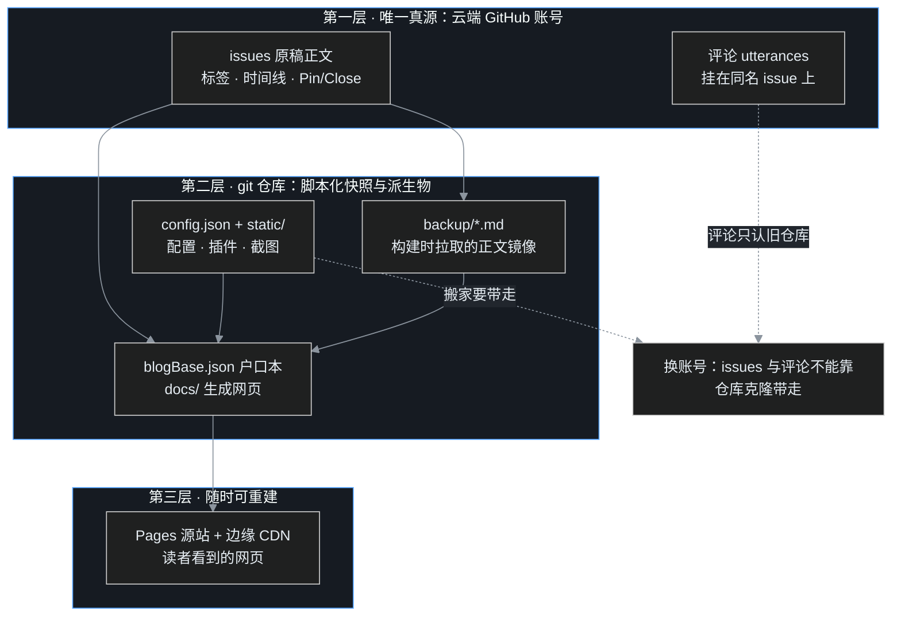

> B06 结尾，叶扬看着 CDN 响应头里的 `Age: 37` 心满意足：投递站、边缘节点、自定义域名都认全了。可合上电脑前忽然冒出一个不吉利的念头——这一仓库家当，万一哪天真没了呢？账号被盗、误删仓库、想换个账号从头开始，或者上游 Gmeek 升级翻车……每一样都不稀奇。地基篇的倒数第二篇，就来做这套**印刷厂失火预案**：哪些东西是唯一真源、哪些随时能再生、怎样备份、怎样升级、怎样搬家。

## 一、三层家当：先认清什么丢不得

预案的第一步不是买硬盘，而是分清家底的层次。叶扬把这几天散落在 B01–B06 的知识点收成一张图（本博客的 mermaid 运行时实时渲染）：



三层的性质完全不同：

- **第一层，云端 GitHub 账号里的 issues 和评论，是唯一真源。** 文章正文、标签、发布时间、Pin/Close 状态（B03 讲过的编辑部日常），全部只活在 GitHub 的数据库里。仓库可以克隆，但 `git clone` 下载不到 issues——它们不属于 git。
- **第二层，git 仓库里的脚本化快照与派生物。** `config.json`、`static/` 截图插件是叶扬亲手维护的；`backup/` 是构建时从 issues 拉下来的正文镜像；`blogBase.json` 和 `docs/` 网页则是派生物。这一层全部在 git 历史里，随时可回滚。
- **第三层，Pages 源站和边缘 CDN，B06 的主角。** 纯投递产物，删掉一次部署，下次构建原样再生，连备份都不用备。

记住一个判据：**能由第一层重新"印"出来的东西，都不值得恐慌；第一层本身出问题，才是真火灾。** 下面逐层验货。

## 二、backup/：37 份离线原稿，镜像但不是真源

每次构建，build 作业都会把云端生成的 `backup/` 目录复制回工作区并随 `🎉auto update by Gmeek action` 提交（工作流 `cp -a /opt/Gmeek/backup ${{ github.workspace }}` 那一行）。于是仓库里始终躺着一份文章原稿的离线副本。截至发稿，本站的 backup 目录长这样（数据取自本地仓库，37 个文件、609 KB）：


这份镜像的生成逻辑在引擎源码里只有几行（[Gmeek.py](https://github.com/Meekdai/Gmeek/blob/main/Gmeek.py) 的 `addOnePostJson`）：文件名用 issue 标题做非法字符净化，文件内容**逐字写入 `issue.body`**：

```python
mdFileName=re.sub(r'[<>:/\\|?*\"]|[\0-\31]', '-', issue.title)
f = open(self.backup_dir+mdFileName+".md", 'w', encoding='UTF-8')
if issue.body==None:
    f.write('')
else:
    f.write(issue.body)
```

随便打开一份，与对应 issue 的正文编辑器逐字一致，连 Markdown 符号都不带转义的：


这份镜像有三个要划重点的性质：

1. **它是镜像，不是真源。** 方向永远是 issue → backup，没有反向同步。直接改 backup 里的 md 不会改正文，下次构建还会被 issue 内容覆盖。改稿只走 B03 的正路：编辑 issue。
2. **全量构建会先把它整个删掉。** `cleanFile()` 开工第一件事就是 `shutil.rmtree(backup)`，重建空目录后再遍历所有 issue 逐篇拉取。所以"backup 被我误删了"根本不算事故——下次手动 Run workflow 走 runAll，一份新的自动回来。
3. **它救不了评论。** 评论通过 utterances 挂在 issue 上（B04），正文镜像里一个字都不会有。仓库被完整克隆，克隆体也不含评论数据——这是图中那条虚线"评论只认旧仓库"的含义。

backup 真正的价值在两个场景：**离线读自己的旧稿**（不用翻墙开 GitHub），以及**重建时的搬运参考**——不过如第六章所说，恢复 issue 还得配合标签和时间线的数据，光有 md 不够。

## 三、blogBase.json：58 KB 的全站点户口本

仓库根目录还有一个每次构建都被重写的文件：`blogBase.json`，本站实测 58 KB。B01 之后它多次在文章里跑龙套，这一篇请它正式出场。它是整个站点的**户口本**，结构可以拆成四块：


逐块解释：

- **`postListJson`：文章台账。** 本站 35 篇文章，键名是 `P` 加 issue 编号（如 `P38`）。每篇挂着 16 个字段：输出路径、标题、URL、标签、评论数、字数、摘要、发布时间、是否置顶、分享封面，外加注入用的 script/style/head。列表页、RSS、SEO 用的全是这份台账。
- **`singeListJson`：固定页台账**（官方拼写就是 singe，不要去提 PR 改名，改了引擎里到处对不上）。本站 `P6 → about.html`、`P16 → archive.html`，对应 G01 讲过的 singlePage 机制。
- **`labelColorDict`：标签配色字典**，14 个标签各自的颜色，构建时从 GitHub 标签实时读取。
- **config.json 的配置快照**：站名、`GMEEK_VERSION`、插件列表等整套配置也被抄进户口本。

户口本最反直觉的一点：**它可以直接删。** 主程序的启动逻辑写得明明白白：

```python
if not os.path.exists("blogBase.json"):
    print("blogBase is not exists, runAll")
    blog.runAll()
```

户口本不存在 → 自动判定为首次建站 → runAll 遍历全部 issue 重建一份。换句话说，它和 backup、docs 同属"可再生层"，区别只是后两者由工作流复制回仓库、户口本由引擎自己兜底。

但快照机制有个必须知道的副作用。**增量构建（runOne）用的是户口本里的旧配置**：

```python
oldBlogBase=json.loads(f.read())
for key, value in oldBlogBase.items():
    blog.blogBase[key] = value      # 先把旧户口本整体灌回来
...
blog.runOne(options.issue_number)  # 只重建这一篇
```

所以改完 `config.json`（换插件、改站名、调配置），单纯发一篇新文章不会让全站换血——只有被重建的那一篇拿到新配置，其余页面仍是旧快照。这就是反复强调的规矩：**改 config 必须手动 Run workflow 做一次全量构建**（B05 的 workflow_dispatch 点火，`issue_number` 为空串走 runAll）。

## 四、升级：last 到底有多新，怎样锁版与回滚

引擎每次构建都是现克隆的（工作流里 `git clone https://github.com/Meekdai/Gmeek.git /opt/Gmeek`），用哪个版本由 `config.json` 的 `GMEEK_VERSION` 说了算，本站设的是 `"last"`。备课这一篇时，叶扬在版本号上撞见一桩怪事。先看上游仓库的 Tags 页实拍（2026-09-18 截取的暗色页面）：


最新的 tag 是 **v2.25，打在 2026 年 2 月 5 日**。留意一个细节：**只有 v2.22 那一行末尾挂着 `Notes` 链接，v2.23、v2.24、v2.25 都没有**——Notes 是 Release 的入口，它缺席意味着这三个 tag 只打了标签、没有写发布说明。果然，[Releases 页](https://github.com/Meekdai/Gmeek/releases)的 Latest 至今仍是 **v2.22（2024-07-19）**，发布页像是停在了两年前，[Tags 页](https://github.com/Meekdai/Gmeek/tags)上的代码却一直走到了 2026 年。工作流的判定逻辑是：

```bash
lastTag=$(git describe --tags `git rev-list --tags --max-count=1`)
if [ $GMEEK_VERSION == 'last' ]; then git checkout $lastTag; else git checkout $GMEEK_VERSION; fi;
```

`git describe --tags` 只认 tag，不认 Release。所以 `"last"` 的真实含义是"最新 tag"，本站每次构建都跑在 v2.25 上。光看 Releases 页以为项目停更两年，纯属错觉。

由此得到三条升级策略：

1. **追新（默认）：保持 `"GMEEK_VERSION": "last"`。** 每次自动构建自动用最新 tag，作者修 bug 不用自己动手。代价是新代码先经过你的博客检验——Gmeek 是个人项目，没有 beta 通道。
2. **锁版（求稳）：把字段写成确切 tag**，如 `"GMEEK_VERSION": "v2.24"`。从此克隆下来恒定 checkout v2.24，上游打什么新 tag 都与你无关。建议在看到新 tag 后，先去 [commits 列表](https://github.com/Meekdai/Gmeek/commits/main)看改了什么，挑个空闲日子手动改成新 tag + Run workflow 全量验证。
3. **回滚（急诊）：新 tag 翻车时，把字段改回旧 tag，保存 config 后手动 Run workflow。** 引擎每次都是全新克隆，不存升级状态，所谓"降级"和"升级"是同一个动作。而且 `backup/`、`blogBase.json`、`docs/` 全在 git 历史里，万一新版改出了不兼容的户口本结构，`git revert` 那次自动提交也能兜底。

注意一个边界：GMEEK_VERSION 锁的是 **/opt/Gmeek 引擎**；你仓库里的 `.github/workflows/Gmeek.yml` 是从自己仓库 checkout 的，不在版本控制范围内。工作流动作（如 `deploy-pages@v4`）的升级靠的是 v4 这个大版本标签自动跟进，与引擎版本互不干扰。

## 五、搬家：转让与重建，两条路各自的代价

最正经的失火预案是搬家：换账号、换用户名，或者把博客托付给别人。GitHub 对"仓库搬家"给出两条路，待遇天差地别。

### 路线一：Transfer 整体转让

在仓库 **Settings → General → Danger Zone → Transfer** 里把整个仓库过户给新账号。官方文档明确承诺了什么、不承诺什么（实拍）：


转让的账要分四笔算：

- **issues 原样过户**：编号、正文、标签、时间线全部保留，`/issues/38` 之类的旧链接会自动跳转到新路径。这是它相对重建路线最大的优势。
- **评论随仓库走，但要重新接门铃**：utterances 的评论本质是仓库里的一批 issue（B04），它们也跟着过户；可 utterances App 的授权是给旧账号的，过户后需要在新账号重新安装 App、授权该仓库，并把 config 里评论插件的 `repo` 改成新坐标，门铃才会重新响。
- **git 与网页链接自动跳转**：旧仓库地址的 `git clone/fetch` 自动重定向，本地仓库只需 `git remote set-url origin <新地址>`（图中命令）。
- **Pages 不跳转——这是最痛的一条**：官方原文加粗声明"we don't redirect GitHub Pages associated with the repository"。旧地址 `oldname.github.io` 不会把读者导流到 `newname.github.io`，外面发出去的旧文章链接全成死链。旧账号若再建同名 user site，甚至会出现一个空白的新站点占住门牌号。

### 路线二：在新账号重建

不用 Transfer，而是新建仓库、把文章逐篇重新发成 issue。这条路能带走 config、static、backup 里的所有底稿，却有两个结构性伤口：

1. **issue 编号会重打，`urlMode=issue` 的链接全线断裂。** 本站用的是 issue 模式（B01 配置），URL 就是编号：`/post/38.html`。重建后第 38 号工单不再是 B05，搜索引擎收录、文章互链、发在别处的引用全部错位。引擎其实还提供拼音和俄语转写两种 URL 模式（`createFileName` 里按标题生成文件名），标题不变则地址不变——新建博客时若已预见会搬家，选标题派生模式天然抗改名；已经在 issue 模式上的老站，只能靠一张张重定向页或自定义域名补救。
2. **评论带不走。** utterances 的数据绑在旧仓库的 issue 上，官方没有提供迁移工具。技术上能用 GitHub API 把旧评论读出来再写回新仓库（评论作者会变成迁移操作人），属于高阶手术，地基篇不展开。

### 唯一的读者无感搬家法：自定义域名

B06 埋下的伏笔在这里收口。无论转让还是重建，只要读者手里的地址是**自己的域名**，搬家时只需要把域名的 CNAME/A 记录指向新的 `<账号>.github.io`，等 DNS 生效（最长 24 小时），读者连门牌变化都感觉不到——会变的只有域名背后的指向，文章 URL 全部原样保留（转让路线编号不变）。这是叶扬建议每一个认真写下去的博客尽早挂自定义域名的根本理由：**域名是你自己攥着的门牌号，GitHub 用户名不是。**

## 六、日常备份的三个习惯

听完事故课，落回日常。真正要养成的习惯只有三个，成本都很低：

1. **本地保留一个完整克隆，定期 `git pull`。** 不是下载 zip，是 `git clone` 下来的真仓库：config、static、backup、blogBase、docs 和全部历史都在。自动构建几乎天天有提交，每周 pull 一次，本地就是一份带版本史的快照。浅克隆（`--depth 1`）只有最新一版，救火时少一半弹性，别用。
2. **用 gh CLI 定期导出 issues 与评论的 JSON。** git 仓库里唯一缺的就是第一层数据，而 GitHub CLI 一行命令就能补齐：

```bash
# 导出全部工单（含正文、标签、状态、评论），时间戳命名归档
gh issue list --state all --limit 100 \
  --json number,title,labels,state,body,createdAt,comments \
  > "issues-$(date +%Y%m%d).json"
```

`comments` 字段会把每篇的评论作者、正文、时间一并带出——这是 backup 目录给不了的部分。配合仓库克隆，第一层和第二层就都有了离线副本。
3. **偶尔验证"真的能恢复"。** 备份不做恢复演练，等于没备。可以挑一篇旧文做抽样：从 backup 的 md 复制正文，在测试仓库新建 issue，核对标签与发布时间能否从 JSON 里补回。十分钟的抽样，能在真出事时省下整夜的冷汗。另外别忘了账号本身：给 GitHub 账号开两步验证、把恢复码存进密码管理器——第一层数据的安全边界，最终是账号安全。

顺带消除一个常见的过度操作：**不需要手动备份 `docs/`、CDN 和 Pages。** 它们是第三层，有第一层和第二层在，全量构建一次就全部重生。

## 七、翻车急诊室与小结

### 翻车急诊室

| 症状 | 病因 | 处方 |
|---|---|---|
| 手滑删了 blogBase.json | 它本就是可再生的户口本 | 什么都不用做，下次构建自动 runAll 重建（引擎会打印 `blogBase is not exists, runAll`） |
| backup 目录被删空/提交了错误修改 | 全量构建的 cleanFile 本来就先删后建 | 手动 Run workflow 走全量，以 issue 正文为准重新拉取 |
| 改了 config.json，发新文后旧页面配置没变 | runOne 沿用旧户口本快照 | 手动 Run workflow 触发 runAll 全站换血 |
| 直接编辑 backup 的 md，构建后改动消失 | backup 是 issue.body 的单向镜像 | 改正文只走编辑 issue 这条路（B03） |
| `last` 升到新 tag 后构建红叉或页面异常 | 最新 tag 没有 Release 缓冲期 | config 改回上一个稳定 tag，Run workflow 全量；必要时 git revert 自动提交 |
| 想锁版但不知有哪些版本 | Release 页最新只到 v2.22 | 看 [Tags 页](https://github.com/Meekdai/Gmeek/tags)，认 tag 不认 Release |
| 仓库转让后旧 Pages 地址打不开 | 官方明确不重定向 Pages | 提前公告新址；最佳解是转让前就挂自定义域名 |
| 重建博客后文章编号全变、旧链全死 | urlMode=issue 与编号绑定 | 新站用标题派生 URL 模式；老站做重定向页或上自定义域名 |
| 搬家后评论区空白 | utterances 授权与 repo 坐标指向旧账号 | 新账号重装 utterances App 并更新插件 repo 配置 |
| 本地只有 zip/浅克隆，想回滚历史文件 | 没有 git 历史可查 | 重新完整 `git clone`，记住以后不用 depth=1 |

### 小结

- 家当分三层：**云端 issues 与评论是唯一真源**；git 仓库里的 config/static 是手维护资产，backup/blogBase/docs 是镜像与派生物；Pages+CDN 纯投递，随时重生。
- `backup/` 是 37 份 `issue.body` 逐字镜像（本站 609 KB），单向同步、全量时先删后建、不含评论；`blogBase.json` 是 58 KB 户口本，**删了自动 runAll 重建**，但它的 config 快照决定了"改配置必须全量构建"。
- 升级三策：`last` 追最新 tag（当前 v2.25，2026-02-05）、写死 tag 锁版、改旧 tag 即回滚；**Release 页停在 v2.22 不代表停更**。
- 搬家两路线：转让保留编号与评论但 **Pages 不跳转**；重建要面对编号重打与评论丢失。**自定义域名是唯一读者无感的搬家法**。
- 备份三习惯：完整克隆定期 pull、`gh issue list --json ...,comments` 定期导出第一层、抽样演练恢复。

下一篇 **B08 是地基篇的收官**：叶扬会把系列开头埋的一个小机制补上——首页页脚、favicon 之外还能怎样做"轻装修"，再给整条地基线做一次总验收，并把路标指向 G01 起步的进阶层。B01 搭骨架、B02 刷墙、B03–B07 配齐了编辑部、印刷厂、投递站和保险单，最后一篇负责交房。

## 参考链接

- [Transferring a repository（Pages 不跳转的官方原文）](https://docs.github.com/en/repositories/creating-and-managing-repositories/transferring-a-repository)
- [GitHub Pages 官方文档（回顾 B06）](https://docs.github.com/en/pages/getting-started-with-github-pages/what-is-github-pages)
- [Meekdai/Gmeek Tags（认 tag 不认 Release）](https://github.com/Meekdai/Gmeek/tags)
- [Meekdai/Gmeek Releases（Latest 停在 v2.22）](https://github.com/Meekdai/Gmeek/releases)
- [Gmeek 引擎源码 Gmeek.py（cleanFile / addOnePostJson / runAll / runOne）](https://github.com/Meekdai/Gmeek/blob/main/Gmeek.py)
- [utterances 评论项目（数据寄生于仓库 issue）](https://github.com/utterance/utterances)
- [GitHub CLI：gh issue list 手册（--json 导出）](https://cli.github.com/manual/gh_issue_list)
- 上一篇：[B06｜网页怎样被全世界打开：Pages 投递站、CDN 缓存与自定义域名](/post/39.html)
- 地基回顾：[B01 建站实录](/post/32.html) · [B03 Issues 编辑部日常](/post/35.html) · [B04 评论门铃与 About 名片](/post/36.html) · [B05 Actions 值班日志](/post/38.html)
