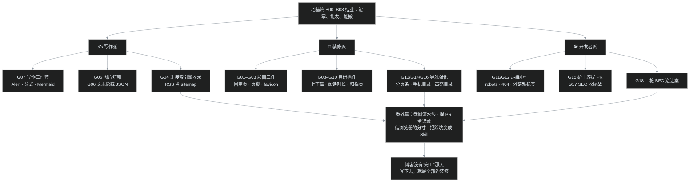

# B08｜交房验收：三态主题、页脚与 favicon、RSS，以及进阶指路

> B07 给印刷厂买好了失火保险，叶扬把 backup 镜像、blogBase 户口本、升级回滚和搬家路线逐一验明，心里踏实了。地基篇走到这里，房子能盖（B01）、能装修（B02）、能过日子（B03）、有门铃（B04）、有值班日志（B05）、通邮路（B06）、买了保险（B07）——只差最后一道工序：**轻装修与交房验收**。这是地基篇的收官篇，先做四件不写代码也能完成的门面装修，再拿一张总验收单逐条打勾，最后把路标指向 G 系列进阶层。

## 一、三态主题：太阳、月亮与同步圆环

看本站右上角，主题按钮旁那一列圆圈图标里，最右边一个就是主题开关。它不是简单的明暗二选一，而是**三态循环**：在页面上点一下，顺序是亮色 → 暗色 → 跟随系统 → 再回亮色。三种状态各有各的图标与配色，下面三张是同一首页在三态下的实拍，连右上角的图标都不一样：


三态的行为在引擎模板 `templates/base.html` 里写得很直白，可以当成一份小型的前端状态机来读：

```javascript
// <html> 上的 data-color-mode 决定整套 Primer 配色
let theme = localStorage.getItem("meek_theme") || "light";
document.documentElement.setAttribute("data-color-mode", theme);

// 点击按钮：light → dark → auto，三态循环
let newMode = currentMode === "light" ? "dark"
            : currentMode === "dark"  ? "auto" : "light";
localStorage.setItem("meek_theme", newMode);
```

三个要点：

1. **选择存在浏览器本地。** `localStorage` 的键叫 `meek_theme`，所以主题是"这台设备上这个浏览器"的个人选择，不影响其他读者，也不写进仓库。第一次访问、还没有存值时默认亮色（`|| "light"`）。
2. **"跟随系统"靠的是 CSS 媒体查询。** auto 态把决定权交给操作系统的深浅色设置，白天亮色、晚上系统一切暗色它就跟着暗——手机用户尤其喜欢这一档。
3. **评论区会跟着换肤。** 还记得 B04 的 utterances 吗？切换主题时页面会向评论 iframe 发一个 `postMessage`，把评论主题切成 `github-light` / `dark-blue` / `preferred-color-scheme`，文章和评论永远同色，不会一块亮一块暗。

这套机制由 config 的 `themeMode` 字段掌管，默认值 `"manual"` 就是上面的手动三态；如果设成 `"fix"`，主题按钮会直接 `display:none` 藏起来，站点恒定一种配色——绝大多数博客用默认的 manual 即可，知道有这个开关就行。另外提醒一个截图圈才会遇到的冷知识：无头浏览器里如果样式表加载失败，页面会退回"白底 + 内联彩色标签"的半裸状态，排查时别误当成主题 bug（那是 Primer CSS 没加载，见番外一的白底怪案）。

## 二、页脚：网站运行 N 天，与一行版权小字

把任意一篇文章滚到最底，页脚区域其实塞了三样东西。这是 B07 那篇文章底部的实拍：


从下往上看：

- **版权年自动更新。** 页脚第一行 `Copyright © 2026 叶扬的博客`，年份不是手写的，而是模板里一行 `new Date().getFullYear()` 现场算出——明年它自己会变成 2027，永远不用回来改。
- **网站运行 N 天。** 第二行的"网站运行 5 天"由 `startSite` 字段驱动：模板拿今天减去建站日，`Math.floor(diff / 一天的毫秒数)` 取整。本站 `"startSite": "09/13/2026"`，发稿当天正好第 5 天。**这个日期必须是 `MM/DD/YYYY` 斜杠格式**，写成 ISO 横杠格式会被浏览器按 UTC 解析，导致"运行 -1 天"的灵异现象（G02 页脚装修那篇专门踩过）。留空则整段运行天数不显示。
- **Powered by Gmeek。** 这是开源博客的礼貌署名，建议保留。

图中那个"总浏览量 643 次"不是框架自带的，而是本站挂的 `GmeekVercount` 计数插件（config 的 `allHead` 字段，全站注入）；"本文浏览量 9 次"也是它。地基版不装它页脚照样完整，进阶想加再看官方插件清单。

右上角那句 `✍️ 原创文章，转载请注明出处～叶扬谢谢你来过 ❤️` 则是 config 的 `bottomText` 字段，每篇文章末尾右对齐的一行小字，写座右铭、版权声明、一句玩笑都行。它在模板里是个 `float:right` 的浮动元素——这个浮动后来还在手机上制造过一次"上一篇/下一篇被挤窄"的 BFC 事故，那是 G18 的故事。

## 三、favicon 与 og.png：浏览器标签和分享卡片上的脸

门面装修的第三件，是给站点两张"脸"。

第一张是 **favicon**——浏览器标签页标题左边那个小图标。config 里用 `faviconUrl` 指定，本站指向自制的 `/favicon.svg`：


这个 SVG 的巧妙处在于**一个文件自适应明暗**：文件内嵌了一段 `@media (prefers-color-scheme: dark)` CSS，浏览器标签在亮色主题下给它白底，暗色主题下自动换成 `#0d1117` 深底，描边透明度也跟着调。读者切换系统主题，标签上的小方块会自己变色，不需要准备两份图标。自制 SVG favicon 与社交封面的完整做法（含"ogImage 只认 PNG/JPG 位图且必须绝对 URL"的坑）在 G03 里有全过程。

有个省心的默认规则值得记住：`faviconUrl` 不配时，框架会让它**自动继承头像**——

```python
if "faviconUrl" not in self.blogBase:
    self.blogBase["faviconUrl"] = self.blogBase["avatarUrl"]
```

所以零配置阶段，标签页上直接就是你的 GitHub 头像，并不空缺。

第二张是 **og.png 社交分享封面**：读者把文章链接贴到微信、Twitter、Slack 等支持 Open Graph 的地方时，预览卡片上显示的 1200×630 大图。本站的封面长这样（这张图就部署在站点根目录 `/og.png`，可直接点开）：


config 的 `ogImage` 字段填它的**绝对网址**即可。favicon 是"小而频"的品牌触点，og.png 是"大而稀"的分享门面，两张都就位，博客在标签栏和分享卡片里就都有了统一的脸。

## 四、RSS：不用上门，也能收到更新

第四件装修藏在页头那一排图标里——RSS 按钮（电波状图标），指向固定地址 `/rss.xml`。它是一份机器可读的"更新目录"，用浏览器直接打开是 XML 源码，用 RSS 阅读器订阅则会自动收到每一篇新文章。下面是本站 feed 的真实结构（2026-09-18 截取）：


关于这份 feed，有四件事值得知道：

1. **全自动，零配置。** 每次构建（无论全量还是增量）引擎都会重新生成 `rss.xml`，用的是 `python-feedgen` 库。发一篇新文章，feed 里自动多一个 `<item>`，最新的排在最前。固定页 About、归档也在 feed 里，且排在最前。
2. **摘要按句切。** 每个 `<item>` 的 `<description>` 默认取正文第一句（`rssSplit: "sentence"`），读者在阅读器里看到引子，点链接回站读全文。
3. **`ttl=60` 是建议刷新间隔。** 单位分钟，告诉阅读器"这份目录 60 分钟内不用反复来问"，是个礼貌的缓存提示，不是强制。
4. **它同时是搜索引擎的藏宝图。** G04 那篇里，叶扬直接把 `rss.xml` 当作 sitemap 提交给了 Google 和 Bing——每个 item 都是一篇文章的标准链接 + 标题 + 发布时间，结构上本就是一份合格的文章地图。

读者怎么用？装一个 RSS 阅读器（各类平台都有免费选择），把 `https://用户名.github.io/rss.xml` 加进去即可。以后博客更新，阅读器自己来取，读者不必记住网址、也不用刷首页。在算法投喂的年代，这是一种"作者发布、读者主动订阅"的老式体面。

## 五、交房验收单：B01–B07 逐条打勾

装修做完，正式交房。下面这张单子把地基篇交过的东西列成可点、可看、可操作的验收项——建议打开自己的博客照着走一遍，全部通过，地基即合格：

| 篇 | 交付物 | 怎么当场验收 |
|---|---|---|
| B01 | 一个 `<账号>.github.io` 仓库 + 第一篇文章 | 浏览器打开首页能看到文章，网址是根域名而非 `/仓库名/` 子路径 |
| B02 | 属于自己的站名、副标题、头像 | 首页大标题、副标题、头像都已换成你的；改过 config 后做过一次手动全量构建 |
| B03 | Issues 编辑部工作流 | 能新建带标签文章；能编辑改稿；试过 Pin 置顶（首页顺序变化）与 Close 下架 |
| B04 | 评论区 + About 页 | 文章底部"评论"按钮能点开 utterances 并登录留言；`/about.html` 能打开 |
| B05 | 看得懂 Actions 值班日志 | Actions 页能区分 workflow_dispatch / issues / schedule 三种触发；红叉会按四步排查法找第一个红 step |
| B06 | 通了的投递站 + 可选自定义域名 | 绿勾后等 ≤10 分钟全网可访问；F12 能看到 `X-Cache`、`Age`、`max-age=600` 响应头 |
| B07 | 失火预案 | 本地有完整 `git clone`；知道 backup/blogBase/docs 都可再生、issues 才是真源；`GMEEK_VERSION` 知道去哪锁版 |
| B08 | 四件轻装修 + 进阶地图 | 主题三态可循环；页脚运行天数正确；favicon 与 og.png 就位；`/rss.xml` 能打开 |

还有几条贯穿全篇的"居住常识"，也一并收进验收单：自动提交 `🎉auto update by Gmeek action` 是正常现象（B05）；`docs/` 里的东西手改活不过下次构建（B05/B07）；改 `config.json` 或新增 static 文件后必须手动 Run workflow 全量（B02/B07）；无标签的文章会在构建时报 `KeyError`（B03/B05）。

## 六、进阶指路：G 系列地图

地基篇到这里就讲完了，但这套房子能做的远不止此。叶扬的博客在地基之上又盖了一整套"精装修"——G01 到 G18 共十八篇进阶文，外加五篇番外。按兴趣可以分三条路线走（本博客的 mermaid 运行时实时渲染）：



三条路线按需取用：

- **写作派**最关心内容表达：G07 的 Alert 提示块、数学公式、Mermaid 图表，G05 的图片灯箱，G06 给单篇文章开小灶的隐藏 JSON，G04 的搜索引擎收录。
- **装修派**想让博客更好用、更好看：G01–G03 脸面三件，G08–G10 三个自研插件（上一篇/下一篇、字数阅读时长、时间线归档页），G13/G14/G16 的分页条与两级文章目录。
- **开发者派**喜欢刨根问底：G11/G12 的 robots、404、外链治理，G15 给 Gmeek 上游提 PR 的完整记录，G17 的 SEO 收尾战，G18 那个被浮动元素挤扁的 BFC 案例。

五篇番外则是"工具与方法论"支线：无头浏览器截图流水线、ffmpeg 录屏、提 PR 的开源回馈、让 AI 借已登录浏览器截图的分寸感、以及怎样把踩坑手册沉淀成 AI 技能。它们和正篇交织，但不强依赖顺序，遇到对眼的标题随时跳进去。总目录在置顶的 [G00 总揽](/post/5.html)。

## 七、翻车急诊室

| 症状 | 病因 | 处方 |
|---|---|---|
| 点主题按钮没反应/找不到按钮 | config 里 themeMode 设成了 fix | 改回默认 manual 后手动全量构建 |
| 主题只在这台设备生效，换电脑又回亮色 | 主题存 localStorage，本就是本地选择 | 正常现象；想要暗色就再点一次或选跟随系统 |
| 评论区颜色和文章不一致 | 浏览器挡住了 utterances 的 postMessage，或评论 iframe 加载失败 | 刷新重点评论按钮；确认没屏蔽第三方框架 |
| 页脚显示"网站运行 -1 天" | startSite 写成了 ISO 横杠日期 | 改成 `MM/DD/YYYY` 斜杠格式（G02） |
| 填了 startSite 却不显示运行天数 | 全量构建没跑，旧页面未更新 | 手动 Run workflow 走 runAll |
| 标签页 favicon 还是默认头像 | faviconUrl 未配置或路径不对 | 配置绝对/根路径 URL；不配置则默认继承头像 |
| 分享链接没有大图预览 | ogImage 缺失、用了 SVG 或相对路径 | 用 1200×630 PNG/JPG + 绝对 https URL（G03） |
| RSS 阅读器报无法解析 | 曾手改过 docs/rss.xml | 别手改，它每次构建自动重生成；重新全量即可 |
| 新文章没进 RSS | 增量构建失败，或阅读器还在 ttl 缓存内 | 看 Actions 绿勾；等过 60 分钟再刷新订阅 |
| 无头截图/预览里页面白底裸奔 | Primer CSS 没加载成功 | 网络问题，与站点配置无关（番外一白底怪案） |

## 八、小结：房子交了，日子才刚开始

地基篇九篇（B00 总览 + B01–B08）到此收官。回头看这条线交出去的东西：

- **B01–B02** 盖起毛坯房并刷好墙：仓库命名、Pages 切 Actions、第一篇文章、config.json 四必填；
- **B03–B04** 配齐生活设施：Issues 写改置顶下架、utterances 评论门铃、About 名片；
- **B05–B06** 打通后勤：Actions 三种点火与红叉排查、Pages 投递站与 CDN 缓存、自定义域名；
- **B07** 买好保险：三层家当、镜像与户口本、升级回滚、搬家路线、备份三习惯；
- **B08（本篇）** 轻装修并交房：三态主题、运行天数页脚、favicon 与 og.png、自动 RSS，外加一张验收单和进阶地图。

从一个 GitHub 账号都没有，到一个能写、能发、能被全世界打开、丢了还能原样复活的博客——地基已经足够结实，够你在上面写很多年。

但叶扬更想说的是最后一句：**博客从来没有"完工"的那一天。** 三态主题会换，运行天数会涨，插件可以一个个加，文章可以一篇篇写；装修派、写作派、开发者派的地图都摊在那里，随时可以挑一条路走。而所有这些装修的前提，都是你真的开始写。房子交了，日子才刚开始——下一篇见。

## 参考链接

- [Gmeek 引擎源码 Gmeek.py（favicon 继承、rss 生成、默认配置）](https://github.com/Meekdai/Gmeek/blob/main/Gmeek.py)
- [Gmeek 模板 base.html / footer.html（三态主题与运行天数）](https://github.com/Meekdai/Gmeek/tree/main/templates)
- [本站实时 RSS feed](/rss.xml)
- [RSS 2.0 规范（ttl、item 字段含义）](http://www.rssboard.org/rss-specification)
- [web.dev：如何定义 favicon 与主题色](https://web.dev/learn/html/metadata)
- 地基篇上一篇：[B07｜印刷厂失火预案：backup、blogBase、升级与搬家](/post/40.html)
- 进阶总目录：[G00 插件与功能全景调研](/post/5.html) · [G02 页脚装修](/post/8.html) · [G03 favicon 与社交封面](/post/9.html) · [G04 RSS 提交搜索引擎](/post/10.html)
