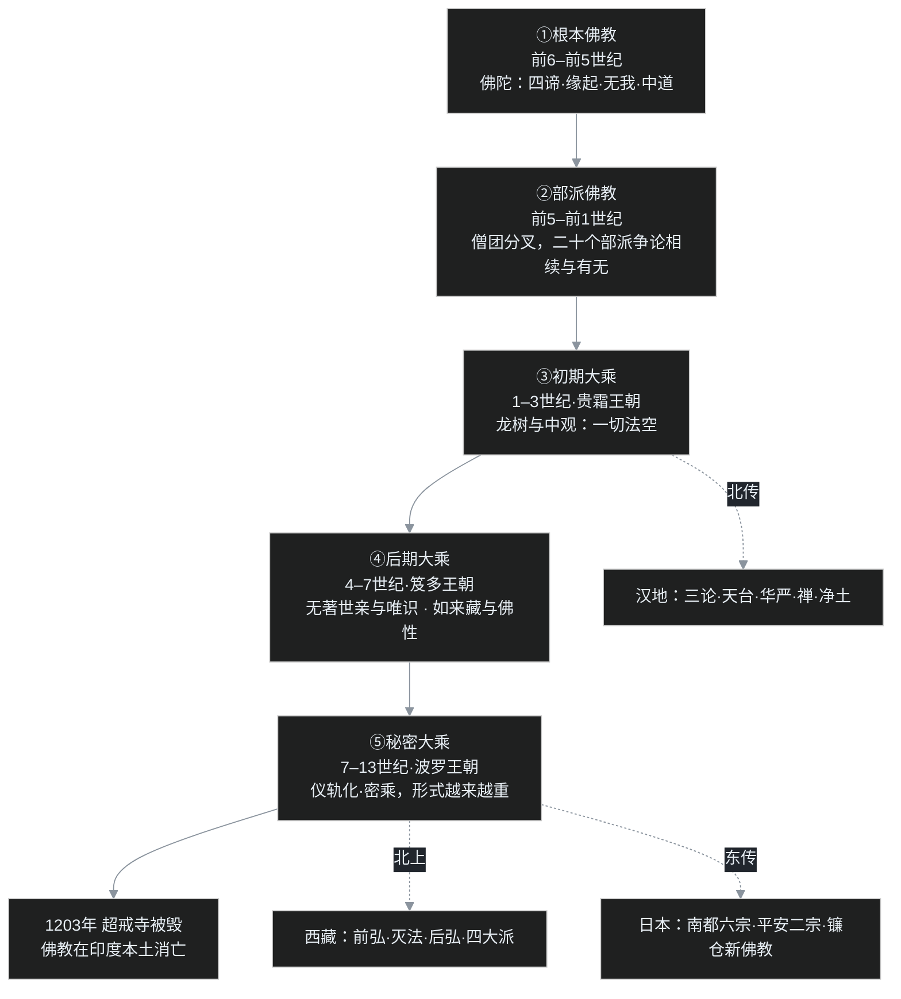

# C00｜一个程序员为什么要啃印度佛教史

> 🗺 [博客地图](/post/47.html) ｜ 全部系列的总入口

叶扬硬盘里躺着近 47 万字的课程讲稿。

那是一门 39 集的《印度佛教史》课程字幕。前面两篇文章讲过这些讲稿是怎么来的：65 个字幕文件的[下载历险记](/post/44.html)，和 136 条规则的[清洗流水线](/post/43.html)。工具人的活干完，真正的硬骨头才摆上桌——**读懂它**。

于是就有了这个新系列。开篇先交代三件事：为什么学、文章为什么长这样、这门课的全景地图长什么样。

## 一、一个程序员，为什么要学佛教史

先说清楚，叶扬既没有出家的打算，也没有被谁点化。理由有三个，而且都很"职业病"。

**第一，这是一部有完整版本记录的思想史，软件演化该有的环节它一个不缺。**

从公元前 5 世纪佛陀说法，到公元 13 世纪佛教在印度本土消亡，前后一千八百年。打个软件行业的比方，这套系统经历了：五次大版本更新（根本佛教、部派佛教、初期大乘、后期大乘、秘密大乘）；一次剧烈的社区分叉——一群人把代码整个复制走另立门户，统一僧团裂成二十个各改各的分支；一次向下兼容的重构——新版本不删老功能，老用户照用，新思想直接在旧系统上面加层；三套互相竞争的架构方案（中观、唯识、真常），回应的是同一组老大难问题；后期疯狂照搬隔壁竞品（印度教，也就是竞争对手的产品）的功能，抄到两家越来越像，反而丢了自己的用户；最终在主场下线（1203 年那烂陀寺、超戒寺被毁），但装在海外用户设备上的客户端在西藏、汉地、日本、东南亚活了下来，各自长成了完全不同的样子。

代码分叉、新旧兼容、欠技术债（补丁越打越多，债早晚要还）、本土市场打不过原生应用——软件业的这些经典剧情，这门课里一个不缺，只是时间尺度从几年拉成了一千八百年。

**第二，它的核心问题，和程序员天天打交道的问题是同构的。**

佛教最出名也最难的主张叫"无我"：没有一个常住不变的"我"。但它同时讲轮回、讲因果业报。问题立刻就来了——没有"我"，那上辈子造业、这辈子受报的，到底是不是同一个"我"？这个问题印度各派争了几百年，先后拿出过五六个解决方案，一个比一个精巧。

用程序员的话说：**一条数据没有固定的 id（数据库给每条记录发的"身份证号"），被改了无数次之后，你凭什么证明"它还是它"？** 后来唯识学交出的答案——一个不断被读写、又不断被写入内容改写的存储层（存数据的底层）——和数据库的某些核心机制像得叶扬直拍桌子。当然，类比只是拐杖，这个系列会把拐杖什么时候该扔也标出来。

不写代码的读者记住大白话版本就行：**一个每时每刻都在变化的东西，怎么对自己的过去负责。** 术语以后再给，先记住这个问题。

**第三，这门课本身够硬，不是心灵按摩。**

教材是印顺法师的《印度佛教思想史》，讲课老师全程在和教材辩论：书里说大乘是从大众部"发展"出来的，老师花两讲反驳；书里把如来藏思想判成密教化的先声，老师直接翻案。上这门课不是听人念经书，是围观一场师生之间持续了几十讲的学术吵架。这种课，值得认真对待。

## 二、这个系列不是什么

三句话先划界，免得点进来的读者期待错位。

- **不是传教。** 叶扬在这个系列里的身份是学生，不是信徒。讲的是"历史上这些人怎么想、为什么这么想"，不是"你应该信什么"。
- **不是修行指南。** 不教打坐、不教念佛、不指导任何宗教实践，只做思想史和教理的知识梳理。
- **不是字幕搬运。** 课程字幕是叶扬个人学习材料，这个系列只讲一千多年来的公共历史知识，用自己的话重讲，并在文末给出原课程和参考书，感兴趣的读者可以自己去追源头。

## 三、为什么文章要写成这个样子

方法是现成的：[费曼学习法](https://baike.baidu.com/item/%E8%B4%B9%E6%9B%BC%E5%AD%A6%E4%B9%A0%E6%B3%95)。核心操作只有一句话——**如果你不能用大白话把一件事讲给外行听懂，那就是还没懂。**

所以这个系列的每一篇，都按同一套结构来：

1. **开场一个小白真问题**。就是那种外行一听就会问、问出来还特别容易把人问住的问题，比如"没有我谁在轮回""空是不是什么都没有"。
2. **大白话正文**。所有术语第一次出现都"先白后专"：先讲一个不关机的后台进程，再给出"阿赖耶识"这个学名。
3. **一个程序员类比**。每篇至多一个，点到为止；程序员读者会心一笑，不写代码的读者也不用慌，每个类比后面都跟一句大白话。另外会主动交代类比的破洞在哪——所有类比都会在某处误导人，自己先说破，比让读者踩坑强。
4. **吵架现场**。把反方请上场。一个观点不经一两次攻击就不算讲清楚：婆罗门会怎么反驳佛陀？说一切有部会怎么挑中观的毛病？让反方真的开口吵。
5. **叶扬的卡壳角**。自曝学到哪儿卡住了、后来怎么打通的。一路全懂的讲解没人信，卡壳才是学习真正发生的地方。
6. 末尾一张图或一张表，加一个术语清单，再抛下一篇的钩子。

## 四、先给地图：五期一千八百年

细节后面一篇篇填，现在只需要记住主干。佛教在印度的历史就分五段：

记五个关键词就够：**根本、部派、中观、唯识、密乘**。后面所有内容都是挂在这条时间线上的。

另外有三条暗线，会在 C01 到 C12 里反复出现，这里先埋个伏笔：

- **相续线**：没有我，怎么解释轮回的延续？从佛陀到部派到唯识到如来藏，每一家都在给上一家的方案打补丁。
- **空义线**："空"从"人没有我"一路深化到"一切事物都没有固定自体"，每深入一步都要防止有人把它读成"什么都没有"。
- **变质线**：念佛、造像、持咒，这些形式最初是什么？什么时候还是修行，什么时候只剩壳子？这条线的终点是一个非常刺眼的历史教训。

## 五、卡壳角：开课前，叶扬错了两件事

想当然之一：以为佛教史就是寺庙史，讲讲哪朝建了什么庙、哪个和尚渡了海。结果第一讲是公元前两三千年的印度河文明、雅利安人迁徙、婆罗门教的三大纲领和六种外道——这是轴心时代的世界观混战，和中国的诸子百家、希腊的哲学家是同一时间刻度上的事。

想当然之二：看到"大乘""小乘"的字样，下意识以为是"高级版/低级版"的关系，像旗舰款和入门款。后来才知道，"小乘"是大乘兴起后给对手起的名字，对方自己从不这么自称（今天礼貌的叫法是"上座部佛教"）；两派争的不是配置高低，而是**修行的目标和方法论**。打个广告业的比方：竞品 A 管竞品 B 叫"低配款"，你总不能拿对手的广告词当行业报告读吧？这个误会，恰恰是 C05 要专门拆的。

## 六、怎么读这个系列

- **零基础可读**，不需要任何宗教或哲学储备，按编号顺序读就行，每篇只依赖前几篇埋的概念。
- 主教材是印顺《印度佛教思想史》，参考书是平川彰《印度佛教史》和吕澂《印度佛学源流略讲》（[豆瓣可查各版本](https://search.douban.com/book/subject_search?search_text=%E5%8D%B0%E5%BA%A6%E4%BD%9B%E6%95%99%E6%80%9D%E6%83%B3%E5%8F%B2)），原课程在 [B 站 BV1vewnzqEuA](https://www.bilibili.com/video/BV1vewnzqEuA/)。
- 叶扬会边学更，讲错的地方欢迎评论区拍砖，勘误会在原文更新。

### 系列路线图

✅ 已发布 / ⏳ 计划中。状态只在这张表和下面的发布日志里维护：发一篇，叶扬回来勾一篇。括号里是对应的课程讲次。

| 编号 | 主题 | 讲次 | 状态 |
|---|---|---|---|
| C00 | 本文：序章，一个程序员为什么要啃佛教史 | — | ✅ |
| C01 | [佛陀出场之前，印度人到底在信什么](/post/48.html) | 01 / 26 | ✅ |
| C02 | [佛陀开出的药方：四谛、八正道，和一条没有主角的因果链](/post/49.html) | 03 / 29 | ✅ |
| C03 | 没有我，谁在轮回 | 03 / 06 / 07 | ⏳ |
| C04 | 僧团为什么吵分裂：二十部派 | 05–07 / 30 / 31 | ⏳ |
| C05 | 大乘登场：「非佛说」之辩 | 08–11 / 32 | ⏳ |
| C06 | 龙树的空：二谛与八不（可能拆上下） | 09 / 12 / 13 / 33 | ⏳ |
| C07 | 唯识：阿赖耶、三性与转识成智（可能拆上下） | 14–16 / 35 | ⏳ |
| C08 | 如来藏与佛性 | 17 / 18 / 36–38 | ⏳ |
| C09 | 密乘与 1203：佛教怎样在印度本土灭亡 | 19–22 / 39 | ⏳ |
| C10 | 北上西藏（只写古代史，止于清代） | 23 | ⏳ |
| C11 | 东传日本 | 24 | ⏳ |
| C12 | 三链收官：相续、空义、变质，加一份书单 | 全部 | ⏳ |

**发布日志：**

- **2026-09-19 · C00 序章**：本文，1 张五期地图 + 1 张讲稿文件夹实拍。
- **2026-09-19 · [C01 佛陀出场之前](/post/48.html)**：1 张文明时间线 flowchart + 1 张四方立场对照表，对应第 1 讲与第 26 讲重录版。
- **2026-09-19 · [C02 佛陀开出的药方](/post/49.html)**：1 张四谛医诊 flowchart（含戒定慧三学 subgraph）+ 四谛医生流程表、十二缘起三世二重因果表各 1 张，对应第 3 讲与第 29 讲重录版。

下一篇，C03：十二缘起里没有"我"，那上辈子造业、这辈子受报的到底是谁？如果"我"根本不存在，修行、解脱、轮回又如何成立？——佛教最难也最容易被误解的一题：无我，谁在轮回。

> 说明：本系列为个人学习笔记，讲的是公共历史知识，不引用课程字幕原文，也不代表任何宗教立场。原课程与教材版权归权利人所有，文末链接即是入口。

