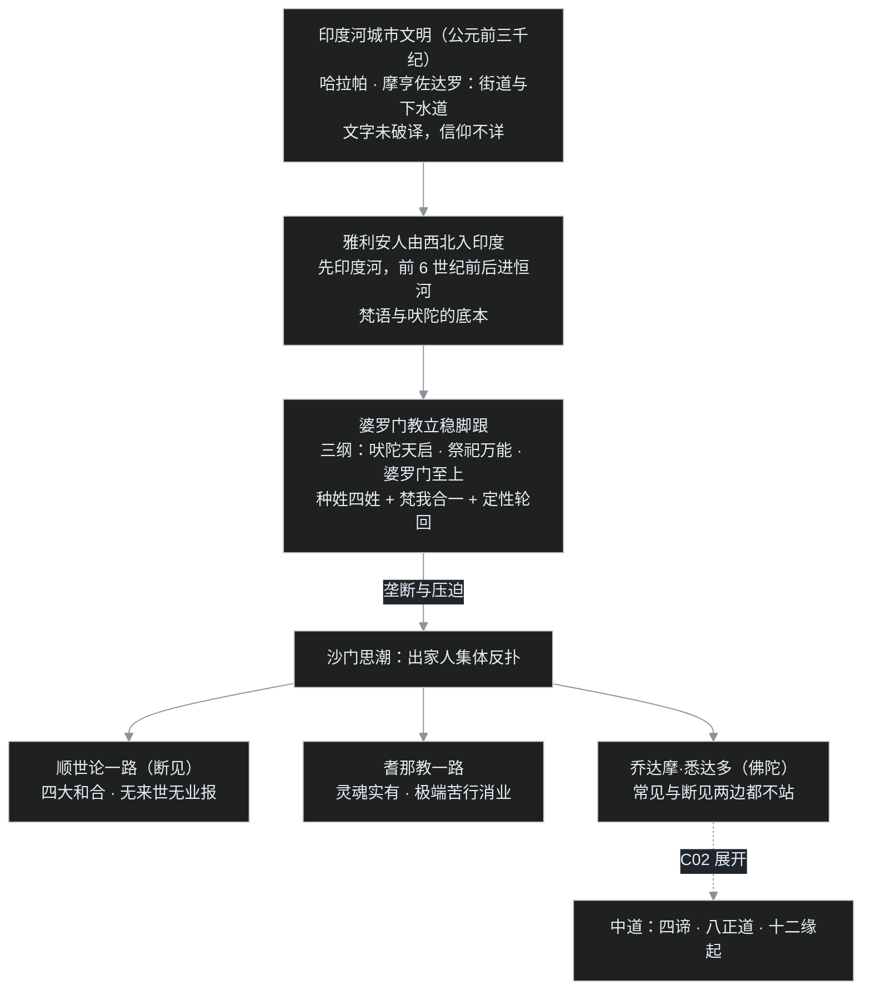

先问一个有点反常识的问题：佛教张口就说"众生平等"，可它偏偏出生在人类最顽固的等级社会里——一个人能跟谁同桌吃饭、能走哪条路、甚至影子碰到别人算不算冒犯，全由出生的家族决定。这么一套铁板一块的秩序，是怎么给一个"反对者"留出位置的？

[C00 序章](/post/45.html)结尾留过一句话：理解了佛陀在反对什么，才能听懂佛陀到底说了什么。这一篇就把舞台先搭好——佛陀出场之前，印度人到底在信什么。

## 一、先把时间和地点摆正

佛陀生活在公元前 6 到前 5 世纪。这个时间点值得多看一眼：在中国是春秋战国，在希腊是苏格拉底前后的哲学家群像，在印度则是邦国林立、思想爆炸的年代。雅斯贝尔斯后来把这几处几乎同时发生的精神突破统称为"轴心时代"——意思是此后人类几大文明的思考框架，都是在这几百年里奠定的。

当时的印度没有大一统帝国，大地盘是所谓**十六大国**，小一点的一个城邦就算一国。佛陀出生的迦毗罗卫，就是个排不进十六国名单的小城邦。后来佛陀弘法主要走动于两大国之间：摩揭陀（王舍城一带）与憍萨罗（舍卫城一带）。记住这两个名字，后面经里反复出现的"竹林精舍""祇园精舍"都在这两个国家。

## 二、两段前史：一座消失的城，和一群南下的牧民

佛陀不是凭空出现在荒地上的。在佛陀之前，印度这片土地已经有两段很深的前史。

**第一段是印度河流域的城市文明。** 早在公元前三千纪，印度河流域就有了哈拉帕、摩亨佐达罗这样的城市——有规划整齐的街道，有覆盖全城的下水道系统，文明程度相当高。这个文明后来衰落了，原因至今没有定论，气候变冷、季风减弱导致干旱是近年比较受重视的解释。它留下的文字印章至今没有破译，所以严格说，我们不知道这些城里人信什么。

**第二段是雅利安人的到来。** 一群说印欧语系语言的游牧/半游牧人群，从西北方向进入印度，先在印度河流域立足，再逐步东移；进入恒河流域并形成定居社会，学界比较有把握地定在公元前 6 世纪前后。这群人带来的语言就是**梵语**的祖先，带来的祭祀诗歌就是后来吠陀的底本。下面要讲的婆罗门教，正是这群人的宗教。

两个细节先埋着：一是经文当时靠口耳相传，后来才写在贝多罗树叶上，所以叫"贝叶经"；二是"雅利安"这个词在课上引发了一次卡壳，放到第六节细说。

## 三、婆罗门教：天启、祭祀、和一个写死的等级

到佛陀的时代，恒河流域的主流意识形态是**婆罗门教**。它的骨架可以记成三条纲领，简称**三纲**：

1. **吠陀天启**——经典《吠陀》不是人写的，是圣人在禅定中"听"到的神圣声音，所以一个字不能改、不能质疑（"吠陀"本意就是"知识、启示"）。
2. **祭祀万能**——想要好报，办法是举行祭祀，而祭祀只有专业人员能操作。
3. **婆罗门至上**——能操作祭祀的专业人员，构成最高等级。

《吠陀》是一个文献集合，最古老、最核心的是**梨俱吠陀**，此外有娑摩吠陀（歌咏）、夜柔吠陀（祭词）、阿闼婆吠陀（大量咒术）；解释祭祀怎么做的手册叫**梵书**，再往后一批深入讨论宇宙与自我的哲学文献叫**奥义书**。两部大史诗《罗摩衍那》《摩诃婆罗多》（后者里有著名的《薄伽梵歌》）也属于这一传统。

奥义书贡献了两个统治印度思想几千年的观念。一个是**梵我合一**：宇宙有一个终极本体叫"梵"（大梵），每个人身上那个真正的"我"叫**阿特曼**（小我），小我本质上和大梵是同一个东西，人生的终极是回归这种同一。另一个是**轮回**：死了不是结束，会换个身体继续。

关键在于，婆罗门版本的轮回是**"定性"的**：灵魂和它所在的等级生生世世绑定，低种姓的人修得再好，下辈子还是低种姓——这套理论实际上在为阶级固化服务。配套的社会制度就是**种姓**，早期分四大等级（**四姓**）：

| 种姓 | 身份 | 类比成系统权限 |
|---|---|---|
| 婆罗门 | 宗教师、掌握吠陀与祭祀 | root 管理员组 |
| 刹帝利 | 王族、武士 | 有 sudo（临时管理员授权）的高权限组 |
| 吠舍 | 农人、手工业者、商人 | 普通账户 |
| 首陀罗 | 奴仆、劳役者 | 只读的受限账户 |

四姓之外还有被称为**旃陀罗**的"不可接触者"，连影子碰到高种姓都被认为是污染——类比成系统，就是**一个连登录权限都被剥夺的账号**。

给不写代码的读者解释一下这个类比：**权限，就是一个账号在系统里能干什么、不能干什么；root 是系统里的最高管理员，sudo 是临时申请到管理员授权；"写死"就是这套角色在代码里固定死了，没有任何"升级"接口。** 种姓最残酷的地方正在于此——它不是一时的贫富，而是出生即分配、终身不可变更、连轮回都不重新授权的永久角色。佛陀后来讲"随业升沉"，意思接近"角色不写死，按行为记录动态评定"，这在当时是石破天惊的说法。

**但这个类比有个必须当场戳破的洞**：权限模型里总得有个 root 或管理员在负责授权，而佛教恰恰不承认有这么一个管理员、一个造物主；"业"不是谁在后台打分，而是行为自身带出的因果延续。这个洞很重要——为什么没有管理员、没有常住的"我"，轮回却还能成立？这正是 C03 要啃的硬骨头，先记住这里有个问号。

这套秩序的阴影有多长，可以用一个课上提到的数字感受：直到 1956 年，印度还有一位叫安倍卡的领袖，率领大约五十万"不可接触者"集体改宗佛教，用改换信仰的方式对种姓制度做了一次大规模抗议。

## 四、沙门潮：一群用脚投票的出家人

有压迫就有反弹。在佛陀的青年时代，恒河流域已经兴起了一大批**不买婆罗门账的人**，统称**沙门**——意思是出家修行者。这个词要记牢：佛教僧团在当时也只是沙门运动里的一支，佛陀的身份首先是"一位沙门导师"，不是从天而降的异类。

沙门的共同点是：否定吠陀的绝对权威，反对婆罗门垄断宗教，出家、乞食、修行，想靠自己的实践找到出路。但出路在哪里，各家分歧极大。课上重点讲了和佛陀同时代、和主线关系最大的三位（佛典把当时六位著名论师合称**六师外道**，这里只列三位）：

- **阿耆多·翅舍钦婆罗**代表的**顺世论**（又叫斫婆迦）：最彻底的唯物派，认为人就是地、水、火、风四种元素凑成的，一死四散，没有来世，没有业报，没有灵魂——所以祭祀是骗局，苦行是自虐，人生在世及时行乐即可。
- **富兰那·迦叶**一派：否定善恶行为有报应，做好做坏都没有后果，同样抽掉了伦理的地基。
- **尼乾陀·若提子**（后人尊称"大雄"）创立的**耆那教**：相信灵魂被物质束缚，必须靠极端严格的苦行和不伤害（连踩死一只虫都要避免）把宿业一点点磨掉，才能解脱。这一派至今还在，是印度本土存活了两千多年的宗教活化石。

此外还有形形色色的苦行者：裸形的、倒立的、长期举着手不放的、学鸡学狗生活的（佛典里称"牛狗外道"）。课程里有个很中肯的判断：这些人里真有能修出极深禅定、甚至获得神通的，但**定力再深，知见没转，烦恼的根没有断**——后来佛陀遍学各家、也亲试过苦行，结论是：**能断烦恼的是智慧，不是自我折磨。**

用一对术语概括这场对立：婆罗门教代表**常见**——相信有恒常的本体（梵、真我、造物主之类），一切从这个"一因"派生出来；顺世论等代表**断见**——不承认因果相续，死了就什么都没有，行为不留下任何账。佛陀后来的说法，是从这两边之间硬开出的第三条路。

## 五、吵架现场：公元前五世纪的一场三方对台

把上面几方请上台，这几方真要吵起来，场面大概是这样的。

婆罗门祭司先开口，语气理所当然：「吠陀是天启的，首陀罗连听诵的资格都没有。你生在哪个种姓，是你前世的命；老老实实守好本分、供养祭祀，下辈子才有指望。」

顺世论者当场冷笑：「什么天启，什么来世，你拿一个出来给我看看？人就是四大凑的，死了一散，哪有什么账？花钱买你的祭祀，不如拿来喝酒。」

耆那教的修行者骨瘦如柴、赤身而立，皱眉反驳两边：「业是真实的，灵魂也是真实的，所以必须苦行！把这副会享乐造业的身体压到极限，旧业受尽、新业不生，才出得去。你们一个执常见、一个执断见，一个靠祭祀买解脱，一个说死后什么都不用还，都在生死里打滚。」

这时镜头摇到刚出场的年轻沙门乔达摩·悉达多——也就是后来的佛陀。婆罗门那套"神定秩序"，佛陀不认；顺世论"人死账销"，佛陀也不认，因为因果明明在相续；沙门的极端苦行，乔达摩亲身试过六年，饿得差点死掉，发现只调伏了身体、没有解决问题。

三方都不满意，那乔达摩自己的答案是什么？——**中道**，以及支撑中道的四谛、八正道、十二缘起。这就是下一篇 C02 的正题。

## 六、叶扬的卡壳角

**卡壳之一："雅利安人入侵"还是"雅利安人迁徙"？** 叶扬第一次看到"雅利安"三个字，脑子里弹出的是殖民时代教科书甚至更糟的政治符号：一伙金发碧眼的骑兵骑着马"入侵"、征服了印度。课程给的画面要克制得多：考古上更稳妥的说法是长时间的**迁徙与文化融合**，"入侵"这个带种族色彩的叙事，相当程度是后来欧洲学者叠加的；进入恒河的时间（公元前 6 世纪前后）有考古支撑。更有意思的是教材与老师不一致的一处：印顺法师把最早的印度河五河流域时期直接算作吠陀文明，而史学界一般把印度河城市文明和雅利安吠陀文明看成前后两段——老师在课上明确说，这里教材的断法"存疑，参考就好"。叶扬的收获是：**读这种交叉学科的史课，教材、老师、学界通识三方打架是常态，谁断言都要先看证据是哪一类。**

**卡壳之二：原来"轮回"有两套系统，共用一个词。** 没学之前，叶扬以为佛教和印度教讲的"轮回"是同一回事，只是包装不同。学到这里才发现差异是原则性的：婆罗门讲**定性轮回**，有一个恒常的阿特曼（小我）带着固定的种姓身份一世世流转；佛教讲**随业升沉**，却同时主张**无我**——根本没有那个恒常的"我"在流转。同一个"轮回"的壳，一个装着"灵魂投胎"，一个装着"无主体的因果相续"。一词两义，这个坎不主动迈过去，后面读佛经处处会误读。

## 七、一张图、一张表、一组术语

| 问题 | 婆罗门教（常见） | 顺世论（断见） | 耆那教 | 佛陀的立场 |
|---|---|---|---|---|
| 有没有恒常的本体 | 有：梵、阿特曼（小我） | 没有，只有四大 | 有：实有的灵魂 | 不立恒常本体（无我，C03） |
| 死后怎样 | 轮回，种姓定性不变 | 一死四散，什么都没有 | 灵魂被业束缚继续流转 | 因果相续、随业升沉而无主体 |
| 怎么解脱 | 守种姓本分、供养祭祀 | 不求解脱，及时行乐 | 极端苦行、不害、消尽旧业 | 中道：由戒生定、由定发慧（C02） |
| 社会立场 | 等级神授，婆罗门最高 | 不谈秩序 | 出家团体内相对平等 | 明确反对种姓出身决定论 |

**本篇术语清单**（先白后专，回看用）：

- **十六大国**：佛陀时代印度的政治格局，邦国林立，迦毗罗卫只是排不上号的小城邦。
- **哈拉帕文化**：印度河流域的早期城市文明，早于雅利安人，衰落原因不明。
- **吠陀**：婆罗门教天启经典总集，梨俱最古，阿闼婆多咒术；附属文献有梵书、奥义书。
- **三纲**：吠陀天启、祭祀万能、婆罗门至上。
- **梵我合一 / 阿特曼**：宇宙本体"梵"与个体小我"阿特曼"同一，是奥义书核心。
- **四姓与旃陀罗**：婆罗门、刹帝利、吠舍、首陀罗，外加种姓之外的"不可接触者"。
- **定性轮回 vs 业识轮回**：前者种姓世世固定、为阶级服务；后者随业升沉、不认恒常主体。
- **沙门**：一切反婆罗门权威的出家修行者的统称，佛教僧团本是其中一支。
- **六师外道**：佛陀同时代的六位沙门代表人物；外道意为"立场之外的教派"，不含贬义。
- **顺世论**：四大唯物、无来世无业报的断见代表；**耆那教**：大雄创立，苦行、不害、灵魂实有，至今犹存。
- **常见 / 断见**：执恒常本体的一因论 / 否定因果相续的无因论，佛法要远离的两边。

下一篇 **C02**：年轻人乔达摩在两派之间走出的第三条路到底是什么——四谛怎么给"人生是苦"做诊断，八正道为什么"正"不是"正确"而是"恰好"，十二环节又怎么把"没有我"和"因果相续"缝在一起。

> 说明：本系列为个人学习笔记，讲的是公共历史知识，不引用课程字幕原文，也不代表任何宗教立场。课程为 B 站《印度佛教史》（合集 BV1vewnzqEuA，本篇对应第 1 讲与第 26 讲重录版），教材为印顺《印度佛教思想史》；文中观点以课堂讲述为准，存疑处已标明。
