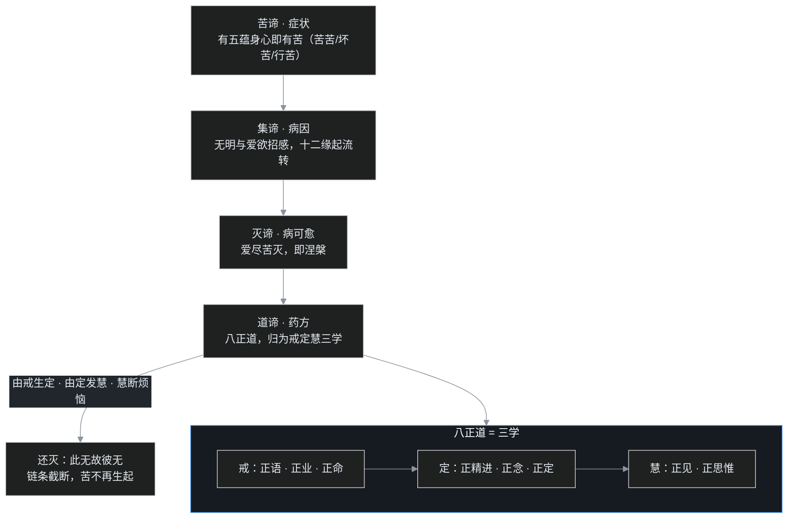

[C01](/post/48.html) 结尾把舞台搭好了：一边婆罗门祭司喊"守好种姓、供养祭祀"，一边顺世论者喊"死后一了百了、及时行乐"，旁边还有一群苦行者把自己饿得半死。年轻的乔达摩·悉达多三边都不满意。

那佛陀自己的答案是什么？这一篇就来讲它——**中道**，以及撑起中道的三套核心理论：**四圣谛、八正道、十二缘起**。这三样东西是后来一切佛教流派的"最小公约数"，再怎么分家，这三样都还认。

先问一个外行最容易问出口的问题：

> 佛教张口就是"人生是苦""一切皆苦"，这也太丧了吧？一个宗教教人整天盯着苦，难道不是悲观厌世？

这个误会非常普遍，值得用一整篇来拆。

## 一、中道：不是和稀泥，是动态的"恰到好处"

成道之前，乔达摩跟着当时最有名的沙门老师学过最深的禅定，又跑到苦行林里苦修了六年，饿得肚皮贴脊梁。结果是：两样都没用。禅定很深，出定烦恼照旧；苦行很狠，只是调伏了身体，知见一点没转。

于是佛陀得出第一个结论：**有两个极端，出家人不该走。** 一个是顺着欲望跑、纵欲享乐；一个是故意折磨自己、以为"吃苦就能了苦"。《五分律》里记下佛陀的原话，大意是"有二边，出家者不应亲近"。离开这两边走的路，就叫**中道**。

但"中道"这个词特别容易被理解成"和稀泥"——纵欲和苦行各让一步，取个中间值呗？叶扬最初也是这么以为的。还真不是。

佛陀讲的中道，是**随着因缘条件动态变化的"恰到好处"**。时间不同、地点不同、对象不同，那个"恰好的点"就不同，它根本不是一个固定刻度。所以更进一步，连"中间"这个位置都不能死死抓住——经典里的说法叫"**离边不住中**"：两边要离，就连"我站在中间"这个执念也要放下。这跟儒家"允执厥中"的中庸还不太一样：儒家承认有个"中"要去守住，佛陀连这个可守的"中"都不给。

义理上的两边，[C01](/post/48.html) 已经见过了：婆罗门的**常见**（有恒常本体、一切由梵天派生）和顺世论的**断见**（死后什么都没有、因果不成立）。中道在行为上离纵欲与苦行，在观念上离常见与断见。

## 二、四圣谛：一套标准的"看病流程"

佛陀成道后第一次公开说法，地点在鹿野苑，听众是曾经陪佛陀苦行、后来又因佛陀放弃苦行而负气离开的五个同伴（世称**五比丘**）。这次说法史称"**初转法轮**"。

这第一转，讲的就是**四圣谛**。理解四谛最好的钥匙，是佛教里一个古已有之的比喻——后来的佛经常把佛陀称为"**大医王**"，四谛恰好就是一位医生的标准流程：

| 四谛 | 医生在做什么 | 内容 |
|---|---|---|
| **苦谛** | 承认症状、如实诊断 | 有五蕴身心、在生死流转中，就有种种苦 |
| **集谛** | 追查病因 | 苦从哪来？从爱欲、烦恼、造业招感而来 |
| **灭谛** | 宣告"这病能好" | 爱欲止息、苦就止息，这个可证得的境界叫**涅槃** |
| **道谛** | 开出治疗方案 | 具体怎么修？**八正道** |

请注意这个顺序里藏着的态度：佛陀没有先讲神通、先讲天国、先讲信谁得救，而是先做诊断。承认"有苦"不是悲观，恰恰是治疗的第一步——一家医院绝不会因为病人不爱听"你确实病了"，就改口说"你很健康"。把症状如实说出来，正是为了治好它。这是佛学里最"积极"的地方，叶扬读到这里，对"佛教很丧"的误会先消了一半。

"苦"这个字也需要校准。梵语原文 *duḥkha*，不只是"痛苦"，更接近"**不圆满、靠不住、抓不牢**"。明显的伤痛——寒热、病痛、求不得——苦得最直接，叫"**苦苦**"（苦本身就是苦）；连快乐也算苦，因为一切快乐都会变坏、会失去，这叫"坏苦"；甚至在你不苦不乐、一切如常的时候，身心仍在刹那无常地流变，这叫"行苦"。所以"一切皆苦"不是情绪宣泄，而是"一切都在无常中、没有能永远攥住的东西"这个事实判断。

鹿野苑这第一讲，经典里说佛陀还转了三个层次：**示转**（开示四谛，五位同伴里的憍陈如当下证果）、**劝转**（劝大家"知苦、断集、慕灭、修道"）、**证转**（宣告"我已经亲自这样证得了"）。一套诊断、一句医嘱、一份"医生自己先已痊愈"的证明，齐了。

## 三、八正道：八个"恰好"，归到戒定慧

道谛的具体内容是**八正道**：正见、正思惟、正语、正业、正命、正精进、正念、正定。

外行扫一眼，很容易当成一串"正确的废话"：思想要正确、说话要正确、干活要正确——这谁不会说？这里的关键全在那个"**正**"字。它不是"你错我对"的"正确"，而是"**适当、不偏、恰好**"。八正道是八个"恰好"，不是八条道德高分。

这八项还能整齐地归进三组，佛教叫**三无漏学**：

- **慧（智慧）**：正见（正确的知见）、正思惟（如理地思考）。
- **戒（行为底线）**：正语（不妄语、不恶口）、正业（不杀盗淫等）、正命（用正当职业谋生，不靠坑蒙拐骗过日子）。
- **定（心的训练）**：正精进（恰当地努力，不过猛也不松懈）、正念（清清楚楚觉察当下）、正定（把心安顿到不昏沉、不散乱的一境）。

这里有个容易看花眼的排序：列表把慧放在最前，是因为**正见是整条道的前导**——方向错了，后面全错；但论身心上的长养次第，则是**由戒生定，由定发慧**。先把行为和生计理顺，心才安稳得下来；心安顿到足够稳定，才有能力如实看清真相、生出断烦恼的智慧。所以佛教的核心竞争力从来不是苦行，也不是信仰虔诚，而是**智慧**——禅定只是让智慧得以生起的增上条件，定力再深，知见不转，烦恼的根照样断不掉。[C01](/post/48.html) 里那些能修出极深禅定、甚至神通的苦行者，问题正出在这。

顺带一提，八正道背后还有一份更细的操作手册叫**三十七菩提分**（四念处——观身、受、心、法，是修定的基础功课——四正断、四神足、五根、五力、七觉支、八正道，4+4+4+5+5+7+8=37），八正道是总纲，其余 29 项是它的展开。正定也不是越"深"越好：定到四空定那种木石般的无知无觉，反而发不起智慧，执着起来反成"邪定"——连"专注"这件事都要守中道。

## 四、十二缘起：一条没有主角的调用链

四谛里的"集谛"说苦有原因，这个原因具体怎么一环扣一环地运行？佛陀给出的完整模型叫**十二缘起**，一共十二支：

**无明 → 行 → 识 → 名色 → 六入 → 触 → 受 → 爱 → 取 → 有 → 生 → 老死**

顺着读一遍：因为不明真相（**无明**），所以会造作种种业（**行**）；业的潜势力推动**识**入胎；入胎后有了初步的身心（**名色**，名是精神部分、色是物质部分）；身心发育出六种认识渠道（**六入**：眼耳鼻舌身意）；六根跟外界**接触**（触）；接触就产生感**受**（苦、乐、不苦不乐）；有了感受就会产生贪**爱**；贪爱加深就会**取**着不放；取着就造成了感得"**后有**"（下一世生命）的业力；于是有再一次的**生**；有生必有**老死**。死了以后，带着无明的业识再入胎——闭环，这就是生死轮回。

这里可以请出本篇唯一的程序员类比了。

**十二缘起，就像分布式系统里的一条调用链（trace）。** 一次请求进来，服务 A 调 B、B 调 C、C 调 D……每一环的存在都依赖上一环，环环相扣：上一环出现，下一环才被唤起；上一环消失，下一环跟着不生。佛经里那句"**此有故彼有，此生故彼生**"，几乎就是调用链的因果描述。要排查故障、让这条链不再产生错误结果，你不必追到"最初第一环是谁"，只要在任意一环把它打断——比如在"爱、取、有"这里不再造业——后面的"生、老死"就无从生起。

给不写代码的读者一句白话：**调用链，就是程序出问题时把"谁调用了谁、一环扣一环"的全过程记录下来的那份流水账；看流水账就能看清一个结果是被上游哪一步带出来的，把中间任意一环掐断，下游就跟着停。**

更关键的是这个类比顺手照亮了一件反常识的事：一条 trace 里，**只有一串因果在传递，并没有一个从头到尾不变的"东西"在里面跑**。你可以给请求打上同一个 trace-id，但那个 id 只是方便追踪贴的标签，不是请求里藏着的某个常驻灵魂。十二缘起同样如此：有完整的因果相续、有业报、有轮回，但这条链上**找不到一个恒常不变的"我"在投胎、在受苦**。

**但这个类比的洞必须当场戳破**：真实的调用链背后，往往还真有个 user-id 或 session 把整条请求串到"同一个用户"身上；十二缘起恰恰坚决否认有这么个常住不变的实体。而且工程上的调用链多是一次业务调用内的链路（还常跨异步队列），缘起却是跨越生生世世、每一支都由众多因缘和合而生，远非线性的一对一决定。**没有"我"，因果却一分不乱——那到底是谁在轮回、谁在证涅槃？这个洞，正是 C03 要正面硬啃的题目，先把问号挂在这里。**

## 五、把十二支收进一张表：惑、业、苦的二重循环

十二支一口气背下来会晕，佛经自己做了简化：把十二支按"过去、现在、未来"三世和"惑、业、苦"三类重新归位，就是一张二重因果表。

| | 惑（烦恼） | 业（造作） | 苦（果报） |
|---|---|---|---|
| **过去世** | 无明 | 行 | —（已造成今生） |
| **现在世** | 爱、取 | 有 | 识、名色、六入、触、受（前世业所感的果） |
| **未来世** | （再来一轮无明） | （再来一轮行/有） | 生、老死 |

读法是：**过去世的惑与业，造成现在世的苦果；现在世又起惑造业，造成未来世的苦果。** 两重循环，套娃一样转下去，就是"流转门"。（表格里"未来世"那两格不是第三重因果，只表示老死之后又起无明、循环回到起点；严格说缘起只有两重因果、三支一组。）经论里有个很形象的比喻：印度有一种叫"阿叉"（金刚子）的植物果实，常是三粒长在同一个蒂上——**惑、业、苦三粒，也长在同一个蒂上**，摘起一个，三个连带而起。

那怎么出去？十二个字：

> **此有故彼有，此生故彼生（流转门）；此无故彼无，此灭故彼灭（还灭门）。**

流转门讲链条怎么转起来，**还灭门**讲链条怎么停下来：不是去消灭一个"我"，而是让无明不生、爱取不起，一环断，环环断。苦行之所以无效，是因为"主动找苦吃"本身又在链上添了新的受、新的执，纯属雪上加霜。

## 六、吵架现场：鹿野苑的三方质疑

把当时可能在场的质疑者请上台。

**第一位，是苦行出身的旧同修。** 佛陀宣布放弃苦行、改走中道时，五比丘里有人当场就想走人：「我们挨饿受苦六年，你现在说不吃苦了、还去喝牧羊女供养的乳粥——这不是退转、不是放纵吗？」

佛陀的回应是：我不是从"苦"这一头跳到"乐"那一头。纵欲增长贪欲，苦行增长我慢和对身体的执着，**两边都在给十二缘起这条链添柴**。中道不是放纵，是把劲用在能真正断烦恼的地方——持戒、修定、发慧。

**第二位，是顺世论者。** 「你讲灭谛、讲涅槃、讲来世，可人就是四大凑的，一死全散，哪来什么轮回和还灭？你的'集'和'灭'建在一个不存在的账本上。」

佛陀的回应落在 C01 埋过的分界上：断见把"没有常住的我"错听成了"什么都没有"。没有恒常的"我"，不等于没有因果相续——缘起说的恰恰是"无主体而有因果"。死后是不是一了百了、什么都不剩下，是 C03 要用整条缘起论去回答的问题。

**第三位，是婆罗门祭司。** 「没有一个常住的小我（阿特曼）、没有创造一切的梵天，那因果由谁来记账、由谁来保证公正？没有管理员的系统，权限不乱套吗？」

佛陀的回应是：**因果不需要一个造物主在后台打分。** 种瓜得瓜是因缘法自身的规律，就像种子发芽不需要有个神在旁边审批。创造论本身还有个逻辑死结——如果一切都是梵天造的，那梵天又是谁造的？（这个反问只供思辨，不建议拿去为难信徒。）

三方吵完，佛陀补了一句最颠覆的：这套东西不是神的专利，**佛陀本人就是由一个凡人修成的**。任何一个人，不论出生在哪个种姓，只要肯照着中道修，都能走到同样的终点。在等级写死的年代，这句话的分量不亚于一场革命。

## 七、卡壳角

**卡壳之一：承认"苦"，到底是消极还是积极？** 叶扬一开始把"一切皆苦"读成了一种灰暗的世界观，后来才转过弯：这恰恰是最清醒、最积极的态度。区别在于——悲观是停在"人生没救了"，而四谛是"确认有病 → 找到病因 → 确认能治好 → 按方吃药"。真正消极的反而是两种极端：要么假装一切圆满、对问题视而不见（常见式的一厢情愿），要么认定一切努力都没用、干脆躺平（断见式的及时行乐）。四谛一个都不沾。

**卡壳之二：三法印像一把"验钞机"。** 这一讲学到一个特别好用的判据——**三法印**：诸行无常、诸法无我、涅槃寂静。佛陀留下一个规矩：判断一段道理是不是佛法，不看说话的人是谁、不看结集仪式有多隆重，**只看它符不符合这三个印**。符合，哪怕落款不是佛陀也等于佛说；不符合，哪怕传得再像也不是。这个"以理为准、不以权威为准"的标准，让叶扬印象极深——它也是后来一场大辩论的伏笔：后代有人以"大乘经典不是第一次结集出来的"为由判大乘"非佛说"，而支持大乘的一方正是拿起三法印来回应：判佛说要看法印内涵，不看结集形式。这场架，留到 C05 细看。

## 八、一张图、一组术语

**本篇术语清单**（先白后专，回看用）：

- **中道 / 二边**：离开纵欲与苦行、常见与断见两个极端；不是取中间值，是随因缘动态的恰到好处，且"离边不住中"。
- **四圣谛**：苦、集、灭、道，对应诊断、病因、可愈、疗法。
- **八正道**：正见、正思惟、正语、正业、正命、正精进、正念、正定；"正"是恰好，不是对错的正确。
- **三无漏学**：慧（正见正思惟）、戒（正语正业正命）、定（正精进正念正定）；由戒生定，由定发慧。
- **十二缘起**：无明、行、识、名色、六入、触、受、爱、取、有、生、老死，环环相扣的因果链。
- **流转门 / 还灭门**："此有故彼有"是链条转起来，"此无故彼无"是链条停下来。
- **惑业苦 / 三世二重因果**：过去的惑业造成现在的苦果，现在的惑业造成未来的苦果；阿叉三子同蒂之喻。
- **三法印**：诸行无常、诸法无我、涅槃寂静；判别是否佛法的"验钞机"，看内涵不看结集。
- **初转法轮**：佛陀成道后在鹿野苑度五比丘、首说四谛；经憍陈如证果，分示转、劝转、证转。
- **涅槃**：爱欲与烦恼止息、苦不再生起的境界（灭谛所指）。
- **四果 / 三结**：修证位次初果须陀洹（断身见、戒禁取、疑三结）、二果斯陀含、三果阿那含、四果阿罗汉；阿罗汉又分以慧断烦恼的"慧解脱"与定慧具足的"具解脱"。
- **三十七菩提分**：四念处、四正断、四神足、五根、五力、七觉支、八正道；八正道是总纲，其余是细化。

下一篇 **C03**，啃本篇一路挂着的那个问号：十二缘起里没有"我"，那上辈子造业、这辈子受报的到底是谁？如果"我"根本不存在，修行、解脱、轮回又如何成立？——这是佛教最难、也最容易被误解的一题。

> 说明：本系列为个人学习笔记，讲的是公共历史知识，不引用课程字幕原文，也不代表任何宗教立场。课程为 B 站《印度佛教史》（合集 BV1vewnzqEuA，本篇对应第 3 讲与第 29 讲重录版），教材为印顺《印度佛教思想史》；文中观点以课堂讲述为准，存疑处已标明。
