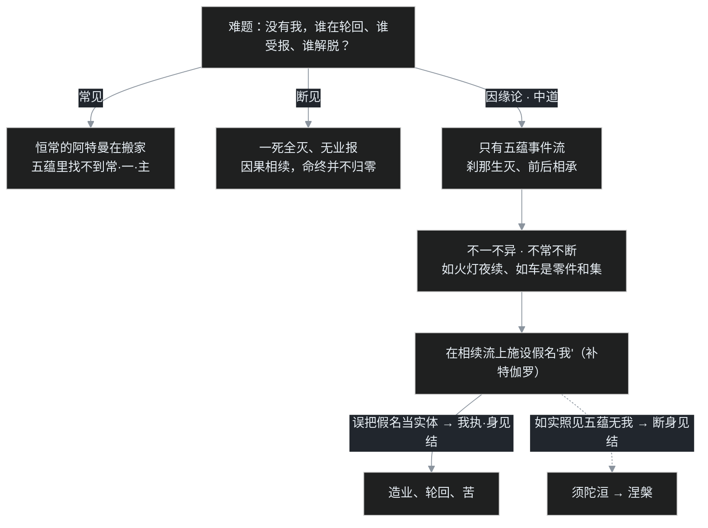

# C03｜没有我，谁在轮回？——佛教最难的一题

前两篇一路埋着同一个问号，现在到了非拆不可的时候。

[C01](/post/48.html) 里说，种姓像一套写死的权限组，而佛教不承认有个 root 管理员；[C02](/post/49.html) 里说，十二缘起像一条没有常住主角的调用链，trace-id 只是追踪用的标签。两篇合起来，逼出一个让无数人卡住的问题：

> **如果根本没有"我"，那是谁在修行、谁在轮回、谁在受报？我这辈子咬紧牙关行善积德，下辈子享福的万一是另一个不相干的人，那我图什么？**

这是佛教义理里最难、也最容易被听岔的一题，叫"**无我**"。难到什么程度？佛灭之后几百年，佛教内部最聪明的一批头脑，为了把"无我"和"轮回"同时讲圆，硬是把统一僧团吵成了二十个部派。这一篇先把根本义讲清楚，部派怎么吵留到 C04。

## 一、"无我"到底是没有什么

先排除一个最常见的误读：无我，**不是说没有眼前这个会疼、会想、会饿、会刷手机的你**。如果佛教真是否定一切存在，那它就和[C01](/post/48.html) 里那个"死后一了百了"的顺世论没有区别了。

佛教要否定的"我"，是一个非常具体的东西，对应梵语的 **阿特曼（ātman）**。要够资格被叫"我"，得同时满足三个条件：

- **常**：恒常不变，昨天今天明天是同一个，生前死后也是同一个；
- **一**：单一、不可再分，是一个独立的整体，而不是零件拼出来的；
- **主**：能自己作主、自在支配，身体归"我"管、念头归"我"调。

婆罗门教说，每个人身上就有这么一个恒常、独一、能作主的阿特曼，它带着你一次次投胎。佛陀的回应是：**把人逐层拆开，这样的东西一个都找不到。**

拿什么拆？**五蕴**——佛陀把一个"人"分析成五类现象的聚合：

| 五蕴 | 大白话 | 为什么它当不起"我" |
|---|---|---|
| **色** | 身体、感官、物质部分 | 会病会老，拆成器官、细胞都不是"我" |
| **受** | 苦、乐、不苦不乐的感受 | 一刹那一变，情绪哪有恒常的 |
| **想** | 取相、贴标签、形成概念的认知 | 随外境起落，境一变想就变 |
| **行** | 意志、冲动、造作（核心是"思"，也就是业） | 是被因缘推起来的反应，根本做不了主 |
| **识** | 明了、分别、觉知本身 | 有对象才生起，对象走它就换 |

请在自己身上找一找：身体是零件和集，感受和念头念念生灭，没有一样符合"常、一、主"。你想让身体不老，它照老；想让心别烦，它照烦——连"作主"这一条都站不住。佛陀的结论是：**五蕴无常，无常故苦，苦故无我。** 不是先有个"我"然后它消失了，而是从头到尾就没有过那么一个内核；一直存在的，只有五蕴在因缘中刹那生灭、前后相续。

这里要分清两个层次。根本佛教讲的无我，主要是"**人无我**"（在五蕴相续里找不到一个人我）；至于万事万物本身有没有固定自性的"**法无我**"，那是大乘中观再往下深挖的一层，留到 C06。

## 二、最危险的滑坡：无我不等于断灭

"无我"这句话，往左多滑半步就是万丈深渊，佛世就有人当众滑下去。

《杂阿含经》里记着一位**焰摩迦比丘**，听了"无我"之后得出一个"推论"：既然没有我，那一个解脱了的阿罗汉死后岂不是彻底断灭、什么都没有？这套"善人死了也归零"的说法听起来还挺"科学"，但它在教义上是典型的**断见**——把"没有常住的我"错听成了"什么都没有"。于是智慧第一的舍利弗跑去，一层层反问焰摩迦：色是常还是无常？无常的东西是苦还是乐？一个无常、苦、变化的东西，能说"它是我、是我所有"吗？问到最后，焰摩迦承认五蕴本来就非我、非我所，那个"阿罗汉断灭"的邪见自己就塌了。

这里的分寸极细，值得用一句话钉死：

> **佛法同时拒绝两个极端：执"有"的常见（有个恒常的我在搬家），和执"无"的断见（一死全灭、因果归零）。** 没有常住的"我"，但因果相续一分不乱——这叫"中道"，正是 [C02](/post/49.html) 那套缘起论在"我"这个问题上的落点。

还有一个很多人想问的问题：佛陀为什么不干脆拍板"我，到底有还是没有"？因为这个问法本身就是个陷阱。佛经里有个著名的**箭喻**：一个人中了毒箭，亲友找来医生，这人却坚持先要弄清楚——弓是什么木做的、箭羽是哪种鸟的毛、弦是什么筋、射箭的人是黑是白姓什么——弄清之前拒绝拔箭。结果可想而知。佛陀对"我与世间是常是无常、有边无边、死后有没有"这一整组形上问题一律**无记**（不予记别），理由不是答不上来，而是这些问题"不与义相应、不导向厌离解脱"——你站在火宅里追问房子的形而上学，纯属耽误逃生。要破的是"我执"，不是要给"我"发一张存在或不存在的证书。

## 三、那到底谁在轮回：不一不异的相续

把常、断两边都堵死之后，正面的答案只能是"相续"。这是全篇最需要用比喻来接住的地方。

**灯火喻。** 一盏酥油灯点了一整夜，初夜的火焰和后夜的火焰，是同一个吗？不是——燃料、火苗刹那都在换，前焰早不是后焰。是完全无关的两团火吗？也不是——没有前焰的引燃就没有后焰。一夜之火**不一不异、不常不断**，靠的是相续。生命的轮回也是这个结构：上一期五蕴坏了，业力推动下一期五蕴生起，前后既不是同一个"我"搬家，也不是毫无瓜葛的另一个人。

**车喻。** 这是部派时期的名喻，对话录成书约在公元前 2 世纪，比佛陀的时代晚约三百年，先交代出处：一位希腊血统的国王**弥兰陀**（印度-希腊王国的米南德王）向高僧**那先**（龙军）请教，对话录就是汉译《那先比丘经》、南传《弥兰陀王问经》。那先问国王：车是什么？是车轮吗？是车轴、车辕、车厢吗？都不是。可把这些零件全撤走，"车"又无处可寻。结论：**"车"不是零件之外的某个东西，而是零件按特定方式组合后安立的一个名字（假名）。** "那先"也一样，五蕴和集，假名为人；相续宛然，实体了不可得。

讲清这件事，可以请出本篇唯一的程序员类比了。

**早期的系统是"改档案"模式：数据库里有一行 User 记录，用户改名、换头像，就原地 UPDATE 这一行。** 不管属性怎么变，底下始终是**同一条记录、同一个主键**——这其实就是"常见"的模型：千变万化，底下有个持存的"我"。

**而有一种叫"事件溯源"（Event Sourcing）的架构，干脆不存那条可变的记录。** 系统只存一长串**不可修改的事件**：已注册、改了昵称、换了邮箱、角色变更……每发生一件事就追加一条。你问"这个用户现在是什么样"，系统没有现成答案，而是把这一长串事件从头**重放、叠加**一遍，当场算出一个"当前状态"——这个算出来的结果叫**投影（projection）**。

五蕴相续，就极像事件溯源：没有一条被原地涂改、恒常持存的"我"记录，只有色受想行识的事件流刹那相续；我们说的"我"，是这串事件此刻重放出来的投影、一个方便称呼的假名。轮回不是某个实体搬去下一张表，而是事件流在这一期生命结束后仍带着势能继续；断灭也不对——事件真实地塑造了后续每一个投影，删不掉、赖不掉。

给不写代码的读者一句白话：**老模式以为系统里锁着一份你的"原始档案"，你怎么改都是同一份；事件溯源里压根没有这份档案，只有你这辈子做过的每一件事攒下的一长串不可销毁的流水账，"现在的你"是这笔流水账当场算出来的结果。**

**但这个类比的洞，必须当场戳破，而且这一戳就是半部佛教史。** 真实的事件溯源系统，为了把同一人的所有事件归到一起，每条事件都必须带一个**固定不变的流水号**（聚根 ID / streamId）——内容怎么变，ID 永不变。请记住这个 ID，因为它就是所有麻烦的源头：一旦你认真处理"谁在轮回、谁来受报、谁记得前生"，就会忍不住想要这么一个贯穿始终的编号。佛教内部为此折腾了上千年——犊子部立了一个"不可说的补特伽罗"，经量部立了"一味相续"，唯识学最后立了"阿赖耶识"，本质上都是在小心翼翼地找这个 streamId，同时又拼命声明"它不是灵魂、它也是无常的"。**为什么找个编号这么难、各家的方案差在哪，正是 C04 到 C07 的主线。** 这里先记住结论：佛法允许有相续、有业报、有假名，但**绝不允许把任何一个编号实体化成常住的"我"**。

顺带说明它和 [C02](/post/49.html) 那个调用链类比的分工：调用链讲的是"一环怎么引出下一环"的**动态流程**；这一篇追问的是"被叫做'我'的那个东西到底存不存在"的**身份同一性**。一个讲流程，一个讲实体，是两层。

## 四、没有我，行善还有什么用

这是开头那个问题的正面回法，也是最反直觉的地方。

先问反过来的情形：如果真有一个恒常不变、连轮回都改不掉的"我"，那行善修行反而**没用**了——一个恒常固定的东西，你怎么修都变不了，婆罗门那套"生生世世种姓不变"才是这种逻辑的终点，努力毫无意义。**恰恰因为无常、无我，改变才成为可能。** 今天的五蕴虽不是昨天那个，但承接了昨天全部的业力；明天的你虽不是今天这个，却要由你今天的造作来塑造。责任没有消失，反而落实了——造业的和受报的不是一个凝固的"同一人"，但也绝不是两个人，是同一条因果流的上游和下游。往上游倒污水，下游喝到的就是脏水，这件事不需要有个"同一滴水"贯穿始终才成立。

业也不是谁在小本本上记账。**业（karma）的字面意思就是"造作、行为"**，身、口、意三类，其中意志的推动（"思"）最关键。一个行为会在相续里留下潜势力，遇缘就结果，不需要造物主审批，也不需要一个灵魂替你保管——这正好接上了[C01](/post/48.html)所说"没有管理员的因果"。

而"无我"在修行上的落点非常具体：烦恼的总根叫**我执**，教义名词是**萨迦耶见**（也叫身见），就是把五蕴硬认成"我、我的"。[C02](/post/49.html) 讲过证初果须陀洹要断的**三结**，第一结就是这个身见结。换句话说，"无我"不是一个要你背诵的哲学结论，而是一个要你在身心上**现量照见**的事实——真看清五蕴里无我，我执失去抓握点，初果的门就开了。观念的翻转可以很快，这也是见道位"一念"可入的原因之一。

## 五、佛教内部也没吵完：几张"不许叫灵魂"的浮木

无我而有轮回，这个缝太窄、太难走，于是佛灭后的部派各自想办法搭桥。这些方案到 C04 会连带着二十部派细讲，这里先认个门，看看各家怎么在"不立灵魂"的红线底下找受报主体。

第一类，立"**补特伽罗**"（pudgala，意译"数取趣"，即一次次在各道取生的那个"人"），把它当作依五蕴安立的受报者，内部分三说：

- **说一切有部**：补特伽罗只是名字、没有实体（"假无体"）；真正保证相续的是有部另立的"法体"，三世恒有。
- **犊子部（正量部一系）**：主张有一个"**不可说的补特伽罗**"，既不等于五蕴、也不离开五蕴，实有其体（"假有体"）。这是最像"我"的一家，因此被其他各派围攻——认为它变相把阿特曼偷运回了佛教。
- **经量部**：立"一味相续"的细微相续（"体常而用无常"），像一条不断改道却始终连续的河。

第二类，干脆立深层心识：大众部系讲"**一心**"，南传赤铜鍱部讲"**有分识**"（九心轮），把受报和相续交给一个比表层意识更深的心识层。**学界普遍把"有分识"看作后来唯识学"阿赖耶识"的远源**——这条线 C07 专门展开。

老师在课上给这些名词下过一个很妙的定性：**法体、补特伽罗、一心，都是为了绕开"灵魂"两个字而安设的浮木。** 它们要同时满足两个互相拉扯的要求：保住因果的相续（否则滑入断见），又绝不能承认一个恒常自主体（否则滑入常见）。各家答案不同，但方向一致，都是在窄缝里逼近同一个佛说。看懂这批浮木为什么非搭不可，就拿到了从部派佛教一直读到唯识、如来藏的总钥匙。

## 六、吵架现场：三种声音围攻"无我"

**婆罗门祭司先冷笑**：「没有阿特曼？那修一辈子，解脱的是谁？无人可解脱的解脱，不荒唐吗？你们的'涅槃'是无主之物。」

佛法的回答：恰恰是因为预设了"得有个谁去拥有涅槃"，才会有此一问；涅槃不是某个"我"领到的奖品，是我执止息后苦的止息。

**顺世论者在旁边鼓掌**：「说得好！没有我！——所以人死如灯灭，没有来世、没有业报，各位该吃吃该喝喝！」

这就是焰摩迦当年的坑。舍利弗式的回应是：常见与断见这两边错在同一个地方，都把"我"想成非有即无的一个东西。没有恒常实体，不等于没有因果相续；否定的是"常、一、主"的内核，不是那条真实流转、会结果的五蕴事件流。

**最棘手的反而是自己人——犊子部的论师**：「别唱高调。嘴上说无我，那请问：前生造业的五蕴早散了，后生受报的五蕴是新的，若没有一个贯通前后的补特伽罗，岂不是张三造业、李四受报？为了业报公平，这个'不可说的人'不能不立。」

这是全场最诚实也最难的一问。说一切有部答"只是假名、法体相续"；经量部答"一味相续、不一不异"；几百年后的唯识学将用"阿赖耶识＋种子"给出最精巧的版本——但即便那个版本，也坚持它是无常的瀑流、不是灵魂。争论没有在佛世终结，而是一路吵进了二十个部派、吵进了大乘。

## 七、卡壳角

**卡壳之一：连续感这么真，为什么不算有我？** 叶扬最初的反驳很朴素：我明明记得三岁的事、明明觉得这二十年都是"我"，这种铁板钉钉的连续感还不够吗？后来想通的关键是：**连续感是真实的，但"连续"不等于"恒常"。** 一条河每一秒都不是同一河水，照样让你觉得"还是这条河"；记忆本身也是心识刹那相续的产物，不是某个不变容器里存着的老录像。连续感证明的是"相续"，证明不了有个不变的持有者。

**卡壳之二：无我会不会让人变得消极、或逃避责任？** 这是叶扬担心过的第二层。正相反：常见（命定）才取消努力——反正"我"恒常、种姓写死；断见（归零）也取消努力——反正一了百了。恰恰是无我而相续，把责任牢牢钉住：没有一个固定的我替你背锅或免罪，你此刻的每个造作都在塑造下游，而且这个"你"是真能被改造的，修行才有意义。**无常无我不是绝望的判决书，是"可以改变"的许可证。**

**卡壳之三：佛都说无我了，后代为什么又搞出一堆像灵魂的东西？** 这是读佛教史最容易觉得"是不是教义倒退了"的地方。叶扬的心得是：别把补特伽罗、有分识、阿赖耶当成"佛教终于偷偷承认了灵魂"，而要看成**在"拒绝灵魂"和"解释业报"的双重约束下一次次更精巧的搭桥**——每张浮木都被反复警告"此非实体"。理解了这种"戴着镣铐跳舞"，才读得懂后面五百年的义理大战。

## 八、一张流程图、两张对照表、一组术语

**三种立场怎么安放"我"：**

| 立场 | 谁在相续 | 死后 | 业报 | 命门 |
|---|---|---|---|---|
| 婆罗门·常见 | 恒常的阿特曼 | 灵魂带种姓再投胎 | 定性轮回 | 五蕴里找不到常一主 |
| 顺世论·断见 | 没有相续 | 一死全灭 | 无业报 | 解释不了记忆、因果与伦理 |
| 佛法·缘起 | 五蕴刹那相续、假名为我 | 不一不异、命终不断灭 | 业随相续、自作自受 | "受报主体"极难安立，逼出部派诸说 |

**部派的"浮木"方案（详论留 C04、C07）：**

| 方案 | 安立什么来承载相续 | 主要主张者 |
|---|---|---|
| 补特伽罗·假无体 | 依五蕴立名、无实体，相续另靠"法体" | 说一切有部 |
| 不可说补特伽罗·假有体 | 非即蕴非离蕴、实有其体（最像"我"） | 犊子部 / 正量部 |
| 一味相续 | 微细不断、体常而用无常 | 经量部 |
| 一心 / 有分识 | 比表层意识更深的受报心识（阿赖耶远源） | 大众部、南传赤铜鍱部 |

**本篇术语清单**（先白后专，回看用）：

- **无我（anātman / anattā）**：不是否定眼前的缘起生命，是否定其中有恒常、独一、能作主的内核。
- **阿特曼**：婆罗门教的"我"（小我），具常、一、主三义；佛教破的就是它。
- **五蕴**：色、受、想、行、识五类现象的聚合；五蕴无常、苦、无我。
- **人无我 / 法无我**：本篇主题是"人无我"；"法无我"是大乘中观深化的一层（C06）。
- **常见 / 断见**：执有恒常我／执死后断灭，佛立缘起中道双破两边。
- **不一不异**：前后世既非同一个主体、亦非毫无关系，唯是相续；灯火、车、河流是经典比喻。
- **假名（施设）**：在因缘和集上安立的名字，如"车""我"；相续宛然、实体了不可得。
- **无记**：对"我有无、世界常断"等不与解脱相应的形上问题不予置答（箭喻）。
- **业（karma）**：身口意的造作，核心是意志"思"；留下潜势力、遇缘结果，无需记账者。
- **萨迦耶见（身见 / 我执）**：执五蕴为我、我所，是三结之首，见道证须陀洹时断。
- **补特伽罗（数取趣）**：部派安立的受报者；有部假无体、犊子部假有体、经量部一味相续。
- **法体 / 一心 / 有分识**：部派为解释相续而立；有分识被学界视为阿赖耶识远源（C07）。

下一篇 **C04**：这些"浮木"不是书斋里的文字游戏——戒律松紧和义理分歧一起发作，真的把一味和合的僧团，一步步吵成了二十个各执一词的部派。统一的僧团是怎么裂开的？

> 说明：本系列为个人学习笔记，讲的是公共历史知识，不引用课程字幕原文，也不代表任何宗教立场。课程为 B 站《印度佛教史》（合集 BV1vewnzqEuA，本篇对应第 3、6、7 讲），教材为印顺《印度佛教思想史》；文中观点以课堂讲述为准，存疑处已标明。
