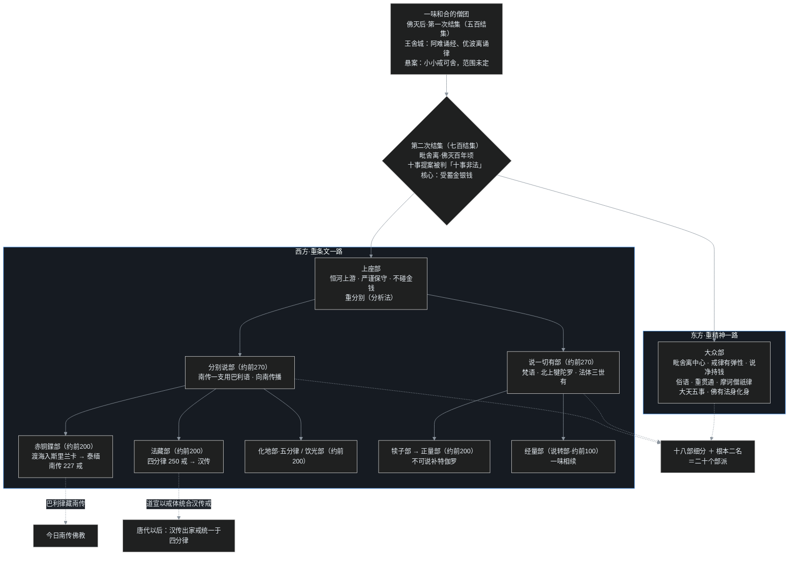

# C04｜僧团为什么吵分裂：一味佛法是怎么裂成二十部的

先问一个有点现实的问题。佛陀住世时，戒律立了，拿不准的事还能当面问佛。佛灭之后呢？一个**没有 CEO、不发工资、没有强制执行机构**的组织，成员全靠自觉遵守几百条戒律维系统一——创始人一不在，靠什么不散？

上一篇 [C03](/post/50.html) 结尾留过话："谁在轮回"的义理分歧不是书斋文字游戏，戒律松紧和义理分歧是**一起发作**的。这一篇就讲这场发作：一味和合的僧团，怎么在两三百年里一步步吵成二十个部派。

## 一、第一次结集：一次成功的"定稿发布"，和一颗没排掉的雷

佛灭之后，弟子们做的第一件大事，是把佛的言教固定下来，免得人走茶凉、各说各话。这在佛教史上叫**结集**——就是一群有资格的长老聚在一起，当众背诵、共同审定，把经和律核对一遍，相当于开一次定稿大会。

第一次结集在佛灭后不久举行，地点是王舍城，主持人是大迦叶（摩诃迦叶），参加者有五百位阿罗汉，所以又叫**五百结集**。会上，阿难背诵佛陀所说的法，后来整理成**经藏**；优波离背诵戒律，整理成**律藏**。这两位堪称定稿大会上两台"人肉记忆库"：记忆力第一的阿难负责法，持戒第一的优波离负责律。

大会很成功，但也埋下一颗雷。

佛在涅槃前说过一句话，大意是：我走之后，**小小戒可舍**——那些细碎的小戒律，如果实在守不住，可以舍弃。问题是，什么叫"小小戒"？佛没有给出清单。阿难当时悲伤过度，没来得及追问"哪些算小戒、边界在哪里"。会上有人主张借机放宽，大迦叶最终拍板采取最保守的策略：**佛已经制定的戒律，一条也不许废；佛没有制定的，一条也不许加**。这条决定后来被概括成"轻重等持"——大戒小戒一视同仁，全部原样保留。

为什么说这是一颗雷？因为"小小戒可舍"这五个字从此悬在那里：佛明明松过口，可范围始终没有界定。组织学上这是个典型的**遗留议题（issue 挂着没关）**——平时没事，一旦遇到现实压力，迟早有人把这个议题重新翻出来。

戒律按轻重分等级，最重要的五档叫**五篇**：波罗夷（最重，犯了如同断头、自动逐出僧团）、僧残、波逸提、波罗提提舍尼、突吉罗（最轻的轻过）。名字难记不要紧，只要知道戒律从一开始就是个**有层级、有轻重**的体系，"小小戒到底舍不舍"才会成为一个真问题。

## 二、金钱戒风波：十事非法，与第二次结集

雷终于爆了。传统律典把这次结集系于**佛灭百年顷**；而根本二部的完全成形，印顺推定持续到约公元前 300 年前后——结集事件和"二部阶段"是两个时间点，下文四阶段依印顺推定。

发难的地点在**毗舍离**，恒河下游东方一带的比丘（出家僧侣）提出了十项戒律上的宽松诉求，佛典里叫**十事**。

先说清楚都是哪十件。依《五分律》的记载（不同律部的措辞、次序略有出入，但都是十件），是九条“小松动”加一条“大要命”：

- **盐净**：盐归在食品类，按戒律不能存放在住处；提案是允许装在角器里随身带，理由是盐也能药用。
- **二指净**：僧团日中一食、过午不食，时间靠日晷判断；提案是日影过了正中、再多偏两指宽（大约二三十分钟的弹性）仍可进食。
- **他聚落净**：本来在一个聚落托过钵、用过食，这一天就不能再吃；提案允许在一处托空了，就换下个聚落再托。
- **住处净**：同一界内的僧团决议（羯磨）本须全体到场、在一处作出；提案是不方便时可以分开几处举行。
- **随意净**：羯磨决议一经作出，缺席的、持异议的人也得遵守；提案允许事后仍有异议者重新提议、再议一次。
- **所习净**：出家前的世俗技艺（音乐、厨艺一类）按惯例要放下、专心修行；提案允许在道场里继续使用这些专长。
- **生和合净**：吃饱之后按戒不能再进食；提案允许餐后再喝点未经搅拌的鲜牛乳补充营养。
- **饮阇楼柯净**：提案允许饮用尚未发酵、不会醉人的棕榈汁（椰子汁一类）。
- **无坐具净**：坐具（尼师坛）换新时，按戒律必须把旧布剪一块贴在新的上，为的是对治喜新厌旧；提案要求免去这道手续。
- **金银净**：允许接受和持有金钱——这是最后一条，也是最要命的一条。

回头看就会发现，前九条全是**执行尺度**问题：吃什么、几点吃、会议怎么开、旧手艺还能不能用。单拎任何一条都是生活小事，可九条一齐往同一个方向松，背后其实是同一种诉求：**戒律的字面，能不能按现实打个折**。而第十条把这种诉求从餐桌直接推到了根本——出家人到底能不能碰钱。

先补一句背景：佛陀制"不持金钱戒"，本意是让僧团保持少欲知足、托钵乞食的生活；但僧团壮大、供养增多后，完全不碰钱越来越难操作。东方比丘的折中办法叫**说净**（也叫辗转净）：钱不经比丘本人的手，经一个简单的表白仪式交给在家的净人（帮忙处理俗务的居士）管理，僧团要用时由净人经办——仪式做足，戒律的字面也算交代了。

西方上座长老不接受这种解释。东方比丘于是邀请恒河上游的长老来毗舍离裁决，到会约七百人，史称**七百结集**（第二次结集）。结果十事被一致判定为**十事非法**，十项提案全部驳回。

但大会有了结论，事情并没有结束：东方比丘不接受裁决，自行其是，"说净"照做。统一的僧团就此正式裂开：

- **大众部**：以毗舍离为中心的东方僧团，对戒律持弹性解释，持的是《摩诃僧祇律》；
- **上座部**：恒河上游的西方僧团，保守严谨，坚持绝不碰金钱。

这一裂，佛教史上叫**根本分裂**——后来所有的部派，都是从这两支里长出来的。

值得玩味的是：两边都不觉得自己在"背叛佛"。大众部认为自己抓住的是戒律的**精神**（少欲知足的发心），上座部认为自己守住的是戒律的**条文**（佛制就是佛制）。一个重精神、一个重条文，分歧从金钱这一件事，慢慢蔓延到了对一切法的理解方式上。

## 三、四阶段两百年：从二部，到二十部

根本分裂之后，分叉没有停止。按印顺法师在《印度佛教思想史》里推定的年代，分化大体经历了四个阶段：

1. **约公元前 300 年：唯二部。** 就是大众、上座这根本两支。
2. **约公元前 270 年：上座再分。** 上座部分出**分别说部**和**说一切有部**（简称有部）。粗算起来成了三系：大众、分别说、有部。
3. **约公元前 200 年：各派再分。** 分别说部向南分出**赤铜鍱部**（渡海入斯里兰卡，南传源头）、**法藏部**（部主昙无德，律名《四分律》）、**化地部**、**饮光部**；有部一侧分出**犊子部**（后发展出正量部，即 [C03](/post/50.html) 里立"不可说补特伽罗"的一家）。
4. **约公元前 100 年：经量部出。** 有部系里又分出**经量部**（也叫说转部），主张以经为量、一味相续。

印顺法师把这个过程概括成八个字：**一味、二部、三系、四派**。最后细分出十八部，加上根本的上座、大众两个名字，佛典通称**二十部派**——是道算术题：**18 + 2 = 20**，时间跨度两三百年。部派名字也基本三种来历：按教义（说一切有部=主张一切法体实有；经量部=以经为量）、按部主或族名（法藏、化地、犊子）、按地名（赤铜鍱与斯里兰卡古称有关）。

这里必须替一个人澄清：阿育王"助长分裂"是桩冤案。

阿育王是孔雀王朝第三代君主，也是佛教史上最大的护法王：早年征战极为残暴，据其石刻法敕，羯陵伽一战约十万人战死、十五万人被掳，目睹惨状后深自忏悔、皈依佛教，此后广建塔寺、刻布法敕，还派使团把佛法传出印度境外。这样一位高调护法，后世有人怀疑：是不是王室拉一派打一派，人为加剧了分裂？

课程的澄清很有力：阿育王送王子**摩呬陀**（即常见译名摩哂陀，Mahendra）出家受戒时，按规矩请的三师分属三个部派——得戒和尚是分别说部的**目犍连子帝须**，阿阇梨（轨范师）中有大众部的**大天**等人。国王给王子请戒师，把各派领袖都请到、谁也不得罪，恰恰说明**阿育王时代至少三个部派已经清清楚楚存在了**：先有分裂，后有国王分别请益，因果不能倒置。

## 四、开源社区视角：一次维护者离场后的大分叉（fork）

讲到这里，程序员读者大概已经觉得这个剧情眼熟得不能再眼熟了。叶扬第一次读到这段历史时，脑子里浮现的几乎是一套标准的开源社区剧本：

- **第一次结集 ≈ v1.0 定稿发布。** 核心维护者们把经、律两份"核心代码"核对封存，打上第一个正式版本标签（release tag）。
- **"小小戒可舍" ≈ 一个描述模糊、没人敢关的 issue（待办议题）。** 创始人留过话却没给范围，大迦叶的处理是冻结现状：已有的不许删、没有的不许加——也把争议原样留给了后人。
- **十事提案 ≈ 东方贡献者提交的大 pull request（修改请求）**，核心是给金钱戒开口子；"说净"仪式就是包一层兼容外壳：功能照旧，接口合规。
- **七百结集的裁决 ≈ code review（代码审查）后被关单，批注 wontfix（不予采纳）。** 把关的西方长老给出"十事非法"，PR 直接关闭。
- **根本分裂 ≈ 不服关单，直接 fork（复制代码、另立仓库独立维护）。** 大众部成了迭代快、重精神的社区分支，上座部是守主干、重条文的原仓库分支；此后 fork 又生 fork，两三百年后出现二十个互相独立的"发行版"。

不写代码的读者只需记住大白话：**开源项目是大家公开协作、谁都可以复制一份出去另起炉灶的软件项目；一旦原维护团队压不住分歧，社区就会复制代码、各改各的，这个动作叫 fork。** 佛教部派的根本分裂，形态上就是一次古代版的大 fork。

更妙的是副产品：分叉之后无人能当裁判，每一派都拼命写书论证自己最符合佛说——佛灭后遇到经义、戒律问题无人可问，僧众只能反复讨论，记录下来就发展成一门新学问：**阿毗达磨**（梵语 Abhidharma，直译"对法"），即三藏里的**论藏**。论藏几乎全出自擅长分析的上座系：赤铜鍱部有七论，有部以《发智论》为身论加六部"足论"合称七论；重贯通的大众部只留下一部《鞞勒论》，还没完整传下来。这很像分叉之后各派猛写设计文档和 RFC（意见征求文档），文档总量最后比原始代码还大。

**但这个类比有三个洞，必须当场戳破。**

第一，开源社区分叉之后，代码随时可以合并回去（merge）；部派分裂之后，几乎没有再合流过——组织形式像，结局不像。

第二，也是更重要的：这个类比容易让人顺势以为"大众部=进步开放、上座部=顽固守旧"，新的一定好。这是把技术进步的时间表误套到了戒律上。两边都自认最忠于佛说：在对方眼里，大众部的"弹性"就是放水，而上座部的"死板"恰恰把南传 227 条比丘戒最完整地守到了今天。**守旧和放水哪个更接近原意，不是按"新旧"判的。**

第三，fork 类比只能解释"组织是怎么散的"，解释不了"大家到底在吵什么"。代码可以随便复制，形而上的问题复制不出答案——那个"没有灵魂，谁在相续"的硬核难题，才是各派义理分叉的真正内核，也就是 [C03](/post/50.html) 讲过的那些浮木。

## 五、吵的不只是戒律：三大异议、大天五事，和佛的"身高"

组织散了之后，各派思想也越走越远。课程把部派间的义理分歧归纳成三大"异议"。第三项受报论 [C03](/post/50.html) 已经详讲过，这里只做一张鸟瞰表：

| 分歧 | 保守一路（上座系，以有部为代表） | 自由一路（大众部等） | 后世的收口 |
|---|---|---|---|
| **本体论**：生命凭什么相续 | **法体三世有**：法体过去、现在、未来恒有，保证连续性；另立"作用"的生灭解释变化（根本蕴不变、作用蕴变） | **现在有**：法体只在当下一刹那存在，刹那生灭、前后相续，连续性与变化一并解释 | 唯识学阿赖耶识以"种子说"一并解答（C07） |
| **修道论**：见道快还是慢 | **次第见地**：像爬楼，一步步渐修实证 | **一念见地**：见地可以一念翻转、当下顿悟；化地部取折中（四谛一时顿观） | 禅宗南顿北渐的印度前传 |
| **受报论**：谁在受报 | 立**补特伽罗**为假名受报者：有部假无体、犊子部假有体、经量部体常用无常 | 立深层**一心**：发展出有分识、九心轮，学界视为阿赖耶识的远源 | 详见 [C03](/post/50.html)，C07、C08 继续 |

语言上也分了家：有部用**梵语**（雅语），大众部用各种**俗语**，南传的分别说系用**巴利语**——所以北传经典多属梵本系统，南传是巴利三藏。佛世本就主张随方俗语传教，语言分化是地域拉开后的自然结果。

除了三大异议，还有两场争吵特别能看出两派气质。

一场是**大天五事**。大众部论师**大天**提出：阿罗汉（解脱圣者）并不像大家以为的那么圆满，至少还有五事——仍被余习诱惑（余所诱）、仍有不染污无知、对某些法仍有犹豫、证果自己未必清楚要由别人点破（他令入）、圣道有时借称念之声现起（道因声故起）。上座部炸了锅：阿罗汉是修行最高目标、究竟必入无余涅槃，说阿罗汉有"五不足"等于拆台；大天一系则借此抬高佛果、压低阿罗汉，把成佛与菩萨道这个更高目标推到舞台中央。这条线直接通向大乘。

另一场是**佛身观**。上座部眼中的佛，就是那个八十岁、要吃饭、会背痛、最终入灭的人间老比丘，智慧虽高，身是人身；大众部则认为这只是示现，佛另有无尽的**法身**、变化无碍的**化身**（兼说报身），十方世界都有佛。印顺法师把这种倾向归因于"佛灭后弟子对佛的永恒怀念"；课程则提醒，《长阿含·大本经》已有七佛相继的内容，这类思想经典中本有伏笔，不宜简单说是后人凭空造出。这个争论正是下一篇 C05"大乘是不是佛说"的前哨。

另有一组小数字顺手记下：无为法（解脱层面的法）有部立**三无为**（择灭、非择灭、虚空），大众部等立**九无为**；有部把一切法分析为五位七十五法，后来瑜伽行派扩成五位百法。细节留到 C07。

## 六、意外的丰收：三藏是怎么"吵"完备的

分裂听起来是悲剧，但课程给了一个反直觉的判断：**教团虽然裂了，佛教的经典系统反而因此完整、成熟了。**

先是**论藏**。佛灭后无人可问，各部派围绕经义反复论辩，结集为阿毗达磨，到公元前 1 世纪发展成熟。佛说法的体裁本有"九分教"（九种题材）的分类，部派时期其中**因缘**（尼陀那，某经某戒制定的缘起）、**譬喻**（阿波陀那）、**论议**三类大兴，扩充成**十二分教**——老师特别强调这三类佛世本有，不是新造，只是当年比例小。另有**摩呾理迦**（本母），把品名、核心偈颂串成记忆纲要，相当于论藏的提纲卡片。

到公元 1 世纪前后佛法传入汉地时，**经、律、论三藏已经齐备**。顺带破除一个误会："三藏法师"不是泛称，而是国家册封的称号，历代得主极少，玄奘、义净是其中代表。

再是**戒律的本土化**。根本分裂后各部各持自己的律本，汉译所传主要有五部，史称**五部律**；连同南传赤铜鍱部的巴利律藏，现存最主要的律本如下表：

| 部派 | 律本 | 流传情况 |
|---|---|---|
| 法藏部 | **《四分律》** | 唐代道宣律师在终南山大力弘扬，以"戒体"会通大乘菩萨戒；唐以后汉传出家戒统一于四分律（比丘 250 条） |
| 化地部 | 《五分律》 | 有汉译传持 |
| 说一切有部 | 《十诵律》 | 有汉译，早期汉地曾盛行 |
| 饮光部（迦叶遗） | 《解脱戒经》 | 只传来戒本，无完整广律，未广泛传承 |
| 大众部 | 《摩诃僧祇律》 | 有汉译传持 |
| 赤铜鍱部 | 巴利语律藏 | 南传系统，比丘戒 227 条，斯里兰卡、泰国、缅甸沿用至今 |

这里有个出乎意料的历史转弯：汉地文化圆融，照理该跟最有弹性的大众部《摩诃僧祇律》最亲，结果最后定于一尊的，反而是最严谨的法藏部《四分律》。关键人物是唐代的**道宣律师**：道宣在终南山弘律，留下"南山律三大部"，用**戒体**（受戒时在内心发起的防非止恶的意乐与功能）这个概念，把声闻戒和当时已盛行的大乘菩萨戒打通——戒条（戒相）、操作（戒行）有差异，发心求解脱的体性是同一个。唐代以后，汉传出家戒就统一在四分律之下了。所以今天汉传佛教的出家戒，论师承其实是上座部系统，这一点不少人会觉得意外。

## 七、吵架现场：七百结集散场之后

把时间拨回毗舍离，大会散场那一刻，想象两边是怎么收场的。

西方来的上座长老收起衣钵：七百人大会当众审定，十事逐条驳回、记入律文——**佛陀制的戒，僧团没有权力改**。

东方比丘表面没再争辩，回去后日常照旧：钱交净人，"说净"照做，寺院该买的照买。在这一派的理解里，**戒律的根本是少欲知足，不是让僧团在复杂社会里寸步难行**；仪式麻烦，恰好也起了"够用就好"的约束。

一个坚持"大会已判，你等这是抗命"，一个坚持"佛说小小戒可舍，我等正是遵教而行"。两边都引佛说为自己背书，可佛已不在，谁也没有最终解释权。于是出现了最耐人寻味的结局：**没有破门谩骂，没有武力驱逐，就是判归判、做归做，慢慢地，东方的归东方，西方的归西方。** 再往后，连"佛到底只是个老比丘，还是有不思议法身"都吵了出来，分家从生活习惯一路分到了世界观的顶层。

而大天抛出"阿罗汉尚有五事不圆满"时，上座系的激烈反应也可以想见：阿罗汉是全僧团仰望的终点，标杆一旦矮了半截，出生入死修行证的到底是什么？大天一系的回答更刺激——阿罗汉之上还有佛，自了生死不够，成佛度众生才是更远的目标。

这一架，为下一个时代让出了舞台。

## 八、叶扬的卡壳角

**卡壳之一：恒河到底往哪个方向流？** 这一篇反复出现"东方""西方"，叶扬想在地图上把位置钉死，结果一查讲稿先懵了：重录课里一处说"恒河由东向西流"，另一处又说"由西向东流"，老师自己说串了。查地图才能定案：恒河发源于西北方的喜马拉雅山区，一路向东南注入孟加拉湾——**上游在西，下游在东**。所以毗舍离在下游东方（大众部，自由），拘睒弥、摩偷罗在上游西方（上座部，保守），赤铜鍱部再从印度南方渡海去斯里兰卡，有部则一路北上到犍陀罗。一个方位词理顺，整个分化地图就活了。叶扬的教训是：**口头讲述会有口误，哪怕是权威来源；遇到空间、时间这类能硬核实的东西，自己查一遍最稳。**

**卡壳之二："二十部派"不是摔碎一个盘子。** 叶扬起初以为佛灭后僧团一次性炸成二十派。其实如前所述，20 = 2 + 18，每一步分叉都有具体的戒律或义理诱因。把它想成 Git 的提交树而不是一次性爆炸，数字就不吓人了。

**卡壳之三：分裂到底是好事还是坏事？** 直觉上分裂是悲剧，可课程明说教团分裂反而让三藏成熟、戒律随方落地——南传 227 条、汉传 250 条，各文化圈都拿到了能用的版本。叶扬的答案是**两层分开看**：制度层面，没有强制力的信仰共同体靠"和而不同"扩张了覆盖面；义理层面，分家也筑起部派壁垒，后来大乘一句"小乘"把上座系整体矮化（这个误会 [C00](/post/45.html) 拆过）。繁荣与壁垒，是同一次分叉的一体两面。

## 九、一张分裂树、两张表、一组术语

两张表分别在第五节（三大义理异议鸟瞰）和第六节（五部律传承），这里不再重复。

**本篇术语清单**（先白后专，回看用）：

- **结集**：长老们当众背诵、共同审定佛陀言教的大会；第一次=王舍城五百结集（经藏律藏定稿），第二次=毗舍离七百结集（十事非法）。
- **小小戒可舍**：佛涅槃前留下的话，未界定范围；第一次结集决定"已制不废、未制不增"，成为悬案。
- **五篇**：戒律按轻重分的五等罪责——波罗夷、僧残、波逸提、波罗提提舍尼、突吉罗。
- **十事 / 十事非法**：东方毗舍离比丘提出的十项戒律宽松诉求（核心是受蓄金钱），七百结集全部驳回。
- **说净（辗转净）**：经表白仪式把钱交净人管理的折中做法，大众部据此持钱。
- **根本分裂**：第二次结集后大众部（东方、弹性）与上座部（西方、保守）的正式分裂。
- **四阶段**：约前 300 二部 → 前 270 上座分出分别说部、有部（三系）→ 前 200 分别说南分四支、有部出犊子 → 前 100 经量部出；18 部加根本二名=20 部派。
- **阿育王**：孔雀王朝第三代王，羯陵伽战后忏悔皈依，佛教最大护法；请三师分属三部派，证明分裂在先，"阿育王助长分裂"是冤案。
- **大天五事**：大众部论师大天提出阿罗汉尚有余所诱、无知、犹豫、他令入、道因声故起五事，抬高佛果、引向菩萨道。
- **法体三世有 / 现在有**：有部主张法体贯穿三世恒有、以作用解释变化；大众部等主张法体只在当下刹那有。
- **一念见地 / 次第见地**：顿悟式见道与渐修式见道，化地部取折中；禅宗顿渐之争的印度前传。
- **阿毗达磨（对法）**：对法相的深入论议，即论藏；上座系重分析故论著最盛（赤铜鍱七论、有部《发智论》六足论）。
- **九分教 / 十二分教**：佛经的题材分类；部派期因缘（尼陀那）、譬喻（阿波陀那）、论议三类大兴。**摩呾理迦（本母）**是品名偈颂的记忆纲要。
- **三藏**：经藏、律藏、论藏；至迟公元前 1 世纪齐备。"三藏法师"是国家册封称号（玄奘、义净）。
- **五部律**：法藏《四分律》（汉传正统，250 条）、化地《五分律》、有部《十诵律》、饮光《解脱戒经》（仅戒本）、大众《摩诃僧祇律》；南传赤铜鍱巴利律藏 227 条。
- **戒体**：受戒时内心发起的防非止恶的意乐功能；唐道宣以戒体会通声闻戒与菩萨戒，戒律学称戒门四科（戒体、戒法、戒相、戒行）。

下一篇 **C05**：大天五事给阿罗汉"降格"、大众部给佛安立了法身化身，这些思想最终催生了一场掀桌子的运动——**大乘**。大乘经典轰轰烈烈问世，反对者只问一句话："这些经，结集的时候怎么没有？"「非佛说」之辩开场：一部经是不是佛说，到底由谁说了算？

> 说明：本系列为个人学习笔记，讲的是公共历史知识，不引用课程字幕原文，也不代表任何宗教立场。课程为 B 站《印度佛教史》（合集 BV1vewnzqEuA，本篇对应第 5、6、7 讲及第 30、31 讲重录版），教材为印顺《印度佛教思想史》；年代分期依印顺推定，学界另有异说。

