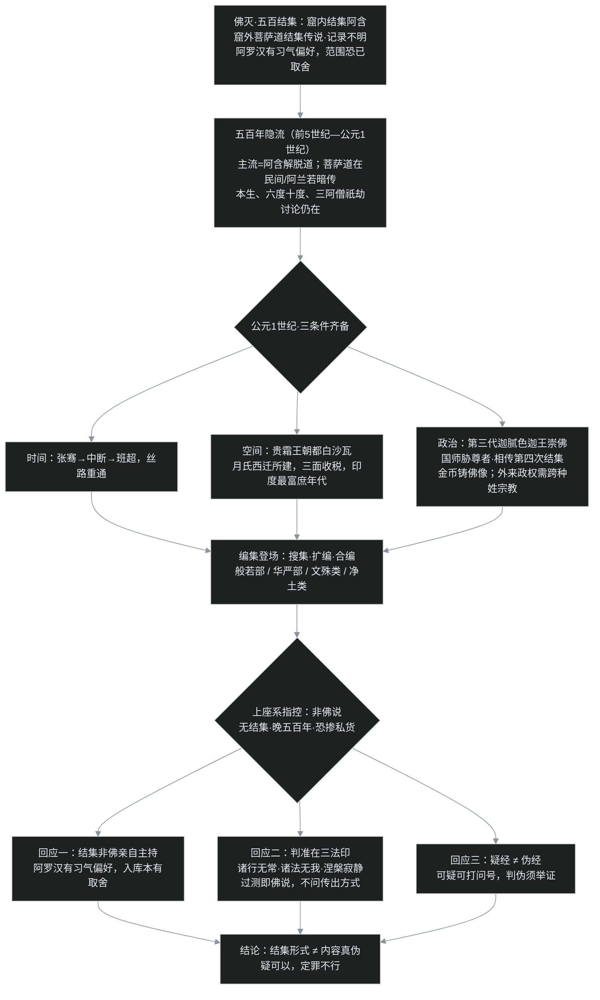

先问一个有点尖锐的问题。创始人去世五百年后，突然冒出来一大批号称"佛说"的新经典——光一部《大般若经》就有六百卷，比汉译四部阿含加起来还厚两倍，这批迟到了五百年的文档，凭什么让人相信真是创始人说的？

上一篇 [C04](/post/51.html) 讲到，佛灭后僧团一路分叉，大天五事、佛有法身化身这些新观念在大众部里发酵。到公元 1 世纪，这些观念不再只是部派间的口水，化成了一大批新经典公开登场，运动的名字叫**大乘**。它一出场就撞上一个必须回答的质疑：**第一次结集、第二次结集都没有这些经，它们到底从哪来？**

## 一、先说"大乘"是什么：从只讲"空"，到空有合讲

在进入争吵之前，先把坐标系摆正。后世把大乘在印度的流行分为两期，分界不在朝代，而在**教理重心**：

- **初期大乘（约公元 1–3 世纪）**：从"真空"入手，核心是**一切法空**，以般若类经典为主导。它有个天然的副作用——"空"讲过头容易被听成"什么都没有"，修行有没有效、能不能成佛？连成佛也是空的？很多人接受不了，这种误读叫**断灭空**（也叫顽空、恶取空）。
- **后期大乘（约 4 世纪起）**：补上另一半，叫"**空其所空，有其所有**"，真空之外还要有妙有——唯识学立阿赖耶识，如来藏系立佛性，把"空"和"有"合在一起讲。4 世纪笈多王朝，无著、世亲推出唯识学，那是 C07、C08 的战场。

还要先澄清一对概念：**人空**（人我空）与**法空**（法我空）。人空是否定恒常独立的"我"，就是 [C03](/post/50.html) 那一题；法空是否定一切事物各有固定不变的自体。声闻乘讲人空，大乘讲人空**加**法空。关键是次序不能乱：**没有人空作基础，单讲法空就会滑向断灭——烦恼没断干净，先把戒律因果都"空"掉了，这是本系列反复要防的误读。** 课程有个比喻：人空是比较粗的"无所求"——没有贪嗔痴；法空是比较细的"无所求"——连得失心都没有。声闻解脱道是菩萨道的基础，"没有一楼，盖不起二三楼"。

## 二、登场的新经典：四类，和一个五百多万字的大部头

初期流布的大乘经，大体四类：

1. **般若部**：最核心的一类。旗舰是《大般若经》，玄奘译本六百卷，按一卷约九千字算，约 **540 万字**；薄的有《金刚经》，最薄的是玄奘译《心经》，只有 **260 字**——同一套"空"，从五百多万字讲到 260 字。
2. **华严部**：《华严经》，汉译有八十卷、六十卷、四十卷三种本子。
3. **文殊类**：与文殊师利菩萨相关的经典，表般若大智。
4. **净土类**：重信愿的经典，流布很可能和乱世苦难有关（细节是 C05 下的正题）。

这里先埋一个反方视角：新经部类清楚、数量惊人，但它们都有一个共同的身世问题。

## 三、五百年的隐流：结集 vs 编集

旧经典的来路很清楚：佛灭当年五百结集，阿难诵经、优波离诵律，同批人、同一时间、当众背诵审定——这个动作叫**结集**。新经典的来路完全不同：**多方搜集、逐渐扩编、合编而成**，这个过程叫**编集**。比如般若类是慢慢扩充成大部的，华严类是把高阶菩萨行的法门汇集到一起。

五百年间菩萨道的经典去哪了？课程给的图景是：它们没有断绝，只是**非主流的隐流**。当时僧团的主导权在以上座长老为核心的出家僧团手里，修行目标是证阿罗汉，重视的是服务于解脱道的阿含；适合在家人的菩萨道经典"有流传，但没有权威性的整理"。大乘方面也有传说：七叶窟的窟内结集之外，富楼那（布罗那）尊者在王舍城城内另召集过菩萨道经典的结集，但记录远不如窟内五百结集明确，只能存为一说。阿含本身就留下了蛛丝马迹——经里明明有佛本生故事里的菩萨行；后来集出的《六度集经》（汉代以后汉译的本生故事集），所收故事也以布施、持戒、忍辱、精进、禅定、智慧为纲，这类素材的源头显然更早。可第一次结集出的菩萨道详细教法却不成体系，"这就很奇怪"。合理的推测是：**第一次结集在范围上恐怕已经有所取舍。**

为什么恰好在公元 1 世纪从隐流转为公开？三个条件同时成熟：

**时间——丝路重通。** 西汉张骞出使西域打通丝路，王莽时中断，东汉班超以少军再通。东方汉帝国、西方罗马帝国之间的贸易重新流动，思想也跟着商队走。

**空间——贵霜王朝的富庶。** 贵霜是被匈奴所迫、西迁的月氏人的一支所建，疆域从中亚延伸到西北印、中印，首都在**白沙瓦**，正卡在汉帝国、安息（波斯）、印度三方商路的中央，三面收税。课程称这大概是"印度历史上最富裕的年代"。百姓富庶之后自然要求精神生活，而出家解脱道需要离尘专修，**最适合在家居士的，恰恰是菩萨道**。

**政治——迦腻色迦王护法。** 贵霜第三代王**迦腻色迦**大力崇佛，国师是**胁尊者**，相传在其支持下召开了第四次结集（结集《大毗婆沙论》，此说相传，存异说）；留存的金币一面是国王像、一面是佛像，是实物证据。更现实的一层：月氏是外来政权，统治的是雅利安人的土地，婆罗门教是本土民族信仰，**跨种姓、不讲出身的佛教比婆罗门教更适合充当帝国的凝聚纽带**。

时间、空间、政治三条件凑齐，沉寂五百年的隐流被"编集"出版。可这个出版方式，立刻就被反对派抓住了。

## 四、吵架现场：「非佛说」的指控

上座系的反击可以归结为一句话：**没有经过正式结集的东西，五百年后靠搜集编凑而成，谁知道里面掺了多少后人的私货？**

这一问并非无理取闹。时间隔了五百年，口传会不会走样？编集没有统一主办机构，会不会有人把自己的意思写成"佛说"？批评者说大乘自称 Mahāyāna（大车），把对方叫 Hīnayāna（小车），被逼急的上座系也不甘示弱，直接回敬"**大乘非佛所说**"。这一吵在印度吵了几百年，余波到今天。

大乘方面的回应，课程讲了三层，一层比一层深。

## 五、「凭什么是佛说」：三层回应

**第一层：结集的形式，不自动等于内容的真伪。** 就算第一次结集程序完备，主持结集的也不是佛本人，而是阿罗汉。阿罗汉断了烦恼，但**还有习气、有偏好**——这批人一心一意求自己解脱，感兴趣和熟悉的自然是解脱道经典。以这批人的偏好做筛选标准，入库范围本身就可能是偏的。所以"有结集背书=佛说""无结集背书=非佛说"，两个推论都不成立。

**第二层：判准在法，不在形式——三法印。** 一部经是不是佛说，不看它什么时候、以什么方式传出，而看它的内容合不合**三法印**：**诸行无常、诸法无我、涅槃寂静**。符合三法印，无论谁传出，与佛说同等；不符合，就算挂上佛的名字也不是。这个标准在 [C02](/post/49.html) 就埋过——三法印像一台验钞机，认票面的防伪特征，不认钞票是哪家银行柜台递出来的。

**第三层："可疑"和"伪造"是两回事。** 逻辑上，"传出方式可疑"推不出"内容是伪造"。真要判伪经，得回答：谁伪造的？在哪里？什么时候？有什么证据？答不上来，最多只能打一个问号。汉地的经录传统自古就分得很清：**疑经**（来源存疑，待考）和**伪经**（确证伪造）分列——嫌疑人在定罪之前叫嫌疑人，不叫罪犯。据龙树论著中引用的经名推定——龙树约在公元 150 年造《中论》、开中观学派，弟子提婆继之，去古未远，所引经目是推定初期经典规模最硬的文献证据——初期大乘经典至少有二十六部之多，般若、华严之外，净土类经典当时收在**宝积部**，《维摩诘经》则是无法归入各部的独立经典。

还有一个很有力的旁证来自汉地：唐代道宣律师的"南山律三大部"在宋代战乱中散佚，元、明、清三代的律宗律师没人读过完整本子，直到近代弘一法师托日本友人从日本找回，全书才复完。**一部论散佚千年能从海外找回来，说明"经典在某时某地缺失或晚出"与"它本身可不可靠"是两个问题。** 佛世书写工具不发达（贝多罗树叶铁笔刻痕，再涂烟墨、拭面使墨入痕，远不如背诵高效），早期教法全靠背诵；大乘经编集的时代文字已经普及，"从文献中搜集"与"当年靠背诵结集"的差别，有相当部分是**载体技术换代**造成的。

## 六、一个程序员类比：没有 commit 签名的代码，能不能进主干？

用软件工程的话说，这场争论几乎是一场代码供应链之争：

- **阿含结集 ≈ 封版大会上集体评审入库**：同批核心维护者在场，每行代码当众复核，相当于初代核心团队的封版会议，来源清楚；
- **大乘编集 ≈ 五百年后，从各地长期流传的抄本、口传笔记、民间实践里汇编出一大批文档**，没有封版大会的电子签名（commit signature，证明每行代码是谁提交的加密标记），也找不到 MAINTAINERS 文件背书；
- **反对派的立场**：无签名、无封版记录、晚出五百年，不准合入主干；
- **大乘的反驳**：其一，当年的封版大会也不是创始人亲自主持的，主持者是一群**有个人偏好的维护者**——入库时就有取舍（阿含里本生、六度等"接口痕迹"还在，详细实现却没入库）；其二，判断一段代码是不是这个项目的正统代码，看的不是提交记录，而是它**过不过得了项目的契约测试**——三法印就是三条契约：诸行无常、诸法无我、涅槃寂静，过测即佛说，不过即外道；其三，来源不明的提交顶多在测试报告上挂个 ⚠️ 待查标记（疑经），不能直接判失败（伪经），**待查和驳回是两个状态**。

不写代码的读者记住大白话就行：**老代码入库时有核心团队签字，新代码没有；但判断代码对错靠的是测试能不能通过，不是签字。**

**这个类比有两个洞，必须当场戳破。** 第一，软件的契约测试有 CI 服务器自动给出过/不过的确定结果，三法印没有——历史上各家都宣称自己"过测"，判读的终究是人。所以这个类比只能证明"**结集形式不等于内容真伪**"这一件事，不能反过来证明任何一部经一定是佛说，信仰上的采信仍要回到每个人对义理的印证。第二，真实的软件供应链里，"无签名＋晚出五百年"确实是高危信号，审查从严完全正当——课程的立场也只是"**疑，可以；定罪，不行**"，从不要求人放弃怀疑。

另外，把"编集"想象成今人攒公众号爽文也是错的：六度（六波罗蜜）、十度这些菩萨道纲目**根本不是大乘的新发明**——部派佛教里就有四波罗蜜、六波罗蜜，连最保守的南传赤铜鍱部传承里都有十波罗蜜；成佛要经历三大阿僧祇劫（一说七大，龙树则说无量劫）、要断见惑、思惑、尘沙惑、无明惑，这些讨论部派时期都已存在。隐流是真的有水流，不是五百年后凭空挖出来的渠。

## 七、三转法轮：一个被双方各自解读的"巧合"

争论之外，《解深密经》（唯识学的根本经典之一）里有一套佛自己的判教框架，叫**三转法轮**：

| 阶段 | 说法对象 | 核心法义 | 对应经典气质 |
|---|---|---|---|
| 初转 | 急于解脱的声闻弟子 | **人我空**：四谛、无常苦无我，先断烦恼出轮回 | 阿含 |
| 二转 | 能接受更深法的人 | **法我空**：一切法空、空无相无愿 | 般若 |
| 三转 | 菩萨根器 | **空其所空、有其所有**：真空妙有、唯识、如来藏 | 解深密等 |

经中佛自己评判：第三时说法**了义**——很多人望文生义把"了义"读成"最高级、赢过前二时"，但经里的意思是**详尽、明了、完整**；初时为引急于出离的人先讲人空，并非不全面，只是当时只能讲到那里。

耐人寻味的是历史对照：佛灭后根本佛教与部派佛教的主流恰好重人空（声闻解脱道），初期大乘恰好讲一切法空（般若），后期大乘恰好讲真空妙有（唯识、如来藏）——**经中佛说法的内在次第，和五百年后实际发生的思想史顺序，几乎严丝合缝**。

这个巧合双方都能拿来用：怀疑者说，看，这证明《解深密经》是后人照着历史进程倒填日期的伪作；护法者说，佛本就观机设教，人性的需求在每个时代按同样的次序浮现，教法与历史共振不足为奇。课程的态度很明确：**这是凑巧，不可反推伪经；但也不必硬说是预言——它真正说明的是教法有内在的深浅层次，学习要按人空→法空→空有合讲的次序来，跳级单讲法空就会摔进断灭空。**

## 八、叶扬的卡壳角

**卡壳之一："三法印判真伪"听起来是个完美标准，用起来呢？** 叶扬起初觉得三法印像宪法审查，客观中立。细想一层：条文很短，解释权在人——"什么才算诸法无我的推论""这部经是不是符合涅槃寂静"，吵起来还是各自举证。它实际上更像科学哲学里的"可证伪性"：一个干净、有力但需要人去运用的划界标准，而不是自动闸门。这恰好也是类比里那个必须戳破的洞。想通这点反而踏实：**课程从未承诺给一台免思考的验钞机，给的是一台要自己学着用的验钞机。**

**卡壳之二：南山三大部散而复集的例子，是辩护还是证据？** 第一次听觉得这是话术——散佚复得证明的是"文本会失踪"，怎么能拿来证明大乘经可靠？后来分清了它论证的到底是什么：它**只**证明"某文本在某时某地缺失、晚出"推不出"该文本是伪造"，即摧毁反对派证据链里的一环，并不正面证明大乘经源自佛说。加上疑经/伪经之分，课程其实把举证责任摆得很正：质疑成立可以疑，判伪要举证。这个边界，叶扬觉得是整套辩护里最诚实的地方。

**卡壳之三：五百年的隐流为什么没断？** 这是个纯历史好奇。没有权威整理、没有主流地位，靠什么活下来？拼合课程里的碎片：适合在家信徒的实践（本生崇拜、六度善行、塔庙供养）一直在民间延续，出家比丘在阿兰若处的修行传统也未中断，南方更有持续的经典搜集活动。它不像窟内结集那样有清晰的"签收记录"，但 26 部经名被龙树逐一征引、部派传承里早就有六度十度——**隐流虽隐，水脉可查。**

## 九、一张时间流程图、两张对照表、一组术语

两张对照表：结集 vs 编集（见下）、三转法轮（第七节）。

| 对照 | 阿含：结集 | 大乘经：编集 |
|---|---|---|
| 时间 | 佛灭后短期 | 公元 1 世纪前后，距佛灭约五百年 |
| 方式 | 同批人当众背诵、共同审定 | 多方搜集、扩编（般若）、合编（华严） |
| 主导者 | 大迦叶主持，五百阿罗汉 | 无统一主办机构，各地传承汇集 |
| 文字 | 全靠背诵（贝叶刻写不发达） | 文字已普及，以文献收集为主 |
| 可靠性判准 | 程序清楚，但内容仍须合三法印 | 程序存疑，但内容仍须合三法印 |

**本篇术语清单**（先白后专，回看用）：

- **大乘 / 声闻乘**：Mahāyāna 大车，以成佛度众生为目标；以自身解脱为目标的传统被大乘称为"小乘"，这是论战用词，今天礼貌的称呼是上座部佛教（[C00](/post/45.html) 已拆过此误会）。
- **人空 / 法空**：人我空=没有恒常独立的自我；法我空=一切事物都没有固定不变的自体。声闻乘讲前者，大乘两者合讲，次序不可颠倒。
- **断灭空（顽空、恶取空）**：把"一切法空"误读成什么都不存在、因果戒律都空掉，是般若最防的曲解。
- **真空妙有**：空掉该空的执著，保留该有的缘起业果与佛性；初期大乘偏重真空，后期大乘空有合讲。
- **结集 / 编集**：同批人当众背诵审定的封版式整理 / 长时期多方搜集扩编合编。
- **四部类**：般若部（《大般若经》600 卷约 540 万字、《金刚经》、《心经》260 字）、华严部（80/60/40 卷本）、文殊类（大智）、净土类（信愿）；另有宝积部（早期净土经多收其中）与无法归类的《维摩诘经》。
- **贵霜王朝 / 迦腻色迦**：月氏西迁所建帝国，都白沙瓦，扼丝路商道三面收税；第三代王迦腻色迦崇佛，国师胁尊者，相传支持第四次结集，金币一面王像一面佛像。
- **三法印**：诸行无常、诸法无我、涅槃寂静；判断是否佛说的内容判准。
- **疑经 / 伪经**：来源存疑待考 / 确证伪造；汉地经录自古分列，"疑犯不等于罪犯"。
- **三转法轮**：《解深密经》的判教框架——初说人空（阿含）、二说法空（般若）、三说真空妙有（唯识如来藏）；"了义"=详尽明了。
- **六波罗蜜（六度）/ 十度**：布施、持戒、忍辱、精进、禅定、般若（加方便、愿、力、智为十度）；部派与南传本有，非大乘独创。
- **三大阿僧祇劫**：成佛所需极长时劫的通说（另有七大、无量劫异说）；其间断见惑、思惑、尘沙惑、无明惑。
- **贝叶经**：以贝多罗树叶铁笔刻痕、烟墨入痕显字的经典载体；佛世书写不发达故重背诵。

下一篇 **C05（下）**：合法性吵完，该看新经的内容到底"深"在哪里——为什么大乘敢说"**生死即涅槃、烦恼即菩提**"？念佛、造像、写经这些后来最容易被做成壳子的形式，本意是什么？最后给出大乘三系（中观、唯识、如来藏）的导览地图，C06 起逐系深入。

> 说明：本系列为个人学习笔记，讲的是公共历史知识，不引用课程字幕原文，也不代表任何宗教立场。课程为 B 站《印度佛教史》（合集 BV1vewnzqEuA，本篇对应第 8 讲及第 32 讲重录版），教材为印顺《印度佛教思想史》；第四次结集等史事有异说，文中已标"相传"。
