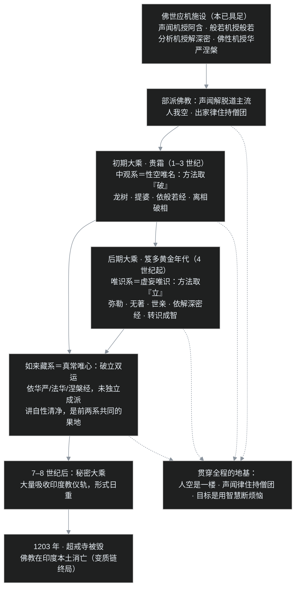

上篇 [C05（上）](/post/52.html) 解决的是"身份证"问题：迟到五百年的经典凭什么叫"佛说"；这一篇看内容。新经到手，读者多半冒出三连问：

1. 大乘号称"深智大行"，到底**深**在哪里？和 [C02](/post/49.html) 讲的四谛、[C03](/post/50.html) 讲的无我，是同一套东西的延伸，还是另起炉灶？
2. 法理既然这么高深，为什么今天给普通人的印象是念佛、拜佛、烧香、许愿？这是原汁原味，还是后来变了质？
3. 大乘内部又分中观、唯识、如来藏好几套，一张地图怎么画？

本篇对应第 9、10、11 讲与 33、34 重录版，三连问逐个来。对应到章节：先立总纲、看"深"的四层（一、二），顺手结清两笔绕不开的账——大乘与声闻有没有割裂（三）、这条路究竟要走多久（四）；再回答念佛拜佛从何而来（五、六）；最后补上历史坐标、画出三系地图（七、八）。

## 一、总纲：两个字，"深智"与"大行"

初期大乘经典四类（般若、华严、文殊、净土），归纳为两个重点：

- **深智**：般若经重空慧，讲"一切法空"的甚深智慧，理论高度在这里；
- **大行**：菩萨不只自求解脱，要在六道里生生世世度众生。华严经讲十地次第、六度十度的实行，净土经讲为来世找个不退转的修行环境，都属"大行"一侧。

印顺把这一期大乘叫"深智大行的大乘"。光懂空性而不度众生，等于有顶级技术只写在个人笔记里；盲目行善而没智慧，又可能越帮越忙。下面看"深"的四个层次。

## 二、四甚深：与声闻乘逐层对比

课程借印顺整理给出四种"甚深"，都相对于声闻乘立场（本篇不用那个"小"字贬称）：声闻解脱道始终是菩萨道的一楼，不是平地起高楼。

**1. 涅槃甚深：从"了生死、入涅槃"到"生死即涅槃"。** 声闻模型里，生死是苦、涅槃是乐，二者对立，修行就是赶紧从此岸到彼岸，叫"厌生死、入涅槃"。大乘立**不二法门**：**生死即涅槃**——这念心不再对立、不再逃避，生死场中就是涅槃。但门槛很明确：七地、八地以上证**无生法忍**的菩萨才真正做到。经典例子是地藏菩萨：入地狱度众生而不受苦报，靠的是愿力与智慧，不是业报；凡夫入地狱则只有业报。对普通学习者，这一条不是"可以在红尘里为所欲为"，而是**先从观念上不怕生死、不急厌逃**，路线从"逃离"改成"穿越"。

**2. 空性甚深：从"人我空"到"一切法空"。** 声闻证人我空即可成阿罗汉（见 [C03](/post/50.html)）；大乘进一步说**一切法空、一切法无自性**——"自性"即固定不变、不依条件而独立存在的自体。连涅槃也要空：涅槃若有固定自性，没证的人就永远被锁在外面。正因为一切能转变，凡夫才"可以"成佛。这也防住上篇警告的断灭空：空掉的是"固定实体"，不是缘起业果与修行本身。

**3. 方便甚深：从"断烦恼"到"烦恼即菩提"。** 声闻视烦恼为敌，策略是断；大乘立第二个不二：**烦恼即菩提**。无明与明是同一个心识的一体两面，如手心手背：不是一回事（一迷一觉），也不是两样东西。差别只在**觉性是否现前**。这种不离烦恼现场而转化它的解脱，叫**不思议解脱**。智慧分两种：**根本智**（照见空性的般若实智，阿罗汉也有）与**后得智**（度众生时临场长出的善巧经验，唯菩萨道才有）；佛具**一切种智**，福慧双圆，称"福慧两足尊"。这不是叫人去找烦恼、养烦恼，而是在解决自己与众生烦恼时借境练心。

**4. 佛果甚深：从人间老比丘到法报化三身。** 声闻所重是有生老病死的人间佛陀；大乘把人间身判为**方便化身**，把与真理相应、不生不灭的智慧体系立为**法身**，又开出**报身**（三十二相、八十种好，如极乐世界阿弥陀佛），合称**法、报、化三身**。佛的传承是一条时间线：燃灯佛→释迦牟尼佛→未来**弥勒佛**（经中说五十六亿七千万年后龙华三会成佛）。化身有灭度，法身常住。

| 甚深 | 声闻乘立场 | 大乘立场 | 实践门槛/要点 |
|---|---|---|---|
| 涅槃 | 厌生死、入涅槃，二者对立 | 生死即涅槃（不二） | 七、八地无生法忍菩萨真正做到；凡夫先立观念 |
| 空性 | 人我空 | 一切法空、无自性，涅槃亦空 | 无人空基础谈法空必滑向断灭 |
| 方便 | 视烦恼为敌，断尽方休 | 烦恼即菩提，不异不一 | 不思议解脱；后得智唯菩萨道长成 |
| 佛果 | 人间老比丘 | 法、报、化三身 | 人间身是化身；法身常住 |

## 三、不是另起炉灶：目的、戒律、二谛

四甚深容易给人"旧账全被推翻"的错觉，课程在三处澄清。

**目的不同，格局不同，方法大半相同。** 声闻乘目标是"逮得己利"——自己断烦恼得解脱；大乘是**发菩提心、修菩萨行、成就佛果**，自利之外更要度生。但六度这类方法在早期经典里本有，部派与南传也有四波罗蜜、六度乃至十波罗蜜，差别主要在目标，不在发明权。

**戒律不是废除，是换了一套更大的。** 声闻律（出家戒）靠羯磨法住持僧团、规范集体生活；大乘持**菩萨戒**，总纲**三聚净戒**：断一切恶、修一切善、度一切众生，重在规范个人发心，并不替代出家律。这里有个沉痛标本——日本佛教：**江户**幕府把寺院按地区划成固定的"**檀家**"供养区，寺庙经济看似有保障，实被行政管控；住持职位渐成嫡长子继承的庙产，**明治政府 1872 年正式开肉食妻带之禁**，娶妻遂由潜规变成通制。出家形相一破，居士失去供养理由，近代日本寺庙多靠门票、墓园、民宿维持。结论很硬：声闻律是僧宝住持的骨架，汉传四分律、南传上座部律都极重要——"正法久住"靠制度，不靠情怀。

**法义是两层，不是两个矛盾。** 声闻乘讲五蕴无常、苦、无我、十二因缘，大乘把这些判为**世俗谛**；从空性照见的**胜义谛**是一切法空、无住为本。关键句：**这不是大乘贬低声闻，而是人空加法空共两层**。只讲无常一边而不通达法空，般若经里有个不客气的名字叫"**相似般若**"——像全套，其实半套。涅槃在经中因此有约十二种异名（吹灭、空、无生、离、灭、真如、法界、实际等）：证人空得阿罗汉，进证法空才圆满佛果。

## 四、成佛要多久：大行这笔时间账

"大行"之所以称大，是因为它要在六道里生生世世地走，不是一辈子的工程。那么这条路究竟要走多久、多少世？菩萨道的时间表确实吓死人，传统有三说：**三大阿僧祇劫**（一说七大），龙树从释迦本生推定是**无量**阿僧祇劫。通行粗分表：凡夫→初地（见道位）见惑顿断、思惑未尽；初地→七地尽思惑、进断尘沙、无明（习气）；八地→成佛。三分之一时间断烦恼、三分之二断习气——行为改了，习气反应还在。

但课程给了两面平衡：其一，**急着要成佛本身就是一种烦恼**，执着快慢反而成不了；其二，反例确实存在——《法华经》**龙女**八岁、刹那成佛，时劫不是硬性定额。经典用庵罗花（开花多、结果少）、鱼籽（一次无数、成活者稀）形容：发心者众，成就者稀。

再拆一个流传极广的说法："**留惑润生**"——"菩萨故意留一分烦恼，才能留在生死中度生"。课程明确：**这是祖师的解说语，不是佛经原文**。准确教理是"**未断尽**"：地地断惑，六、七地才断尽人我执；前六地受生仍可能被业力牵扯，八地以上才纯以愿力神通往来。把"未断尽"读成"不用断"，是给懈怠发的免修金牌。

## 五、易行道：路太长，于是有了方便法门

成佛的时间如此漫长、门槛如此高（见上节），多数人还没起步就先退了。一类专为"先走起来"设计的入手方式由此登场——它在印度佛教后期与传入中国后，发展成今天大众最熟悉的念佛、拜佛、礼忏、造像、写经。下面依次看它的源头（六随念）、主干（净土）、日常配套（仪轨）与另外两类形态（造像、写经）。

"方便易行"要先正名：方便是度众生的善巧，易行是**相对**出家专修而言的入手方式，**绝不是"大乘修行比较简单"**。

**六随念。** 早期有六念法门：念佛、念法、念僧、念戒、念施、念天。佛世确实把它用于临终关怀：临终者怕断灭、怕不知下一站去哪，此时令其忆念三宝与一生善行，走得安稳（所以临终只提善行、不揭恶业）。但本质不止于救济：是令心念聚焦的**正念训练**，与四念处同属止观路线。佛为两种人说两种入手：信行人（重信愿）授六念，法行人（重思辨）授止观，入口不同，都能拉到解脱。

**净土法门。** 净土有东方阿閦佛妙喜世界、西方阿弥陀佛极乐世界。求生净土的核心动机不是逃避恶世，而是**防退转**：在生死中度众生，最怕"度着度着自己被度走了"——见众生难度便退心自了；往生净土见佛闻法，可保**三不退**：位不退、行不退、念不退。念佛有四个目的：往生佛国、不退菩提、**得陀罗尼**（总持，总摄佛法、一法不忘，即抓住念佛三昧这个止观核心）、忏悔业障（《观经》下品下生说称名灭八十亿劫重罪）。而念佛三昧本身可止观双运、定慧等持，上品上生相当于七地、八地菩萨。重话值得记住：**不是这个法门 low，是我们把自己的目标设定得 low。** 早期净土并不轻松：慧远一系修**般舟三昧**（常行九十日的苦行），持名简化由唐代善导完成。

**配套仪轨。** 忏悔（水忏、梁皇宝忏等）重点不在哭，在知错改过；劝请（护持说法）；随喜（对别人的善行真心欢喜，专治嫉妒）；**回向**——把善念与修法体会分享给一切众生，是布施与祝福的扩散，不是账房里称斤论两（"功德不是一斤十六两、分八两给谁"），功效随见闻者所受影响而定。

**造像与写经。** 佛世原不许造像，以免重蹈婆罗门教偶像仪式的老路；佛灭后希腊势力入西北印带来**犍陀罗**风格——最早的佛像肌肉纹理分明，几乎就是希腊神像，印度本土另有**秣菟罗**风格。造像意在使瞻仰者心中有佛；写经功德在**法的传播**，古代抄写是唯一管道。通到电子时代：打字输入佛经、做电子佛典、**做网站弘扬正法，与当年写经同义**。

**谁都能学："通俗化"议题的再判断。** "大行"还有一层含义：它把"谁有资格修行"的范围一路扩大。早期认为"佛出人间"——人道忆念力强、知苦而有出离的梵行动力，胜过沉溺享乐的诸天。大乘把修行者扩充到六道：龙女（畜生道）成佛、夜叉护法、金刚力士；善知识范围也大开——《华严经》善财童子五十三参，各行各业、乃至当时所称"淫女"（古称不带后世贬义，约当今日特种行业女性）皆可参学，标准只有一条：能提升智慧、助人解脱的都可学。老师对这种扩充另有改判（见第九节）。

## 六、一个程序员类比：封装好的按钮，和按钮里的算法

用软件行话说，念佛、礼赞、忏悔仪轨、造像、写经，都是**封装（encapsulation）**：

- 止观、空性慧、无我的现观，是系统底层的核心算法——强大，但学习曲线陡，要读源码、懂原理、长期调试自己；
- 六随念、持名、礼忏、回向，是把核心算法打包成**CLI 命令和图形按钮**：不必读完内核，照命令敲、照按钮点，新手也能让正确流程跑起来——降低门槛本身就是慈悲，相当于官方维护的高质量 SDK；
- 写经→打字→做网站弘扬，是同一套功能在不同技术世代换发行渠道，文档的价值只在"有没有被人读到"。

不写代码的读者记住大白话：**佛理是发动机，仪轨是一键启动——为的是让不会造发动机的人也能上路，不是让你崇拜按钮。**

这个类比有三个洞，先自己戳。**第一，封装的价值全看按钮背后还连着真实算法。** 底线在此：念佛、礼赞、造像、写经里**必须有禅定智慧的内涵**，整个系统只有一个总目标——**用智慧断烦恼**；内涵抽空，仪式只剩形式——空壳按钮点起来有音效，业务逻辑一行没执行。**第二，会制造迷信式用户：有人拜起了按钮本身。** 把往生、灭罪理解成与按钮的交易，等于把调试工具当许愿机；回向被算成"一斤功德分八两"，同病。**第三，内核高手也不能鄙视按钮。** 法行人与信行人只是根机不同，止观与持名通向同一个定慧等持；嘲笑新手用 SDK，不是架构师的修养。

## 七、笈多坐标：画地图前，先立时间轴

三连问还剩最后一个。要讲清中观、唯识、如来藏的关系，先得把它们放回各自出现的年代——这一节是时间坐标，下一节据此画地图。

公元 4 世纪，贵霜之后雅利安人重新掌权，进入**笈多王朝**"黄金年代"（旃陀罗笈多二世即超日王时代鼎盛，文化地位约略可比文艺复兴）。婆罗门教借政治回暖仿佛教造论、体系化，升级为今日的印度教，竞争力大增。

佛教的回应是后期大乘：无著、世亲推出**唯识**瑜伽行派，《大般涅槃经》《胜鬘经》等如来藏系经典流布，总纲从上篇"一切法空"推进到"**空其所空，有其所有**"的真空妙有——既防断灭空，也给出转识路径。后期经开两个著名命题：**生佛不二**（众生与佛心性不异、染净相异：凡夫是含金的金矿，修行只是炼去杂质，表现不出智慧不等于没有）与**天佛不二**（把印度教群神说为如来名号以摄化外教）。要警惕反方向：印度教后来反称佛陀是毗湿奴第九化身——谁摄化谁，是竞争攻防题。深水区（常乐我净、佛性是不是"我"）留给 C08。

## 八、大乘三系地图：破、立、双运

最后是导览图。印顺把整个大乘按入手处分为三系，每系给三套名字：

| 系 | 印顺三名 | 所依经 | 方法 | 代表人物/年代 | 华严宗判教 |
|---|---|---|---|---|---|
| 中观 | 法性空慧宗＝性空唯名论 | 般若部（《大般若经》《金刚经》《心经》） | **破**：离四相、断三心，离相破相，"诸法性空，但有假名" | 龙树、提婆（2–3 世纪，贵霜） | 破相教 |
| 唯识（瑜伽行派） | 法相唯识宗＝虚妄唯识论 | 《解深密经》（兼《楞伽经》） | **立**：立七、八识，安立名相、逻辑分析，转识成智，三种无自性防顽空 | 弥勒、无著、世亲（4–5 世纪，笈多） | 法相教 |
| 如来藏 | 法界圆觉宗＝真常唯心论 | 《华严》《法华》《圆觉》《楞严》《大般涅槃经》 | 遮诠表诠齐施（破与立双运） | 未独立成派，思想贯串前两系 | 显性教 |

三系关系：中观与唯识讲"一切法无自性"，是**凡夫因地**的两种入手路径——有人适合直接看破，有人适合把心识分析透；如来藏讲"自性清净"，是**诸佛果德**境界，故未单独成宗，只作为前两系共同指向的终点贯串其间。

本篇最坑的名相在此：中观、唯识说的"**无自性**"（没有固定自体）与如来藏系说的"**清净自性**"（心的体性本来清净）同用"自性"二字，含义近乎相反。**读经必须跟语境，不能只盯名词**——这是三系争讼千年的语言学根源。

**应机施设，与学风。** 佛世本就应机说法：阿含、般若、解深密、华严涅槃各对一类根器；连"中道"也有层次——声闻中道别纵欲苦行、别常见断见，证阿罗汉（大乘视为有余涅槃），大乘则连生死与涅槃的对立也要超越。因此南北汉藏各随根器所喜，**诋毁其他宗派本身就是要断的法执**；Mahāyāna/Hīnayāna 本是车乘比喻，今天应礼貌称"上座部佛教"。修学可通四部经：《阿含》、般若（难读则取《金刚经》）、《解深密经》、《华严经》或《圆觉经》（《楞严经》讲修证魔障最清楚，但因明偏多）；以经（修多罗）为依归，论可参考而诸论时有出入。"一门深入"的前提，是先找到那扇门。

## 九、吵架现场：念佛就能往生，那还修什么？

易行道从诞生起就挨同一种骂："念念佛号就能往生、还能灭罪，那持戒修定都不必了？这不是鼓励懒人吗？"

回应分三层。其一，看经典原文：持名是《观经》为下品下生——临终、极恶、来不及修——开的急救通道，不是成佛批发；念佛做到三昧可止观双运、上品上生，工具上限极高，是用户自己把目标设在了最低档。其二，六随念在佛世本与四念处同属正念训练，两种入口通向同一出口。其三，完全否定仪轨，等于主张新手不配用封装、人人必须手写内核——连佛都没这么苛刻；但仪式一旦与民间信仰区隔不开、空壳化，正是佛教在印度本土消亡的内因之一：太神圣则"叫好不叫座"，太世俗则与流俗同流。

印顺与老师有场温和分歧：六道皆能学道、善财五十三参，印顺判为推广走低的"通俗化"，老师改判为修行的**宽广性**与成佛的**普遍性**——同一堆史实，悲观者见稀释，乐观者见扩容。

## 十、叶扬的卡壳角

**卡壳之一："生死即涅槃"是全篇最危险的口号。** 叶扬的第一反应是这句话太解放——既然不二，烦恼不必断、戒律不必持？再读发现门槛极硬：七地八地、无生法忍、地藏入地狱不受报。凡夫提前领取，等于没拿到驾照先上高速，出事只有业报。这与上篇"可疑不等于伪造"是同一种训练：**法理的承诺有多高，实践的门槛就要看得多清**。

**卡壳之二："留惑润生"为什么听着这么舒服？** 因为它给"我就是断不了习气"发了张菩萨字样的通行证。追根溯源：祖师语、非经语，真相是前六地"未断尽"、仍受业力牵扯，八地以上才纯依愿力。舒服的教义要先怀疑它舒服在哪——这是上篇三法印验钞之外的第二台：**动机验钞**。

**卡壳之三：众生都有佛性，为什么又说一切法无自性？** 钥匙是语境：因地谈无自性，是说没有固定实体、所以一切能转变；果地谈清净自性，是说心的体性本净、修行只是去遮蔽。金矿喻（见第七节）：矿石无固定纯金形态（可炼），却确有金的成分（体性）。完整展开留给 C08。

## 十一、一张时间流程图、两张对照表、一组术语

三系并非静止并列，它们在时间中先后展开、最终汇向同一终点。戒日王之后印度教全面抬头，7–8 世纪后秘密大乘大量吸收其仪轨，**1203 年超戒寺被毁**，佛教在诞生地本土消亡——法本身不灭，灭的是众生与法结缘的机会（变质链终局详见 [C09](/post/60.html)）。完整时间流程见下图：

两张对照表：四甚深表（第二节）、三系导览表（第八节）。

**本篇术语清单**（先白后专，回看用）：

- **深智大行**：深智=般若空慧；大行=菩萨道广度众生，二者须相织。
- **生死即涅槃 / 烦恼即菩提**：两个不二法门，不再把生死与涅槃、烦恼与菩提当对立两态；事上须七、八地**无生法忍**菩萨做到，凡夫只先立观念。无明与明**不异不一**，如手心手背；这种转化式解脱叫**不思议解脱**。
- **一切法空 / 无自性**：一切事物没有固定不变、独立自存的自体；涅槃亦然，否则无漏者永不得入。
- **根本智 / 后得智 / 一切种智**：空性实智（阿罗汉亦有）/度众生的善巧经验智（菩萨道独有）/佛的圆满智慧；福慧俱圆称"福慧两足尊"。
- **法报化三身**：法身（与真理相应、常住）/报身（三十二相八十种好）/化身（如人间老比丘）。当来下生**弥勒佛**，经中说五十六亿七千万年后龙华三会。
- **三聚净戒**：菩萨戒总纲——断一切恶、修一切善、度一切众生；不替代出家声闻律。
- **世俗谛 / 胜义谛 / 相似般若**：缘起现象层面/空性实相层面；只通人空不通法空叫"学半套"的相似般若。
- **三大阿僧祇劫**：成佛时劫通说（另有七大、无量两说）；粗分表=凡夫→初地破见惑（思惑未尽）、初地→七地尽思惑并断尘沙无明、八地→成佛；龙女八岁成佛是反例。
- **留惑润生**：祖师语非佛经原文；实为"未断尽"——前六地或受业力牵扯，八地以上纯依愿力往来。
- **六随念**：念佛、法、僧、戒、施、天；佛世用于临终关怀，本质是与四念处相通的正念；为**信行人**开，止观为**法行人**开。
- **三不退 / 陀罗尼**：位不退、行不退、念不退，往生净土见佛闻法以防度生退转（东方阿閦佛妙喜、西方阿弥陀佛极乐）；陀罗尼=总持，念佛四目的=往生、不退、得总持（念佛三昧）、忏障。**般舟三昧**=慧远一系九十日常行苦行，持名简化由善导完成；法门不 low，是目标设定得 low。
- **回向**：把善念与法的体会分享扩散给众生，是布施不是交易。
- **犍陀罗 / 秣菟罗**：佛像两大起源风格（希腊化/印度本土）；佛世本不许造像。写经功德在法的传播，打字、做电子佛典、做网站同其义。
- **宽广性 / 普遍性**：老师对印顺"通俗化"判语的改判——六道皆可学道（龙女、夜叉、金刚力士），善财五十三参善知识遍及各行各业。
- **生佛不二 / 天佛不二**：众生与佛心性不异、染净相异（金矿喻）；以"群神皆如来名号"摄化外教，须防印度教反称佛为毗湿奴化身。
- **三系**：中观（法性空慧宗/性空唯名论，破，龙树提婆）、唯识（法相唯识宗/虚妄唯识论，立，无著世亲）、如来藏（法界圆觉宗/真常唯心论，破立双运，果地）；华严宗判为破相教/法相教/显性教。
- **檀家制度 / 肉食妻带**：江户幕府檀家区加庙产嫡子相承使娶妻成惯例，1872 年明治正式开禁；出家相破、供养崩塌，声闻律失守的标本。
- **超戒寺**：印度佛教最高学府之一，1203 年被毁，标志佛教在印度本土消亡。

下一篇 **C06** 进入三系分述第一站：龙树的中观——二谛怎么讲，"八不"为什么用八个否定词开场（不生不灭、不常不断、不一不异、不来不出），《中论》开篇"缘起性空"的归敬颂，又怎样把 C02 的缘起与本篇法空焊成一体。

> 说明：本系列为个人学习笔记，讲的是公共历史知识，不引用课程字幕原文，也不代表任何宗教立场。课程为 B 站《印度佛教史》（合集 BV1vewnzqEuA，本篇对应第 9、10、11 讲及第 33、34 讲重录版），教材为印顺《印度佛教思想史》；时劫、三会年数等为经论传统口径，文中已标"经中说""通说"。
