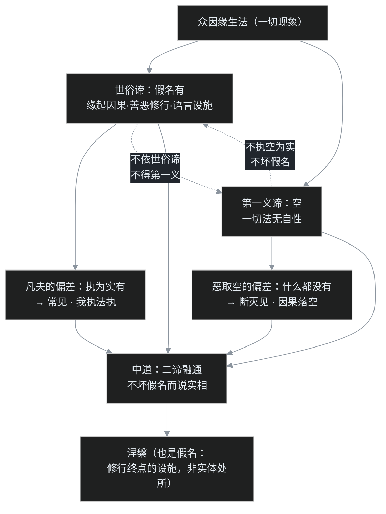

# C06（上）｜龙树的空（上）："一切法空"为什么不是"什么都没有"

[C05（下）](/post/53.html) 的三系地图里，中观系被放在"破"的位置：龙树与弟子提婆，不建体系，专门拆体系。这个位置容易让人误会——"破"是不是就是耍嘴皮子否定一切？更流行的版本是：佛教讲"四大皆空"，那加班是空、房贷是空、善恶报应也是空，干脆躺平等着成佛？

先把结论放在前面：**在龙树的词典里，"空"恰恰不是"没有"，而是"没有固定不变的自体"。**把空读成什么都没有，在佛教里有个专门的难听话，叫"恶取空"；《大智度论》里还有句很重的话：宁可起"有"的见解大如须弥山，也不可起"空"的见解小如一粒芥子。

龙树是谁？为什么是这个人出来给"空"正名？龙树用什么工具，把 [C04](/post/51.html) 里吵了几百年的部派、[C05（上）](/post/52.html) 里互相指控的大小乘，一把拢到同一张桌子上？这一篇先讲人和工具：龙树其人与四本著作、"一切法无自性"、二谛、三是偈与假名。八不归敬颂怎么"破"、部派三门怎么收编、提婆的结局，放下一篇。

本篇对应第 12 讲（兼第 33 讲重录版）。

## 一、龙树登场之前：一场吵了两百年的架

先看龙树接手的是个什么摊子。

公元 1 世纪大乘经陆续问世，印度佛教立刻分成两个互相看不上的阵营。声闻部派这边的指控很要命：第一次结集的圣典里没有这些东西，历史上也没有过大乘结集，"大乘非佛说"——这是 [C05（上）](/post/52.html) 详谈过的身份证问题。大乘这边反唇相讥：你们只求自了，格局小，"小鼻子小眼睛"。双方不是普通的意见不合，是互相辩论、互相贴标签，从大乘兴起一路吵到公元七八世纪，吵了七八百年——后期大乘唯识学的两兄弟无著、世亲，传说都曾为大小乘差点反目。

部派内部也没闲着。阿毗达磨论师把法分析得越来越细，细到给每一个分析单元安上"三世实有"的本体；另一批人谈空谈过了头，坐在"空"上否定因果戒律；还有一派真假都讲、就是讲不通。三拨人各执一端（这就是下一篇要讲的"三门"）。

公元 2—3 世纪之间，需要一个人：既懂声闻三藏，又通大乘新经；既有著作，又能让两边服气。印度佛教史把这个任务给了龙树。龙树是佛教史上**第一位大乘论师**——在龙树之前大乘只有经，没有自己的论藏；龙树之后，大乘才有了成体系的解释框架和学派。

## 二、龙树其人：天才、浪子、龙宫取经

龙树（Nāgārjuna），又译龙胜、龙猛，生平在印度照例是一笔糊涂账：印度人不记年，连佛陀的年代都要靠阿育王石刻旁推，龙树更不用说。学界一般把龙树放在公元 2—3 世纪，约 150—250 年之间；不同推定的出生年能差出一百年。5 世纪初鸠摩罗什在长安译出《龙树菩萨传》，这是今天最主要的传记来源——注意，是**传**，里面神话和史实搅在一起，读的时候要分清。

传说里的龙树，登场方式相当刺激。

**第一个故事是血案。**年轻时龙树和三个伙伴学会隐身术，半夜潜入王宫戏弄宫女。国王设伏：武士们在殿中按方位挥剑，看不见人就乱砍，三个朋友当场被砍死，只有龙树紧贴国王身边——没人敢往王身侧挥剑——捡回一条命。经此一吓，龙树痛感欲念招祸，发心出家。

**第二个故事是学霸。**龙树先在部派僧团出家（一说说一切有部），很快把三藏学完，觉得"就这？"；后来在雪山遇到一位老比丘，授以大乘经典，又很快学完，骄傲病复发。

**第三个故事最有名：龙宫取《华严》。**龙树想自立门户、另创一套僧团制度，这时一位大龙菩萨（传说是龙族化身）把龙树接入海中龙宫，打开七层宝藏，里面《华严经》有上、中、下三本：下本就有十万颂、四十万句，中本、上本更是天文数字。龙树这下被彻底折服，把下本背诵带出人间。汉译《华严经》流传至今有三个版本：四十卷、六十卷、八十卷，最完整的八十卷本离十万偈颂仍差得远——传说的尺度感倒是很一致。

神话底下有没有史实的影子？印顺推测，"龙宫"或许指东海岸奥里萨（Odisha）一带珍藏大乘写本的寺院或滨海道场，龙树在那里读到了外界见不到的大本经典。越神奇的传说，往往越是对"某件真实的、但来源说不清的事"的夸张记忆。

那个"自创菩萨僧团"的念头，最后放弃了。这里藏着一个值得一提的制度判断：菩萨道通于在家与出家，而住持佛法的僧团要求成员出离家庭、少欲知足，以专业身份代表三宝；在家身份另有生计，务农经商难免利益纠葛。三世诸佛没有制过"菩萨僧团"，龙树最终也没有另立——龙树选择在思想世界里做统一者，而不是在制度世界里做改革者。

此后龙树在南北印度弘法，《大唐西域记》于南憍萨罗等处记有相关遗迹。人是传奇的人，著作却是硬的。

## 三、四本论与一个学派：龙树留下了什么

先记结论：**中观学派因《中论》得名。**汉传传统把龙树的核心著作归为"四论"：

| 著作 | 卷数 | 内容 |
|---|---|---|
| 《中论》（《中观论》） | 4 卷 | 阐发中道与八不，学派奠基之作，全是精炼偈颂 |
| 《十二门论》 | 1 卷 | 空义的十二个论证门径，可当《中论》的纲要读 |
| 《大智度论》 | 100 卷 | 注释《大品般若经》，百科全书式的大部头 |
| 《十住毗婆沙论》 | 17 卷 | 注释《华严·十地品》，[C05（下）](/post/53.html) 讲的"易行道"判教就出自这里 |

藏传系统对龙树论书的传习更广，另有《回诤论》《七十空性论》《广破论》等（后世有"龙树六论"的概括，其中部分没有汉译本），其中《回诤论》专门回应"你说一切皆空，那你这句话本身空不空"的质问——这是个要命的逻辑攻击，龙树的回应也极漂亮，将来讲到因明时可以再聊。

《中论》的注释传统更是壮观：藏地有八家注的传说，连敌对阵营瑜伽行派的学者都来注它，赞成的、反对的，都绕不开这本书。到了 5 世纪初，鸠摩罗什在长安系统译出《中论》《十二门论》，加上龙树弟子提婆的《百论》，成为隋唐三论宗的远源，禅宗教人"破执着"的基因里也有这一脉。下一篇会讲提婆。

另外补一个龙树释经的框架：**四种悉檀**。"悉檀"是宗旨、用意的意思。龙树在《大智度论》里指出，佛陀说法有四种意图：随顺世俗常识、方便接引的，叫世界悉檀；针对学人气质启发善念的，叫各各为人悉檀；专门对治某种过失的，叫对治悉檀；开显究竟真实的，叫第一义悉檀。同一个佛陀为什么有时说"有"、有时说"空"？因为对象不同、意图不同——这把钥匙记住，二谛就好懂了。

## 四、要破的两种执着：凡夫抓"有"，圣者抓"空"

龙树要处理的执着有两层，这也是 [C05（下）](/post/53.html) 四甚深的理论核心。

**第一层是人我执（我执）。**凡夫把五蕴聚合的身心当成"我"，把世界当成实有，于是贪嗔痴全面运转。这一层，声闻乘已经处理得很成功：照 [C02](/post/49.html) 的四谛、[C03](/post/50.html) 的无我去修，断烦恼、证阿罗汉、出轮回。

**第二层是法我执（法执）。**注意，这是龙树的新诊断：一位圣者证了空、得了涅槃，如果心里立起"我解脱了""涅槃是真的、生死是假的"这种对立观念——这个**追求解脱的观念本身**，又成了一种执着。这不妨碍这位圣者个人解脱，但会让这位圣者停在半路，不愿意再入世度众生。

《法华经》里有个著名场面：佛刚开讲大乘，当场就有五千位声闻四众（比丘、比丘尼和在家弟子）起身退场，不听。这批人不是坏人，只是真心觉得"我已经证果了，事情办完了"。龙树要劝的"回小向大"，劝的就是这个状态。

所以中观的任务是双破：凡夫执"有"，要破；把空、涅槃、解脱当成新的实体来抓，也要破。《心经》那句"以无所得故……远离颠倒梦想，究竟涅槃"，"无所得"三个字就是中观的门——证到最后，手里不能攥着任何东西，包括"我证了空"这件事。

问题是：把"有"破掉，听起来就是什么都没有。龙树怎么避免这个滑坡？龙树有两件精密工具：**无自性**和**二谛**。

## 五、工具一：一切法无自性

"自性"（svabhāva），梵文字面就是"自己的存在"，定义很朴素：**一个东西自己就能成立、固定不变、不依赖任何条件的那种自体**。

龙树的观察是：翻遍经验世界，找不到这样的东西。找一张桌子，它是木料、榫卯、工匠、使用约定的聚合；找一个"我"，[C03](/post/50.html) 已经找过，只有五蕴相续；找一个公司，营业执照、银行账户、员工、注册地，没有一样单独拿出来是"公司本身"。凡是因缘聚合出来的东西，就没有自性——汉译一个字：**空**（梵文 śūnya），更完整的表述是**无自性**（niḥsvabhāva）。

关键的三个推论，一个都不能滑过去：

**第一，无自性 ≠ 不存在。**无自性的东西照样存在、照样起作用：茶没有"茶自体"，但烫到舌头一样疼；公司没有"公司灵魂"，但合同真有效、工资真到账。空，描述的是存在方式——以缘起的方式存在——而不是存在与否。

**第二，空的不是只有"我"，是一切法。**声闻讲的空是"人我空"：个体没有自体。龙树推进到"法我空"：不只是人，一切观念、一切法——包括涅槃、解脱、"空"这个概念本身——统统无自性。这就是 [C05（下）](/post/53.html) 说的人空、法空两个层次。

**第三，正因为无自性，缘起才可能。**这是最反直觉、也最关键的一条。反过来想：如果任何东西真有固定自性，它就永远是它自己，种子不能发芽、人不能改变、业不能成熟、修行不能成佛——世界冻成一块铁板。**可变、可转、可解脱，恰恰因为一切无自性。**所以"空"不是世界的判决书，而是世界的松动剂。

龙树还有一个更凝练的判断，把缘起和性空焊死在一起：**"缘起"就是"性空"**——同一个现象从它怎么出现看，叫缘起（条件聚合）；从它有没有固定自体看，叫性空（没有自体）。不是先缘起、后变空，是同一件事的两种说法。凡夫抓着缘起的现象当实有，声闻抓着空性的境界当彼岸，龙树说这两端是同一枚硬币的两面，根本不该对立。

## 六、工具二：二谛——两层都是真的

"同一枚硬币的两面"，龙树给它一套严格的表达：**二谛**。谛，就是站得住的事实、真理。

- **世俗谛**（saṃvṛti-satya）：现象层面的事实。桌子、人、因果、善恶、修行、证果——全在这一层成立，一样不落空。
- **第一义谛**（paramārtha-satya，也译胜义谛）：一切法无自性的真实，是圣者现观的离言境界，不能用语言概念完整表达。

两层不是"一个对一个错"，而是同一次认识的深浅两层。《中论·观四谛品》有最著名的一偈：

> 若不依俗谛，不得第一义；不得第一义，则不得涅槃。

意思极重：**没有哪条路能跳过现象层直达真理。**必须借世俗层面的语言、概念、因果、修行方法（"持戒""修定""观呼吸""慈悲"这些全是世俗谛里的设施），才能体证第一义；但又不能把这些设施本身抓成终极实体。

这里要替龙树面对一个指控：声闻弟子会不服——阿含经讲五蕴无常、苦、无我、十二缘起，这明明是佛陀亲证的真理，大乘怎么说是"世俗谛"？这不是贬低吗？

不是贬低，是分层。五蕴无常、十二缘起完全正确，照修真能断烦恼证阿罗汉；只是从佛果的高度再看，这套能断人我执的教法，处理的仍是现象层的关系，学人若把"无常""涅槃"也执成定法，就还差一层。这和 [C05（上）](/post/52.html) 三转法轮的判摄是同一个动作：不是旧药失效，是病有深浅。龙树特别强调：佛说法有时说有、有时说空，是四种悉檀（不同意图）下的应机施教，用"矛盾"形容它，是读经的人自己没分层。

## 七、三是偈：空、假名、中道

两件工具最后合流成《中论》里被引用最多的一偈，一般叫"三是偈"（也在《观四谛品》）：

> 众因缘生法，我说即是空，亦为是假名，亦是中道义。

二十个字，中观的操作系统全在里面：

- **众因缘生法**：现象界，缘起；
- **我说即是空**：这现象无自性，第一义谛；
- **亦为是假名**：但它确实以名字、概念的方式被施设出来、有效运转，世俗谛；
- **亦是中道义**：既不把它当实有，也不把它当没有——这条路就是中道。

后来汉传天台宗依据这一偈建立"空、假、中"三观：观一切法空，同时承认假名有，两端不住。"中道"在 [C02](/post/49.html) 已经出现过一次：小乘中道是理论上不落常见断见、修行上不放纵不苦行。龙树把中道**拉高了一层**：不是在"有"和"没有"之间找中点，而是超越"有/没有"这对二元框架本身。

**"假名"这个词，是全篇最需要掰正的翻译。**梵文原文 prajñapti，意思是施设、安立、约定俗成的指称；古汉语里"假"的主要意思是"借"（假借、假手于人），不是真假的假。所以"假名有"=借一个名字把因缘聚合的现象标识出来、作为行动的对象。它不是在说"涅槃是假的""解脱是假的"。

龙树对这一层的恶意误读防得极紧，因为后果很实际：

- 把"假名"读成"假的、不存在"→ 因果落空、修行无用 → **断灭见、恶取空**；
- 把"假名"当成真有实体 → 抓着名相和境界不放 → **常见、我执法执**。

两个方向都错。为了说明"声闻的涅槃是真的，但不是终点"，《法华经》有个温柔的比喻：**化城**。一位导师带众人穿越险难长路去取宝，众人疲惫恐惧想折返，导师就以神通力在路边变出一座城池，有泉水有房屋，让大家进去休息；等体力恢复，导师把城灭掉，说：继续走，宝物还在前面。阿罗汉证的涅槃就是这座化城——**它真的存在过、真的让你歇过脚，但它是被施设出来的中继站，不是终点。**

## 八、一个程序员类比：ps 里的进程

每篇一个类比，这一篇轮到"进程"。

在终端敲 `ps` 或 `top`，每个进程都无比真实：占内存、吃 CPU、响应请求、会内存泄漏、`kill -9` 之后它真的会死，用户真的会投诉。

但现在去找"进程本身"。翻开内存找，没有哪一页贴着标签"我是进程本体"：有的是内核里的 task_struct 结构体、一组内存映射页、打开的文件描述符表、寄存器现场、调度状态、网络套接字……把这些凑齐，"进程"作为现象在运行；抽掉任何关键部分，进程就没了。**进程没有自性——但进程有效。**

三层对应关系就清楚了：

- 凡夫的误区是把任务列表里的名字当永恒实体，以为进程是个住在机器某处的小人——这是"执有"；
- 恶取空的人说进程"不过是几块内存"，于是理直气壮地不去管它崩不崩、信号送不送——这是"执空"，线上事故立刻教做人；
- 中道的工程师知道它无自性，同时**照常看日志、调参数、重启、写优雅退出**，在现象层把因果做到位——"空"掉的是对它的实体执，不是运维工作。

二谛在这个类比里也自然：`ps`、日志、监控面板是"世俗谛"——不经过这一层，你对系统什么都做不了（不依世俗谛，不得第一义）；但只会看面板数字、不理解底下的聚合机制，真出事只会重启，到不了"第一义"。两边融通，才是好工程师。

照例戳破类比的两个洞：第一，硬件层**不是**第一义谛——半导体往下是物理、是电子、是概率云，技术分层层层可拆，没有任何一层是终极实体；而第一义谛是修行者亲证的离言境界，不是给宇宙写的底层说明书。第二，进程有设计者，是 Linus 和历代内核工程师造出来的；缘起网络没有造物主——[C02](/post/49.html) 那条 trace 还在跑，但没有谁写主程序。

## 九、吵架现场：因果到底空不空

龙树的论敌主要来自两个方向，两边都觉得自己赢定了。

**方广道人（恶取空一方）先发言**："你说一切皆空，那布施是空、持戒是空、因果是空、涅槃是空——修了个空，不如躺平。"

这一路是龙树骂得最狠的。空是无自性，不是不存在；恰恰相反，因为无自性、能变化，布施才能成熟福报，烦恼才能被断除，凡夫才能成佛。把空读成"没有"，等于拿着解药当毒药一饮而尽。《大智度论》那句重话就是给这一路准备的：宁可执"有"如须弥山，不可执"空"如芥子许——执有的人还承认因果、肯修行，只是抓得紧；执空的人连因果一起否掉，药石无门。

**说一切有部（实有一方）接着反击**："如果一切都空，那前世、今生、后世怎么安立？造业的和受报的怎么相续？所以必须有法体、三世实有，否则因果就塌了。"

龙树在《观四谛品》里把这个论证整个倒过来用，原话大意是：**正是因为空（无自性），一切才得以成立；如果诸法有固定自性，一切才真的不能成立。**有部为了救因果而假设实体，恰恰是实体论会杀死因果：自性若真，果本自存在于因中，不用造作；或者果与因无关，业报也对不上。真正让"此有故彼有"成立的，是无自性的条件网络，不是藏在现象背后的实体小抽屉。[C03](/post/50.html) 里那套不一不异的相续难题，在龙树这里换了个更彻底的解法：连"谁在相续"这个问法，都预设了有个可指认的东西。

这场辩论的意义超出佛教内部：它处理的是人类思想的一个经典陷阱——**否定一个实体，很容易被听成否定现象**。龙树花了整整一部《中论》，反复说的就是"这两件事不是一回事"。

## 十、叶扬的卡壳角

**卡壳一：被"假"字坑了。**叶扬最初读"假名"，脑子里的画面是"假的、冒牌的"，越读越凉——连涅槃都是假名，那还修什么？后来查梵文和古汉语才知道 prajñapti 是"施设"，"假"是"假借"，心态整个翻转：假名不是否定，是给无自性现象颁发的"有效运行证"。一个翻译用词，能让读者差出去一千年。

**卡壳二：空是溶剂，不是新结论。**《中论·观行品》有一偈："大圣说空法，为离诸见故；若复见有空，诸佛所不化。"大意是：佛说空，是为了让人离开一切成见；谁要是把"空"本身当成新的立场抱着——"我是空宗的，你是有宗的"——这种人连佛都度化不了。这话狠，但极有现代感：连"我看透了一切"这种感觉本身，都要再空一次。溶剂不能留残渣，"空"也不能变成新的残渣。

**卡壳三：二谛会不会滑向相对主义？**"你有你的谛，我有我的谛，怎样都行"——不会。世俗谛内部有严格因果：邪见邪行在现象层就感苦果，不能拿"胜义谛中无善无恶"给行为开脱，真开脱了，苦也在世俗谛里照受。而第一义谛不是另一种说法，是要按 [C02](/post/49.html) 的戒定慧路线实修到量、由禅定智慧亲证的境界。嘴上说空最容易，所以龙树的读者从古到今，最怕的不是听不懂，是听懂个壳就开始嘴上滑头。

## 十一、一张图、一张表、一组术语

**二谛对照表：**

| 维度 | 世俗谛 | 第一义谛（胜义谛） |
|---|---|---|
| 说什么 | 因缘聚合的现象、施设的名相 | 一切法无自性的真实 |
| 典型内容 | 因果、善恶、修行阶位、涅槃这个教法设施 | 空、无相、无愿；离言现观 |
| 误会风险 | 抓成实有（常见、我执法执） | 读成什么都没有（断灭、恶取空） |
| 在修行中的位置 | 唯一可操作的入口：语言、戒定慧全在此层 | 借世俗设施才能抵达；到了也不住 |
| 经教对应 | 阿含：无常、苦、无我、十二缘起，照修证阿罗汉 | 般若：一切法空，双断二执，趋向佛果 |

**本篇术语：**

- **自性（svabhāva）**：不依赖条件、自己成立、固定不变的自体；经验世界里找不到
- **空（śūnya）/ 无自性（niḥsvabhāva）**：不是"不存在"，是"没有固定自体，以缘起方式存在并有效"
- **我执 / 法执**：把个体自我执实；把观念、名相、境界（含"解脱""空"）执实
- **二谛**：世俗谛（现象事实）与第一义谛（无自性真实），两层皆真，须融通
- **假名（prajñapti）**：施设、假借的名相，不是"假的"；"假名有"即无自性而有效
- **三是偈**：众因缘生法，我说即是空，亦为是假名，亦是中道义
- **恶取空 / 顽空**：把空曲解成什么都没有，否定因果修行，龙树最警惕的误解
- **常见 / 断见**：认为事物有固定自体；认为现象断灭后一无所有——中道两边皆离
- **化城**：《法华经》喻，声闻涅槃是导师变现的中途休息站，真实但非终点
- **无所得**：中观修行的入口与落点，证到最后不执任何所得，包括"我证了空"

下一篇 C06（下）：龙树的"破"到底怎么操作——《中论》开篇归敬颂，八个"不"字掀翻当时一切形而上学主张；四组范畴为什么还分声闻、菩萨、佛三个层次；部派三门（阿毗昙门、空门、毘勒门）怎样各堕一边、又怎样被一句"无自性"收编；龙树的接班人提婆辩破外道、最终遇刺的结局；般若道与方便道、十地与五种菩提的修行地图；以及"常乐我净"这组看起来和阿含完全打架的词。

> 说明：本系列为个人学习笔记，讲的是公共历史知识，不引用课程字幕原文，也不代表任何宗教立场。主要参考印顺《印度佛教思想史》、平川彰《印度佛教史》与吕澂《印度佛学源流略讲》，原课程在 [B 站 BV1vewnzqEuA](https://www.bilibili.com/video/BV1vewnzqEuA/)。
