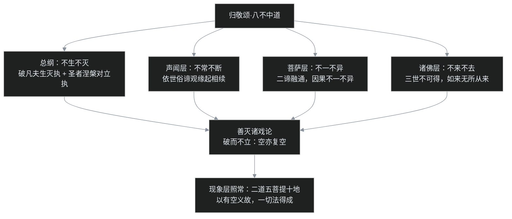

# C06（下）｜龙树的空（下）：八个"不"字，和一个死于辩论的接班人

[上篇](/post/54.html)讲了龙树的工具：无自性、二谛、三是偈。但一个问题悬着没解决——**工具到底怎么用？**"一切法无自性"是结论，可当时印度各派论师手里谁没有一套结论？数论有自性，胜论有极微，说一切有部有"法体三世实有"，方广道人有"一切皆空"。龙树靠什么把这些主张一个一个拆掉，还不用自己再建一套？

答案在《中论》开篇的一首礼佛偈里。后来的人不叫它礼佛偈，叫它"**八不偈**"——八个否定词，是整部《中论》的总目录，也是中观派的全套手术方案。

这一篇讲四件事：八不是怎么"破"的、破的标准是什么；龙树用这把尺子怎么收编吵了几百年的部派三门；从初发心到成佛的修行地图长什么样；以及龙树最能打的弟子提婆——一个赢了所有辩论、最后死于辩论的人。最后回答一个乍看像找茬的问题：阿含明明说"苦空无常无我"，大乘怎么敢说涅槃是"常乐我净"？

本篇对应第 13 讲（兼第 33 讲重录版）。

## 一、归敬颂：《中论》的扉页就是全书

罗什译《中论》第一篇《观因缘品》，正文还没开始，先以一首偈顶礼佛陀：

> 不生亦不灭，不常亦不断，
> 不一亦不异，不来亦不出。
> 能说是因缘，善灭诸戏论，
> 我稽首礼佛，诸说中第一。

前两句就是"八不"。四对范畴，八张否定票：

- **不生不灭**：事物没有"从无到有"的自性生，也没有"从有到无"的自性灭；
- **不常不断**：没有固定不变的持续，也不是断灭成零；
- **不一不异**：因与果、此与彼，不是同一个东西，也不是互不相干的两物；
- **不来不去**（"不出"即"不去"）：没有谁从别处"来"进这副身心，解脱时也没有个谁"去"到别处。

这八张票不是随便投的。生灭、常断、一异、来出，是当时印度各派形而上学争论的全部基本盘——世界怎么产生？灵魂和身体是一是异？因果是常还是断？谁在轮回、谁得解脱？任何一派的理论，落点都在这八个字的某一端。龙树的策略是：**不跟你争论哪一端对，直接检查这些端点本身成不成立。**

后面两句更能看出龙树的意图：佛宣说因缘（缘起），目的是"善灭诸戏论"——prapañca，概念的增殖游戏。语言一动，实体化就开始：一说"我"，就好像有个我在；一说"涅槃"，就好像有个叫涅槃的房间可以入住。八不是止啼法，先让这些问题本身停下来。

还要注意这是"**归敬**"：龙树没有把这套方法的发明权归给自己，而是礼赞"能说是因缘"的佛陀。龙树自认在做的，是把阿含经里缘起教法的深层逻辑显题化——这与 [C05（上）](/post/52.html) 的立场一脉相承：中观是"破"，但破的依据是佛说，不是自创新说。

## 二、四组八不，和三个修证层次

逐个看四组在破什么。

**不生不灭，是总纲。**当时解释因果主要两派：一种主张果已经含在因里（数论的"因中有果"，所以只是"显现"），一种主张果和因完全不同（胜论的"因中无果"，说一切有部讲外缘生果也属这一路，所以是"新生"）。龙树在《观因缘品》里逐一检查：自生矛盾，他生矛盾，共生矛盾，无因生更矛盾——四种"生"都不成立。《心经》里"不生不灭不垢不净不增不减"，就承接这个总纲。要破的执着也分两层：凡夫执"世间生灭"为实，圣者出了轮回，又执"生死/涅槃"为一对真实的对立。不生不灭同时破这两层。

**不常不断，破的是本体化的时间。**外道的创造论是常见（有个永恒的造物主或自性），顺世论是断见（人死如灯灭）；[C03](/post/50.html) 讲过，这两边佛教都不站。值得注意的是课程里把这一组放在**声闻层的中道**：依世俗谛观察缘起，现象上分明有刹那生灭、有相续，既不能说恒常，也不能说断灭。

**不一不异，破的是本体化的关系。**它直接回应 [C03](/post/50.html) 的老大难：造业的和受报的是一还是异？五蕴和"我"是一还是异？前世和今生是一还是异？答"一"，业就乱（造业即受报，不用相续）；答"异"，业就断（别人造业你受报）。龙树的答案是"因缘和合，我空，施设假名"：**不一也不异**——这正是二谛融通，课程里把它放在**菩萨层的中道**。

**不来不去，破的是本体化的运动。**《中论》有专门的《观去来品》：已去之处无去，未去之处无去，离开已去未去，也找不到"正在去"。三世（过去、现在、未来）里都找不到一个实有的"去"。这一组课程里放在**诸佛层的中道**：经中说过去现在未来皆不可得，《金刚经》解释"如来"二字正是"无所从来，亦无所去"——佛的境界里，连"谁从凡夫地来、往佛地去"的运动执都消融了。

于是四组八不配出三个层次：

| 层次 | 中道 | 所破 |
|---|---|---|
| 声闻 | 不常不断（世俗缘起的正观） | 常见、断见 |
| 菩萨 | 不一不异（二谛融通） | 一异两种实体化 |
| 佛 | 不来不去（三世不可得） | 来去的运动执 |
| 总纲 | 不生不灭（贯穿一切层） | 生灭执，凡圣双层 |

不是歧视性分级，而是所破对象的粗细不同：先破最粗的"世界恒常/人死断灭"，再破细的"自他因果是不是同一体"，最后破最细的"有个谁在修行道上移动"。

## 三、破而不立：拆完不许盖新楼

八不最特殊的地方，是它**只破不立**。

一般论辩的赢家逻辑是：你的 X 错，我的 Y 对。龙树拒绝提供 Y。《中论》全论没有一章正面宣布"世界的本体是 Z"——因为在龙树看来，"世界的本体是什么"这个提问方式本身就预设了本体存在。空不是本体："空"也空。[上篇](/post/54.html) 引过《观行品》那首重偈：佛说空，是为了遣除一切见；谁把空本身执成一种新见解，这种人不可救药。

这是中观最难、也最容易被误读成诡辩的地方。龙树的回应（《回诤论》展开）大意是：我没有"命题"，所以你无法用逻辑反证我；我不是在主张"一切事物不存在"，我只是指出你的命题无法成立——指出绳不是蛇，并没有宣称绳"不存在"。

用程序员熟悉的话说：这不是又写了一个服务去替换旧服务，而是一次**只删不建的清理**——删掉对底层实体的假设之后，上层功能（因果、修行、解脱）原样运行，而且跑得更顺。这也正是上篇那个反转命题的底气：**以有空义故，一切法得成。**

## 四、统一者出手：部派三门怎样各堕一边

工具备齐，看龙树怎么收拾 [C04](/post/51.html) 留下的部派乱局。龙树在《大智度论》里不按部派标签、只按方法论，把当时的义理系统归为三门：

| 三门 | 方法与代表 | 特长 | 若没有般若，会堕入 |
|---|---|---|---|
| 阿毗昙门 | 分析法；上座部系各论藏，法相、自相共相辨析极细 | 次第清楚、可操作性强 | **有**：越分越细，把每个分析单元执成实体（如"法体三世实有"） |
| 空门 | 依阿含义理谈空的部派；方广道人一路 | 弹性大、不滞着 | **无**：坐在"空"上否定因果戒律，抓不到重点还不自知 |
| 毘勒门 | 综合法；传说属大众部，《鞞勒论》未完整传世 | 真假、真俗都谈，视野广 | **有无**：两边都知道，但融不通、汇不起来 |

注意龙树的判语很厚道：三门本身**都是佛法**，"入此三门，则知佛法不相违背"——问题不出在门，出在进门的人手里少一样东西：般若波罗蜜。原话大意是：若不得般若波罗蜜，入阿毗昙则堕有，入空门则堕无，入毘勒则堕有无。

这是一个很现代的洞察：**错误往往不在材料，而在处理材料的视角高度。**分析法没有错，错在把分析结果实体化；谈空没有错，错在拿空否定现象；兼容并包也没有错，错在缺少一个能贯通的更高层抽象。龙树提供的高度就是"一切法无自性"：站到这一层往下看，三门不是三个宗派，是同一张地图的三个局部——阿毗昙在讲世俗谛的精细结构，空门在指向第一义，毘勒门在尝试两者并陈。统一者的工作不是判谁出局，是换一个让所有局部各安其位的坐标系。

## 五、修行地图：二道、五菩提、三智

讲完"见"，还得回答"修"——光破不立的人，自己怎么成佛？龙树在《大智度论》《十住毗婆沙论》里给了完整地图，[C05（下）](/post/53.html) 的三阿僧祇劫是时间轴，这里是道次第轴。

**菩萨道分两段：**

- **般若道（前六地）**：修六度——布施、持戒、忍辱、精进、禅定、般若。前五度是增上学：持戒（第二地）、忍辱精进（第三、四地）、禅定（第五地）层层增上，到第六地现前般若波罗蜜，能像阿罗汉一样断尽根本烦恼（明心菩提）。戒生定、定发慧的老结构，和 [C02](/post/49.html) 的三学完全同构，只是戒在这里是菩萨戒、格局是自他兼济。
- **方便道（七、八地以上起）**：得**无生法忍**之后，修方便、愿、力、智四度。此位起称"出到菩提"，表面是在生死里度众生，实际功课是断**习气**（尘沙惑）——根本烦恼断了，习惯性的反应残留还在，[C05（下）](/post/53.html) 说三阿僧祇劫三分之二时间花在这上面。度众生时增长的善巧经验，凝成阿罗汉没有的那种智慧。

**智慧也分三种**（《大智度论》）：一切智（知一切法共相——空，根本智，声闻也有）；道种智（知一切法差别相、度化众生的方便，后得智，惟菩萨道中有）；**一切种智**（共相差别一时圆照，惟佛具足）。佛称"两足尊"：福德与智慧两足，智慧里又是根本智与方便智两足。

**五种菩提**把全程串成一条线：初发心菩提 → 伏心菩提（修六度渐伏烦恼）→ 明心菩提（般若现前、断尽根本烦恼）→ 出到菩提（无生忍以上，方便度生、断习气）→ 无上菩提（十地圆满，习气亦尽，证无上正等正觉）。十地圆满的等觉菩萨叫**补处菩萨**，成佛只差一次降生的因缘——如今在兜率天候补的那位，就是弥勒。

所以"破而不立"只破形而上学，从不破因果修行：恰恰相反，整个十地体系就是"现象层精进"四个字的展开。不依世俗谛，不得第一义。

## 六、一个程序员类比：用"八不"看一个老系统

每篇一个类比。这次试着拿八不去看一个维护了八年的单体系统——"它到底还是不是原来那个系统？"这是每个接盘程序员都问过的问题。

- **不常不断**：代码天天改，没有一版是"原样"（不常）；但业务一天没停、数据连续、域名没变（不断）。说它"还是老系统"或"已经不是老系统"，都是错的——有版本相续，无固定自体。
- **不一不异**：去年拆出去的订单服务和老库里的订单表，是同一个东西吗？说"是一"，部署、进程、数据库都不同；说"是异"，同一份业务契约把两边焊死，谁也不敢单独改字段。不一不异：施设一个"订单域"的假名，因缘关系尽在其中。
- **不生不灭**：没有哪次发版叫"新系统诞生"——上线是灰度的，流量百分之一、百分之十地切进来；也没有哪天"旧系统死了"——旧进程逐个摘流量下线，最后一台虚拟机关掉时无人悼念。只有缘起的聚散。
- **不来不去**：线上故障时，"问题从哪来的？"排查日志会发现，没有哪个请求"带来"了故障——流量、配置、依赖、数据状态在某刻聚合，它就显现；回滚之后它也没"走"到任何地方，只是条件散了。请求是全链路事件，不是会"进出"服务器的小人。

拿这四组问完，"是不是同一个系统"这个形而上学问题自己就蒸发了，而真正有用的问题浮现出来：**哪些条件在、哪些关系断了、下一步该调整哪个因缘。**八不的作用一模一样——它不是世界观答案，是让坏问题消失的技术。

不懂技术也能用一句话带走：八不干的事，就是把"它到底还是不是原来那个东西"这种争不出结果的问题关掉，改问"现在哪些条件在、哪些关系断了、该调哪一环"。

照例戳洞：第一，这个类比只描述"理解方式的转换"，佛教的八不是禅观所缘，要按戒定慧亲证，看完架构说明不会得无生法忍；第二，系统虽无自性，但有明确的作者、有设计文档、有责任人，缘起网络没有造物主也没有总架构师——[C02](/post/49.html) 那条 trace 的老边界，这一篇依然不越。

## 七、吵架现场："不生"的话，修行还有用吗？

这是从龙树在世问到今天的问题，反方一开口就很致命："你说不生不灭——凡夫难道不是'生'了吗？烦恼不是要'灭'吗？若一切不生，布施持戒生什么善果？成佛又成的是什么？"

龙树在《观四谛品》里的回应前面引过一半，这里补全逻辑：**八不否定的是"自性的生灭"，不是"缘起的生灭"。**

- 如果善果"有自性"地生，它必须已经在布施里恒常存在，修不修都在，修行毫无意义；或者它和布施完全无关，修了也白修——恰恰是实体论杀死修行。
- 正因为果"无自性"地从因缘生（条件聚合、相续成熟），布施、持戒、观空这些**条件**才有效力，凡夫才能"变成"佛。

所以"不生不灭"不是世界说明书，是修行有效性的背书：可变，所以可修；没有固定剧本，所以努力算数。反方之所以误读，是把"否定自性生"听成了"否定现象生"——[上篇](/post/54.html) 那个"进程没有本体但真的会死"的例子，防的正是这一滑。

## 八、提婆：《百论》、辩场，和一把藏在床下的刀

学派不是龙树一个人建成的。首席弟子**提婆**（Āryadeva，3 世纪），师子国（今斯里兰卡）人，相传本在师子国出家，后渡海赴印度从龙树改学大乘——师子国当时已是 [C04](/post/51.html) 分裂树上那支赤铜鍱部一系的地盘，只是早期传记没点宗派名，这层关系只能存为推测。

传世作是《百论》：全论百偈（四百句），罗什译本分十品，短兵相接，专门破斥外道与异部；另有《百字论》一卷，藏传保存完整的《四百论》，汉地则有玄奘译《广百论本》（《四百论》的后半部）。龙树的风格是体系化推演，提婆的风格是短促对攻——每个流行命题来一刀，刀刀对关节。提婆一生的主要工作方式是**行脚辩论**。古代印度的辩场不是学术会议：输方要带整个僧团归顺胜方，有的对赌直接押上性命。提婆几乎赢了所有辩论。

结局也因此而来：一位屡辩屡败的外道，道理上说不过，换了手段——传说这名外道趁提婆独处时持刀行刺。据罗什译《提婆菩萨传》《付法藏因缘传》一类的传记，提婆遇刺后没有怨恨，反而为凶手说法：身体本如瓦石、无自性可害，动手的人也是被烦恼驱使；又让闻讯赶来的弟子不要报复，随后示寂。罗睺罗跋陀罗接过法脉继续弘传，龙树—提婆—罗睺罗三代，中观学派至此立住；罗什后来把《中论》《十二门论》《百论》一并译入长安，"三论"齐备，成为隋唐三论宗的远源。

叶扬读到这段停了很久：一个把"破执"讲到极致的人，死于被情绪操纵的执行者。辩论能在道理上赢，却不能保证对方心服——**理性的胜利有边界，这是提婆之死比《百论》任何一偈都更刺眼的注脚。**但反过来说，遇刺时还在说法，又是"烦恼即菩提"四个字最沉重的演示：杀局现前，觉性可以不切换成仇恨。

## 九、常乐我净：果德视角，和两种颠倒

最后收一个账。熟悉阿含的读者会卡住：经里反复说世间是**苦、空、无常、无我**，到大乘涅槃学，怎么反过来赞叹涅槃"**常、乐、我、净**"？这不是当面打架？

龙树一路的解法是先分清"在说谁的状态"：

- 凡夫位上，五蕴身心确实无常、苦、无我、不净；把这个状态看成常、乐、我、净，叫**四颠倒**，是轮回的根源；
- 佛果位上，法身无变无迁所以**常**，寂灭所以**乐**，离"我/无我"两边、自在无碍所以**我**（这是超越我执的"大我"，如来藏学后来的发挥都从这里接），无杂染所以**净**——这是**涅槃四德**；到了佛果位还拿苦空无常去描述，反而是另一种颠倒。

同一组词，方向相反，因为所指的对象不同：一个是有漏身心的现象实况，一个是烦恼永尽的果德实况。二谛框架在此第三次显示用处——"打架"的不是经教，是没分层的读法。这四德后来成为《大般涅槃经》如来藏思想的重要入口，那是 C08 的地界，这里只埋路标。

## 十、叶扬的卡壳角

**卡壳一：八不起初读着像抬杠。**"不生不灭"听着就是"这也不对那也不对"的文字游戏。后来在一次排查线上事故时叶扬突然懂了——组里为"这算不算重构""新服务是不是原来的服务"吵了半小时，没有任何信息量；改成问数据怎么迁、流量怎么切、契约谁维护，五分钟出结论。八不就是两千年前的那次"把伪问题关掉"。它不是消极，是把投在坏问题上的全部算力释放出来。

**卡壳二："破而不立"其实是极高的立论门槛。**刚开始觉得龙树占便宜：只拆楼不盖楼，谁不会？细读才发现，不许建实体的约束极苛刻：你要在"不承诺任何本体"的条件下，让因果、修行、佛果全部照常成立。允许假设一个实体（神、我、法体）来兜底，系统马上"自洽"，但那是赖皮。空手接住全部现象，才是难的部分。

**卡壳三：阿含与大乘的关系，印顺的一句收束让整盘棋落定。**阿含的核心是"离爱"——离对个体自我的执取（我爱、我执），成就的是断尽根本烦恼的解脱；大乘的核心是"离见"——还要离观念上的执取（我见、法执），包括"解脱了"这个观念本身，成就的是双断二执、无所得的佛菩提。两者不是两套法，是同一条道的两个路段：前者断现行，后者连习气和能断所断的对立一起断。读到这句时，[上篇](/post/54.html) 的二谛、这一篇的八不、[C05（下）](/post/53.html) 的四甚深，在叶扬脑子里第一次合成了一张图。

## 十一、一张图、两张表、一组术语

**部派三门表**已见第四节；**修证层次表**已见第二节。

**本篇术语：**

- **八不**：不生不灭、不常不断、不一不异、不来不去（出），《中论》归敬颂，破一切实体化的四边
- **戏论（prapañca）**：概念的增殖游戏——语言一动就把名相实体化；缘起法的作用是"善灭诸戏论"
- **破而不立**：中观只指出命题不自洽，自身不提供任何本体主张；"空"也空
- **三门**：阿毗昙门（分析→无般若则堕有）、空门（→堕无）、毘勒门（综合→堕有无），得般若则皆是佛法
- **般若道 / 方便道**：前六地修六度断根本烦恼；八地以上无生法忍，方便度生兼断习气
- **三智**：一切智（共相空，根本智）、道种智（差别相，方便智）、一切种智（佛，一时圆照）
- **五种菩提**：发心→伏心→明心→出到→无上
- **无生法忍**：忍可印证诸法不生不灭，七、八地菩萨所得（位次异说并存），小乘涅槃与大乘涅槃的分水岭之一
- **补处菩萨**：十地圆满的等觉菩萨，候补佛位（当今补处为弥勒）
- **涅槃四德**：常、乐、我、净——佛果法身的果德；对凡夫身心执常乐我净则是四颠倒
- **提婆（Āryadeva）**：师子国人，龙树弟子，《百论》《百字论》《四百论》，辩破外道，遇刺而逝；法脉传罗睺罗跋陀罗

至此 C06 两篇合起来，龙树的中观就齐了：理（二谛、无自性）、法（八不）、统（三门）、道（二道五菩提）、人（龙树、提婆）。三系地图里"破"的这一支讲完，下一篇 C07 转入"立"的一支：四世纪的笈多王朝，无著、世亲兄弟为什么要"立"——阿赖耶识、三性三无性、转识成智，唯识学怎么把 [C03](/post/50.html) 那个"没有 id 的数据库"问题，用一套存储层模型正面回答（对应第 14–16 讲与第 35 讲重录版，可能拆上下）。

> 说明：本系列为个人学习笔记，讲的是公共历史知识，不引用课程字幕原文，也不代表任何宗教立场。主要参考印顺《印度佛教思想史》、平川彰《印度佛教史》与吕澂《印度佛学源流略讲》，原课程在 [B 站 BV1vewnzqEuA](https://www.bilibili.com/video/BV1vewnzqEuA/)。

