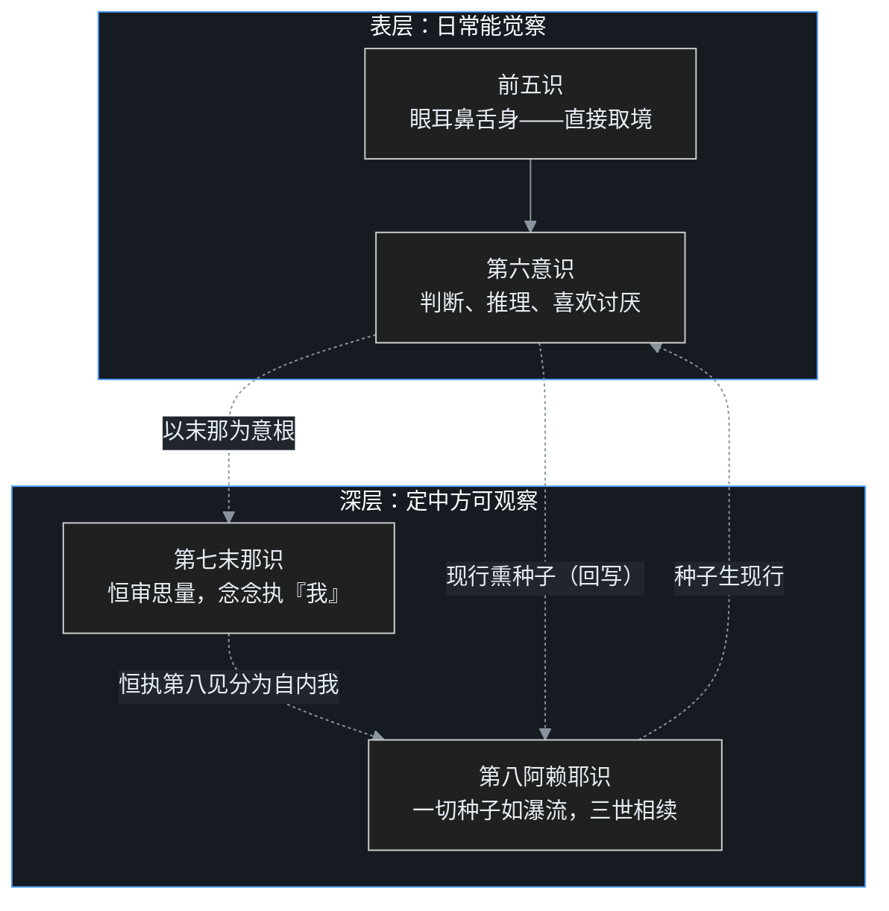

> 系列说明：这是叶扬的[印度佛教史学习笔记](/post/45.html)第七篇。只讲公共历史知识，不引用任何课程字幕原文，术语第一次出现都带大白话。上篇讲唯识学派为什么要"立"一个阿赖耶识，中篇讲三性三无性与种子，下篇讲转识成智的实修操作。

## 小白问题：龙树不是把一切都"空"掉了吗，怎么一百多年后又有人"立"回来一个第八识？

这看起来像一次明目张胆的开倒车。

龙树在 2–3 世纪把话说绝了：一切法无自性，不生不灭、不常不断，任何被称为"本体"的东西都挨了八不的刀。结果过了一百多年，到了 4 世纪，一群叫瑜伽行者的和尚不但立东西，还一口气立到了**第八识**——说在人的眼耳鼻舌身意六层认识活动底下，还藏着一个极深极细的心识，像仓库一样存着一切生命记录，名字叫**阿赖耶识**（梵文 ālaya-vijñāna，ālaya 是"宅、藏、依止处"的意思，所以又叫藏识）。

空宗刚把仓库拆了，有宗又盖了一座更大的。这是怎么回事？阿赖耶识是不是换了个名字的灵魂？叶扬学到这里时，第一反应就是这个问题。而唯识学派对这个问题的准备之充分，让人怀疑无著和世亲在写第一页之前就专门等着这一问。

## 一、一百多年后的新战局：为什么"只破不立"不够用了

先看历史现场。

龙树之后不到两百年，印度进入**笈多王朝**（约 4–5 世纪；旃陀罗笈多一世约 320 年开国）。这是印度教语境里的"黄金时代"，文化繁荣，但对佛教来说意味着一件事：**老对手缓过来了**。婆罗门教在这几百年里大规模升级，学佛教整理经典、建寺院、搞论辩，改头换面成了后来的印度教。它手里有两件佛教很难正面碰的大众级武器：

- **常住灵魂（梵我 ātman）**：每个人生命深处有一个恒常不变的真我，修行就是回归宇宙本体（梵我合一）；
- **种姓定命**：灵魂生生世世带着固定身份，婆罗门永远是婆罗门。

你跟一个在这个观念里泡了一辈子的人开口就是"一切法空、什么都没有自性"，对方大概率听两句就走了：既听不懂，也不想懂。

对内，龙树的药也出现了副作用。[C06（上）](/post/54.html)讲过的**恶取空**——把"无自性"读成"什么都没有"——在龙树身后越演越烈：既然修行也无自性、成佛也无自性，那不如躺平。这是断灭见，是龙树生前最怕的误读。

瑜伽行派就是带着两副担子上场的：**对内，给恶取空打补丁**（怎么打，中篇细讲）；**对外，给"生命到底怎么相续、又怎么变迁"造一个比灵魂更好用的模型**，让泡在灵魂观念里的人有台阶走进来。这副担子，就是阿赖耶识。

## 二、"虚妄"不是"虚假"：先校准这个词

瑜伽行派又叫唯识学派，印顺法师给它起过一个副标题，叫**虚妄唯识论**。这个"虚妄"两个字，是入门第一个坑。

虚妄不等于虚假。课程里老师反复掰正这一点，叶扬觉得很要紧：

人会被视错觉骗——两条一样长的线，两端加两个方向相反的箭头，看起来就一长一短。这说明眼睛给的报告**不全真**。但"不全真"不是"全是假"：眼睛大体上仍在提供有效信息，否则人连门都出不了。虚妄的准确意思是**可以出错、可以被纠正**。

这句话反过来非常有劲：**心识既然能被骗，就说明它也有认清的能力**——你若根本没有"看清"的功能，怎么知道刚才被骗了？同理，心识既然能起烦恼、能制造轮回，它也就有不起烦恼、觉悟解脱的能力。生死轮回是心识干的，清净解脱也得是同一套心识干的，否则修行无从谈起。

这也定下了两派的工作方式：

- **中观**走"超越"路线：看穿相是假名，离相、破相，烦恼是假象，不必跟它纠缠；
- **唯识**走"转化"路线：承认这套会被骗的认识机制真实地在运转，然后在它内部动手——转念、转识，把染污的部分一点点转成清净。

一个说"别认真"，一个说"可以改"。所以这一派不叫唯识"学派"而叫瑜伽**行派**：它的大半理论不是逻辑推出来的，是一批禅修者在深定里观察心识怎么运作、逐层记录下来的。同期印度社会正流行瑜伽禅修，梵文称修禅者为 yogācāra。派名通行的说法得自《瑜伽师地论》，也恰好呼应了当时的瑜伽禅修风气，两种解释并不冲突。

## 三、三位主角：弥勒、无著、世亲

瑜伽行派的创立，传统上归于三个人。

**弥勒**（Maitreya）：排在最前。但"弥勒是谁"本身就是一桩公案，因为这个名字同时属于一位佛教徒人人皆知的大人物——现在兜率天内院、将来下生成佛的**未来佛弥勒菩萨**。无著（Asaṅga，约 4 世纪）所传的教法，传说就是夜里以神通上升兜率天，听弥勒亲讲，白天回人间转述的。汉传瑜伽系根本大典《瑜伽师地论》，署名就是"弥勒说"。

**无著**：学派真正的人间奠基人，相传先在部派佛教出家，因对旧教义不满足，多次上山求法，最后成为弥勒教法的集大成者。

**世亲**（Vasubandhu）：无著的弟弟，汉传传统说为同母兄弟，藏传传承亦同此说。据后世传记（真谛译《婆薮盘豆法师传》一系），世亲起初精研说一切有部教义，造《阿毗达磨俱舍论》——这部论虽以有部学说为底本，却大量吸收经部立场、反过来批评有部，本身就是小乘论书的巅峰；世亲还曾放话批评大乘。无著托人捎话、又安排世亲听闻大乘经论，世亲听完大悟，说自己过去用舌头毁谤大乘，如今恨不得割掉它。无著拦住弟弟：割舌有什么用？你这张舌头能毁谤，也能弘扬。世亲后来成为著论等身的唯识大师。

三个人里最微妙的是弥勒。历史上到底有没有一位**人间的**弥勒论师？历来有三种说法：

1. 就是兜率天的当来下生弥勒佛，凡有疑难，修行人可入定升兜率请教（汉传此类传说不少，近代虚云老和尚被打成重伤、昏死中魂游兜率听法是著名一例）；
2. 当时印度北方有一位**法名叫弥勒的上座**，门下持"般若经是不了义、解深密经是了义"的立场；
3. 另有一位被尊称为弥勒菩萨的禅修导师，所传的禅观法与《瑜伽师地论》的四种所缘（禅修所缘境的四分法）完全吻合。

印顺法师的考据倾向于把第 2、3 种合并：在未来弥勒信仰盛行的北方，确有一位被信众尊为"弥勒菩萨"的人间大德，造论传法，经无著、世亲发扬光大。天上来的弥勒与地上的弥勒，在传说里渐渐合成一人。叶扬的态度是：史归史，信归信——玄奘后来在那烂陀寺实实在在接上了从戒贤到长安的学脉，这一点不依赖弥勒的户籍地址。

## 四、一套书撑起一个学派

唯识这一派的"产品矩阵"，规模远超中观。

**根本经典是《解深密经》**（玄奘译，五卷八品）。经名的意思是：佛的智慧太深奥、隐密，这部经负责把它解释疏通。经里有个著名的自我评价：佛说法分三个时期，初时讲四谛（偏"有"），第二时讲般若一切法空（偏"空"，空得太简略，钝根人容易读歪），**第三时讲《解深密经》，把空和有两边都说周全，叫"了义"**。

"了义"就是话说透了、讲详尽了；"不了义"是话只讲了一半、要靠人补。注意这个分寸：**不了义不是"不究竟、低一等"**，而是"对当时当机的人说到那个程度刚好"。唯识人说般若是不了义，意思是"那份说明书太简略，我们补一份详细版的"，不是说般若错了。这是教内著名的望文生义坑。

**论的核心是一百卷的《瑜伽师地论》**。"瑜伽师地"就是"禅修者的地盘"——像农民需要土地才能耕种，修行人需要一套完整的修行基础。全书分五部分：

| 部分 | 内容 | 卷数 |
|---|---|---|
| 本地分 | 核心中的核心，分**十七地**，把禅修中心识的状态从浅层到深层讲透（八识、寻伺、有心无心、定心位/散心位……），按境、行、果组织 | 1–50 |
| 摄抉择分 | 对《解深密经》的深入抉择 | 51–80 |
| 摄释分、摄异门分、摄事分 | 后三部分大量解释《阿含经》与禅修法 | 81–100 |

叶扬注意到一个细节：百卷大论里有近二十卷在解释阿含。这派从来不是空中楼阁，声闻藏是它的地基，大乘唯识是盖在一楼上面的二楼。

这部书还直接改写了中国历史。唐三藏玄奘西行的**头号目标**就是它——玄奘在国内读到的传本残缺不全，立志到佛教最高学府那烂陀寺，从当时唯识学泰斗戒贤论师受学全本。后来的故事大家都知道了：贞观年间玄奘取回梵本，在长安组织译场，百卷《瑜伽师地论》全部汉译。汉传佛教八大宗派里的**法相唯识宗**（玄奘—窥基一系）就是这么来的。

三位主角的著作阵容，粗粗列一张表：

| 人物 | 代表作 |
|---|---|
| 弥勒（托名/传承） | "弥勒五论"：《瑜伽师地论》《辩中边论》《分别瑜伽论》《辩法法性论》《现观庄严论》（汉传课堂口径；汉藏五论名单有出入，如藏传另列《究竟一乘宝性论》而不列《瑜伽师地论》，《分别瑜伽论》无完整汉译） |
| 无著 | 《摄大乘论》《显扬圣教论》《大乘阿毗达磨集论》《大乘庄严经论》《金刚般若论》等 |
| 世亲 | 《唯识二十论》《唯识三十颂》《十地经论》，以及对《法华经》《无量寿经》《涅槃经》等的大批论释 |

世亲一个人给几乎所有重要大乘经写了注释，堪称 5 世纪的"全覆盖型作者"：《十地经论》后来滋养了华严宗，《无量寿经论》（也称《往生论》）成为净土宗的核心论典，《唯识三十颂》在世亲身后有十大论师作注，玄奘把十家注释糅译成一部《成唯识论》——这是汉传唯识学的巅峰教材。一个学派给后来的汉传各宗"供货"供到这个程度，也是少见。

## 五、阿赖耶识登场：灵魂能干的它都干，灵魂干不了的它也干

铺垫完毕，主角上场。先看它要解决的问题。

一切宗教都必须同时回答生命的两件事：

- **相续**：人死后什么东西接到下一世？为什么业力不失？
- **变迁**：人这一生明明在变，习惯、性格、命运都在改，凭什么？

婆罗门教的常住灵魂能解释相续（一个恒常的"我"搬家），但解释不了变迁——一个**定义上不变**的东西怎么会改？种姓定命就是这么来的，灵魂是颗写死的常量。反过来，"一了百了"的断灭见倒是痛快地解释了变迁（什么都在散），代价是否定因果、否定道德。龙树的八不（不常不断）在哲学上把问题解了，但对修行人和普通信众，一个纯否定式的答案不好上手。

瑜伽行派给出的正面模型是阿赖耶识：

> 每个人的心识除了眼耳鼻舌身意这六层，底下还有一个极深的存储层。身口意的一切活动都会作为记录沉淀进去，这些记录叫**种子**；这一世结束时，物质身体散了，**这层深层心识带着全部种子相续到下一世**，像瀑流一样不断。种子的总体格局决定下一期生命的形态：人的业习成熟就生而为人，旁生的业习成熟就入旁生道。

这个模型同时拿下两端：

- **相续**：它跨越肉体死亡，过去、现在、未来三世不断——业力记账有了地方；
- **变迁**：它内部的种子刹那生灭、有增有减，今天的行为就在改今天的账——命不是定的。

所以中观那句"不生不灭"，在唯识这里被展开成一体两面：**相续的一面说不生不灭，变迁的一面说生灭无常**；种子念念生灭、善恶消长，却又相似相续——不是同一个，也不是断成两个。C00 里预告过的"一个不断被读写、又不断被写入内容改写的存储层"，就是它。

那这套深层心识到底分几层？《解深密经》原文很克制，只说"六识之外有更深层的心识，名叫阿赖耶，也叫阿陀那（ādāna，执持义）"，没有排编号（此经《心意识相品》即阿陀那识偈的出处）。后来的瑜伽论师依禅修经验细分：深层里恒常执着"我"的那一层立为**第七末那识**（manas，意，思量义），仓库层立为**第八阿赖耶识**；中间一度还分过第九识（庵摩罗识，白净识）乃至第十识，分到底发现只是同一件事的过度切分，最终主流退回八识。

最能说明阿赖耶不是灵魂的，是《解深密经》里佛陀自己的态度。经中有一首偈：

> **阿陀那识甚深细，一切种子如瀑流；我于凡愚不开演，恐彼分别执为我。**

翻成白话：这个执持识太深太细，里头的一切种子像激流一样刹那生灭、奔流不住；我不对凡夫和二乘人详细讲它，怕凡愚望文生义，把它抓成一个"我"。

——佛陀亲自给阿赖耶识贴了防灵魂标签。[C03](/post/50.html)里那个"没有 id 的数据库"之问，到这里有了经里的回音：**这层存储里没有主键叫"我"**。

## 六、一个程序员类比：一份每一世都在持续训练的模型权重

C03 叶扬用事件溯源讲过"无我"：没有一条固定的用户记录，只有一连串事件，"我"是这些事件的实时投影。唯识学现在补上了当时没讲完的下半截：**事件存哪儿？系统重启之后谁还在？**

答案像极了今天训练机器学习模型的工作方式：

- **阿赖耶识就是那份模型权重文件（checkpoint）**。进程（这一世的身体）可以被杀掉，但权重落盘保存；新进程（下一期生命）启动时加载它，行为倾向、偏好、反射模式原封不动地续上——这是相续。
- **权重里没有一个叫"我"的神经元**。你打开 checkpoint 翻遍全部参数，找不到任何一个神经元是"主人公"，可整套网络的倾向、习气、能力又是真实而稳定的——这是无我，也是"恒转如瀑流"。
- **每一次推理结果连同新数据回灌训练，权重就被改写一次**。善的行为、恶的行为都在做梯度更新，文件每一刻都和上一刻略有不同——这是变迁，是"不常"；但它绝不会在两次更新之间断裂消失——这是相续，是"不断"。
- 种子是**本有**（过去世带来的预训练权重）还是**新熏**（这一世 fine-tune 出来的）？唯识里有三家说法，主流答案是"新旧合生"：两个都有。这也是日常经验——同一家的孩子天性不同（本有），但家风会让一家人越来越像（新熏）。种子的细节中篇再展开。

对照婆罗门教的灵魂，区别一目了然：灵魂是代码里写死的常量（`const SELF = 'brahmin'`，只读、不可改），阿赖耶是持续训练中的权重（没有冻结，每一 batch 都在更新）。一个导向定命，一个导向"可训练、可成佛"。

不写代码的读者记大白话版本：**阿赖耶识像一份带得走、又改得动的"习惯总档案"——你每一世的所作所为都在往里面写，这份档案也跟着你走下一世，但档案里没有一页写着"这就是我"。**

按惯例，叶扬自己戳三个破洞：

1. **权重是物质性的文件，阿赖耶不是大脑里的东西**。模型参数存在显存和磁盘上，是色法；唯识的阿赖耶是功能性的施设，不定位在心脏或皮层（定位了反而是另一种"我"）。
2. **这个类比把 AI 的硬问题原样暴露了**：模型没有主人翁，只有前向计算——唯识会追问：对，所以人凭什么觉得自己有？末那识那一章正好接这个问题（下篇讲）。
3. 老破洞再来一遍：**工程系统有设计者、有训练师，缘起没有造物主**。权重文件背后有工程师，阿赖耶的瀑流是无始以来的因果运动，没有第一因，也没有人在机房值班。

## 七、吵架现场："这不就是灵魂改个名？"

这是任何唯识讲师都躲不掉的第一问，替外道和现代读者一起问出来。

**问：你们佛教徒绕什么弯？阿赖耶识三世相续、三世因果、带着习气去投胎，这不就是 ātman 换了个梵文马甲？**

答：马甲论恰恰把两边最关键的差别遮掉了。至少有四条分界线：

1. **常与无常**。灵魂的定义是"恒常、不变、单一"；阿赖耶的定义是"刹那生灭、如瀑流、是种子和现行的集合"。它更像一条河而不像一块玉——可以指着它说"这条河去下一世"，但此刻的水没有一滴停住。
2. **一与多**。灵魂是统一的主体；阿赖耶是仓库**里的功能关系**，能藏、所藏、执藏全是施设，连"仓库管理员"都是末那识错认出来的，没有总指挥。
3. **定命与可改**。灵魂论推出种姓与命定；阿赖耶的核心卖点是**账随时可改**——这正是"修行"二字在唯识体系里的全部依据。
4. **终局相反**。吠檀多的修行终点是发现"我就是梵"，回归真我；唯识修行的终点是**阿赖耶识这个染净混合的状态整体转依**（下篇详讲），连"藏识"这个名字都要退役。一个要亲证真我，一个要彻底转掉对"我"的误认——连大结局都是反的。

再补一记来自经中的重锤：佛陀说《阿陀那识甚深细》那首偈时，理由就是"恐彼分别执为我"——**怕的就是听众把阿赖耶听成灵魂**。如果这个识本来就是灵魂，佛何必专门防这一手？

当然，辩经现场不会这么轻易结束。反方还可以继续："一条河也得有个河道吧？相续总得有个载体，载体不就是我？"——唯识的回答是中篇的主菜："载体"这个想象本身，就是三性里的**遍计所执**——语言给集合贴了个标签，人就把标签当实体（C03 车喻的加强版）。要破这一层，得请出三性三无性。

## 八、卡壳角

**卡壳一：人间弥勒的考据，会不会败坏浪漫？** 叶扬承认，初读到"弥勒可能是北方一位被神化的论师"时，是有点扫兴的——夜升兜率、昼宣瑜伽，这个画面多美。但转念一想：宗教史里"人间的好老师被记忆抬高"和"信仰中真实受教的兜率弥勒"，本来就在两个层面运作。一个回答史料问题，一个回应修行体验，论师们自己也并存两说。把户籍问题和传承价值分开，两边都不必死。

**卡壳二：百卷地论和满屏名相的劝退感。** 本地分十七地、寻伺、三摩呬多地、五种姓……唯识的名相密度是全佛教第一，很多人把它学成本科选修课，背完术语考完试，生活毫无改变。课程老师专门为此扼腕：唯识学在今天最大的流失，就是被当成纯粹的佛学研究。叶扬的对策是先抓一根主干，其余全部后置——**主干就一句话：表层反应底下，有一个会记录、会相续、会被改写的深层存储。** 三性、种子、转识，全是这一句话的展开。

**卡壳三：阿赖耶到底"在哪儿"？** 一旦承认这个识，人就本能地想给它定位：在心脏？在基因？在脑区？唯识不给坐标。因为它是**依缘起施设的功能模型**，不是解剖发现的器官。佛陀对"世界是否有边、命与身是一是异"这类形而上学问题一向拒绝作答（著名的毒箭之喻：中箭的人不该先研究箭羽的材质）；立阿赖耶的全部理由是**修行操作需要它**——要解释习气怎么存、怎么改、业力怎么不失。能操作，模型就成立，它不承诺提供宇宙的房间分布图。

## 九、一张图、一张表、一个钩子

图已经在上面了：八识结构加上"种子生现行、现行熏种子"的回流，就是整个唯识修行论的硬件拓扑。中篇讲这份拓扑里跑的数据结构，下篇讲怎么操作它。

**本篇术语清单（按出场顺序）**：

| 术语 | 大白话 |
|---|---|
| 阿赖耶识（藏识） | 深层存储心识，记录一切行为种子，跨世相续又能被改写 |
| 瑜伽行派 / 唯识学派 | 4–5 世纪兴起、以禅修经验建立心识模型、主张"转识成智"的大乘派系 |
| 虚妄唯识 | 印顺给的副标；虚妄=认识不全真、可出错也可纠正，不是"全是假的" |
| 笈多王朝 | 4–5 世纪印度"黄金时代"，婆罗门教复兴为印度教，佛教的竞争压力催生唯识 |
| 弥勒、无著、世亲 | 唯识三祖；弥勒身份有天界未来佛与人间论师两说 |
| 《解深密经》 | 唯识根本经，把"空"讲成空有双全的"了义"教；"阿陀那识甚深细"偈出此经 |
| 《瑜伽师地论》 | 弥勒说、百卷五分，禅修全流程手册；玄奘西行的头号取法目标 |
| 末那识（第七识） | 深层里恒常执着"我"的心识 |
| 阿陀那识 | 阿赖耶的异名，"执持"义，执持种子与身体 |
| 种子 | 存进阿赖耶的行为记录/习气势能，遇缘会起现行（中篇展开） |
| 转依、转识成智 | 把八识整体从染污转成清净（下篇展开） |
| 本有 / 新熏 | 种子"先天带来"和"后天养成"两说，主流为新旧合生 |
| 了义 / 不了义 | 话说透了 / 只说到当机者需要的程度；非"究竟/不究竟"的等级判词 |

**钩子**：硬件拓扑有了，存储层里到底存的是什么格式的数据？为什么唯识敢说"外境是空、心识是有"——这话听起来简直像跟龙树对着干？答案是唯识最精密的一套数据模型：**三性三无性**，外加种子的六条运行规则。中篇见。

> 说明：本文为个人学习笔记，讲的是公共历史知识，不代表任何宗教立场。参考课程：[B站《印度佛教史》](https://www.bilibili.com/video/BV1vewnzqEuA/)第 14 讲与第 35 讲重录版；参考书：印顺《印度佛教思想史》、玄奘译《解深密经》《瑜伽师地论》。
