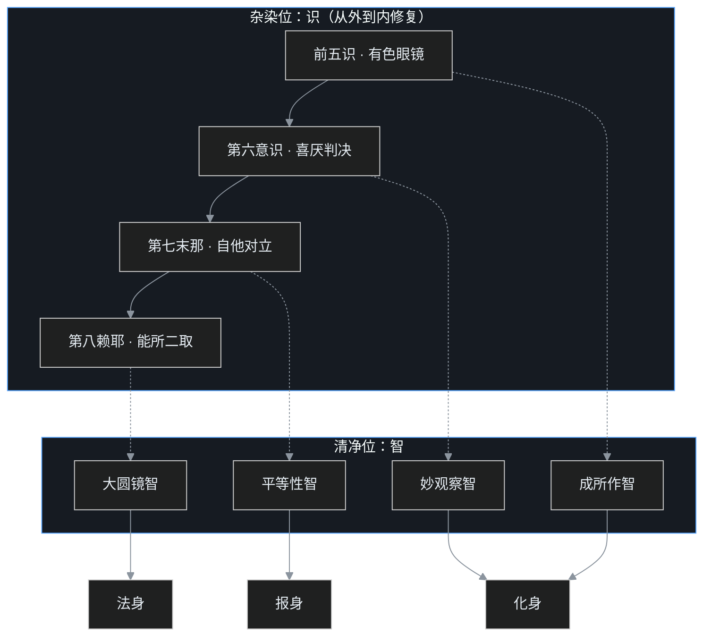

> 系列说明：这是叶扬的[印度佛教史学习笔记](/post/45.html)第七篇下篇。[上篇](/post/56.html)讲阿赖耶识为什么不是灵魂，[中篇](/post/57.html)讲三性三无性与种子，这篇讲唯识学最终要交付的东西——一套从"知道"走到"做到"的操作协议。仍然只讲公共历史知识，术语第一次出现都带大白话。

## 小白问题：道理每一条都懂，为什么被惹到时还是一秒炸毛？

学到三性、种子、阿赖耶，叶扬产生了最诚实的一问：名词考试能拿满分，下次评审会上被人当众挑错，血压照旧零点一秒拉满，散会了才开始后悔。明明知道"冒犯"是遍计所执，为什么当场做不到？

唯识的回答毫不留情：**你懂得的那些道理，住在第六意识里；让你炸毛的反应，来自阿赖耶识。**观念听懂，只是在表层贴了张便签；深层仓库里的种子一颗没改，遇缘照样生现行。[中篇](/post/57.html)那张闭环图现在要派上用场了——"知道"和"做到"之间隔着的，就是从第六识到第八识的整条写入链路。这一篇是施工图：怎样把表层的理解，一层层写进深层。

## 一、先接受前提：炸毛不是故障，是默认配置

先卸掉一层羞耻感。

凡夫的标准反应链是这样跑的：眼耳鼻舌身接收境界（前五识）→ 第六意识立刻贴标签（喜欢/讨厌、我的/别人的）→ 第七末那识的自他对立在底层加码（针对我、不尊重我）→ 第八阿赖耶识里的同类种子被点燃，情绪与身口行为齐发。整条链路在零点几秒里自动跑完，比理性思考快得多——它本来就是几百万年演化调好的生存反射，没有这套反射的人类祖先活不下来。

所以唯识修行不从"我怎么又没忍住"的自责开始。会起现行，本是凡夫位的常态，不丢人；**分水岭只在现行起来之后的下一拍**。课程里把觉察水平分了三档，叶扬觉得很适合贴在显示器边上：

- **不知不觉**：发完火都不觉得有问题，理直气壮；
- **后知后觉**：骂完了、发完了，才反应过来"刚才怎么回事"——别嫌慢，能后知后觉，已经比不知不觉高了一个段位；
- **先知先觉**：情绪升起的当下就看见它，在出口前拦住。

修行的全部技术，就是把后知后觉练成先知先觉。而练这一档，需要两种肌肉：**止**（心能静得下来、定得住）和**观**（向内看的敏感与细致）。没有止，观察还没启动行为已经冲出去；没有观，定成了枯坐，改不了任何习气。这也是为什么这一派叫瑜伽**行派**——全部理论最后都要兑现成止观作业。

## 二、协议核心：在"想"和"行"之间插一个拦截层

[中篇](/post/57.html)说过，修行的唯一作业现场是依他起——种子已经生现行了，怎么办？唯识给的操作，精确得像一份工程协议，核心动作只有一个：**在"想"和"行"之间拉开一条缝**。

注意区分两个东西：

- **想**：念头、冲动冒出来——"想骂人""想摔门"，这个是不由自主的，种子遇缘就起，凡夫拦不住，也不必为"起了念头"定罪；
- **行**：意志拍板——从心里同意这个念头那一刻起，意业已经造成；再发展下去才是话出口、手伸出去。这一步是可以拦的。

凡夫是"想"和"行"焊死在一起，念头即行为；修行就是在焊点上插一个拦截层。课程给的操作朴素到意外：**先慢下来**。想骂人，深呼吸，停几秒，过一遍大脑再开口；想动手，深呼吸，念几句佛号，再决定手往哪放。就这么简单的一个间隙，给觉察争取到了入场时间。

缝拉开之后，拦截层里依次跑四步：

1. **冷静（止）**：深呼吸、闭眼、离开现场十秒，先让交感神经降档；
2. **内观（观）**：注意力从外境收回来——不看"对方怎么能这样对我"，看"我此刻内心发生了什么"。往外计较就是落入遍计所执，往内观察才是站在依他起上作业；
3. **抉择（转）**：看清这个念头只是种子现行，不是命令。身口不执行，内心也不签字同意——不骂人、不打人、不在心里反复咀嚼仇恨；
4. **回写（熏）**：这一次"起了现行却没有造业"，当场返熏一颗"不嗔"的净种回阿赖耶。下次同类境界，净种多一分，拦截就容易一分。

四步合起来就是唯识的四字诀：**借境转识**。不躲境界——躲在禅修营里永远顺风顺水，反而看不到库存；真金白银的考题全在办公室、厨房、评论区和堵车的路上。

## 三、强忍不算数：内伤、情结，和"安忍"的区别

这里有个大坑，叶扬必须替读者踩过：拦下行，不等于把气压回肚子里。

表面不发作、心里翻江倒海，叫**强忍**。强忍的问题有两个：第一，身口虽没造业，意业仍在运行——恨还在心里演了一百遍，染种照样被滋养；第二，压久了情绪会转成内伤，从一次"情绪"沉淀成一个"情结"，像皮球压进水里、松手弹得更高（课程里用的比方）。

唯识要的不是强忍，是**安忍**：身口不造作，内里也换了看法。换什么看法？就是[中篇](/post/57.html)那套——惹人生气的"冒犯"是遍计安立的标签，愤怒本身是种子现行的缘起现象，没有一个实体在"针对我"（这个"我"还是末那的误认）。看法一换，情绪不是被压回去，是被看清之后松掉。所以流程是"先转念，再转识"：拦身口争取的那几秒，正是用来转念的；观念平时就要靠听闻、思维养成，事到临头才开始推理，来不及。

顺带回答一个常见误会：菩萨道里的布施、忍辱、利益众生，不只是道德号召，在这套协议里它是**转第七识的技术手段**——第七末那的病是自他对立，而每一次实打实的布施和换位，都在重写"我的比别人的重要"这条底层规则。技术上有效的行为，碰巧也被称为道德。

再说工具箱里的第二件。跟烦恼硬碰硬——嗔心起了修慈心、贪心起了修不净，叫**对治法**，见效直接；而菩萨道是另一条迂回路线：去帮人、去服务，在成全别人的过程里，自己多懂了几门本事、也照见了自身的狭隘，脾气在不知不觉中被磨平——课程里叫**消融法**：不与烦恼正面缠斗，迂回增上、自他兼利。第七识的自他对立，正是在一次次帮众生的过程里被泡松的。两门都是真功夫，但长期看，消融比硬对少内伤、也更可持续。

## 四、转识成智：八个识各自转成什么

把这套练习从偶一为之做成恒常，最终的果位叫**转依**——整体五蕴身心从杂染依转为清净依，转迷为悟、转生死为涅槃，也就是成佛。展开来说，是八个识各转其"识"（染污的认识形态）成"智"（清净的认识形态），共四种智慧。叶扬按"从外到内"的修复顺序列一张表：

| 识 | 病征 | 转成 | 清净后的样子 | 对应三身 |
|---|---|---|---|---|
| 前五识（眼耳鼻舌身） | 戴有色眼镜，感官报告被成见染色 | **成所作智** | 见闻觉知如实中立，该看的看、该做的做 | 化身 |
| 第六意识 | 见什么就加喜欢/讨厌 | **妙观察智** | 花就是花：形状颜色观察得清清楚楚，不再附带喜厌判决 | 化身 |
| 第七末那识 | 恒执自他、我慢我爱 | **平等性智** | 自他平等，不再事事分"我的/别人的" | 报身 |
| 第八阿赖耶识 | 能所对立、染种瀑流 | **大圆镜智** | 心如明镜：物来则应、物去不留，影像历历而镜体无染 | 法身 |

四个名字逐个说透：

**成所作智**——前五识本来是中性的传感器，红花绿叶如实呈现，问题出在后面给它"加油添醋"。成所作智是恢复传感器的出厂精度：不戴成见的有色眼镜，该做的事照样成办。

**妙观察智**——看到一朵花，凡夫的第六识零点一秒内完成"这花我喜欢/那花我讨厌"。妙观察智是把喜厌判决剥离：观察仍在，而且更细致（复瓣单瓣、红黄深浅各各分明），只是观察不再服务于对立。

**平等性智**——这是第七识的转。个体自我感是生存必需，没有它饭都让别人吃光了；但它一旦过载，就变成自私、对立、党同伐异。转成平等性，不是取消"我"，是"我和别人一样重要"。为什么要长期行菩萨道？因为自他平等只能靠一次次换位实操练进去，讲道理讲不进去。

**大圆镜智**——最深一层。第八识里能取（主体姿态）与所取（客体对象）的二元对立彻底消融，心如一面擦净的大圆镜：任何东西来了，影像清清楚楚；东西走了，镜面上不留一丝痕迹。凡夫的心是哈哈镜加留痕板，佛的认识是无染之镜——注意，镜子不是什么都不照的黑屏，正是什么都照、纤毫毕现而不粘。

三身的对应也在表里：前二智起用以度化众生，对应**化身**（如释迦牟尼八十年人间生涯所示现的老比丘身）；平等性智对应**报身**（修行果报所成的庄严身）；大圆镜智对应**法身**（无形象的真理之身）。这一配属是后世祖师依禅修经验逐层讨论定下来的：《解深密经》经文明示了化身与法身，报身、以及三身与八识的对应，则是祖师们对照讨论而成。

## 五、谁在看着"我在生气"？——四分与小矮人悖论

实修里立刻会撞上一个哲学漩涡：当"我"觉察到愤怒时，是谁在觉察？如果是另一个"我"在看着愤怒的我，那谁看着那个看着的我？这样问下去，脑内需要排一队无穷无尽的小矮人（西方哲学叫"小矮人悖论"，homunculus）。

唯识的"四分"说，正是这个问题的拆解方案。每一识的认识活动都分四个功能面：

1. **相分**：识上现起的所缘影像（被看的那一面）；
2. **见分**：能缘取、能认识的功能（看的那一面）；
3. **自证分**：对"我正在认识"这件事本身的自知——你不需要第二套系统就知道自己疼了，疼的当下自知在疼；
4. **证自证分**：对自证分的再确认。

关键在第三、第四分怎么终结无限后退：**自证分与证自证分互相证知**，像两盏灯互照，不需要第三盏灯来照第二盏。小矮人队伍到此截断——"知道自己在生气"不是脑内小人旁观，是同一个认识活动自带的自知功能。护法论师一系立四分正义，之前还有"一分""二分""三分"的各家说法，各家安立广略不同，护法一系四分最详。

这个结构对实修是直接有用的：觉察不是"再长出一个我"，而是认识活动的自证面被点亮。所以愤怒可以被"看见"而不必有一个"看见者"——这跟 C03 的车喻、跟"没有 id 的数据库"是同一个答案的不同切面：连观察者都不需要一张身份证。

## 六、三家怎么处理同一个烦恼：破、转、显

到这里可以给 C05（下）埋过的大乘三系做一次操作层结账了。同一个"被惹到"的现场，三系给出三条路径：

| 系 | 代表 | 动作 | 现场操作 | 心理前提 |
|---|---|---|---|---|
| 中观 | 龙树 | **破** | 看破：能生气的我、惹我的境、愤怒本身，无一有自性，放下 | 利根，逻辑一刀透 |
| 唯识 | 无著、世亲 | **转** | 止观拦截、看清三性、转念转识、返熏净种 | 心思细密，愿意按协议逐步练 |
| 如来藏 | 后续诸经论 | **显** | 把心识格局提到佛位：小事自然不算事——"如果我是佛，会跟这件小事计较吗" | 想象力与信愿强 |

中观的路径最短，《心经》"照见五蕴皆空，度一切苦厄"十二个字三步收工，但说明书薄，钝根人容易读成恶取空——[中篇](/post/57.html)讲过的前车之鉴。唯识的路径最长，把"看破"拆成分析与综合的细工：先**尽所有性**地分析——五蕴、十二处、十八界，一层层看全，全是缘生缘灭、并非实有；再**如所有性**地综合——在万千差别上统观空性；然后从第六识的人执，一路松到第七识的自他对立、第八识的能所二取。它笨，但每一步可操作、可验收。如来藏一路最短平快：不必跟情绪缠斗，直接把自己放到佛的格局上看小事——大学生不会跟小学生抢糖（课程里用的比方）；代价是要求很强的观想能力与信根，那是 C08 的地盘。

课程里有个很诚实的提醒：唯识学近代最大的流失，就是名相太发达，被学成了书斋里的纯学问——六义、四分、四智背得滚瓜烂熟，脾气一点没动。这篇协议要是读完只增加了知识，那是读者和作者双输。

## 七、一个程序员类比：给老系统加一层中间件

回到工程现场。有个没人敢接手的祖传单体，主链路是：请求进来 → 一堆祖传业务逻辑直接执行 → 写库 → 返回。问题是这条链路上每个函数都在直接改库，脏数据、重复提交、情绪式日志（"这单我就是要给它拒了"）遍地都是，而调用是同步焊死的，请求一进，零点一秒内全链路炸完，想干预都插不进手。

重构方案是在入口和业务层之间加一层**中间件（过滤器链）**：

- **请求照进，中间件不拦请求本身**——境界来了、念头起了，这层不负责让事件不发生（那是种子待众缘，谁也拦不住）；
- **但执行指令要过链**：第一道做**限流与冷静**（先停几秒、深呼吸，对应"止"）；第二道挂**观测埋点**（调用栈向内展开：这次愤怒是哪个种子、经哪条分支触发的，对应"观"与内观自证）；第三道是**策略抉择**（这条写请求放不放行？放行染业就写脏库，改写为净业就写干净记录）；
- **每个决策都落审计日志并回写规则库**——守住一次，拦截规则下次匹配更快，这就是返熏净种；
- 长期跑下来，下游八个老模块依次"净化"：输入模块不再带偏见（成所作智）、路由模块不再按喜厌分发（妙观察智）、权限模块不再死抠内外有别（平等性智）、底层存储从"只追加的脏日志"变成"物来则应、过即清除"的镜像仓库（大圆镜智）。

非程序员的大白话版本：**戒情绪冲动和戒酒驾是一个原理——不开车不丢人，给自己叫个十分钟的代驾（深呼吸、停十秒），等油门松了再决定走不走。**

照例三个破洞：

1. **中间件是工程师写的，缘起没有设计者**——老破洞第四次出现：协议可以有，造物主没有。
2. **中间件是同步阻塞点，止观不是冻结世界**——工程上可以让请求排队等十分钟，现实里的对境不给暂停键；"停几秒"不是让世界停摆，是在极短的刹那里完成转念，熟练度靠长年练习。
3. **中间件只改本服务，转依要转全链路**——一个服务上了拦截，下游八个模块没改照样脏。四智要八个识一起转，单靠第六意识"讲道理"，等于只给一个服务打补丁。

## 八、吵架现场："这不就是压抑情绪吗？心理学都反对压抑。"

这是唯识实修最常挨的一棍，值得正面接。

**问：你们叫人不发火、不骂人，七情六欲都憋住，不是压抑是什么？憋出心理疾病谁负责？**

答：先看唯识明确反对什么——**强忍**。这一篇第三节专门讲过：外不发作、内恨百遍，正是唯识判为有害的做法，会结内伤、成情结、日后反弹。在"强忍有害"这一点上，唯识和现代心理学高度一致，不用谁说服谁。

再看协议实际在做什么：

1. **情绪升起这一步完全合法**——想骂人不犯戒，种子现行是缘起事实，协议从不起诉"你怎么敢想"。被接纳的是情绪本身。
2. **被拦的只是行为出口，而且拦截期只给几秒**——不是终身禁言，是给觉察一个入场窗口；话想清楚了，该表达的照样表达，只是不再以泼洒的方式。
3. **内层不是压住，是看清**——安忍靠的是重新理解（标签是遍计执、愤怒是缘起、自他是末那误认），情绪被看清后自然松脱，这跟"不许哭、压下去"的压抑方向相反：一个是堵，一个是疏。
4. **结果有客观指标**——压抑的人越修越紧、易怒且自责；按转识练的人，是同类境界下引爆阈值越来越高、恢复时间越来越短、事后没有内伤。哪个是哪个，自己最清楚。

补一个容易被忽略的点：这套协议对**外境**零要求。它不要求冒犯者道歉、不要求世界公平、不要求环境变好——因为作业点从来不在外境（外境是共业，中篇说过个人改不了器世间），而在认识与外境的关系上。这不是逆来顺受：行为上该维权维权、该追责追责，成所作智恰恰是"该做的事成办"；被转掉的只是行为背后那股自他对立的火气。

## 九、卡壳角

**卡壳一："我都懂了为什么还做不到"的羞耻循环。** 叶扬卡了很久，后来发现这个羞耻本身就是末那的把戏——它把"修行"也变成了一件"我要表现好"的事，做不到就证明"我不行"，然后更沮丧。唯识的模型其实赦免了这种羞耻：懂在第六识，行在第八识，中间隔着整条要靠练习修通的链路，就像看懂游泳教程和游得起来本来就是两件事，没有谁看一遍教程就该会游泳。验收标准只有一个：下次对境时，后知后觉来得快了一点没有。

**卡壳二：四智听着像四种超能力。** 不是。四智不是开天眼，是同一套认识功能的清净形态——感官还在、观察还在、自我保存还在、照见还在，只是有色眼镜、喜厌判决、自他偏心、能所裂痕这四层"染污插件"卸载了。佛不是变成另一种生物，是把出厂自带的认识系统跑到了无bug状态。

**卡壳三：苦空无常，怎么最后又冒出常乐我净？** [C06（下）](/post/55.html)提过涅槃四德常乐我净，当时留了路标，这里正好说清翻转的条件：阿含时期佛对外道的常住灵魂与欲乐宣说**苦、空、无常、无我**——那是对凡夫位、生死位实相的如实描述，也是对治"执常乐我净"的药；但涅槃果位上，寂灭是真常、真乐、真我、真净——此常是真理不生不灭的真常，不是外道那种定命灵魂的恒常实体；到了佛位还把涅槃说成苦、说成无常，反而是颠倒。凡夫把无常当常是颠倒，解脱者把涅槃当苦也是颠倒——**药看谁吃、什么位次吃**。这一层"众生本具清净性"的思路再往前一步，就是如来藏思想，C08 的正题。

## 术语清单与收尾

| 术语 | 大白话 |
|---|---|
| 转依 | 五蕴身心整体从杂染状态转为清净状态，唯识学的成佛定义 |
| 转识成智 | 八识的染污认识形态各转为清净智慧 |
| 成所作智 / 妙观察智 | 前五识恢复中立传感 / 第六意识只剩观察、不带喜厌 |
| 平等性智 / 大圆镜智 | 末那的自他对立转为自他平等 / 赖耶的能所二取转为物来则应的明镜 |
| 法身 / 报身 / 化身 | 真理之身 / 修行果报的庄严身 / 度众所示现的身 |
| 止、观 | 心定得下来的能力 / 向内觉察的敏感细致 |
| 借境转识 | 不躲境界，拿真实对境当练习现场 |
| 安忍 / 强忍 | 看清之后松开 / 不发作但压回心里（后者唯识也反对） |
| 四分 | 相分、见分、自证分、证自证分；后二分互证，截断小矮人悖论 |
| 尽所有性 / 如所有性 | 先把一切法分析穷尽，再在差别上统观空性 |
| 破、转、显 | 中观看破、唯识转化、如来藏显发——三系对治烦恼的三条路径 |

C07 三篇到此合龙：**为什么立**（阿赖耶：相续与变迁、无"我"主键的存储）→ **世界怎么看**（三性三无性：标签空、缘起有、真如有）→ **人怎么改**（转识成智：想行之间插一层，八识逐个转成四智）。整条"没有 id 的数据库"之问，从 C03 的车喻、事件溯源，到这里拿到了完整的工程答案：数据可以没有主键，系统仍然可以被持续训练，直到镜像成大圆镜。

**钩子**：唯识一路"转"得很辛苦——染净种子、二取双亡、转依成佛。紧接着有人问了一个更省事也更大胆的问题：既然仓库里本来就有清净种子，为什么不直接说——**众生本来就有佛性，只是被云彩遮住了？** 这就是 C08：如来藏与佛性，常乐我净从果位的描述走进因地的宣言。

> 说明：本文为个人学习笔记，讲的是公共历史知识，不代表任何宗教立场。参考课程：[B站《印度佛教史》](https://www.bilibili.com/video/BV1vewnzqEuA/)第 16 讲与第 35 讲重录版；参考书：玄奘译《成唯识论》《解深密经》、印顺《印度佛教思想史》。
