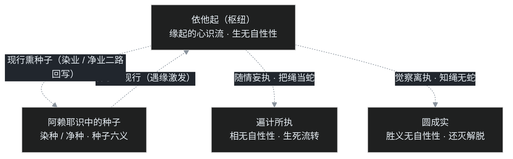

> 系列说明：这是叶扬的[印度佛教史学习笔记](/post/45.html)第七篇中篇。[上篇](/post/56.html)讲了阿赖耶识为什么不是灵魂，这篇讲唯识最精密的一套数据模型——三性、三无性，和种子的运行规则；下篇讲转识成智的实修操作。仍然只讲公共历史知识，术语第一次出现都带大白话。

## 小白问题：唯识说"外境是空"，那悬崖是我想出来的吗？闭上眼它就没了？

上篇发出后，叶扬想象一个抬杠现场：既然万法唯识、外境是空，那请唯识大师闭眼朝悬崖走十步试试？既然桌子是识变的，麻烦现场变一张出来？

这一问问得很好，因为它逼出了唯识学最容易被误读的八个字：**外境是空，心识是有**。

误读版本是主观唯心主义：世界是我脑补的，我不想它它就不存在。唯识要是这水平，根本撑不过古代印度一场场要命的公开辩经——辩输了的一方是要带着整个僧团改宗的。真实版本要精细得多：**空的不是事物，是事物被你抓出来的那种"独立、实在、与我对立"的对象身份**；而能认识、能误抓、能改正的整套心识活动，不但有，还是修行唯一的操作面。

怎么把这个意思说得既不堕"有"（把外相当真）又不堕"无"（啥都不承认）？唯识给出的工具就是三性、三无性。

## 一、先救场：从恶取空到善取空

先接上[上篇](/post/56.html)的话头。龙树讲一切法无自性，立场是对的，但说明书太简略，钝根人读完直接躺平：修行也空、成佛也空，努力干什么？这叫**恶取空**——把"空"取成了"什么都没有"，是断灭见。[C06（上）](/post/54.html)引过《大智度论》那句重话：宁可起我见大如须弥山，也不起恶取空见小如芥子。

唯识学派的救场方案，是先把"自性"这个词一分为二（"善取空"作为术语出《瑜伽师地论》卷三十六《真实义品》，义承《解深密经》三无性）：

- **假说自性**：语言、概念、标签所安立出来的"东西"。我们说"这是桌子""这是我""这是成功"，名称一贴，仿佛标签背后真站着一个硬邦邦的独立实体。假说自性是空——标签是工具，不是本体，尽信书不如无书。
- **离言自性**：离开语言文字才亲证得到的真实本身（缘起事相与真如理体都在这一层说）。它不空——你把真实也空掉，就没有修行目标、没有因果、没有凡圣之别了。

**善取空**的定义由此成立：如实现前地看清，什么是没有的（实体性的标签），什么是有的（缘起的心识活动与空性真理），不增益为有、也不减损为无。简单说：**空掉该空的，保住该有的**。听起来像废话，但这一刀切下去，三性三无性的整套结构就展开了。

## 二、三性：同一件事的三种看法

"三性"也叫三自性、三相（梵文 tri-svabhāva），出《解深密经·一切法相品》。注意，不是世界上有三种东西，而是**对同一缘起现象的三种看法、三个层面**。唯识学有个招牌比喻，《摄大乘论本》卷中就用过——"如闇中绳，显现似蛇"——叶扬觉得一千年后依然好使，就是**绳蛇喻**：

黄昏时分，你看见路边盘着一条蛇，大惊失色（凡夫位）；定睛再看，那根本不是蛇，是一段绳子（看破）；绳子本身也不神奇，它是麻纤维因缘编成的，如实知见（真实）。

对应三性：

**1. 遍计所执性（parikalpita-svabhāva）——蛇。**
"遍计"是周遍地思量计度，"所执"是被抓取执取的对象。凡夫碰到任何现象，都用语言和情绪给它安立身份、贴上标签，然后把标签当实体：这是我的、这是好的、这是坏的、这是冒犯、这是损失。《解深密经》的定义是"假名安立"的自性差别——**全是命名活动制造出来的**。绳上本来没有蛇，"蛇"100% 是计度出来的；但恐惧是真的，冷汗是真的，撒腿就跑也是真的。凡夫的整个生死轮回，就发生在这一层。

**2. 依他起性（paratantra-svabhāva）——绳。**
"他"指因缘条件（这是中观术语里合法的"他"）；依他起就是依因缘而生起。**一切心识活动——看见、听见、判断、情绪、念头——都是缘起的、被条件凑出来的**，像绳子由麻编成。它不是蛇（无实体），但它不是没有：绳子实实在在地在那里，缘起的心识流实实在在地在运转。这一层是三性的枢纽：因为依他起可以往两边走——顺着执着走，它就现起遍计所执的相（把绳当蛇）；离开了执着，它就显现圆成实的理（看清绳上无蛇）。

**3. 圆成实性（pariniṣpanna-svabhāva）——"绳上本来无蛇"这个如实知见所显的真实。**
"圆"是圆满、"成"是成就、"实"是真实：在依他起的现象上，永远远离遍计所执，诸法平等的真如理体。（麻等编绳的因缘材料仍属依他起，不是圆成实本身。）这是圣者所证的真实，C06 讲的空性、第一义谛，在唯识体系里就安放在这里。它不是另一个东西，不是绳子之外还藏着第二件法宝——**圆成实就是"依他起上从来没有遍计所执"这件事本身**。

三性的关系可以浓缩成唯识的经典表述：在依他起上，凡夫见到的是遍计所执，圣者见到的是圆成实。《成唯识论》卷八的判语是"遍计所执情有理无，依他、圆成理有情无"——凡夫迷情上蛇活灵活现，理上却无；绳与无蛇之理，凡夫日用而不知，理上真实。

## 三、三无性：两个要空，一个绝不能空

光讲三性，喜欢抠字眼的人会说：你们唯识口口声声"性"，这不是又变相立自性了吗？于是《解深密经·无自性相品》又给三性各配一个"无自性性"，史称**三无性**。这个结构是全篇最绕的地方，叶扬第一次读时在第三个上结结实实卡了壳。

| 三性 | 配属三无性 | 到底"无"的是什么 |
|---|---|---|
| 遍计所执性 | **相无自性性** | 一切外相、文字相是执着安立的，相上没有固定自性——该舍 |
| 依他起性 | **生无自性性** | 一切现象缘生缘灭，没有"自己凭空生出来"的自然生——可转 |
| 圆成实性 | **胜义无自性性** | 在胜义真实上，本来就没有遍计所执的自性——**这是真理，绝不能空** |

关键就是第三个，名字本身是个绕口令："胜义无自性性"。断句要断成"胜义层面上、（遍计执的）无自性之性"——它说的是：**圆成实这个真理，其内容正是"无所执之我、无所执之法"**；因为它远离一切可执的相，所以借"无自性"为名。它不是说"胜义真理不存在"，恰恰相反，圆成实是**胜义有**——真实不虚地有。

这个分寸是拿来自救的：

- 若三个都空，连真理、解脱、成佛也宣布为无，那是恶取空重演，因果修证全部塌方；
- 所以前两个"无自性"指向要转化的对象层（相要舍、生要转），第三个"无自性性"指向要抵达的目标层（理要证）。

经中把这种讲法叫**了义**教：话说透了、空有两边都周全。佛陀自述说法三个时期：初转四谛，说"有"；第二时说般若，说"空"，但对钝根者说得太简，有人听空就歪；第三时说《解深密经》，空有双全、三性并陈，是"了义"。要再强调一次上篇钉过的分寸：**"不了义"不是"不究竟、低人一等"，是"对当时当机者只说到那个程度"**。

历史补一句：三时教判是瑜伽行派的自我定位，中观师并不买账——7 世纪那烂陀寺戒贤论师依《解深密经》判三时（中观第二、唯识第三）；据华严宗法藏《十二门论宗致义记》等汉传文献的转述，那烂陀另有智光论师一系依《般若》反过来判，把唯识放在不了义、无相空性才是究竟（智光其人其判的史料主要靠这一转述，细节学界有争议）。空有两宗在印度的大辩论延续数百年，这是后话，C12 收束时再结账。

## 四、"外境是空，心识是有"到底什么意思

工具备齐，回到开头的抬杠。唯识把"有"分成两种，话说立刻就顺了：

- **世俗有**：依他起的心识活动暂时存在、因果有效，虽然无自性，但绝不是零。生气、看见、记忆、习气，都在这一层真实运作。
- **胜义有**：圆成实真如，圣者亲证的真实。

而"外境是空"空的是什么？是**遍计所执的外境**——对象被我们的认识抓取时赋予的那层独立、外在、与"能认识的我"对立的身份。唯识给认识活动做了精密拆分：任何一识都含两面，**见分**（能认识的主体功能，看的那一方）和**相分**（在心识上现起的所认识影像，被看的影像）。你以为自己在看一个心外之物，实际发生的是：自己的见分认识自己识上现起的相分。能取（主体抓取姿态）与所取（被抓为实有的外境）都是识内的分别，这叫**二取**；修行到底，是连能取所取的对立也空掉，叫**二取空**，那就是圆成实。

那"变一张桌子出来看看"呢？课程老师在这一点上讲得非常干脆，叶扬必须如实转述："万法唯识所现"的"现"，是**呈现**的现——本来没被认识的变成被认识、没生起的认识生起来，是认识层面的事；不是凡夫靠意念把物质世界凭空变出来。课程里讲得明确，一般人变不出来；经论说禅定自在的深位菩萨（八地以上"于色得自在"、定自在所生色）心念可以影响物质世界，那是另一回事，跟"世界不存在、随你乱想"完全两码事。

还有共业问题：同一个房间，十个人走进去看到的是同一间房，不是十个房间。器世间（物理世界的总环境）是众生**共业**种子成熟所感，个人的别业只能在共业的共享场景里运作。悬崖对闭着眼的人照样成立——你个人的计度可以空，共业的缘起不空。

所以"外境空"的正确读法是：**空掉的是"心外实有、与我对立"这个身份，缘起的事相和认识活动一点不少**。唯识不是闭眼哲学，是"看懂你和世界的对立关系是怎么被构造出来的"的考古学。

## 五、两套缘起：业感缘起与阿赖耶缘起

讲完怎么看世界，再讲世界怎么运转。《摄大乘论》把缘起分成两个视角：

**1. 业感缘起（分别爱非爱缘起）**——这是阿含佛教的老底子，三乘共许，就是十二因缘。从业果表相上看：无明缘行、行缘识……爱取有造业，业力招感苦果，恶性循环叫**流转门**；把链条切断、证得解脱叫**还灭门**。它解释的是"外显的生命剧情"：为什么生生死死、怎么出离。上篇说过，它的短处是只描述现象，没回答"相续的内容存在哪"。

**2. 阿赖耶缘起（分别自性缘起）**——唯识的新贡献，从心识功能的内在机制上看：深层阿赖耶识里的种子，遇缘生起现行（心识活动），现行造作又回熏成新种子。它解释的是"剧情的底层数据流"。

两套不是两个世界，是同一缘起的"相"与"体"：业感缘起是外显的相、看得见的河面（爱非爱果、生老病死），阿赖耶缘起是内在的体、河床下的水文系统（种子消长、深层改写）。小乘修行在河面作业——断人我执、了分段生死；大乘唯识直接进底层改数据——连法我执（对一切概念的实体化，含对涅槃、对"我已解脱"的执着）一起转。

## 六、种子的六条运行规则

底层数据库里存的"种子"（bīja，本义植物种子），唯识给它定了六条铁律（护法论师总括，定型于《成唯识论》卷二，义据《瑜伽师地论》，称"种子六义"）。叶扬越读越觉得这像一份存储系统的设计规格：

| 六义 | 白话语义 | 修行上的含义 |
|---|---|---|
| **刹那灭** | 种子念念生灭，才生即灭，绝不常驻 | 数据永远在增量更新，所以习气可改——常住的东西没法修 |
| **果俱有** | 种子与所生现行果同时俱现、和合不离，非前后隔世 | 种子与现行在同一刹那里因果并在，立刻落记录 |
| **恒随转** | 种子随阿赖耶识一类相续、流转不断 | 进程重启（换世）不丢档，习惯的连续性有保障 |
| **性决定** | 种子善恶性质自类决定，善种生善果、染种生染果 | 因果不错乱，没有"随便造恶自动变善"的便宜事 |
| **待众缘** | 种子必须等待外在众缘凑合才现行，不自动发芽 | 没诱因时炸不起来，不代表种子没了；考验只在对境时出现 |
| **引自果** | 色法心法各引各自的果报，不互相代生、不一因生一切 | 情绪归情绪、身业归身业，问题拆开才解得开 |

最实用的是"待众缘"：叶扬见过不少人禅修营里祥和得像阿罗汉，回到工位三天打回原形——不是修行没用，是办公室的众缘把深层种子又勾出来了。**没起现行的时候，你看不到自己库里有什么货**；所以唯识修行不躲境界，反而欢迎对境（下篇细讲，这叫"借境转识"）。

种子从哪来？印度论师三家之说：

1. **本有说**：种子先天带来（过去世预存）；
2. **新熏说**：全是后天经验熏习出来的；
3. **新旧合生说**：两类都有——本有种子经新熏增长，新熏又依本有的认识功能而起。

中国法相宗承玄奘、护法一系，取第三家。日常经验也支持它：同一对父母的孩子天性不同（本有），但一家人长期相处会越来越像（新熏），上篇 checkpoint 类比里的预训练权重加 fine-tune，就是这个意思。

## 七、一张闭环图：种子⇄现行，染净两条路

机制跑起来，是一个双向写入的闭环。叶扬把它画成图：

> 读图注意：遍计所执"情有理无"，本身不能熏种；真正回写阿赖耶的，是依他起上染净两路的心心所活动——造染业熏染种、造净业熏净种，都由中间那条 E→S 边承担。

读这张图的顺序：深处的**种子**遇缘生起**现行**（比如库里有嗔恨种子，碰上一件不合意的事，愤怒当场升起）——这是第一步，凡圣都一样，会起烦恼不丢人。分水岭在接下来的身口意：

- **染途**：顺着情绪骂人、摔东西、记恨在心——现行立刻回熏，给嗔恨种子"充值"，下次更容易炸。这就是**染分依他**——心识被境界拖着跑，整个回路加固成恶性循环（流转门）。
- **净途**：觉察到愤怒、停下来、身口意不造作，甚至当场看清"惹我生气的那个'冒犯'本来就是我安立的标签"——这一次现行不但没充值染种，还熏下一颗"不嗔"的净种，圆成实在这一念上透显一次。这叫**净分依他**（还灭门）。

所以唯识敢说"烦恼即菩提"：**烦恼现行的那一刻，正是转依操作唯一的窗口期**。种子不动时你没有作业现场，现行起来才有机可乘。每次对境守住一次，库里的格局就改写一次——临命终时去哪儿，不用问神问佛，看总账上哪边种子多、哪边先现行。课程里老师打了个很形象的公共比喻：阿赖耶里的染种与净种就像肠道里的坏菌与好菌，生态位此消彼长，净种多了染种就嚣张不起来。

## 八、一个程序员类比：告警仪表盘上那个红数字

叶扬把三性配到了运维现场，意外地严丝合缝：

半夜，监控仪表盘上一个指标翻红，告警炸响。值班的新人工程师血压瞬间拉满——**"系统出事了！"**

- 值班工程师盯着的那个**红颜色的数字和告警标题**，就是**遍计所执**：它是监控系统按阈值规则"假名安立"的标签。标签不等于事故本体——这一次可能只是大促正常流量尖峰（误报），也可能真有故障，单凭"红数字吓人"什么都判断不了。对红数字本身愤怒、恐惧、想砸屏幕，全是对着蛇影开枪。
- 后台真实的事件流——指标采集、日志、trace、请求链路因缘聚合地流转——是**依他起**：缘生缘灭、可善可恶。它是唯一的操作面：告警可以被核实、被处理、规则可以被调整。
- 资深工程师到场，绕过吓人的标签直接看链路真相：该扩容扩容、该回滚回滚、误报就改阈值。**"红数字 ≠ 事故"的如实知见，以及看清之后对系统真实状态的掌握，就是圆成实**——不是另一个神秘面板，是不被标签骗到时，本来呈现的东西。

三性在这个类比里的操作箴言是：**标签要空（不被红数字牵着跑），数据流要有（老老实实查链路），真相要证（看完该处置处置）**。这正是善取空——恶取空是"告警全是假的，监控屏关了睡觉"，实有执是"红数字本身就是事故，先骂一顿写规则的人"。

不写代码的读者记大白话版本：**菜单上印的"辣"字辣不到嘴（遍计所执是把菜单当菜），但后厨真的在炒（依他起），走进厨房看清放了什么辣椒，你对这顿饭就有了如实判断（圆成实）。**

照例戳三个破洞：

1. **仪表盘背后有真实物理服务器，圆成实不是"标签背后的另一个实体"**。类比会诱导人以为"现象层背后藏着一个真东西"，但圆成实就是"依他起上本无遍计执"这件事，不是绳后面的第二根绳。
2. **运维可以改监控代码，凡夫改不了共业器世间**。工程师能重写规则让红数字消失，个人却不能靠重写认知让悬崖消失——共业的场景是共享的，转依转的是自识与共业的关系，不是开管理员权限。
3. 老破洞第三次出现：**监控系统有设计者和运维团队，缘起没有造物主**。种子现行的闭环无始无终，机房里没有值班的神。

## 九、吵架现场："这不就是贝克莱'存在就是被感知'吗？"

西方哲学背景的读者大概率会把唯识和贝克莱主教的主观观念论对号入座。像，但关键处分道扬镳，叶扬替双方把辩经推演完：

**问：你们说"心外无境"，贝克莱也说"存在就是被感知"，连"谁保证世界没人看时还在"的问题，贝克莱都请上帝来兜底——你们是不是换个说法的唯心论？**

答：至少三处根本不同。

1. **上帝的位置**。贝克莱必须请上帝做宇宙级的常驻观察者，万物因被上帝感知而存在——系统需要一个外部运维中心。唯识的答案是无作者的缘起：共业相续、阿赖耶交互，世界在所有有情的识变关系里维持，**没有总观察者，也不需要**。
2. **"心"是什么**。贝克莱的心最后是一个实体性的能知者；唯识连这个能知者也拆给你看——末那识恒执阿赖耶见分为"我"本身就是最深的病，修行终点是**二取空**：能取的"我"和所取的"境"一起解构。唯识不是"保住一个心、取消世界"，是"能所双亡"。
3. **方法论方向**。观念论是书斋里的哲学论证，唯识是禅定内观的操作报告：三性、见分相分这些不是推出来的猜想，是瑜伽师在深定中逐层观察心识的记录，且全部指向可重复的修行作业（下篇的四智四分就是作业规程）。

再补一刀给"悬崖派"：龙树在中观里早就用八不处理过悬崖——不生不灭、不常不断，现象层面的缘起因果全部保留；唯识只是把"现象如何被认识与执着"的机制建了模。**空掉实体，从不等于取消因果。你闭眼不看悬崖，悬崖照样在共业里等你；但你若看清"深渊很可怕"这个故事、连同"我怕深渊"的抓取都是遍计安立（深渊的事相本身是依他起、共业不空），恐惧对你的支配就先空了一半。**

## 十、卡壳角

**卡壳一："胜义无自性性"为什么要起这么坑的名字？** 叶扬卡了很久。后来想通：这个名字本身就是教学法——它逼你把"无自性"四个字也空掉。凡夫的习惯是听一个词就抓一个东西：听"空"就抓虚无，听"真如"就抓个实体。世尊故意把"有"的东西用"无自性"命名（圆成实之所以为真实，正在于它无所执之性），让你词穷——语言到这里必须失效，剩下的路只能靠亲证。

**卡壳二：三时教判会不会只是自卖自夸？** 会有这个嫌疑，所以要守住分寸：它本质是**教学顺序论**，不是给经书写排行榜。唯识自己反复声明般若不了义是"说得简略"而非"义理低等"；而且戒贤、智光同代相反的判教恰好说明，判教是宗派的自我定位，真理不按判教排队。读判教最忌把方便当阶级。

**卡壳三：种子六义背完，然后呢？** 最大的流失就在这里——把唯识学成本田术语，名相滚瓜烂熟，脾气一点没变。课程老师的原话精神叶扬记一句：唯识学在现代最大的悲哀，是被当成纯佛学研究。六义不是期末考试题，是观察手册："待众缘"提醒你别信太平时期的自我评估，"刹那灭"保证你每次对境的努力都不白费，"性决定"警告你没有绕过因果的捷径。下一篇就把手册变成可执行的操作步骤。

## 钩子与术语

图在上面：依他起是唯一的作业现场，种子与现行双向回写，染净两条路在每个当下分叉。

**本篇术语清单**：

| 术语 | 大白话 |
|---|---|
| 三性（三自性、三相） | 遍计所执、依他起、圆成实——同一缘起现象的误认层、缘起层、真实层 |
| 遍计所执性 | 把标签当实体、把绳当蛇，凡夫轮回的全部现场 |
| 依他起性 | 依因缘生起的心识活动，染净的枢纽与唯一操作面 |
| 圆成实性 | 依他起上永离遍计执的真如理体，圣者所证 |
| 三无性 | 相无自性性（相该舍）、生无自性性（生可转）、胜义无自性性（理要证、不能空） |
| 善取空 / 恶取空 | 如实分清什么无什么有 / 把空读成什么都没有 |
| 假说自性 / 离言自性 | 语言标签安立的"实体"（空）/ 离言亲证的真实（有） |
| 见分 / 相分 / 二取 | 能认识的一面 / 识上现起的影像 / 能取所取的对立姿态 |
| 世俗有 / 胜义有 | 缘起现象暂时有效 / 真如理体真实不虚 |
| 业感缘起 / 阿赖耶缘起 | 十二因缘的生命剧情 / 种子现行的底层数据流 |
| 种子六义 | 刹那灭、果俱有、恒随转、性决定、待众缘、引自果 |
| 本有 / 新熏 / 新旧合生 | 种子先天带来 / 后天养成 / 两家兼有（护法论师、玄奘一系正统说） |
| 共业 / 别业 | 众生共同招感的器世间 / 个人招感的差异果报 |

**下一篇钩子**：道理全懂了，为什么叶扬下次被人惹到时还是秒炸？因为从"知道"到"做到"之间，隔着整套操作系统。下篇讲唯识的实修协议：想与行之间怎么拉开缝隙、止与观怎么配合，以及转识成智的完整输出——成所作智、妙观察智、平等性智、大圆镜智，和四分、三身的最终对应。

> 说明：本文为个人学习笔记，讲的是公共历史知识，不代表任何宗教立场。参考课程：[B站《印度佛教史》](https://www.bilibili.com/video/BV1vewnzqEuA/)第 15、16 讲与第 35 讲重录版；参考书：玄奘译《解深密经》《成唯识论》、印顺《印度佛教思想史》。
