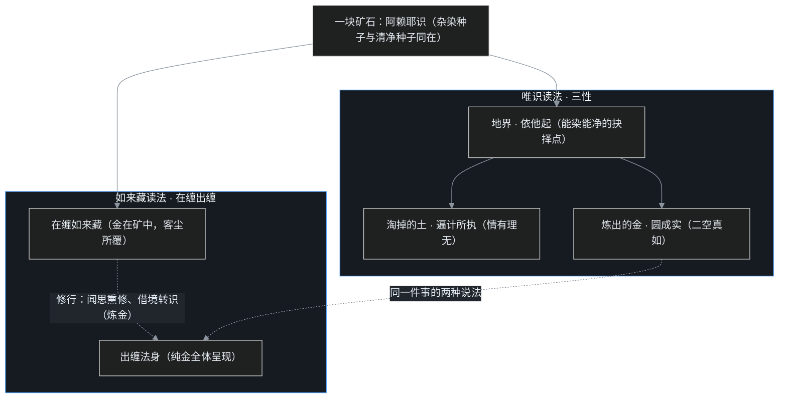

> 系列说明：这是叶扬的[印度佛教史学习笔记](/post/45.html)第八篇。[C07 三篇](/post/56.html)讲完唯识：阿赖耶识是仓库，修行是把染种转成净种、转八识成四智。这一篇接上[下篇钩子](/post/58.html)里那朵"云"——唯识一路"转"得辛苦，于是有人问了个更省事、也更大胆的问题：**云彩背后，太阳是不是本来就在？** 仍然只讲公共历史知识，术语第一次出现都带大白话。

## 小白问题：如果本来是佛，我天天打坐到底在忙什么？

[C07（下）](/post/58.html)结尾抛过一个命题：众生本来就有佛性，只是被烦恼的云彩遮住了，修行不是造一个新太阳，是云散。这个说法听着安慰，细想全是麻烦：

- 如果佛性是**修成的**，那"本来有"三个字就是骗人；
- 如果佛性是**本有的**，那我躺着等云自己散行不行？天天打坐、布施、忍辱，图什么？
- 更要命的是第三个问题：这个"本来清净、不生不灭、人人具足"的东西，跟婆罗门教的常住灵魂 ātman 到底差在哪？[C07（上）](/post/56.html)刚花了一整篇论证阿赖耶不是灵魂，如来藏会不会是灵魂换了件马甲 2.0？

这三个问题——**本有与修成的张力、会不会鼓励躺平、会不会退回神我**——正是如来藏思想在历史上挨的三棍，也是这一篇要逐一接的招。

## 一、从"果上有"到"因中具"：真常思想的惊险一跃

先把时间线接上。[C06（下）](/post/55.html)讲过涅槃四德：凡夫位上说苦、空、无常、无我，是如实描述、也是对治"执常乐我净"的药；但涅槃果位上，寂灭是真常、真乐、真我、真净。[C07（下）](/post/58.html)卡壳三里还专门立了防线：此"常"是真理不生不灭的真常，不是外道定命灵魂那种恒常实体。

如来藏思想做的，是惊险的一跃：**把只在佛果上才成立的常乐我净，提前宣布为众生因地中本来具足的东西。**

这一跃的动力，课程里讲了两个直接目的，又补了第三个：

1. **断无我畏**：普通学人听到"无我、五蕴皆空"，第一反应不是解脱而是恐惧——"那我死了不就什么都没了？行善修行图什么？"需要一个说法告诉学人：空掉的是执着，不是空掉觉悟的可能性；
2. **摄外道**：印度遍地是信常住神我的外道，上来就讲无我，门槛太高、人全跑了。先用"你本来就有清净真性"接引进来，进门之后再讲这"真我"其实也不可执；
3. **给菩萨道打底气**（课程补充）：菩萨要在漫长生死里利益众生、屡败屡战，凭什么不退？凭的就是"我决定能成佛"这份底牌。

所以"真常唯心论"这个名字里，**真**=诸佛所证的真理不生不灭（非常见、非宿命、非定命），**常**=这真理不为尧存不为桀亡，**唯心**=通生死涅槃、善染皆心。注意它与[唯识的"唯识所现"](/post/57.html)用词不同：唯识所现是因地说的——凡夫所对的世界是识所呈现的，要转；真常唯心是通盘说的——杂染与清净、生死与涅槃，全是这一心的不同状态。

这一脉经教在 4–5 世纪无著、世亲之后，于信仰与修持的学流中大大流行起来。课程特别修正了一个"兴起"的措辞：**不是祖师们新发明了如来藏，而是经教中本有的一脉，在 4 世纪后重新被重视、被系统阐扬。**

## 二、佛性四义：佛性到底是个什么东西

先解决名词。**如来藏**，梵文 tathāgatagarbha，garbha 同时有"胎藏"和"矿藏"两层意思：佛性像胎儿一样在众生身中孕育，又像金矿一样埋在砂石里。佛性被烦恼覆藏时叫**如来藏**（在缠），烦恼涤尽、全体呈现时叫**如来**或**法身**（出缠）——同一个东西的两个状态，不是两样东西。

佛性说的依据是《大般涅槃经》。课程介绍了这部经在汉语世界的结构：**前分约十二卷谈"如来藏本有"，后分约三十卷谈"一切众生皆有佛性"**（四十卷"北本"，卷次为约数）。经里对"佛性"的用法并不单一，印顺长老把它整理成四义，课程据此列了一张表，并给出了课程自己的研判：

| 佛性义 | 大白话 | 课程研判 |
|---|---|---|
| ① 成佛可能性 | 众生有成佛的可能，依因修行、渐渐亲证 | 偏实相 |
| ② 当有佛性 | 当下就有一份清净觉悟的能力（短暂无嗔、片刻清明，人人经验过） | 偏方便（接引初学） |
| ③ 一因缘佛性 | 佛性就在十二因缘里：能造业、能流转，就能还灭、能觉悟 | 偏实相 |
| ④ 遮破外道异见 | 说"佛性"是为破外道断灭/常住两边，不是立个新东西 | 偏方便（对治用） |

第③义最值得程序员细看，它其实是一条"能力可逆用"的推理：**同一个能力，方向相反地用，就是两条路。**能造贪嗔痴的这套心，恰恰说明它也能造戒定慧——能被污染，就证明能被净化；石头没有佛性，不是石头低级，是石头连业都造不了，既不会贪也不会不贪，没有"翻转方向"这个操作面。凡夫造恶的能力与成佛的能力，是同一个引擎的正转与倒转。这一义把"佛性"从一个高悬的奖品，拉回到"你此刻这颗能胡思乱想的心"上。

②④两义课程判为"偏方便"，但紧接着立了一条规矩：**善巧方便不能背离究竟真实。**方便是指路牌，指的方向必须真有那条路；为了接引把佛性说成一个住在体内的小金佛，那就是指错了路，不是方便是妄语。这个分寸下一节还会回来。

## 三、金土藏：同一张图，唯识与如来藏两种读法

如来藏系有一个贯穿全部五讲的主喻，课程反复讲了几十遍，就是**炼金**：金矿里含金，铜矿里炼不出金；金不是炼的时候才造出来的，但不炼，金矿永远是矿石。

这个喻的严格版叫**金土藏喻**，出自《阿毗达磨大乘经》（经中卷二明言"如来藏自性清净……入于一切众生身中"），与[《解深密经》的三性](/post/57.html)可以对读。一张图，两种读法：

唯识读法：地界是**依他起**——因缘所生、能染能净的枢纽；从地界里淘掉的砂石是**遍计所执**（本来没有，妄情安立）；炼出的纯金是**圆成实**（二空所显的真如）。

如来藏读法：同一块矿石，含金的那层叫**在缠如来藏**——金在矿中，为客尘烦恼所覆，覆藏的状态不妨害金本来是金；炼成之后叫**出缠法身**。

两相对照，关节就露出来了：**如来藏不是阿赖耶之外的第九个东西，它指的就是阿赖耶识里的清净分——[中篇](/post/57.html)讲过的清净种子、净分依他。**唯识说"转依"，是从操作面说：你要一步步炼；如来藏说"本具"，是从体性说：炼出的金不是你造的，砂石烧完本就没有金。两派争了几百年，在这张图上其实读的是同一座矿。这也是为什么[C07（上）](/post/56.html)那张弥勒五论表里，汉藏名单出入最大的《究竟一乘宝性论》——藏传尊为弥勒五论之一、汉传存疑——恰恰是如来藏系的核心论书：唯识与如来藏本来就共享着同一片论典地层。

## 四、生佛不二：众生与佛，不一也不异

金土藏直接推出如来藏系最有名的口号：**一切众生皆有佛性、生佛不二**。课程在这个口号上踩了一脚急刹车，要求把"不二"拆成"不一"和"不异"两半，各防一偏：

- **不异（体性相同）**：凡夫与佛的觉性是同一个东西——经中说如来藏"转三十二相入一切众生身中"，凡夫身中这份金，与佛果三十二相的那份金，成色无别。凡夫的片刻清明、无嗔、忘我，就是这份觉性的短暂露面，②号佛性义因此"可证、可实验"：课程里给的操作建议很朴素——把"众生有佛性"先当一个**工作假设**拿去用，在情绪起来的当下试着找那个能看见情绪的缝隙，验不验得到，自己知道；
- **不一（业果相异）**：凡夫与佛在现状上天差地别——一个在缠、一个出缠，一个满库杂染现行、一个转依圆满。金矿不是纯金，理上有金不等于手里有金。

后世天台宗立"理即佛"等六即佛（这是天台的判位，非课程内容），最浅的"理即佛"意思是：从真理上说，一切众生当下即是佛——但**只是"理上即"，不是"究竟即"**，中间隔着名字、观行、相似、分证四个位次的真修。课程反复戒的正是俗化误读：凡夫拍着肚子说"我就是佛"，在教理上叫大妄语。理即佛是起跑线（你有资格参赛），不是完赛证明。

顺带把小白问题第二棍（躺平）在这里先接一半：金土藏喻本身自带答案——**"本有"管的是资格，"炼"管的是兑现**。石头不用修行，因为它没有矿；正因为矿里有金，淘炼才一刻不能省。本有说非但不鼓励躺平，反而是菩萨道长路的燃料：反正决定炼得出来，多淘一筐是一筐。

## 五、经论与合流：一经二论，楞伽会师

如来藏系的经论地图，课程列了"**一经二论**"和两部会师性的经：

| 文本 | 要点 |
|---|---|
| 《无上依经》 | 南朝陈真谛译，讲如来藏、三乘归一，是如来藏系的核心经（"一经"） |
| 《究竟一乘宝性论》 | 详谈佛性、如来藏与"五理由"（见下节）；藏传尊为弥勒造、列弥勒五论之一，汉传对作者归属有异说（或属坚慧） |
| 《法界无差别论》 | 坚慧造，谈众生界与法界不二（"二论"之二） |
| 《楞伽经》 | **会师之作**：南印度楞伽岛（今斯里兰卡）所说，一座框架里同时装五法（名、相、分别、正智、如如；旧译分别作"妄想"）、三自性、八识、二无我——唯识家当唯识经读，如来藏系当如来藏经读，因它明言"如来藏藏识"：清净如来藏与杂染阿赖耶是同一识的两面 |
| 《大乘密严经》 | 唐代日照三藏（地婆诃罗）与不空三藏两译，专讲阿赖耶与转依，义近《解深密经》 |

《楞伽经》的合流性质，让它成了禅宗的印心经典：课程明确讲到，**菩提达摩东来传法，以《楞伽经》印心，一代代传到五祖弘忍；六祖慧能之后，禅宗的宗经重心转向《金刚经》**（慧能一系的语录《六祖坛经》在文献分类上是"论"——祖师言教——而不是"经"，六祖是唯一说法被尊称为"经"的祖师，但体例上仍属论藏，这个课程专门点过）。一座唯识与如来藏会师的桥，就这样走成了禅宗的来路。

汉地的如来藏传播史，课程之外的公共史传还有几个绕不开的节点（以下据《高僧传》等公共史料，非课程内容）：东晋法显从印度取回、与佛陀跋陀罗（觉贤）共译出六卷《大般泥洹经》（涅槃经早期分量），北凉昙无谶译出四十卷《大般涅槃经》（北本），"一阐提"（断善根者）有没有佛性成为大论战；竺道生因主张"一阐提皆得成佛"被旧学摈出，在苏州虎丘对石头讲法，据说"顽石点头"，后来北本传到，经文果有"皆有佛性"之语。托名马鸣、真谛译的《大乘起信论》立"一心二门""本觉始觉"，是如来藏中国化的总枢纽，但古今都有人疑其为汉地撰述，至今是学术悬案——一篇笔记无法裁断，只记住"此论影响极大、身份有疑"八个字即可。

从结果看，如来藏是**中国佛教的最大公约数**：天台、华严、禅宗、净土，无一不以"心性本净、本具佛性"为底色。课程给的文化解释是：儒家的务实入世加道家的玄学本无，让汉语思想界对"即众生心、当下本具"这一路天然亲近——比精密的八识三性好懂，也比彻底的性空好受。顺带厘清一点：净土持名念佛与真常思想确实亲和力强（佛性本具、诸佛接引），但念佛不是真常唯心一系的专利，实相、观像、观想、持名四种念佛，各宗各系都有自己的解释与用法。

## 六、佛为什么不直接说空：五理由

一个尖锐的反问：既然如来藏和阿赖耶清净分是同一回事、说"空"说"无我"才了义，佛为什么还要绕弯说"如来藏我"，让后人误会两千年？《宝性论》给了五条理由，课程完整讲了，叶扬列成表：

| # | 不说空而说如来藏，是为了救哪种人 | 病在哪 |
|---|---|---|
| 1 | **怯弱众生** | 一听"无我"就退心：我都没有，修个什么？先说你有成佛的本钱 |
| 2 | **轻慢众生的人** | 不信别人能成佛，高高在上。对治的样板是《法华经》常不轻菩萨，见谁都拜："我不敢轻于汝等，汝等皆当作佛" |
| 3 | **小乘中执着虚妄法者** | 厌离生死、把涅槃当成逃离的别处，执"法"实有自性；要让其了知生死涅槃同一藏性、不必厌离生死 |
| 4 | **小乘中谤成佛稀有的人** | 认定佛只有释迦、弥勒那几个，凡夫绝无分；要用佛性平等打掉这个天花板 |
| 5 | **执着神我的外道** | 对满脑子常住神我的人，先用"如来藏我"接引进门（开引计我诸外道），进门再讲此我无我 |

五条里第 5 条最微妙，也正是小白问题第三棍的入口：**佛说"如来藏我"，是教学话术，不是哲学改口。**经论自己把底牌写得很明白——《楞伽经》说，如来藏"为无始虚伪恶习所熏"，又说佛对外道说藏是为"开引计我诸外道"，当依"无我如来藏"：不立灵魂、不立作者，空去一切执着之后，觉性的全体大用自然呈现。同一个"我"字，对外道是渡人的筏，对执着者是要舍的筏。

历史上还有一场"方便说"大辩论：印顺一系倾向把如来藏判为对印度教环境的顺应性方便说；课程则明确保留，认为**不能粗判**——②④两义确是方便，但①③两义（成佛的可能性、十二因缘中的翻转能力）是实打实地在描述真实，方便与究竟在这套教法里是捆在一起的。这是教材与课程的公开分歧，叶扬照单并呈，不替任何一边下结论。

## 七、一个程序员类比：每个 fork 都指得回同一个 upstream

[C04](/post/51.html) 讲部派分裂时，叶扬用过 git fork：一味佛法像上游仓库，二十部派像二十个越走越远的 fork。今天这个喻要翻面再用一次——fork 除了"各走各路"，还有一个更根本的事实：**无论一个 fork 本地提交了多少乱七八糟的东西，它和上游之间永远存在一个 merge-base，git 永远指得回那个共同的 commit。**

- 每个 fork 的本地历史千奇百怪（造业各异）——这是众生**不一**；
- 但所有 fork 与上游同源，主干上的代码一份没少（佛性本具）——这是生佛**不异**；
- 凡夫的仓库不是"坏仓库"，是本地分支堆满了垃圾提交、还把垃圾当主线；佛的仓库不是"另一个仓库"，是垃圾分支清空、主干全显。**成佛不是换仓库，是清理仓库；不是从零写一份新代码，是让本来就在的主干重新成为 HEAD。**
- 金土藏在 git 里的版本：仓库历史=地界（依他起，能净能染的操作现场）；错误提交与误解=淘掉的土（遍计执，本来就不该在主线）；上游主干=金（圆成实/出缠法身）。

非程序员的大白话版本：**手机系统被全家桶和病毒拖垮时，"恢复出厂设置"的干净镜像一直在恢复分区里，而且那个分区本身从不会中毒。**佛性就像这个从不被感染的恢复分区——但有个要命的差别（下面戳洞之一）。

照例三个洞：

1. **upstream 没有维护者**——这是第五次出现的老破洞：圣教说众生与佛同源，没说有个谁创建了这个源。主干是缘起法则与历代修行流传来的，不是天上的超级架构师写的，把上游人格化就滑回神我；
2. **merge-base 指得回，不等于本地已经干净**——知道"同源"不会一键成佛，垃圾提交要靠一次次借境转识去清理。恢复分区可以一键还原，佛道不能：习气是几百几千世的提交历史，"顿悟"顶多是终于看清了主干在哪，清理仍要渐修。**本具说在这里和躺平彻底切割**；
3. **主干不是一份藏在目录深处的高级代码文件**——佛性不是实体、不是灵魂文件、不是第二份识。它是"能对齐、能觉悟"的功能与空性之理；谁要是把它想成一个金光闪闪的隐藏文件，就又把指月的手指当成了月亮，重新造出一个神我。

## 八、吵架现场："这不就是婆罗门教的 ātman 换皮吗？"

这是如来藏两千年挨的最狠一棍，从印度的中观、唯识论师，到近代日本"批判佛教"的学者（松本史朗等指控如来藏是"基体论" dhātu-vāda，是佛教内部的神我复辟），打的都是这一拳。正面接：

**问：一个常住、清净、圆满、人人本具的"真我"，除了名字，跟婆罗门教的梵我 ātman 有什么区别？**

答：区别在四条防线，经论自己划的：

1. **无我不消灭个体，只破执着**。[C03](/post/50.html)车喻拆"我"之后要补一句：拆的是对五蕴的"我执"，不是宣布有个能修行的功能也不存在。没有恒常主宰之"我"，但有因缘相续、能染能净的觉用——如来藏说的是后者；
2. **"真我"是遮诠，不是表诠**。佛说如来藏"我"，语境是破断灭、是接引外道（五理由第 5 条白纸黑字），说完了经论自己就补"无我如来藏"。ātman 是正面立一个恒常实体，如来藏是借"我"字破执、再把这个字也空掉——筏喻的完整用法；
3. **它不主宰、不造业、不受报**。神我 ātman 是宇宙的本体与主宰（梵我合一），如来藏既不创世也不判卷，被覆藏时毫无脾气，要靠因缘修行才能显——一个"主宰"要是自己说了不算、得等云散，它就不是主宰；
4. **它与空性不二**。圆成实、空性、佛性、法身，在经论里是同一理的异名：金在矿中是如来藏，砂石本空、金不可造是圆成实。说"有佛性"与说"一切法空"指的是同一座矿，一个说含金，一个说砂石非金——这也是[C05（下）](/post/53.html)三系地图里"破、转、显"最终要在最高层汇合的原因。

还有一桩"背黑锅"公案，课程花了大力气翻案，值得记。印顺一系有个判断：如来藏思想推动了秘密大乘（密乘）的兴起，通俗的神我式譬喻为密教化铺了路，甚至可视作印度佛教灭亡的远因。课程对此明确商榷，理由有三：①时间对不上——4 世纪如来藏经论已经齐备，密教成熟要到 7 世纪之后，中间隔了两三百年，"因"没有马上结"果"；②藏传主干（格鲁派）承的是中观应成派，融中观唯识，并不以如来藏为最高见；③密教兴起的真实背景是波罗王朝护持下佛教与印度教的生存竞合——手印、坛城、持咒大量借自印度教。所以更准确的关系是：**密教是"借用"如来藏当自己的教理依据（果借因），不是如来藏"导致"了密教化（因生果）。**黑锅链条是：密乘随那烂陀 1203 年的火光退出印度→真常思想背"变质"锅→顺带连"大乘非佛说"的旧案又被翻炒。这桩公案的后半截（密教究竟是什么、1203 年发生了什么），正是 C09 的正题。

## 九、卡壳角

**卡壳一：本具说会不会让人躺着等开悟？** 这是叶扬自己最担心的。想通的关键在第三节那张图：本具的是"金"，不是"金器"；金性本具，提炼过程一点不省。而且按③号佛性义，你此刻能担心、能思考、能决定再试一次——这套正在运行的心行本身就是矿中有金的呈堂证供。躺平者其实不真信本具：真信仓库里有金的人，只会去挖，不会去睡。

**卡壳二："我就是佛"到底能不能说？** 看位次。理即佛上，此话指向"体性不异"的真相；凡夫位上拿它自我授权——我是佛所以不用修、发脾气也是佛性妙用——这是拿最高见给最低行找借口，禅宗呵斥为"谤佛"。安全的说法永远是：**我有佛性（不异），我现在不是佛（不一）。**

**卡壳三：佛性是"个"什么吗？** 不是。凡夫理解佛性，总想要一个可以装进盒子、盖戳认证的东西，这是遍计所执的老毛病。佛性是"能"——能觉悟、能净化、能与真理相应的功能与理则，像生病身体会自己复原、吃药只是帮忙（课程里用的比方），你解剖不到一个叫"自愈力"的器官，但功能一直在。它不占内存、不占位置，却管着整个系统能不能恢复出厂。

## 术语清单与收尾

| 术语 | 大白话 |
|---|---|
| 如来藏 tathāgatagarbha | 胎藏/矿藏：佛性在众生身中被烦恼覆藏的状态（在缠） |
| 佛性 | 觉悟净化的可能性与功能：能造业即能转业，能被染即能被净 |
| 在缠 / 出缠 | 金矿含金 / 纯金炼成；众生位的如来藏 / 佛位的法身 |
| 金土藏 | 地界=依他起、土=遍计执、金=圆成实：一图两读唯识与如来藏 |
| 生佛不二（不一不异） | 体性同源（不异）、现状天差地别（不一）；理即佛≠究竟佛 |
| 一经二论 | 《无上依经》+《宝性论》《法界无差别论》 |
| 《楞伽经》 | 五法三性八识二无我，"如来藏藏识"会师唯识；达摩传至五祖的印心经 |
| 五理由 | 对怯弱/轻慢/执法/谤佛/执神我五类人，佛不说空而说藏的教学理由 |
| 无我如来藏 | 如来藏是遮诠筏喻，不立灵魂作者，与空性不二 |
| 理即佛 / 六即佛 | 理上众生是佛=有参赛资格，非完赛证明 |

C08 到此收束：大乘三系的三张施工图都摆完了——中观**破**，一路拆到能所双亡；唯识**转**，转八识成四智；如来藏**显**，指出能转的依据本来就在。空、识、藏争了几百年，争的其实是同一座矿的三种开采方案。

**钩子**：显、转、破都是在书斋和禅堂里的印度故事。下一站，佛教将拿起法器、咒语、曼荼罗，走上一条最受争议的路——秘密大乘（金刚乘）：为什么"即身成佛"会成为新口号？月轮观、阿字观、两部曼荼罗、四部续在修什么？它与印度教是竞合还是合流？以及 1203 年，那把烧掉那烂陀的火。C09：密乘与佛教在印度的灭亡。

> 说明：本文为个人学习笔记，讲的是公共历史知识，不代表任何宗教立场。参考课程：[B站《印度佛教史》](https://www.bilibili.com/video/BV1vewnzqEuA/)第 17、18 讲与第 36–38 讲重录版；参考书：《大般涅槃经》《楞伽经》《究竟一乘宝性论》、印顺《印度佛教思想史》。竺道生、昙无谶等节为《高僧传》等公共史传，文中已标明。
