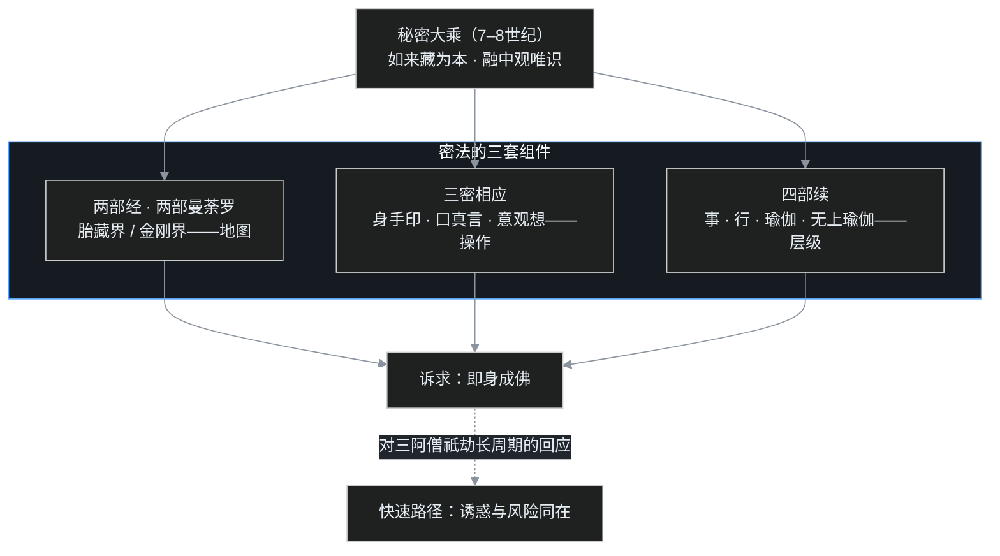
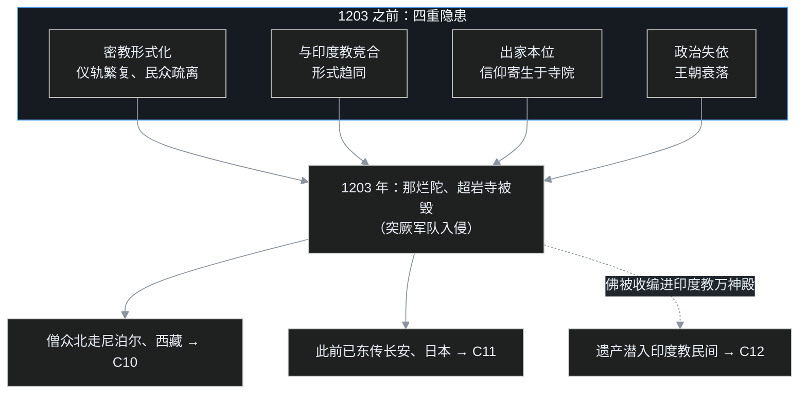

> 系列说明：这是叶扬的[印度佛教史学习笔记](/post/45.html)第九篇。[C08](/post/59.html)讲完如来藏，收尾留了半桩公案：印顺一系说真常思想推动了密教化、要为印度佛教的灭亡背锅；课程说这是"果借因"，不是"因生果"。这一篇就把公案的后半截补上——密乘（金刚乘）究竟是什么，它修什么、争议什么，以及 1203 年那把烧掉那烂陀的火。仍然只讲公共历史知识，术语第一次出现都带大白话。

## 小白问题：念咒、结印、欢喜佛，这些真是佛教吗？

看过藏传寺院或唐卡的人，心里大概都闪过几个不太敢问的问题：

- 汉地寺院念经，藏地寺院念咒，这些听不懂的咒语，跟民间跳大神嘴里的"天灵灵地灵灵"差在哪？
- 佛像有各种手势（手印），修法要对着花花绿绿的坛城图观想，这些排场是佛陀当年定下的吗？
- 唐卡上还有佛菩萨抱着异性的"欢喜佛"图案——佛教不是讲离欲吗，这是在修什么？
- 最根本的一问：佛教诞生于印度，今天印度十几亿人口，佛教徒比例不到百分之一。**一个宗教，怎么会在自己的故乡死掉？**

这四个问题，正是这一篇要回答的：密乘是什么、它在修什么、它为什么最受争议，以及 1203 年发生了什么。

## 一、最后一棒登场：秘密大乘的四个名字

先把佛教在印度的赛程摆出来：[早期大乘](/post/54.html)重般若与空性，龙树、提婆开出中观；4 世纪后无著、世亲开出瑜伽行派（唯识）；**到了 7–8 世纪，第三阶段登场——秘密大乘，也是印度佛教的"最后一棒"。**

这一棒的名字不止一个，各表一侧：

- **金刚乘**（vajrayāna）：vajra 译"金刚"，即金刚石（钻石），也是印度神话里天帝因陀罗的武器金刚杵——坚固不坏、又能击破一切。"乘"是车乘、路径；
- **真言乘**（mantrayāna）：mantra 即真言、咒语，以持咒为标志；
- **持明乘**（vidyādhara-yāna）："持明"意为持有智慧明咒；
- **秘密大乘**：这个"秘密"不是秘密社团，而是说**这套修法必须师徒口耳相传、当面灌顶，不能照着经书自己盲修**——像高压电操作，必须师傅带，没有公开说明书这回事。

它的理论底色，正是[上一篇](/post/59.html)讲的如来藏：众生本具佛性，修行是让覆藏的宝藏显发。但密乘不止于如来藏，它把中观的空性与唯识的观法也都熔了进来——后来藏传佛教的主流（格鲁派）尊的就是"中观应成派"，以空性为最高见。课程给它的定位是：**以如来藏思想为本、兼具龙树（中观）与瑜伽（唯识）形态的后期大乘。**

## 二、密教的目录：杂密、纯密与四部续

密法不是一夜之间成套出现的，先有零散装点，后有体系总成。

**杂密**：零散的咒语、仪轨、祈福消灾之法——求雨、护身、安宅，附在各种经里流传。这类东西东汉以来就陆续传入汉地，老百姓接触得最早。

**纯密**：以"即身成佛"为目标、体系完整的成套修法。判教者把全部纯密按"重心在外表还是内心"排成四层，叫**四部续**。"续"，梵文 tantra，本意是"编织、相续"，指一条条展开的仪轨典籍：

| 续部 | 梵文 | 修法重心 | 大白话 |
|---|---|---|---|
| 事续 | kriyā | 外在仪轨：持咒、供养、沐浴、设坛，重"事相" | 严格照操作手册做仪式，心先放在动作上 |
| 行续 | caryā | 外部仪轨与内心观想并重 | 仪式与心法各占一半 |
| 瑜伽续 | yoga | 外在事相从简，重内在禅定观想，依《金刚顶经》 | 收起排场，到心里去演练 |
| 无上瑜伽续 | anuttara-yoga | 主张在烦恼当下直接翻转，涉气脉、明点，号称最快、争议最大 | 号称在故障现场直接热修复，不先停机 |

承载这套体系的是两部根本经典，合称"两部经"：

- **《大日经》**，全名《大毗卢遮那成佛神变加持经》，7 世纪成立。"大日"即摩诃毗卢遮那（Mahāvairocana），意为"光明遍照"；此经重般若智慧，开出**胎藏界**；
- **《金刚顶经》**，重禅定证量，开出**金刚界**，汉地宋代由施护译出全本；
- 另有《苏悉地经》侧重事续仪轨（位在事续、行续之间），与前两部并称密宗所尊的三部经。

一个关键的地理分界先记住：**汉地的唐密、日本的东密，所传只到事、行、瑜伽三部；无上瑜伽续没有在汉地和日本传承开来。**四部具足的，是后来的藏传佛教。

## 三、两张地图：胎藏界与金刚界曼荼罗

修密法必须有个观想对象，这个对象的"全系统地图"叫**曼荼罗**（maṇḍala，本意"圆、中心、坛城"）：把佛菩萨的整个法界按方位画成图，修法时照着图把整套世界在心里"立"起来。两部经各有一张地图：

| | 胎藏界曼荼罗 | 金刚界曼荼罗 |
|---|---|---|
| 所依经 | 《大日经》 | 《金刚顶经》 |
| 布局 | **中台八叶院**放射状：大日如来居中，四方四佛、四维四菩萨，如莲花八叶承蕊；外围分列观音院、金刚手院、文殊院、地藏院、虚空藏院等 | **九会**九宫格式：以九场法会（"会"）排成方阵，中央为成身会 |
| 表法 | 由深而浅：佛的功德从中心向外展现，众生则由外围一层层归入中心 | 以法会阵容表诸佛菩萨集体证量，像一张满朝文武的班位图 |
| 侧重 | 理体（般若智慧，众生本具） | 智证（禅定中证得的境界） |

金刚界九会的名称依次是：成身会（一名羯磨会）、三昧耶会、微细会、供养会、四印会、一印会、理趣会、降三世会、降三世三昧耶会。其中"三昧耶"是誓愿、"羯磨"是事业、"降三世"表降伏三界烦恼。

金刚界曼荼罗在四方四佛之上安立中央大日如来，于是有**五方佛**：中央大日如来、东方阿閦佛（不动佛）、南方宝生佛、西方阿弥陀佛、北方不空成就佛。五方佛配五智——东方阿閦配大圆镜智、南方宝生配平等性智、西方阿弥陀配妙观察智、北方不空成就配成所作智、中央大日配法界体性智。这套配属与[转八识成四智](/post/58.html)直接对应，但要注意：**经文明示的是佛德，五方佛与五智的精密配属是后世祖师讨论而成。**

要强调的是：曼荼罗不是藏宝图，图上没有一个"佛在的别处"。它是一张心的全系统拓扑——**指的全是修学者自己心里的事**。

## 四、三密相应：身、口、意三个通道同时连入

密法的操作系统叫**三密相应**：把身体、语言、心念三个通道同时接到觉悟上，让"身口意"三业一起运作。

- **身密——手印**（mudrā）：双手结出特定姿势。这些手势并非佛教首创，有不少借自古印度祭祀与舞蹈中沟通诸天的手式。它的作用是"摄心"：专注于结印，身体就不缘别处、不造杀盗淫业；
- **口密——真言**（mantra）：持诵咒语。不少咒语是梵文名号或看似无含义的音声，课程特别说明：**重的是以音声把心收摄住，而不是拿咒语去讲道理、比数字**——语言不拿去妄语、两舌、恶口，全部用来持诵，心念清净比词义更要紧；
- **意密——观想**：于心中观种子字、月轮、佛身庄严或整幅曼荼罗。

三密如何合成一套修法，课程里给的典型样本是高野山至今还在教授的**阿字观与月轮观**：

1. 先出声念"**阿**"（a）——阿是梵文五十字母之首，课程解为"法界初始、最根本"之意；在《大日经》一系的传统解释里，阿同时是梵文的否定词头 a-，表"**本不生**"：一切法本来就没有一个实然生起的实体，连"开端"也是方便说；
2. 观想这个阿字以**悉昙体**（Siddham，古梵文字体）立于莲花之上，字背有一圆满**月轮**，月轮表清净光明，即大日如来；
3. 出声的阿"送"向大日如来，再领受回馈的清净；继而不念出声，专心观想字形、月轮，体会那份光明。

这类观修背后仍是[《解深密经》](/post/56.html)的路子：先以"止"把心收住，再以"观"体会境界。课程还提醒：观想不要求画面多么清楚，要的是**烦恼现起时能把那份清净光明提起来**——光明也是一种心的力量，力量强过烦恼，烦恼就没有着力点。

三密法门上还挂着一个响亮到刺眼的目标：**即身成佛**——不空三藏所译经轨中说，修持三昧者，以父母所生之身即可证入佛位。这口号是冲着"三大阿僧祇劫"的漫长赛程来的：常规路线要以天文数字的时间修菩萨道，密乘说不必，这一世就能成。

课程对此相当冷静：**理上成佛确实不待时节**——《法华经》龙女八岁瞬间成佛，比的不是时间，是翻转本能的决心；但"追求快速"本身就是一种贪着，一听即身成佛就兴奋、就觉得这派胜过显教，这已经是烦恼在作主了。

顺带一提净土法门：早期念佛偏重观想，东晋慧远在庐山修**般舟三昧**（pratyutpanna，"佛立三昧"），修者常立不坐不卧、为期九十日；唐代善导则把持名念佛大大简化普及，乃至"下品下生"亦能往生。念佛总说有实相、观想、观像、持名四种，《观无量寿佛经》更明言"**是心是佛，是心作佛**"。正因如此，课程判净土法门在性格上与密教相通：都重直接以心契佛。只是后来汉地最普及的持名一门，已经简到了极点。

一张图把密法的运行结构收拢起来：

## 五、唐密落地：开元三大士与两个祖庭

纯密体系在印度成型后，很快搭着船进了长安。8 世纪唐玄宗开元年间，三位来自印度的祖师先后译经传法，史称"**开元三大士**"：

- **善无畏**（中天竺人）：译出《大日经》，并把胎藏界曼荼罗依式画出、建立坛法；
- **金刚智**（南天竺人）：译传金刚界教法；
- **不空**（狮子国即今斯里兰卡人）：三人中译经最多、影响最大，历经安史之乱而深受朝廷尊崇，是密宗真正的集大成者。

密宗在汉地的祖庭是长安**大兴善寺**（今西安），三大士在此译经、灌顶，极一时之盛。安史之乱中京城动荡，不空安排大兴善寺僧众疏散避难；法脉反而在规模较小、受战乱影响较轻的**青龙寺**接续——青龙寺的**惠果**（不空教法的传人）在此传授两部大法。

公元 804 年，日本僧人**空海**入唐求法，在青龙寺师从惠果，受胎藏、金刚两部灌顶；806 年归国，开日本真言宗，总本山高野山。这一东渡支线的细节（包括空海之后日本密教的全貌）归到 C11 再讲，此处只记住一件事：**唐密在汉地起落，而它的"完整备份"在日本保存了下来。**

## 六、无上瑜伽：以欲离欲，与最争议的一页

四部续顶上的"无上瑜伽续"，提出了一个比即身成佛更激进的思路：**不必等烦恼断尽再证觉，就在烦恼最强烈的当下，直接把它翻转过来。**理论上，烦恼与解脱本只一念之隔，能在现场翻转，当然是最快的。

这套思路在历史上被具体解读为男女双修之法（"以欲离欲""乐空双运"），于是成了密教最受争议的一页。它的来历并不神秘：古印度**性力派**（Śākta）等印度教传统本有以性爱为修行甚至解脱方便的做法，《欲经》（Kāma Sūtra）也是同一文化土壤的产物；佛教在生存竞争中把这类元素吸纳进了无上瑜伽续。

课程把它定性为"**天神系**"的法门：欲界众生（包括人道）的淫欲是本能，本能越强，越难拿它自己当对治工具；色界、无色界的天神淫欲微薄，才真正具备"以欲离欲"的操作条件。课程用戒烟戒酒作比：一个烟酒不沾的人说戒就戒；可对已经成瘾的人，拼命给烟给酒，能不能让对方就此戒掉？——理论上好像说得通，实务上多半是火上浇油。

对这一页，几个分寸要分清：

- **藏传佛教也不是各派都采、人人都修**。课程的说法相当重：阿底峡**非常反对**双修法，宗喀巴更将其**废除**，并提醒后世借双修之名骗财骗色者层出不穷。这里要补一句公共史层面的 nuance：格鲁派的学理仍把无上瑜伽续置于道次第的顶层，课程所谓"废除"，更宜理解为废除不具条件者的实修，而不是删去这一部经典；
- **唐密与东密完全没有这一部**，这与汉地、日本的文化伦理直接相关；
- 至于气脉、明点等身心操作，可以理解为古代的身心调控技术，但是否适合向大众推广，始终是个真问题。

课程给出的正面榜样还是龙女：龙珠是龙的命根、是最深的生存本能，龙女把命根捧出来供养，当下成佛。**翻转本能靠的是彻底的决心，不是翻云覆雨的技巧。**

## 七、一个程序员类比：在本地拉起整套生产拓扑

理解了曼荼罗与三密，叶扬给它找了个工程上的对应物。

一个刚接手巨型系统的工程师，面对的是几百个服务、消息队列、网关、数据库。光看代码永远摸不清全貌，于是要做两件事：第一件，画出**全系统拓扑图**——哪个服务在哪个节点、谁调用谁、数据怎么流；第二件，在本地或演练环境里，**照图把整套集群拉起来**，网关、队列、假数据全部就位，然后把自己的请求打进去，看整条链路如何响应。

曼荼罗就是那张**全系统拓扑图**：大日是核心，五方佛是五条主服务线，诸院菩萨是周边模块，连线表整体关系。三密相应就是"**全栈三端同时联调**"：身体（手印）、语言（真言）、意念（观想）三个客户端一起连入，把整套佛菩萨集群在自己心里拉起来——不是用脑袋读懂图，是让图在心里运行。即身成佛的诉求，则是跳过漫长的逐版本迭代，**直接在本地一键拉起完整生产环境**。

非程序员的大白话版本：这就像消防演习——先有一张全楼的疏散图（曼荼罗），然后不是看一眼算数，而是整个人按图走一遍、身体记路、耳朵听警报、心里想着火情（三密同时投入），为的是真失火时身体自己会动。

照例三个洞：

1. **本地拉得起整套集群，不等于系统真的上了生产**。观想画面清楚、月轮分明，只说明演练做得熟练；断烦恼是生产环境里的真刀真枪，情绪冲上来的那一刻，演练能不能顶用，完全是另一回事。把"想得清楚"当成"已经证得"，是自己骗自己；
2. **一键全量启动只是理想，灰度发布的渐修省不掉**。本地集群能秒起，是因为脚本现成；习气是几百上千世的运行历史，"顿悟"顶多是终于看清了拓扑图长什么样，一个个染污节点仍要渐次清理。把"即身"听成"躺赢"，恰恰是被"快速"这个念头劫持了；
3. **这套架构高度依赖口传的部署手册——单点风险极高**。灌顶、仪轨、口诀只存在师徒之间，一旦师父断档、寺院被毁，整套环境就再也拉不起来。一个只能靠资深工程师口头传承、没有文档的系统，在和平年代看着神秘高级，大难来时，最先失传。这个洞，下一节就是它的现实版本。

## 八、1203：那烂陀的火

先说火起之前的局。

8 世纪之后，婆罗门教经过自我整理、复兴为印度教，教理、祭祀、民间根基全面回血；印度则列国分立。兴起于东印度的**波罗王朝**（Pāla，约 8–12 世纪）以国家力量护持佛教，但护的主要是密教：王室建起**超岩寺**（Vikramaśīla，又译超戒寺）、飞行寺等大寺院，那烂陀也继续维持。于是出现了"**一枝独秀**"的局面——密教在王家供养下极度辉煌，而其他佛教传承大半凋零。至于密法的传出地，多罗那他的《印度佛教史》说在乌仗那，义净的记载提到西印度罗荼国，看来本不限一处，是各地佛法衰落后，人才与法统渐渐集中到了波罗王朝的屋檐下。

然后火来了。

13 世纪初，中亚突厥势力攻入东印度，史书一般把这次攻势记在突厥将领 **Bakhtiyar Khalji** 所部名下（课程只说突厥军队、未具名）。据多罗那他等后世佛教史家的记述，**那烂陀、超岩寺这一座座经营了数百年的学问中心被付之一炬，僧团或死或散，幸存的学者带着经卷北上，逃入尼泊尔与西藏。**课程采用 **1203 年**说作为印度佛教灭亡的标志（学界对具体年份另有 1193 年前后等异说，这里从课程口径）。

"灭"字的分量在于**快**：12 世纪还是王家供养、僧众数千的顶级学府，几十年间荡然无存，连废墟上都几乎没剩下续灯的人。

更可玩味的是佛的下场。佛教在印度消失后，佛陀没有从印度文化里消失——印度教的往世书传统**把佛陀收编为保护神毗湿奴（Viṣṇu）的化身之一**。也就是说，印度人日后要看佛像、听佛名，往往要走进印度教的神庙。课程里那句话很重：**法是不会灭的，灭的是大众不再认识它、不再需要它。**

把火前的隐患与火后的去路画成一张图，整个故事的形状就清楚了：

## 九、吵架现场：谁该为那烂陀的火负责？

围绕"密教"与"灭亡"，历史上有三场吵到今天的架。

**第一场：如来藏要不要继续背锅？** 这是[C08](/post/59.html)那桩公案的延续。印顺一系倾向认为真常思想的通俗化、神我化推动了密教化；课程的反驳仍然成立：如来藏经论 4 世纪已备，密教成熟却要等到 7 世纪之后，中间两三百年的空窗说明问题；且藏传主干尊中观应成派，并不以如来藏为最高见。密教是**打着如来藏的招牌**（果借因），不等于如来藏**生出了**密教（因生果）。

**第二场：速灭的责任到底在谁？** 课程把原因铺成了四条，值得逐条记住：

1. **密教自身的形式化**：修法越来越繁复、神秘，普通民众看不懂也接不上，佛教退成少数僧团的专业事务；
2. **与印度教过度趋同**：你借我的咒术、我学你的仪轨，竞赛到最后，民众分不清两者区别，佛教于是失去了独立的辨识度；
3. **出家本位的结构性脆弱**：佛教的重心全在寺院与出家僧团，民间信众基础远不如早已深入村社的印度教——寺院是"单点"，僧散即灯灭；
4. **政治上失去依怙**：佛教长期依附王室护持，波罗王朝衰落后，新主人不仅不再护持，还带来了刀剑。

四条内因之上，突厥军队的入侵是**最后一根稻草**。把灭亡简单归咎于外敌，或简单归咎于密教，都太省事；历史给的答案是多因一果。

**第三场：密教到底"还算不算佛教"？** 这是从印度吵到现代的一问（近代日本"批判佛教"学者更指控其为神我复辟，[C08](/post/59.html)已提过）。课程给出的判准很清楚：**是不是佛教，看它的核心是否守住空性智慧与缘起、三法印；仪轨、咒语、手印都是工具，工具本身无罪，但一旦反过来执着工具，就成了"法执"。**课程还借印度的教训提醒汉地：一种宗教若与周围的民间信仰越来越难分辨，信众看似遍地，其实核心正在悄悄消散——这个提醒点到为止，叶扬只记下"辨识度"三个字。

## 十、卡壳角

**卡壳一：号称最快的路，为什么反而最危险？** 因为"想快"本身就是贪着在驱动。无上瑜伽这类高风险技术，对操作者的证量前提要求极高——老工程师在生产库上做无备份热修复，手快不是本事，出了事是灾难。把没有门槛的"速成"卖给不具条件的大众，普及有多快，堕落就有多快。最快的路从来只对极少数训练完备的人成立。

**卡壳二：佛被供进印度教神庙，算赢还是算输？** 这是传播史上最吊诡的一页。被收编，名义上是活了下来，实际上是被彻底改写：往世书里佛陀成了毗湿奴的一个化身，使命在某些版本里甚至被说成"引人不信吠陀"——一个教法以被曲解的方式存活，火种与灰尘同时留下。名字留下来了，主张没留下来，这笔账很难算赢。

**卡壳三：几座废墟、一群逃僧，就配叫"灭亡"吗？** 要区分"制度"与"法"。灭亡的是印度本土的僧团制度与寺院教育；但法没有死——它跟着北上的人群翻过雪山，也早已搭着船东去。种子还在，只是换了土壤。所以 1203 年既是终点，也是两条新线的起点。

## 术语清单与收尾

| 术语 | 大白话 |
|---|---|
| 金刚乘 vajrayāna / 真言乘 / 秘密大乘 | 印度佛教最后阶段：以金刚（坚固破暗）为喻、以持咒为标志，修法重口传 |
| 续 tantra | 仪轨典籍；四部续=事、行、瑜伽、无上瑜伽四层 |
| 事续 / 行续 / 瑜伽续 | 重外在仪式 / 内外并重 / 重内心禅定 |
| 无上瑜伽续 anuttara-yoga | 号称在烦恼当下直接翻转，涉气脉明点，最受争议，仅存于藏传 |
| 两部经 | 《大日经》（胎藏界）与《金刚顶经》（金刚界） |
| 曼荼罗 maṇḍala | 法界全系统地图：佛菩萨按方位布列的坛城 |
| 胎藏界 / 中台八叶院 | 放射状地图：大日居中，四佛四菩萨如莲华八叶 |
| 金刚界 / 九会 | 九宫式地图：以九场法会排列，中央成身会 |
| 五方佛 / 五智 | 大日与四方四佛配五智；配属为后世祖师讨论而成 |
| 三密相应 | 身手印、口真言、意观想，三个通道同时修 |
| 阿字观 / 月轮观 | 观阿字（本不生）立莲花上、背映月轮（清净光明） |
| 即身成佛 | 以此父母所生身证佛位；对三阿僧祇劫长程的"快速路径" |
| 般舟三昧 / 四种念佛 | 常立九十日的佛立三昧；实相、观想、观像、持名四种念佛 |
| 波罗王朝 / 超岩寺 | 8–12 世纪护持密教的王朝与其王家大寺 |
| 1203 年 | 那烂陀、超岩寺被毁之年（另有 1193 等异说）：印度佛教制度性灭亡的标志 |

C09 到此收束。从[阿含的朴素解脱](/post/45.html)到密乘的光怪陆离，印度佛教走完了一千六七百年的全程：它用最后的几百年把一切能用的方便都推到了极致，然后在故土谢幕。

**钩子**：那烂陀的火光里逃出来的人，背上是全套密法典籍，向北翻过喜马拉雅——在西藏，等待这支僧团的是松赞干布留下的香火、文成与赤尊两位公主带去的经典，以及后来阿底峡、宗喀巴的整顿。C10：北上西藏。而在更早的年代，另一条船已经把密法带到长安，再由空海带到高野山——这条东线，C11 再讲。

> 说明：本文为个人学习笔记，讲的是公共历史知识，不代表任何宗教立场。参考课程：[B站《印度佛教史》](https://www.bilibili.com/video/BV1vewnzqEuA/)第 19–22 讲、第 38 讲后半与第 39 讲重录版；参考书：多罗那他《印度佛教史》、印顺《印度佛教思想史》。灭法年份学界有异说，文中从课程口径并已标明。
