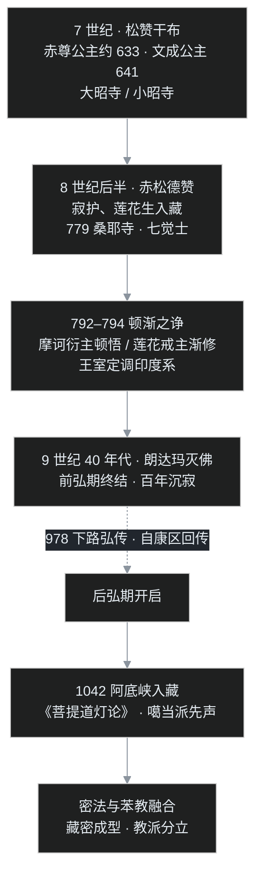
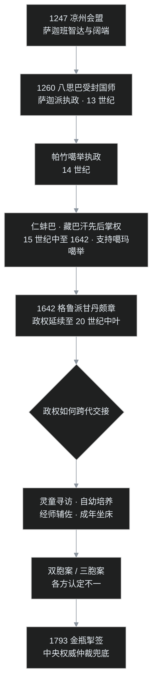

## 小白问题：那烂陀 1203 年才烧，西藏的佛教怎么 7 世纪就有了？

上一集讲到 1203 年那把火，印度佛教在本土制度性地灭亡，学者们北走尼泊尔、西藏。有读者就问了：既然学者是 13 世纪才北逃的，那藏传佛教难道是那之后才有的？可为什么又说文成公主 7 世纪就把佛教带进西藏了？

这两个时间都对，只是中间藏着一段"三落三起"的剧情。叶扬把这一集的三个小白问题先摆出来：

1. 西藏的佛教到底什么时候传入的，中间为什么会"灭一次"？
2. 藏传佛教那么多派——红教、黄教、白教、花教，都是什么关系，为什么各派至今不太团结？
3. "达赖喇嘛""活佛转世"听着神秘，它究竟是宗教设计还是政治设计？

这一集只写古代史，故事到清代的制度布局为止。

## 一、先认地形：250 万平方公里的屋顶，三个方言区

西藏位于青藏高原，是一片平均海拔四千米以上的高原，面积约 250 万平方公里。按照语言和方言，这片高原历史上分为三大区域：

- **卫藏**：以拉萨为中心的核心区。"卫"是前藏，"藏"是后藏（日喀则一带）；
- **安多**：青海到甘肃、四川西北与西藏接壤的广阔区域；
- **康巴**：靠近旧时西康的区域，大致是今天西藏昌都、四川甘孜、青海玉树一带。

在唐代，这片高原上的政权叫作**吐蕃**。统一的吐蕃王朝大致与隋唐同时；到宋代，吐蕃进入分裂时期；元代以后，西藏的政治领袖开始由藏传佛教的宗教领袖出任——这就是"政教合一"的起点。

课程里给了一张教派执政的时间表，叶扬核对公共史料后整理如下：13 世纪由**萨迦派**在元朝支持下统领西藏；14 世纪，**帕竹噶举**的绛曲坚赞取代萨迦执政；15 世纪中叶到 17 世纪前期，支持噶玛噶举的**仁蚌巴、藏巴汗**先后掌权；1642 年起，**格鲁派**在蒙古和硕特部支持下建立甘丹颇章政权，该政权一直延续到 20 世纪中叶。

## 二、前弘期开局：两位公主带来的两尊佛

佛教传入西藏，比传入汉地晚了五百多年，比传入朝鲜半岛也晚。公认的起点是 7 世纪的吐蕃雄主**松赞干布**。

松赞干布做了两件影响千年的婚事：

- 约 633 年，迎娶尼泊尔的**赤尊公主**（Bhrikuti，尼婆罗离车毗族）。赤尊公主带来了印度系佛教的文物，包括一尊释迦牟尼**八岁等身像**，并主持修建了**大昭寺**；
- 641 年，迎娶唐朝的**文成公主**。文成公主带来汉传佛教的经典与文物，包括释迦牟尼**十二岁等身像**，并主持修建了**小昭寺**。

藏地传说里，赤尊公主是绿度母（也有观音左眼化身之说），文成公主是白度母（观音右眼化身）——这当然是后世的宗教叙事，两位公主被抬高到菩萨化身的位置，正说明西藏人对这段"教法初来"的历史怀着多深的感情。

一个小彩蛋：最初大昭寺供八岁像、小昭寺供十二岁像。到后来金城公主时期，两像互换寺院供奉，所以今天旅行者在大昭寺看到的镇寺之宝，其实是文成公主带去的十二岁等身像（觉沃仁波切）。

在佛教到来之前，西藏本土的信仰是**苯教**（本教）——一种萨满式的民俗宗教，重祭祀、跳神、占卜、禳解，相信山川神灵处处都在。新来的佛教要在这片土地上扎根，迟早要和苯教正面相遇。这场相遇，要等下一位藏王登场。

## 三、生根：一座桑耶寺，七位贵族僧

8 世纪后半叶，藏王**赤松德赞**在位。这位赞普做了佛教在西藏"真正落地"的三件事：建寺院、立僧团、定教法。

赤松德赞先迎请了印度的**寂护**大师（Śāntarakṣita，又译静命）入藏传法。寂护是当时印度罕见的大学者，融通中观与瑜伽行两系，但碰上西藏本地反佛教的势力和苯教的"神鬼事件"，有点镇不住场子，便建议藏王去请一位更有"神通力"的人物——**莲花生**大师（Padmasambhava）。

莲花生来自**乌仗那国**（Uḍḍiyāna，今巴基斯坦斯瓦特河谷一带）。传说大师一路降妖伏魔，把苯教的地方神灵一个个"收编"为佛教的护法，折服了苯教的抵抗——但莲花生的做法不是把苯教清零，而是**吸纳**：苯教的许多仪轨、神灵、祈福方式，被改造后保留了下来。这就是后来藏传佛教"密法色彩特别浓"的根源之一。

779 年，西藏第一座"佛、法、僧"三宝俱全的正规寺院**桑耶寺**落成（寺院至今还在）。寂护亲任剃度师，为七位藏族贵族子弟授戒，史称"**七觉士**"或"七试人"——西藏历史上第一批本地僧团就此诞生。传入的戒律，是印度佛教**根本说一切有部**的戒律系统，这一系戒律也成为后来藏传佛教戒律的正统。

至此，西藏有了寺院、有了僧人、有了本土传承，佛教不再是"两位公主带来的外国信仰"。但紧接着，一场决定西藏佛教走向的大辩论就要开场。

## 四、顿渐之辩：一场辩论，两个相反的版本

文成公主去世后，仍有汉地僧人留在吐蕃传法，其中最著名的是禅师**摩诃衍**（Mahāyāna，藏文称 Hwa shang Mahayana），属禅宗顿悟一系，强调"不思不想、当下顿悟"。而寂护一系（此时寂护已圆寂，由其弟子**莲花戒** Kamalaśīla 代表）主张循序渐进：先要积累资粮、修定发慧，才能谈得上觉悟。

顿与渐，针尖对麦芒。藏王赤松德赞主持，约在 792–794 年间，于拉萨（一说桑耶）举行了一场大规模的御前辩论，史称"**顿渐之诤**"或"拉萨法诤"。

传统藏文史书的版本是：莲花戒胜出，摩诃衍被迫返回汉地，吐蕃从此以印度系的中观戒律为正宗，汉地禅宗的影响被官方终结。

但敦煌出土的汉文文献《**顿悟大乘正理决**》（王锡撰）记载的剧情**正好相反**：摩诃衍在辩论中占了上风，是吐蕃王室出于政治原因刻意压制汉传佛教。

政治原因也确实存在。松赞干布、文成公主的时代，唐蕃和亲、两国和平；但安史之乱后唐朝国力骤衰，吐蕃连年在西北边境用兵，**763 年吐蕃军队甚至一度攻入长安**（因补给线太长，盘踞约半月后撤退）。两国既已变成敌国，吐蕃王室当然不愿意境内继续盛行敌国的宗教思想——所谓"印度一方获胜"，很可能是一场披着辩论外衣的政治选择。

叶扬读到这里的感受是：辩论双方的教理谁高谁低可以继续研究，但"教科书式的定论"与"出土文献的反证"同时摆在桌上时，把两种版本都亮出来，比只信一个版本诚实。

## 五、朗达玛灭佛：前弘期的句号

9 世纪 40 年代（传统多系于 841–843 年），吐蕃赞普**朗达玛**在位，发动了一场猛烈的灭佛运动：寺院被封，佛经被焚，僧人被迫还俗或弃佛归苯，桑耶寺等道场停摆。这场灭佛持续时间虽只有几年，但引发的连锁反应让佛教在西藏腹地沉寂了**一百多年**。朗达玛本人最终据传被一位佛教修行者拉隆·贝吉多吉刺杀，吐蕃王朝也在朗达玛死后迅速崩溃。

朗达玛灭佛成为西藏佛教史的一道分水岭：

- 灭佛之前，从松赞干布到朗达玛，称为"**前弘期**"；
- 百余年之后佛教重新传入、复兴，称为"**后弘期**"。

前弘期的藏传佛教，以大乘显教和早期密法为主，汉传、印度系两路并存；后弘期则主要从印度和康区重新输入，此时的印度佛教已是秘密大乘的成熟形态，密法从此成为藏传佛教的绝对主色调。

## 六、后弘期：从康区"复活"，从孟加拉"接骨"

佛教在西藏的复兴走了两条路线，藏文史料称为"下路弘传"和"上路弘传"：

- **下路弘传**：公元 978 年，一些在灭佛时期逃到安多、康区（今青海东部、西藏昌都一带）保存下来的僧人及其弟子，从安多、康区把戒律和教法重新传回卫藏——像是用边缘节点的备份把中心服务重新拉起来；
- **上路弘传**：公元 1042 年，出生于孟加拉、当时任印度超岩寺大德的**阿底峡**尊者（Atīśa，982–1054）应邀经阿里入藏。阿底峡带来系统的道次第教法，著有《**菩提道灯论**》，重新整顿戒律、规范密法、传播中观应成派思想。其弟子仲敦巴开创噶当派，也就是后来格鲁派的直接前身。

这一时期传入的密法，与西藏本土的苯教文化深度结合，形成了今天意义上的"藏密"——它与印度原传的密教已经不完全一样：仪轨更成体系，护法更多样，寺院教育更严密。

下面这张图，把"前弘期—灭佛—后弘期"的灭与复串成一条线：

## 七、政教合一：从凉州会盟到甘丹颇章

后弘期不只是宗教复兴，也是一部政治制度演变史。几个关键节点：

1. **1247 年凉州会盟**：萨迦派第四代祖师萨迦班智达在凉州（今甘肃武威）与蒙古皇子阔端会晤，西藏由此归附蒙古，萨迦派也取得统领西藏政教的资格；
2. **1260 年**：元世祖忽必烈封萨迦班智达的侄子、萨迦派五祖**八思巴**为国师（1270 年晋封帝师），并命八思巴创制蒙古新字。从此"宗教领袖兼政治领袖"的政教合一模式正式确立；
3. 14 世纪中，帕竹噶举的绛曲坚赞取代萨迦建立帕竹政权，受明朝册封；
4. 17 世纪上半叶，藏巴汗政权支持噶玛噶举、压制新兴的格鲁派；
5. **1642 年**，格鲁派五世达赖在蒙古和硕特部固始汗军事支持下建立甘丹颇章政权。1653 年，清顺治帝正式册封五世达赖；1713 年，康熙帝册封班禅为"班禅额尔德尼"，达赖、班禅两大转世系统的地位由中央王朝确认。

课程里特别指出政教合一的代价：各派在争夺政权的过程中有战争、流血和民众牺牲，积累下深重的历史恩怨，这正是藏传佛教各派至今"泾渭分明、难以真正团结"的重要原因。反而在海外流亡、不再与政权绑定之后，各派之间的互动和融合才明显多了起来。

教派如何接力执政；而权力如何平稳跨代交接——转世制度早在 13 世纪已由噶玛噶举首创，格鲁派沿用并把它完善。第二张图画的就是这条链：

## 八、四大教派：红黄白花，各拿一套法门

后弘期的西藏逐渐形成四个主要教派（若把仍有传承的本土苯教算上，也有"五大派"的说法）。叶扬整理成一张对照表：

| 教派 | 俗称 | 源流与代表人物 | 核心法门 | 与政权的关系 |
|---|---|---|---|---|
| 宁玛派 | **红教**（红帽） | 溯源最远，传承吐蕃时期莲花生所传旧密咒，11 世纪后由素尔家族等系统整理 | **大圆满**（佐钦，阿底瑜伽 Atiyoga） | 未建立统一政权，以寺院、修行道场传承为主 |
| 萨迦派 | **花教**（寺院围墙涂三色条纹） | 1073 年建萨迦寺，昆氏家族传承；萨迦班智达、八思巴 | **道果**法门；教学兼采瑜伽行与中观 | 13 世纪受元朝支持统领西藏，八思巴受封国师、帝师 |
| 噶举派 | **白教**（白衣修行传统） | 11 世纪马尔巴创立，传密勒日巴、冈波巴；支系众多（帕竹、噶玛、止贡等） | **大手印**；重气脉、苦修 | 帕竹噶举 14 世纪执政；噶玛噶举得仁蚌巴、藏巴汗支持 |
| 格鲁派 | **黄教**（黄帽，刻意区别于宁玛红帽） | 15 世纪初宗喀巴（1357–1419）宗教改革，重戒律、严寺院学经制度 | 显密双修、道次第；总集各派之长 | 1642 年起执政，达赖、班禅两大系统延续至今 |

格鲁派的改革有两大动作特别值得说。第一是**重戒律**：宗喀巴针对当时密法流弊（尤其是借双修之名行淫欲之实），强调僧人必须严守声闻戒律，不赞成男女双修式实修——这与阿底峡的立场一脉相承。第二是 **1409 年创立"传昭法会"**（默朗木大祈愿会）：每年在拉萨举行，期间有考格西（辩经）、发放布施、酥油灯节、迎请弥勒佛、甚至体育表演，是藏地最盛大的宗教活动，也成为格鲁派凝聚信众、确立道统的重要仪式。

至于各派密法，除了大圆满、大手印、道果，还有五次第、六加行、喜金刚、时轮金刚等名目。其中时轮金刚是无上瑜伽续的重要法门，重气脉明点与"空乐无分"，并不是一个独立教派——听人把它说成"第五派"时要知道那是口耳相传中的混淆。

## 九、活佛转世：听着最神秘，其实是一份权力交接协议

藏传佛教最有辨识度的制度，是**转世制度**。需要先纠正一个汉语里的误会：西藏传统并不使用"活佛"这个词，藏语叫"**朱古**"（sprul sku），本义是"化身"——修行有成就者乘愿再来、以化身度众。"活佛"是汉地民间的俗称。

制度的运作流程大致是：一位大活佛圆寂前，或通过遗嘱、或通过宗教仪式（观湖、降神等）指示自己转世的大致方位；僧团据此寻访灵异征兆的**灵童**；认定后迎回寺院，从小按严格的宗教课程培养，辅以经师和侍从团队，成年后正式坐床、接管教务。今天读者熟悉的达赖喇嘛，已是第十四世。顺便交代这个称号的来历：1578 年，蒙古土默特部俺答汗在青海封格鲁派高僧索南嘉措为"达赖喇嘛"（"达赖"是蒙语"大海"之意），索南嘉措被定为三世，更早的根敦朱巴、根敦嘉措被追认为一世、二世。

几个公共史事实可以给这套制度"去魅"：

- **转世制度并非格鲁派首创**。最早采用活佛转世的是 13 世纪噶举派中的噶玛噶举（噶玛巴系统），目的就是解决"教主位置如何跨过一代又一代"的传承难题，各派随后效仿；
- 寻访指示往往很粗略，历史上因此多次出现同时找到两个、三个灵童、各方争执不下的"双胞案""三胞案"；
- 灵童争议的最终裁决办法是**金瓶掣签**：1793 年，乾隆皇帝颁布《钦定藏内善后章程》，在拉萨大昭寺（另在北京雍和宫）设金本巴瓶，候选灵童的名签入瓶，由驻藏大臣当众掣签认定——用程序和中央权威为宗教继承兜底。定制如此，执行间有变通：若只剩单一可信候选，历史上也有免予掣签的成例（如十三世达赖）。

课程里有一个很犀利的观察：**转世制度看似神秘，本质上是一种政治制度，是一套产生领导者的权力交接协议。** 为什么这么设计？因为直接传位给亲属或弟子，必然形成派系；用选举，又容易撕裂分裂；而找一个不属任何派系的孩童，从小在统一的道统和辅佐团队（相当于摄政委员会）下培养，十几代下来确实大体安稳——这是一个用"去人格化"来规避派系斗争的精巧方案。

## 十、一个程序员的类比：这是一套 Leader 选举协议

叶扬读到转世制度时，脑子里跳出来的是分布式系统里的 **leader 选举（leader election）**问题。一个高可用集群必须选出唯一的主节点，而选主算法的进化史，简直就是藏地传承方案的镜像：

- **世袭/传弟子**：像是把 leader 身份写死在某个节点的配置里——配置一固化，这个节点周围立刻形成既得利益派系，一旦它出问题，继承顺序就是内战导火索；
- **选举**：让所有节点投票。听着最民主，但票数接近时集群直接脑裂（split-brain）——对应各派势力各找各的灵童，"双胞三胞"就是宗教版的脑裂；
- **转世协议**：每次都选一个"全新的、与任何现有派系都没有利益关系的节点"（灵童），在标准化的代码库（寺院课程）里由一组摄政节点（经师、辅佐团队）培养到成年，再接管写入流量；
- **金瓶掣签**：脑裂真的发生时，不靠各方自证，而交给一个所有派系都承认的外部仲裁者（中央权威）抽签裁决——用程序正义结束无限拉扯。

**打个不写代码的白话**：这就像一家公司每换 CEO，既不搞"前任的儿子接班"，也不搞高管们抢位子打个头破血流，而是每次都找一个还在上幼儿园、跟谁都没恩怨的小孩，从小按公司的标准教材培养，旁边再配一个董事会盯着；万一冒出两个"天选之子"，就请大家都认的中立第三方抓阄定夺。

**照例自戳三个洞：**

1. **朱古转世不等于"灵魂搬家"**。佛教恰恰讲无我，没有一个固定不变的"我"从这具身体跳到那具身体；"乘愿化身"是在缘起与业力相续上的方便说，不能理解成灵魂实体迁移——否则就和 C03 破过的"有个谁在轮回"撞上了；
2. **制度有效不等于信仰解释成立**。这套方案在政治上很成功地稳定了权力交接，但它"灵童真是同一人再来"的宗教层面，属于信徒的信仰范畴，公共历史只能确认制度怎么运作，不能替信仰背书；
3. **培养过程一点也不"躺赢"**。灵童不是找到就自动成佛，十几二十年的严苛学修、辩经、持戒一步都省不掉——所谓"乘愿再来"，在人间落地的样子仍然是寒窗苦读。

## 十一、吵架现场：顿渐、双修与政教的距离

这一集的战场有三处，前两处和前情紧密相连：

**第一仗是顿渐之辩**，前文已经详述。摩诃衍的顿悟与莲花戒的渐修，在 8 世纪末的吐蕃正面对撞，官方版与敦煌版给出相反的胜负记录。叶扬的看法是：顿悟派讲的是"见地上的直接"，渐修派守的是"功夫上的次第"——后来藏传各派的主流答案其实是"见地要顿、功夫要渐"，两头都没丢。

**第二仗是双修之辩**。格鲁派以戒律为改革旗帜，阿底峡反对双身法，宗喀巴直接废除僧人双修式实修（这一点上一集 C09 已展开：无上瑜伽续的"乐空双运"源自印度教性力派土壤，"以欲离欲"对欲界众生好比让瘾君子靠再吸一口来戒毒，理论上巧、实务上险）。要补一句公道：格鲁派在学理上仍把无上瑜伽续置于密法顶层，"废除"针对的是不具证量条件者的实际行事，而非删经灭法；宗喀巴本人的无上瑜伽续著述中，仍保留对具格者业印修法的学理讨论——戒律层面僧人断淫，不等于密法里没有这一法。

**第三仗是"宗教该不该亲近政治"**。课程借西藏史给出的教训很直白：宗教借助王权可以大兴，可一旦在权力斗争中站错位置，迫害也就随之而来——朗达玛灭佛的背后本就有贵族争斗，政教合一之后各派更是为政权流血数百年。保持政教之间的适当距离，是这段历史用很高的价钱买来的经验。

## 十二、卡壳角：三个绕不过去的疑问

**Q1：都成佛了，还转世干什么？**
"活佛"是汉地俗称，藏语本义是"化身"。按佛教教义，成佛后当然不需要再来受生死，但可以慈悲发起化身、游戏人间来度众。所以"朱古"表达的不是"一个凡夫靠转世继续修行"，而是"成就者的化身事业相续不断"。至于历史上这套制度如何承担权力交接功能，那是制度史的另一层。

**Q2：苯教到底算不算佛教？**
苯教是佛教传入之前西藏的本土萨满式信仰。历史上二者长期对抗又互相吸收：藏传佛教纳入了苯教的部分仪轨和护法，苯教（雍仲本教）后来也大量吸收佛教经典形式，把自己改造成近似佛教的形态。所以严格说，原生苯教不是佛教，但后期苯教的面貌已经深受佛教影响——把它和四大教派并称"五大派"，是在这个意义上说的。

**Q3：既然都信佛，各派为什么不能合成一派？**
宗教上各派的差异其实没有想象中大（大圆满与禅宗的气质相通，大手印与中观空性同源），真正的鸿沟来自政治史：萨迦、噶举、格鲁先后执政，权力交替伴随战争与压制，历史恩怨沉淀为各派的身份记忆。教义分歧让人辩论，政教合一的战争记忆才让人分家。

## 十三、术语清单与下集预告

| 术语 | 一句话解释 |
|---|---|
| 吐蕃 | 唐代青藏高原上的统一政权名，约 7–9 世纪 |
| 卫藏 / 安多 / 康巴 | 西藏三大方言文化区 |
| 苯教 | 佛教传入前西藏的本土萨满式信仰；后期被佛教深度影响 |
| 松赞干布 | 7 世纪吐蕃赞普，迎娶赤尊、文成两位公主，佛教初入西藏 |
| 赤松德赞 | 8 世纪吐蕃赞普，建桑耶寺、立七觉士、主持顿渐之辩 |
| 寂护 / 莲花生 / 莲花戒 | 入藏三位印度大师：前者立僧团，中者降伏苯教，后者代表渐修派辩论 |
| 桑耶寺 | 779 年落成，西藏第一座佛、法、僧俱全的寺院 |
| 朗达玛灭佛 | 9 世纪 40 年代的灭佛运动，为前弘期与后弘期的分界 |
| 前弘期 / 后弘期 | 藏传佛教两大历史阶段；后弘期以密乘为主色调 |
| 阿底峡 | 1042 年自孟加拉入藏，著《菩提道灯论》，噶当派之源 |
| 八思巴 | 萨迦派五祖，1260 年受忽必烈封为国师（后为帝师），政教合一开端 |
| 甘丹颇章 | 格鲁派 1642 年建立的西藏地方政权 |
| 宁玛 / 萨迦 / 噶举 / 格鲁 | 藏传四大教派，俗称红、花、白、黄教 |
| 大圆满 / 大手印 / 道果 | 宁玛、噶举、萨迦各自的代表性法门 |
| 宗喀巴 | 格鲁派创立者，重戒律、兴传昭法会 |
| 朱古（sprul sku） | 藏语"化身"，"活佛"是汉地俗称 |
| 金瓶掣签 | 1793 年确立的灵童认定程序，以金本巴瓶抽签、中央权威裁定 |

**下一集，C11 东传日本。** 还记得 C09 末尾那位 804 年入唐、806 年归国的空海吗？佛法的另一条传播路线，是从长安继续向东，跨过大海：日本僧人渡海求法，把密宗、天台、禅宗、净土一一搬回岛国，最终发展出一套"和魂汉才"的日本佛教——寺院变成了家族企业，念经甚至可以按件计费。日本佛教为什么会长成那副模样，下集接着聊（对应第 24 讲）。
