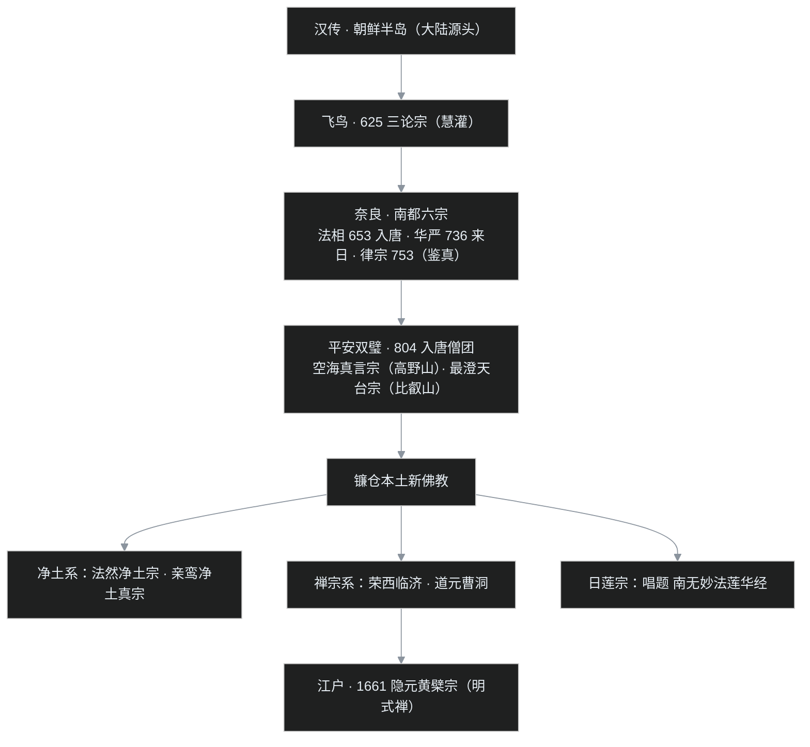
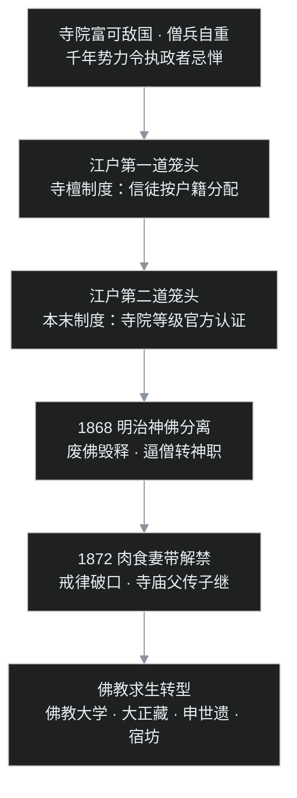

## 小白问题：日本和尚为什么能娶妻吃肉，白天当住持下班回家？

前几集一路追着佛法向东跑：[藏秘上了高原](/post/61.html)，[唐密进了长安](/post/60.html)。唐密后来在汉地失传，却在隔海的日本活了下来——日本僧人叫它"东密"，自称**真言宗**。

可不少读者对日本佛教的第一印象是错位的：电影里的日本和尚能娶妻、能吃肉，下班换掉袈裟就回家带孩子；寺庙在景区收门票，墓园按穴位卖牌位。这还是佛教吗？

叶扬先把这一集的三个小白问题摆出来：

1. 鉴真、空海千辛万苦把佛法东传，怎么传着传着，日本和尚能娶妻吃肉了？
2. 真言宗、天台宗、净土宗、净土真宗、日莲宗、临济宗、曹洞宗……哪些是"原装进口"，哪些是"本土改装"？
3. 日本遍地千年古寺、处处美如画，为什么日本人总说自己是"葬礼才信佛"？

## 一、先挂一张日本史时间轴

日本的时代名大多跟都城和幕府所在地走，先把坐标系挂好：

- **古代（天皇与贵族掌权）**：飞鸟时代（约 593–710，都于飞鸟，今奈良县南部）→ 奈良时代（710–794，平城京）→ 平安时代（794–1185，迁都平安京，即仿照长安布局的京都）；
- **中世纪（武家掌权）**：镰仓时代（1185–1333，源赖朝在关东镰仓开幕府）→ 室町时代（1336–1573，足利幕府在京都室町）→ 战国混战（各地大名割据）→ 江户时代（1603–1868，德川幕府在江户，即今东京）；
- **近现代**：明治时代（1868–1912，明治维新）→ 大正、昭和、平成，直到今天的令和。

佛教 6 世纪末随大陆文化进入日本，飞鸟时代是"开机"，奈良时代是"预装"，平安时代是"第一个辉煌期"，镰仓时代则是"本土大爆发"。下面按这个顺序走。

## 二、飞鸟开局：一位护法太子，第一座进口宗派

飞鸟时代最重要的护法人物是**圣德太子**（574–622）。这位太子是推古天皇的摄政，实际执政约三十年，做了几件影响千年的事：

- 607 年派遣隋使（小野妹子一行）入隋，直接从大陆引进制度与文化；
- 发愿营建寺院，把佛教定位为镇护国家的国教；
- 亲自为《法华经》《维摩诘经》《胜鬘经》作注（《三经义疏》，传为太子所撰，是日本现存最早的汉文佛学著作之一）。

日本人对圣德太子的崇拜到什么程度呢？旧版一万日元纸币上印的就是圣德太子的形象（今天的万元钞已先后换成福泽谕吉、涩泽荣一）。

最早传入日本的宗派是**三论宗**：公元 625 年，高丽（高句丽）沙门**慧灌**赴日讲三论——慧灌的师承可以追溯到汉地嘉祥寺的吉藏，所以日本佛教的第一行代码，写的仍是汉传的注释。

飞鸟时代留下的建筑代表是**法隆寺**（又名斑鸠寺）和大阪的**四天王寺**。这个时期的寺院布局主要有三种样式：**四天王寺式**（佛塔与金堂南北纵列，塔在南）、**法隆寺式**（塔与金堂东西并列），以及川原寺特有的"**一塔三金堂**"之制（东、西、中三座金堂并列，五重塔位于堂侧）——它们都明显带着朝鲜半岛百济佛寺的痕迹。

## 三、奈良时代：六个宗派预装，一位失明的东渡老僧

8 世纪的奈良，几乎把汉传佛教的主要宗派整体搬了一遍：

- **法相宗**：653 年道昭入唐，在玄奘门下学法相，归国后传入；
- **华严宗**：736 年新罗僧审祥赴日，740 年首讲《华严经》；
- **律宗**：753 年鉴真东渡成功，在奈良设戒坛传戒。

加上三论宗，以及依附于三论、法相的两个小宗**成实宗、俱舍宗**，合称"**南都六宗**"（"南都"就是奈良，相对于后来的京都）。六宗的学修传统多有存续，总本山今天也大多还在奈良。

这一时期最动人的人物，无疑是**鉴真**（688–763）。故事的起因是一件袈裟：日本长屋王曾造千件袈裟施赠唐朝众僧，衣缘绣着十六个字——"**山川异域，风月同天，寄诸佛子，共结来缘**"。鉴真见到后深受触动，认定与日本有传戒之缘。当时鉴真已年过六十，弟子们以渡海九死一生为由力劝，鉴真的回答是："是为法事也，何惜身命。"

此后便是著名的**六次东渡**：前几次或被官府拦截（当时唐朝禁民间出海），或遇风暴船毁人溺；第五次最为惨烈，船队被台风吹出上千公里，一路漂到海南岛，辗转雷州、桂林才返回扬州，鉴真就在这次回程中双目失明（传统史料的一致记载；现代有学者根据当时日方记录提出质疑，可备一说）。即便如此，鉴真仍不改初衷。753 年，第六次东渡终于成功；次年鉴真抵达奈良，受到举国欢迎。

鉴真在奈良亲建**唐招提寺**，寺中的金堂是唐代工匠主持修建的纯木构建筑，历经一千二百多年、多次修缮，至今屹立——想在中国看唐代木构要到山西深处寻孤例，在奈良却能一整座城地看。鉴真带去的不只是戒律，还有医药、书法、建筑；直到江户时代，日本药行还奉鉴真为祖师。

同期的圣武天皇也是位大护法：圣武天皇在奈良建**东大寺**，铸造了高约 15 米的奈良大佛像（752 年举行盛大开眼法会）。重建后的东大寺大佛殿，至今仍是世界上规模最大的木造建筑之一。

## 四、平安双璧：同一船团的两位天才

794 年迁都京都后，佛教的舞台也跟着北上。平安佛教最辉煌的一笔，是空海与最澄——两位日后各开一宗的大师，竟然出自**同一批遣唐使船团**。

804 年，日本派出四艘大船组成的遣唐使船队，从大阪难波港出发。当时航海全靠季风与经验，四艘船最终只有两艘抵达中国：

- **空海**（774–835，后谥弘法大师）乘一号船，在海上漂流近两月，最终漂到**福建福州长溪县赤岸**登陆（空海在福州代使团撰写《为大使与福州观察使上书》，此文至今传世），随后走水路、陆路辗转北上，年底才抵达长安。空海在青龙寺拜入**惠果**阿阇梨门下，尽学唐密，得两部曼荼罗灌顶；806 年归国，816 年获准在和歌山县的**高野山**开创道场，建立日本真言宗——这就是把唐密完整保存下来的"东密"。空海的书法被推为日本书圣，传世的《风信帖》笔意直追王羲之。
- **最澄**（767–822，后谥传教大师）乘二号船，抵达**明州（今宁波）**，就近入天台山、又赴越州求法，805 年携大量经典归国，在京都北面、琵琶湖畔的**比叡山**创延历寺，建立日本天台宗。

空海在南，最澄在北。两人虽分流弘法，却一直保持交情——《风信帖》正是空海写给最澄的书信，信中还在约"今年找个中间点见一面"。后来佛教史把两家法脉的八位入唐僧合称"**入唐八家**"：最澄、空海，加上常晓、圆行、圆仁、慧运、圆珍、宗叡。其中最澄的弟子**圆仁**入唐求法近十年，所著《入唐求法巡礼行记》与玄奘《大唐西域记》、马可·波罗游记并称"东方三大旅行记"。

平安时代净土信仰也在宫廷贵族中流行起来。京都宇治的**平等院凤凰堂**建于 1053 年，整座殿堂依《阿弥陀经》"七宝池、八功德水"的意象而建，今天十元日元硬币上印的正是它——天暗时点灯，阿弥陀佛的圣容隔着棂窗隐隐显现，把经中净土直接做进了建筑。

## 五、镰仓新佛教：一场本土大爆发

到了镰仓幕府时代，武士取代贵族，旧宗派高高在上，民间需要更简单、更直接的信仰。短短半个世纪里，日本佛教一口气长出五个新宗派——这是日本佛教真正的"本土化时刻"。叶扬整理成一张年表：

| 宗派 | 时间 | 开创者 | 师承与缘起 | 核心修法 |
|---|---|---|---|---|
| 净土宗 | 1175 | **法然**（源空） | 原在比叡山学天台；因读善导《观经四帖疏》而专修念佛，著《选择本愿念佛集》 | 口称"南无阿弥陀佛"，他力往生 |
| 临济宗 | 1202 | **荣西** | 两度入宋，学临济禅；归后在京都建建仁寺；著《吃茶养生记》，把宋地茶风带回日本 | 兼修禅（后世临济重公案看话）；重禅林规矩 |
| 净土真宗 | 1224 年前后 | **亲鸾** | 法然弟子；著《教行信证》，把净土义推到最彻底的"绝对他力" | 信心为本；本愿法门 |
| 曹洞宗 | 1243 年前后 | **道元** | 入宋习曹洞禅，归国后在福井县建永平寺 | "只管打坐"，默照禅 |
| 日莲宗 | 1253 | **日莲** | 原在比叡山学天台；认定末法时代唯有《法华经》能救国救民 | 口唱题目"南无妙法莲华经" |

这张表里有两组细节特别值得展开。

**净土真宗的"激进"**：亲鸾把老师法然的他力思想推到极致——认为末世众生靠自力修行全无可能，只要对阿弥陀佛的本愿生起真实信心，往生即已确定。更颠覆的是，亲鸾本人娶妻肉食、以非僧非俗的形象传法，亲鸾的一脉因此发展出"在家形态"：信徒不必出家，寺传子孙。这在当时是惊世骇俗的，却也让净土真宗深深扎进农民和町人之中。亲鸾之后，真宗大举组织信众团体，到战国时已是庞然大物。

**日莲宗的"简化"**：日莲的逻辑跟净土宗相似，却把信仰对象从佛号换成经题——既然文盲信众读不懂《法华经》，那就只持经题"南无妙法莲华经"七字，经题即总摄全经。日莲还以激烈的姿态批判其他各宗，宣称国家不立正法便将招来外敌与灾厄，是日本佛教里少有的"强硬派"。

镰仓佛教的社会分野也很清楚：**武士与贵族支持禅宗和天台**（临济的寺院被幕府定为"五山"官寺），**农民和市民则涌向净土真宗与日莲宗**。而南面高野山的真言宗因远离京都权力中心，反而在历次战乱中少受牵连。

## 六、僧兵与战火：寺院怎么变成了武装集团

佛教在日本扎根千年，势力膨胀到什么程度？——有信众、有土地、有财力，甚至有**僧兵**：为了保护寺产，大寺院训练武装僧徒，战国时期连僧官都要带兵上阵。财力与兵力一度凌驾地方政权，寺院就此成为执政者的"眼中钉、肉中刺"。

平民佛教的信众也真的拿起了刀枪。净土真宗（俗称"一向宗"）的信徒屡次发动"**一向一揆**"——以农民为主体、有严密宗教组织的武装反抗，加贺国甚至被一向宗控制了近百年。日莲宗一侧则有 1536 年（天文五年）的"**天文法华之乱**"：比叡山僧兵攻破京都，焚毁京都二十一所法华寺院，法华信众被逐出京都。

16 世纪战国尾声，**织田信长**几乎推平天下，却被几大势力组成的"信长包围网"缠住，其中就包括大坂石山本愿寺的一向宗武装和京都北面的比叡山。1571 年，信长军强攻登山，纵火烧毁延历寺，堂塔尽成灰烬。1582 年，即将统一日本的织田信长在本能寺被部将明智光秀袭击身亡——民间一直有"火烧圣山、终得果报"的说法，当然这是民间的因果叙事。

## 七、江户前后：一位福建老僧，再立一支明式禅

镰仓、室町之后，中日佛教交流的最后一个大篇章，由一位福建老僧写就。

1654 年，福州黄檗山万福寺住持**隐元隆琦**（1592–1673）因明末战乱，应日本长崎唐人寺院之请东渡。此时隐元已六十三岁，朝野上下对隐元景仰备至，德川幕府破例在京都宇治赐地建寺——新寺完全仿福建黄檗山旧制，仍名**万福寺**，开创日本佛教第三支禅宗：**黄檗宗**，时为 1661 年（江户时多称黄檗派，直到 1874 年前后才正式公称黄檗宗）。

黄檗宗带来的是一整套晚明文化：明式寺院建筑、斋堂仪轨、书画、素食（普茶料理），甚至诵经用唐音。万福寺的住持，前十余代几乎都由东渡的中国僧人担任，直到江户中期以后才由日本僧人接续。前些年福州黄檗山万福寺也依古制复建，两山中日相望。

## 八、政治的笼头：寺檀、本末，和明治的一刀

强势了一千年的日本佛教，终于被连续两代政权用制度一步步"规训"。先是江户幕府的两道笼头：

- **寺檀制度（檀家制度）**：幕府规定每户人家必须归属于固定的寺院，成为该寺的"檀家"（施主），婚丧迁徙都要寺院出具证明（"寺请"）。表面看，寺院从此有了按地区划分的稳定收入；实际上，信徒不是凭信仰来的，是按户籍"分配"来的——寺院经济被官府稳稳攥在手里；
- **本末制度**：幕府为全日本寺院排定等级，只承认少数"总本山"，其余寺院依次为本山、末寺、分院；小寺若无人继承，须上交本山，本山不接管便由政府接管、废寺并寺。宗派的组织形态从此被官方登记认证。

到 1868 年明治维新，新政权要抬神道教为国家信仰，对佛教的手段更为直接：

1. 颁布"**神佛分离令**"，把神社与佛教在制度、仪式上强行切割；诏令随即在各地激成大规模"**废佛毁释**"运动——寺院被合并、拆除，佛像经卷被毁，僧人被逼改任神道教职；
2. 1872 年，明治政府发布通告，允许僧侣**肉食、妻带、蓄发**——直接从戒律下手。

这里必须补一个关键的历史 nuance：**肉食妻带并不是明治政府凭空"发明"的**。如前文所说，净土真宗自亲鸾以来本就以娶妻食肉的"在家"形态传承，在真宗里这是几百年的传统；明治政府的真实作用，是把真宗一脉的特殊做法**推广为所有宗派的合法选项**，再由后世制度把它固化成"寺庙住持由嫡长子继承"的寺请世袭。戒律的口子一开，许多僧人白日着袈裟、晚间归家眷，僧俗界限模糊——这正是今天日本佛教"家寺"形态的由来。

## 九、佛教的活路：大学、藏经、世遗和宿坊

面对政治重压，日本佛教界没有坐以待毙，走出了三条很有特点的活路：

- **办教育**：各宗把总本山的教育升级成现代大学——真宗大谷派的大谷大学、本愿寺派的龙谷大学，日莲宗的立正大学，真言宗的高野山大学，曹洞宗的驹泽大学，诸宗合办的大正大学，日本的佛教大学数量世界之最。1924–1934 年，由学界牵头编修的《**大正新修大藏经**》以收录宏富、校勘精详成为二十世纪全球佛学研究的基础文献；
- **申世遗**：各寺纷纷申请世界文化遗产，用国际文化力量为寺院存续上保险——法隆寺、古都奈良、古都京都的寺院群先后列入名录；
- **做产业**：寺院开放参观收门票、经营托儿所和养老院、开办可住宿体验的"宿坊"，用现代服务收入弥补檀家制度的衰败。

日本佛教的佛学研究由此长期领先亚洲，但课程里也点出一个明显的失衡：**学术强而实修弱**。讲经说法成了学问，真能持戒修行的僧人，多退守在深山总本山和少数道场，成了少数派。

不过日本佛教也留下了一份极精致的礼物——**寺院文化**：茶道、花道与禅林渊源最深，书道长期赖寺院传写，剑道、弓道的精神境界也深受禅的影响；枯山水庭园、障壁画、佛像工艺，更是把宗教审美推到了极致。今天人们春天去寺院赏樱、秋天去寺院看枫，最美的取景地几乎都在寺中——这是千年护持换来的文化福报。

宗派东传的完整路线图，第一张图可以一图看尽：

第二张图画的是政权怎样用四步把佛教"规训"成今天的样子：

## 十、一个程序员的类比：一个开源项目被大厂收编的一生

叶扬读完这段历史，脑子里浮现的是一个开源项目被大厂"收养"的完整生命周期，每一步都严丝合缝：

1. **上游移植期**：鉴真、空海、最澄这些维护者，把大陆的成熟项目（戒律、唐密、天台）移植到日本这个新市场，自带文档、仪轨和构建规范；
2. **官方钦定期**：圣德太子定佛教为国教——项目被最大的平台公司（皇室）采用为官方组件，流量、资源、政策全面倾斜，奈良六宗就是六个官方认证的发行版；
3. **渠道锁定期**：江户的寺檀制度，相当于平台强制把全部终端用户按行政区"预装"给寺院一方——DAU 漂亮极了，可用户不是冲产品来的，是冲渠道来的；本末制度则是平台给所有 fork 做"官方认证分级"，认证权在平台手里；
4. **竞对上位期**：明治新政权扶持神道教这个自研产品，先用"神佛分离"做市场切割，再用"废佛毁释"强制下架，最后一招最狠——发布许可，允许社区**自由修改项目的核心协议**（肉食妻带=改掉戒律这份核心 license），项目的技术内核就此被釜底抽薪；
5. **转型求生期**：剩下的社区不再靠核心产品活着，转而做付费培训（佛教大学）、出权威手册（《大正藏》）、申请非遗保护（世界遗产）、搞付费体验营（宿坊）。

**打个不写代码的白话**：这就像一家口碑极好的独立餐厅，先被大集团看中、收为官方指定食堂；集团后来规定全城市民按户口本必须来吃饭，餐厅生意看着红火，客人却不是因为菜好来的。再后来集团换了老板、改捧自家新开的店，先是断你的客流、拆你的招牌，最后宣布"你们厨师可以随便改祖传菜谱、可以下班回家开小灶"——几代之后，菜谱还是那本菜谱，后厨却已面目全非。老店最后靠着办烹饪学校、收参观门票、把老铺面申请成文保单位，才勉强把招牌留住。

**照例自戳三个洞：**

1. **不能只讲"佛教受害"**。寺院在被规训之前，自己也有僧兵割据、介入王位继承、甚至与政权兵戎相见的问题；幕府的寺檀、本末之制，固然有管控之意，客观上也终结了战国式的寺院武装——这是双向的权力博弈，不是单方面的迫害故事；
2. **肉食妻带不等于"信仰崩塌"**。在净土真宗的语境里，娶妻食肉本是亲鸾一脉基于"绝对他力"的主动选择，蕴含着自己的教理逻辑；后来的"家寺世袭"也发展出了葬礼佛教、社区信仰的稳定形态，不能只拿汉传出家本位的尺子去量；
3. **学术强未必是"衰"**。佛教大学和《大正藏》让日本成为世界佛学研究的母机，信仰的形态从"出家修行"转向"教育、文化与社区服务"，是衰减还是转型，本就见仁见智——真正值得警惕的只是"实修传统"在这个过程中被边缘化。

## 十一、吵架现场：三仗

**第一仗：鉴真到底有没有失明？** 传统史料（《唐大和上东征传》）一致记载鉴真第五次东渡后双目失明，日本唐招提寺的鉴真像也作盲僧形象；但现代学者根据当时日方的第一手记录中并无失明确证，提出过质疑。主流叙事仍取失明说，但把争议亮出来更诚实。

**第二仗：肉食妻带是政府强加，还是佛教自愿？** 一边认为是明治政权蓄意"从戒律摧毁佛教"的政治阴谋；另一边强调真宗本有此传统，且明治之后各宗对此反应不一——真言、天台、曹洞中仍有不少僧人坚持梵行。真相大概在中间：政治权力打开了制度缺口，各宗自己选择了怎样走进去。

**第三仗：日本佛教的"国家性格"**。从圣德太子"镇护国家"，到天台、真言为宫廷修法，再到日莲宣称"立正安国"，日本佛教与王权始终深度绑定。这究竟是佛教主动适应本土（所谓"王法佛法相依"），还是丧失了宗教应有的独立品格？课程借这段历史给出的教训很直白：**借助政治可以快速发展，可权力一旦更迭，被牵连的就是宗教本身**——保持政教之间的适当距离，是日本和[西藏](/post/61.html)两段历史共同的昂贵注脚。

## 十二、卡壳角

**Q1：日本和尚凭什么能结婚？**
两层来源：①传统层——净土真宗自亲鸾（13 世纪）起就允许娶妻食肉，寺统传于子孙，这是该宗教理的一部分；②制度层——1872 年明治政府解禁肉食妻带，把真宗做法推广到各宗，再经"寺请世袭"固化为父业子承。但要注意，能结婚的是日本僧侣制度下的僧人，不代表所有日本僧人都结婚，严持戒律的道场至今仍在。

**Q2：为什么日本人只在葬礼想起佛教？**
这正是江户寺檀制度的后遗症：当年每户被强制归属寺院、由寺院出具户籍与丧葬证明，"檀家关系"取代了信仰关系；几百年下来，佛教在普通人生活里就和"祖先、葬礼、墓地"绑定在一起——这种被戏称为"葬礼佛教"的形态，是渠道锁定褪去后剩下的历史底色。

**Q3：真言宗为什么几乎没再分派？**
课程里给的说法是：空海个人格局太大、体系又完整严密，后来者难出其左右，真言宗因此相对单纯（后世真言内部仍分古义、新义两大系统及御室派、智山派、丰山派等，只是未再衍生出独立的大众新宗）；相较之下，天台宗"兼容并包"（密、禅、戒律、净土都收），反而成为母体——法然、亲鸾、日莲这些新宗开创者，最初竟都出自比叡山天台门下。

## 十三、术语清单与下集预告

| 术语 | 一句话解释 |
|---|---|
| 飞鸟 / 奈良 / 平安时代 | 日本古代三段；佛教传入、南都六宗、空海最澄各开一宗 |
| 镰仓 / 室町 / 江户时代 | 武家幕府三段；镰仓新佛教本土爆发，江户立寺檀本末之制 |
| 明治维新 | 1868 年开始的近代化改革；神佛分离、废佛毁释、肉食妻带解禁 |
| 圣德太子 | 飞鸟时代摄政，607 年派遣隋使、定佛教为国教、著《三经义疏》 |
| 南都六宗 | 奈良六宗：三论、成实、法相、俱舍、华严、律 |
| 鉴真 | 唐代高僧，六次东渡、双目失明，753 年抵日，建唐招提寺传律 |
| 山川异域，风月同天 | 长屋王施袈裟诗句，鉴真东渡的缘起 |
| 空海 / 弘法大师 | 804 入唐从惠果学密，创高野山真言宗（东密），日本书圣 |
| 最澄 / 传教大师 | 与空海同批入唐，创比叡山日本天台宗 |
| 入唐八家 | 最澄、空海、常晓、圆行、圆仁、慧运、圆珍、宗叡 |
| 法然 / 亲鸾 | 净土宗开创者与净土真宗开创者；后者著《教行信证》、允许肉食妻带 |
| 荣西 / 道元 | 临济宗（建仁寺）与曹洞宗（永平寺）开创者 |
| 日莲 | 日莲宗开创者，唱"南无妙法莲华经"题目 |
| 一向一揆 / 天文法华之乱 | 真宗信徒与法华信众的中世纪武装反抗 |
| 隐元隆琦 | 福建黄檗山僧，1661 年在宇治建万福寺，开黄檗宗 |
| 寺檀制度 / 本末制度 | 江户幕府管控寺院的两道笼头：信徒按籍分配、寺院分等认证 |
| 神佛分离 / 废佛毁释 | 1868 年切断神佛，各地随之毁寺并寺 |
| 大正新修大藏经 | 1924–1934 年编修，现代佛学研究的基础藏经 |

**下一集，C12 三链收官，也是这个系列的终章。** 佛教离开印度之后，靠什么"相续"到今天？一路传下来的"空义"有没有被稀释、被误读？而当佛法进入不同文化，哪些是适应、哪些已经"变质"？最后一篇把这三条线索打个总收束，再附上一份可按图索骥的书单（对应全部课程）。
