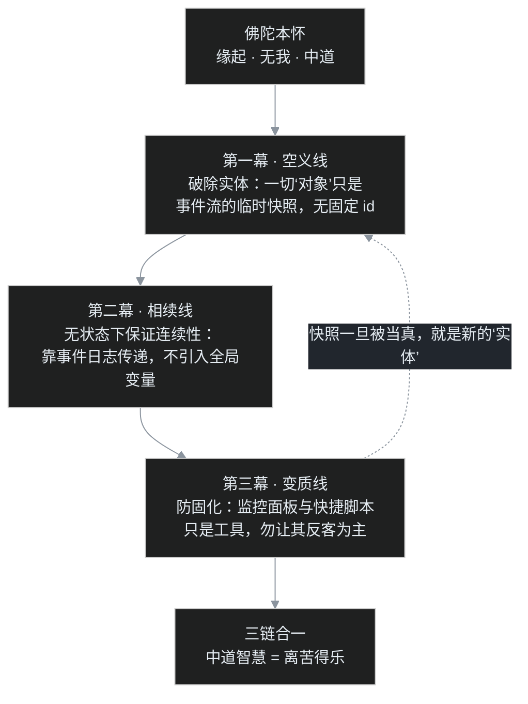
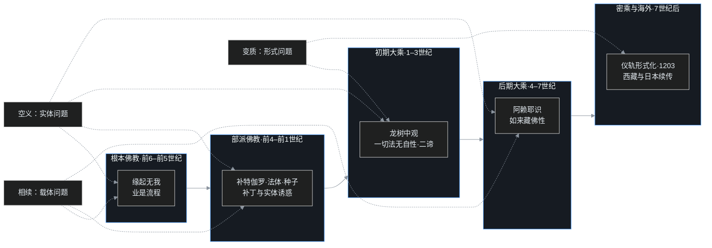

## 小白问题：三十九讲学完，会不会只是把一句话讲成了八百辈子？

系列开篇（[C00](/post/45.html)）时，叶扬在地图上画过五条时间带、三条暗线。一路走到今天，[佛陀前的印度](/post/48.html)、[四谛八正道](/post/49.html)、[无我轮回之辩](/post/50.html)、[二十部派大分叉](/post/51.html)、[龙树](/post/54.html)、[阿赖耶](/post/56.html)、[如来藏](/post/59.html)、[密乘与 1203](/post/60.html)、[西藏](/post/61.html)、[日本](/post/62.html)——十六篇文章，十二万字。

外行朋友听完进度，问了一个很扎心的问题：

> 你们这三十九讲，绕来绕去一千八百年，最后不会就是要讲一句"看破放下"吧？这五个字，大爷在公园下棋时就讲完了。

叶扬差点拍案说"不是"，但合上讲义想了一晚上，发现这话只对了一小半——课程信息量当然不止五个字，可三十九讲最后收口，确实也只有四个字：**离苦得乐**。

问题在于，这四个字不是结论，是起跑线。真正的功课是：**怎么离苦？凭什么得乐？** 一千八百年里最聪明的一群人为它争论不休——大的思想阶段就有五场，写下的论书上千卷。这一篇，叶扬把三条暗线一次性结账，再交一份书单——课程毕业了，账得算清。

## 一、先回到源头：佛陀到底"创建"了什么

讲三链之前，先把佛陀本人的立场钉死，因为后面所有争论，都是在替这句话打补丁或者防走样。

课程讲到佛陀生平（佛传细节留作未来选题，本系列只取要点）时，特别强调了一件事：**佛陀的核心创建只有一条——以智慧断烦恼，而得解脱。**

- 不是靠苦行。佛陀自己修了六年日食麻麦的苦行，结论是"吃苦了苦"不成立：折磨身体不等于心能解脱，瓦拉纳西河畔至今还有单脚站立、睡钉床、右手举了四十年的苦行者，功夫是真的，"那又怎样"也是真的。
- 不是靠禅定。高深的禅定能带来平静与神通，但出定之后烦恼原封不动——禅定是工具，不是终点。
- 不是靠神授。佛陀说"我今亦是人数""诸佛世尊皆出人间，非由天而得"——意思是，觉悟的是一个人，不是神的儿子，这份成就人人可及。

智慧的内容，就是**洞见缘起**：一切现象都是条件的临时组合，此有故彼有，此无故彼无，没有谁是孤立、不变、能主宰的。临终时佛陀留给弟子的话是"以戒为师"，而戒律护持的，依然是那份看见缘起的智慧。

还有一个常被忽略的细节，即通常所说的"**十四无记**"（箭喻经中列十问）：对"宇宙有没有边界""生命与身体是一是异""如来死后存在不存在"这类形而上问题，佛陀一律拒绝回答，理由是——这些问题对离苦毫无用处，就像一个人身中毒箭，不先拔箭医治，反而追问"箭是什么木头做的、弓是谁打的"，答案没拿到，人已经死了。这个姿态给全部佛教思想定了调：它不是一套满足好奇心的形而上学，而是一门以离苦为唯一验收标准的学问。

记住这个起点。三条暗线，全是从这里长出来的。

## 二、链一·相续结账：没有"我"，业果是怎么续上的

**这条线的问题**：佛教讲无我，没有常住不变的"我"；又讲轮回、讲业报，善有善报恶有恶报。那上辈子造业、这辈子受报的，如果不是同一个"我"，账怎么对？如果是同一个"我"，无我又怎么说？

一千八百年里，这个问题收到过四代答案。

**第一代，佛陀本人：业是流程，不需要谁来扛。**

佛陀拒绝回答"我"与"受报者"是一是异的问题，只讲缘起：此有故彼有——就像"我"少年时学的自行车，成年后身体细胞换了几遍，车也换了三辆，骑车的本事还在。技能不需要一个常住的载体，传递靠的是连续的练习。业同样如此，它是一条条件传递链，不是一个快递包裹。

**第二代，部派的补丁：差一点把"我"请回来。**

佛陀灭后，这个问题太熬人，各派开始造概念补台（详见[C03](/post/50.html)、[C04](/post/51.html)）：

- 犊子部提出有一个"补特伽罗"（pudgala，音译，意译"数取趣"）——一个与五蕴非即非离、不可定说的"那个人"，负责在轮回里连贯；该部自认它实有（摄在"第五不可说法藏"中）。这是最著名也最挨骂的补丁：批评者说，这不就是给"我"换了件马甲？
- 说一切有部主张"法体恒有"——每个现象（法）背后有个常住的自体，三世实有。把连续性建在了"实体"上。
- 经部则提出"种子相续"：烦恼和业像种子一样潜藏，遇缘结果，不必假立补特伽罗。

注意这个规律：**补丁的诱惑，永远是偷偷塞回一个"扛东西的实体"**。

**第三代，唯识：一个没有 id 的数据库。**

无著、世亲一系（[C07 上](/post/56.html)）把经部的种子说彻底系统化，交出了全系列最精巧的答卷——**阿赖耶识**：

- 它是一个不断被读写、又被写入内容持续改写的存储层。每一次身口意活动都把"种子"写进去，种子遇缘又生起新的活动，闭环相续，刹那生灭。
- 它没有固定内容（仓库里的货天天换），不是常住的灵魂；但读写链从不中断，所以因果账一毫不乱。
- 用程序员的话说：**一条记录没有固定 id，被改了无数次，凭相续不断的操作日志（event log）保证它与过去的连续性。**

到此，相续问题在"不立实体"的前提下，第一次得到了完整的机制说明。

**第四代，如来藏：把连续性收进觉性本身。**

后期真常唯心一系（[C08](/post/59.html)）更进一步：众生本具如来藏、佛性，觉性从来不曾断灭，修行只是去除遮蔽、恢复本有。连续性不再是"种子传递"，而是"觉性本在"。

这一跃最动人，也最危险——太容易被听成灵魂、神我。所以防线必须同时立：唐译《大乘入楞伽经》即说"应知无我如来藏义"；《楞伽经》又说如来藏与阿赖耶不异，依此会通，阿赖耶的清净分即佛性——绝非在八识之外另立一个常住主宰。

**相续线的结账结论：相续不需要载体，需要的是条件的连续传递。** 从缘起流程、部派种子到阿赖耶，站得住的答案都在描述"传递机制"；凡是翻车的补丁，都忍不住去造一个"扛东西的东西"。如来藏一代改以"无我如来藏"自我区别于载体——它是否仍算站得住，本身就是 [C08](/post/59.html) 没有完全消弭的争论：中观与唯识对它的警惕，和它对信仰者的接引之力，同样真实。

## 三、链二·空义结账："空"是怎样一步步加深的

**这条线的问题**："空"字一出口，普通人立刻听成"什么都没有"——善恶没有、因果没有、活着没意义。可如果空成了虚无，佛教就成了劝人躺平的虚无主义，与它"离苦得乐"的初衷正面冲突。

"空"的深化，走了四步，每一步都同时配一道防线。

**第一步：人无我。**

原始佛教的空，首先空的是"我"——五蕴（色、受、想、行、识，即构成人的五类现象）里找不到一个常住、独一、能主宰的我。"我"是对临时组合的俗称，正如"车"是对轮、轴、厢的俗称，零件拆开，"车"在哪里？

**第二步：法无我。**

部派里的有部为了保连续性，主张每个法都有恒常实有的自体。龙树（[C06 上](/post/54.html)）直接把战场从"人"扩大到"一切法"：**一切法无自性**——没有任何现象能脱离条件独立存在。注意龙树的精细处：空无自性，恰恰是因为一切都依缘起；正因为无自性，因果、修行、解脱才得以成立。如果有一物真有"自性"（独立、不变、自存），它就永远不会变化、不受任何影响，那才是真正的死寂世界。

配套的工具是**二谛**：世俗谛（常识层面，桌子、因果、你我都成立）与胜义谛（究极层面，一切无自性）。不依世俗谛，就说不了胜义谛——空从来不是把桌子否定掉，而是否定"桌子有独立不变的实体"。

**第三步：恶取空防线。**

龙树同时代就有把空读成"什么都没有"的人：《大智度论》称之为"方广道人"，后来《瑜伽师地论·真实义品》定名为"恶取空"；《大宝积经·普明菩萨会》更立下重誓——"**宁起我见积若须弥，非以空见起增上慢**"。因为把因果、善恶、修行一并空掉的人，丧失了一切行为的支点。这是全系列最严厉的警告：曲解空，比不信空危险得多。

**第四步：空有双全，与觉性不空。**

- 唯识学（[C07 中](/post/57.html)）给空划出精确边界：**遍计所执性**（纯粹主观安立的标签，如绳上误以为蛇）是空的；**依他起性**（因缘生起的现象流程）与**圆成实性**（如其本然的真如实相）是有的。空其当空，有其当有——空有双全才是了义。
- 真常唯心一系（[C08](/post/59.html)）则讲：万法可以空，觉性、佛性不空。但这"不空"同样要防成实体——它不是个东西，而是"能见空的那份明觉"本身。

**空义线的结账结论：空，是去除"独立不变的实体"，不是去除世界本身。** 人无我、法无我，空的是"自性"；缘起、因果、觉性，一样不少。空不是判决书，恰恰是"一切可以改变"的许可证——正因为没有固定不变的东西，凡夫才能成佛，苦海才能抽干。

## 四、链三·变质结账：指月的手指，怎样反客为主

**这条线的问题**：念佛、造像、写经、持咒——这些"形式"最初是什么？什么时候还是渡人之筏，什么时候只剩一个值钱的壳？这条线最刺眼，因为它的终点是 1203 年印度本土佛教的死亡。

**起点：形式本来是慈悲。**

大乘兴起后，并非人人都能走"久劫修行、深观空性"的难路（[C05 下](/post/53.html)）。于是有了**易行道**：恭敬称念佛名（阿弥陀佛为其中代表）、观想佛像、抄写经文——给意志薄弱者、识字不多者、生命将尽者一个抓得住的入口。龙树《十住毗婆沙论·易行品》先斥求此道者"怯弱下劣"，而后仍许它为方便——本意是慈悲：先接进门，再慢慢教。独尊阿弥陀的二道判，则要到昙鸾《往生论注》才定型。密教的仪轨（[C09](/post/60.html)）同理——手印、真言、观想三密相应，是为了把整个人（身、口、意）卷入修行，即身成佛，是对"修行太慢"的回应。

**变质：方便成了全部，入口成了终点。**

滑坡是怎么发生的？课程给出的轨迹清晰：

1. 念佛从"专心系念、以佛为榜样"滑向"口称名号、按件计费"——不念心性，只数遍数；
2. 造像、写经积累"功德"，功德可以交易、回向，形式开始明码标价；
3. 密教晚期大量吸纳印度教元素：坛场、咒术、神祇、性力修法，佛教与印度教越来越像，"分不清楚"；
4. 出家僧团变成学问与仪式的垄断者，与民间信仰彻底混融，教理内核没人讲了。

**终点：1203。**

突厥军队一把火烧掉那烂陀、超戒寺时（[C09](/post/60.html)），佛教在印度的死亡其实早已发生。课程总结了四点内因：密教自身的形式化、与印度教趋同而丧失辨识度、出家本位的单点结构、政治依托一旦失去就无处可退——外敌入侵只是最后一根稻草。形式反客为主的系统，在主场死于自身。

**续篇：西藏与日本的两份不同答卷。**

- 在西藏（[C10](/post/61.html)），莲花生式的"降伏并吸纳本土信仰"既是活下来的原因，也是风险所在；转世制度是极高明的政治设计，政教合一却也让佛教深度卷入权力。
- 在日本（[C11](/post/62.html)），寺院被国家层层收编：寺檀制度把僧侣变成户籍管理员，葬礼佛教把佛法变成殡葬服务，明治政府一道命令改掉戒律，"肉食妻带"让寺院父传子继。

课程最后给出的教训异常冷静，叶扬原样记下三条：**第一，对政治必须保持距离；第二，与民间信仰必须能区分；第三，最重要的是把教理的内涵发挥出来。** 课程甚至专门点破：别拿素食当护城河——印度教、耆那教的素食比汉传更严谨；汉传佛教真正的核心价值是**智慧**，不是素菜。

**变质线的结账结论：形式永远是指月的手指。** 手指是必要的（没有它看不到月亮），但一旦人们开始供奉手指、交易手指、为手指的归属打仗，月亮就从系统里消失了。

## 五、一个程序员类比：三条线，其实是同一个架构事故

叶扬写到这里终于看清，三链根本不是三件事，而是一个系统故事的三幕。

设想团队维护一套**无状态（stateless，服务实例不保存会话，状态全部外置于日志）的分布式系统**，要求跨无数节点保证因果一致性：

- **空义线**=架构师发现系统里所有"实体"（用户、订单、会话）其实都是事件流在某一刻的投影快照，没有真正常住的对象——别把快照当表。
- **相续线**=无状态不代表没记忆：连续性由事件日志（业种相续）保证。最危险的事故，是有人嫌日志难维护，偷偷加一个全局 session（补特伽罗、神我），系统暂时"好懂了"，从此埋下脏数据与脑裂。
- **变质线**=监控面板和快捷脚本（念佛、仪轨）本是为排障效率而生；但团队几代之后只维护面板、只跑脚本，没人碰核心逻辑，面板本身成了产品——最后竞品一冲，全线崩溃。

**大白话版本**：看事别看标签，传事靠流程不靠人，工具永远只是工具。

**自己先戳三个洞：**

1. **这套类比没有"开悟"的位置。** 架构评审通过，系统照旧运行；而佛法说的"断烦恼"是整个认知方式的改写，不是文档签字。类比讲的是结构，不是那件事本身。
2. **"适应时代"与"变质"走的是同一扇门。** 净土方便、密教吸纳、日本转型，起初都是为了活下去、为了接引更多人，后来才滑向异化。所以不能拿"我们这是在适应时代"给自己开脱——动机正确，不担保结果不失血。
3. **系统的隐喻暗示有架构师，但佛法里没有设计者。** 事件流自运行，缘起无作者，没有谁在顶层画图纸——这套系统没有总工，连"维护者"都是流程里的临时角色。

## 六、吵架现场："佛教现代化"，是不是新一轮变质

终章要吵，就吵最大的：课程总结时明确号召"这个时代也要把佛陀的教理找出适合时代的应用与推广"——可历史书摊开，每一次"适应时代"都伴随着一场异化。反方当然要上场。

**反方**：适应就是堕落的别名。净土为了适应怯弱众生，把佛法缩成六个字；密教为了适应民间，把印度教整套搬进来；日本佛教为了适应国家，连戒律都改了。你们现在喊"现代化传播""佛教+互联网"，凭什么相信自己是例外？1203 烧死的那批人，当年也觉得自己在弘扬佛法。

**正方**：不适应的系统，在主场已经死了。1203 的真正死因不是"适应"，是"在适应中丢了锚"——四内因里没有一条叫"太想回应时代"，条条都是"忘了自己到底在讲什么"。所以问题从来不是要不要换形式，而是锚在哪里：锚在缘起与中道的智慧内核，形式从山林换成讲堂、从贝叶换成光纤，渡的还是人；锚在形式本身，那敲木鱼和敲木鱼表情包一样，都是壳。日本之失正落在三条边界的第一条——依附权力，它是判例，不是例外。

**裁判**：课程给的三条边界，正好是这份"适应许可"的附加条款——与政治保持距离（不拿权力当护法）、与民间信仰保持区分（不拿神通当卖点）、把教理内涵讲出来（不把信徒当仪式观众）。满足三条，形式尽可以换；破了三条，不"现代化"也是活僵尸。

## 七、卡壳角：学完三十九讲，叶扬卡住的三个地方

**Q1：无我之后，责任感难道不会塌吗？**

起初叶扬真担心：既然没有"我"，那努力、赎罪、为自己的人生负责，还有什么意义？学透相续线才发现答案是反过来的——正因为没有常住不变的我，责任才真正成立。造业者与受报者"不一也不异"：不是同一个固定主体（不一），但同一条相续链从未中断（不异）。反倒是相信有个不变的"我"的人，可以说"我天生就这样，改不了了"——无我切断的是这个借口，不是责任。

**Q2：一切皆空、文明都会消亡，会不会越学越丧？**

不会，而且逻辑恰好相反。"空"说明没有任何东西被钉死：烦恼不是你的出厂配置，命运不是写好的剧本，连运行了一千八百年的教理，都能在新的时代重新生根。1203 年之后，佛法在西藏的雪山上、日本的寺院里活成了新的样子。空给的是改造空间，不是虚无判决书。

**Q3：为什么非把三条线讲成一条？**

因为写到最后，叶扬发现所有大争论——有没有我、空是不是无、方便会不会假——都是**同一个坑的三次变身**：把指月的手指当成月亮，把临时的投影当成常住的实体，把工具当成产品。"我"是人类造的第一个标签，之后的每一场架，都是在争论要不要往系统里再加一个标签。而佛陀从一开始给的，就是一套"不被标签骗到"的训练。

课程结束时老师说：这个智慧叫**中道**——不极端、不对立，不是儒家的中庸，甚至不是"折中"（折中是两边各让一步，中道是看穿两边的对立本身就不成立）。在一个族群撕裂、国家对峙的时代，这份不对立的智慧，比任何时候都更需要被传下去。

## 八、图表、书单，与结业证

**三链结账总表：**

| | 相续线 | 空义线 | 变质线 |
|---|---|---|---|
| 核心问题 | 无我，业果怎么续 | 空怎样不沦为虚无 | 形式怎样不取代内核 |
| 四代/四步演进 | 缘起流程 → 部派补丁 → 阿赖耶 → 如来藏 | 人无我 → 法无我 → 防恶取空 → 空有双全/觉性不空 | 易行道慈悲 → 形式化交易 → 与印度教趋同 → 1203 死亡 |
| 共同陷阱 | 忍不住造一个"扛东西的实体" | 把空读成"什么都没有" | 把入口当终点、把工具当产品 |
| 结账结论 | 相续靠条件传递，不靠载体 | 空去的是"自性"，不是世界 | 形式是指月之指，不可反客为主 |

**三链×五期展开图：**

**书单：课程毕业之后，按图索骥**

| 层次 | 书 / 经论 | 读法 |
|---|---|---|
| 课程主教材 | 印顺《印度佛教思想史》 | 讲课老师全程在与它辩论，建议对照着听，最能看出学术分歧如何发生 |
| 通史参考 | 平川彰《印度佛教史》 | 日本佛学界标准通史，史料年表细密，适合当工具书查 |
| 通史参考 | 吕澂《印度佛学源流略讲》 | 汉语佛学大家的讲录，判断锐利，篇幅不长 |
| 根本教法 | 《杂阿含经》、《法句经》 | 佛陀言教最古老的记录形态之一；《法句经》是入门偈颂集 |
| 部派 | 《异部宗轮论》 | 二十部派各自主张的一览表，[C04](/post/51.html) 的原典版 |
| 中观 | 《中论》（龙树造，鸠摩罗什译）；《百论》《十二门论》 | [C06](/post/54.html) 的主干；《中论》建议带今人注本读 |
| 唯识 | 《解深密经》、《摄大乘论本》（玄奘译）、《成唯识论》 | [C07](/post/56.html) 的骨架；《成唯识论》是唯识学集大成，宜最后读 |
| 真常 | 《楞伽经》、《究竟一乘宝性论》、《大般涅槃经》 | [C08](/post/59.html) 的经论依据 |
| 密教 | 《大毗卢遮那成佛神变加持经》（《大日经》）、《金刚顶经》 | [C09](/post/60.html) 的两部根本经 |
| 视频原课 | B 站 BV1vewnzqEuA《印度佛教史》 | 本系列全部文章的对应课程，免费公开 |

**结业术语表（15 条）：**

| 术语 | 一句话 |
|---|---|
| 缘起 | 一切现象依条件而生灭，此有故彼有——佛法的第一原理 |
| 无我 | 五蕴之中找不到常住、独一、主宰的"我" |
| 中道 | 不落入极端对立；不是折中，是看穿对立本身 |
| 业 | 身口意活动留下的影响力，沿条件链传递，不需要谁来扛 |
| 相续 | 现象刹那生灭而因果不断，如河流不息 |
| 补特伽罗 | 犊子部立的"不可说"的连贯者，被质疑是"我"的马甲 |
| 自性 | 事物独立、不变、自存的假想实体；空，就是无自性 |
| 二谛 | 世俗谛（常识成立）与胜义谛（究极无自性），相依而立 |
| 恶取空 | 把空曲解成"什么都没有"，比执有更危险 |
| 阿赖耶识 | 唯识学的存储层：种子相续的读写链，非灵魂 |
| 三性 | 遍计所执（空）、依他起（有）、圆成实（有） |
| 如来藏 / 佛性 | 众生本具的觉性；"无我如来藏"，非神我 |
| 方便 | 应机的入门设施（念佛、造像、仪轨）；渡人之筏 |
| 人间佛陀 | 佛陀以人身觉悟，"诸佛世尊皆出人间"，人人可及；此"即人"非密教"即身成佛" |
| 离苦得乐 | 全课程的总收口；路径=以中道智慧断烦恼 |

---

C00 开篇时，叶扬说这门课像一场一千八百年的系统演化。C12 写完，可以给那份立项报告补一行验收结论了：

> 系统在主场下线（1203），但西藏、汉地、日本等海外分支全部存活；核心算法（缘起、无我、中道）历经五次大版本与一次死亡事故，未被证伪，只反复证明一件事——**守住内核的形式更新叫传承，丢了内核的形式维护叫僵尸，而内核本身简单到只有四个字：离苦得乐，难得让人要学一千八百年。**

印度佛教史三十九讲，至此**全系列完结**。谢谢每一位读到这里的人。山高水长，下一个选题见。
