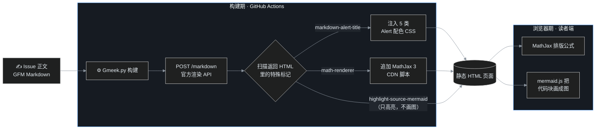
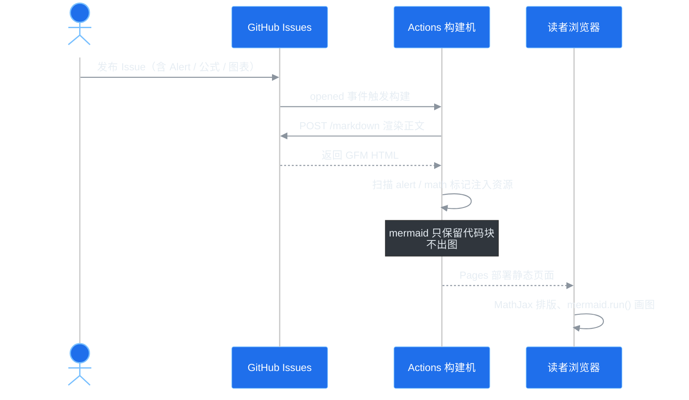

# G07 写作三件套：Alert 提示块、数学公式、Mermaid 图表

> 装了灯箱、目录、隐藏 JSON 这些"硬件"之后，这一期 G07 回到写作本身。GitHub Issue 的编辑框看着像个纯文本框，其实它背后站着整套 GFM（GitHub Flavored Markdown）渲染引擎——彩色提示块、LaTeX 公式、流程图都能写。而 Gmeek 在构建时又替我们按动了两个自动开关。这期文章里的每一样武器，你往下滚就能看到现场实弹。

## 先看懂渲染管线

Gmeek 自己不解析 Markdown。构建时，[Gmeek.py 的 markdown2html](https://github.com/Meekdai/Gmeek/blob/main/Gmeek.py#L128) 把整篇正文 POST 给 GitHub 官方的渲染接口：

```python
payload = {"text": mdstr, "mode": "gfm"}
response = requests.post("https://api.github.com/markdown", json=payload, ...)
```

好处是：**GitHub 网页编辑器里能渲染什么，静态站就能渲染什么**，语法永远和 GitHub 官方同步，不存在"本地一套、线上一套"。拿到 HTML 后，Gmeek 还会做两趟"扫货"（[Gmeek.py:153-181](https://github.com/Meekdai/Gmeek/blob/main/Gmeek.py#L153-L181)）：扫到 Alert 结构就自动注入配色 CSS，扫到数学公式标记就自动追加 MathJax。



这张图本身就是第三个主角——注意它在 GitHub 网页上只是一个高亮代码块，到了静态站才变成图，下文细说。

## 一、Alert 提示块：零配置，五种颜色

语法是 GitHub 2024 年全面支持的，在引用块第一行写方括号标记，**关键字必须大写、独占一行**：

```markdown
> [!NOTE]
> 这是一条备注信息。
```

五种类型本篇全部放出来，对号入座：

> [!NOTE]
> **笔记（蓝）**——中性信息、补充说明、延伸阅读指针。

> [!TIP]
> **建议（绿）**——能让事情更省事的窍门。

> [!IMPORTANT]
> **重要（紫）**——读者必须知道的关键信息。

> [!WARNING]
> **警告（黄）**——操作有风险，需要留神。

> [!CAUTION]
> **危险（红）**——可能造成不可逆后果的操作。

为什么零配置？Gmeek 扫到 HTML 里的 `<p class="markdown-alert-title">` 后，自动把五类配色的 `<style>` 注入这一页，颜色全部取自 GitHub Primer 的 CSS 变量（`--color-attention-subtle` 等），站点切暗色时提示块跟着变色，不用我们写一行 CSS。连左边的小图标（圆点、灯泡、感叹号）都是 GitHub 渲染时内联好的 SVG。

**一个实测出来的细节**：通过 API 渲染时，提示块标题是英文的 **Note / Tip / Important / Warning / Caution**（你在 GitHub 网页上看这个 issue 时会显示中文"提示/建议"，那是网页端按浏览器语言本地化的结果；静态站构建时 HTML 已经定型，所以是英文）。不喜欢英文标题的话，两个办法：接受它（图标本身已传达语义），或者用文末的 Gmeek-html 技巧自己写中文版式。

## 二、数学公式：两个美元符号的事

行内公式用单个 `$` 包裹：质能方程 $E=mc^2$，勾股定理 $a^2+b^2=c^2$。块级公式用成对的 `$$` 独占一行：

$$
\int_{-\infty}^{\infty} e^{-x^2}\,dx = \sqrt{\pi}, \qquad \sum_{n=1}^{\infty}\frac{1}{n^2}=\frac{\pi^2}{6}
$$

源码长这样：

```markdown
行内公式用单个 $ 包裹：质能方程 $E=mc^2$。

$$
\int_{-\infty}^{\infty} e^{-x^2}\,dx = \sqrt{\pi}
$$
```

GitHub 渲染器先把它包成 `<math-renderer class="js-inline-math">` 这种自定义标签；Gmeek 扫到后把标签壳拆掉、保留 `$...$` 原文，并给这一页自动追加：

```html
<script>MathJax = {tex: {inlineMath: [["$", "$"]]}};</script>
<script async src="https://cdn.jsdelivr.net/npm/mathjax@3/es5/tex-mml-chtml.js"></script>
```

读者端的 MathJax 3 再把公式排版成矢量 HTML——所以**没有公式的文章一个字节的 MathJax 都不会加载**，按需付费。

两个写作上的坑：

1. **美元金额会"撞车"**。GitHub 的判定规则是：开 `$` 右边不能是空格、闭 `$` 左边不能是空格。于是写"价格从 `$5` 涨到 `$10`"这种句子时，两个 `$` 会被当成一对公式分隔符。提到金额时用反引号包起来（`` `$5` ``）或转义，即可躲过；
2. MathJax 走 jsdelivr 公共 CDN，国内网络偶尔慢半拍，表现为公式先显示源码、片刻后排版好（有 `async`，不挡阅读）。这是官方唯一的自动注入点，没有配置项可换源；真介意的进阶玩家可以像下一节的 mermaid 一样把库下载到 `static/`，再用 G06 的单篇 JSON 自行接管。

## 三、Mermaid：唯一需要自己动手的

流程图、时序图、甘特图这些，GitHub **网页端能直接渲染**，但对外的 Markdown API 很克制——只把代码块做语法高亮，输出一个 `<div class="highlight highlight-source-mermaid">`，并不出图。Gmeek 也没有内建 mermaid，所以本站的方案是三件套：

| 组件 | 位置 | 职责 |
|---|---|---|
| `mermaid.min.js`（v11，约 3.5 MB） | `static/` | 渲染引擎本体 |
| `mermaid-init.js`（30 行加载器） | `static/` | 找到 mermaid 代码块、替换、画图、跟随明暗主题重绘 |
| 单篇隐藏 JSON | 文章最后一行 | 只给含图的文章加载这两个文件 |

加载器做的事很直白：选中 `div.highlight-source-mermaid`，取出 `<pre>` 里的图表源码，替换成 mermaid 容器后调用 `mermaid.run()`；另外监听主题切换按钮（本站按钮的 title 是"切换主题"），点一下就延迟 100ms 重绘。

**为什么不用全局 `script` 字段让每篇都加载？** 3.5 MB 的库给一篇纯文字文章陪葬太奢侈了。所以含图文章各自在最后一行用 G06 的单篇 JSON 挂脚本——你正在读的这篇、以及 [第 1 篇](/post/1.html)搭建全过程，都是这么做的。再看一次发文时序：



本站所有图表统一走暗色主题（画布 `#0d1117`、子图 `#161b22`、蓝节点 `#1f6feb`），做法是在每个代码块开头放一行 `%%{init: {...}}%%` 指令，它的优先级高于加载器的全局主题设置，所以图表恒定深色，不随站点明暗切换，深底白字在任何阅读环境下都成立。

语法学习成本约等于零：第一行声明图类型（`flowchart LR`、`sequenceDiagram`、`gantt`……），之后全是 `A-->B`、`参与者->>参与者: 消息` 这样的大白话。官方图文手册：<https://mermaid.js.org/intro/syntax-reference.html>。

## 四、附赠的彩蛋：Gmeek-html 直出

还有一个藏在[源码第 180 行](https://github.com/Meekdai/Gmeek/blob/main/Gmeek.py#L180)的冷门通道：**内联代码**以标记 **Gmeek-html** 开头时，代码内容会被反转义成真实 HTML 插进页面。比如在反引号里写 `Gmeek-html<kbd>Ctrl+S</kbd>`，渲染出来不是代码，而是一个真的键帽：`Gmeek-html<kbd style="border:1px solid #58a6ff;padding:2px 8px;border-radius:6px;background:#21262d;">Ctrl+S</kbd>`

想居中一行字、放个多列布局、嵌个自定义 badge，都可以用它实现"Markdown 里开 HTML 后门"。两个要点：**必须是内联反引号**（叶扬实测围栏代码块不生效，围栏形式只会出现在 pre 标签的 lang 属性里，不匹配转换正则）；内容别用会破坏 JSON 的字符——它只是 HTML 通道，不是脚本通道。

## 速查表

| 需求 | 写法 | 要不要配置 |
|---|---|---|
| 蓝色备注块 | `> [!NOTE]` 下一行写内容 | 零配置，自动配色 |
| 行内公式 | `$E=mc^2$` | 零配置，MathJax 自动加载 |
| 块级公式 | `$$ ... $$` 独占行 | 同上 |
| 流程图/时序图 | ` ```mermaid ` 代码块 + 单篇 JSON 挂 mermaid 两件套 | 需一次性放好 static 文件 |
| 键帽/居中/任意 HTML | 内联反引号，内容以 Gmeek-html 开头 | 零配置 |
| 含图文章加载器 | 末行 `<!-- ##{"script":"<script src='/mermaid.min.js'></script><script src='/mermaid-init.js'></script>"}## -->` | 见 [G06](/post/12.html) |

## 小结

Alert 和公式是"白送的"——写 Markdown 就行，Gmeek 在构建期替你完成识别与资源注入；Mermaid 需要一次性铺好静态库和加载器，但之后每篇文章只要抄一行末行 JSON。再加上 Gmeek-html 后门，Issue 编辑框这个"纯文本框"实际上能排出教程级别的版面。

下一期 G08 开始进入自研插件环节：文章末尾的"上一篇 / 下一篇"导航，数据源就是 G04 已经见过面的 `postList.json`。

## 参考

- Gmeek 渲染与自动注入逻辑：<https://github.com/Meekdai/Gmeek/blob/main/Gmeek.py#L128-L181>
- GitHub Markdown 语法（Alert、数学表达式）：<https://docs.github.com/zh/get-started/writing-on-github/getting-started-with-writing-and-formatting-on-github/basic-writing-and-formatting-syntax>
- Mermaid 语法手册：<https://mermaid.js.org/intro/syntax-reference.html>
- MathJax 3 文档：<https://docs.mathjax.org/en/v3.2-latest/>
- 单篇 JSON 机制：[G06 文章末尾的秘密](/post/12.html)
- 系列总揽：[Gmeek 插件与功能全景调研（第 0 篇）](/post/5.html)

> 🔔 **2026-09 更新**：本文写作时，mermaid 需要在文章末行手写一行挂载 JSON（正文表格保留了这个历史写法）。本站现已升级为**自动检测、按需加载**（`static/plugins/GmeekMermaid.js`，见 [#22](https://github.com/yeyangchen2009/yeyangchen2009.github.io/issues/22) 与 [PR #23](https://github.com/yeyangchen2009/yeyangchen2009.github.io/pull/23)）：文章页检测到 mermaid 代码块才动态加载 mermaid.min.js，新文章零配置。本文的全部图表即由自动加载器渲染。升级的来龙去脉与踩坑全过程见 [G15 Mermaid 翻车记](/post/24.html)。
