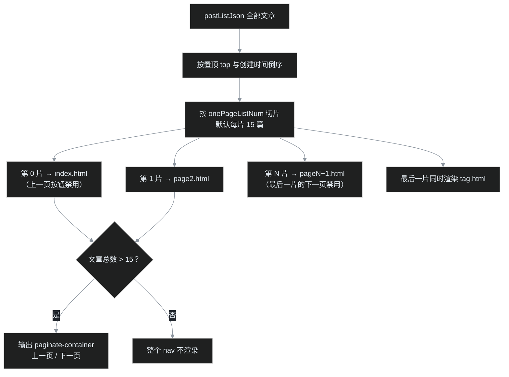
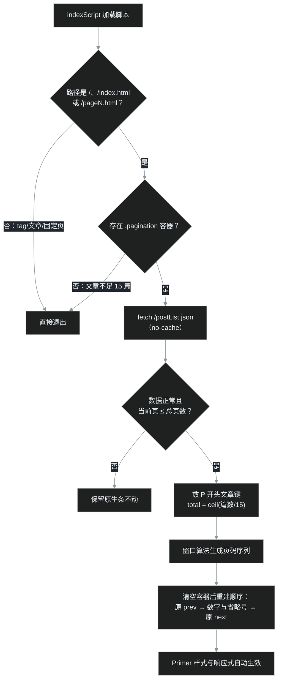

> 上一期 [G12](/post/19.html) 接掉了 [issue #186](https://github.com/Meekdai/Gmeek/issues/186) 的头号需求（外链新标签页），这一期接第二个：**数字分页条**。写这篇的时候博客里有 17 篇文章——恰好越过框架的 15 篇分页线，首页底部刚刚长出原生的"上一页/下一页"，素材是现成的。

## 先说要解决什么

文章超过 15 篇以后，列表页底部自动出现了框架原生的分页条。能用，但它只有两个按钮：

- 读者不知道自己在**第几页、一共几页**；
  - 最早的那批文章（比如[第 1 篇](/post/1.html)）沉在第二页，想翻到它只能点"下一页"，文章再多就是一路点过去；
- 搜索引擎也一样：深层文章距首页的"点击深度"随页数线性增长，而数字页码能让任意一页都离首页只有一下。

所以经典的数字分页条长这样：`上一页 1 … 4 5 6 … 10 下一页`——首尾页直达、当前页高亮、远处的页码折叠成省略号。GitHub 自己的 issue 列表底部就是它。

## 调研记：社区插件失联了

做之前叶扬照例先找轮子。总揽 #5 里登记过社区方案：李轶凡同学的《[给博客添加数字分页条](https://blog.liyifan.xyz/post/gei-bo-ke-tian-jia-shu-zi-fen-ye-tiao.html)》。G12 结尾也是这么预告的："接上并审一遍源码"。

然后叶扬开始了五连找：

1. 直接打开原文——域名 DNS 解析失败，站点打不开；
2. GitHub 搜作者的用户名，仓库还在，但仓库里只剩一个 README，源码文件已经不在了；
3. 翻官方 [issue #167](https://github.com/Meekdai/Gmeek/issues/167) 的评论区，没有可用的分页方案；
4. Wayback Machine 查历史存档，查不到该页面的快照；
5. GitHub 全站代码搜索 `onePageListNum`（框架分页的配置名），零结果。

原文链接叶扬仍然放在文末参考里——想法是人家先提的，出处要给。但源码确实拿不到了，**这一期从"接社区插件 + 审源码"临时改成"自研"**。好处是：自己写就得把框架分页的每一个细节都搞懂，等于白捡一节源码课。

## 源码课：框架是怎么分页的

分页逻辑在构建脚本的 `createPlistHtml` 里，叶扬把它翻完以后画成了图：



几个值得记住的实锤点：

1. **每片 15 篇**来自默认配置 `onePageListNum: 15`（可以在自己的 config.json 里覆盖）。切片前文章先按 `(置顶, 创建时间)` 倒序，所以最新文章永远在 index.html；
2. **第 0 页叫 `index.html`**（不是 page1.html），从第 1 片开始才叫 `page2.html`、`page3.html`……数字从 2 起算，第一次读源码时这里很容易看错；
3. 上一页/下一页的禁用态不是样式装饰，而是标签都换了：可点时是 `<a rel="next">`，到头时是 `<span aria-disabled="true">`；
4. **tag 标签页是个"搭车客"**：它直接复用最后一片文章渲染，但用的是另一套模板 `tag.html`；
5. 文章不足 15 篇时，整个分页 nav 连渲染都不渲染——这一点直接决定了插件的自退策略（后面讲）。

当前线上的真实 HTML（首页）长这样：

```html
<nav class="paginate-container" aria-label="Pagination">
  <div class="pagination">
    <span class="previous_page" aria-disabled="true">上一页</span>
    <a class="next_page" rel="next"
       href="https://yeyangchen2009.github.io/page2.html"
       aria-label="Next Page">下一页</a>
  </div>
</nav>
```

注意：可见文字已经是 i18n 汉化过的"上一页/下一页"，但容器和按钮的 `aria-label` 还是英文（`Pagination`、`Next Page`）——读屏用户听到的仍是英文，这个小尾巴稍后由插件收掉。

## 插件放哪儿：indexScript 登场

前六个自研/接入插件都挂在 config.json 的 `script` 字段里，但那个字段**只注入文章页和固定页**，列表页（首页和 pageN）拿不到。翻框架源码和模板可以确认，配置里还有一对专门给列表页用的字段：

| 配置字段 | 注入位置 | 本系列的使用者 |
| --- | --- | --- |
| `allHead` | 全站所有页面的 `<head>` | GmeekVercount 计数 |
| `head` / `style` | 文章页头部 | — |
| `script` | 文章页、固定页的底部 | TOC、灯箱、上一篇下一篇、阅读时长、归档、外链 |
| **`indexScript` / `indexStyle`** | **只有列表页**（index.html、pageN.html） | **G13 首次使用** |

`indexScript` 在列表页模板的脚本区末尾输出（模板第 144 行），而 `tag.html` 不含这行——连标签页都不注入。作用域收得非常死，正合"列表页插件"的身。于是 config.json 只加一行：

```json
"indexScript": "<script src='/plugins/GmeekPager.js'></script>"
```

> 老规矩：改了 config.json 必须手动 `workflow_dispatch` 做一次全局重建，等构建 checkout 到最新提交再触发，别让它拿旧 SHA 白跑。

## 意外之喜：Primer 把数字分页的样式全包了

动手写 CSS 之前，叶扬先把站点引的 Primer 21 样式表整份拉下来翻了一遍——然后发现：**数字分页需要的一切样式 Primer 早就写好了**，框架的"上一页/下一页"只是恰好只用上了其中两个类。关键规则（删掉压缩格式后整理如下）：

```css
/* 所有分页子元素都是 32px 最小宽度的小方块按钮 */
.pagination a, .pagination span, .pagination em {
  min-width: 32px; padding: 5px 10px;
  border: 1px solid transparent; border-radius: 6px;
  color: var(--fgColor-default, var(--color-fg-default));
  text-align: center; cursor: pointer;
}
/* 当前页：蓝底白字，:hover 也保持（选择器自带 :hover） */
.pagination .current,
.pagination [aria-current]:not([aria-current=false]) {
  color: var(--fgColor-onEmphasis);
  background-color: var(--bgColor-accent-emphasis);
}
/* 省略号：禁用色、无边框、默认光标 */
.pagination .gap, .pagination [aria-disabled=true] {
  color: var(--fgColor-disabled); cursor: default;
}
```

更妙的是它连**响应式显隐**都内建了，靠的是子元素位置而不是类名：

```css
.pagination > * { display: none; }                 /* 默认全藏 */
.pagination > :first-child,
.pagination > :last-child,
.pagination > .previous_page,
.pagination > .next_page { display: inline-block; } /* 只露首尾：上一页、下一页 */
@media (min-width: 544px) {
  .pagination > :nth-child(2),
  .pagination > :nth-last-child(2),
  .pagination > .current,
  .pagination > .gap { display: inline-block; }     /* 平板再露首尾页码、当前页、省略号 */
}
@media (min-width: 768px) {
  .pagination > * { display: inline-block; }        /* 桌面全显 */
}
```

以第 5 页/共 10 页为例，同一段 DOM 在三种屏幕上的效果：

| 屏宽 | 读者看到 |
| --- | --- |
| 手机（<544px） | `上一页 下一页` |
| 平板（544–767px） | `上一页 1 … 5 … 10 下一页` |
| 桌面（≥768px） | `上一页 1 … 4 5 6 … 10 下一页` |

这带来一条严格的** DOM 顺序纪律**：上一页必须是第一个子元素（`:first-child`）、下一页必须是最后一个（`:last-child`），数字页码一律夹在中间。顺序错了，手机端的隐藏规则就会误伤。

结论：**这个插件零行自定义 CSS**，活只有一件——把正确的 DOM 按正确的顺序拼出来。颜色全部走 Primer 变量，明暗主题自动跟随，连 G08/G09 那套 `html[data-color-mode="dark"]` 的操心都省了。

## 插件实现

### 设计要点

1. **URL 守卫 + 容器守卫双保险**。只在 `/`、`/index.html`、`/pageN.html` 上干活；再查 `.paginate-container .pagination` 是否存在——文章不足 15 篇时框架根本不渲染这个容器，插件直接退出。所以新博客从第一天就可以挂这个插件，零副作用；
2. **总页数问数据，不猜 DOM**。fetch `/postList.json` 数文章键，`Math.ceil(篇数 / 15)` 得到总页数。这里有个 G10 就打过交道的老坑：postList.json 里混着一个非文章键 `labelColorDict`（标签颜色字典）。用 `/^P\d+$/` 正则 + 要求 `postUrl` 非空，双保险过滤；
3. **窗口算法**：总页数 ≤ 7 时全部铺开（两三个页码还折叠纯属矫情）；更多时，首页、末页常驻，当前页两侧各露一页，跨度大于 1 的地方插一个省略号。例如第 5 页/共 10 页得到序列 `1, …, 4, 5, 6, …, 10`；
4. **只增建，不重建**。框架给的"上一页/下一页"节点原样保留——用 `appendChild` 把它们移动回新顺序的首尾。这么做是因为原生节点上带着值钱的东西：`rel="next"`/`rel="previous"`（搜索引擎认得的分页关系）、绝对 URL 的 href、禁用态、Primer 的 clip-path 箭头。自己重建等于把这些责任全揽过来，纯属给自己制造 bug；
5. **语义化**：当前页用 `<em class="current" aria-current="page">`（Primer 对 `.current` 和 `aria-current` 双选择器都给蓝底），不可点所以不用 `<a>`，避免自引用链接；省略号 `<span class="gap" aria-hidden="true">` 不让读屏念"点点点"；每个数字链接带 `aria-label="第 N 页"`；顺手把容器和可点按钮的英文 aria-label 汉化成"分页/上一页/下一页"（禁用的 span 没有 aria-label，也不给它加，避免和可见文本重复朗读）；
6. **三种"什么都不做"**：单页博客（`total < 2`）、URL 页码超出总页数（`current > total` 的防御）、fetch 失败——全部保持原生条不动。网络挂了读者至少还能用原生的上一页/下一页。

### 运行时流程



### 完整源码

`static/plugins/GmeekPager.js`，全文 90 行左右，零依赖：

```javascript
/* GmeekPager —— 列表页数字分页条
 * 作用域：首页 /、/index.html 与 /pageN.html（config 的 indexScript 只注入列表页 plist）
 * 数据源：/postList.json，按 /^P\d+$/ 过滤掉 labelColorDict 等非文章键，每 15 篇一页
 * 做法：完整保留框架原生的“上一页/下一页”节点（属性、箭头、禁用态都不动），
 *       在中间插入 GitHub 风格数字页码；按钮样式、当前页蓝底、省略号与三档
 *       响应式显隐全部复用 Primer 21 内建的 .pagination 规则，零自定义 CSS：
 *       手机(<544px)只露上下页；平板(544–768px)露首尾页码与当前页；桌面全显。
 * 降级：文章不足一页时框架不渲染 nav（插件直接退出）；fetch 失败或数据异常时
 *       保持框架原生“上一页/下一页”条不动，不影响翻页。
 */
(function () {
    var m = location.pathname.match(/\/page(\d+)\.html$/);
    var isHome = /(?:^\/$)|\/index\.html$/.test(location.pathname);
    if (!m && !isHome) return;
    var current = m ? parseInt(m[1], 10) : 1;

    var box = document.querySelector('.paginate-container .pagination');
    if (!box) return;

    var ONE_PAGE = 15; // Gmeek 默认 onePageListNum；若在 config.json 改过需同步改这里

    fetch('/postList.json', { cache: 'no-cache' })
        .then(function (r) {
            if (!r.ok) throw new Error('HTTP ' + r.status);
            return r.json();
        })
        .then(function (list) {
            var count = 0;
            Object.keys(list).forEach(function (k) {
                if (/^P\d+$/.test(k) && list[k] && list[k].postUrl) count++;
            });
            var total = Math.ceil(count / ONE_PAGE);
            if (total < 2 || current > total) return; // 单页或数据异常，保留原生条

            var prev = box.querySelector('.previous_page');
            var next = box.querySelector('.next_page');
            if (!prev || !next) return;

            var nav = box.closest('nav');
            if (nav) nav.setAttribute('aria-label', '分页');
            // 可见文字已是中文，原生按钮的英文 aria-label 顺手汉化（只改可点按钮）
            if (prev.getAttribute('aria-label')) prev.setAttribute('aria-label', '上一页');
            if (next.getAttribute('aria-label')) next.setAttribute('aria-label', '下一页');

            box.textContent = '';
            box.appendChild(prev);
            buildSequence(current, total).forEach(function (item) {
                box.appendChild(renderItem(item, item === current));
            });
            box.appendChild(next);
        })
        .catch(function () { /* 网络失败：原生上一页/下一页原样保留 */ });

    // 首页、末页常驻；当前页两侧各一页；跨度大于 1 的空档用省略号折叠；
    // 总页不多（≤7）时全部铺开，省略号只在真正需要时出现
    function buildSequence(cur, total) {
        if (total <= 7) {
            var all = [];
            for (var k = 1; k <= total; k++) all.push(k);
            return all;
        }
        var nums = [];
        for (var n = 1; n <= total; n++) {
            if (n === 1 || n === total || (n >= cur - 1 && n <= cur + 1)) nums.push(n);
        }
        var out = [];
        for (var i = 0; i < nums.length; i++) {
            if (i > 0 && nums[i] - nums[i - 1] > 1) out.push('gap');
            out.push(nums[i]);
        }
        return out;
    }

    function renderItem(item, isCurrent) {
        if (item === 'gap') {
            var gap = document.createElement('span');
            gap.className = 'gap';
            gap.setAttribute('aria-hidden', 'true');
            gap.textContent = '…';
            return gap;
        }
        if (isCurrent) {
            var cur = document.createElement('em');
            cur.className = 'current';
            cur.setAttribute('aria-current', 'page');
            cur.textContent = String(item);
            return cur;
        }
        var a = document.createElement('a');
        a.href = item === 1 ? '/' : '/page' + item + '.html';
        a.setAttribute('aria-label', '第 ' + item + ' 页');
        a.textContent = String(item);
        return a;
    }
})();
```

两个链接细节：第 1 页的 href 用 `/`（比 `/index.html` 更短，也和读者心智一致），其余是 `/pageN.html`；都用根相对路径，不写死域名，换域名零成本。

## 验证：这次差点被自己的测试骗了

运行时插件 curl 只能验"有没有注入"，逻辑照旧用 node 验。叶扬在 vm 沙箱里造了 `location`、`document`、`fetch` 三件套的 DOM 桩，直接跑磁盘上的插件源码，前前后后写了 **25 条断言**，覆盖：

| 场景 | 期望结果 |
| --- | --- |
| 本站真实数据：17 篇、首页 | `[1] 2`，上一页禁用、下一页可点，原生节点引用不变 |
| 17 篇、page2 | `1 [2]`，保留框架的绝对 URL prev |
| 140 篇、第 5 页 | `1 … 4 [5] 6 … 10`，两个省略号均 `aria-hidden` |
| 第 1 页/末页/总页数 7 | 边界窗口正确；≤7 页时全部铺开无省略号 |
| 15 篇/16 篇/45 篇 | 整除不产生空页、余数页正确、单页不动 DOM |
| tag/文章页/固定页 | 直接退出，**一次 fetch 都不发** |
| fetch 失败、页码超界 | 原生条原样保留 |
| 脏键 `labelColorDict`、空 `postUrl` 的 P 键 | 都不参与计数 |

另外又用**线上真实的 postList.json**端到端跑了一遍：17 篇 → 总页数 2 → 首页 `[1] 2`、page2 `1 [2]`。

过程中踩了两个值得记的坑：

1. **桩里 `a.href = '...'` 没反射到 attribute**。真实 DOM 中属性赋值会同步到 HTML 属性，而自制桩对象里 `href` 和 `attrs` 字典是两张皮，导致 `getAttribute('href')` 读出来全是 null，红了一片——红的是测试桩，不是插件。G12 的教训刚记下（桩要注入插件用到的全部浏览器全局，否则插件静默死亡、否定断言假通过），这次是它的变体：**桩对 DOM 语义的模拟也得保真**；
2. **异步断言抢跑**。第一版真实数据驱动里，`runPage()` 之后立刻读 DOM，fetch 的 Promise 链还在微任务队列里没执行，结果输出"只有上一页/下一页"，差点以为插件没生效。补了一个 `await tick()` 就好。写异步插件测试，断言前必须给微任务排队的机会。

线上验证分两层：curl 看到 index.html/page2.html 的构建产物里都正确注入了 `<script src='/plugins/GmeekPager.js'>`，而 tag.html **没有**（证明 indexScript 作用域精确）；构建产物里的分页 HTML 本身原封不动——数字页码是浏览器端运行时渲染的，源码对爬虫保持简洁，无 JS 环境或抓包看到的仍是稳妥的原生条。

## SEO 收益

数字分页不只是体验优化：它让**任意列表页到首页的点击距离恒为 1**。原生"下一页"时代，第 10 页的文章要顺着十次链接才能被爬到；数字条上线后，爬虫（和读者）在首页就能发现 page10 的链接。配合 G04 的 sitemap，深层文章的发现路径又多了一条。当前页用 `<em>` 而非 `<a>`，避免自引用链接稀释；原生节点上的 `rel="next"/"previous"` 原样保留，分页关系语义不丢。

## 小结

一篇"借鉴失败"逼出来的自研，最后反而做得比照抄更踏实：框架分页的切片规则、`indexScript` 的精确作用域、Primer 内建的数字分页样式与三档响应式，全是在"找不到轮子"以后才一个个从源码里抠实的。插件本体 90 行，自定义 CSS 0 行——剩下的工作全是读懂约定、然后顺着约定走。

下一期 G14 换个战场到手机上：桌面端的 TOC 目录在小屏一直缺席，叶扬准备接官方的 articletoc 插件，聊聊"桌面/小屏两套目录如何用响应式和平共处"。

## 参考

- 需求出处：[issue #186 提一些需求](https://github.com/Meekdai/Gmeek/issues/186)
- 社区思路出处（写作时站点已失联，链接存档致敬）：李轶凡《[给博客添加数字分页条](https://blog.liyifan.xyz/post/gei-bo-ke-tian-jia-shu-zi-fen-ye-tiao.html)》
- 分页样式来源：[Primer CSS Pagination](https://primer.style/css/components/pagination)（站点引用版本 21.0.7）
- 本站插件源码：[GmeekPager.js](https://github.com/yeyangchen2009/yeyangchen2009.github.io/blob/main/static/plugins/GmeekPager.js)
- 相关前作：[G04 SEO 与 sitemap](/post/10.html)、[G10 时间线归档页](/post/17.html)（postList.json 与 labelColorDict）、[G12 外链新标签页](/post/19.html)
- 系列总揽：[Gmeek 插件与功能全景调研（第 0 篇）](/post/5.html)
