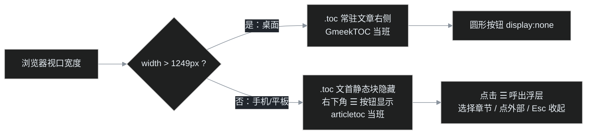

> 上一期 [G13](/post/20.html) 给列表页装上了数字分页条，这一期换个战场到手机上。博客的文章越写越长，桌面端右侧一直有常驻目录（GmeekTOC），但小屏读者想跳章节时只能埋头猛滑——本期接入官方仓库收录的 **articletoc** 插件，并解决它和桌面目录"官方只让二选一"的问题。

## 小屏上的目录现状

先纠正一个想当然的误会。叶扬一开始以为"手机上没有目录"，读了 GmeekTOC 的源码才发现不是——它自带一条媒体查询：

```css
@media (max-width: 1249px) {
    .toc {
        position: static;   /* 从右侧固定定位退化成普通文档流 */
        top: auto;
        left: auto;
        transform: none;
        margin-bottom: 20px;
    }
}
```

也就是说，屏幕窄于 1250px 时，右侧常驻目录会变成一块普通卡片，插在**文章正文的最前面**。它确实能用，但读长文的体验是：读到第六节想跳回第二节？先把文章滑回顶部，找到目录，点一下，再滑下来。目录从"随时可用的导航"退化成了"文章开头的一个大纲"。

理想形态是手机 App 常见的那种：右下角一颗圆形 ☰ 按钮，随时呼出浮层目录，选完即走。官方仓库恰好有这么一个插件。

## 官方 articletoc：Tiengming 的圆形按钮

官方进阶插件教程里，GmeekTOC 后面紧接着介绍了 articletoc：

> articletoc：在右下角有个圆形按钮。本插件由 Tiengming 编写，也是一个非常不错的 TOC 目录插件。配置方式和上面一样，只需要替换地址即可。

机制很简单：

1. 页面加载后扫描 `.markdown-body`（就是 `#postBody` 正文容器）里的 `h1`–`h6`；
2. 在正文末尾放一个 `.toc` 浮层（默认透明、不可见）；
3. 在 `<body>` 上放一颗 `.toc-icon` 圆形 ☰ 按钮固定在右下角；
4. 点按钮，浮层带淡入缩放动画展开，图标变 ✖；再点或点浮层外部收起。

但"**替换地址**"这四个字值得留意——官方的意思是 GmeekTOC 和 articletoc **二选一**，没让它们共存。叶扬把两份源码摆在一起对照，立刻明白了原因。

## 审源码：为什么官方只让二选一

### 冲突一：类名同名，样式连坐

两个插件给各自浮层起的类名**都叫 `.toc`**，articletoc 的样式表是无差别命中的：

```css
.toc {
    position: fixed;
    bottom: 60px;
    right: 20px;
    opacity: 0;              /* ← 麻烦在这 */
    visibility: hidden;     /* ← 还有这 */
    transform: translateY(20px) scale(0.9);
    /* ... */
}
.toc.show { opacity: 1; visibility: visible; }
```

如果两个插件同时加载，页面上会有两个 `<div class="toc">`：GmeekTOC 那个（桌面右侧常驻目录）和 articletoc 那个（浮层）。articletoc 的样式表后注入 `<head>`，同特异性选择器按源顺序胜出——于是**桌面常驻目录被 `opacity:0;visibility:hidden` 一起藏掉了**。这就是"二选一"的技术根因：不是功能互斥，是命名空间撞车。

### 冲突二：暗色主题靠系统偏好，与站点三态主题失配

articletoc 的暗色方案是：

```css
@media (prefers-color-scheme: dark) {
    :root { --toc-bg: #2d333b; --toc-border: #444c56; /* ... */ }
}
```

这个坑本系列在 [G08](/post/14.html) 已经踩过并记录在官方 [issue #196](https://github.com/Meekdai/Gmeek/issues/196)：站点主题是"亮色 → 暗色 → 跟随系统"三态切换，存 localStorage。读者**手动选了暗色、但系统是亮色**时，媒体查询判定为亮色，浮层就是白底配深色页面；反之亦然。结论早已确立：本站插件一律用 Primer CSS 变量（`--color-canvas-default` 这一族），让浮层跟随同一个 `html[data-color-mode]` 钩子，零媒体查询。

### 冲突三：健壮性缺口

对照 GmeekTOC 再细看，articletoc 原版还有几处小缺口：

- **没有空标题守卫**。GmeekTOC 发现正文一个标题都没有会直接 `return`；articletoc 照样创建浮层和按钮——在本站的[归档页](/archive.html)（正文只有一个挂载点 div、没有任何标题）上，读者会看到一颗按钮，点开是个空盒子；
- **点目录链接后浮层不收起**。手机上点完章节，浮层还挡在右下角；
- 没有 Esc 关闭，图标没有 `role`/`aria-label`/`aria-expanded`，键盘用户和读屏用户无法操作。

问题都不大，但既然要接，就一次收拾干净。

## 适配：让两个 TOC 和平共处

改动集中在四处，思路与 G08 以来的自研插件守则一脉相承：

**① 类名隔离。** 浮层改名 `.toc-mobile`、按钮 `.toc-mobile-icon`、展开态 `.is-show`。这样两套样式表的选择器完全不交叉——articletoc 的规则再也不会命中 GmeekTOC 的元素，反之亦然（GmeekTOC 里的 `.toc a` 也不会误中浮层链接）。

**② Primer 变量换肤。** 浮层底用 `--color-canvas-overlay`（带 `--color-canvas-default` 兜底）、边框 `--color-border-default`、正文 `--color-fg-default`、悬停 `--color-accent-subtle`、阴影直接用 `--color-shadow-large`/`--color-shadow-medium`。按钮默认是描边圆形小图标，展开时变 `--color-accent-emphasis` 蓝底白字。三态主题自动跟随，一行媒体查询都不用写。

**③ 按屏宽分工，断点严格对齐。** 这是共存方案的核心——以 GmeekTOC 自带的 1249px 为界：



实现只有两条规则：按钮默认 `display:none`，在 `@media (max-width:1249px)` 里才 `display:flex`；同一媒体查询里把 GmeekTOC 退化出的文首静态块 `.toc { display: none; }` 藏掉——**两个目录在任何屏宽下都只留一个**，不重复占位。

**④ 健壮性与可访问性补齐。** 找不到 `.markdown-body` 或正文没有标题时静默退出（归档页于是干干净净）；防重复注入；点目录链接、点浮层外部、按 Esc 都会收起；图标加 `role="button"`、`tabindex="0"`、`aria-label="文章目录"`、`aria-expanded` 随开合翻转，并响应 Enter/Space。

## 一个隐形成就：两套插件共享同一批锚点

还有个必须验证的兼容点。两个插件都会给标题补 id，用的算法一字不差：

```javascript
heading.id = heading.textContent.trim().replace(/\s+/g, '-').toLowerCase();
```

而 GitHub 的 GFM 渲染接口输出的标题**本身不带 id**（叶扬 curl 了线上文章确认，`<h2>` 就是光秃秃的 `<h2>`），所以 id 是两个插件在浏览器端现场生成的。共存时的顺序就很关键：config.json 里 GmeekTOC 排在最前、articletoc 在最后，两边都监听 `DOMContentLoaded`，按注册顺序执行——GmeekTOC 先扫一遍把 id 建好，articletoc 再扫时发现 `heading.id` 已存在就直接复用。哪怕顺序反过来也没关系，算法相同，生成的 id 必然一致。

叶扬拿 G13 那篇 13 个标题的真实文章试跑了一遍生成算法：中文标题原样保留、英文转小写、空格转连字符（`indexScript 登场` → `indexscript-登场`、`SEO 收益` → `seo-收益`），**无重复 id**。

## 完整源码

`static/plugins/articletoc.js`，基于 Tiengming 原版适配，注释里逐条记录了改动：

```javascript
/* articletoc —— 小屏文章目录浮层
 * 原作者：Tiengming（Gmeek 官方仓库收录），本站在原版基础上做了四处适配：
 *   1. 类名隔离 .toc-mobile / .toc-mobile-icon（原版与 GmeekTOC 同名 .toc，
 *      两个插件同时加载时 CSS 互相污染——opacity:0 会把桌面常驻目录藏掉）；
 *   2. 配色全部换 Primer CSS 变量，跟随站点三态主题（原版 prefers-color-scheme
 *      在“手动暗色 + 系统亮色”时失配，见官方 issue #196）；
 *   3. 桌面（>1249px）隐藏圆形按钮交给 GmeekTOC；小屏（≤1249px）才显示按钮，
 *      同时隐藏 GmeekTOC 在小屏退化出的文首静态目录块，二者只留一个；
 *   4. 无正文/无标题时静默退出；点目录链接、点外部、按 Esc 都会收起浮层。
 * 锚点 id 算法与 GmeekTOC 完全一致，两个插件同页运行时复用同一批标题锚点。
 */
(function () {
    var body = document.querySelector('.markdown-body');
    if (!body) return;
    var headings = body.querySelectorAll('h1, h2, h3, h4, h5, h6');
    if (!headings.length || document.getElementById('tocMobilePanel')) return;

    injectStyle();

    var panel = document.createElement('div');
    panel.className = 'toc-mobile';
    panel.id = 'tocMobilePanel';
    Array.prototype.forEach.call(headings, function (h) {
        if (!h.id) h.id = h.textContent.trim().replace(/\s+/g, '-').toLowerCase();
        var a = document.createElement('a');
        a.href = '#' + h.id;
        a.textContent = h.textContent;
        a.style.paddingLeft = (parseInt(h.tagName.charAt(1), 10) - 1) * 10 + 'px';
        a.addEventListener('click', closePanel);
        panel.appendChild(a);
    });
    document.body.appendChild(panel);

    var icon = document.createElement('div');
    icon.className = 'toc-mobile-icon';
    icon.setAttribute('role', 'button');
    icon.setAttribute('tabindex', '0');
    icon.setAttribute('aria-label', '文章目录');
    icon.setAttribute('aria-expanded', 'false');
    icon.textContent = '☰';
    icon.addEventListener('click', function (e) {
        e.stopPropagation();
        togglePanel();
    });
    icon.addEventListener('keydown', function (e) {
        if (e.key === 'Enter' || e.key === ' ') { e.preventDefault(); togglePanel(); }
    });
    document.body.appendChild(icon);

    document.addEventListener('click', function (e) {
        if (panel.classList.contains('is-show') &&
            !panel.contains(e.target) && !icon.contains(e.target)) {
            closePanel();
        }
    });
    document.addEventListener('keydown', function (e) {
        if (e.key === 'Escape') closePanel();
    });

    function openPanel() {
        panel.classList.add('is-show');
        icon.classList.add('is-active');
        icon.textContent = '✖';
        icon.setAttribute('aria-expanded', 'true');
    }
    function closePanel() {
        panel.classList.remove('is-show');
        icon.classList.remove('is-active');
        icon.textContent = '☰';
        icon.setAttribute('aria-expanded', 'false');
    }
    function togglePanel() {
        if (panel.classList.contains('is-show')) closePanel();
        else openPanel();
    }

    function injectStyle() {
        var css = [
            '.toc-mobile{position:fixed;bottom:64px;right:20px;z-index:1000;',
            'width:250px;max-width:calc(100vw - 40px);max-height:70vh;overflow-y:auto;',
            'padding:10px;border-radius:8px;',
            'background:var(--color-canvas-overlay,var(--color-canvas-default));',
            'border:1px solid var(--color-border-default);',
            'box-shadow:var(--color-shadow-large);',
            'opacity:0;visibility:hidden;transform:translateY(12px) scale(.98);',
            'transition:opacity .25s ease,transform .25s ease,visibility .25s;}',
            '.toc-mobile.is-show{opacity:1;visibility:visible;transform:translateY(0) scale(1);}',
            '.toc-mobile a{display:block;color:var(--color-fg-default);text-decoration:none;',
            'font-size:14px;line-height:1.5;padding:5px 4px;',
            'border-bottom:1px solid var(--color-border-muted);}',
            '.toc-mobile a:last-child{border-bottom:0;}',
            '.toc-mobile a:hover{background:var(--color-accent-subtle);border-radius:4px;}',
            '.toc-mobile-icon{position:fixed;bottom:20px;right:20px;z-index:1001;',
            'width:42px;height:42px;border-radius:50%;display:none;',
            'align-items:center;justify-content:center;font-size:20px;cursor:pointer;',
            'user-select:none;-webkit-tap-highlight-color:transparent;',
            'color:var(--color-accent-fg);background:var(--color-canvas-default);',
            'border:1px solid var(--color-border-default);',
            'box-shadow:var(--color-shadow-medium);',
            'transition:transform .25s ease,background .2s ease,color .2s ease,border-color .2s ease;}',
            '.toc-mobile-icon:hover{transform:scale(1.08);}',
            '.toc-mobile-icon:active{transform:scale(.92);}',
            '.toc-mobile-icon.is-active{color:#ffffff;',
            'background:var(--color-accent-emphasis);border-color:var(--color-accent-emphasis);}',
            /* 断点与 GmeekTOC 的 @media(max-width:1249px) 完全对齐：
               小屏隐藏它退化出的文首静态目录块，改由右下角浮层接管 */
            '@media (max-width:1249px){',
            '.toc{display:none;}',
            '.toc-mobile-icon{display:flex;}}'
        ].join('');
        var style = document.createElement('style');
        style.id = 'tocMobileStyle';
        style.textContent = css;
        document.head.appendChild(style);
    }
})();
```

配置照旧拼在 config.json 的 `script` 字段末尾（注意不是 G13 那个 `indexScript`——目录是文章页的事）：

```json
"script": "<script src='/plugins/GmeekTOC.js'></script>...<script src='/plugins/articletoc.js'></script>"
```

## 验证

老规矩，curl 只能验注入，逻辑用 node 桩。这次写了 **36 条断言**：

1. **作用域守卫**：无 `.markdown-body` 不建任何节点；正文无标题不建浮层和按钮（归档页场景）；重复执行不重复注入；
2. **锚点兼容**：三个标题（无 id 的 h2、无 id 的 h3、已有自定义 id 的 h2）一起扫描——前两个按算法补 id（`第一节`、`小节-a`），第三个的 `custom-id` 原样保留，链接 href 全部对上；h2/h3 的左缩进分别是 10px/20px；
3. **开合逻辑**：点 ☰ 展开（浮层 `is-show`、图标变 ✖、`aria-expanded=true`），再点收起；点目录内链接收起；展开态点外部收起、点浮层内部不收起；Esc 收起而其他键不影响；图标聚焦时 Enter/Space 可切换；
4. **样式隔离**：注入的 CSS 里没有任何 `prefers-color-scheme`；八个 Primer 变量齐全；对桌面 `.toc` 只有小屏下的 `display:none` 一条声明，**没有** opacity/visibility 之类会误伤的属性；浮层类名与 GmeekTOC 完全不交叉。

桩又抓到一次"假红"：第一版桩给节点补的 `href` 赋值没有反射到 attribute（和 G13 同款——真实 DOM 里 `a.href = x` 会同步到 HTML 属性），导致两条 href 断言报 null。红的是测试桩不是插件，用 `Object.defineProperty` 补上反射后全绿。

线上验证注入作用域（`script` 字段的边界）：

| 页面 | articletoc 注入 |
| --- | --- |
| 普通文章 `/post/20.html` | ✅ |
| 固定页 `/about.html`、`/archive.html` | ✅（archive 运行时无标题自退） |
| 首页 `/`、`/page2.html`、`/tag.html` | ❌（列表页走 `indexScript`，不注入文章插件） |

另外用 G13 真实文章的 13 个标题离线跑了 id 生成，零重复。

## 已知局限

如果文章里有两个同名标题（比如两篇小结都叫"小结"），按 `textContent → id` 的算法会得到两个相同的 id，锚点都指向第一个。这是 GmeekTOC 与 articletoc 的共同行为，本站目前没有重名标题，暂时不修；真要修就给 id 加序号后缀（`小结`、`小结-2`），两个插件得同步改、同步部署——先记账。

## 小结

这一期没有新造轮子，做的是"让两个官方轮子同轴转动"： articletoc 原版本身写得很轻巧，真正的拦路虎只有一个——**插件之间没有命名空间约定，`.toc` 这种大众类名必然撞车**。类名一加前缀、配色一换 Primer 变量、断点一对齐，桌面 GmeekTOC 与小屏 articletoc 就各上各的班，读者毫无察觉。

至此文章页的目录体验在桌面和手机两端都补齐了。但叶扬发布后回头一看：G13 和本篇里精心画的 mermaid 流程图，居然全以原始代码的形态晾在页面上。下一期 G15 是一期插播的"翻车现场"——排查 mermaid 图表为什么没渲染的全过程，顺手做一个自动检测、按需加载的插件，再一路追查到 Gmeek 构建器本身的一个 bug，给上游提了人生第一个 PR。至于**滚动时目录自动高亮当前章节**（tocbot 本地化 + scrollspy）顺延到 G16，不跑题。

## 参考

- 原插件收录：[Gmeek 仓库 plugins/articletoc.js](https://github.com/Meekdai/Gmeek/blob/main/plugins/articletoc.js)（作者 Tiengming）
- 官方说明：[【Gmeek 进阶】插件功能的使用](https://blog.meekdai.com/post/%E3%80%90Gmeek-jin-jie-%E3%80%91-cha-jian-gong-neng-de-shi-yong.html)
- 主题失配佐证：[issue #196](https://github.com/Meekdai/Gmeek/issues/196)
- 本站适配源码：[articletoc.js](https://github.com/yeyangchen2009/yeyangchen2009.github.io/blob/main/static/plugins/articletoc.js)
- 相关前作：[G08 上一篇/下一篇](/post/14.html)（Primer 变量与三态主题）、[G13 数字分页条](/post/20.html)（indexScript 与 script 的边界）
- 系列总揽：[Gmeek 插件与功能全景调研（第 0 篇）](/post/5.html)
