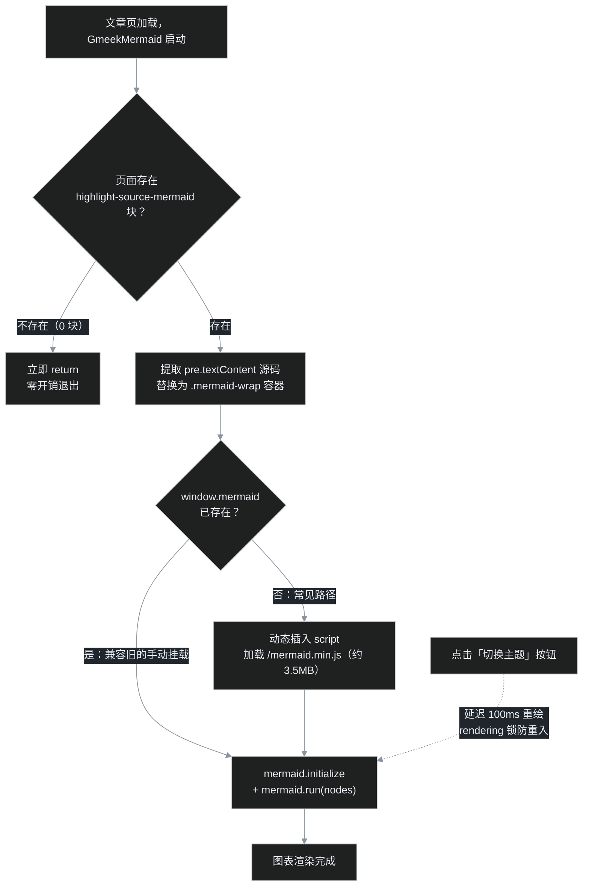
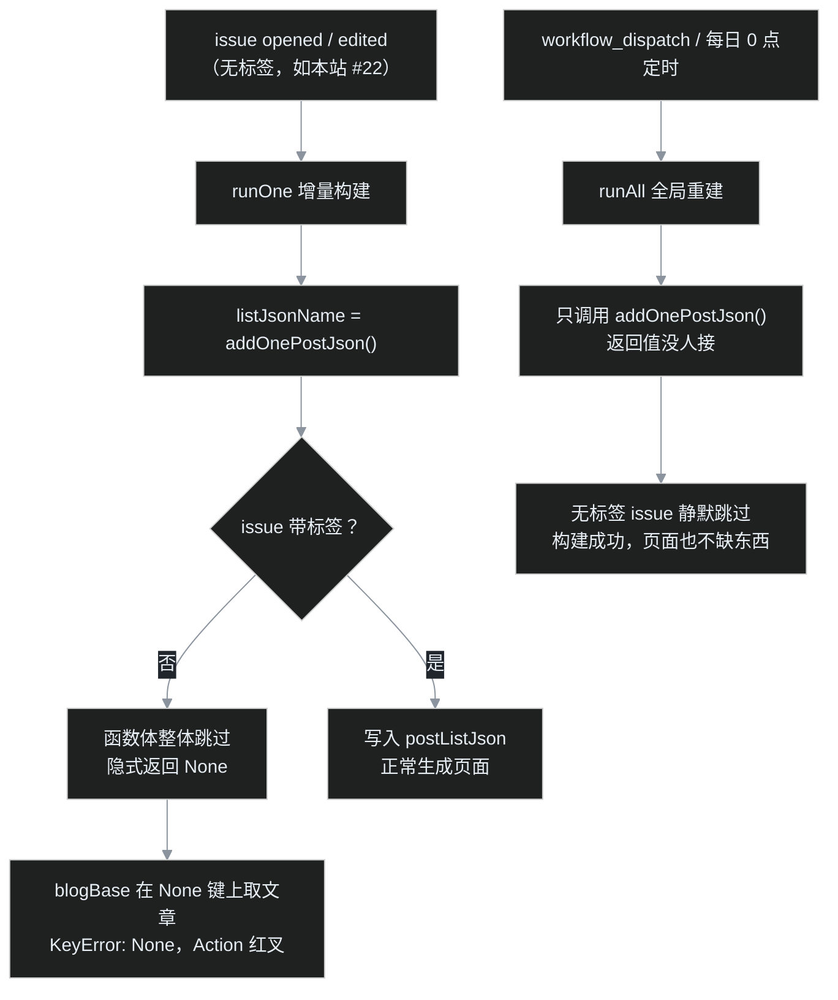

> 上一期 [G14](/post/21.html) 结尾，叶扬说文章页的目录体验已经在桌面和手机两端补齐。结果发布后回头一看，尴尬了：G13 和 G14 里精心绘制的 mermaid 流程图，在浏览器里全都以**原始代码**的形态晾着——节点、箭头、中文字符串，一字不落地展示给读者。这一期是插播的"翻车现场"：从两张没渲染的图开始，一路追到一个靠记性维持的旧机制，再追到 Gmeek 构建器自身的一个 bug，最后把修复回馈给了上游。全程没有苦大仇深，反而挺好玩的。

## 一、案发：两篇新文的流程图当众"裸奔"

先做对照实验。同一台浏览器、同一个主题下打开三篇文章：

| 文章 | mermaid 图数量 | 页面表现 |
| --- | --- | --- |
| [G07 写作三件套](/post/13.html) | 2 张 | ✅ 正常渲染 |
| [G13 数字分页条](/post/20.html) | 2 张 | ❌ 整块原始代码 |
| [G14 手机目录](/post/21.html) | 1 张 | ❌ 整块原始代码 |

把三个页面 curl 下来翻 `<script>`，差异一目了然：G07 的页面底部挂着 `mermaid.min.js` 和加载器，G13/G14 完全没有。浏览器又不会凭空认识 mermaid 语法，于是 GFM 给的语法高亮壳子 `<div class="highlight-source-mermaid">` 就直接露在了页面上——一个带高亮配色的代码块，仅此而已。

奇怪了，插件机制从 G08 用到 G14，script 字段拼接一直好好的，怎么单单 mermaid 出事？

## 二、根因：一个靠"记性"维持的机制

这要从 [G07](/post/13.html) 时代的方案说起。当时的考虑是：mermaid v11 的 `mermaid.min.js` 有约 **3.5MB**，绝不能为了几篇带图的文章让全站每篇都陪葬。所以方案是三件套：

1. 把 `mermaid.min.js` 和 30 行的 `mermaid-init.js` 放进 `static/`；
2. **只有含图的文章**，在正文最后一行用 [G06](/post/12.html) 教过的隐藏 JSON 挂载：

```html
<!-- ##{"script":"<script src='/mermaid.min.js'></script><script src='/mermaid-init.js'></script>"}## -->
```

3. Gmeek 构建时解析这最后一行，把脚本只注入这一篇。

G07 自己当然挂了，所以两张图安然无恙。而写 G13、G14 的时候，叶扬满脑子都是分页算法和类名隔离，**漏写了那最后一行 JSON**——两篇，全漏。

### 这个机制有三重脆弱

复盘下来，"作者记性好"居然是整个链路里唯一的保险丝：

**第一重：漏写没有任何报错。** 末行 JSON 解析套在 `try/except` 里（[Gmeek.py 的 postConfig 解析](https://github.com/Meekdai/Gmeek/blob/main/Gmeek.py#L356-L361)），解析失败就当这篇没有自定义配置，构建照样绿灯，页面只是默默不长图。绿灯给人一切正常的错觉。

**第二重：编辑器会偷偷加尾巴。** 这次还顺手二刷了 G06 记录过的尾换行坑：通过 `gh issue edit` 保存正文后，GitHub 会在 body 末尾补出 `\n\n`。构建器取的是"正文最后一行"，最后一行变成空行，JSON 就失效了——同样静默，同样无日志。这次是用 `xxd` 看字节才再次实锤的。

**第三重：机制和内容绑死。** "这篇有没有图"是正文内容的属性，却要作者在正文之外用一行隐晦 JSON 再声明一次。任何需要重复声明的事实，迟早会和事实本身脱节。

榜样其实就在框架里：数学公式从不需要作者挂任何脚本。Gmeek 在构建期扫描到 GFM 产物里的 `math-renderer` 标签，就自动给这一页注入 MathJax（[Gmeek.py:158 附近的注入逻辑](https://github.com/Meekdai/Gmeek/blob/main/Gmeek.py#L153-L181)）。作者写 `$E=mc^2$` 就够了，剩下的框架兜底。mermaid 缺的就是同样的待遇。

## 三、修复：把"记得挂脚本"改成"插件自己检测"

给上游提"构建期内建 mermaid"当然是一条路（后来也确实提了，见第六节），但远水解不了近渴，而且插件机制完全够用——把检测时机从构建期挪到浏览器端即可。新插件 `static/plugins/GmeekMermaid.js` 的工作流：



几个关键设计决策，挨个交代。

### 0 块立即退出：3.5MB 的经济学

插件挂进 config 的 `script` 字段后，**每篇文章和固定页都会加载它**。但插件本体只有几 KB，真正的大头是 mermaid 引擎。所以入口第一行就是检测：

```javascript
var nodes = document.querySelectorAll('div.highlight-source-mermaid');
if (!nodes.length) return;
```

纯文字文章、About 页、归档页，插件在解析阶段就退出了，绝不会去碰那 3.5MB。这是从 [G07](/post/13.html) 就立的规矩——按需付费，一点都不能破。

### 为什么选 `highlight-source-mermaid`

[G07](/post/13.html) 已经实测过 GitHub markdown API 的脾气：` ```mermaid ` 围栏块在网页编辑器里能出图，但对外的渲染 API 很克制，只做语法高亮，产物固定是：

```html
<div class="highlight highlight-source-mermaid">
  <pre class="notranslate"><code>flowchart LR ...</code></pre>
</div>
```

这个类名就是最可靠的探测信号，不依赖正文写法，老文章新文章一视同仁。取出 `<pre>` 的 `textContent` 再剥掉首尾空行，就是干净的图表源码。

### 动态加载的时序：Promise 包 onload

3.5MB 的脚本必须在确认有图之后才插入 `<script>`，而插入之后不能立刻渲染——脚本还没下载执行完。标准做法是用 Promise 包一下 `onload`/`onerror`，加载成功再进渲染流程，失败只 `console.error`，不连累页面其他功能。

### mermaid v11 的新 API 与两个参数

mermaid 10 以后的推荐用法不再是老教程里随处可见的 `mermaid.init()`，而是显式初始化 + 定点渲染：

```javascript
mermaid.initialize({
    startOnLoad: false,        // 关掉自动扫描，渲染权在自己手里
    theme: currentTheme(),     // 'dark' 或 'default'
    securityLevel: 'loose',    // 允许图表标签里的 HTML
    flowchart: { htmlLabels: true, useMaxWidth: true }
});
await mermaid.run({ nodes: document.querySelectorAll('.mermaid-wrap .mermaid') });
```

两个参数值得单独说：

- **`securityLevel: 'loose'`**：本站图表的节点文本里大量使用 `<br/>` 换行（比如 G13 的分页算法图）。默认的 `strict` 会把这些标签当纯文本转义显示，loose 才放行；
- **`useMaxWidth: true`**：宽图在手机上自动缩放到容器宽度，配合插件注入的 `.mermaid-wrap{overflow-x:auto}` 兜底，不会撑破排版。

### 三态主题：跟着 data-color-mode 走，重绘加锁

Gmeek 是亮 → 暗 → 跟随系统三态，老 [G08](/post/14.html) 起本站插件就立下规矩：只认 `html[data-color-mode]`，不用 `prefers-color-scheme`（手动暗色 + 系统亮色时媒体查询会失配，官方 [issue #196](https://github.com/Meekdai/Gmeek/issues/196) 有完整讨论）。mermaid 的主题是渲染时烤进 SVG 的，没法靠 CSS 变量自动换肤，只能监听主题按钮、点一下重画一遍：

```javascript
var switchBtn = document.querySelector('[title="切换主题"]');
if (switchBtn) switchBtn.addEventListener('click', function () { setTimeout(draw, 100); });
```

延迟 100ms 是等按钮的三态切换把 `data-color-mode` 改完；另外 `draw()` 开头有一把 `rendering` 布尔锁，防止快速连点导致两场渲染并发、mermaid 报"图正在渲染"的警告。

### 兼容旧的手动挂载

万一哪篇文章仍保留着 G07 式的末行 JSON，页面上 `window.mermaid` 已经存在，插件就不重复加载引擎，直接进入渲染。两套机制可以平滑交接，这也是 [G07](/post/13.html) 的末行 JSON 后来能够从容删除的原因——新插件在场，旧挂载只是多余、不会冲突。

## 四、完整源码

`static/plugins/GmeekMermaid.js`，85 行，零依赖（外层用四个反引号围栏，是因为源码注释里本身出现了三反引号的 mermaid 标记）：

````javascript
/* GmeekMermaid —— mermaid 图表自动检测、按需加载
 * 作用域：config 的 script 只注入文章页/固定页；插件先查
 *         div.highlight-source-mermaid（GitHub markdown API 对
 *         ```mermaid 围栏块的高亮产物），没有图表立即退出，零开销。
 * 有图表才动态加载 /mermaid.min.js（约 3.5MB，仅含图文章承担），
 * 随后提取源码、按站点明暗主题渲染；切换主题自动重绘。
 * 兼容旧的手动挂载（文章末行 JSON 自行引入 mermaid.min.js 的情形）：
 * 全局 mermaid 已存在则直接渲染、不重复加载。
 */
(function () {
    var nodes = document.querySelectorAll('div.highlight-source-mermaid');
    if (!nodes.length) return;

    injectStyle();

    // 先于任何渲染把高亮块换成自己的容器，提取纯文本图表源码
    var blocks = Array.prototype.map.call(nodes, function (node) {
        var pre = node.querySelector('pre');
        var src = (pre ? pre.textContent : node.textContent)
            .replace(/^\n+/, '').replace(/\n+$/, '');
        var wrap = document.createElement('div');
        wrap.className = 'mermaid-wrap';
        node.parentNode.replaceChild(wrap, node);
        return { wrap: wrap, src: src };
    });

    if (window.mermaid) {
        boot();
    } else {
        loadScript('/mermaid.min.js').then(boot).catch(function (e) {
            console.error('GmeekMermaid: mermaid.min.js 加载失败', e);
        });
    }

    function loadScript(src) {
        return new Promise(function (resolve, reject) {
            var s = document.createElement('script');
            s.src = src;
            s.onload = resolve;
            s.onerror = function () { reject(new Error('load fail: ' + src)); };
            document.head.appendChild(s);
        });
    }

    function injectStyle() {
        if (document.getElementById('gmeek-mermaid-style')) return;
        var style = document.createElement('style');
        style.id = 'gmeek-mermaid-style';
        style.textContent = '.mermaid-wrap{margin:18px 0;overflow-x:auto;}';
        document.head.appendChild(style);
    }

    function currentTheme() {
        return document.documentElement.getAttribute('data-color-mode') === 'dark'
            ? 'dark' : 'default';
    }

    var rendering = false;
    async function draw() {
        if (rendering) return;
        rendering = true;
        blocks.forEach(function (b) {
            b.wrap.innerHTML = '<pre class="mermaid"></pre>';
            b.wrap.firstChild.textContent = b.src;
        });
        mermaid.initialize({
            startOnLoad: false,
            theme: currentTheme(),
            securityLevel: 'loose',
            flowchart: { htmlLabels: true, useMaxWidth: true }
        });
        try {
            await mermaid.run({ nodes: document.querySelectorAll('.mermaid-wrap .mermaid') });
        } catch (e) {
            console.error('GmeekMermaid render error:', e);
        }
        rendering = false;
    }

    function boot() {
        draw();
        var switchBtn = document.querySelector('[title="切换主题"]');
        if (switchBtn) switchBtn.addEventListener('click', function () { setTimeout(draw, 100); });
    }
})();
````

配置方面，只是在 config.json 的 `script` 字段末尾按老规矩拼上第八个 `<script>`，不碰模板、不碰构建器。

### 19 条桩断言，以及"红的常常是测试桩"

插件没法靠 curl 验证（HTML 里只有注入标签，逻辑跑在浏览器里），叶扬照例用 Node 的 vm 模块搭了一个浏览器桩做断言：伪造的 `document`、伪造的 script 标签、伪造的 mermaid 对象，一共 19 条，覆盖无图退出、动态加载时序、亮暗主题参数、多图一次 run、切换主题重绘、引擎加载失败与图表语法异常不炸页面等路径。

过程中测试桩自己连错四次，值得记一笔，因为这是写浏览器插件桩的典型坑：

| 桩的毛病 | 假象 | 修法 |
| --- | --- | --- |
| 给桩元素赋 `s.src=...` 没反射到 `getAttribute('src')` | 误报插件没设置脚本地址 | 用 `Object.defineProperty` 让属性和 attribute 双向反射 |
| 桩的 `innerHTML` 赋值不会真的建子节点 | 插件读 `firstChild` 拿到 null，误报崩溃 | 桩里解析标签字符串，真的建出 children |
| 沙箱里始终没有全局 `mermaid` | 动态加载分支渲染时 ReferenceError | 模拟浏览器：在伪 script 的 `onload` 回调时刻才往全局注入 mermaid |
| `makeNode` 把所有节点 `tagName` 写死成 `DIV` | `<pre>` 相关断言全红 | 按传入标签赋真实 tagName |

教训一句话：**断言红了，先怀疑桩的浏览器语义不够保真，再怀疑插件。**

## 五、意外收获：无标签 issue 是天然的"站内工单"

修复的代码改动走了本站一个正式 PR（[#23](https://github.com/yeyangchen2009/yeyangchen2009.github.io/pull/23)），而记录这次事故的来龙去脉需要一个地方。叶扬没打算把排障日志写成文章刷读者的屏，于是新开了一个 issue（[#22](https://github.com/yeyangchen2009/yeyangchen2009.github.io/issues/22)），**故意一个标签都不打**。

这是读源码时就知道、这次第一次派上用场的冷知识：`addOnePostJson()` 的整个函数体都包在一个标签判断里——

```python
def addOnePostJson(self,issue):
    if len(issue.labels)>=1:
        ...   # 只有带标签的 issue 才会写入 postListJson、生成页面
```

无标签的 issue 不生成页面、不进文章列表、不进 RSS、不进 sitemap，却是仓库里一个能写正文、能被 PR 用 `Closes #22` 自动关闭、能在时间线上留痕的正经 issue。拿它当**站内工单 / CHANGELOG** 再合适不过：#22 完整记录了现象、对比表、修复方案和验收标准，PR 合并后被自动关闭，干净利落。

## 六、红叉追凶：工单反而咬了构建器一口

但 #22 上线的瞬间，Actions 页面飘来一个红叉。日志很短：

```
blogBase is exists and issue_number!=0, runOne
====== start create static html ======
  File "Gmeek.py", line 427, in runOne
    self.createPostHtml(self.blogBase[listJsonName]["P"+number_str])
KeyError: None
```

`KeyError: None`——有人拿 `None` 当字典的键去查了。顺着第五节的源码往下想，答案呼之欲出：

```python
def runOne(self,number_str):
    issue=self.repo.get_issue(int(number_str))
    if issue.state == "open":
        listJsonName=self.addOnePostJson(issue)          # 无标签 issue → 返回 None
        self.createPostHtml(self.blogBase[listJsonName]["P"+number_str])  # blogBase[None] → 崩
```

`addOnePostJson()` 对无标签 issue 隐式返回 `None`，而增量构建的 `runOne()` 拿到返回值不做判空，直接 `blogBase[None]`，必然抛异常。有意思的是**全局重建为什么从来不崩**：



`runAll()` 只调用、不使用返回值，无标签 issue 被静默跳过，于是全局构建反而"自愈"了。影响面也因此很小：红叉只停留在那一次增量构建的日志里，站点产物一个字节都没坏（无标签 issue 本来就不该有页面）。但红叉毕竟吓人，而且每个拿无标签 issue 当工单用、或者只是手滑忘了贴标签的用户都会撞上。

### 先搜 issue，别重复报告

叶扬没有急着开新 issue，而是先搜了一圈上游，果然三个相关的坑都有人占了：

| 上游 issue | 状态 | 叶扬补了什么 |
| --- | --- | --- |
| [#236 提交失败](https://github.com/Meekdai/Gmeek/issues/236) | OPEN，0 回复 | 楼主贴的报错堆栈和本站的一模一样，给出根因定位、最小复现（开一个无标签 issue 即触发）和 3 行守卫补丁——[评论原文](https://github.com/Meekdai/Gmeek/issues/236#issuecomment-5673058094) |
| [#180 mermaid渲染](https://github.com/Meekdai/Gmeek/issues/180) | OPEN | 楼主和另一位用户 wlkla 都在手写渲染脚本，遗留按需加载、主题切换、复制按钮等问题；贴出 GmeekMermaid 的完整方案与线上 demo，并建议作者对标 MathJax 做构建期自动检测——[评论原文](https://github.com/Meekdai/Gmeek/issues/180#issuecomment-5673070874) |
| [#100 能不能增加一个目录](https://github.com/Meekdai/Gmeek/issues/100) | OPEN | 分享 [G14](/post/21.html) 的双 TOC 类名隔离四改动，让官方 articletoc 与 GmeekTOC 能共存——[评论原文](https://github.com/Meekdai/Gmeek/issues/100#issuecomment-5673078011) |

补在对症的旧 issue 里比新开三个"我的也是"有价值得多：搜索的人顺着原帖就能看到完整分析。

## 七、第一个上游 PR

#236 是个零争议的健壮性缺陷，评论里叶扬也明确表示可以提 PR，于是动手：

1. fork `Meekdai/Gmeek`，新建分支 `fix/runone-no-labels-keyerror`；
2. 给 `runOne` 加 3 行空值守卫，语义向 `runAll` 看齐——无标签 issue 打印一行日志并跳过：

```python
listJsonName=self.addOnePostJson(issue)
if listJsonName is None:
    print("====== issue has no labels, skip ======")
    return
```

3. `python -m py_compile` 过语法，再用桩实例（替换掉 repo 和三个 create 方法）验证三种情形：无标签 open issue 跳过且不崩、有标签 open issue 的构建调用顺序不变、closed issue 保持原行为；
4. 提交 PR：[Meekdai/Gmeek#319](https://github.com/Meekdai/Gmeek/pull/319)，正文写清根因、复现、验证，`Closes #236`——合并后楼主的 issue 会被自动关闭。

提 PR 之前叶扬给自己定过一条筛选标准，这次正好检验：

| 候选改动 | 评估 | 处理 |
| --- | --- | --- |
| `runOne` 空值守卫 | 3 行、纯防御、行为只在原崩溃路径上变化、有现存 issue 背书 | ✅ 直接提 PR（#319） |
| articletoc 类名隔离 | 改大众类名 `.toc` 可能波及现有用户自定义样式，属设计取舍 | 只在 [#100](https://github.com/Meekdai/Gmeek/issues/100) 公开方案，等维护者接话 |
| mermaid 构建期自动检测 | 新特性、要动构建器，插件已能绕过 | 只在 [#180](https://github.com/Meekdai/Gmeek/issues/180) 留建议 |

开源世界里最容易被接受的贡献，往往不是"我给你加了个大功能"，而是"这里有个确定会崩的输入，这是最小修复，这是它不影响其他路径的证据"。上游是低频维护的个人项目（最后一次代码提交在半年前，但社区 PR 仍在被合并），能不能合、什么时候合都随缘；至少下一个撞上 `KeyError: None` 的人，搜到 #236 就能看见根因和可直接抄走的补丁。

## 八、验收

PR [#23](https://github.com/yeyangchen2009/yeyangchen2009.github.io/pull/23) 合并后做了一次全局重建，逐页 curl 核对：

| 页面 | 插件注入 | mermaid 块 | 实际行为 |
| --- | --- | --- | --- |
| [G07](/post/13.html) | 是 | 2 | 末行 JSON 已删除，全部转由自动加载器渲染 |
| [G13](/post/20.html) | 是 | 2 | 恢复渲染 |
| [G14](/post/21.html) | 是 | 1 | 恢复渲染 |
| [G12](/post/19.html)、About、归档 | 是 | 0 | 运行时自退，不加载 mermaid.min.js |
| 首页 / tag / pageN | 否 | — | `script` 字段不注入列表页，零负担 |

Network 面板可以亲自验证：纯文字文章不会发出 `mermaid.min.js` 的请求；含图文章加载一次后走浏览器缓存；明暗主题来回切，图表以对应配色重绘。

最后上一张实拍——第三节那张自动加载器工作流，在浏览器里按 GitHub Dark 配色完整渲染的样子（对比案发时"整块原始代码晾着"，就是这次修复前后的差别）：


## 小结

这次翻车的全部教训可以浓缩成一句话：**凡是需要人记住的约定，迟早会被遗忘；好的默认值应该让"什么都不做"就是对的。** G07 时代的手写挂载在"本站只有一篇带图文章"时是合理的权衡，但当带图文章变成三篇、五篇，它就从最佳实践变成了定时炸弹。自动检测、按需加载的插件把约定收回给了机器，作者重新回到"只管写 ` ```mermaid ` 就好"的状态。

意外彩蛋是那个红叉：一个为了记录 mermaid 事故而开的无标签工单，恰好亲手触发了上游构建器的隐藏 bug，最后变成了人生第一个上游 PR。开源精神不是什么宏大叙事，无非是：踩坑的时候多走一步，把路牌插在坑边——哪怕只是一条写清根因的评论。

下一期 G16 回到原计划：tocbot 本地化——把官方 GmeekTocBot 依赖的 cdnjs tocbot 4.27.4 请到 `static/` 落户，拿到滚动时目录自动高亮当前章节（scrollspy）的能力。

## 参考

- 本站工单：[#22 Mermaid 图表显示为原始代码](https://github.com/yeyangchen2009/yeyangchen2009.github.io/issues/22)；修复 PR：[#23](https://github.com/yeyangchen2009/yeyangchen2009.github.io/pull/23)
- 本站插件源码：[static/plugins/GmeekMermaid.js](https://github.com/yeyangchen2009/yeyangchen2009.github.io/blob/main/static/plugins/GmeekMermaid.js)
- 上游 PR：[Meekdai/Gmeek#319 runOne 空值守卫](https://github.com/Meekdai/Gmeek/pull/319)
- 上游相关 issue：[#236 提交失败（KeyError: None）](https://github.com/Meekdai/Gmeek/issues/236)、[#180 mermaid 渲染](https://github.com/Meekdai/Gmeek/issues/180)、[#100 文章目录需求](https://github.com/Meekdai/Gmeek/issues/100)、[#196 主题适配讨论](https://github.com/Meekdai/Gmeek/issues/196)
- mermaid 官方文档：[Usage（initialize / run API）](https://mermaid.js.org/config/usage.html)
- 前作：[G06 文章末尾的秘密](/post/12.html)、[G07 写作三件套](/post/13.html)、[G08 上一篇/下一篇](/post/14.html)、[G14 手机上的文章目录](/post/21.html)
- 系列总揽：[Gmeek 插件与功能全景调研（第 0 篇）](/post/5.html)

