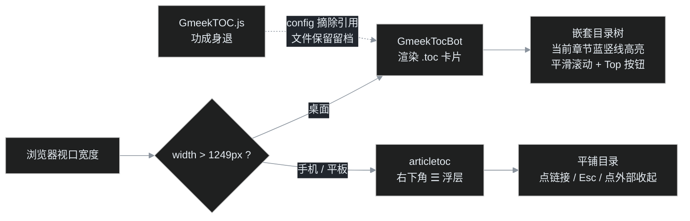

> [G14](/post/21.html) 给手机补上了 ☰ 浮层目录，[G15](/post/24.html) 是一期插播的翻车记，这一期回到目录话题，补上读者从 [G07](/post/13.html) 起就隐约期待的最后一块拼图：右侧目录虽然一直在，但它是"死"的——文章滚到第三节，目录不会告诉你。理想的长文导航应该"读到哪，亮到哪"，英文里有个很形象的名字叫 **scrollspy**（滚动间谍）。这一期把官方 GmeekTocBot 插件请下 CDN、落到本地，顺手让服役已久的 GmeekTOC 功成身退。你现在看到的右侧目录，已经是新插件渲染的成果——往下滚一滚，它会出卖你的阅读进度。

## 一、scrollspy：长文导航的及格线

"滚动高亮当前章节"并不是新概念。Bootstrap 很早以前就自带一个叫 [ScrollSpy](https://getbootstrap.com/docs/5.3/components/scrollspy/) 的组件：根据滚动位置自动给导航里对应的条目加 active 状态。Gmeek 官方插件清单里的 [GmeekTocBot](https://github.com/Meekdai/Gmeek/tree/main/plugins) 封装的就是干这件事最成熟的库之一——[tocbot](https://tscanlin.github.io/tocbot/)。

回顾客厅里现有的两位"目录住户"：

| 插件 | 桌面 | 小屏 | 目录形态 | scrollspy |
| --- | --- | --- | --- | --- |
| GmeekTOC（[前传 #3](/post/3.html) 接入） | 右侧常驻 | 退化为文首静态块 | 平铺链接、按级别缩进 | ❌ 无 |
| articletoc（[G14](/post/21.html) 适配） | 按钮隐藏 | 右下角 ☰ 浮层 | 平铺链接 | ❌ 无 |
| **GmeekTocBot（本期）** | 右侧常驻 | 交由 ☰ 浮层当班 | **嵌套树** + 当前章节高亮 | ✅ |

在 [第 0 篇总揽](/post/5.html)的插件档案里，叶扬当时给 GmeekTocBot 留的判词是："功能最强但依赖第三方 CDN，与本站'静态资源全部本地化'的原则冲突。真想要当前章节高亮，未来可把 tocbot 的 JS/CSS 下载到 static/ 再改注入地址，列入远期备选。"远期，就是这期。

下面这张是暗色主题下的实拍：文章滚到"四、审源码"时，右侧嵌套目录里对应的章节自动亮起蓝色竖线，点目录则平滑跳转。这就是 scrollspy——本期要请进门的能力。


## 二、官方 GmeekTocBot：一个 2.5KB 的封装壳

先看官方插件到底做了多少事。整个文件只有 2.5KB，去掉注释后逻辑一目了然：

```javascript
function createTOC() {
    var tocElement = document.createElement('div');
    tocElement.className = 'toc';
    var contentContainer = document.getElementById('content');
    // 把一个空 .toc 容器插到正文最前面
    contentContainer.insertBefore(tocElement, contentContainer.firstChild);
}

document.addEventListener("DOMContentLoaded", function() {
    createTOC();
    // ① 内联一小段定位 CSS
    loadResource('style', { css: '...' });
    // ② 从 cdnjs 加载 tocbot 引擎，加载完 init
    loadResource('script', { src:
      'https://cdnjs.cloudflare.com/ajax/libs/tocbot/4.27.4/tocbot.min.js' }, function() {
        tocbot.init({
            tocSelector: '.toc',
            contentSelector: '.markdown-body',
            headingSelector: 'h1, h2, h3, h4, h5, h6',
            scrollSmooth: true,
            scrollSmoothOffset: -10,
            headingsOffset: 10,
        });
    });
    // ③ 再从 cdnjs 加载一份 tocbot.css
    loadResource('link', { rel: 'stylesheet', href:
      'https://cdnjs.cloudflare.com/ajax/libs/tocbot/4.27.4/tocbot.css' });
    // ④ 自己给标题补 id
    headings.forEach((heading) => {
        if (!heading.id) {
            heading.id = heading.textContent.trim().replace(/\s+/g, '-');
        }
    });
    // ⑤ 页面末尾追加一个一屏高的空白 div
    var footerPlaceholder = document.createElement('div');
    footerPlaceholder.style.height = window.innerHeight + 'px';
    document.body.appendChild(footerPlaceholder);
});
```

tocbot 本体负责三件事：扫描 `.markdown-body` 里的标题生成**嵌套的 `<ul>` 目录树**（h3 套在 h2 里面，层级是真嵌套而不是 padding 假装）；监听滚动给当前章节链接加 `is-active-link` 类；点目录时平滑滚动。官方壳负责造容器、拉 CDN、建 id。

壳子很薄，但薄有薄的问题——读源码做适配的时候，叶扬数出了六个必须动的地方。

## 三、本地化：先把 CDN 请到 static/ 落户

本站从 [G15](/post/24.html) 的 mermaid 到所有图片资产，坚持一条规矩：渲染页面所需的静态资源不放任何第三方 CDN。理由不新鲜——CDN 挂了页面就残、国内网络偶发慢半拍、构建一次即永久可离线复现。

tocbot 的两个资产体积小得有点出乎意料：

| 资产 | cdnjs 地址 | 体积 |
| --- | --- | --- |
| tocbot.min.js | cdnjs.cloudflare.com/ajax/libs/tocbot/4.27.4/tocbot.min.js | **11KB**（未 gzip） |
| tocbot.css | 同目录 tocbot.css | **603 字节** |

作为对比，[G15](/post/24.html) 请进门的 mermaid 引擎是 3.5MB。tocbot 引擎小到其实每篇文章直接加载都不心疼，但最终还是沿用了 GmeekMermaid 的姿势：插件本体随 config 的 `script` 字段注入文章页，运行时确认正文有标题之后，才动态插入 `/tocbot/tocbot.min.js`——归档页这种没有标题的固定页一个字节都不多拿。

CSS 只有六条规则，干脆不放独立文件，直接内联进插件（官方也是内联 CSS 与 CDN link 混用，我们合成一份内联，反而少一个请求）。目录结构最终是：

```text
static/
├── tocbot/
│   └── tocbot.min.js        # 11KB，引擎本体，从 cdnjs 下载后落户
└── plugins/
    ├── GmeekTocBot.js       # 适配版加载器（本期写的）
    ├── GmeekTOC.js          # 退役留档，不再被 config 引用
    └── ...
```

## 四、审源码：六个必须动的地方

### ① id 算法：tocbot 居然不自己建 id

这是最反直觉的一个发现。按 [G14](/post/21.html) 的经验，GFM 渲染的标题光秃秃不带 id，目录插件得自己现场建。叶扬本来以为 tocbot 会包办，翻它 4.27.4 的压缩源码时看到收集标题的代码是这样的：

```javascript
var l = { id: t.id, children: [], nodeName: t.nodeName, headingLevel: o(t), textContent: n };
```

**它直接读 `heading.id`，压根不生成。** 标题没 id 时，目录链接的 href 就会退化成光秃秃的 `#`，点击哪都去不了。这解释了为什么官方壳里要自己先 forEach 一遍建 id——可官方那行算法是：

```javascript
heading.id = heading.textContent.trim().replace(/\s+/g, '-');
// 官方版：没有 toLowerCase()
```

而本站 GmeekTOC 与 articletoc 的统一算法（G14 逐字对齐过）是：

```javascript
h.id = h.textContent.trim().replace(/\s+/g, '-').toLowerCase();
```

英文标题差一个小写化，同一个标题在三个插件手里就会得到两个不同的锚点。适配插件沿用本站算法、幂等建 id（`if (!h.id)`），并且在 tocbot 引擎加载**之前**跑完——桌面目录、手机浮层、标题锚点三者永远指向同一个 id。

### ② 100vh 空白 div：官方的猛药与它的副作用

官方壳最后那段往 body 末尾塞一个高度等于一整屏的空白 div，是有原因的：scrollspy 要让"最后一个标题"也能滚到激活线，它下面就得有足够的可滚动空间。短文章的最后一节，没有这点空白就永远亮不起来。

但这服药对本站太猛——文章后面紧挨着 utterances 评论区，凭空多推一整屏空白，读者得滑过一大片荒原才能看到评论。删掉。代价如实交代：**如果一篇文章的最后一个标题下面几乎没有内容、评论区又恰好很矮，末节可能无法高亮**。本站文章结尾通常是小结加参考列表、后面还跟着评论 iframe，实际不会触发。

### ③ tocbot 会清空自己的容器：卡片得做三层

"文章目录"这个标题和 GmeekTOC 底部的 Top 回顶按钮，tocbot 都不自带，得自己补。第一反应是把它们和 tocbot 的列表一起放进 `.toc` 容器，翻源码后立刻打消了这个念头——tocbot 每次刷新渲染时对容器干的第一件事是：

```javascript
e.innerHTML = "";   // 清空 tocSelector，再 append 全新的列表
```

窗口缩放、调用 `refresh` 都会触发。标题和 Top 放进去会被定期抹掉。最终的容器分了三层：

```html
<div class="toc">                    <!-- 外层卡片：定位、边框、暗色底 -->
  <div class="toc-title">文章目录</div>
  <div class="toc-nav"></div>        <!-- 只把这一层交给 tocbot.init -->
  <a class="toc-end">Top</a>         <!-- 回顶按钮，tocbot 看不见它 -->
</div>
```

`tocSelector` 指向 `.toc-nav`，另外两层对 tocbot 来说不存在。

### ④ `window.onscroll` 赋值：一个老派的覆盖陷阱

GmeekTOC 控制 Top 按钮显隐用的是 `window.onscroll = function(){...}` 直接赋值，适配时顺手改成了 `window.addEventListener('scroll', ..., {passive:true})`。区别在于：`onscroll` 是属性赋值，后注册的监听会**整体覆盖**前面的——本站已有八个插件，将来谁再写一次 `window.onscroll`，Top 按钮就会神秘失灵。`addEventListener` 则是追加，大家并存。

Top 按钮本身也收拾了一下：初始不占布局（`display:none`），滚动超过 20px 加 `.is-visible` 才显示，键盘可达（`role="button"` + `tabindex="0"`），点击平滑回顶。

### ⑤ 无标题守卫：归档页不能长一颗空目录

[G14](/post/21.html) 已经踩过一次：articletoc 原版不检查标题，在归档固定页上会弹出一个空盒子和一颗按钮。tocbot 官方壳同样没有守卫——它会忠实地给任何文章页插入空 `.toc`。适配版在入口先查 `.markdown-body` 与标题集合，两者缺一立即退出：归档页、将来任何纯挂载点页面都干干净净。

### ⑥ 暗色：tocbot.css 的绿色竖线要换肤

tocbot 自带的 603 字节 CSS 里，和颜色相关的只有两处：目录左侧的竖线默认灰 `#eee`，当前章节亮品牌绿 `#54bc4b`；官方壳内联的 CSS 只管定位，完全没碰颜色。直接用的结果就是暗色主题下一根浅灰线配荧光绿，和 Gmeek 的 GitHub 色系格格不入。

全套规则换成从 [G08](/post/14.html) 起就立下的 Primer 变量方案（[#196](https://github.com/Meekdai/Gmeek/issues/196) 背书）：

| tocbot 原版 | 本站替换 | 用途 |
| --- | --- | --- |
| `#eee` | `var(--color-border-muted)` | 非活动章节竖线 |
| `#54bc4b` | `var(--color-accent-fg)` | 当前章节竖线（蓝） |
| currentColor 默认 | `var(--color-fg-muted)` → active 时 accent-fg | 目录文字 |
| 无 | `var(--color-accent-subtle)` | hover 底色 |
| 无 | 卡片 `var(--color-canvas-overlay)` + `var(--color-border-default)` + `var(--color-shadow-medium)` | 卡片本体 |

还有一个 tocbot.css 的隐藏参数值得记一笔：折叠态过渡用的是 `.is-collapsible{max-height:1000px}`——目录总高度超过 1000px 时会被生生裁断。本站长文章（比如你正在看的这篇）的目录很容易超过，适配时改成 `max-height:none`，把滚动交还给卡片自己的 `max-height:70vh; overflow-y:auto`。

### 彩蛋：G14 埋下的伏笔自己开花了

桌面换了新插件，手机端的 articletoc 浮层一行都不用改。原因藏在 [G14](/post/21.html) 做类名隔离时留下的小屏规则里：

```css
@media (max-width:1249px) { .toc { display: none; } }
```

这条规则无差别命中**任何**叫 `.toc` 的桌面目录——它当时隐藏的是 GmeekTOC，新插件的外层卡片恰好也叫 `.toc`，于是窄屏下新目录卡片自动消失、右下角 ☰ 照常当班。两个插件的契约从来不是"你是 GmeekTOC"，而只是"桌面目录住在 `.toc` 这个类名里"。

## 五、三端分工：一张图看清新旧住户的交接



这里要给"退役"两个字做个注解。GmeekTOC 是这个博客接入的第一个插件（[前传 #3](/post/3.html) 完整记录了接入过程），撤下它会不会有心理负担？完全没有——Gmeek 插件哲学在[第 0 篇](/post/5.html)就总结过：不改模板、配置注入、删掉一行即回退。这次的操作也确实只是把 config 里的 `GmeekTOC.js` 换成 `GmeekTocBot.js`，旧文件原样留在 `static/plugins/` 留档。articletoc 甚至不知道桌面换了住户：它只依赖标题 id 和 `.toc` 类名两个契约，目录里的链接是谁渲染的，它不关心。

## 六、scrollspy 在浏览器里到底怎么工作

最后看一眼"读到哪亮到哪"背后的机制。读源码确认，tocbot 4.27.4 用的是**滚动事件 + 节流**，而不是时髦的 IntersectionObserver：

- 页面（或指定滚动容器）上挂 scroll 监听，按 `throttleTimeout`（默认 50ms）节流；
- 每次触发就遍历标题、用位置信息算出当前最该激活的那一个，给对应链接切换 `is-active-link` 与父级 `is-active-li` 类；
- `headingsOffset: 10` 让标题距顶部还差 10px 时就算到达，避免标题死死贴住浏览器顶边；
- 点目录链接时走它自带的平滑滚动（`scrollSmooth:true`），`scrollSmoothOffset:-10` 让滚动终点同样留出 10px 呼吸位；
- 不在视口里的嵌套分支会收合（`is-collapsed`），长目录也保持清爽。

说句题外话：这个能力若自己造，用 IntersectionObserver 大约 40 行就能实现——但 tocbot 同时把嵌套渲染、折叠动画、平滑滚动、边界情况和跨浏览器测试都做了，11KB 买这一整套，比自己造划算。本地化之后，这笔交易还不欠 CDN 任何东西。

## 七、测试与全局重建

桩测试照例先行，一共 31 条断言：无正文/无标题自退、id 三家统一（含英文大小写与已有 id 不覆盖）、三层卡片结构、Top 按钮滚动显隐与点击回顶、CSS Primer 化且无原版硬编码色、动态加载本地引擎、onload 后 `tocbot.init` 参数逐项核对、引擎加载失败只报错不炸页、确认官方 100vh 空白 div 已消失。

测试桩自己又贡献了一个笑话：`insertBefore(card, contentContainer.firstChild)` 全部插错位置——桩元素没实现 `firstChild`，传了 `undefined` 进去，卡片被追加到了容器末尾，"卡片结构"四条断言集体变红。排查五分钟后发现，**红的又是桩，不是插件**——这已经是本系列第四次被同一个坑咬（[G13](/post/20.html)、[G14](/post/21.html)、[G15](/post/24.html) 各一次），浏览器 DOM 反射语义的保真度，写桩时怎么小心都不过分。

另外一个老知识点这次再次派上用场：**改动 config 的 `script` 字段后必须手动跑一次全局重建**。issue 事件触发的是增量构建（`runOne`），只重建当前那一篇，其他文章存在 blogBase 里的 script 拼接还是旧的——这是 [G01](/post/7.html) 新增 singlePage 时踩过的坑。本次 push 后手动 dispatch 全局重建，十六篇文章才一次性完成"GmeekTOC 退场、TocBot 上岗"的换防。

## 八、验收

全局重建后逐页 curl 核对：

| 页面 | GmeekTOC 引用 | GmeekTocBot 注入 | cdnjs 请求 | articletoc |
| --- | --- | --- | --- | --- |
| 文章页（如 [G15](/post/24.html)） | 0 | 1 | 0 | 1 |
| About / 归档 | 0 | 1（归档页运行时自退） | 0 | 1 |
| 首页 / tag / pageN | 0 | 0（`script` 不注入列表页） | 0 | 0 |

资产侧：`/tocbot/tocbot.min.js` 返回 200、`application/javascript`、11085 字节；旧的 `/plugins/GmeekTOC.js` 仍是 200（留档可回退），但已无任何页面引用。

运行时行为建议用浏览器亲自验收：本篇右侧目录应呈嵌套树，向下滚动时蓝色竖线与加粗文字随当前章节移动；点目录平滑定位；右下角 Top 按钮滚动后出现；窄屏（或 DevTools 切手机视图）桌面卡片消失、右下角 ☰ 浮层照常工作；明暗主题来回切，卡片配色全程跟随。

## 小结

这一期没有发明任何东西，做的是一次"资产收编 + 精修"：把一个成熟库从别人家的 CDN 请到自己的 static/，把官方封装里的六处将就（CDN 依赖、id 不统一、100vh 猛药、容器清空、onscroll 覆盖、暗色裸奔）逐一收拾妥帖，再让它和 G14 的手机浮层完成一次零冲突换防。插件生态最好的形态就是这样：每个插件只通过几个简单契约（类名、id 算法、Primer 变量）对话，谁都可以被单独替换。

至此，[第 0 篇总揽](/post/5.html)路线图上的 G01–G16 已全部走完：配置层的红利、SEO、官方插件、自研四小件、数字分页、手机目录、mermaid 自动加载与上游 PR、再到今天的 scrollspy。接下来这个系列不会断更——G04 提交给搜索引擎的两个 sitemap 正在经历收录考核，约一周后（Google Search Console 复查之后）会有一篇收录实战番外，用真实数据回答"RSS 当 sitemap 到底有没有用"。

## 参考

- tocbot 官网与文档：<https://tscanlin.github.io/tocbot/>
- tocbot 源码（GitHub）：<https://github.com/tscanlin/tocbot>
- 本地资产来源（cdnjs 4.27.4）：<https://cdnjs.com/libraries/tocbot/4.27.4>
- 官方插件：[Meekdai/Gmeek plugins/GmeekTocBot.js](https://github.com/Meekdai/Gmeek/blob/main/plugins/GmeekTocBot.js)
- 本站适配源码：[static/plugins/GmeekTocBot.js](https://github.com/yeyangchen2009/yeyangchen2009.github.io/blob/main/static/plugins/GmeekTocBot.js)
- 前作：[前传 #3 右侧文章目录插件](/post/3.html)、[G14 手机上的文章目录](/post/21.html)、[G15 Mermaid 翻车记](/post/24.html)、[G01 全局重建的坑](/post/7.html)、[G08 Primer 变量与三态主题](/post/14.html)
- 系列总揽：[Gmeek 插件与功能全景调研（第 0 篇）](/post/5.html)

