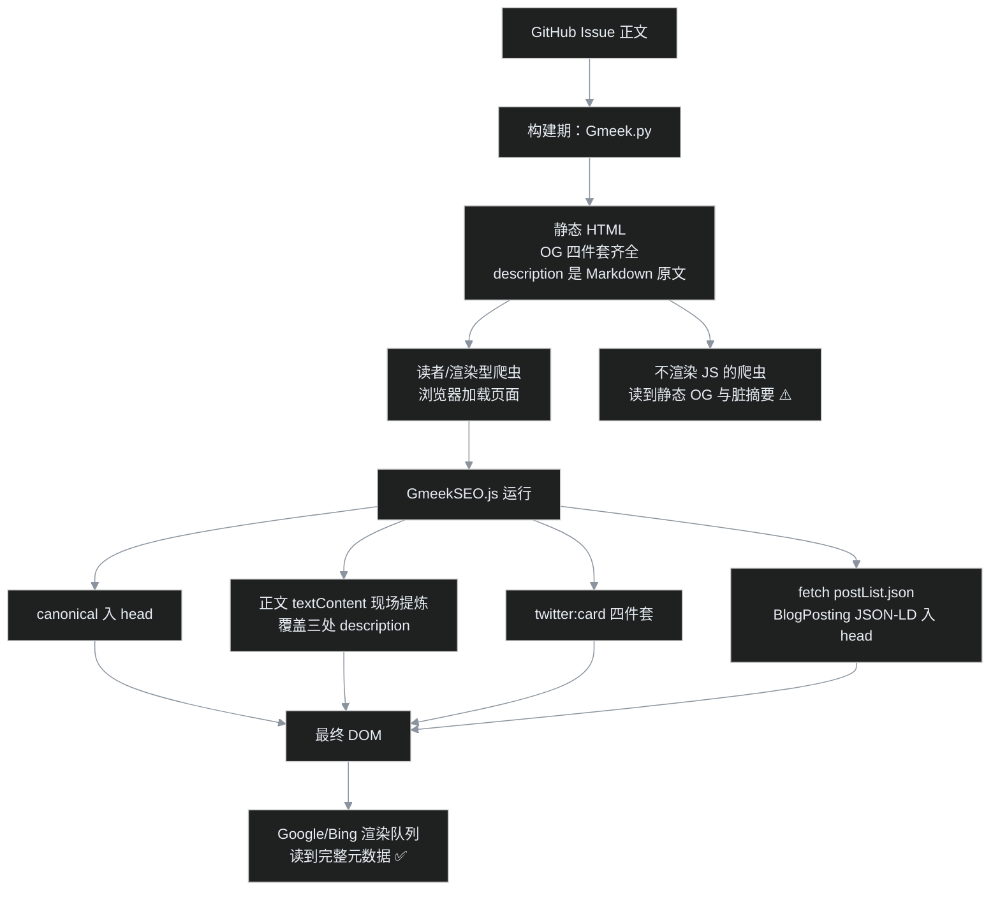

# G17｜SEO 收尾战：canonical、结构化数据和干净的摘要，一次补齐

> 正篇收官时，前传《[建设清单](/post/4.html)》上还剩四项技术缺口：没有 canonical、没有结构化数据、没有 twitter:card，meta description 还把 Markdown 原文原样塞进搜索摘要。2026-09-15 这天叶扬决定把它们一次清零。这篇讲清三件事：缺口到底长什么样、为什么选择"运行时注入"这条需要交代局限的路线、以及一个 135 行的小插件如何让 26 篇文章一夜之间全部体面起来。发布之后，本文就是插件的第一批作品——你在搜索结果里看到的摘要，正是插件读着这篇正文现场生成的。

## 一、战场盘点：四个缺口的真容

先回到[前传 #4](/post/4.html) 9 月 15 日回填时 curl 出来的实锤。以[截图番外](/post/26.html)为例，构建后页面 `<head>` 里与 SEO 有关的标签是这样：

```text
✅ <meta property="og:title" content="番外｜给博客拍证件照：……">
✅ <meta property="og:type" content="article">
✅ <meta property="og:url" content="https://yeyangchen2009.github.io/post/26.html">
✅ <meta property="og:image" content="https://yeyangchen2009.github.io/og.png">
❌ <meta name="description" content="# 番外｜给博客拍证件照……

> 正篇收官之后，叶扬给 9 篇老教程补浏览器实拍截图，……手动截图九遍等于自虐。">
❌ 没有 <link rel="canonical">
❌ 没有 application/ld+json
❌ 没有 twitter:card
```

逐个说后果：

| 缺口 | 后果 |
|---|---|
| **description 是 Markdown 原文** | 框架在构建期直接取 issue 正文开头做摘要，于是 `#` 标题符号、空行、`>` 引用符、`[文字](链接)` 语法原样进了搜索引擎摘要和分享卡片，读者在搜索结果里看到一堆符号 |
| **无 canonical** | `/post/26.html` 与带查询串的同一 URL（UTM 追踪、渠道参数）会被当成不同页面分散权重；转载和镜像出现时，搜索引擎没有权威信号判断原稿是谁 |
| **无 JSON-LD 结构化数据** | 搜索引擎只能靠猜理解"这是一篇文章、作者是谁、哪天发的"；拿不到 Article 富结果资格，知识面板、作者署名等增强无从谈起 |
| **无 twitter:card** | X/Twitter、部分聚合器分享时无大图卡片（好在它们会回退读取 OG 标签，所以不是全瞎，只是裸奔） |

奇怪的是框架并不小气：og:title、og:url 这些构建期就能确定的标签都给全了。问题集中在两类——**需要二次加工正文的**（清洁摘要）和**需要文章级元数据的**（canonical、JSON-LD）。这正是插件该干的活。

## 二、路线之争：运行时注入算不算 SEO？

在动手前必须回答一个尖锐的问题：Gmeek 是纯静态站，而我们这套插件体系全部运行在浏览器里。**爬虫 curl 到的 HTML 源码里没有的标签，注入了算不算数？**

叶扬查了 Google 搜索中心的官方文档，结论分三种爬虫区别对待：

1. **Google**：明确支持 JavaScript 渲染。Googlebot 抓取后会把页面送进渲染队列（二次索引），用 Chromium 跑完 JS 再读最终 DOM——JS 生成的标题、canonical、meta、结构化数据都在可索引范围内（官方 JavaScript SEO 文档原话：Google 会执行 JS 并读取渲染后的内容）。限制只有一个：渲染队列有延迟，新页面可能晚几个小时到一天才看到最终形态；
2. **Bing**：同样有 JS 渲染管线，能力略保守但主流用法支持；
3. **不渲染 JS 的爬虫**：部分社交卡片爬虫、百度——它们只读静态源码。

于是设计原则清晰了：

- **静态源码里已经对的，别动也别依赖运行时**：OG 四件套框架构建期就给全了，分享卡片（最依赖不渲染爬虫的场景）本来就工作，插件只覆盖其中脏掉的 `og:description`；
- **运行时补的，瞄准渲染型爬虫**：canonical、JSON-LD、twitter:card、清洁 description 主要服务 Google/Bing；
- **百度**：本站在 [G04](/post/10.html) 就决定跳过（未备案的 github.io 收录极差），这条局限对我们不成立。

另一个选择是改框架模板或给上游提 PR，让构建期直接产出静态标签——那当然更"正统"，但违背本系列[第 4 篇](/post/4.html)立的规矩（走插件机制、不改模板、升级无痛）。运行时插件是现有纪律下的最优解，代价是在本文里**把局限写明白**，不假装 curl 能看到它。

整条流水线的分工是这样：



## 三、插件实现：static/plugins/GmeekSEO.js

成品 [`static/plugins/GmeekSEO.js`](https://github.com/yeyangchen2009/yeyangchen2009.github.io/blob/main/static/plugins/GmeekSEO.js)，135 行零依赖，挂在 config 的 `script` 字段**第一位**——元数据补全在所有正文插件之前跑完。下面按四个产出拆。

### 3.1 canonical：不拼域名，复用 og:url

自己拿 `location.origin + pathname` 拼 URL 是常见写法，但叶扬选择更懒也更稳的路线——**框架构建期已经把绝对 URL 写进 `og:url` 了**，直接读：

```javascript
function ogContent(prop) {
    var m = document.querySelector('meta[property="og:' + prop + '"]');
    return m ? m.getAttribute('content') : '';
}
var canonicalUrl = ogContent('url') || (location.origin + pathname);
if (!document.querySelector('link[rel="canonical"]')) {
    var link = document.createElement('link');
    link.setAttribute('rel', 'canonical');
    link.setAttribute('href', canonicalUrl);
    document.head.appendChild(link);
}
```

好处有三：域名跟着 config 走，绑定自定义域名后零改动；没有 trailing slash、大小写之争；`if` 守卫保证将来框架或上游在静态期补了 canonical，插件绝不打架（测试里专门有一条：预置的静态 canonical 必须原样保留）。

### 3.2 清洁摘要：渲染后 DOM 天生干净

这是全篇最有意思的一段。框架为什么脏？因为它在构建期从 **Markdown 原文**里摘文字，`#`、`>`、`[]()` 当然都还在。而插件运行在渲染之后，DOM 给的是另一个世界：

- `[文字](http://x)` 渲染成 `<a>`，`textContent` 只剩"文字"，URL 天然消失；
- `>` 渲染成 blockquote 的左边框（那是 CSS，不是字符），textContent 里根本没有 `>`；
- `#` 渲染成 `<h1>`，标题和正文已经是不同节点。

所以算法不是"清洗 Markdown"，而是**选对节点再读文本**：

```javascript
function buildDescription() {
    var clone = document.getElementById('postBody').cloneNode(true);
    var junk = clone.querySelectorAll(
        'h1,h2,h3,h4,h5,h6,pre,script,style,nav,.gmeek-pn,#archiveTimeline,.toc');
    for (var i = 0; i < junk.length; i++) junk[i].parentNode.removeChild(junk[i]);
    var text = (clone.textContent || '').replace(/\s+/g, ' ').trim();
    if (!text || text.length <= 140) return text;
    var head = text.slice(0, 140);
    // 在 140 字内找最后一个句读，至少留足 70 字才收；否则硬切加省略号
    ...
}
```

四个细节都有出处：

1. **克隆再删**（`cloneNode(true)`）：不能在真实 DOM 上动刀，页面显示什么都不能少；
2. **删标题**：本系列每篇正文开头都有一个 `# 大标题`，而标题已经在 og:title 里了，摘要不该以标题开头；
3. **删 `pre`**：代码不该进搜索摘要；但行内 `code` 保留——它往往是正常句子的一部分；
4. **删 `#archiveTimeline`**：[G10](/post/17.html) 归档页正文只有一个挂载点，插件跑完前里面写着"⏳ 文章列表加载中…"，这行字要是进了摘要就成了事故现场。

截断策略是中文特调：140 字为上限（中文一个字就是一个字符，比英文 160 字符的通行建议收紧些），优先在句号/问号/分号/逗号处收刀，但至少要攒够 70 字才允许提前断——防止"引子只有一句短话，后面跟着在第一个逗号处腰斩"。找不到句读就硬切加省略号。

清洁结果同时覆盖三处：`meta[name=description]`、`og:description`、`twitter:description`，保证搜索摘要和分享卡片看到的是同一段干净话。

### 3.3 twitter:card：补齐四件套

```javascript
ensureMeta('meta[name="twitter:card"]', 'name', 'twitter:card', 'summary_large_image');
ensureMeta('twitter:title' …, ogContent('title') || document.title);
ensureMeta('twitter:description' …, desc);
ensureMeta('twitter:image' …, ogContent('image'));
```

大图卡（summary_large_image）配 [G03](/post/9.html) 做的 1200×630 og.png 正好同尺寸。`ensureMeta` 是"有则改、无则建"的统一入口，所以这个插件**跑几遍都幂等**。

### 3.4 JSON-LD：把 postList.json 变成 BlogPosting

结构化数据只给普通文章（about/archive 是 WebPage，硬套 Article 反而撒谎）。数据全部来自老熟人 postList.json——[G08](/post/14.html) 起每个自研插件的公共粮仓：

```javascript
var ld = {
    '@context': 'https://schema.org',
    '@type': 'BlogPosting',
    headline: String(item.postTitle).slice(0, 110),  // Google 建议标题 ≤110 字符
    description: desc,
    image: image,                                    // 1200×630 位图，满足大图建议
    datePublished: item.createdDate,                // "2026-09-15"，schema 合法日期
    keywords: (item.labels || []).join(', '),        // "博客, Gmeek"
    author: { '@type': 'Person', name: authorName },
    publisher: { '@type': 'Organization', name: siteName,
                 logo: { '@type': 'ImageObject', url: image } },
    mainEntityOfPage: { '@type': 'WebPage', '@id': canonicalUrl },
    url: canonicalUrl
};
```

两个"人名从哪来"的小决策：页脚 `#footer a` 的文本是"叶扬的博客"，正好一鱼两吃——整串做 publisher 组织名，去掉"的博客"后缀做作者人名。不硬编码、不新建配置，三行正则搞定。

还有一个**故意没放的字段：`dateModified`**。issue 被编辑过很多次，但 Gmeek 的数据出口里没有"最后修改时间"，运行时的 `new Date()` 是读者访问时间，填进去就是伪造。没有可靠数据源的字段宁可缺席——这条原则和 [G15](/post/24.html) 不给没图文章加载 mermaid 是同一个脾气。

### 3.5 守卫与降级

- **正则双保险**：config 的 `script` 只注入文章页和固定页，插件内部再用 `/\/post\/(\d+)\.html$/` 与 `/^\/[A-Za-z0-9_-]+\.html$/` 确认身份，首页、tag 页即使误加载也立刻自退；
- **无 `#postBody` 就退出**，一个标签都不碰；
- **fetch 失败只 `console.warn`**：postList 拉不到时，canonical/摘要/twitter 这些同步产物照常生效，只少一个 JSON-LD，不挡阅读；
- **重入标志** `window.__gmeekSEO`，脚本被重复注入时不重复劳动。

## 四、测试：红的照例先是桩

系列惯例，上线前 vm 桩测试伺候，15 条断言覆盖：canonical 复用与幂等、预置静态 canonical 不被覆盖、摘要无 `# > [ ] (` 与 URL 残留、代码块剔除而链接文字保留、两种截断路径、JSON-LD 全字段（含作者名派生）、fetch 失败静默降级、固定页不请求数据也不出 JSON-LD、archive 挂载点不进摘要、两类自退。

熟悉的一幕再次上演：**头两轮全红，红的是桩，不是插件**——桩节点缺 `removeChild`、`textContent` 只有 getter 没有 setter。真实 DOM 这两个都是标配，插件代码一行没改，补齐桩之后 15 条全绿。从 [G13](/post/20.html) 到现在，"桩对标准语义的保真度"这个坑已经咬了第五次，值得在系列里留名：**写 DOM 桩时，拿 MDN 上该接口的完整成员表对着抄**。

## 五、线上验收：CDP 读渲染后的 head

curl 只能证明"静态源码里依然没有"（这正是预期的局限），验收必须在跑完 JS 的浏览器里做。叶扬复用了[截图番外](/post/26.html)那台 CDP 相机的连接方式，写了个只读数不拍照的探测脚本，导航后等 4.5 秒让 fetch 回来，然后一次性读回渲染后的全部元数据。`/post/26.html` 的实测结果：

```text
canonical:    https://yeyangchen2009.github.io/post/26.html
description:  正篇收官之后，叶扬给 9 篇老教程补浏览器实拍截图，顺手给自己
              挖了个坑：手机浮层要现场点开、流程图比视口还高、九张图全部
              要暗色主题、还得是 2x 高清——手动截图九遍等于自虐。
twitter:card  summary_large_image ✅  twitter:image og.png ✅
JSON-LD:      BlogPosting，datePublished 2026-09-15，keywords "博客, Gmeek"，
              author 叶扬，publisher 叶扬的博客，mainEntityOfPage 与 canonical 同址
```

对比插件上岗前，同页的摘要是以 `# 番外｜……` 加空行加 `> ` 开头的 Markdown 原文。固定页同样各就各位：about 摘出了自我介绍首段，archive 摘出了"这里按年份倒序列出博客的全部文章……"那段说明（比叶扬预想的回退标题方案还漂亮），两页都有 canonical、都没有被乱点鸳鸯谱的 JSON-LD。首页和 tag 页确认零注入，框架原有的干净描述纹丝不动。

读者侧的人工验收有两个入口，推荐亲手试：

1. **Google 富结果测试**（<https://search.google.com/test/rich-results>）：输入任意文章 URL，它会像 Googlebot 一样渲染页面，应识别出 1 个 `Article` 项且零错误零警告；
2. **查看源代码 vs 审查元素**：同一页 `Ctrl+U` 看到的 description 是脏的（构建期原文），F12 审查元素看到的是净的（运行时结果）——这个"分裂现场"正好是本插件工作原理最直观的演示。

收录数据层面的效果（富结果是否出现、摘要是否真的换成清洁版）无法当天验证，要等 Google 渲染队列与重抓，已记入约 2026-09-21 后的 **G04 收录实战番外**，用真实索引数据说话。

## 六、诚实清单：这招的边界

- **不渲染 JS 的爬虫看不到运行时产物**：百度（本站主动跳过）与少数卡片爬虫只能读到静态 OG——而 OG 四件套框架本就给全，分享不残废；受影响的只有它们拿到的 og:description 仍是旧的脏值（下次框架若支持构建期摘要，静态值会同步干净）；
- **新页面的富结果有时延**：Google 首次抓取与二次渲染之间可能隔几小时到一天，这是所有 JS 注入方案的共同代价；
- **`dateModified` 缺席**：无可靠数据源，不伪造；`publisher.logo` 暂用横版 og.png（合法但非 Google 偏好的方形 logo），等哪天做了方形 PNG 再换；
- **结构化数据只覆盖 BlogPosting**：面包屑（BreadcrumbList）是下一个可选项——本站文章页没有面包屑导航 DOM，要做得连导航一起加，属于另一个选题了。

## 小结

前传清单上的四项技术缺口至此全部清零：canonical 给每篇文章发了"身份证"，JSON-LD 让搜索引擎第一次能用结构化语言读懂"谁、何时、写了什么"，twitter:card 补齐分享大图，清洁摘要则把 Markdown 车间的半成品换成了读者能直接读的句子。135 行插件、15 条桩测试、一次全局重建，没有模板改动，升级无痛。

方法论上再添一条：**构建期产物是给不渲染的爬虫的底线，运行时注入是给渲染型爬虫的增强——想清楚每类爬虫读什么，比追求"curl 里什么都有"更重要。**

下一篇是已在 [G04](/post/10.html)、[G16](/post/25.html) 和[总揽 #5](/post/5.html) 三处承诺过的 **G04 收录实战番外**（约 2026-09-21 数据沉淀后），届时正好连本文的富结果效果一起验收。

## 参考

- 本站插件源码：<https://github.com/yeyangchen2009/yeyangchen2009.github.io/blob/main/static/plugins/GmeekSEO.js>
- Google：JavaScript 生成内容的 SEO 基础：<https://developers.google.com/search/docs/crawling-indexing/javascript/javascript-seo-basics>
- Google：结构化数据入门与 Article 类型：<https://developers.google.com/search/docs/appearance/structured-data/intro-structured-data>
- schema.org BlogPosting：<https://schema.org/BlogPosting>
- X Cards 开发文档（summary_large_image 与 OG 回退）：<https://docs.x.com/x-for-websites/cards/overview/abouts-cards>
- 相关前作：[G04 RSS 直接当 sitemap](/post/10.html)、[G08 自研插件套路](/post/14.html)、[G10 固定页机制](/post/17.html)、[番外·CDP 截图流水线](/post/26.html)
- 系列总揽：[Gmeek 插件与功能全景调研（第 0 篇）](/post/5.html)
