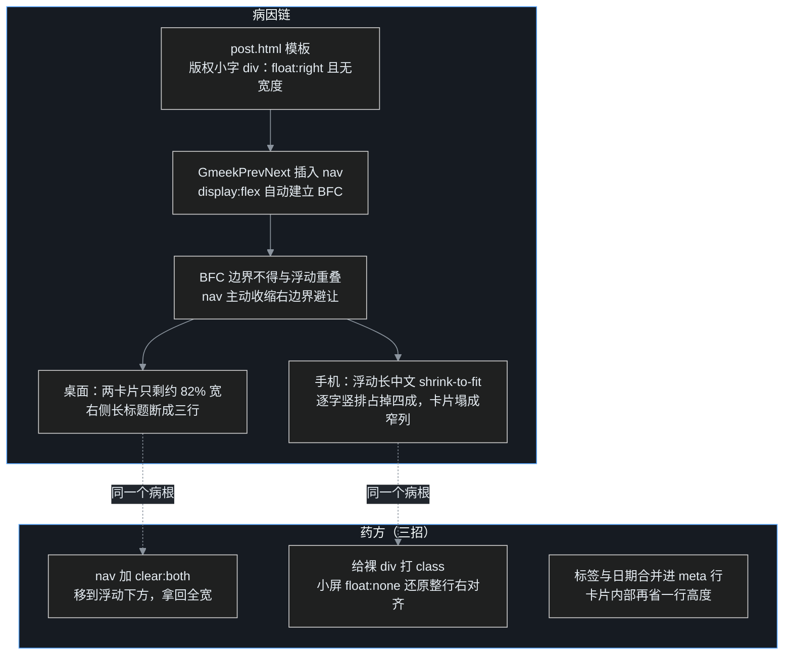

# G18｜被浮动挤扁的"上一篇 / 下一篇"：一桩 BFC 避让案

[G08](/post/14.html) 给博客装上"上一篇 / 下一篇"导航之后，叶扬一直是在电脑上看的：两张卡片并排，箭头、标题、日期各就各位，像两篇文章之间一道体面的门。直到这天叶扬掏出手机随手翻了翻——门还在，但被挤成了两条竖匾。

这一篇记录这桩移动端事故的完整侦破过程：真凶不在手机上，也不在插件的媒体查询里，而在一个 2001 年的 CSS 布局老古董——**浮动与 BFC 的避让规则**身上。

## 一、手机截图抓现行

老规矩，先用 [番外一](/post/26.html) 的零依赖截图器把现场固定下来（390×844，iPhone 逻辑分辨率，暗色主题）：


仔细看这张图，有三处反常：

1. **两张卡片只有约六成宽**，右边空出一大块黑；
2. **标题被挤成竖排**——"番外"两个大字独占两行，后面跟着一条竖线和省略号，日期 `2026-09-15` 也断成了 `2026-` / `09-15`；
3. **右上角的版权小字**（"✍️ 原创文章……叶扬谢谢你来过 ❤️"）同样竖成一列，和卡片肩并肩。

叶扬的第一反应是媒体查询写错了——G08 里明明写了 `@media (max-width:600px)` 让卡片 `flex-direction:column` 上下堆叠。纵向堆叠确实生效了（两张卡片上下排列），可**宽度为什么会塌？**

## 二、扩大嫌疑：桌面端也在缩

别急着怪手机。把同一区域在 1440px 桌面端截下来对比：


桌面端的病更隐蔽：乍一看排版正常，但拿容器边距一比就露馅——两张卡片的总宽只有内容区的约 **82%**，右边缺了一条；右侧那张卡片的标题也因此被迫断成三行（"……一次开源回馈 / 的完整流 / 水线"）。

手机和桌面**同时中招，说明病根不在媒体查询，而在所有断点共用的基础布局里**。

## 三、根因：一个浮动元素，和一个爱让路的 BFC

回到模板现场。Gmeek 的 `post.html` 在正文和评论按钮之间，有这么一行版权小字：

```html
<div style="font-size:small;margin-top:8px;float:right;">{{ blogBase['bottomText'] }}</div>
<button class="btn btn-block" id="cmButton">评论</button>
```

G08 插件生成的 `<nav class="gmeek-pn">` 正是插在这个评论按钮前面。于是关键要素齐了：

- 版权小字是 **`float: right` 的浮动元素**，且**没有声明宽度**；
- nav 是 **`display: flex` 的弹性容器**——而 flex 容器会自动建立一个 **BFC（块级格式化上下文）**。

BFC 有条老牌规矩：**BFC 的边界不能与浮动元素重叠**。普通块级盒子会被浮动元素盖住内容、文字绕排；但 BFC 为了"互不重叠"，会主动把自己的宽度收缩到浮动元素旁边。这就是"避让"——nav 明明是块级元素、本该占满整行，却乖乖把右侧地盘让给了那条浮动小字。

桌面端屏幕宽，让一条还剩 82%，看起来只是"有点窄"；手机上灾难加倍，因为那条浮动小字**自己也没宽度**：浮动元素在未指定宽度时按内容 shrink-to-fit（收缩到最宽不可断行单元），中文恰好每个字都是合法断点，于是一整句话在窄屏被压成一列竖排，反客为主占掉约 40% 的宽度。两兄弟互相挤压，卡片就成了竖匾。



## 四、三招修复

### 第 1 招：`clear: both`，让导航不和浮动共处一行

最关键的一行。`clear` 专门处理与浮动元素的垂直关系：声明后，nav 会被推到浮动元素**下方**排布，BFC 不再需要横向避让，宽度立刻恢复 100%。

```css
.gmeek-pn { display: flex; gap: 10px; clear: both; margin: 28px 0 10px; }
```

那条版权小字在桌面端仍优雅地浮在右上（它本来就该待在那儿），导航整体在它下面拿全宽，互不干涉。

### 第 2 招：小屏给浮动小字"去浮动"

手机上问题是双重的：就算 nav 让开了，竖成一列的版权小字本身也很丑。但模板的小字是**带内联样式的裸 div**，插件选择器抓不到。解决办法是在插入导航时顺手扫描父容器，给所有内联 `float:right` 的元素打上 class：

```javascript
var kids = anchor.parentNode.children;
for (var i = 0; i < kids.length; i++) {
    var cs = kids[i].style && kids[i].style.cssText || '';
    if (/float\s*:\s*right/.test(cs)) kids[i].classList.add('gmeek-pn-bottomtext');
}
```

然后在移动端媒体查询里摘掉浮动，让它回归普通块级元素、整行右对齐、放不下就正常折行：

```css
@media (max-width: 600px) {
    .gmeek-pn-bottomtext { float: none !important; display: block;
                           text-align: right; margin: 0 2px 2px; }
    /* ……卡片堆叠规则…… */
}
```

### 第 3 招：meta 行合并，把高度省回来

宽度修好之后再做减法。旧版每张卡片是三层：标签一行、标题最多两行、日期一行。手机上纵向空间金贵，叶扬把"上一篇"和日期合并到同一行——左标签右日期（下一篇用 `flex-direction:row-reverse` 镜像），标题独占下面的两行：

```css
.gmeek-pn-meta { display: flex; justify-content: space-between;
                 align-items: baseline; gap: 10px; }
.gmeek-pn-next .gmeek-pn-meta { flex-direction: row-reverse; }
```

三张改动全部在插件内部完成，**一行模板都不用动**——这是插件方案的底线：升级 Gmeek 时不会产生冲突。

## 五、验收：同一个取景框，前后对照

修复上线（commit `4db4f19`，全局重建成功）后，用与修复前**完全相同的视口、暗色主题、取景矩形**重拍：


卡片全宽了，标题两行完整显示，"上一篇 2026-09-15"在同一行左右对望，竖匾变回了大门。桌面端同样复查：


两张卡片延伸到容器全宽、左右对称，右卡片的标题从三行收为两行。一个 CSS 属性，治好两个断点。

## 六、这桩案子留下的三条经验

1. **移动端出丑，病根常在共用布局里。** 先在桌面端复现同一症状，能避免在媒体查询里乱改——`@media` 表示"堆叠方式"，不背"宽度坍塌"的锅。
2. **认识 BFC 的两面性。** 大部分教程只讲"BFC 可以清除浮动 / 防止外边距折叠"，这桩案子展示了它的另一面：**BFC 会主动避让浮动、收缩自身宽度**。flex/grid 容器、`overflow:hidden`、`display:flow-root` 都会建立 BFC，插插件时先看看邻居有没有 `float`。
3. **响应式要用真实视口截图验收。** 桌面浏览器拖窄窗口和 390px 真机视口并不总是一回事（触摸态、DPR、字号策略都不同）；把截图器挂进修复前后的固定流程，同一个 `--eval` 取景矩形拍两张，问题和疗效都无处遁形。

至于上游：GmeekPrevNext 在[番外二](/post/28.html)列的第二梯队里，这次修复让它更成熟了——但三个 PR 还在队列里等维护者响应，按既定节奏不急着再添新 PR。等通道确认顺畅，这版修复会随插件一起带上去。

人生苦短，我用 AI——但定位 CSS 老怪这件事上，一张 390px 的截图比十次猜测都管用。

## 参考链接

- MDN：[块级格式化上下文（BFC）](https://developer.mozilla.org/zh-CN/docs/Web/CSS/CSS_display/Block_formatting_context)、[clear 属性](https://developer.mozilla.org/zh-CN/docs/Web/CSS/clear)、[视觉格式化模型中的浮动](https://developer.mozilla.org/zh-CN/docs/Web/CSS/CSS_float)
- 站内相关：[G08 上一篇/下一篇插件诞生记](/post/14.html)、[番外一 零依赖无头截图流水线](/post/26.html)、[番外二 开源回馈流水线](/post/28.html)
- 本次修复源码：[static/plugins/GmeekPrevNext.js](https://github.com/yeyangchen2009/yeyangchen2009.github.io/blob/main/static/plugins/GmeekPrevNext.js)
