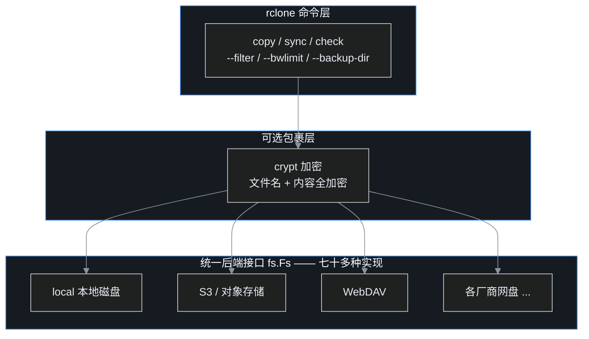

> 上一篇 VHS 把"录屏"变成了写脚本。这一篇轮到另一件更要紧的事——备份。把文件从电脑搬到网盘，能不能也不打开任何网盘客户端，只用一条可复现的命令？

## 一、小白问题：备份这件事，为什么手动做不靠谱

先说一个很多人都干过的事。

担心文件丢，于是买了网盘会员，打开客户端，把一个文件夹拖进去，进度条走完，心满意足。三个月后想再备一次：客户端早就不自启了，登录态过期，重新装；网盘里那个文件夹跟本地现在是什么关系，说不清——哪些传过了、哪些改过了，只能靠肉眼；想再备一份到另一个网盘？再装一个客户端，再走一遍，每个网盘的客户端界面、限速规则、同步逻辑还都不一样。

这种"备份"有三个硬伤。**不可重复**：全靠人记着、点着，漏一次就断档。**不可验证**：传完只知道进度条走完了，文件到底齐不齐、有没有损坏，没有答案。**不可移植**：换个网盘等于换一套手艺，经验全部作废。

程序员看这套流程会觉得面熟：手动部署就是这个味道——而工程上早就用脚本和 CI 把它消灭了。备份也一样，它的本质是"在两个存储系统之间按规则同步文件"，天然是命令行工具的地盘。

rclone 就是这门手艺的标准答案：一个开源 CLI，统一对接七十多种存储后端，本地磁盘、S3 兼容对象存储、WebDAV、各家网盘，全部用同一套命令说话。

## 二、rclone 是谁，winget 一条命令装完

rclone 是 Go 写的老牌开源工具，GitHub 上 rclone/rclone 项目数万 star，官方口径支持 **Over 70** 种云存储后端。Windows 上 winget 直接装：

```bash
winget install Rclone.Rclone
```

装完验证：

```text
$ rclone version
rclone v1.75.1
- os/version: Microsoft Windows 11 Pro 25H2 25H2 (64 bit)   # 版本号重复是上游显示问题，原文如此
```

rclone 的核心抽象可以用一张图讲清楚：



不管底下是本地磁盘还是对象存储，上面用的命令一模一样——这就是"学一次，到处用"。本文为了不碰任何真实账号，全程在本机自建一个 WebDAV 服务当"网盘"，所有命令在真实网盘上原样可用，只需要把 remote 类型换掉。

## 三、配一个 remote：告诉 rclone "网盘"在哪

rclone 把一个存储目标叫做 **remote**，交互式配置是 `rclone config`，一路菜单选；但脚本化场景推荐直接 `config create` 一条命令搞定。配置文件在 Windows 上是 `%APPDATA%\rclone\rclone.conf`，在 Linux 上是 `~/.config/rclone/rclone.conf`（也可以用 `--config` 指定任意文件，本文的演示配置就独立存放，不碰全局）。

先在本地把"网盘"起起来（真实场景这一步不存在，直接用你网盘的地址）：

```bash
rclone serve webdav serverdata --addr :8080 --user demo --pass demo-pass-123
```

然后配置一个名为 `wd` 的 WebDAV remote：

```bash
rclone --config local-demo.conf config create wd webdav \
  url=http://127.0.0.1:8080 vendor=other \
  user=demo pass=demo-pass-123
```

注意这里 `pass=` 给的是**明文**，rclone 会自动把它混淆（obscure）后再存进配置文件——配置文件里看到的不是明文，而是一串可逆的编码。这个 obscure 不是加密，只是防止路过的人一眼看到，后面会专门讲这里的坑。

配好就能用了，先打个招呼：

```bash
rclone --config local-demo.conf lsd wd:
```

下文所有命令为了简洁都省略了 `--config local-demo.conf` 这一段，实际演示时全程带着它，绝不碰你的全局配置。

## 四、四大主力：copy、sync、check、--dry-run

rclone 命令不少，但日常 90% 的工作量靠四个。先用三个小文件当数据：

```text
src/budget.csv   month,amount / sep,100
src/notes.txt    notes content v1
src/readme.txt   hello from readme
```

### copy：只增不删

```bash
rclone copy src dst
```

```text
INFO  : budget.csv: Copied (new)
INFO  : notes.txt: Copied (new)
INFO  : readme.txt: Copied (new)
Transferred: 3 / 3, 100%
```

copy 的语义要记牢：**把源端的文件传到目标，只增不删**。即使源端删了文件、目标端多了文件，再跑一次 copy，目标里多余的文件也不会被碰：

```text
$ rm src/budget.csv
$ printf 'stale file only in dst\n' > dst/stale-only-dst.txt
$ rclone copy src dst
INFO  : There was nothing to transfer
$ ls dst
budget.csv  notes.txt  readme.txt  stale-only-dst.txt
```

源里删掉的 budget.csv 还在 dst，dst 里多出来的 stale 文件也还在。copy 适合"我只想多备一份，别动我别的东西"。

如果某个文件内容变了，copy 会只传变化的那一个：

```text
INFO  : notes.txt: Copied (replaced existing)
```

### sync：让目标变成源的镜像

进入 sync 之前，先把演示状态摆正：把 budget.csv 还原回 src，dst 里那个 stale 文件留着——于是当前是"src 三个文件、dst 四个文件（多一个 stale）"。

```bash
printf 'month,amount\nsep,100\n' > src/budget.csv
```

sync 比 copy 多一个动作：**删除目标端那些源端已经不存在的文件**。因为删数据是危险操作，rclone 给了一个无价的安全开关 `--dry-run`——只打印"我本来要做什么"，一个字节都不动：

```bash
rclone sync src dst --dry-run
```

```text
NOTICE: stale-only-dst.txt: Skipped delete as --dry-run is set (size 23)
Deleted: 1 (files), 0 (dirs), 23 B (freed)
```

看清楚它要删的就是那一个 23 字节的 stale 文件，再去掉 dry-run 真跑：

```text
$ rclone sync src dst
INFO  : stale-only-dst.txt: Deleted
$ ls dst
budget.csv  notes.txt  readme.txt
```

从此 dst 与 src 严格一致。规矩很简单：**所有 sync 默认先 --dry-run**，确认删除清单没问题再真跑。这个习惯能救命。

### check：验证备份到底齐不齐

备份传完怎么验证？rclone check 负责比对两端：

```bash
rclone check src dst
```

```text
NOTICE: Local file system at .../dst: 0 differences found
NOTICE: Local file system at .../dst: 3 matching files
```

默认按 **size + 哈希**（两端共同支持的 MD5/SHA1）比对，**不看修改时间**——实测两端文件仅 mtime 不同、内容一致，check 照样报 0 differences。它还有两档：加 `--size-only` 只比大小、最快；加 `--download` 则把两端数据全部读出来实时比对，最严格、代价也最大：

```bash
rclone check src dst --size-only      # 只比大小
rclone check src dst --download       # 读完全部数据实时比对
```

如果两端后端没有共同哈希（比如 crypt 叠 WebDAV），check 会打印 `No common hash found`，自动退回只比 size。

"传完即 check"，备份从此是可验证的，而不是看着进度条猜。

### 四个动作的分工速查

| 命令 | 会删目标文件吗 | 典型场景 |
|---|---|---|
| `copy` | 不会 | 增量备份，多放一份，最安全 |
| `sync` | 会 | 镜像备份，要求两端严格一致 |
| `check` | 不会 | 校验备份完整性 |
| `--dry-run` | 什么都不做 | sync 之前的必做彩排 |

本节四条命令的真实输出汇总：


## 五、安全网与精细控制

真实备份里还有三个常见需求：删了的文件能不能留个棺材本？不想全传怎么挑？占满带宽怎么办？

### --backup-dir：被删/被覆盖的文件，server-side 留档

sync 要删的文件直接没了，终归有点慌。`--backup-dir` 让 rclone 在删除/覆盖前把旧文件**移动到一个留档目录**：

```bash
rclone sync src dst --backup-dir archive/sync-$(date +%s)
```

实测输出里可以看到旧文件是 server-side 移动过去的：

```text
INFO  : notes.txt: Moved (server-side)
INFO  : notes.txt: Copied (new)
INFO  : doomed.txt: Moved into backup dir
```

```text
archive/sync-1790153509/notes.txt
archive/sync-1790153509/doomed.txt
```

配合一个带时间戳的目录，每次 sync 的"牺牲者"都有处可查，相当于给镜像备份加了个简易回收站。注意 backup-dir 必须在同一个后端上，rclone 才能走 server-side move。

### 过滤：--include / --exclude 与一个推荐写法

只想传特定类型的文件，用过滤规则：

```bash
rclone copy mix filtered --include "*.csv" --include "*.txt" --exclude "*"
```

看上去规则按顺序匹配、最后的 `--exclude "*"` 兜底，但实测中 rclone 立刻给了一条很直白的提醒：

```text
ERROR : Using --filter is recommended instead of both --include and --exclude
        as the order they are parsed in is indeterminate
```

即同时混用 `--include` 和 `--exclude` 时，两者的解析先后不确定。官方推荐统一用 `--filter` 写成一个有序列表：

```bash
rclone copy mix filtered \
  --filter "+ *.csv" \
  --filter "+ *.txt" \
  --filter "- *"
```

`+` 表示包含，`-` 表示排除，从上往下逐条匹配。写法啰嗦一点，但语义确定。

### --bwlimit：别让备份占满网速

家里网络一边备份一边开视频会议，需要给 rclone 限个速：

```bash
rclone copy mix limited --include "big.bin" --bwlimit 1M
```

```text
INFO  : Starting bandwidth limiter at 1Mi Byte/s
Transferred: 20 MiB / 20 MiB, 100%, 1.001 MiB/s
Elapsed time: 19.9s
```

20 MiB（约 21 MB）文件在 1 MiB/s 限速下稳定跑了 19.9 秒，限速准确。

## 六、crypt：网盘服务商也读不了你的数据

把文件丢给网盘，等于信任网盘运营方和它的安全防护。更谨慎的做法是**在本地加密后再上传**——服务端看到的只有密文。rclone 内置了 crypt 后端，专门干这个。

crypt 的妙处在于它是一个"包裹层"：它自己不连任何服务，而是套在另一个 remote 外面。发给 crypt 的文件先加密，再交给底层 remote 上传；读的时候反过来。配置一条：

```bash
rclone config create secret crypt remote=wd: \
  password=enc-password-456 password2=salt-salt-789 \
  filename_encryption=standard
```

- `password` 是加密主密码，`password2` 是可选盐值，参与 scrypt 密钥派生，增强抗字典攻击能力；
- `filename_encryption=standard` 表示**连文件名一起加密**。

### 同一份数据，两个世界

通过 crypt 视图看，一切正常，文件名、大小都是明文口径：

```bash
rclone lsl secret:
```

```text
21 2026-09-23 16:52:12.000000000 budget.csv
23 2026-09-23 16:52:12.000000000 notes.txt
18 2026-09-23 16:52:12.000000000 readme.txt
```

但直接到服务端磁盘上看物理实况，文件名、目录名全部变成了随机串：

```text
serverdata/tgt7ip244a279o2vi5alvg61r0              <- budget.csv
serverdata/ev2hq35t7d188mt23kccul2oag              <- notes.txt
serverdata/18e3jdamjuhchvobinb5793iig              <- readme.txt
serverdata/u5ab5655p7cls71i15jn1212ko              <- reports/ 目录
serverdata/u5ab5655p7cls71i15jn1212ko/eq3dkoucgur30ontklj5psgvu4                  <- reports/2026/
serverdata/u5ab5655p7cls71i15jn1212ko/eq3dkoucgur30ontklj5psgvu4/ped9i30q70rv...  <- september.csv
```

连多级目录的每一级名字都独立加密了。文件内容同样如此：走 crypt 读，内容完整还原；绕过 crypt 直接从底层 remote 读，拿到的是密文：

```bash
$ rclone cat secret:budget.csv
month,amount
sep,100
$ rclone cat "wd:tgt7ip244a279o2vi5alvg61r0" | xxd | head -2
00000000: 5243 4c4f 4e45 0000 af23 168d a90d 4636  RCLONE...#....F6
00000010: 992b 3890 0121 c911 d662 3baa 9a79 0a0e  .+8..!...b;..y..
```

每个加密文件开头是 8 字节固定魔数 `RCLONE\x00\x00`，紧接着 24 字节随机 nonce，再往后才是带 Poly1305 认证标签的密文（XSalsa20 加密，每块最多 64 KiB）。这样即使有人从服务端把文件拖走，没有 crypt 密码也只能得到一坨二进制。左右两个世界的对照实拍：


**密码丢了＝数据没了**，这一点没有任何后门：rclone 官方也无法帮你找回。crypt 密码必须离线另存一份。

### 长文件名：没有"自动分段"，只有一条 143 字符安全线

文件名加密会膨胀：PKCS7 填充后做 EME 加密，再 base32 编码，输出比输入长出一大截。实测两个长度：

| 源文件名 | 加密名 | 结果 |
|---|---|---|
| 93 字符 | 154 字符 | 成功 |
| 193 字符 | 333 字符 | 失败 |

注意 crypt **不会**把超长名字切开存放——加密后的名字作为一个整体组件写到底层。而绝大多数文件系统（NTFS、ext4 都一样）对单个路径组件的上限是 **255 字节**，333 字符直接超限。在本地磁盘后端，Windows 报：

```text
The filename, directory name, or volume label syntax is incorrect.
```

走 `rclone serve webdav` 时则是 PUT 被服务端拒绝：

```text
Failed to copy: unchunked simple update failed: Method Not Allowed: 405 Method Not Allowed
```

这跟操作系统无关——同一套命令在 ubuntu-latest 的 Linux runner 上同样 405，因为 serve webdav 落地的还是本地 ext4，255 的 NAME_MAX 谁也绕不过。

官方给的安全线因此很好记：**standard 模式下源文件名不超过 143 字符，任何网盘都不会出问题**。非得起长名字，有三条退路：一是改用 **obfuscation** 模式（配置里的值写作 `filename_encryption=obfuscate`，只做简单旋转、不做 base32 膨胀），实测同一个 193 字符文件名顺利上传，服务端物理名是 `154.cdcdcd...vzv`，长度不到 200——代价是文件名只做轻度混淆、不算加密（文件内容仍然加密）；二是使用进阶选项 `filename_encoding`：`base64` 比 base32 短，但只适合**大小写敏感**的后端（如 Google Drive），在大小写不敏感的后端会发生文件名碰撞；OneDrive、Dropbox、Box 这类大小写不敏感且内部按 UTF-16 计长的后端，应选 `base32768` 大幅缩短；三最朴素，改短源文件名。两种模式的实测对照：


## 七、搬进 GitHub Actions：让备份每天自己跑

本地命令跑顺了，最后一步是让它无人值守。GitHub Actions 可以按 cron 定时执行；rclone 是单个静态二进制，ubuntu runner 上已经预装，直接就能用，凭据全部走 Secrets，不进代码库。

一个最小的定时备份 workflow 长这样：

```yaml
name: scheduled-backup
on:
  schedule:
    - cron: "23 1 * * *"      # 每天 01:23 UTC 执行
  workflow_dispatch:

jobs:
  backup:
    runs-on: ubuntu-latest
    steps:
      - uses: actions/checkout@v4

      - name: Restore rclone config from Secret
        run: |
          mkdir -p ~/.config/rclone
          printf '%s' "${{ secrets.RCLONE_CONFIG }}" > ~/.config/rclone/rclone.conf

      - name: Sync to encrypted remote
        run: |
          rclone sync ./data secret: \
            --backup-dir secret:backup-versions/$(date -u +%Y%m%d-%H%M%S) \
            --filter "- /backup-versions/**" \
            -v
          # --download 实读比对，任何后端都通用；S3 等支持校验和的后端可换 rclone cryptcheck，省下载流量
          rclone check ./data secret: --download
```

要点有四个。

**凭据怎么放**：在本地配好 rclone 后，整个 rclone.conf 的内容就是一串文本，把它原样贴进仓库的 GitHub Secret（如 `RCLONE_CONFIG`），CI 里落盘即可。这样所有网盘凭据、crypt 密码都以加密形式存在 Secrets 中，代码库里一个字都没有。

**时间别卡点**。GitHub 的 schedule 用 UTC 时间，且高峰期会延迟甚至丢触发——官方文档明说定时任务在高负载期间可能排队，不能保证准点。要备份关键数据，时间避开整点，并且不能只依赖 schedule：保留 `workflow_dispatch` 手动入口，关键节点主动触发一次。

**backup-dir 必须跟目标在同一个 remote**。实测中踩了一脚：把留档目录写成裸路径，rclone 直接报错退出（exit 7）：

```text
NOTICE: Failed to sync: parameter to --backup-dir has to be on the same
        remote as destination
```

正确写法是 `secret:backup-versions/...`；同时别忘了加过滤把这个版本目录排除掉，否则下一次 sync 会把它当成目标端的多余内容删掉。

**sync 后必校验**：CI 里备份失败如果没人看日志，等于没备。注意验证 crypt 加密备份**不能用普通 `rclone check`**——它没法正确比对加密对象的校验和（实测只回了一句 "2 hashes could not be checked"，等于只验了大小）。官方为此准备了 `rclone cryptcheck ./data secret:`：它把明文加密后，与底层对象的实际校验和逐一比对。不过它要求**底层后端支持校验和**，S3 这类对象存储没问题；而实测本地自建的 WebDAV "does not support any hashes"，cryptcheck 会直接失败——而且 cryptcheck 本身没有 `--download` 开关。这种后端就改用 `rclone check ./data secret: --download`，把两端数据真正读出来逐字节比对（实测对 crypt 同样有效，能正确报出匹配与大小不符）。把校验放在最后一步，比对不一致就让 job 失败，配合 GitHub 的失败通知邮件，备份才真正闭环。

这套 workflow 在临时分支的 ubuntu-latest runner 上完整实测通过（rclone 安装、conf 落盘、crypt sync、check，19 秒跑完），跑完即删，主分支不留任何痕迹。

## 八、一个容易混的坑：serve --pass 要明文，配置文件存 obscure

演练过程中最容易把人绕进去的是这两套"密码规矩"。

前面说过，`config create` 给 `pass=` 写明文，rclone 自动 obscure 存储。于是不少人（包括网上的教程）顺手把这套习惯带到了服务端命令上——给 `rclone serve` 的 `--pass` 也喂一个 obscure 字符串，结果客户端怎么连都是 401。

实测把两种写法都请求一遍：

```text
$ rclone obscure demo-pass-123
osHL8n8P3iTnuJhTjvgEirBX5bi9A4Hw3BknUzw
$ curl -s -o /dev/null -w "%{http_code}" -u demo:demo-pass-123        http://127.0.0.1:8080/
200
$ curl -s -o /dev/null -w "%{http_code}" -u demo:osHL8n8P3iTn...      http://127.0.0.1:8080/
401
```

明文密码 200，obscure 字符串当密码反而 401。读上游源码能确认为什么：serve 的认证中间件把传入的 `--pass` 直接做 MD5Crypt 后与客户端发来的凭据比较，它期待的就是**明文字面量**（v1.66 与 v1.75 两处源码一致，并不是什么版本变更）。而 obscure/reveal 是配置文件的存取编码，只在客户端配置这一侧使用。

记住分界线即可：

| 场景 | 密码给什么 |
|---|---|
| `rclone serve ... --pass` | 明文 |
| `config create ... pass=` | 写明文，rclone 自动 obscure 存储 |
| 手工编辑 rclone.conf 的 `pass =` | 必须填 obscure 后的值 |

## 九、rclone 与 restic：同步工具与版本化备份的分工

rclone 很强，但有一类需求它不擅长：**去重和快照版本**。rclone sync 加 --backup-dir 能留下旧文件，但每次都是整文件留档，重复数据反复占空间；想"回到三个月前某个时间点的整个目录状态"，也没有原生概念。

这时候该看 restic——另一个开源备份工具。它的模型完全不同：

- **内容去重**：文件按内容切块（chunk）存入仓库，相同的块只存一次。虚拟机镜像、只改了几行的大文件，增量极小；
- **快照版本**：每次备份生成一个快照，能挂载、能浏览、能精确恢复到任意一次；
- **客户端加密**：默认加密，和 rclone crypt 同样的"服务端只见密文"思路。

两者不是替代关系，而是配合关系：

| 需求 | 选择 |
|---|---|
| 在本地与网盘/对象存储之间同步文件，要灵活的过滤、限速、镜像 | rclone |
| 一个后端多处复用，七十多种网盘随便换 | rclone |
| 长期备份、要历史版本、要去重省空间 | restic |
| restic 仓库想搬到另一个对象存储 | rclone 搬运 restic 的仓库目录 |

一个常见组合：restic 负责往本地或对象存储做版本化备份，rclone 再把 restic 的仓库同步一份到异地——版本化和异地容灾一次齐活。

## 十、什么时候值得用，什么时候别用

收尾算账。

**值得用的场景**：数据在多网盘/对象存储之间流动、需要定时增量备份、要写进 CI 无人值守、希望备份过程可复现可验证。共同特征是把备份当成工程而不是家务。

**别用的场景**：只是偶尔给几张照片找个地方存，网盘官方客户端的自动相册反而更省心；需要块级去重和历史快照的长期归档，直接上 restic，别用 --backup-dir 硬凑；另外永远记住，crypt 密码一旦遗失数据即不可恢复，没有管理密码能力的场合别贸然加密。

备份这行有句老话：没验证过的备份不算备份。rclone 给了 copy/sync/check 三件套，让"传完了"和"备好了"第一次变成了可以用脚本证明的事——再配上 Actions 定时触发，备份就从"想起来才做的家务"变成了"每天自动跑的系统"。

下一篇轮到 restic：当备份还要求"内容去重、随时回到任意历史版本"，那是另一个工具的主场——而且它和 rclone 正好能拼成一对。

### 术语表

| 术语 | 解释 |
|---|---|
| remote | rclone 对一个存储目标的配置称呼，如 `wd:`、`secret:` |
| backend | 存储后端，rclone 对七十多种存储的驱动实现 |
| obscure / reveal | rclone 配置文件的可逆混淆编码，不是加密 |
| crypt | rclone 的加密后端，包裹另一个 remote，加密内容与文件名 |
| copy | 只增不删的复制命令 |
| sync | 镜像同步，会删除目标端多余文件 |
| check | 按 size+哈希校验两端一致性；无共同哈希时仅比 size，另有 --size-only / --download 两档 |
| cryptcheck | 校验加密备份完整性的专用命令，需底层后端支持校验和；不支持时改用 check --download |
| --dry-run | 只预演不执行，sync 前的必备彩排 |
| --backup-dir | 把被删/被覆盖文件移动到留档目录 |
| --bwlimit | 带宽限速，如 `1M` |
| restic | 去重、加密、快照版本化的备份工具，与 rclone 互补 |
