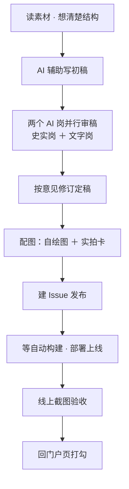
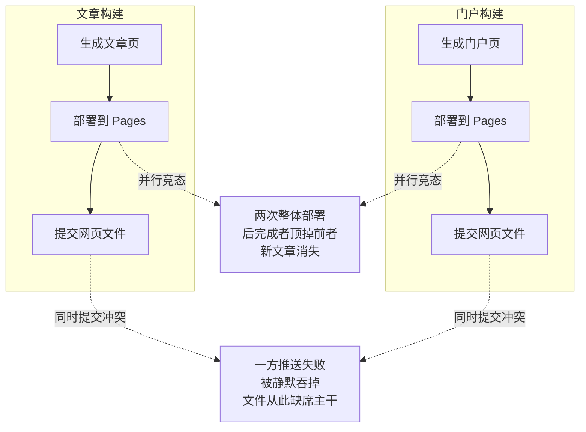

## 小白交底

先把这一篇要讲的摊开：

1. 过去二十多天，叶扬用 AI 辅助写了几十篇博客。写得越快，「写完之后那一堆事」就越显眼，于是被逼着搭了一条半自动流水线。
2. 其中有一篇，**正文只花了约 19 分钟写完，整套发布却挂钟 98 分钟**。
3. 事后做尸检，发现慢的原因根本不是活儿多——是两个外部工具「悄无声息地卡死」，让整条时间线白白等了约 **41 分钟**。
4. 于是动手优化。结果优化方案自己又坑了两次：一次虚惊，一次真的「失火」，把刚发布的文章从线上烧没了。
5. 最后流水线稳定下来，发布本身只要 **150–180 秒**。这一篇讲全程。结论不止适用于写博客——任何「需要调用一堆外部服务、还要等它们干完」的系统，都能对上号。

## 一、先认识一下这条流水线

叶扬这个博客有点特别：它没有数据库，也没有传统意义上的后台。**每一篇文章，本质上是 GitHub 仓库里的一条 Issue**；提交一篇文章，就触发一套叫 GitHub Actions 的自动构建，把 Markdown 渲染成网页、部署到 GitHub Pages 上。

在这种设定下，从「脑子里有想法」到「文章上线能读」，中间要走这么几步：

%%{init: {'theme':'dark','themeVariables':{'background':'#0d1117','primaryColor':'#1f6feb','primaryTextColor':'#ffffff','primaryBorderColor':'#79c0ff','secondaryColor':'#21262d','tertiaryColor':'#30363d','lineColor':'#8b949e','textColor':'#e6edf3','clusterBkg':'#161b22','clusterBorder':'#58a6ff','edgeLabelBackground':'#21262d','fontSize':'15px'}}}%%


逐个说一句它们在干什么：

- **写初稿**：把素材读进去，AI 帮着把一篇几千字的稿子拉出来，再由人定结构、改口吻。
- **双岗审稿**：再起两个独立的 AI，一个专挑**史实/事实错误**（生卒年、专有名词、术语归属），一个专挑**文字问题**（语病、标点、Markdown 粗体有没有正常渲染）。两个都只汇报、不动手，而且互相不知道对方说了什么——避免互相迁就。
- **配图**：不用网上抓来的历史图片（有版权风险），全部自己画：要么用 mermaid 画流程图，要么做一张暗色 HTML 卡片、用无头浏览器拍成图片。
- **发布与验收**：建 Issue、等构建、确认页面和图片真的能打开（HTTP 200），最后回到一个叫「门户」的目录页把这一篇勾上。

听起来步骤不少。但很快你会看到，**真正吃掉时间的，往往不是这些步骤本身，而是「等」**。

## 二、案发：那 98 分钟到底去哪了

事情的导火索是一篇关于隋代佛教的文章（内部编号中15）。那天叶扬照例从写到发走完整条线，结束时一看钟——**1 小时 37 分 55 秒**。

奇怪的是，当晚只觉得「今天有点慢」，还在计时记录里写下「全程连续、无休眠无挂起」——慢归慢，每一分钟都以为自己在干活。直到几天后回头做尸检，把每一段时间按「活跃 / 等待」拆开，再把 GitHub 上每次构建的真实时间戳调出来逐一比对，才看出了门道。结果是这样的：

| 阶段 | 干了什么 | 墙钟 | 性质 |
|---|---|---|---|
| 写初稿 | 读素材、拉出 8000 多字 | ≈19 分 | 活跃 |
| 等双岗审稿 | 两个 AI 并行在审 | ≈11 分 | 必要等待（已并行） |
| 按意见全改 | 改错、清理措辞 | ≈6 分 | 活跃 |
| 配图实拍 | 卡片、流程图 | ≈3 分 | 活跃 |
| 图片入库 | 提交到仓库 | ≈4 分 | 活跃 |
| 全量重建 | 为部署图片手动重跑全站 | ≈5 分 | 本来可以全省 |
| 建 Issue、文章上线 | 发布 | ≈3 分 | 活跃 |
| **截图第一批** | 三个浏览器并行冷启动 | **14 分** | **异常挂起** |
| **等门户构建** | `gh run watch` 干等 | **30 分** | **异常挂起** |
| 收尾 | 日志、记忆、状态 | ≈5 分 | 活跃 |

真正的活跃工作加起来大约 **57 分钟**。两个黑洞在表里占了 14 分和 30 分，但那是墙钟口径；扣掉它们本该花掉的时间（截图正常二十多秒、门户构建约一分半），**真正被白白浪费的净等待约 41 分钟**（≈12＋28.5）。它们有个共同的名字——「静默黑洞」：

**黑洞①：截图的三个浏览器并行冷启动，14 分钟。** 为了一次截好几张图，当时的做法是同时开三个独立浏览器实例去跑。结果它们抢资源、互相卡住，足足挂了 14 分钟。而同样的活儿，后来改成单个浏览器连续拍，**只要 27 秒**。

**黑洞②：等门户构建，干等 30 分钟。** 当时用的是 GitHub 官方命令行的 `gh run watch`，本意是「你帮我盯着构建，绿了告诉我」。但这个命令悄无声息地卡死了——shell 整整 30 分钟后才返回，当时却毫无察觉。事后去查构建记录，人家**早就成功了**：真正的构建只花了约一分钟。

尸检还顺手排除了几个常见嫌疑：不是机器睡眠（系统日志里没有休眠记录）、不是代理问题（当时直连）、也不是浏览器进程残留。

最后只剩一个解释，也是整件事最关键的一句话：

> **外部进程偶尔会「半挂」——TCP 发出去没回应、并行冷启动互相竞争——而调用方既没有设超时，也没有打印任何输出，于是主流程只能干等。**

这类问题你预测不了，但可以让它**不堵路**。


## 三、第一次抢救：让「等待」不再堵路

针对尸检结果，做了一轮优化。思路分两层：先治「久」（让挂起不堵路），再压「活」（把能省的步骤省掉）。

**第一层，专治静默等待：**

1. **外部等待一律包超时**。凡是 `gh`、`node` 这种要往外发请求、可能卡住的命令，外面都套一层超时；时间一到就不再傻等，转成主动去查状态。
2. **长任务禁止静默**。不再把输出丢进黑洞，全程写日志、带时间戳。因为这次两个黑洞之所以毫无证据，正是因为当时「静默」了——你想复盘，连个日志都拿不出来。
3. **截图改成单浏览器多景模式**。改造截图工具，让它**一次冷启动、连续拍完全部景**，消灭「三个实例并行竞争」的竞态。这正是 14 分钟变 27 秒的来源。

**第二层，把活跃路径也压一压：**

4. **构建从 3 次降到 2 次**。以前图片传上去之后，要手动「全量重建」一次，确保图片部署到位；后来核实了构建流程每次都会取最新代码，理论上**直接建文章 Issue，图片就会跟着文章一起部署**，那一次全量重建可以省掉。
5. **门户打勾改成「并行」**。以前是文章上线、验收完，最后再去门户页打勾、再等门户构建一次；优化方案是文章 Issue 一建出来、拿到编号，立刻去门户打勾——因为门户只需要一个能提前算出来的文章链接，不依赖文章真的上线。这样门户自己构建的那两分钟，就能和线上验收重叠，省掉「最后再干等一轮」。
6. **写一个一键发布脚本** `publish-post.py`：发布前自检（检查 Markdown 粗体、扫用词）→ 确认图片已就位 → 建 Issue → 限时轮询等构建 → 验证页面能打开。把「临场手敲一串命令」变成「跑一个脚本」，因为这次踩的好几个坑（命令写错、静默重定向）本质都是临场操作的隐患。

方案看上去很完美。然后，现实就开始打脸了——而且是两次。

## 四、第一次打脸：「构建 3→2」当场证伪

新流程第一次实战，发到一篇关于天台宗的长文（中16）。文章 Issue 建好了，构建也绿了——结果一验收：**图片 404，打不开。**

不是说好了「图片会跟着文章一起部署」吗？

顺着构建脚本往下挖，找到了根因：这套构建系统在「只重建单篇文章」的模式下，**有一个只在全量构建时才执行的「清理 + 拷贝静态文件」动作，被跳过了**。也就是说，新建的图片虽然已经在代码仓库里，却没有被复制进最终要部署的目录。

那个「看上去可以省掉」的全量重建，恰恰是默默在帮你把图片归位的步骤。**你以为是冗余的动作，可能正是兜底的那道闸。**

修复没有去迁就旧习惯（重新加回全量重建），而是在自动构建的工作流里补了一行：进入单篇构建前，先判断目录在不在，在就把静态文件拷进去。这是一个很小的补丁，但从那以后，「传完图片直接发文章」才真正成立。

这一轮的教训很朴素：**对第三方构建流程的假设，不能停留在「我觉得它会」，要验证到具体那一步代码**。它在全量模式下做的事，不代表在增量模式下也会做。

## 五、第二次打脸，也是真正的大火：门户并行把新文章烧没了

如果说上一次是虚惊，这一次就是真失火了，而且烧的正是优化方案第 5 条——「门户并行打勾」。

事发在一篇关于玄奘的文章（中18）。发布时，文章和门户两个构建像设计好的那样**并行**跑了起来。两个构建各自都「成功」，灯都是绿的。然后诡异的事情出现了：**刚发布的新文章，线上打不开。**

更冷的是，往前一查，**前一篇文章（中17）也早就 404 了**不过两篇的丢法并不一样：中17 发布时，是自动**提交**那一步与门户冲突、推送失败被静默吞掉，网页文件压根没进主干——只是当时构建产物照样部署了上去、页面能正常打开，人人都以为没事，直到这一篇才把它翻出来。也就是说，中17 栽在「提交冲突」，中18 栽在「部署覆盖」，下面那两条雷各烧掉一篇。这类事故是会「延迟发作」的。

为什么会这样？两个并行构建，埋下了两条互相不挨着、但都会爆的雷：

%%{init: {'theme':'dark','themeVariables':{'background':'#0d1117','primaryColor':'#1f6feb','primaryTextColor':'#ffffff','primaryBorderColor':'#79c0ff','secondaryColor':'#21262d','tertiaryColor':'#30363d','lineColor':'#8b949e','textColor':'#e6edf3','clusterBkg':'#161b22','clusterBorder':'#58a6ff','edgeLabelBackground':'#21262d','fontSize':'15px'}}}%%


**雷①：两次部署互相覆盖。** GitHub Pages 的部署不是「增量」的——不是只传一个新文件，而是**把整个站点整体推上去**。两个部署并行时，谁后完成，谁就是最终版本。如果门户那一下后完事，它手里那份站点快照里还没有新文章，就会把刚部署好的新文章整个顶掉。

**雷②：两次提交互相冲突。** 两个构建还会各自往仓库里提交生成好的网页文件。并行提交时，后提交的那个会因为「代码已经变了」而推送失败。偏偏工作流里这一步写成了「推送失败也无所谓、继续走」，于是这个失败被**静默吞掉**，网页文件从此在主干代码里缺席，连个报错都没有。

抢救用的是最稳的办法：**手动触发一次全量重建**，让单个构建按顺序把所有页面重新生成一遍、一次性部署——同时修复线上产物和主干代码，几分钟搞定。

但真正重要的是修复流程本身。一键发布脚本被改成了**严格串行**：

> 文章先构建 → 确认文章和图片全部 200 → **这之后**才去门户打勾 → 再等门户构建。

门户和文章，从此绝不在同一时刻跑。

这一轮换来的认知，是整篇复盘里叶扬最想留下的一句：

> **「两个构建都绿了」，只证明它们各自成功了；完全不证明它们的部署结果、提交动作能彼此共存。**

监控面板上一片绿，不等于系统状态正确。**「成功」是要分层看的。**

## 六、终态：严格串行，稳定在 153 秒

改完之后，新的时序是一条直线，没有任何并行：

```
建文章 Issue → 等文章构建 → 验证文章和图片全部 200
            → 门户打勾 → 等门户构建 → 完成
```

代价是有的：门户打勾从「顺手并行」变成了要多等一个构建周期，大约一到两分钟。但这点等待是**可预期的**——它换来的是整类竞态事故的消失。用确定的短等待，换掉不确定的「偶尔失火」，这笔账很划算。

效果是连续三篇文章，**发布环节全部零事故**：

| 篇目 | 主题 | 发布用时 |
|---|---|---|
| 中19 | 义净海路求法 | 153 秒 |
| 中20 | 华严宗与律宗 | 176 秒 |
| 中21 | 禅宗 | 153 秒 |


注意这个数字的口径：它指的是从「执行发布脚本」到「文章上线、门户也更新完毕」的**纯发布时间**，不含写稿和审稿。在最早的手工时代，光是「等各种构建、处理各种卡点」就能耗掉几十分钟；现在这一段被压到了两分半到三分钟，而且几乎不需要人盯着。

有意思的是对比开头那篇：写一篇正文，今天依然要十几二十分钟，**AI 让「把想法变成稿子」变便宜了，但没有把它变成零**。真正被大幅优化掉的，是那些「卡住你、你却说不清在等什么」的时间。

## 七、沉淀下来的几条工程原则

绕了一大圈，最后能从这件事里带走的，其实是几条对任何系统都通用的工程常识。叶扬顺手用做软件的视角翻译了一遍：

1. **任何外部调用，都要给超时和重试边界。** 你控制不了对端的 TCP 状态、控制不了它会不会半挂。你能控制的是「我最多等多久、等不到怎么办」。没有超时的等待，等于把系统的命运交到对端手里。

2. **不要静默失败。** 日志和心跳，是出事时唯一的证据。这次两个黑洞之所以难查，全因为当时既没超时也没输出。能打印进度就别吞，能落日志就别 `/dev/null`。

3. **「成功」要分层验证。** 构建成功 ≠ 产物正确 ≠ 部署可达 ≠ 多个操作能彼此共存。每一层都要有自己的验证手段，尤其不能拿「灯是绿的」代替「系统是对的」。

4. **警惕「整体覆盖」型副作用。** 当多个操作会并行写同一个目标、而规则是「最后一个赢者通吃」时，并行就是事故的温床。这跟分布式节点竞态写同一条记录、跟多人同时编辑互相覆盖，是同一类问题。

5. **用工具接住纪律，而不是靠临场记性。** 人会忘、会在赶时间时跳过检查、会临场敲错命令。把正确做法写成脚本、让「走正道」成为最省事的那条路，比反复提醒自己「下次小心」可靠得多。

6. **并行省的是墙钟，串行买的是确定性。** 当单次操作的成本已经很低（比如一次发布只要两分多钟）时，优先选确定性高的方案；为了省一两分钟去引入难复现的并发隐患，通常不划算。

## 写在最后

复盘这件事，价值从来不在「谁出了错」，而在**让同一类坑，不犯第二次**。

这二十多天里，叶扬最大的体会是：搭一条自动化流水线，最难的从来不是把步骤串起来——那只是体力活；真正难的是诚实面对它「偶尔不对」的时刻，搞清楚到底是哪一层的假设错了，然后把这个认知焊死进工具里，而不是记在脑子里。

工具会替你记住教训，前提是你得先把教训想明白。

## 术语表

| 术语 | 一句话解释 |
|---|---|
| GitHub Issue | 本博客里「一篇文章」的真身；建 Issue 即触发发布 |
| GitHub Actions | GitHub 提供的自动构建服务，按设定好的流程跑任务 |
| 工作流（workflow） | 一套写在配置文件里的构建步骤，如「生成网页→部署」 |
| run | 工作流的一次具体执行；「绿了」指这次执行成功 |
| GitHub Pages | GitHub 提供的静态网页托管，文章最终部署在这里 |
| Pages deploy（部署） | 把生成好的网页发布上线；本系统是「整体覆盖」非增量 |
| Gmeek | 本博客用的那套「用 Issue 写博客」的开源构建框架 |
| Markdown | 一种轻量排版语法，文章的源格式 |
| 粗体起符 | Markdown 里用一对双星号包住文字即变粗体，中文标点旁容易失效 |
| CDP | Chrome DevTools Protocol，用来程序化控制浏览器截图 |
| 无头浏览器（headless） | 不弹窗、在后台跑的浏览器，常用于自动截图 |
| pre-flight（发布前自检） | 正式发布前先跑一遍检查，把错误拦在上线之前 |
| 门户（portal） | 一个目录页，列出系列里每一篇的完成状态 |
| 门户 hook | 一段自动帮门户页「打勾」的小脚本 |
| postList | 站点维护的「文章清单」数据，供导航、检索使用 |
| 全量构建 | 把整个站点所有页面重新生成一遍，慢但彻底 |
| 增量构建 | 只处理变化的部分，快但可能跳过某些兜底步骤 |
| 竞态（race） | 多个操作并行、结果取决于「谁先谁后」的危险情形 |
| 超时（timeout） | 给等待设上限，到点不再傻等 |
| 重试（retry） | 失败后按策略再试，常配合「绕过缓存」验证 |
| 静默失败 | 操作失败了却不报错、不留痕，最坑的一类问题 |
| SOP | Standard Operating Procedure，标准作业流程 |
