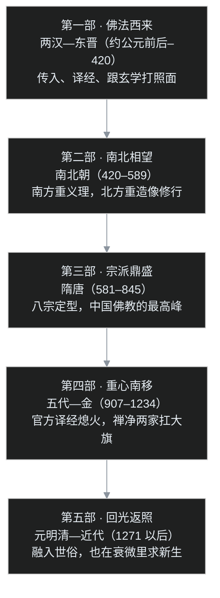
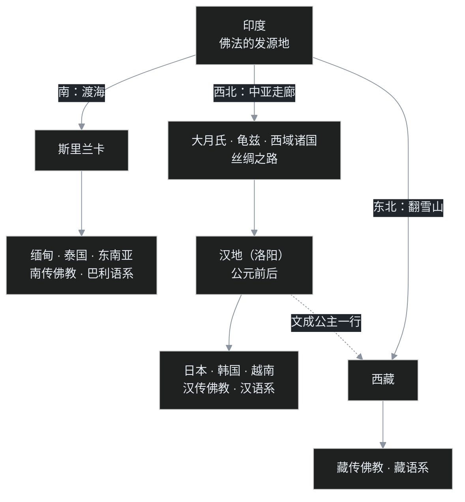

> 📚 中系·中国佛教史学习笔记开篇。上接印度佛教史 C 系（十七篇已结账），从这一篇起，镜头从恒河岸边摇到丝绸之路上。

## 一个先送上来的问题

佛教不是印度的吗？

可今天中国人一提起和尚、寺庙、念佛、打坐、因果报应，都觉得是自家东西。日常话里随手一掏就是一把：缘分、刹那、世界、觉悟、口头禅、放下屠刀、醍醐灌顶……全是佛教带来的词，用了两千年，用到没人觉得它们"外来"。

一个从外国传进来的宗教，凭什么在中国活了两千年，还活成了儒、释、道三大块之一？

叶扬刚翻这些材料时，脑子里卡着一个更刁的问法：**这两千年，到底是佛教被中国"汉化"了，还是中国被佛教"改造"了？**

这一篇不着急回答，先把三样东西摆上桌：两千年的时间怎么分段、佛教来中国走的是哪几条路、常听人说的"八宗"到底是哪八个。有了这张地图，后面三十篇才走得动。

不过在摊地图之前，叶扬想先让读者看一眼原料仓库。硬盘里躺着三部中国佛教史课程的干净文本，合计约一百八十万字：两部已经清洗完毕、并排躺在 `中国佛教史-clean` 目录里（还附带一份一百条的校对清单），第三部是 43 个按章节编号的 md，就是下面这个文件夹——

这三部就是中系 31 篇的全部原料。一部编年史骨架最全，一部概说地图最清楚，一部义理挖得最深——后面会经常看到它们互相补台。

## 一、先把两千年摊成五段

中国佛教史差不多就是整整两千年——从两汉之交一直走到今天。两千年听着吓人，其实按朝代一刀切，就五段：

每一段各有一句"戏眼"，叶扬先在这里各埋一个钉子：

- **两汉东晋**：佛教是个"新鲜的洋玩意儿"，靠西域来的和尚们一部经一部经地译，先在读书人圈里跟老庄玄学搭上话。
- **南北朝**：天下裂成两半。南方的士大夫围着经书辩论，北方的皇帝直接在山崖上凿大佛——信仰的两种活法。
- **隋唐**：天下一统，佛经也攒够了，中国人不再只做"翻译搬运"，开始自己立宗派、搞体系。八宗里大部分在这三百年里开张。
- **五代宋金**：会昌法难加上战乱，经院派的大宗派垮得差不多，反而是不那么依赖典籍的禅宗、净土宗活了下来，佛教的重心一路南移。
- **元明清到近代**：佛教彻底融进老百姓的日常，但也越来越世俗、越来越松散。直到近代庙产被惦记、新式知识分子围攻，才有太虚法师这一代人喊改革。

记五个词就够了：**西来、相望、鼎盛、南移、回光**。中系 31 篇，全是挂在这五段上的。

## 二、一张世界地图：佛法走的是哪几条路

要看懂中国佛教，先得把镜头拉远——佛教从来不是"印度直传中国"一条直线。

佛教从印度出发，历史上走出去三条大路，今天还在用"三大语系"来称呼这三个分支：

**南线走海路**：从印度渡海到斯里兰卡，再传到缅甸、泰国这一片。这一支用巴利语（印度古代的一种俗语）写经典，出家人还保持着托钵乞食、披着割截缝成的三衣（大白话：三块布拼缝成的袈裟）的老传统，所以又叫南传上座部佛教——就是 C 系里讲过的"根本佛教"作风的活化石。

**北线走陆路，又分两支**：

一支往西北，翻过雪山、穿过沙漠，沿着丝绸之路一站一站往东。中间要经过一串关键中转站：大月氏、安息（伊朗一带）、龟兹、于阗……佛经不是直接从梵文"空运"到洛阳的，是在这些绿洲小国里先转成当地语言、攒了几十年甚至上百年，才被商队和僧人带进玉门关。这一支到了汉地之后又继续东传，去了朝鲜、日本、越南。整个东亚用的佛经都是汉译本，写文章用的也是中文——所以"汉语系佛教"从来不只是中国一国的事。

另一支往东北，翻喜马拉雅到西藏，时间晚得多（唐代才大规模传进去），而且有两个源头：一路从印度直接进来，一路从汉地进去——文成公主、金城公主带去的就是这一路。两支在西藏还吵过架、撞过车，最后融成一个藏传佛教。

所以"中国"在这张地图上的位置很特殊：**汉传佛教这一支，中国是中转站兼最大的枢纽站；印度佛教在 13 世纪初本土灭亡以后，中国更成了佛教的"第二个祖国"**——向北传的家底，大半都存在中国这个仓库里。

顺便给下一篇埋个钩子：佛教到底哪一年进的中国？这个问题竟没有标准答案。有"汉明帝做梦，金人飞进大殿"的传奇版（公元 67 年，白马驮经，洛阳白马寺），也有《三国志》裴松之注引《魏略》里干巴巴的一条：公元前 2 年（汉哀帝元寿元年），大月氏使者伊存向博士弟子景庐（这个名字各书传写不一）口授《浮屠经》。哪个真、哪个是后人编排的？中01 专门断这个案。

## 三、八宗是哪八个：隋唐留下的菜单

"八宗"这个词，很多人听过，真让报名字就卡壳。叶扬当初就是卡在这儿——其实有个一劳永逸的记法。

先记住一句话：**这些"宗"是隋唐才成型的**。汉朝人、六朝人只知道"译了什么经、老师怎么讲"，脑子里根本没有"我是哪一宗的和尚"这种概念。宗派是中国人把传入的佛经消化了几百年之后，自己搭出来的体系。

汉传佛教的主流说法是"大乘八宗"：

| 宗派 | 主要依据的经典 | 一句话讲什么 | 关键祖师 |
|---|---|---|---|
| 三论宗 | 《中论》《百论》《十二门论》 | 一切法空，破尽执着 | 吉藏（陈隋唐） |
| 天台宗 | 《法华经》 | 一心三观、一念三千，把禅观和判教搭成完整体系 | 智顗（陈隋） |
| 华严宗 | 《华严经》 | 法界缘起，事事无碍，一切事物互相含摄 | 法藏（唐） |
| 法相唯识宗 | 六经十一论（《解深密经》《瑜伽师地论》等） | 万法唯识，把心识和外境分析到最细 | 玄奘、窥基（唐） |
| 律宗 | 《四分律》 | 戒律如何理解、如何受持，一切宗派的地基 | 道宣（唐） |
| 禅宗 | 不立文字，以心印心 | 直指人心，见性成佛，不靠经典靠师徒 | 菩提达磨→慧能（南北朝—唐） |
| 净土宗 | 《无量寿经》《观经》《阿弥陀经》 | 念佛往生西方净土，靠阿弥陀佛的他力接应 | 昙鸾、道绰、善导（南北朝—唐；另有以庐山慧远为初祖的祖师系统，宋代才定型，中07 再讲） |
| 密宗（真言宗） | 《大日经》《金刚顶经》 | 身口意三密相应，即身成佛 | 善无畏、金刚智、不空（唐开元） |

两个小注解：

第一，"八宗"之外还有两个以论典立宗的小乘宗派——讲《俱舍论》的俱舍宗、讲《成实论》的成实宗，加上它们凑成"十宗"。这两派后来都没有独立传下来，思想分别被唯识、三论吸收，所以民间只记住了八个。

第二，看这张菜单能发现一件有意思的事：**八个宗派里，只有天台和华严的核心框架是中国人自己搭的**（经典虽然是外来的，但判教体系、观行次第完全是自创）；禅宗更是干脆"不立文字"，印度源头只能追到一个模糊的法脉传说。佛教在中国不是简单被"接收"，是真的被"续写"了。

这些宗派后来的命运也不一样：隋唐一结束，三论、唯识、华严这些重学问、重典籍的宗派迅速凋零，禅和净土因为"轻资产"反而越做越大。这是中23 以后的故事，先把菜单记住。

## 四、"中国化"的真相：内核不动，外壳全换

现在回到开头那个刁问题：佛教是被中国"汉化"了吗？

是，也不只是。课程里有个词把这件事讲得最透，叫**契理契机**：

- **契理**：跟佛法的核心真理相合——四谛、缘起、无我、以解脱为目标，这是不能动的东西；
- **契机**：跟当下听法的人的根机、时代的背景相合——听不懂、用不上，佛法传不过来，更传不下去。

这两个词一摆，整部中国佛教史其实就是一部"在契理和契机之间走钢丝"的历史。最直观的例子是吃饭问题。

印度和尚靠**托钵乞食**：不空着手攒粮食、不碰钱，一天一顿，生活需求压到最低，好处是全心修行，顺带跟来布施的优婆塞（在家修行的男居士）结个法缘。可这套办法原样搬到中国就撞墙了——中国是儒家社会，讲究人要自食其力，一个人天天端着碗上门要饭，在中国人眼里不是修行，是懒汉；更何况"师"在儒家文化里地位很高，让当老师的和尚出去乞讨，全社会都接受不了。还有气候：印度暖，露宿、树下坐都过得去；中国北方的冬天，照搬这一套是要冻死人的。

怎么办？于是有了**丛林制度**：和尚聚在山林里建寺院，**自耕自食**——这在印度戒律里本来是严禁的（垦土掘地会伤虫、也会让人攒下产业），百丈怀海禅师甚至立下"一日不作，一日不食"的规矩。但仔细看内核：田里种出的米、山上砍的柴，都不属于个人，属于寺院这个"常住"，十方僧人共享——**形式从"托钵"换成了"种田"，"僧人不许有私财、全心修行"的原则一点没变。**

打个程序员都懂的比方：**这是一个海外开源框架做本地适配**。

框架的核心 API（接口）不能改——四谛、缘起、无我、解脱，改了就不叫这个框架了；但它底下的实现层要全部重写：运行环境从印度热带农耕前的社会，换成温带的中华帝国；依赖的基础库（种姓社会、婆罗门文化、托钵传统）全都不存在，得自己造；文档语言还得从梵文译过来——傅新毅老师在课里特别强调，梵文和中文可能是世界上差距最大的两种语言：一个靠繁复的语法规则（性、数、格）把意义写死在词形里，一个几乎没有词形变化，全靠词序和"言外之意"。这层厚厚的适配层，就是"佛教中国化"。

按惯例，叶扬得自己把这个类比的破洞戳掉：

1. **代码移植有明确的作者，文化移植没有。** 框架适配是有架构师的，佛教中国化没有总设计师——道安、罗什、慧远、智顗、百丈，加上无数没留下名字的和尚，四五百年里一人填一块，是试错试出来的。
2. **适配层写厚了会反客为主。** 民间信仰、道教元素、皇权的要求，都可能混进适配层里一起编译。法会里混进烧纸钱、看风水，调用的到底还是不是佛法的 API，时间一长就说不清。印度晚期佛教就是这么出的事——C09 讲过，大量吸收印度教元素去"适应市场"，适应着适应着，把自己适应没了。
3. **框架有版本号可以回滚，思想漂移没有 commit 记录。** 念佛从一种修行方法，变成净土宗的核心，再变成民间超度亡人的生意，中间没有任何一次明确的"版本发布"。所以"契机"必须有一根警戒线：方便可以开，但方便一旦泛滥到盖住核心，就不是适应，是变质。

不写代码的读者记住大白话版：**把外国菜谱做成中国菜**。食材可以换、调味可以调，不换的是这道菜的"魂"；怕的是做到最后，菜名还在，味道跟原来一点关系都没有了。

## 五、佛教到底给中国装了什么

最后算账：佛教这趟"本地化部署"，给中国文化装了多少东西？

先说最硬的一笔账。梁启超写《翻译文学与佛典》时，曾据日本学者编的《佛教大辞典》统计，这类辞典收佛教词条 **三万五千有余**——一个词汇（名相）代表一个观念，三万五千个观念，等于给中国人的脑子接了三万五千条新数据线。至于这部辞典出自谁手，学界有织田得能、望月信亨两说，这里先不坐实，留待以后查证。

- **语言层面**：世界、刹那、缘分、因果、觉悟、菩萨、地狱、功课、绝对、相对……很多词今天已经完全"洗白"，没人知道是外来词。成语里更是一抓一把：醍醐灌顶、盲人摸象、借花献佛、现身说法、泥牛入海、种瓜得瓜……《红楼梦》里随便翻几页，佛教词比儒家的还密。
- **思想层面**：佛教进来以前，中国人的精神世界主要是儒家（怎么做人、怎么治世）加道家（怎么看待天地自然），但对"人死后怎样""世界的本质是什么""个人痛苦怎么解脱"这一类问题，着墨不多。佛教把一整套形而上学和心性论搬了进来，宋明理学表面上在辟佛，骨子里讨论的心性、理气，一半是在跟佛教对话——打不过就加入，加入完还说这是我们自己的东西。
- **艺术层面**：石窟（云冈、龙门、敦煌）、佛塔、梵呗、变文（说书说唱的祖宗）、雕塑、书法……要是把佛教因素从中国艺术里抽掉，剩下的中国艺术会塌掉一大块。

所以开头那个问题，现在能给半个答案了：**不是佛教单方面被汉化，也不是中国单方面被改造——更准确的说法是"互写"：佛教改写了中国文化的底层词汇和精神版图，中国也重写了佛教的存在形态。** 另一半答案，要等三十篇走完才凑得齐。

## 吵架现场

老规矩，把反方请上场。这个话题上，反方有两拨，而且一拨在门外、一拨在门内。

**门外的反方：夷夏论者。** 从南北朝的顾欢《夷夏论》到唐代韩愈《论佛骨表》，质问一脉相承：佛是外国人的神，比丘剃头、不婚娶、不拜父母、不拜皇帝，把中国人伦的根基——忠孝——全架空了；好好的中原，凭什么让一个外来教进来立规矩？

这是认真的问题，不能一笑带过。叶扬的接法是：把问题拆成两层。"它是不是外来的"是个事实层——是，白纸黑字。但"外来的东西能不能成为中国的一部分"是个历史层——佛教用两千年的融入自己投了票：它学会了拜皇帝（"不依国主，则法事难立"，这是道安的话），学会了讲孝（甚至编出《父母恩重经》这样的"国产经"），学会了自食其力。真正该追问的从来不是"它从哪儿来"，而是"本地化之后，它的内核还在不在"。韩愈那一派的完整登场和会昌法难的来龙去脉，中22 专篇伺候。

**门内的反方：保守派僧人。** 质问同样狠：比丘受的具足戒（全套出家戒律）里明明不许垦土掘地、不许蓄积粮食，中国和尚又是种田又是攒产业，这叫什么弘法？这叫妥协！改来改去，改的还是佛法吗？

这一问恰恰是佛门外的"自我批评传统"，从慧琏法师的课到《概说》，开口都在反省这件事。答案前面给过：形式可变、原则不让步，种田的产出归公有而不进私囊，就是守住了底线。但保守派的警惕永远有价值——**"方便"和"泛滥"之间只隔一层窗户纸**：烧纸钱一度也被说成"方便接引"，水陆法会里混进整套道教神仙也自称"方便"。每一代都得有人在旁边喊一声：现在是在契机，还是已经在变质？印度本土佛教的灭亡，就是没人喊住、或者喊了没人听的结果。

## 卡壳角

**卡壳一：八宗老是背不全，还把"八宗""十宗"搞混。** 后来叶扬找到的记忆钩子有两个：一是时间锚——宗派是隋唐的产物，不是跟着佛经一起来的；二是"八宗＝大乘八宗，俱舍成实两个小乘论宗凑成十宗，但这俩后来被吸收、没独立活下来"。想通这一层，就再也不纠结"到底八个还是十个"——两种说法数的根本不是同一批东西。

**卡壳二：一开始把"中国化"理解成"妥协变味"，心里是带着点贬义的。** 凭直觉总觉得：原样的才正宗，改了就是打折扣。后来才转过弯：第一，本地化不是佛教到中国才有的特殊待遇，它走到哪儿都在本地化——去斯里兰卡、去西藏、去日本，全都换过壳子，"契机"本来就是这个宗教的传播基因；第二，死守印度形式的结果不是"保持纯洁"，是根本活不下来，托钵在中国社会运转不下去，这是现实。真正的分水岭不是"改没改"，而是**改的时候核心 API 有没有被偷偷换掉**——这根弦，跟 C 系的变质线正好接上。想通这两点，"中国化"才从一个可疑的词，变成一个值得认真研究的现象。

## 术语表

| 术语 | 大白话 |
|---|---|
| 佛陀 / 浮屠 / 浮图 | 早期音译不统一，浮屠、浮图都是"佛陀"（觉者）的不同译法 |
| 菩萨 | 菩提萨埵的简称；已发心求觉悟、还要普度众生的修行者 |
| 比丘 | 出家受了具足戒的男僧人（女性称比丘尼）；优婆塞则是在家修行的男居士 |
| 般若 | 读作"bō rě"，观照一切法空的智慧，不是普通聪明 |
| 丛林 | 汉地僧众聚居、集体修行的寺院，尤其附设禅堂、实行农禅的那种 |
| 契理契机 | 既符合佛法核心真理，又适合当时听者的接受能力——中国化的总原则 |
| 判教 | 把佛陀说的一切经典按深浅、先后编排成一个有层次的教学体系，各宗各有判法 |
| 他力 / 自力 | 净土宗教法：靠阿弥陀佛的愿力接应叫他力，全靠自己修行叫自力 |
| 三大语系 | 南传巴利语系、北传汉语系、藏传藏语系——按经典语言划分的佛教三大分支 |
| 具足戒 | 出家人受的全套戒律（比丘戒条数远多于在家戒），受了才算正式僧人 |

## 写作路线图：中00–中30（持续打勾）

中系是带着完整施工图纸开工的系列：全系列规划 **31 篇**，按五段历史分部。这张表是中系进度的**唯一维护处**——发一篇，叶扬回来勾一篇，别处不再重复清单。✅ 已发布 / ⏳ 下一篇 / 💤 计划中：

### 开篇

| 编号 | 主题 | 状态 |
|---|---|---|
| 中00 | 两千年中国佛教地图：八宗、传播路线与史观 | ✅（本篇） |

### 第一部 · 佛法西来（两汉—东晋）

| 编号 | 主题 | 状态 |
|---|---|---|
| 中01 | 佛教入华的世界背景：大月氏、丝绸之路、伊存授经与汉明传说辨伪 | [✅ #73](/post/73.html) |
| 中02 | 东汉两位先驱：安世高的禅数、支娄迦谶的般若 | [✅ #74](/post/74.html) |
| 中03 | 玄佛初逢：朱士行西行，支谦、康僧会、竺法护与玄学 | [✅ #75](/post/75.html) |
| 中04 | 佛图澄与道安：乱世里的制度奠基 | [✅ #76](/post/76.html) |
| 中05 | 鸠摩罗什：东来之路与长安译场 | ⏳ 下一篇 |
| 中06 | 僧肇与六家七宗：般若学的中国消化 | 💤 |
| 中07 | 庐山慧远：神不灭、《大乘大义章》与念佛立誓 | 💤 |
| 中08 | 竺道生：一阐提成佛与顿悟之辩 | 💤 |
| 中09 | 法显与求法者群像：四世纪末的西行运动 | 💤 |

### 第二部 · 南北相望（南北朝）

| 编号 | 主题 | 状态 |
|---|---|---|
| 中10 | 南朝（上）：梁武帝、《断酒肉文》与范缜《神灭论》 | 💤 |
| 中11 | 南朝（下）：真谛译经与三论复兴 | 💤 |
| 中12 | 北朝：昙曜五窟与太武、周武两次法难 | 💤 |
| 中13 | 地论、达磨禅与净土萌芽 | 💤 |
| 中14 | 《大乘起信论》专论：一心二门与成立之争 | 💤 |

### 第三部 · 宗派鼎盛（隋唐）

| 编号 | 主题 | 状态 |
|---|---|---|
| 中15 | 隋代佛教：一统、舍利塔与南义北禅融合 | 💤 |
| 中16 | 天台、三论与三阶教 | 💤 |
| 中17 | 玄奘（上）：偷渡、五印游学与曲女城 | 💤 |
| 中18 | 玄奘（下）：译场、法相宗与《大唐西域记》 | 💤 |
| 中19 | 义净、唐代译师与经录僧史 | 💤 |
| 中20 | 华严宗与律宗：法藏的法界缘起、道宣的戒律 | 💤 |
| 中21 | 禅宗、净土宗与密宗 | 💤 |
| 中22 | 韩愈辟佛、庶民佛教与会昌法难 | 💤 |

### 第四部 · 重心南移（五代—金）

| 编号 | 主题 | 状态 |
|---|---|---|
| 中23 | 五代十国：世宗灭佛、吴越护教与永明延寿 | 💤 |
| 中24 | 北宋：译经院、度牒僧制与《开宝藏》 | 💤 |
| 中25 | 南宋：五山十刹、士大夫禅与三教争论 | 💤 |
| 中26 | 辽、西夏、金：契丹藏、房山石经与赵城金藏 | 💤 |

### 第五部 · 回光返照（元明清—近代）

| 编号 | 主题 | 状态 |
|---|---|---|
| 中27 | 元代：帝师八思巴、宣政院与白莲旁支 | 💤 |
| 中28 | 明代：明末四大高僧、官版大藏与天主教来华 | 💤 |
| 中29 | 清代：龙藏、居士佛教与太平天国 | 💤 |
| 中30 | 近代前夜：庙产兴学、太虚三大革命与两千年收官 | 💤 |

## 收尾

地图摊开了：五段时间、三条传播路线、八个宗派、一根"契理契机"的主线。

下一篇，中01，正式启程——回到公元前 2 年的丝绸之路上：大月氏人为什么会西迁？伊存口授的《浮屠经》到底算不算佛教入华的"第一刻"？汉明帝那个飞进梦里的金人，又有几分是史实、几分是后人需要它发生？

镜头从长安出发，往西。

