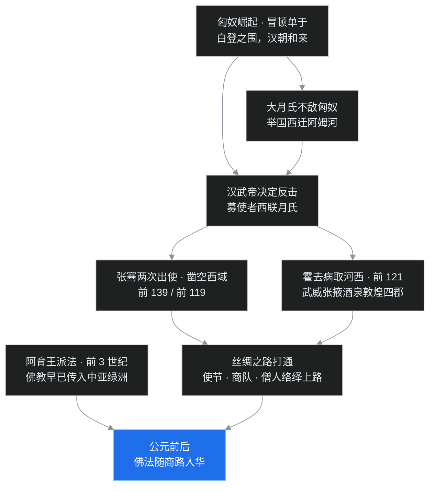
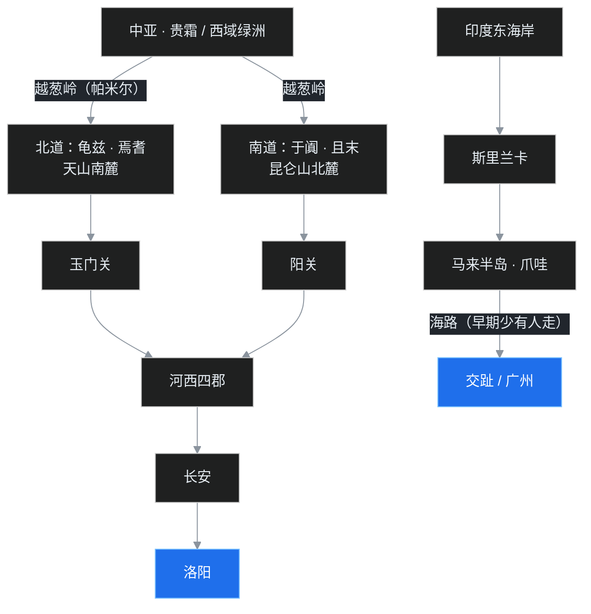

> 这是「中国佛教史」第一篇。中00 铺开了两千年的地图，这一篇把镜头推到最左端——公元前后的那段交界，回答一个乍听简单、其实坑很深的问题：**佛教，到底是怎么进的中国？** 叶扬会把这件事放回欧亚大陆的大格局里讲，再断两桩打了两千年的笔墨官司：「伊存授经」与「汉明感梦」。读完这篇，再去洛阳白马寺，听到的故事就不会照单全收了。

## 先给小白交个底

正式开讲之前，先列几个初学者最容易冒出来的问题，这篇就是来逐个拆的：

- 佛教诞生在印度，印度和中国隔着雪山、沙漠、戈壁，两千年前的人又没有飞机，这教是怎么传过来的？
- 很多人都听过「汉明帝做梦，金人飞来，于是派人去西天取经，白马驮经回来，建了白马寺」——这故事有鼻子有眼，是真的吗？
- 为什么有的书说佛教是「公元前 2 年」传入中国的？这个精确到个位数的年份，凭什么？
- 「白马寺」的「寺」，为什么后来成了佛教庙宇的专用字？它最早不是这个意思吧？
- 佛教刚到中国的时候，中国人拿它当什么？

前两个问题，是这篇的两条主线；后三个问题，会在行文里一个个落网。

## 一、佛法不是「走着来」的：先看欧亚大陆出了什么事

不少人想象佛教初传，画面是一个身披袈裟的苦行僧，翻山越岭一路走到洛阳。这个画面不能算全错——历史上确实有无数僧人用脚丈量过这条路——但它把因果弄反了。**不是某位僧人特别能走，所以佛法来了；而是欧亚大陆的政治版图先被重塑，路先被打通，佛法才顺着路流了进来。**

要讲清楚这件事，得把目光从洛阳、长安往北挪，挪到蒙古高原，先认识一个草原帝国。

### 1. 匈奴崛起，汉朝低头

秦始皇三十二年（公元前 215 年），大将蒙恬率三十万大军北逐匈奴，收复河套地区，又把战国各国的长城连起来，西起临洮、东到辽东，筑起一道万里屏障。注意这个时间点：这是秦朝，佛教都还在印度待着。

强秦一崩溃，边境就松了。草原上这时出了一位枭雄——冒顿单于（「冒顿」念 mòdú，不念 màodùn；「单于」是匈奴首领的称号）。冒顿东征西讨，降服了三十几个小国和部落，草原上第一次有了一个统一的、巨大的军事帝国。

刚刚打完楚汉战争的汉朝，撞上了这个全盛的匈奴。汉高祖刘邦在公元前 200 年亲征，结果在白登山（今山西大同一带）被冒顿的四十万骑兵围了整整七天，史称「白登之围」。最后怎么脱身的？据说是谋士陈平走了夫人路线——重金贿赂匈奴的阏氏（yānzhī，单于的王后），阏氏在冒顿耳边吹了风，包围圈才开了一角。

打不过，那就低头。汉朝从此对匈奴行「和亲」之策：嫁公主、送丝绸粮食，换边境平安。但和亲买不来真和平，匈奴骑兵照样年年南下抢掠。这种憋屈的局面，一直忍到汉武帝上台。刘彻公元前 141 年继位时只有十六岁，这位少年天子不想再忍了。

### 2. 大月氏：一个被赶跑的民族，成了关键棋子

汉武帝想打匈奴，又不想单打独斗，于是到处找盟友。四方探听来一个消息：西边有个叫大月氏（这里的「月氏」课程里特别强调，念 **dà ròu zhī**，不是 dà yuèshì）的民族，跟匈奴有血海深仇。

大月氏原本住在河西走廊、敦煌一带，是个游牧强国。冒顿单于在位时狠狠揍过大月氏，后来冒顿的儿子老上单于更狠，杀了月氏王，还把月氏王的头骨做成酒器。举国之恨，不过如此。可月氏人打不过，只好整体西迁，一直迁到中亚阿姆河以北，在那边重新安家。——西迁的这一支称为「大月氏」；少数没走、留在原地混进祁连山羌人里的，称为「小月氏」。

汉武帝一听：有仇，好，结盟！于是有了那个家喻户晓的名字。

### 3. 张骞「凿空」，霍去病打通走廊

约公元前 139 年，张骞带着一百多人从长安出发，去寻找远在中亚的大月氏。这一去，就是十三年。

出城没多远，张骞一行就被匈奴抓住了。匈奴也没杀张骞，给张骞娶妻生子，一扣就是十年。十年后张骞找机会逃脱，不忘使命，继续往西跑，经大宛（今费尔干纳盆地）终于摸到了大月氏。可此时的月氏人在阿姆河畔安居乐业，土地肥饶、少有寇盗，早就不想回去找匈奴报仇了。张骞磨了一年多，没谈成，只好回国。归途又被匈奴截住，扣了一年多，正赶上匈奴内乱才逃出来。公元前 126 年前后回到长安时，一百多人的使团，只剩张骞和一个胡人向导堂邑父两个人。

联盟没结成，可这一趟的价值远胜结盟：张骞把西域的地理、人口、物产、兵力，全给汉朝带回了第一手情报。司马迁用了两个字评价这件事——「**凿空**」：在黑暗里凿开一个洞，中原第一次看见了西边的世界。

公元前 119 年，张骞第二次出使，这次目标是乌孙，副使们则分头抵达大宛、康居、大月氏、大夏、安息——「安息」就是今天伊朗一带。汉朝和中亚，从此有了官方往来。

配合外交的是军事。公元前 121 年，年方二十的霍去病两次远征河西，大破匈奴，拿下整个河西走廊。汉朝随后在这条走廊上设了武威、张掖、酒泉、敦煌四郡，把通往西域的大门牢牢把住。顺带辨一桩小案：霍去病这一路还缴获过匈奴休屠王用来祭天的金人，后世有人把这尊金人附会成「佛像」，说是佛法早随战利品入宫——但《史记》《汉书》都明载那是匈奴祭天的金属神像，而此时犍陀罗的佛像艺术尚未发端，不可能是佛。匈奴人失去了这块最好的牧场和草场，悲歌流传至今：「失我祁连山，使我六畜不蕃息；失我焉支山，使我嫁妇无颜色。」

门打开了，路就活了。中国的丝绸沿着这条路一路向西，据说后来连罗马的凯撒都穿着丝绸袍子去看戏，惊艳全场；西域的葡萄、苜蓿、骏马、音乐、幻术，也一路向东涌来。这条路，是后来的德国地理学家给取的名字——「**丝绸之路**」。

这里先卖个关子，记住这条路打通的时间：**公元前 2 世纪末**。记住它，是为了对照一件事。

## 二、丝路上为什么会有佛？

路是汉朝打通的，可路上的「货」里为什么会有佛教？这里要把镜头再往西、再往前推。

### 1. 阿育王：比汉武帝早一百年的「派法」

还记得印度线里的阿育王吗（C02 讲过）？这位孔雀王朝的伟大国王约在公元前 270 年即位，打完一场极其惨烈的羯陵伽战争后皈依佛教，从此不靠刀兵护法，而靠派出的传法团队。阿育王把儿子（一说弟弟）和女儿派往斯里兰卡——这是南传佛教的源头；同时向西北方向派出使团，足迹遍及中亚。

也就是说，**早在公元前 3 世纪，佛教就已经越过兴都库什山，在中亚的绿洲国家里扎下了根**——比张骞通西域早了一百多年，比霍去病取河西早了一个半世纪。

所以当汉朝的使节和商队第一次走进西域诸城时，大家看到的不是一张宗教白板，而是一座座早就供着佛塔、念着佛经的绿洲。佛法不是从印度直接跳进中国的，它在中亚「中转」「本地化」了一两百年，等着汉家打通最后这一千多公里。

### 2. 贵霜帝国：大月氏的「续集」

前面西迁的大月氏，故事还没完。月氏人到了中亚以后，征服了南边的大夏——大夏又叫「巴克特里亚」，是当年亚历山大东征留下的希腊人殖民地，城邦富庶，文化是希腊式的。月氏人把当地分为五部翕侯（翕侯是部族首领称号），后来贵霜一部攻灭其余、统一各部，建立了一个大帝国——**贵霜**。

贵霜最有名的国王是迦腻色伽，约在公元 100 年前后在位（正值东汉），是继阿育王之后佛教史上最重要的护法名王。迦腻色伽大兴佛塔、广建寺院；传世的说一切有部文献还称，迦腻色伽王在位时支持过一次大规模的经典结集（此事属部派传世说，各部口径不一）。东汉时期东来的译经僧人里，半数以上来自贵霜，或者途经贵霜——下一篇就要登场的两位先驱，支娄迦谶就出自月氏系统。

希腊遗产也在这里和佛法相遇，结出一个大名鼎鼎的果实——**犍陀罗艺术**。此前佛教长期只用脚印、法轮、菩提树、伞盖这些符号象征佛陀，不直接造像；犍陀罗的工匠看着希腊阿波罗神像学手艺，照着高鼻深目的希腊雕塑样式，第一次把佛陀雕成了人形。今天博物馆里那些波浪卷发、身披希腊式厚袍的早期佛像，就是这么来的。连佛教哲学里「极微」（物质分到不可再分的最小微粒）这类概念，有学者认为也可能受过希腊原子论的刺激。

### 3. 商队到哪里，僧人就到哪里

把这几条线收拢，初传的机制就清楚了：

佛教在中亚是绿洲商队的信仰，商队供奉僧人、祈求旅途平安，僧人则随商队同行、沿路布道；贵霜帝国的保护让这条信仰带更加稳固；汉朝打通西域后，中国的丝绸和西域的珍宝在这条路上双向奔流——**信仰搭的是物流的便车**。

所以佛教入华，不是一次「事件」，而是一股持续了数十年上百年的「流量」。这也解释了为什么「到底哪一年传入」会成为一桩公案：水流过边界的第一秒，本来就没人记账。

## 三、路在脚下：陆路三道与海上航线

顺带把「路」讲清楚，后面两百年的人物故事会反复用到这些地名。

**陆路**（主干道）：从印度西北或中亚出发，翻越葱岭——就是今天的帕米尔高原，「葱岭」这名字据说是因为山上多生野葱——进入新疆南部的塔里木盆地。盆地中间是塔克拉玛干大沙漠，于是路绕着沙漠分成两条：沿天山南麓走沙漠北缘的叫**北道**，经龟兹、焉耆等地；沿昆仑山北麓走沙漠南缘的叫**南道**，经于阗、且末等地。两道在东头汇合，出玉门关或阳关（「西出阳关无故人」的那个阳关），进河西走廊，经四郡到长安，再到洛阳。到了唐代，天山以北又开出一条路，才成了「三道」。

**海路**（早期辅助）：从印度东海岸出发，先到斯里兰卡，渡海绕过马来半岛，经印尼爪哇一带，再贴着中南半岛北上，到交趾（今越南北部，当时属汉朝辖地）或广州登岸。听着顺，其实古代海船小、要分段换船，风险极大；而那时的广州还很荒僻，多瘴气，不是后世的繁华港口。所以东汉三国之前，绝大多数人物和经典走的都是陆路。海路真正唱主角，要等到东南沿海开发起来、以及西北被战乱切断之后——那是很久以后的事了。

## 四、第一桩公案：伊存授经，公元前 2 年的一条孤证

背景铺完，进入正题。中国史料里「佛教」两个字第一次实质性登场，是这样一条记载。

### 1. 出处：一条被「转存」了两次的史料

先交代文献链，这条链本身就值得一看：

三国时期，魏国有个叫鱼豢的史官，写了一部史书叫《魏略》，其中有一篇《西戎传》，专讲西域各国风土。这部书后来失传了——但万幸的是，南朝刘宋的裴松之给《三国志》作注时，大量引用过它。于是《魏略·西戎传》的片段，就靠裴松之的注，被「转存」了下来。

这就是史料学的常态：越古老的书，越常常只活在后来书的引文里。

### 2. 原文讲了件什么事

把这条注的大意翻译成白话：

汉哀帝元寿元年——查历表，这一年就是**公元前 2 年**——大月氏派来一位使者，名叫伊存。伊存向一位「博士弟子」景卢口授了一部《浮屠经》（地点史书未明载，景卢既为博士弟子，事当在长安一带）。

三个名词，逐个解释，因为每个都是知识点。

**「博士弟子」是什么官？** 不是今天的博士研究生。秦汉的「博士」是朝廷设的学术顾问官，起初诸子百家都有博士；汉武帝「罢黜百家、独尊儒术」以后，只留下讲儒家《诗》《书》《礼》《易》《春秋》的「五经博士」，博士们招收的学生就叫「博士弟子」。所以景卢是个在长安读书的儒家青年，体制内的高材生。

**为什么是「口授」？** 因为那时佛经的主流形态就是口耳相传。佛陀去世后第一次结集，大迦叶主持，五百阿罗汉在七叶窟中集会，由阿难诵出法、优波离诵出戒，大家集体确认——这就是最早的「佛经」，它是念出来、背下来的，不是写下来的。文字佛经到公元前 1 世纪才开始在斯里兰卡出现，而且长期并不普及；直到东晋法显去印度时，很多地方仍然是靠口传。所以一位外国使者亲口念经、中国学生当面受教，完全符合那个时代的规矩。

**「浮屠」是什么？** 就是「佛陀」（Buddha）更早期的音译。这里藏着一个很好玩的语音学知识：**上古汉语没有轻唇音，也就是没有今天的 f 音，只有 b、p 这类重唇音**。Buddha 开头那个音，汉代人用汉字去对，对出来的就是「浮屠」「浮图」这类重唇音读法；后来语音演变，轻唇音 f 出现了，才改译成「佛陀」。今天闽南语里「佛」还保留着类似 but 的重唇读法，就是活化石。景卢听到的那部经，按后来的写法就是《佛经》。

顺带一提，景卢这个名字，各本传写不一：景卢、景虑、秦景宪、秦景，都有；学者考证景氏是楚地大姓，这位青年大概是楚地人。名字有出入不要紧，事情的骨架是清楚的。

### 3. 孤证，为什么还被采信？

讲史的人都知道一个规矩：单一来源的记载叫「**孤证**」，孤证不立——意思是只有一条证据，下结论要格外小心。「伊存授经」恰恰就是孤证：除了《魏略》这一条，再没有第二种早期文献印证它。

可是绝大多数学者仍然倾向于认为这件事可信，理由有三：第一，鱼豢是三国时魏人，去西汉末年不算太远，所写的又是当代史官体系内的西域事务，不像民间传说；第二，记载的细节——大月氏使者、口授、浮屠——样样都和前面讲的世界背景严丝合缝：月氏人此时早已崇佛，佛经此时正是口传，音译正该是浮屠；第三，这条记载朴素得近乎干巴，没有神迹、没有梦、没有铺张的场面，一点不像后来那些主动「抬教」的宣传文字。

正因为如此，1998 年，中国佛教界以这一年为坐标，隆重纪念了「中国佛教两千年」。

但写文章的人这里要给自己留一道闸：**孤证终究是孤证，最稳妥的说法不是「佛教于公元前 2 年传入中国」，而是「佛教在两汉之际传入中国」**——两汉之际，就是西汉快亡、东汉将立的那个交界，是一段时期，不是某一天。水入沙的瞬间无法定格，能确定的是那个时段。

## 五、第二桩公案：汉明感梦，一个传说的层垒史

如果说伊存授经是「干巴巴但靠谱」，那另一个故事正好相反——精彩纷呈、妇孺皆知，却经不起细问。这就是「汉明感梦、永平求法」。

### 1. 最早的版本：一个梦

故事最早的可靠出处，是东晋袁宏写的《后汉纪》。大意是：

汉明帝夜里做梦，梦见一个金人，在宫殿前飞行，脖子后面放出光明。第二天明帝问群臣：这是什么神？通西域掌故的傅毅回答：臣听说西方有位神，名叫「佛」，陛下梦见的金人，应该就是这位神。于是明帝派人去西方求法，取回了一部《四十二章经》。

先别急着信，也别急着驳。注意一个小知识：汉代说的「金」，不一定是黄金，铜等金属也可称金，所以「金人」更接近「金属铸成的亮闪闪的人」——这其实很容易让人想到西域各地的金属造像。

### 2. 层垒加码：故事是怎么越长越肥的

真正麻烦的是，这个故事在此后的几百年里被一遍遍重写，每写一遍，就多加几样东西。史学大家顾颉刚讲上古史有个著名说法叫「层垒地造成的古史」：时代越往后，传说里的细节反而越丰富、人物反而越靠前。汉明求法，就是佛教史上最标准的样本：

- 有的书把「派使者」具体成了派**张骞**——这就闹了大笑话：张骞是汉武帝时人，比汉明帝早了近两百年，死人怎么出使？这是把凿空的名人当素材抓来用。
- 后来版本里，使团从西域请回来两位天竺高僧：**摄摩腾**和**竺法兰**，两位的生平、分工、译经目录越写越细。
- 再后来又加上「**白马驮经**」的经典画面——佛经是白马一路驮回来的。
- 最后，为安置两位高僧和经书，在洛阳城西建了一座馆舍，就是「**白马寺**」，被尊为中国第一座佛寺、「释源」。

这里顺手把「寺」字的来历也讲了：**「寺」最早根本不是庙宇名，而是官署的通称**。东汉中央的办事机构叫某某寺，最有名的是管朝会礼仪和外宾接待的「鸿胪寺」——外邦来使，照例由鸿胪寺安排馆舍。西域来的僧人，最初就是作为「外宾」被安置在这类官办招待所里。久而久之，僧人的常住地也被叫作「寺」，官名反而让位给了庙名。一字之转，恰好记录了佛教从「外宾的信仰」变成「身边的宗教」的全过程。

### 3. 学者的三点质疑

故事好听，但学者的追问毫不留情，主要有三：

第一，**人对不上**。傅毅虽是真人，但在明帝即位之初年纪还轻，未必已经在朝、未必有资格御前答梦。

第二，**书对不上**。各个版本对出使年份、使臣姓名、取经经过的记载彼此矛盾，还混进了张骞出使这种硬伤，越晚出的版本知道得越「详细」，这是典型的传说生长轨迹，不是信史的样子。

第三，**动机可疑**。把佛教入华归功于当朝皇帝的一个梦、一次官方求法，这对已经兴盛起来的佛教太有利了——等于是给外来的教门请了一道「御赐牌照」，谁听了不高看三分？学者怀疑，这整个故事是佛教在东汉中后期得势以后，为了抬高身价而慢慢编圆的。

### 4. 最狠的一刀：楚王刘英

如果说上面三点还只是「可疑」，那最后这一刀堪称致命，来自《后汉书》里一条板上钉钉的记载。

汉明帝有个同父异母的弟弟，封楚王，名叫刘英。《后汉书》记载，明帝给刘英下过一道诏书，里面明明白白写着：楚王「诵黄老之微言」，并且「尚浮屠之仁祠」——黄老就是黄帝老子，汉初的道家；「浮屠之仁祠」就是供奉佛陀、行不杀生的祭祀。这份诏书的时间，就在永平年间，也就是传说里明帝「刚刚梦见金人、才知道西方有佛」的那几年。

看出问题了吗？**当哥哥的如果连佛是什么都还要做梦才头一次听说，当弟弟的怎么可能已经领着全家斋僧供佛了？** 更何况，一种外来信仰从无人知晓到亲王皈依，中间必然要经过长期的接触和传播，绝不可能是皇帝做个梦、使团跑一趟，回宫就能烧香的。

所以合逻辑的画面只能是：在明帝做不做那个梦之前，佛教早就在汉朝贵族圈子里流传了。梦可以做，求法的使团也可能真有其事，但把它说成「佛教入华的第一天」，不成立。

两桩公案到此可以并案了：

**「伊存授经」是一条孤证，干巴、晚出但来源严肃，与大背景处处吻合，学界多采信；「汉明感梦」最受欢迎、仪式感最足，却是后人层垒加码的传说，楚王奉佛就是它的死穴。** 所以正经的佛教史讲到初传，口径都是八个字：**两汉之际，渐次传入**——没有戏剧性的第一天。

## 六、东汉的三个信仰样本

断完公案，再看三个人，了解一下东汉时中国人究竟拿佛教当什么。这三个样本也为下一篇的「正经译经」做个反衬。

**楚王刘英**：前面已登场。刘英晚年被告发谋反，明帝念手足之情，赦免其罪、只把刘英贬到丹阳郡泾县（今安徽一带），刘英不久自杀。但楚国封地本在苏北，身边有大量信徒和宾客，这批人跟着南迁，反而把佛教一路带到了江南。这是佛教南传的一条隐线。明帝在处理此案的诏书里，还让刘英交出的赎缣拿去供养「优婆塞、沙门」——优婆塞是在家男信徒，沙门是出家僧人，这些词能进入皇帝诏书，说明当时社会上已经有了相当规模的教团。

**汉桓帝**：东汉后期的皇帝，在宫中设华盖，把浮屠和老子并排供奉，等于把佛当一位大神、跟太上老君一起拜。大臣襄楷上书，用佛经里的话劝谏皇帝节欲，奏章本身倒成了早期佛经流传的旁证。

**笮融**：最有戏剧性的一位。丹阳人笮融依附军阀陶谦，督管广陵、下邳、彭城三郡的漕运，竟靠截杀过路商旅发了横财。笮融用这笔钱大起浮屠祠，铸金铜佛像、给佛像披上锦彩袈裟，办「浴佛」法会、沿路摆酒饭布施，来吃饭看热闹的上万人，寺院能容三千人。听着像护法大德？可笮融本人杀人越货、反复背叛，最后也被人杀了。在笮融眼里，佛是法力无边的洋神仙，烧香浴佛跟后世拜关帝求发财没有本质区别——这正是初传时期民间态度的标本：**香火很旺，佛法不懂**。

**读书人的「拿来主义」：格义佛教。** 民间把佛当洋神仙拜，读书人则另有一套办法，这套办法有个专门的名字——**格义佛教**：用中国固有的概念去「格量」（比对、解释）外来的佛教名相。这是佛教进入中国后必经的第一个阶段。

例子处处皆是。佛陀的「佛」，早期意译成「**能仁**」——既能自觉、又能觉他、觉行圆满，正好对上儒家「仁者」的形象；在家信徒要守的**五戒**，被拿来配儒家的**五常**：不杀生配仁、不偷盗配义、不邪淫配礼、不妄语配信、不饮酒配智——严丝合缝，好记也好传。到了清代，还有人把佛教义理往上接《大学》的「三纲领」（明明德、新民、止于至善）。

这套「拿来主义」降低了入门门槛，功不可没；但也埋着走样的风险——毕竟两个体系里的词，意思只是「有点像」，并不真是一回事。其中影响最深远、也最惹争议的一次「格义」，是把佛教的轮回说配上中国本土的「**灵魂不灭**」观念：一个不灭的灵魂在六道里搬家。它对不对、佛学说的到底是不是这个意思，后面讲到庐山慧远和神灭之争时（中07、中10）还要大打官司，这里先记住这粒种子。

民间「旺而不懂」、读书人「似懂非懂」——理解了这种状态，才知道下一批人有多重要：当信仰只剩下「灵不灵」，总得有人把经书真正译出来、把教义真正讲明白。

## 程序员类比

讲到这里，程序员可以上线了。

设想公司有个核心服务，最早只部署在「印度机房」，后来在「中亚机房」开了一堆分节点，但「大汉中区机房」一直没接进来。请问，这个服务要让中区用户用上，第一步是什么？

不是写代码，不是写文档，是**专线得先通**。看看这篇里的部署过程：匈奴、月氏、汉朝三家打架，本质是在重新规划物理网络；张骞是第一支勘探队，把路由表和节点情报画了出来；霍去病拿下河西四郡，等于把专线全程铺通、沿线建了四个中继站；阿育王和贵霜干的事，是让中亚节点上早就跑着这个服务的实例；于是商队（普通业务流量）一跑起来，僧人（带着服务镜像和部署手册的工程师）自然就搭车来了。

这个类比要戳破的洞是：**人们总喜欢给复杂的系统上线指定一个「首发时刻」，好挂横幅开发布会。可真实的跨机房集成根本没有那一秒**——链路上早有工程师私下用 U 盘拷过镜像、早有零星用户在试用，专线开通和全员可用之间隔着漫长的灰度。「汉明帝感梦求法」就是被后人补造的那场发布会：有主题（金人）、有代言人（两位高僧）、有 Logo（白马）、有总部大楼（白马寺），仪式感拉满——可查 git log，那个时间点对应的「上线 commit」根本不存在，倒是有个 issue（楚王奉佛）证明服务早就有人在用。而「伊存授经」呢？它像一条被外部文档引用过的 commit 记录：只此一处引用（孤证），提交信息朴素得只有一句话，但时间戳、作者、改动内容跟整条开发史全对得上——老工程师一看就知道：这才是真的。

「两汉之际传入」这六个字，翻译成人话就是：**别找第一行代码了，看最早的存活节点。**

## 吵架现场

这桩案子吵了将近两千年，至今余音不绝。

**一边是佛教界和信众传统。** 白马寺巍然矗立，摄摩腾、竺法兰塑像庄严，「永平十年」「释源祖庭」写进寺志，1998 年又有「传入两千年」的盛大纪念——情感上、文化认同上，大家需要一个清晰的起点，一个皇帝背书的光荣起点。

**另一边是近现代史学界。** 从《后汉书》的白纸黑字到文献学的层层剥笋，学者坚持：感梦求法是层垒的传说，伊存授经也只是孤证，最严谨的结论只能是「两汉之际渐次传入」。

吵到今天，比较成熟的姿态其实是「分开安放」：作为信仰叙事和文化记忆，汉明故事自有其位置，白马寺也确实是佛教中国化最重要的象征之一；但作为历史事实，它过不了证据关。**信徒可以在寺里虔诚，学生应该在书前较真**——这两件事不冲突，怕的是把虔诚当证据，或者把考证当拆庙。

## 卡壳角

- **大月氏到底怎么念？** 课程里专门强调念 dà ròu zhī。「月氏」的读音从古吵到今，rúzhī、yuèzhī 都有人主张，但 ròuzhī 一系有清代学者的考据支撑，讲台上取的是这个音。
- **冒顿、单于、阏氏**：mòdú、chányú、yānzhī，这几个匈奴词一个都不能按半边念。
- **「浮屠」听着像骂人为啥是佛？** 纯音译。上古没有 f 音，Buddha 译「浮屠」；佛经里也写作「浮图」「复豆」，都是同一个 Buddha 的不同汉字马甲。
- **「寺」怎么从官府变庙了？** 高僧初来是外宾，住鸿胪寺系统的国宾馆；住久了，僧人的庙也叫寺。「寺」字的语义迁移，就是佛教落地生根的脚印。
- **博士弟子为什么会去听外国使者念经？** 年轻人好奇。景卢是体制内儒生，但越是博学者越对新鲜学问敏感——景卢大概没想到，自己这一听，被记了两千年。
- **《四十二章经》真是白马驮回来的吗？** 它更像一部「佛陀名言 42 条」的摘抄本，是把佛经要点用当时流行的道家式短章编译出来的入门读物，未必对应一次独立的译经事件。鹿鼎记里八旗寻宝的那部，是借了个名字。

## 术语表

| 术语 | 白话解释 |
|---|---|
| 丝绸之路 | 汉武帝时打通的、从长安经西域到中亚的商路；德国地理学家命名，佛教主要走这条路入华 |
| 大月氏（dà ròu zhī） | 原居河西的游牧民族，被匈奴所逼西迁中亚，后建立贵霜帝国 |
| 张骞凿空 | 张骞约前 139、前 119 年两次出使西域，「凿空」即首次打通中原与西域的联系 |
| 河西四郡 | 武威、张掖、酒泉、敦煌；霍去病前 121 年取河西后设立，丝路的咽喉 |
| 贵霜 / 迦腻色伽 | 月氏后裔建立的中亚大帝国；迦腻色伽约公元 100 年在位，与阿育王齐名的护法王 |
| 犍陀罗艺术 | 在今巴基斯坦阿富汗一带，以希腊雕塑手法最早雕造佛像的艺术流派 |
| 伊存授经 | 《魏略·西戎传》所载：前 2 年月氏使者伊存向博士弟子景卢口授《浮屠经》；孤证，学界多采信 |
| 汉明感梦（永平求法） | 明帝梦金人而遣使求法的故事，后增二僧、白马、白马寺等情节；属层垒而成的传说 |
| 孤证 | 只有单一文献来源的记载，史法上须谨慎对待 |
| 白马寺 | 洛阳名刹，传为东汉所建「中国第一寺」；「寺」本是官署通称 |
| 优婆塞 / 沙门 | 在家的男性佛教信徒 / 出家僧人（早期音译词） |
| 格义佛教 | 用中国固有概念去套解佛教名相，如以「五常」配「五戒」；早期必经的翻译阶段 |

## 收尾

世界背景看清了，两桩公案断完了，东汉人「旺而不懂」的样子也见过了。接下来的问题顺理成章：光有使者口授、亲王烧香、土豪浴佛，佛法终究还是水面浮萍——**谁来把经书真正译成汉文？谁来把「佛到底说了什么」讲成体系？**

历史很快交出了两个人：一位来自安息，一位来自月氏，一个专精禅数、一个带来般若。这就是下一篇「中02」的主角——安世高与支娄迦谶。
