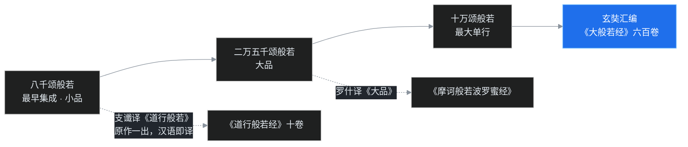

> 这是「中国佛教史」第三篇。中01 断完「佛教何时入华」，结论是「两汉之际渐次传入」，但那个阶段的中国人「旺而不懂」——烧香拜神很热闹，佛法到底说了什么没人体系统讲。这一篇的两位主角，就是最早把答案写进汉语的人：一位来自安息，一位来自月氏，一个带来「禅数」，一个带来「般若」。叶扬会看到，佛教中国化的全部基本张力——小乘与大乘、术语与思想、翻译与曲解——在这两人的译场里就已经全部登场。

## 先给小白交个底

- 中国历史上那么多译经僧，为什么教材里一定先讲这两位？凭什么说「译经史」从这两位开始？
- 安世高是哪国人？「安」这个姓跟国家有什么关系？「禅数」又是什么？是坐禅数数吗？
- 「般若」这两个字为什么念 bōrě，不念 bānruò？支娄迦谶译的《道行般若经》跟后来玄奘译的《大般若经》是同一部吗？
- 《首楞严三昧经》和大家熟悉的《楞严经》是一回事吗？
- 为什么有些概念（比如「本无」）在印度本义和中国人的理解之间，会神奇地走样？走样算不算译错？

这些问题就是本篇的路线图。

## 一、为什么「译经」二字如此重要

中01 讲过，佛法在「两汉之际」已经入华，伊存授经还有一条公元前 2 年的孤证。但请注意那一条记载的性质——**口授**：使者念，学生听，没有文本，没有体系，那条新闻之后的整整一个半世纪里，汉语世界没有出现过一部完整、可信的佛经译本。楚王刘英拜的浮屠、汉桓帝并祀的佛陀、笮融浴佛的金像，都是「没有说明书的信仰」：香火旺盛，教义缺席。一种没有经典的宗教，在任何地方都扎不下深根，只能是异域风情和民间方术。

所以当两位外来僧人在洛阳设起译场，意义不止于翻译几本书。课程里有一句话分量很重：中国的现代化，命脉在于西学的传译；佛教能在中国扎根生长，命脉同样在于翻译——**先有汉语的经，才有中国的教**。

### 坐标：公元 148 年

记住这个年份：东汉桓帝建和二年，公元 148 年。这一年，一位安息国僧人抵达洛阳，开始译经。从这一年起，到唐贞元五年（公元 789 年），六百四十一年间，是中国译经史上最重要的时期。外国汉学家评价这场跨越六百多年的工程说：汉译佛典，是人类最伟大的文明工程之一。一个民族有能力用自己的文字去消化另一个高度文明的哲学与宗教，而不是直接采用异族的文字与语音——这件事本身，就值得后人骄傲。

而这场工程的第一位奠基者，就是安世高。

## 二、安世高：让出王位的安息太子

### 1. 身世：「安」这个姓的来历

安世高，名清，字世高，是安息国的太子。安息在今天的伊朗——伊朗高原东北部，是丝绸之路上东西往来的必经之国，贸易极盛。张骞第二次出使时，汉朝副使就曾抵达安息，所以安息自汉武帝时代起就与中国有外交往来。「安息」这个汉文国名，一般认为来自其王室的族名 Arsaces（阿尔沙克，帕提亚王朝）。

这里先立一条规矩，后文会反复用到：**早期来华的译经僧，以所来自的国名或族名为姓**。来自安息（安），所以名前冠「安」；来自月氏（支），所以冠「支」；来自康居，冠「康」；来自天竺，冠「竺」。看一个僧人姓什么，就能反推出路从哪来。安世高的「安」，就是安息太子的护照。

据记载，安世高本该继位，却把王位让给了叔父，自己出家修道。这位太子受过极好的教育，通晓多国语言、博贯经藏；到中国以后，因为贵族身份和深厚学识，在洛阳极受贵族与士大夫敬重。

### 2. 传说层：《高僧传》里的安世高

关于安世高，梁代慧皎《高僧传》还记了不少神异故事，要和史实分开看。

书中说，安世高前世也是出家僧人，有位同参学问极好、讲经精彩，唯独嗔心很重——每次托钵，居士布施的饮食不如意，就当众发火。安世高前世曾多次规劝，终归无效。那位同参死后堕为神，安世高则转世降生安息王宫、让国出家，又东来专程度化昔日道友；一路上还了两笔旧命债，最后在会稽闹市被人误杀，酬偿宿业，神色自若。

这就是著名的「安世高三度还命」「宫亭湖庙神」故事，在后世流传极广。它当然不能当信史读，但有两点史料价值：第一，它说明安世高在当时人心中威望极高，人们愿意把传奇都堆到安世高名下；第二，故事的内核——**学问再好，嗔心不除，依然堕落**——恰好是安世高所传禅法的核心关切，传奇是教义的包装。讲史的人自可欣赏传奇，用史的人须懂得剥壳。

## 三、安世高译了什么：一个词「禅数」

安世高在洛阳译出的经典，《安般守意经》《阴持入经》《人本欲生经》《八正道经》等三十余部。这些经看起来名目各异，实则可以收成两个字——**禅数**。

### 1. 「数」：不是数学，是阿毗达磨

「数」在早期译经语境里，不是代数几何的数，而是**阿毗达磨**（abhidharma，又译「阿毗昙」「毗昙」）——对佛陀教法中的名相做系统归纳、辨析的学问：把构成人和世界的基本要素拆成五蕴、十二处、十八界，一条条立定义、辨关系。六朝时期专门研究阿毗达磨的僧人叫「毗昙师」，也叫「数人」，是当时一大显学。（注意区分：「数论」是印度六派哲学之一的 Sāṅkhya，对佛教而言属外道，两回事。）

安世高所译《阴持入经》，就是一部典型的阿毗达磨入门书。经名三个字，是三个最基本概念的早期音译：

- **阴**＝后来通用的「蕴」（五阴＝五蕴：色、受、想、行、识）；
- **持**＝后来的「界」（十八持＝十八界）；
- **入**＝后来的「处」（十二入＝十二处，六根与六境）。

换句话说，这部经是把「人是什么」拆成零件来讲：五蕴、十八界、十二处——佛教最基础的名相表。玄奘后来译「五蕴」「十八界」「十二处」，用的其实正是早期译法的延续。

### 2. 文本的曲折

顺便交代一层现代研究：学者们比对后认为，《阴持入经》恐怕不是直接从梵文翻译，而是以更早的西域语言（如吐火罗语一类）为底本转译的。今天能见到的梵文写本，最早的也在公元八世纪之后，多数是十至十二世纪的抄本，时代很晚；穆斯林进入印度以后，大量古梵文写本被毁。所以拿今天的晚出梵本去苛责东汉译本「错了」，方法论上不成立——底本本身也经过了上千年的流变。

由此还立着一条现代佛教学的方法论铁律：**不能拿汉译名倒推梵文原词**（汉译经过了完全不同的语言转换，拿本汉梵词典对号入座极不可靠）；相对可行的，是从藏译本还原文梵——藏文与梵文之间据说对应较严，但这「严格」也要打引号。

### 3. 「禅」：安般守意，中国第一位禅师

「禅数」的另一半是禅。先从经名解起。《安般守意经》的「安般」，是梵语安那般那（ānāpāna）的略称：**安那是入息，般那是出息**——安般就是呼吸。所以「安般」两字管的是呼吸禅；那「守意」呢？这里就是格义佛教的名场面，必须细讲。

按印度本义，这套修法叫「安般**念**」（ānāpāna-smṛti）。「念」（smṛti）的意思是把心念绑在一个对象上、安住在那里——把念头安住在呼吸上，专注、明瞭，这就是数息观。要特别强调：**念，不是让心念不发动，而是让已经发动的心念集中到一点**。禅定（samādhi）对「定」的标准定义是「心一境性」——心持续专注于一个对象，而不是心如死灰。

但安世高的译本没有「念」字，用的是「守意」。「守意」这个概念不来自佛教，而来自中国道家——道家讲「守一」，《老子》说「致虚极，守静笃」，要把心念收回到未发动的静的状态：心意一旦外驰，就收拾回来，复归于静。用儒家《中庸》的话区分最清楚：安般念里的心念是「**已发**」，只是已发而集中于呼吸；守意追求的却是「**未发**」，让心回归未发动的静止。「安般念」和「安般守意」，一字之差，修行方向已经拐弯。

这不是文字游戏。佛教讲一切法缘起，现象界无不是「动」，印度佛法里几乎没有中国式「静」的地盘；而「动静」范畴恰是道家的核心。安世高选这个译名，是用道家的瓶，装印度的酒——降低了入门门槛，也掺进了本土味道。格义佛教的功与过，在这一个经名里全了。

### 4. 五停心观：对症给药的五种禅

把安世高的禅法放回有部体系，位置更清楚。安世高所传，属说一切有部的禅法——有部是印度最重要的部派之一，重镇在迦湿弥罗（今克什米尔）与犍陀罗（今巴基斯坦白沙瓦一带）。中国早期的译籍与禅法，深受有部影响；在禅宗兴起以前，中国最主要的禅法体系就是有部体系，后来还被整合进各宗派（例如天台禅法的底子就有大量有部成分）。

有部禅法总纲叫「五停心观」——五种「对治」性的禅修，「对治」就是对症下药：

| 病根 | 对治法门 | 修法大意 |
|---|---|---|
| 贪欲重 | 不净观 | 观身体不净、死尸白骨，破除美色贪着 |
| 嗔恚重 | 慈悲观 | 扩展慈心，对治愤怒怨恨 |
| 心散乱 | 数息观 | 计数呼吸，收摄杂念（安世高所传） |
| 愚痴重 | 因缘观 | 观缘起，对治不明因果 |
| 罪障重 | 界分别观（一说念佛观） | 分析诸法无主，或忆念佛陀功德 |

五门之中，数息观和不净观最为切要，合称「**二甘露门**」——甘露（amṛta）是不死之药，两门是进入佛法的大门。安世高译出数息观，几乎与佛教同步入华；而不净观要等到魏晋才系统传入。

由此要纠正一个流传甚广的误会：**很多人以为禅宗初祖菩提达磨来了，禅法才进中国。不对——安世高 148 年就在洛阳译禅经、领禅修，门下聚集大批贵族士大夫，安世高才是中国的第一位禅师**。当然，安世高的「禅」是有部的次第禅观，与六祖慧能后来「无相无念无住」的祖师禅是两个系统，但时间坐标必须钉死：禅法入华，比达摩来华早了将近四百年。

## 四、支娄迦谶：带来「本无」的月氏人

### 1. 身世：以「支」为姓

与安世高同时而稍晚，洛阳来了另一位大师——支娄迦谶，简称支谶。从「支」姓就知道，这是大月氏人（中01 讲过的西迁阿姆河、建立贵霜的那个民族）。支谶在东汉桓帝末年到洛阳，主要的译经活动在灵帝光和、中平年间（约 178–189 年）。

同场还有一位关键配角：天竺沙门**竺佛朔**（「竺」姓，印度人），远道携来梵文底本，与支谶合作——梵本由竺佛朔传，汉文由支谶译，洛阳居士孟福等人笔受。《般舟三昧经》的译出题记，就明记是光和二年（179 年）十月八日在洛阳菩萨寺译成。这种「外来梵僧＋胡人译师＋汉士笔受」的三人组合，是此后几百年译场的标准雏形。

### 2. 译籍：清一色大乘

支谶译出的经典十余部，最重要的有三部：

- 《**道行般若经**》（十卷）——般若类，本篇下一节专讲；
- 《**般舟三昧经**》——「般舟三昧」是梵语 pratyutpanna-samādhi 的音译，义译「佛现前三昧」，又叫「常行三昧」。修法是观念佛：把心念专注于佛陀的相好（三十二相、八十种好），在禅定中感见诸佛现前。注意：**早期的「念佛」是禅法，不是口称**——心念系于佛像相好；口念「南无阿弥陀佛」成为主流，要到唐代善导以后。般舟三昧的另一个重点是「十方现在佛」，这正是大乘十方佛信仰的经典依据；
- 《**首楞严三昧**经》——「首楞严三昧」（śūraṅgama-samādhi）是大乘的一种威猛三昧，支谶译本后世散佚，今天能读到的是鸠摩罗什的译本。**这里务必钉死：《首楞严三昧经》与唐代才出现的《大佛顶首楞严经》（通常简称《楞严经》）不是同一部经**，只是名字里都有「首楞严」三字，后人常混。

一眼看去，支谶译籍与安世高正好形成对照：**安世高译的全是声闻藏——阿毗达磨与次第禅；支谶译的全是大乘藏——般若与念佛三昧**。一个让中国人看见佛陀时代的朴实教法：四谛、八正道、人间的佛陀；一个让中国人看见大乘的信仰世界：十方诸佛、菩萨大行、空性深义。

## 五、《道行般若》：一部经埋下的两条线

### 1. 般若经是什么：最早的大乘经典

《道行般若经》就是般若经的汉译本。般若类经典是印度**最早出现的大乘经典**，年代约在公元前后，发源地一般认为在南印度。而且它不是一部写完的书，是一大类，生成方式是「由简而繁」：最短的《八千颂般若》先集成，之后扩展出《二万五千颂般若》（「大品」），再扩展到《十万颂般若》；到玄奘时，把所有般若类经典汇编为《大般若经》六百卷——汉译佛典中最大的一部。玄奘《大般若经》各会与各类般若的对应，就是这场数百年层累生长的总账单。

支谶译的《道行般若经》，对应的正是**八千颂般若**——因为只有十卷，汉地通称「小品般若」（后来罗什的同本异译就定名《小品般若波罗蜜经》）。支谶来华的年代，距八千颂般若在印度集成的时代非常近，几乎是原作一出、汉语即译——这是中印思想交流史上罕见的同步反应。「般若」两字读 bōrě，是 prajñā 的音译，意为通达无自性的智慧；「道行」则是「波罗蜜多」（pāramitā，到彼岸）的早期译法，所以经名全称等于「般若波罗蜜多经」。

### 2. 「本无」：一个译名的双重命运

在翻译中，支谶大量使用一个中国词来表达「空」——**本无**。先把「空」讲准确：般若经说一切法空，意思是一切由因缘生起的事物都**无自性**。「自性」（svabhāva）从构词讲是「自有、自成」——自己获得自己的存在、自己成就自己；缘起法则告诉我们，没有任何东西能独立、恒常地自己成立，万物依因待缘而生、必依因待缘而灭。无自性，所以说「空」——**空不是一无所有，缘起的万象宛然存在，只是其中没有独立恒常的实体**。

再深辨一层：「空」作为否定，是哪一种否定？佛教因明把否定分两类：

- **无遮**：纯粹的否定，不反过头来肯定任何东西——如同说「这里没有茶杯」，只是否定茶杯存在；
- **非遮**：否定之中暗含肯定——如同说「上帝非有非无」，通过否定「有」和「无」，间接肯定了一个超越有无的上帝存在。

般若的空是**无遮**：只是否定自性，并不在现象背后另立一个叫「空」的实体。这一点最容易被误读——汉传佛教的一个恒久趋势，就是把「空」实体化，想象成万法背后一个非有非无的玄妙本体；那就是把无遮偷换成非遮，理解已经走样。

现在看「本无」。这个词在汉语里天然有两个解释方向：

第一种，「**本来是无**」——一切法本来无自性、本来是空。这是否定性的表述，合般若原义。

第二种，「**以无为本**」——在现象万有背后，有一个「无」作为万物的本源与根据。这就不是印度原义了，而是魏晋玄学的命题：正始年间，何晏、王弼一系讲「本末」「有无」，以为道是无、万物是有，有以无为本；「无」没有任何具体规定性——非长非短、非方非圆——所以能成为一切长短方圆的总根据。

问题是，在玄学笼罩的魏晋，读书人读到「本无」两个字，几乎不可能读成「本来是无」，必然读成「以无为本」——一个纯粹否定性的概念，就这样变成了万物背后肯定性的本体。这一误读影响极深：东晋般若学「六家七宗」里势力最大的「本无宗」，其远源就在这里；直到僧肇、罗什的时代才被从义理上纠正（中06 专讲）。

**一个译名，开出了两条线：原义的「空」被保存着，玄学化的「本无」也在生长**——翻译从来不是中性的搬运，是两种文明在词语里的化合。这就是「格义」最深远的标本，比五戒配五常那些表层比附深刻得多。

## 六、草创期的群像与一个长远后果

译经当然不止这两位。东汉在西域经营有成——名将班超长期驻扎疏勒，西域各国与汉廷保持良好关系——于是梵僧、商客沿丝路源源而来，草创期的译场群星错落：

- **安玄**：安息国商人，灵帝时来洛阳经商，因功受封「骑都尉」，世称「都尉」。安玄秉持法义，与出家汉僧**严佛调**合作，译出《法镜经》；
- **严佛调**：文献所见最早的出家汉僧之一，临淮人，曾师事安世高、协助译经，自撰《十慧章句》——这是汉人研习禅数的最早著作。这里要并陈两种口径：僧传称汉僧始于严佛调；而通常说「汉地第一位依羯磨如法受具足戒的僧人」是曹魏的朱士行（中03 主角之一）——两者标准不同：一个是「最早见载的出家汉人」，一个是「最早如法受戒的汉僧」；
- **康孟详**：康居沙门，与竺大力合作译出《修行本起经》，讲佛陀生平本生；
- **支曜**：月氏沙门，译有《成具光明定意经》。

这场草创还埋下一个长远的历史后果，前面行文已几次触及：**中国从来没有单独发展声闻佛教的阶段**——印度是先有声闻、部派，几百年后大乘才兴起；而汉地译经正赶上印度初期大乘最盛的年代，大小乘经典几乎同时被译成汉语，齐头并进。

两个系统的差异实在太大：文体上，声闻经朴实、近人间，大乘经壮丽、多神话；内容上，一重个人解脱，一重菩萨大行；连禅法都不同。同时研读两套经的中国古人自然大惑：**都是佛说，为什么差别至此？** 于是有了中国式的解释——佛陀说法四十九年，必然是在不同时期、针对不同根器的人说不同的法。把这些教法分阶段、判浅深，就是「**判教**」（教判）。

判教是中国僧团极出色的体系建构，此后每个大宗派都有自己的一套判教、各有尊崇的最圆满经典。但从历史角度看，它其实「不合历史」：印度的大小乘是时间上先后兴起，中国的判教把先后说成同一佛陀的密意安排——这又是一次「以中国框架消化印度历史」，和「本无」的玄学化异曲同工。**译经第一天起，中国化就开始了**。

## 程序员类比

两位先驱的故事，程序员听着会觉得异常熟悉。

设想「佛法」是一套在「印度总部」开发了数百年的庞大技术体系，现在要向「大汉研发中心」开源。最早伊存来做过一场口头分享——没有代码、没有文档，会后只留下一句会议纪要（孤证），中心的人听了个寂寞，只有几位亲王把「印度框架」当玄学概念挂嘴边。安世高和支谶干的事，是**第一次把源码和官方文档完整拷进汉语仓库**，而且两人搬的是不同分支：安世高搬的是 `releases/声闻藏` ——配套的是《API 手册》（阿毗达磨：把系统拆成五蕴十二处十八界，个个定义清楚）和《性能调优指南》（禅法：数息观是 CPU 降频工具，五停心观是五种对症的监控告警治理方案——贪多→不净观、散乱→数息观，什么故障用什么 runbook）。

支谶搬的则是当时印度总部刚发布的 `releases/大乘` 主干新分支——《道行般若》就是新分支的核心 RFC，而且这份 RFC 在总部还在持续迭代：8000 行版本（小品）→25000 行（大品）→100000 行，最后被玄奘打包成 600 卷的 monorepo。支谶几乎是 RFC 一发布就做了镜像同步，延迟极低。

这个类比要戳破的洞有两个。**第一，文档本地化从来不是无损的**：安世高把「安般念」译成「安般守意」，等于把官方术语 `focus`（已发心念的专注）误植成了道家库的 `await sleep(∞)`（追求心念未发的静止）——变量名看着像，语义完全不同，后来所有调用这个 API 的人都被带偏。**第二，术语翻译会反过来劫持理解**：支谶用「本无」译「空」，本意是「本来无自性」（一个纯否定的断言，无遮：`assert obj.get('svabhāva') is None`），可中文读者带着玄学的先验知识，直接把「本无」解析成了「以无为本」（`BaseClass = Nothing`：在对象背后立了个万物本源）——同一个字符串，被不同的运行时（文化语境）解释出两套语义，而且错的那套还更符合本地直觉，于是一路疯长，几百年后才被罗什、僧肇提交修复补丁。

译经史给工程界的教训是：**跨语言迁移系统时，术语表本身就是架构，一词之失会变成下游几百个模块的集体误读**——所以安世高、支谶值得被记住，不是因为这两人「译得完美」，而是因为这两人提交了第一版；第一版必然带着 compromises，但没有第一版，后面的一切 commit 都无从附着。

## 吵架现场

**第一场：「小乘」是不是贬称？** 安世高传来的教法，旧称「小乘佛教」，「小乘」（Hīnayāna）本就是大乘兴起后对部派的称呼，带贬义。课程明确表态：不赞成这样用——南传各国的佛教徒听了很不高兴。有礼貌的说法是「南传佛教」或「声闻佛教」：南传所承的是公元前后的上座部正统，地理上经斯里兰卡播至缅甸、泰国、柬埔寨，并非「低级版」。发心大小、法门广狭，不能和教派高低画等号。

**第二场：「本无」算不算支谶译错？** 一面之见认为：一词之译造成数百年玄学化误读，当然是败笔。另一面的看法更持平：在公元二世纪的汉语里，根本不存在能精确承载「无自性」的现成词，任何译法都只能近似；「本无」在文本层面忠实保留了「否定」的内核，走样主要发生在**接受端**——是魏晋的玄学土壤把词义拐走的，不能苛责译者。比较成熟的结论：翻译的责任是保留可被重新读对的可能，而非替所有未来读者预设理解；支谶做到了前半句，所以后来罗什、玄奘能在同一个汉语仓库里继续修订。

**第三场：《高僧传》那些神异故事要不要讲？** 史学训练倾向于全部存疑；而宗教史与文学史的看法是，神异叙事本身就是史料——它记录的不是物理事实，而是当时人理解高僧的方式。剥掉神迹看见人，是史家的功夫；透过神迹看见时代，是史识。

## 卡壳角

- **安世高的「安」、支谶的「支」**：国名即法名——安息→安，月氏→支，康居→康，天竺→竺。这一惯例延续到道安「以释为氏」之前（那是中04 的事）。
- **安那、般那**：入息、出息。「安般」就是一呼一吸，和「早安」的安没有关系。
- **阴·持·入**：蕴·界·处的旧译。读早期经论，看到「五阴」就是五蕴，看到「十二入」就是十二处。
- **「守意」为啥要警惕？** 这是道家「守一」的味道——指向心念未发的静；而禅定本义是已发之心一境专注。读早期禅籍先辨已发、未发。
- **般舟三昧**：佛现前三昧，早期的念佛是**心念佛像**的禅法，不是嘴上念佛。口称念佛的盛世在唐代善导以后。
- **两个「楞严」别混**：支谶/罗什的《首楞严三昧经》是大乘三昧经；《大佛顶首楞严经》是唐代的另一部，名气更大，但晚出几百年。
- **「般若」读 bōrě**：prajñā 的音译；「波罗蜜多」意为到彼岸。「道行」＝波罗蜜多的古译，故《道行般若经》＝《般若波罗蜜多经》。
- **无遮与非遮**：纯否定 vs 否定中带肯定。空是无遮——别把空读成现象背后的神秘本体。

## 术语表

| 术语 | 白话解释 |
|---|---|
| 安世高 | 安息国（伊朗帕提亚）太子，名清，让国出家；148 年抵洛阳，汉译佛典之始，传「禅数」之学，亦被尊为中国第一位禅师 |
| 禅数 | 「禅」＝有部禅法（数息观等）；「数」＝阿毗达磨（名相辨析）。安世高译籍总括 |
| 阿毗达磨（毗昙） | abhidharma，对佛法名相系统归纳辨析之学；六朝研究者称毗昙师（数人） |
| 《阴持入经》 | 安世高译；阴＝蕴、持＝界、入＝处，讲五蕴十八界十二处的阿毗达磨入门；底本可能出自西域语言 |
| 安般守意 / 安般念 | ānāpāna：安那入息、般那出息；「念」＝心念专注呼吸（数息观）；「守意」是道家化译法，指向心念未发之静 |
| 五停心观 | 有部五种对治禅：不净观（贪）、慈悲观（嗔）、数息观（散乱）、因缘观（痴）、界分别观（障） |
| 二甘露门 | 数息观与不净观的合称，最重要的两种入门禅观 |
| 支娄迦谶（支谶） | 大月氏僧人，桓灵之世在洛阳，首译大乘般若系经典 |
| 《道行般若经》 | 支谶译，十卷，对应八千颂般若（小品）；般若经是最早的大乘经典 |
| 般若经谱系 | 由简而繁：八千颂（小品）→二万五千颂（大品）→十万颂；玄奘汇编《大般若经》六百卷 |
| 《般舟三昧经》 | 支谶译，179 年；佛现前三昧，早期「念佛」是心念佛像的禅法 |
| 《首楞严三昧经》 | 支谶译后佚、罗什有译本；与唐代《大佛顶首楞严经》不是同一部 |
| 本无 | 支谶用以译「空」；原义「本来无自性」，被魏晋玄学读成「以无为本」，为六家七宗本无宗远源 |
| 无自性 / 无遮 | 缘起法无独立恒常的自性（svabhāva）；空是纯粹否定（无遮），不另立本体 |
| 判教（教判） | 把佛陀教法分判阶段浅深的体系；因大小乘同时入华的困惑而产生，各宗皆有 |
| 安玄 / 严佛调 | 安息商人骑都尉；文献所见最早出家汉僧之一，两人合译《法镜经》，佛调另撰《十慧章句》 |

## 收尾

佛法有了汉语的「经」，也有了最早一批讲经、修禅的人——但译场还只在洛阳、长安一线，译文草创、义理未明，「本无」两个字正等着被玄学时代热烈地误读。历史接下来要回答三个新问题：**当乱世开启、名士谈玄，佛教怎么和中国最时髦的哲学短兵相接？当西域路阻，谁会第一次逆流西渡去求取更完整的梵本？当戒律不全，汉地僧人怎样才算真正如法的出家人？**

这些问题的答卷人排成一队：朱士行、支谦、康僧会、竺法护，以及清谈席上的六家七宗。下一篇「中03」——玄佛初逢。
