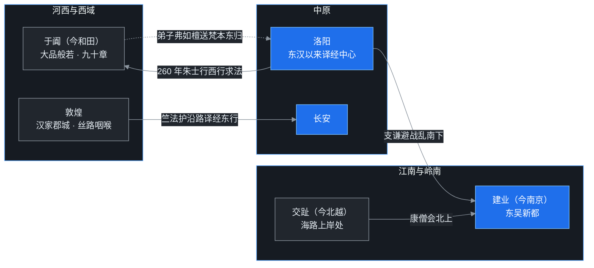

> 三国到西晋这一百年（220–316），佛教在汉地完成了一次身份转换：从被皇室当作方术供养的外来教门，变成能与中国第一流头脑同桌清谈的思想系统。朱士行第一个西行求来大品原典，支谦、康僧会把洛阳的两支佛法搬到江南，竺法护在敦煌到长安的路上独自译了四十年经——把这一切串起来的思想史现场，叫**玄学**。

## 先给小白交个底

时间坐标先钉好：东汉 220 年亡国，魏蜀吴三分天下；263 年蜀汉先亡，265 年司马氏篡魏建西晋，280 年灭吴，天下重归一统；可惜统一只维持了三十多年，316 年西晋灭亡，晋室南渡，是为东晋。

这一百年里，记住三件事就够：

1. **汉地终于有了如法受戒的僧团。**此前虽有严佛调这样见载出家的汉人，传戒之法却未完备，算不得真正的比丘；汉人信佛，多数也只能在家修行。曹魏时戒律传来，朱士行成为第一位依羯磨正式受戒的汉僧——并且朱士行很快又干了一件更大的事：西行求法。
2. **佛教地图从洛阳一城，变成三个中心。**洛阳仍是北方旧都；东吴的建业（今南京）接过了南下的法流；西边的敦煌与河西走廊，因为竺法护而成为译经重镇。
3. **佛经开始进入中国哲学的主战场。**汉末儒家经学走投无路，玄学清谈代之而兴；高僧与名士谈的是同样的问题——有无、本末、形神、性命。支谶当年用来译「空」的「本无」二字，在玄学语境里被读成了「以无为本」。这次相遇，是佛教中国化的真正开端。

先放一张这一时期的传播地图，后文的人物都在这张图上：

## 一、开场先谈玄学：儒生的道路为什么走不下去了

谈三国佛教，必须先谈玄学，因为这一百年的佛教，就是在玄学的空气里呼吸的。

### 从焚书到经学：一条两百年的下坡路

故事要从秦始皇焚书说起。前 213 年，秦下令烧毁民间私藏的诸子典籍，只留医药、占卜、种树之类实用书；私人讲学也被取消。更致命的一击来自项羽：前 206 年项羽攻入关中，火烧咸阳宫室，连朝廷的官方藏书也一并烧光，天下这才真的没书了。

汉惠帝时才废除秦代的「挟书律」（藏书有罪的法令），汉文帝下诏求天下献书。此时问题来了：古书是木简编成，绳子一断，哪一简接哪一简已无人知道；简册腐坏的也不少。朝廷只好让年轻人去找还活着的秦代博士，由老人口诵、青年记录——最有名的例子就是晁错跟随伏生学习《尚书》。老人年迈齿落，发音含混，记忆力也在衰退，这样复原出来的经典，字句之间便有许多错漏。

于是两汉儒生投入了数百年的伟大工程：整理古籍。这也铸成了汉代学术的气质——**重训诂考据，轻义理发挥**。一个词的来历、一个字的读音，可以注上几万言；但经书到底在讲什么道理，反而少有人问。

汉武帝「罢黜百家，独尊儒术」之后，儒家失去了思想对手，慢慢僵化。为了标新立异，儒生大量吸收阴阳五行、谶纬灾异之说，两汉之际纬书泛滥，儒学越来越像一套政治预言术。等到汉末朝政黑暗，这套学问已经撑不住读书人的精神世界了。

### 名教的破产

儒家在汉代又叫「名教」——以名分、礼教来安排社会、约束人心：君君臣臣，父父子子，各安其名。

讽刺的是，汉末当权者恰恰最不讲名分。弑君的事明着发生；曹操一代雄主，用人唯才，公开破坏名教规矩。礼教从安顿天下的理想，堕落成当权者控制下属百姓的工具。许多知识分子不愿再陪这台戏演下去，转身从《老子》《庄子》里寻求慰藉——**玄学由此兴起**。

玄学谈的是形而上的问题：体与用、形与神、性与命、有与无、本与末。这些话题不涉实务，所以这类谈话被称为「清谈」；清谈依据的三部经典——《老子》《庄子》《周易》——后来被颜之推总称为「三玄」。

玄学的第一批主角，是曹魏正始年间（240–249）的何晏与王弼。何晏是曹操养子，贵族清谈的领袖；王弼是天才型思想家，二十多岁便去世，却留下了影响千年的《老子注》《周易注》。比何、王稍晚的是「竹林七贤」：嵇康、阮籍、山涛、向秀、刘伶、阮咸、王戎。如果说何、王还停留在书斋清谈，竹林诸贤则用整个人生表达对虚伪礼教的反抗：嵇康土木形骸，常与向秀在柳树下打铁；阮籍驾车随意而行，走到路尽头便放声大哭；刘伶醉酒后裸坐屋中，笑骂来客「我以天地为栋宇，屋室为裈衣，诸君怎么钻进我裤子里来了」。放浪的背后，是很深的时代苦闷。

### 玄学为什么会与佛教互相需要

竹林诸贤及后来的清谈场上，名士与禅经、般若经的接触是看得很清楚的；何晏、王弼的时代，这种接触还只能算潜流（主流学界多认为玄学从经学内部独立长出，佛教影响是稍后才接上的）。反过来看则毫无疑义：知识型的僧人没有一个不擅长玄学清谈。

般若经讲的是：破除一切执着与愚痴，呈现精神的绝对自由。这与清谈家藐视礼教、追求个人解放的气质，天然相通。而僧人手里还有一层更深的凭借——佛经。所以清谈场上，僧人常常引经据典，辩到高处总能再翻出一层新意，引得名士们对佛典生出兴趣。

佛教就这样搭上了玄学的便车，慢慢内化为中国哲学的一部分；经过魏晋的酝酿，到隋唐时代，它终于取代传统经学，成为中国哲学的主流。

## 二、曹魏·洛阳：戒律、第一位汉僧，与第一场西行

曹魏与西域关系良好，洛阳城里依旧往来着各国沙门：昙柯迦罗、康僧铠、昙谛、安法贤、白延等人，先后从西域到来。这批僧人所译多是大乘经，而真正改写历史的，是另外一件东西——**戒本**。

### 昙柯迦罗与戒本：出家终于有了规矩

250 年前后（曹魏嘉平年间），中天竺僧人昙柯迦罗来到洛阳，译出《僧祇戒本》。戒本就是出家受戒时所用的一条条戒条，篇幅很小；昙柯迦罗又请来梵僧，建立「羯磨法」——僧团开会决议、当众授戒的整套仪式。

这件事为什么要紧？因为在此之前，汉人「出家」只是剃掉头发、披起袈裟，并没有如法的传戒仪式；没有受戒，就不算真正意义上的比丘。戒本一到，汉地才有了如法的僧团。相传第一位登坛受戒的汉僧，就是朱士行。

### 朱士行讲经：一份读不通的「旧文档」

朱士行是颍川人（今河南许昌），出家后在洛阳讲解支谶所译的《道行般若经》。讲着讲着，朱士行读出了一肚子困惑：经文是译经草创期的产物，译人对中国文化隔膜，中文也生硬，许多词汇让人望文生义；更关键的是，经文常有首尾不连、意理不通之处——是译者删节了原典，还是手中这本本来就是个简略抄本？当时人多疑心：《道行》十卷，恐怕只是个「小品」节选，西域应当有更完备的大本子。

传闻大品般若在西域于阗国（今新疆和田）——那是当时的大乘佛教重镇。260 年（曹魏甘露五年），朱士行下定决心，西出求经。

### 万里西行：于阗得经，殁于异乡

朱士行从洛阳出发，经关中，走河西，出阳关，沿沙漠边缘西行，终于抵达于阗。在那里，朱士行果然找到了大品般若的梵本：**九十章，二万五千颂**，后人为区别于《道行》小品，称之为「大品」。

《高僧传》还记着一层神异情节：当时于阗虽多大乘僧，小乘学僧也不少。小乘僧人向国王进言，说汉地沙门要拿「婆罗门书」惑乱正典，要求阻止经本东传。朱士行申辩无果，便于殿前将梵本投入火中以证真伪——火却应声而灭，经本一字不损。国王这才允准送经。这类灵验故事当然不能当史实看，但它如实透露了当年大乘、小乘在西域的争夺有多激烈。

经本如何送回去？朱士行自己已经回不去了——年迈力衰，朱士行令弟子**弗如檀**等人护送梵本东归洛阳，自己留在了于阗，八十岁时在那里入灭。

朱士行是**汉地第一位西行求法的僧人**。后来梁启超先生把这场绵延数百年的西行求法运动称作「留学生运动」，并说其壮烈惨烈，恐怕胜过近代——当年没有任何交通保障，每一步都是赌命。

### 《放光般若经》：罗什之前的「第一流通本」

梵本送到洛阳时，已是西晋。291 年（元康元年），于阗沙门**无罗叉**手执梵本，华籍居士**竺叔兰**口传笔受，二人在陈留仓垣合作译出，定名《放光般若经》，九十章；历代经录卷数分二十卷、三十卷两说。

《放光》一出，立刻风行：译笔流畅明白，讲经的人再不必因经文梗阻而当众卡壳。在鸠摩罗什来华之前，这是中国最流通的佛典；即便罗什后来重译了大品、小品，直到东晋，士人心头最爱的仍是《放光》——道安晚年，几乎每年都要讲一遍。

## 三、东吴·建业：两支佛法过长江

东吴的佛教，是被中原战乱「逼」过江的：北人南下，洛阳的佛法随之南传。蜀汉佛教无史料可考，南中国的故事，全在建业。

### 支谦：把译笔磨「雅」的月氏后裔

支谦是大月氏后裔，祖父在汉灵帝时率数百族人归化汉朝。支谦出生在洛阳，是长于汉地的混血胡人，却不是出家人，而是居士。支谦先通汉文，再研胡语，据说备通六国语言；师承上更有来头：支谶传支亮，支亮传支谦，时人号称「天下博知，不出三支」。

汉末大乱，支谦与乡人南奔东吴。路上有个细节可见其为人：逃难时同伴中有人没有被子，支谦与之共盖，夜里被子被对方卷走，支谦也不声张。旁人要追回，支谦却说：不能为一条被子，害一个人被你们打死。

到建业后，孙权敬其才学，拜为博士，请支谦辅导太子孙登。支谦在建业译经三十余部，重要的有：

- **《大明度无极经》**——小品般若（八千颂）的异译，与《道行般若》同本；
- **《维摩诘经》**——居士佛教的核心经典第一次有了汉译；
- 《大般泥洹经》《太子瑞应本起经》、旧题支谦译《佛说阿弥陀经》等。

支谦还有一项大贡献：因为月氏同乡之间多藏有胡语经本，支谦便广收各种胡本对校之后再译——这是只有通胡汉双语的人才能做的校勘工作。在译风上，支谦一改前人尚质直译、词语古拙的路数，主张辞旨文雅，「曲得圣义」。汉译佛经从「硬译」走向「意译」，这是转折点。支谦还依经典创制「梵呗」三契（歌咏赞颂的曲调），后世相传为梵呗之始（另有曹植鱼山制梵呗的竞争传说）。

太子孙登早逝后，支谦心灰意冷，隐居穹窿山（今苏州），不交世务，六十岁时卒于山中。

### 康僧会：海上传来的僧人，江南第一座佛寺

康僧会的背景又是另一条路线。其先是康居人（故地在今哈萨克斯坦、吉尔吉斯斯坦一带），家族世代寄居天竺，父亲经商，从海路来到交趾（今越南北部，当时属汉地）。康僧会生于交趾，十余岁时父母双亡，服丧期满便出了家，随后取道北上。

所学何法？安世高一系的禅法。安世高当年曾到南方游化，将禅法传给南阳韩林、颍川皮业、会稽陈慧等人（多为居士），康僧会便是向这几位问学。至此可以看清一个有意思的格局：**当年洛阳的两支佛法，都传到了建业**——支谦接续支谶一系的大乘般若，康僧会接续安世高一系的声闻禅法。

247 年（东吴赤乌十年），康僧会抵达建业。康僧会搭起茅棚，设像行道——江南百姓从没见过出家僧人，满城惊动，官府也警觉起来，最终惊动了孙权。康僧会向孙权讲说佛法因果，《高僧传》记康僧会以二十一日为期求得舍利，光曜不可摧毁，孙权大为叹服，为康僧会建寺，定名**建初寺**——这是江南第一座佛寺，江南佛教由此开场。

后来孙皓即位，一度想要毁废佛寺，康僧会入朝辩对，广说善恶报应与心神不灭之理，才把这场风波按下去。这是东晋慧远「神不灭」大论辩的先声，此处先按下不表。

康僧会的代表性译籍是**《六度集经》**——按大乘六度（布施、持戒、忍辱、精进、禅定、智慧）编排的佛本生故事集；康僧会又为《安般守意经》《法镜经》作注。康僧会的译笔有个鲜明特点：大量融入儒家的仁道孝亲思想，把「儒典之格言」当作「佛教之明训」。佛教入华后主动向儒家伦理靠拢，在康僧会这里已经看得很清楚。

顺便说一句名义：印度僧人居住之处，本叫「精舍」（vihāra）或「僧伽蓝」（saṅghārāma，僧团的园林）；「寺」是纯粹的汉语，本指政府官署。外来的商人、僧人初到时被安置在这类官办馆舍中，里面渐有法会、渐成梵刹，「佛寺」之名才专门立了起来。

## 四、西晋：竺叔兰与竺法护

西晋的佛教中心仍是洛阳，最重要的两位译经人物，一位是居士竺叔兰，一位是比丘竺法护。

### 竺叔兰：生长在汉地的译笔

竺叔兰祖籍天竺，祖父在故国动乱中被杀，父亲带着族人避难来华。竺叔兰生长于汉地，精通胡汉双语，散文也写得好——前文《放光般若经》那支漂亮的译笔，就是竺叔兰与无罗叉合作的成果。竺叔兰还译过《异维摩诘经》《首楞严经》等。

这里顺带解释一个佛经常见现象：**同本异译**。同一部梵典（或同一系统的经本），不同时代、不同译者反复译出，有的依据不同传本，有的依据同一传本，彼此字句出入很大。这些译本今天哪些还在，查一查《大正藏》目录便知——这部日本大正年间编修的大藏经，校勘精良、目录清楚，至今仍是学界最常用的版本。

### 竺法护：敦煌到长安，一个人的四十年译经工程

真正撑起西晋译经场面的，是竺法护。

竺法护，梵名 Dharmarakṣa（当时音译「昙摩罗刹」），月氏人，家族世代居住敦煌。竺法护八岁出家，跟随从天竺来的高僧竺高座学习，天性聪敏，日诵万言，过目能解；为人纯良刻苦，律己极严。

竺法护所处的位置，给了竺法护一种别人没有的双重眼光：敦煌是丝路咽喉，向西可知西域流通什么经典，向东深知汉地经本不全的窘境。竺法护痛感当时汉地寺庙图像虽已兴盛，而大乘方等深经还大量滞留西域，于是立誓西行。师父为其志业所感，亲自陪竺法护西游；竺法护一路求学，通晓西域三十六国的语言文字，携大批梵本东归。

回程本身就是一场流动译经：从敦煌到长安，走到哪里，译到哪里。从 266 年（泰始二年）起，译经事业持续约四十年。《出三藏记集》著录竺法护的译籍为**一百五十四部、三百零九卷**，大乘的各大部类——般若、法华、华严、涅槃、大集——竺法护几乎都有涉及，覆盖面与数量都远远超过前人。代表性译籍包括：

- **《光赞般若经》**——大品般若，与后来的《放光》同本异译；
- **《正法华经》**——《法华经》的第一个汉译本；
- 《维摩诘经》《渐备一切智德经》（《华严·十地品》异译）、《修行道地经》《生经》《普曜经》等。

竺法护的译场还有一项制度史意义：翻译已是分工协作——聂承远、聂道真父子精通梵汉，承担笔受与参正文义，另有弟子数人分司传语、劝助、校对。后世鸠摩罗什、玄奘那种庞大译场的分工体制，在竺法护这里已见雏形。因为终身在敦煌、河西译经不辍，时人敬称竺法护为**「敦煌菩萨」**。

### 《光赞》的传播悲剧：早了五年，沉默了九十年

《光赞般若经》译出于 286 年（太康七年），比《放光》还早五年——但它的命运令人惋惜：译本只在凉州、河西一带流通，始终没有传入中原。等到约九十年后道安在襄阳读到它时，只剩残本，道安将它与《放光》对校，作《合放光光赞略解》。一部译得更早、同样可靠的经典，仅仅因为传播网络的阻隔，几乎被历史遗忘。

法护所译诸经在河西长期流通，后来鸠摩罗什羁留河西多年，这些译本给了罗什极大的帮助。西晋末年，竺法护以七十八岁高龄辞世。竺法护是鸠摩罗什之前最伟大的译经高僧，没有之一。

到这里，般若经的早期汉译已经集齐了四个重要译本，一图收束：

## 程序员类比

这一篇的故事，用工程圈的语言几乎可以逐句对译。

**朱士行面对的《道行般若》，就像一份自动生成、错漏百出、还疑似被截断的 API 文档。**普通开发者的做法是连蒙带猜、凑合用；朱士行的做法是买张单程票，飞去总部把原始 specification 抄回来。区别在于，朱士行这趟「出差」走了一万多里，最后把命留在了异乡。

**同本异译，就是同一份 spec 的多个独立翻译 fork。**道行、大明度、放光、光赞，四个译本对读，就是一场大型 cross-fork diff；道安后来干的「合本子注」，正是手工做的文本 diff 工具——选一个好译本作母本，另一个以小字逐句挂在后面做对照注释。

**竺法护则像一个人维护一个巨型移植项目：连续四十年，把上游几百个模块逐个 port 到中文平台。**聂承远、聂道真父子，就是竺法护最核心的 reviewer 与 committer，没有这对父子，这个项目的质量要打上对折。

而最有意思的，是**玄学给佛教做的「适配层」**。外来概念直接接入汉地思想跑不通，于是高僧与名士一起写了个 adapter：把「空」适配成「无」，把般若智适配成老庄的「道」，把禅定的心一境性适配成道家的「守一」。适配层的功劳怎么夸都不过分——没有它，佛教根本进不了中国士大夫的精神世界。

但适配层的洞，也必须戳破：**适配层会把宿主系统的特性，悄悄写进被移植的语义里。**「本无」本来的意思接近「一切法本来无自性」，是个纯粹否定；可经玄学一适配，被读成了「以无为本」——在万有背后有个「无」作为万物的本体与根源。前者是否定一切自性实体，后者恰恰又立起了一个叫「无」的本体。后面六家七宗的大半争论，辩的其实都是这个适配层的语义偏移，而不是原典本身。这也是格义佛教一体两面的地方：它让佛教被理解，也让佛教被「中国式地」理解。

## 吵架现场

**小品是不是大品的节抄本？**这是当时最大的文献学案。从朱士行开始，多数人疑心《道行》小品是大品的删节；后来道安整理经录，也把《道行般若》判为《放光》《光赞》的「节抄本」，用大品来补小品。以现代文献学看，这个判定不成立：小品对应八千颂、大品对应二万五千颂，是两个独立集成的经本系统，虽有内容重叠，却不是谁抄谁。道安不懂胡语，凭译本对读推断，错得情有可原。

**译文该「质」还是该「文」？**汉末译经尚质，直译硬译，宁可生硬也要保全文意；支谦第一个旗帜鲜明地求雅，译文漂亮了，批评者却担心润饰过头、走失本义。这场文质之辩一路吵到鸠摩罗什——罗什译场走「质文折中」的路线，才算给出了公认的平衡。

**于阗国王殿前的大乘小乘之争。**一个大乘佛教的中心国家，朝堂上活跃着势力不小的小乘僧团，并且险些拦下改写中国思想史的那批经本。这提醒读者：西域佛国从来不是清一色，大乘的胜利是争出来的。

**康僧会与孙皓：神不灭的第一场御前辩论。**孙皓问：善恶报应既然成立，承受报应的「主体」是什么？康僧会以心神不灭作答。这个问题在一百多年后会被重新放大——慧远在庐山作《沙门不敬王者论》明「神不灭」，范缜在南朝作《神灭论》正面反驳，是中国思想史上的一场大仗。中07、中10 再细讲。

## 卡壳角

**朱士行既是受戒第一汉僧、又是西行第一汉僧，两个「第一」加身，为什么开宗立派没朱士行的份？**因为朱士行一生只做了「取经」一件事：经本译出时朱士行已去世多年，本人没有留下著述，所取也还是般若旧学；朱士行像一个用生命提交了关键 PR 的先行者，却没来得及参与后续的架构设计。

**《光赞》比《放光》早译五年，为什么反而默默无闻？**经典的命运不只取决于质量，还取决于发行渠道。河西是当时的「网络孤岛」，洛阳才是天下思想的「中心 registry」；《放光》在中原译出、立刻进入全国流通网络，《光赞》则困在凉州，九十年后只剩残本。发行即命运，古今皆然。

**竹林七贤放浪不羁，是不是跟佛教僧侣学的？**不能这么说。时间上与逻辑上都是双向的：玄学是从汉代经学自身的破产里生长出来的，何晏、王弼立论时，佛教影响还只是潜流；往后走，般若思想才与玄学互相加持、越缠越深。这是一场双向奔赴，不是单向模仿。

**既然早期汉译多据「胡本」，那「胡本」是梵文吗？**多数不是。西域译经依据的常是当地语言的中转本——犍陀罗语、吐火罗语等，与梵文同属印欧语系却并非一种语言，文字写本也有自己的演化史。所以今人拿晚出的梵文写本去逐字苛责早期汉译「译错了」，方法论上本身就有问题：译者依据的底本，今人已经看不到了。

## 术语表

| 术语 | 简要解释 |
|---|---|
| 玄学 | 魏晋时期以《老子》《庄子》《周易》为依据，讨论本末、有无、体用、名理的哲学思潮 |
| 三玄 | 《老子》《庄子》《周易》的合称，清谈的核心经典 |
| 清谈 | 名士之间辨析名理的哲学谈话，重言简意远、机锋往复 |
| 名教 | 儒家以名分礼教为核心的政教体系，汉末被当权者工具化而破产 |
| 格义 | 以中国固有的概念（尤其老庄术语）比配、解释佛理的方法，佛教中国化的最初形态 |
| 本无 | 支谶等译「空」的早期译名；在玄学中被读为「以无为本」，遂有两重含义 |
| 无遮／非遮 | 两种否定方式：无遮是纯粹否定（空＝无自性），非遮是否定之后反显一个肯定的东西 |
| 小品／大品 | 般若经的两大系统：小品对应八千颂，大品对应二万五千颂 |
| 同本异译 | 同一部（或同一系统的）梵典被不同译者多次汉译 |
| 合本子注 | 以一种译本为母本、别种译本为小字注逐句对校的文献学方法，道安集大成 |
| 戒本 | 记载出家戒条的小本经典，与「羯磨法」共同构成如法受戒的依据 |
| 羯磨（karma） | 僧团开会决议、授戒忏悔的整套仪式程序，戒律的运作方式 |
| 比丘 | 受过具足戒的男性出家人；朱士行是汉地第一位如法受戒的比丘 |
| 梵呗 | 依经法创作的佛教歌咏赞颂，相传支谦制三契 |
| 精舍／僧伽蓝 | 印度对僧众居住处的称呼；「寺」是入华之后才有的汉语名称 |
| 安般 | ānāpāna 的略称，数息观；安世高所传禅法的核心 |
| 敦煌菩萨 | 时人对竺法护的敬称，因其世居敦煌、终身译经不辍 |

## 收尾

三国西晋这一百年，佛教完成了三件硬件、一件软件：戒律落地，汉僧登场；法流过江，三中心鼎足；西经东译，大部头经典齐备——而那「一件软件」，是它借玄学完成了思想语法的切换：从此中国人讨论「空」，可以借「无」说话；讨论解脱，可以借「逍遥」会意。

但硬件有短板，软件有 bug：戒律传得不全，禅法未成体系；适配层的语义偏移，会在东晋引出六家七宗的百年争讼。下一时期登场的两位人物，专门解决「制度」问题——佛图澄以神通取得王者的信任，道安以学养为僧团立法：统一姓氏、厘定经录、规范僧制。乱世之中，佛教的「组织架构」时代开始了。
