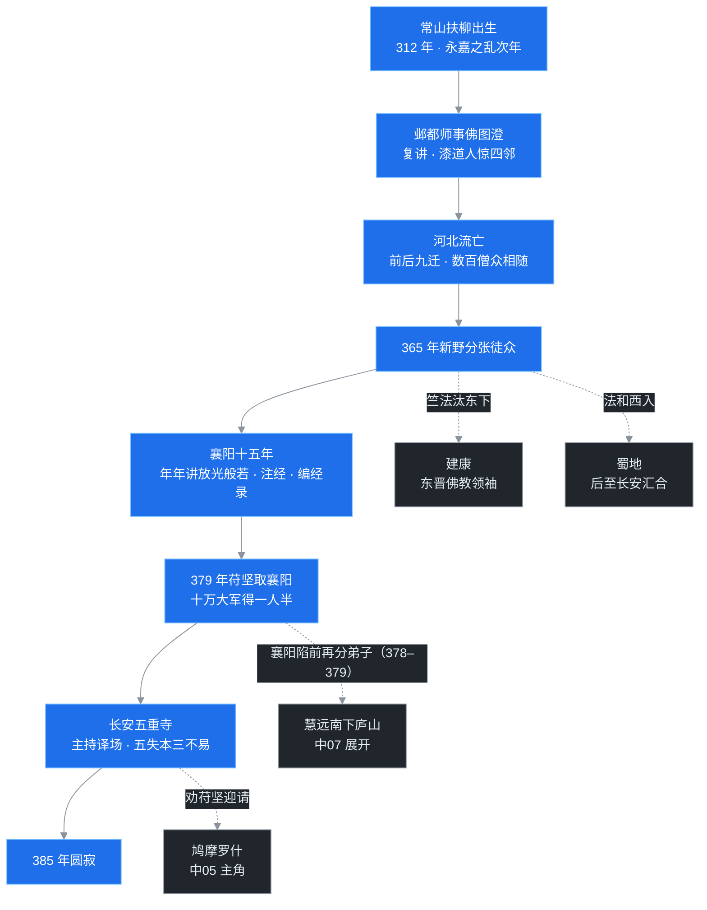

> 四世纪的中原，皇帝比县令换得还勤，人命比草贱。佛教在这片焦土上遇见了两代关键人物：佛图澄以神通敲开宫廷的门，道安在门内搭起整套制度的骨架——经录、译规、僧制、姓氏，今天汉传佛教的僧人还受用着一千六百年前的这批奠基工程。

## 先给小白交个底

1. **这篇写师徒两代人**。师父佛图澄来自西域，靠预言和神异感化了中国历史上出了名残暴的羯族皇帝；徒弟道安是个丑出了名的汉人和尚，赶上乱世最深处，却把佛教从"散装外来宗教"整顿成了有规矩、有目录、有统一名号的组织。

2. **佛教第一次拿到国家级支持，就发生在这一篇**。此前佛教是胡人商旅的信仰、贵族宅院里的新鲜方术，汉人出家甚至不合法；后赵的皇帝公开宣布汉人可以出家，佛寺从此前屈指可数涨到近千所。

3. **道安做的四件事，件件活到了今天**：编出中国第一部系统的佛经目录，定下佛经翻译的工程规范，制定汉地第一套僧团规章，让所有出家人统一姓"释"。读完这篇再去任何一座寺庙，看到僧人法名前的"释"字，分量会不一样。

## 一、乱世开场：西晋是怎么把自己玩没的

要理解这两代和尚为什么能有那么大的舞台，得先看看舞台烂成了什么样。

公元 280 年西晋灭吴，天下刚刚一统，按理说该是休养生息的剧本。可晋朝的开国皇帝司马炎犯了两个大错：第一是大封同姓诸侯王，给兵给地盘，等于在全国埋了一堆随时能炸的火药桶；第二是选了个脑子不太好使的继承人，就是那句名言"何不食肉糜"的晋惠帝。皇帝镇不住场，皇后、太后、诸侯王轮番抢权，291 年起十六年间，八个司马氏王爷轮番攻杀，史称**八王之乱**。中原的户口、粮仓和军队，在内战里被耗得精光。

中原一空，周边的五个少数民族便乘虚而入：匈奴、鲜卑、羯、氐、羌，史书合称**五胡**。311 年，匈奴军队攻破洛阳，俘虏晋怀帝，杀王公士民三万余人，焚宫庙、掘皇陵，这就是**永嘉之乱**；316 年长安再破，晋愍帝出降，西晋灭亡。次年司马氏在江南的建康（今南京）续上政权，史称东晋。

而北方，从此进入**五胡十六国**时代——一百多年里，先后冒出十几个政权，最长的不过几十年，最短的才几年，城头变幻大王旗。汉人的旧秩序碎了，儒家的名教在乱世里解释不了苦难，安顿不了人心。这个真空，就是佛教的舞台。

课程里还点出一个南北分野：南渡之后，江南的士大夫尚清谈、重义理，把般若学接在玄学的尾巴上讲；北方在胡人政权治下，信众更重实际的功德——造像、建寺、凿窟。这个分野会在后面好几篇里反复回响。

## 二、佛图澄：用神通跟暴君谈判的西域老人

就在永嘉之乱的次年、312 年前后，一位年近八十的西域老人出现在了羯族首领石勒的军营前。老人叫法不同，史书写作**佛图澄**（也作竺佛图澄）。

佛图澄的籍贯有两说：一说龟兹（今新疆库车），一说安息。无论哪一说，都是沿着丝路走来的。此老来华的年纪，按《高僧传》的记载推算已近八十岁，卒于 348 年，世寿一百一十七岁——数字惊人，但唐初以前的佛教传记对高僧年寿常有夸张，知道是位极长寿的老人即可。

### 从将军门客到"大和上"

佛图澄最初没有直接去见石勒，而是投在石勒麾下一位信佛的大将**郭黑略**帐下。郭黑略每次随石勒出征，战况吉凶常被这位门客提前言中，石勒又惊又疑，召见之后，佛图澄当面演示了神异之术，据说能在钵中生出青莲花。石勒由此信服，尊称为"**大和上**"（大和尚）。

石勒身后，侄子石虎篡位。石虎是十六国时期最著名的暴君之一，荒淫酷虐，杀人如麻。可偏偏对佛图澄礼敬有加，朝会之日，和尚升殿，王公以下都要起身致敬。石虎曾对人说，和尚是"国之大宝"，荣宠到这个程度。

这里要特别说清楚一件事：佛图澄不是靠神异骗吃骗喝的术士。此老在宫廷里的全部影响力，都被拿来做了一件事——**劝止杀生**。传记里说，石勒、石虎性格暴烈，动不动就要屠城灭族；每当二人动了杀心，十次里有八九次能被佛图澄劝得回心转意。石虎要杀的人，凡能让老和尚知道的，常有活路。一个近百岁的老人，周旋在两头猛兽身边三十多年，在杀戮的急流上一道一道筑闸。

### 近千所寺院，与汉地第一次出家合法化

在佛图澄之前，佛教在汉地虽传了两百多年，但寺院屈指可数，出家人多是西域来客；汉人出家，法令上不允许，用后来守旧官员王度奏议里的话说，汉魏旧制是"汉人皆不得出家"。佛图澄改变了这件事。

石虎在位时，曾有官员上奏，请求承袭汉魏旧制，禁止汉人出家。石虎下了一道很有名的诏书，大意是：朕本是边地戎人，来做中原的君主，祭祀信仰理应随俗；佛正是戎神，正是朕该敬奉的，凡乐意奉佛、想出家的，一律准许。这是中国历史上政权第一次正式承认**汉人可以合法出家**。

闸门一开，洪流奔涌。佛图澄门下的常随弟子前后将近万人，此老在各地建立的寺院，《高僧传》记为八百九十三所——近九百所。要知道，几十年前的西晋，全国佛寺还屈指可数。佛教从此前的"外来户的神龛"，一跃成了北方社会的公共信仰。

### 弟子群像：格义与泰山

佛图澄门下人才之盛，几乎是四世纪汉地佛教的半张人才地图，几个名字要记住：

- **竺法雅**，汉地佛教"格义"方法的代表人物。什么叫格义？当时佛经的概念体系对汉人完全陌生，竺法雅便拿经文中的核心概念（"事数"，比如五蕴、四谛、十二因缘），去和中国本土典籍——《老子》《庄子》、儒家经书中意思相近的说法一一配对，让读书人借熟悉的概念登上陌生的楼。这是应急的楼梯，功劳是让人快速进门；隐患是两边概念只是"看着像"，配着配着，佛经原意就被配歪了。道安早年也用格义，学问深了之后明确反对，等到鸠摩罗什的译场把准确的中观论典译出来，格义才正式退场。
- **僧朗**，后来在泰山开辟道场，人称泰山僧朗，受到南北好几个政权的共同供养。注意别和南朝南京栖霞山那位也叫僧朗的法师混为一谈，是两个时代的两个人。
- 还有法和、竺法汰——这两位马上要在道安的故事里出场。

348 年，佛图澄在邺都（今河北临漳）圆寂。此老留下的，是一个已经被宫廷承认、信众遍地、却还没来得及建立规矩的佛教。徒弟道安，接的就是这个盘。

## 三、漆道人：道安的前半生

**道安**，312 年生，恰是永嘉之乱的次年——一生下来就是乱世。

道安是常山扶柳人，今河北冀州一带。幼年父母双亡，由表兄孔氏抚养长大。此子十二岁出家（古人按虚岁算），其貌不扬，黑丑得出名，后来师兄弟给起的外号叫"**漆道人**"，时人有句话叫"漆道人，惊四邻"——先被肤色取笑，后被本事惊到。

人长得不起眼，师父便让道安去田里干了三年农活，道安毫无怨言，干活守斋，从不懈怠。几年后此子向师父求借经书，师父随手给了一卷《辨意经》，约五千言。道安带下田去，傍晚收工就把经书还回来，要求换别的。师父不悦，道安说已经背下来了。次日又给了一卷近万言的《成具光明经》，又是当晚背完。师父逐字考校，一字不差，这才大惊，知道这黑小子是块大材料，从此另眼相看。

二十岁受具足戒之后，道安前往邺都，进入佛图澄门下。老人一见面就极为器重，让道安做复讲——老师讲完，由道安向大众复述答疑。这是个极容易挨围攻的位置，当时邺都僧团里老资格的人不少，见一个黑丑的年轻汉人坐在那个位子上，纷纷设难题刁难。道安应对如流，疑难在道安手里一个个被拆开，挫伏了全场。

佛图澄圆寂后，北方局势再度崩坏，后赵很快陷入石虎养孙冉闵挑起的大乱。道安领着同门南避，此后十几年在河北、山西、河南一带反复迁徙，据传记行踪梳理，前后迁了九次。乱世里带着几百僧众逃难，要吃的、要安全、要坚持讲经不辍，这段流亡经历把道安从一个学问僧逼成了一个组织家。

这段流亡把一条血淋淋的经验刻进了道安心里：在一个王权掌握户口、粮食和生杀的时代，没有政权的起码容认，连僧团活命都做不到，更不要说弘法。十余年后南奔行至新野，道安把这段经验凝成了那句话："**不依国主，则法事难立**。"这是现实主义，也是道安和老师佛图澄一脉相承的生存智慧。

## 四、新野分张徒众与襄阳十五年

先用一张图把道安此后二十多年的足迹看全：

### 新野：把种子撒向全国

365 年，道安判断北方再难立足，决定率弟子南下投奔东晋。行至新野（今河南新野），此老做出了一个影响深远的决定：**分张徒众**，不让几百人挤在一处，而是派骨干分赴各地开辟道场。

- 派**竺法汰**率四十余人东下扬州，去都城建康（今南京）。竺法汰身高八尺，风度口才俱佳，到建康后果然成了东晋佛教的领袖人物，开讲《放光般若经》，一时朝野倾动。
- 派**法和**西入蜀地（今四川），后来又经汉中回到北方，与道安在长安重新会合。
- 道安自己则带着慧远等弟子，南下襄阳。

这不是一次普通的分流，是一个全国性弘法网络的铺设。道安看人、派地、分派路线，像一位主帅在部署兵力。

### 襄阳：十五年平静的黄金岁月

365 年到 379 年，道安在襄阳住了整整十五年——这是此老一生最安定、著述最丰的时期。

襄阳当地有位大名士**习凿齿**，以辩才和傲岸闻名。道安一到，习凿齿登门拜访，自报家门："四海习凿齿。"口气大得很。道安应声而答："弥天释道安。"一时传为名对。"弥天"二字从此成了道安的标签。

十五年里，道安每年必讲《放光般若经》，年年开讲，从不中断；同时系统做两类大事。

第一类是**注经**。此前佛经只有翻译，几乎没有像样的注解，经文又晦涩难读。道安为《放光》《光赞》《道行》等般若经逐一作注，还发明了"合本"的方法——把同经的不同译本放在一起逐句对照，互为校勘。这种比较方法的影响越出了佛门：陈寅恪先生考证，后来裴松之注《三国志》、刘孝标注《世说新语》那种"网罗众书、附注于下"的体例，都与合本方法的启发有关。

第二类是**编目**。佛经译了两百多年，译者、译时、卷数多无记录，同经异译、有目无书、张冠李戴的乱象比比皆是。道安广为搜集，甚至有人不远千里把家藏经卷送来，最终在襄阳编成《**综理众经目录**》。这是中国第一部系统的佛经目录，虽然原书后来亡佚，但主体内容被南朝僧祐的《出三藏记集》保存了下来，今人仍能窥见面貌。

## 五、一人半：长安译场的总指挥

### 十万大军取一人半

道安在襄阳的安宁，是被一封信终结的。

此时北方已被氐族苻氏的**前秦**统一，君主**苻坚**是十六国里少见的雄主，也极敬重人才。苻坚久闻道安之名，多次致书礼请，道安都推辞不赴。软的不行来硬的：379 年，苻坚派大军攻陷襄阳，把道安和习凿齿一并送到长安。据说苻坚后来对人夸口：朕以十万之师攻取襄阳，只得到一个半人——一个人是道安，半个人是习凿齿。"**一人半**"的典故，就是这么来的。

到了长安，道安被安置在五重寺，地位极尊，苻坚平日有军政大事和疑难，都请道安参决。而道安把这份尊荣全部兑换成了一项事业：**组织译场**。

### 五失本三不易：翻译工程的奠基文献

当时汉地缺的不是一两部经，是系统的基础典籍。道安在长安广泛延请西域和天竺高僧：僧伽跋澄、昙摩难提、僧伽提婆、竺佛念等人，分别带来了说一切有部的大量论典和《中阿含》《增一阿含》等根本经典。道安亲自任译场的总校勘，每出一经都详加推敲。

这里要特别称道安的格局：当时汉地知识界追捧的是般若类大乘经典，《阿含》和阿毗昙被视为鄙浅的小乘，没人愿意碰。道安不这么看——此老认为求法当求佛法的整体，没有阿含和阿毗昙做地基，大乘的楼阁是悬空的。这份眼光，要到道安身后才被证明多重要。

在组织译场的过程中，道安把翻译实践中的经验提炼成了中国翻译史上第一份系统的工程规范，就是著名的**五失本、三不易**。

补充一个用词细节：道安原文说的是"译胡为秦""胡经尚质"，当时所谓"胡经"兼指梵文与西域各语写本，并非清一色梵文。

所谓**五失本**，是五种不得不偏离原文的情况，翻译可以、也必须做相应调整：一是胡本（梵文及西域语本）语序与汉语完全相反，译过来必须颠倒语序以符合汉语；二是胡经经典崇尚质朴，而汉人好文，不加文采读者不接受；三是胡经反复咏叹、叮咛再三的段落，要删裁；四是胡经末尾总摄全文的"义说"（类似乱辞后记），要删去；五是经文说完一事、再及下事时会把前文重述一遍，这些重复也要割爱。

所谓**三不易**，是三种根本意义上的困难：一是圣人说法必因当时的风俗，而古今风俗已变，要把古雅之言改适于今世，难；二是佛的智慧与凡愚天差地别，要让千岁之上的微言妙义，契合后世末俗的理解力，难；三是当年阿难等结集经典，去佛未久，还有大迦叶召集五百圣徒逐字审查，如今去佛已千年，却要凭近人的理解去裁量，难。

五失本讲的是"可以在哪些地方动"，三不易讲的是"动的时候要知道自己在跟什么量级的困难打交道"。道安总的立场是**直译为主**——宁可文字朴拙，不可轻易走样；但在五失本的范围内，允许为汉语读者做必要的让步。这是分寸感极强的工程原则。

### 弥天释道安的最后几年

道安在长安还有两件事值得记下。

一是**力阻伐晋**。382 年前后，苻坚执意要南下灭东晋，满朝劝阻都听不进去。道安借着侍游的机会当面进谏，劝苻坚坐镇洛阳、先传檄而定，不必亲自涉险。苻坚最终没听。383 年，淝水一战，前秦大败，帝国随即土崩瓦解——道安没等到帝国的终局，385 年，此老在长安五重寺圆寂，传记载明享年七十二。

二是**兜率之愿**。据传记，道安一心系念弥勒菩萨，愿往生兜率净土，临终前还见到了异象。这位般若学大师的信仰归宿，是上生兜率、随弥勒学法——弥勒信仰在汉地的早期脉络里，道安是绕不开的名字。

另外还有一件当时未成、余响极长的事：道安在长安听说西域龟兹有一位正当盛年的高僧，才智冠世，便一再劝苻坚想办法迎请。苻坚把这件事记在了心上，382 年派大将吕光率军西伐龟兹——为的就是请那个人。那个人叫**鸠摩罗什**。下一篇的主角，登场的路已经由道安铺好。

## 六、僧尼轨范与以释为姓

译经讲经之外，道安对汉地佛教最深的塑造，是给僧团立了规矩。

### 为什么需要一套汉地自己的规矩

当时的困境是双重的。一方面，广律——完备的戒律典籍——还没有系统译出来，汉地僧团手里只有零散的戒本，几百上千人在一起共修，没有可操作的共同规则。另一方面，就算戒律译全，也不能原样照搬：佛当年留下过原则，小小戒（具体的生活细则）可以随方舍弃。道安把这条原则落到了实处，在课程里有极细的展开：

- 印度僧人的三衣——安陀会（五条衣）、郁多罗僧（七条衣）、僧伽梨（大衣）——适应的是热带气候，在黄河流域的风雪里根本御不了寒，必须允许增衣、着鞋袜，不能学印度僧人常年赤脚。
- 印度托钵乞食，靠的是信众供养。恒河流域土地肥沃、一年三熟，民间有余力供养不事生产的僧人；黄河流域战乱加粮食紧张，乞食难以为继，僧团必须发展自己的生计方式。
- 总之，戒律的根本原则——大戒——放之四海皆准；但衣食住行医药这些具体细则，必须中国化。

于是道安参照已有的零散戒律，制定了汉地第一部成文的僧团规章，史称"**僧尼轨范**""佛法宪章"，主要有三例：一是行香、定座、上经、上讲的规矩，二是每日六时行道、饮食、唱时（进食前后唱赞报时）的规矩，三是每半月**布萨**（集体诵戒、忏悔）以及差使、悔过的规矩。经此一立，天下寺院多相承袭。后世《四分律》全面流行，道安的规章文本没有单独传下来，但许多做法早已融进汉传佛教的日常里。

### 一个姓氏，沿用一千六百年

道安制度遗产里最"可见"的一项，是姓氏改革。

此前汉地僧人的姓氏五花八门：外来的随国籍，来自安息的姓安，来自月氏的姓支，来自康居的姓康；汉地出家的随师父姓。同一个僧团里，姓氏五光十色。道安提出：出家人既都是释迦牟尼的弟子，姓氏就该统一，一律以"**释**"为氏。

起初这只是道安一派的主张。巧的是，后来《增一阿含经》译出，经里恰有一句：四河入海，不再有河的名字；四姓人家出家，都称释种。经文一出，被视为悬合印证，从此"以释为姓"通行天下，直到今天汉传佛教的僧人法名仍以释为姓。一个统一的命名空间，就这么建立了。

## 七、本无宗：挂在玄学频道上的般若学

最后说道安的学问本身，这里只开个头，因为六家七宗的完整账目中06 才算。

前面几篇讲过，般若经的核心是"空"，准确含义是**缘起故无自性**。这个意思在汉语世界没有现成的对应物。支娄迦谶译经时用了"**本无**"二字来译空——"诸法本无"。

麻烦在于，"本无"这个词一进入魏晋的语言环境，就有了两种读法。

第一种读法是"诸法**本来是无**"：一切法本来没有自性，本来是空。这和般若经的原义基本对得上，道安的经注里也确有这类表述。

第二种读法是"**以无为本**"：在纷纭万象的背后，有一个"无"作为万有的终极根据。这就不是佛经的意思了，这是玄学——王弼解《老子》的核心命题正是"以无为本"，配套的是一整套本末、有无、动静、一多的二分，现实落脚处是"名教出于自然"：儒家纲常这个"有"，要建立在道家之"无"的根据上。

南朝的佛教文献把道安归为六家七宗里"**本无宗**"的创立者，给人的印象就是第二种读法。公允地说：道安晚年明确反对格义，知道拿外书硬配佛经会失真；但身处玄学的语言空气里，此老的表述客观上仍与玄学共振，没有从根本上走出格义的引力场。六家七宗中本无宗影响最大，和道安的地位有关；而真正把"空"与"无"彻底掰开的工作，要等鸠摩罗什的中观论典译出、僧肇著论，才告完成。

这里先埋一个伏笔：南朝论疏里还分了"本无"与"本无异"两宗，"无在万化之前"这类说法究竟算道安的还是别人的，文献上一直有缠夹。到中06 讲六家七宗时再细理。

## 程序员类比

如果把佛法东传看成一个大型开源项目的移植工程，佛图澄和道安这对师徒，扮演的角色再典型不过。

**佛图澄像什么？像一位靠神迹级技术演示打进甲方高层的资深顾问。** 甲方是两个以杀伐为日常的暴君，对任何理念免疫，只信自己看得见的东西。老顾问不先谈架构、不谈价值观，先在钵盂里变出一朵莲花——先拿到信任，再谈条件。而拿到信任之后，此老没有用来给自己套现，全部换成了一次次 code review 的否决权：这个屠城的需求不能合并，那个灭族的脚本不许上线。技术影响力的最高用法，是给杀戮设置审批流。

**道安则像在一个没有 spec、没有标准、连包管理器都不存在的蛮荒时代，单靠个人权威建起整套工程基础设施的人。** 逐一看：

- **以释为姓，就是统一命名空间。** 此前包名跟着作者国籍和师承走，`an.xxx`、`zhi.xxx`、`kang.xxx` 满天飞，血缘归属全靠人肉记忆。道安推动所有模块统一挂到 `@sangha/`（僧团）这个根命名空间下，归属关系一目了然，沿用一千六百年没换过。

- **《综理众经目录》，就是中央仓库索引加供应链清单（SBOM）。** 每个包的译者、译时、卷数、异本关系全部登记，杜绝同名异包、有索引无实体、作者信息错配。后世所有大藏经目录，都是在这份索引上迭代的。

- **五失本三不易，就是本地化（l10n）工程规范。** 一个跨语言移植项目，什么地方允许偏离源码——语序、文风、重复段落；偏离时面对的是什么量级的风险——时代差异、理解落差、审查条件不再。五条白名单加三条风险告知，直译为主、让步有边界，比今天许多团队"能跑就行"的本地化态度严谨得多。

- **僧尼轨范，就是团队协作公约加 oncall 流程。** 讲经怎么排班，斋饭怎么组织，每半月一次复盘诵戒，事故怎么忏悔处理。几百人的远程团队，靠的就是这份公约。

但类比必须戳破那个洞：**本地化和移植，本质上都有不可消除的失真，而且这套基础设施有一个单点依赖——平台。** 五失本已经承认了：从语序到文采，翻译的每一步都在偏离原文，规范只能让偏离可控，不能让偏离消失。格义的教训更直白：用旧系统的术语表硬套新系统，初期文档人人看得懂，可语义会在不知不觉中整体漂移，等发现时，"空"已经被读成了"无"。

至于单点依赖，"不依国主则法事难立"就是道安亲口承认的架构风险：项目跑在帝王的平台上，今天给你近千所寺院，明天换个皇帝就能翻脸灭佛。这个风险的账单，不远的将来就要由佛教界连本带利地偿付——"三武一宗"的法难，每一次都是平台方翻脸。怎么办？道安的答案是深度绑定、谨慎周旋；而道安的学生慧远，会在庐山给出另一个答案。那是中07 的故事。

## 吵架现场

**格义该不该？** 竺法雅认为该：不用《老》《庄》的概念搭桥，汉人连门都摸不到，先上船再换船票。道安早年认同，晚年反对：桥搭久了，人会把桥当成岸，经义被配歪了还不自知。这场争论没有输家——格义完成了接引的历史使命，然后被自己的受益者亲手废止。

**神通算不算真本事？** 这是道安身边就有、且此老立场很清楚的问题。神异之术外道也有，跟解脱没有必然关系；一个阿罗汉必有漏尽通（烦恼断尽的证量），却未必有其余神通；反过来，有神通的人未必有道德、有智慧。佛图澄用神通，是因为面对的受众只吃这一套，那是工具不是目的。习凿齿写给谢安的那封著名的信里说得最白：道安"无变化技术可以惑常人之耳目，无重威大势可以整群小之参差"，没有神通、没有权势，靠的全是"师徒肃肃，自相尊敬"的规矩气象——这才是习凿齿认为平生未见的东西。

**汉人能不能出家？** 后赵朝堂上正经吵过：守旧官员援引汉魏成例反对，石虎一纸诏书放行。今天看像常识，当时是意识形态的破冰。

此外还有一场此篇只听见雷声的争论：出家人见了帝王到底该不该行礼？东晋朝堂很快就要为这个吵翻天，而庐山慧远的《沙门不敬王者论》会给出佛教的正式回应。中07 见。

## 卡壳角

- **佛图澄的籍贯**：龟兹说与安息说并存，传统文献两可，本文取"西域高僧"的稳妥表述。
- **道安的年龄**：《高僧传》载明道安"年七十二"，据此逆推生于 314 年；而据 365 年道安"年五十三"逆推则生于 312 年。两说相差约两年，近世多采 312 年之说，注记并存即可，不必死扣。
- **近九百所寺院**：出自《高僧传》的八百九十三所，是佛教传记的记载，不是朝廷户部的统计，当作量级看，别当台账用。
- **"本无"引文的归属**："无在万化之前，空为众形之始"一类命题，南朝文献的转述彼此不完全一致，本无宗与本无异宗的边界在哪、哪些真是道安所说，学界历来有讨论。本篇只交代大义，中06 再细分辨。
- **弥勒往生的记载**：道安愿生兜率见于《高僧传》，宗教史传的叙事与信仰立场缠绕，阅读时宜把它当作"道安的信仰取向"来理解，而非当作可验证的事件。

## 术语表

| 术语 | 一句话解释 |
|---|---|
| 八王之乱 | 291–306 年西晋宗室诸王的混战，掏空中原，直接引来五胡乱华 |
| 五胡 | 匈奴、鲜卑、羯、氐、羌五个内迁少数民族的合称 |
| 永嘉之乱 | 311 年匈奴军破洛阳、俘晋怀帝之难；西晋由此名存实亡 |
| 五胡十六国 | 西晋灭亡后北方百余年间先后并立的十几个政权，总称 |
| 佛图澄 | 232–348，西域高僧，以神异感化石勒、石虎，近九百寺、门徒万人 |
| 大和上 | 又作大和尚，石勒对佛图澄的尊号 |
| 郭黑略 | 石勒部将、佛教徒，佛图澄最初的引荐者 |
| 格义 | 竺法雅所倡，以《老》《庄》等中土概念拟配佛经术语的接引方法 |
| 竺法雅 | 佛图澄弟子，格义佛教的代表人物 |
| 僧朗 | 佛图澄弟子，后居泰山弘法，世称泰山僧朗 |
| 道安 | 312–385，常山扶柳人，佛图澄弟子，汉传佛教制度奠基人 |
| 漆道人 | 道安早年因相貌黑丑所得的外号 |
| 新野分张徒众 | 365 年道安在新野分派竺法汰、法和等赴各地弘法的决策 |
| 竺法汰 | 道安同学，东下建康成为东晋佛教领袖 |
| 习凿齿 | 东晋襄阳名士，"四海习凿齿，弥天释道安"名对的当事人 |
| 综理众经目录 | 道安所编，中国第一部系统佛经目录，原书已佚 |
| 合本 | 道安所用、以同经异译逐句对校的研究方法 |
| 一人半 | 苻坚自诩取襄阳得道安一人、习凿齿半人之说 |
| 五重寺 | 道安晚年在长安所居寺院 |
| 五失本 | 译经时五种允许偏离原文的情形：语序、文饰，及第三、四条的删文等 |
| 三不易 | 译经的三种根本困难：古今俗异、圣凡智隔、去佛久远 |
| 僧尼轨范 | 道安所制汉地第一部成文僧团规章，含讲经、行道、布萨等三例 |
| 布萨 | 每半月一次的集体诵戒、忏悔制度 |
| 以释为姓 | 道安所倡，出家人弃本姓、统一以释为氏，后得《增一阿含》印证 |
| 本无宗 | 六家七宗之首，传为道安一系，以本无解般若性空 |
| 六家七宗 | 东晋般若学借玄学解空形成的六七个学派，中06 细讲 |
| 兜率净土 | 弥勒菩萨所在的净土；道安愿生兜率 |
| 不依国主，则法事难立 | 道安总结的政教关系原则 |

---

道安圆寂的 385 年，吕光的西征大军已经在龟兹迎到了鸠摩罗什，却因中原变故、大军滞留凉州，一留就是十七年。一位为佛法东传铺平了全部道路的大师，最终没能亲眼见到那位自己力劝迎请的人。下一篇就写这位被路障困在凉州十七年、又在长安爆发出全部光芒的译经巨匠——鸠摩罗什。
