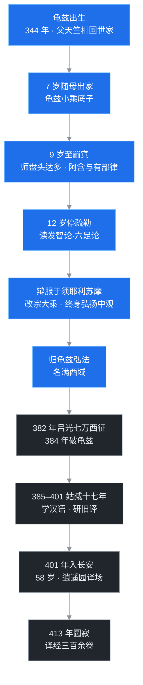

> 道安临终前没能等到的那个人，此时正被西征的军队裹挟东归，随后在凉州一关就是十七年。等到 58 岁的鸠摩罗什终于坐进长安的译场，留给罗什的时间只剩十来年——而就是这十来年，重新定义了汉地佛教的语言：三论、天台、净土，几个宗派的源头都在这一座译场里。

## 先给小白交个底

1. **这篇只写一个人，经历像过山车**。天竺血统的龟兹神童，9 岁留学罽宾，少年名震西域；40 岁出头被西征军俘虏，在凉州一困十七年；58 岁才到长安，用生命最后的十余年主持了汉地史上最强的一座译场。

2. **译笔好到什么程度？** 两百多年后玄奘带着更完备的语言学方法重译经典，想纠正旧译，结果罗什译本至今仍是流通最广的版本——《金刚经》《阿弥陀经》《妙法莲华经》，今天汉地出家人课诵的还是罗什的句子。

3. **三件大事记在罗什名下**：把龙树中观的核心论典成体系地搬进汉语，终结了汉地“拿老庄硬套佛经”的格义时代；译出经论三百余卷；门下“四圣十哲”撑起了东晋末义理的天花板。

## 一、龟兹出生：天竺父亲，龟兹母亲

公元 344 年，罗什生于龟兹（今新疆库车）。龟兹是丝路北道的佛教中心，葱岭以东的佛法传习，多经龟兹中转。

父亲叫**鸠摩罗炎**，天竺人，出身婆罗门中的相国世家，祖上世代为天竺国相。关于其东来，记载有两说：或传辞避相位、弃荣名而出走，或谓因国中政治迫害而亡命。鸠摩罗炎最终翻过葱岭到了龟兹。龟兹王早知其名，亲自出迎，请为国师。王有一妹，就是罗什的母亲：这位龟兹公主才慧明悟，王便做主把妹妹嫁给了国师。

先给“王子”的说法松松绑：罗什不是龟兹王之子，而是王妹之子、国师之子，称“王子”是对王室甥胄的泛称。

据《高僧传》，罗什的母亲生了两个儿子之后发心出家，起初鸠摩罗炎不允，公主便以绝食相争，直到丈夫同意才落发，受戒之后依然精进不懈。罗什 7 岁这年，随母亲一同出了家。今天库车郊外的苏巴什佛寺遗址，传说就是当年龟兹的皇家道场、罗什随母初学之地。

而当时的龟兹奉行小乘佛法，具体来说是说一切有部的声闻禅法。所以罗什的童子功，全是小乘。

## 二、九岁罽宾留学，十二岁疏勒读论

9 岁那年，母亲带着罗什翻过葱岭——今天的帕米尔高原——南下到**罽宾**，大致在今克什米尔、巴基斯坦北部一带。这里是说一切有部的大本营，阿育王时代以来论师辈出。

罗什在罽宾拜的师父叫**盘头达多**，是当地有名的大德，所学排得很满：《杂阿含》《中阿含》《长阿含》等根本经典，外加说一切有部的戒律。据《高僧传》，少年罗什诵经日过千偈，一偈三十二字，相当于每天三万二千言的背诵量。罽宾王曾请罗什入宫与外道辩论，少年把对方辩得词穷，由此在罽宾备受礼遇。

12 岁时，母亲带罗什东归，途经**疏勒**（今新疆喀什），据《高僧传》停住了约一年。罗什在此攻读说一切有部的论典《发智论》与《六足论》，二者合称“七论”。《发智论》为**迦多衍尼子**（又译迦旃延尼子）所造，是有部理论的集大成之作；其余六部以“足”相称，托举“身”论。顺带留个伏笔：两百多年后玄奘西行求法，求的正是这一套，七论之中，据载玄奘独译了六部。

一个在小乘学统里门门满分的优等生，眼看要沿着这条路走到底——转折就发生在疏勒。

## 三、一场辩论，换了终身方向

疏勒附近有个**莎车**国，莎车王子出家为比丘，名叫**须耶利苏摩**，是一位大乘僧人，专讲龙树一系的中观。

少年罗什起初听苏摩讲“一切皆空”，大不以为然。站在小乘的立场，第一反应是：这等于否定一切，那三宝、四谛、因果善恶岂不是全都落空？苏摩便与罗什展开辩论。辩难的具体字句史书没有逐字记下，只说罗什由层层诘难到终至语塞，最后彻底折服，反过来拜苏摩为师，改宗大乘。

这一拜，定下了罗什此后一生的学问方向：专弘龙树中观——《中论》《十二门论》，以及提婆所造的《百论》。龙树约生活于公元 150–250 年间，提婆是龙树的弟子。要知道此刻龙树圆寂才一百来年，中观在当时的西域仍属“新学”，罗什属于最早一批把这门新学向北传播的人。

离开疏勒后，罗什随母亲游历讲学，回到龟兹时已是一位贯通大小乘的青年高僧，弘宣大乘，名满西域。据《高僧传》的叙事，西域诸国君主礼敬之隆，曾伏跪座侧、请罗什踏背升座。

## 四、为一个人，发动一场战争

把罗什的名字带进长安的，是两条线。

一条是道安。道安在长安年年讲般若，当时汉地研治般若的，据记载有五十余家，形成“六家七宗”——借魏晋玄学的概念解空，各说各话。道安讲空讲到极深处，据说常发愿往生弥勒内院，好当面向弥勒把“空”义问个明白。就在这时，僧人**僧纯、昙充**自龟兹归来，向道安详述罗什在西域的盛名与大乘学养。道安立刻向苻坚建言：务必想办法把此人请来。

另一条是苻坚本人。382 年，已统一北方的前秦皇帝苻坚，派大将**吕光**率七万精兵西征，目标明确：攻下龟兹，把鸠摩罗什护送到长安。苻坚对吕光的交代近乎“抢亲”——西征当然也有向西域夸示威略的意思，但苻坚心心念念的，是得到一位国师。

先用一张图把罗什的东来路看全：

可这场“抢亲”的归途，被历史整个掀翻。

383 年，苻坚南下伐东晋，淝水一战，约八万北府兵在谢玄指挥下击溃前秦大军。关键细节：被前秦俘虏的东晋将领**朱序**，在两军胶着时于阵后高呼“秦兵败矣”，前秦军队当真崩溃，一路听见风声鹤唳，都以为追兵已至。苻坚中箭，单骑北逃，强盛的前秦帝国随即瓦解。385 年八月，苻坚被昔日部将姚苌缢杀——到处迎请高僧的皇帝，自己死在了佛寺里。

而道安，在 385 年二月先一步圆寂于长安。这位一再力劝迎请罗什的老人，到底没能等到罗什入关。

## 五、姑臧十七年：屈辱岁月，反成译场预科

吕光这边，西征大军在 384 年攻破龟兹，寻获了鸠摩罗什；可东归才到凉州，关中剧变的消息已经传来。385 年，吕光索性停驻**姑臧**（今甘肃武威），自建政权，史称后凉。

罗什就此被羁留，从 385 年到 401 年，前后十六七年。

据《高僧传》，吕光大军初破龟兹，便强逼罗什娶龟兹王女，罗什拒而不受；东归途中又故意令其骑劣马、走险路，以看其摔跌之态，席间再加冷嘲热讽。吕氏家族不信佛，对这位高僧毫无敬意，而罗什一一忍受，不申辩、不对抗——这份忍辱，后来成了传记里浓墨重彩的一笔。

但十七年并没有虚度。对一位译经师而言，姑臧岁月意外地成了“汉语预科班”：罗什在此期间精研汉语，又把汉地此前流传的旧译——尤其是竺法护的译本——一部一部读透，旧译哪里准确、哪里走样、哪里是硬凑格义，心里全记着账。多年后在长安译场，罗什能把梵文经义调度成流畅漂亮的汉文，根基正是在姑臧打下的，并非凭空而来的天才。

## 六、长安：五十八岁开始的十年

后秦这边，姚苌杀苻坚建立后秦；姚苌死后，儿子**姚兴**即位。姚兴崇佛，本人就喜爱研讨义理，久闻罗什之名，多次派人到后凉相请，后凉不允。401 年（后秦弘始三年），姚兴派叔父姚硕德率军西进，大破后凉，后凉国主吕隆出降——和当年苻坚一样，这又是一场为一位僧人发动的战争。58 岁的罗什，终于在 401 年年底抵达长安。

姚兴以国师之礼相待，安置于**逍遥园**（即后来草堂寺一带），译场就此开场。姚兴还做了一件影响深远的事：征调整个北方最优秀的义学僧人入长安参与译事。罗什门下人才号称“四圣十哲”：

- **僧叡**，笔受与定稿的主力，许多经序出自其手；
- **僧肇**，早在姑臧时就慕名投在门下，少年天才，《肇论》的作者——中06 的主角；
- **慧观、慧严**等自南来助译，其中有慧远专门派来的学人；
- 另有道安的老友**法和**，以及僧略等人。

### 译了什么

罗什译籍可分五类：

- **大乘经**：重译《大品般若》《小品般若》，新译《金刚经》《维摩诘经》《妙法莲华经》《阿弥陀经》——每一部都是后来汉地佛教的承重墙；
- **禅经**：《坐禅三昧经》《禅秘要法经》，第一次为汉地僧人提供了系统的禅修教材；
- **律典**：《十诵律》——汉地第一部完整译出的广律，外加《十诵比丘戒本》；
- **论典**：《中论》《十二门论》《百论》（三论），《大智度论》百卷，以及《成实论》《十住毗婆沙论》；
- **传记**：《马鸣菩萨传》《龙树菩萨传》《提婆菩萨传》。

此外还有罗什自著的《实相论》二卷，以及与慧远往来问答的结集《大乘大义章》三卷。

### 怎么译的

罗什译场不是一人伏案，而是一条流水线：罗什手持梵本（或凭记忆口诵），先讲释义理；弟子“笔受”成汉文初稿；文学高材负责“润文”；最后全场合校、逐字推敲。《金刚经》《维摩诘经》译文之美，是这条流水线的集体成果，并非罗什一人的中文天赋。

翻译策略上，罗什走的是意译路线：顺应汉语的表达习惯，也照顾中国人“好简”的偏好，对原典大胆删略。以《百论》为例，传统说法是只译了前半，后半多为破斥印度外道的内容，罗什觉得对汉地帮助不大，便删去不译；《大智度论》百卷同样是删节译本。这里要补一条现代学术提醒：《大智度论》没有梵文本，也没有藏文本，只有罗什的汉译本，书中还收录了大量说一切有部的资料，因此有学者怀疑此书其实是罗什综合讲录所撰、托名龙树。真相如何仍在讨论，但史料价值不受影响。

意译换来的是巨大成功：罗什译本在汉地的普及程度，连两百多年后玄奘的新译都未能超越。玄奘重译《金刚经》，本想以更精密的直译纠正旧译，结果流通最广的仍是“一切有为法，如梦幻泡影”的罗什本。

### 最大的功劳：把格义的楼梯拆掉

罗什译场对中国佛教最根本的贡献，是义理归位。

此前汉人理解般若，全靠格义——拿《老子》《庄子》的概念一个个去套，“空”被讲成“无”，再被讲成万有的本体，越讲越歪。据载，罗什初译《大品般若》之后，紧接着开译百卷《大智度论》，译论的同时以论回校经文，论译讫而《大品》亦校定——经先出初稿，论随后译来，最后以论正经。经文每讲一层空义，论中便有龙树的详尽论证。这等于向译场僧众和天下学人证明：这些义理出自原典、出自龙树，不是谁拿庄子附会出来的。中国佛教由此从格义的歧路上被拉回来，相对准确地安放到般若中观、缘起性空的基石之上；此前以“神不灭、灵魂不灭”为中心理解佛法的偏差，也一并得到扭转。

但意译也留下一道暗缝，值得专门点出。罗什译经有个高频词叫“**诸法实相**”，用来对应梵文里的法性等好几个概念，有时甚至是为补足文意添上的。在罗什原意里，诸法实相就是空，就是自性空、诸法无所有——一个否定性概念，译文里也反复写明“诸法实相即是空”。可“实相”二字在汉语里天然带着“真实本相、万物背后依据”的味道，中土读者极易读成一个肯定性的终极实体。这层误读，为后来竺道生开启涅槃佛性之学、中国佛教整体转向心性论埋下了伏笔。译本本身没错，文化土壤会让同一句话长出别的意思——所有移植工程都逃不掉这笔账，中08 讲竺道生时再细算。

## 七、折翮之叹：大师的伤心话

热闹的长安译场里，罗什说过一段极为伤心的话。

百卷《大智度论》译出后，罗什专门派人送一部上庐山给慧远——道安的高徒、当时南方佛教的领袖。慧远读了却嫌篇幅太繁，动手抄成二十卷精简本，还自撰了一序。消息传回长安，罗什颇为伤感；百卷本的论序最终由弟子僧叡写成。

罗什对身边弟子慨叹：“吾若著笔作大乘阿毗昙……则迦旃延尼子非其比也。今在秦地，深识者寡，折翮于此，将何所论。”翻成白话：我若放开手写一部大乘体系化论书，连小乘论圣迦多衍尼子都要相形见绌；可如今身在秦地，真正懂的人太少，我这只鸟折断了翅膀，困在此处。“**翮**”是鸟翅边缘的硬翎，折翮，就是飞不起来了。

还有一桩更刺痛的记载：罗什圆寂后，有印度来的僧人读到汉译典籍，评价说以罗什的学问所长，汉文译典里翻出来的不过十分之一——姑臧十七年的岁月，终究是被浪费掉了。

### 吞针与舌不坏

罗什晚年另有两则著名公案，都见于《高僧传》。

一则**吞针**。姚兴见罗什聪明超悟，动了念头：这样的人若没有后代太可惜，便强逼罗什接受宫女、别立居所。弟子中有人见师父如此，也想效仿蓄室。罗什不置一词，某天召集大众，取出满满一钵针，当众吞下，针又从周身毛孔一一而出，随后说：你们谁能做到这样，再学我不迟。众僧愧服。故事要表达的是一尘不染：迫于国王威逼而表面开缘，内心戒行无损。

二则**舌不燋烂**。413 年，罗什在长安圆寂。据《高僧传》，临终前发愿：我这一生译出经论三百余卷，自认没有违背佛意；若所译无误，火化之后舌根不朽坏。依《高僧传》记载，荼毗之后，全身尽化，唯独舌相不坏。今天甘肃武威——当年困住罗什十七年的姑臧——罗什寺塔中供奉的舌舍利，就是这段记载的实物叙事。囚禁之地终成供奉之地，也算历史留下的一点余温。

## 程序员类比

把这一路看完，罗什像什么人？像一位印度总部的核心架构师、龙树项目的嫡系传人，在西域分公司名震全行之后，被两个帝国先后用军队“请”去中原——然后在一处边缘办事处被雪藏十七年，58 岁才拿到主干仓库的 commit 权限。此后十余年，这位老架构师以惊人密度输出，直接定义了下游三百年的技术生态。

逐件拆：

- **译场，就是当时的大型 RFC 协作流水线。** 主架构师口诵原典、讲释义理（提案宣讲），弟子笔受成文（草稿），文学僧润文（提交 PR），全场合校（多人 review 后合并）。经首列明参与人名单，相当于一份完整的 CONTRIBUTORS。译文之美是流程的产物——好的工程输出靠机制，不靠孤胆英雄。

- **意译删略，就是为目标平台做 API 适配。** 不逐字硬搬原接口，而是按本地用户习惯重新设计入参出参，主动裁掉对目标用户无意义的模块（破斥印度外道的章节）。回报是市场份额的完胜：适配版压过了两百年后玄奘推出的“逐字直译版”，成为长期维护版本。

- **《大品》初译之后紧接译出《大智度论》、再以论回校经文，就是给规范配上参考实现（reference implementation）。** 当时汉地各家都在“实现空”，六家七宗七个版本互不兼容，全靠旧系统（玄学）的语义硬套。罗什把龙树的论证整个搬来：每条经义都能在论典中找到出处与推导。这是用设计文档加推导过程终结民间魔改——从此“空”的标准实现只有一个。

但类比必须戳破那个洞：**适配层永远带着语义漂移的风险，而这位顶级人才被系统性地浪费了十七年。**

“诸法实相”就是适配层缺陷的标本：接口名字取得太像旧系统的实体类，调用方（中土读者）纷纷把一个否定性概念当成肯定性本体来用，最后整条下游技术路线（心性论佛教）都建在这个误读之上。开发者本人早写了注释说明“此即空”，依然拦不住——语言的惯性比文档硬。

人才的账更触目惊心：一位“能写大乘阿毗昙、让迦多衍尼子相形见绌”的架构师，在 40 岁到 58 岁这段最成熟的年纪被困凉州、无事可做。关键模块只有一人掌握的项目，遇上战乱平台，损耗是文明级的——“十分之一”。怎么补救？罗什用的是最后一个办法：把全部学问灌注进译场流水线和弟子们身上，僧叡、僧肇这批人，就是罗什给自己做的冗余备份。

## 吵架现场

**意译还是直译？** 这是汉传译经史上贯穿千年的头号争论，罗什与玄奘各执一端。罗什一系主张让读者读得懂、读得顺，宁可删略改写；玄奘一系主张一字不走，哪怕译文佶屈聱牙。结局也很有启发：流通领域罗什完胜，至今《金刚经》《阿弥陀经》人人能诵；文献学上，玄奘译本却是对照梵文的第一依据。两种正确性服务两类用户，本来不必非输即赢。

**被逼受宫女，算不算破戒？** 罗什把这个问题变成了一场公开演示：不作辩解，吞针示众——开的是国王威逼下的方便缘，守的是内在戒体。弟子能不能效仿？答案极清楚：有同等证量再说，没有就别拿这当借口。戒律传统里这叫“行权”，而行权的门槛从来不在行为表面。

**“一切皆空”会不会掏空因果？** 这正是少年罗什在疏勒质问须耶利苏摩的问题，也是大小乘之间最锋利的一次交锋。罗什被说服之后给出的答案，后来由弟子僧肇用《不真空论》讲透：空否定的不是现象的存在，而是“现象有自性”；现象作为缘起的幻有宛然不失，因果丝毫不爽。中06 接着吵。

还有一场此篇只开了头的大辩论：罗什译典纠正了“灵魂不灭”式的理解，可庐山慧远读完罗什的论书，依然坚持神不灭——严密的义理到底能不能扭转立场？中07 看慧远。

## 卡壳角

- **“王子”的身份**：罗什是龟兹王妹之子，并非王之子；“王子”是对王室甥胄的泛称，别照字面理解。
- **入长安的年份**：401 年是后秦弘始三年。干净文本里曾出现“弘始十三年”的音近误记，核对历表当为三年；罗什时年 58 岁，与 344 年出生、按虚岁计 58 完全吻合。
- **姑臧年数**：385 年随吕光滞留、401 年入关，虚算十七、实算十六，文献中两说并存，取“十六七年”的概数即可。
- **《大智度论》的作者**：无梵文本、无藏文本，仅有汉译；传统署龙树造、罗什译，现代有学者据其大量收录有部资料且唯以汉译存世，疑为罗什自撰或讲录编集，两说并存，尚无定论。
- **《百论》的删节**：“三删百论”、只译前半是较早的传统说法，唐代已有意见认为原书本无传说中的后半；梵文《四百论》（汉译《广百论》）与《百论》如何对应，学界也未有定论。
- **吞针、舌不坏**：均出自《高僧传》，属宗教传记叙事，宜当作信仰与立场的表达来读，不宜当作可验证的物理事件；武威舌舍利塔是这一叙事的物质延续。

## 术语表

| 术语 | 一句话解释 |
|---|---|
| 龟兹 | 今新疆库车，丝路北道佛教中心，罗什出生地 |
| 鸠摩罗什 | 344–413，龟兹高僧，汉地四大译经师之首 |
| 鸠摩罗炎 | 罗什之父，天竺婆罗门相国世家；东来之由，或传辞避相位，或谓政治迫害，被龟兹王尊为国师 |
| 葱岭 | 今帕米尔高原，古代西域与天竺之间的交通屏障 |
| 罽宾 | 今克什米尔至巴基斯坦北部一带，说一切有部的大本营 |
| 盘头达多 | 罽宾大德，罗什小乘学的启蒙师父 |
| 疏勒 | 今新疆喀什，罗什改宗大乘之地 |
| 《发智论》 | 迦多衍尼子造，说一切有部的根本论典 |
| 《六足论》 | 与《发智论》合称七论的六部有部论典 |
| 迦多衍尼子 | 又译迦旃延尼子，《发智论》作者，小乘阿毗达磨的代表论师 |
| 须耶利苏摩 | 莎车王子、大乘比丘，在辩论中令罗什改宗 |
| 莎车 | 西域古国，今新疆莎车一带 |
| 三论 | 《中论》《十二门论》《百论》的合称，三论宗所依 |
| 龙树 | 约 2–3 世纪，大乘中观学派创始人 |
| 提婆 | 龙树弟子，《百论》作者 |
| 吕光 | 前秦大将，382 年西征龟兹，后据姑臧建后凉 |
| 姑臧 | 今甘肃武威，凉州治所，罗什被羁十七年之地 |
| 后凉 | 吕光所建十六国政权，罗什入关后不久灭亡 |
| 姚兴 | 后秦皇帝，崇佛好义理，迎罗什入长安 |
| 后秦 | 姚苌、姚兴父子所建政权，都长安 |
| 逍遥园 | 罗什在长安的主要译经处，草堂寺前身 |
| 四圣十哲 | 罗什门下杰出弟子的合称，如僧叡、僧肇等 |
| 僧叡 | 罗什弟子，译场笔受定稿主力，百卷《大智度论序》作者 |
| 僧肇 | 罗什弟子，《肇论》作者，中06 主角 |
| 《十诵律》 | 罗什译，汉地第一部完整译出的广律 |
| 《成实论》 | 诃梨跋摩造、罗什译，成实学派所依 |
| 《大智度论》 | 署龙树造（亦有罗什自撰之说），百卷，配《大品般若》的详解 |
| 诸法实相 | 罗什译经高频词，本意即空，中土易误读为本体 |
| 折翮之叹 | 罗什“深识者寡，折翮于此”之叹，伤学问无人能继 |
| 舌不燋烂 | 罗什临终誓愿，喻译典无误；武威有舌舍利塔 |

---

413 年罗什圆寂时，译场里有一位从姑臧一路追随的年轻弟子，已经悄悄把汉地般若学带到了连罗什都未曾到达的高度——用地道的中国语言，把“空”讲到让玄学与佛学彻底分家。下一篇写僧肇与六家七宗：般若学的中国消化。
