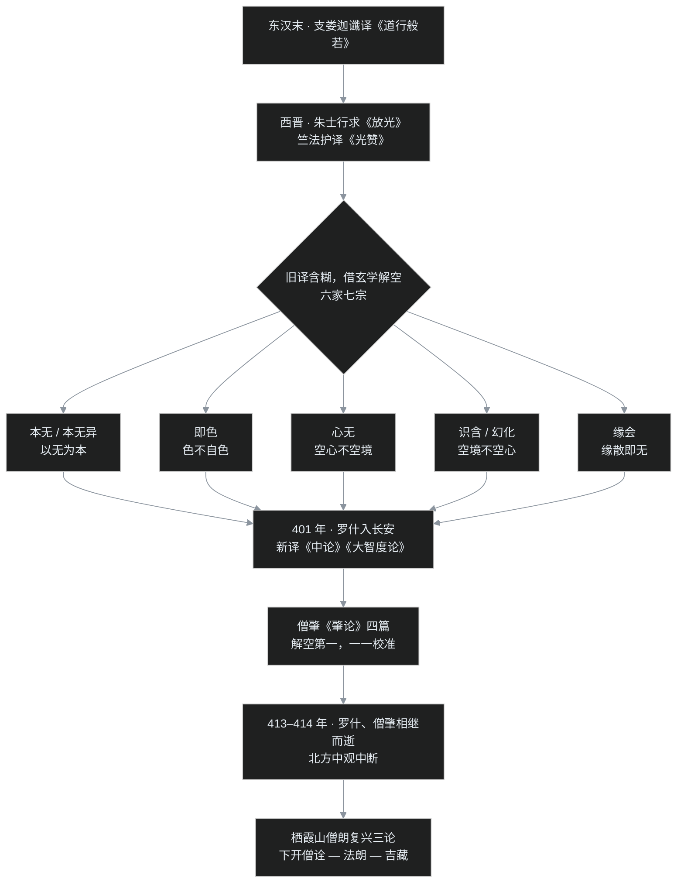

> 公元 414 年，长安。一个刚过不惑之年——或者按另一种算法才三十一岁——的僧人病故。这位僧人只赶上了鸠摩罗什译场的那十来年，却让「空」这个字，第一次有了说清楚的汉语版本。在僧肇之前，中国人讲了上百年般若，讲成了七派谁也说不服谁；在僧肇之后，佛学开始从玄学的屋檐下搬出来，单独立户。

## 先给小白交个底

在正式开场前，先把三件事说在前面：

- **「六家七宗」不是七个宗派，是七种「空的解读法」。** 西晋到东晋，《般若经》的汉译本有好几个，译文都含糊，讲经的人只好拿本土最时髦的玄学（老庄那一路）去对，结果对出了六七种说法。严格说它们是「学派」，不是后来三论宗、天台宗那种有庙有传承的宗派。
- **僧肇（zhào）干的事，是给这场乱局收尾。** 作为鸠摩罗什最年轻也最锋利的弟子，僧肇写了一组短论（后世合称《肇论》），用罗什新译来的准确义理，把六七种读法一一校准。所以这篇的上半截是「七派混战」，下半截是「一人结账」。
- **这篇还顺手讲一个圈子：名僧与名士。** 东晋的高僧和高门士族基本是同一个清谈俱乐部里的人，王导、谢安、王羲之都在里面。「空」怎么被中国人消化，一半在书斋里，另一半就在这些交游、辩难和段子里。

---

## 一、六家七宗：借玄学频道讲「空」

### 1. 为什么会冒出七家

事情要从译本说起。

般若思想自东汉支娄迦谶译《道行般若经》入华，到西晋又有朱士行求来的《放光般若经》、竺法护译的《光赞般若经》。这些经讲的核心是一个字：**空**——一切法没有常住不变的自性。

问题是，「自性」「缘起」这些印度概念，当时的汉语里根本没有现成的词。译者只能借用道家、玄学的词汇：本无、自然、无为。而两晋的知识界，最时髦的思想活动恰恰是玄学清谈——王弼、何晏讲「以无为本」，郭象注《庄子》讲「名教即自然」。于是士大夫读《般若经》，读到「本无」两个字，很自然就接上了玄学的频道：哦，这不就是王弼说的那个「无」吗，万有的本体、万物的源头。

频道一接错，讲法就开始分叉。般若讲「诸法本无」，意思是一切现象因缘而生、没有自性；被玄学一读，很容易变成「在万物存在之前，先有一个『无』，万物从无里生出来」——这就把「空」讲成了宇宙起源论和本体论，跟原义差着一层。

当时到底分出了多少家？罗什的弟子僧叡（ruì）在《毗摩罗诘提经义疏序》里留下一句总结：

> 格义迂而乖本，六家偏而不即。性空之宗，以今验之，最得其实。

「格义迂而乖本」——拿概念对概念的格义法绕远路还背离本义；「六家偏而不即」——六家都跑偏了，没打中。这是当事人的一手证词：当时确有「六家」的说法，而且普遍被认为不得要领。

### 2. 七宗是哪七家

要提醒的是：**「六家七宗」这个完整名目，不是东晋人自己开列的，而是后世经录、论疏追述出来的。** 刘宋时有昙济作《六家七宗论》（原书已佚，片段靠唐代元康《肇论疏》、吉藏《中论疏》等引用才保存下来），近代汤用彤先生《汉魏两晋南北朝佛教史》又做了系统考订。按这条记载脉络，七宗是：

| 宗名 | 代表人物 | 核心主张（约义） |
|---|---|---|
| **本无宗** | 释道安 | 诸法本无；但道安的讲法相对平实，被罗什一系认为七家中最近正道 |
| **本无异宗** | 竺道潜（竺法深）、竺法汰 | 「无」在万化之先，从「无」生出「有」——把空讲成了宇宙起点 |
| **即色宗** | 支遁（支道林） | 色（物质现象）没有自己的根，「色不自色」，所以现象当体即空 |
| **识含宗** | 于法开 | 三界如梦，群有皆梦中所见；大梦一觉，识灭则三界都空 |
| **幻化宗** | 释道壹 | 世谛诸法皆同幻化；境是空的，心神不空 |
| **心无宗** | 支愍度立义，竺法蕴等弘传 | 心不执着于万物就是空；但万物本身不空——空心不空境 |
| **缘会宗** | 于道邃 | 因缘会合才有「有」，因缘散了就是「无」 |

本无一家内部又分出「本无异」，所以叫「六家七宗」——六家，加上本无的支流，共七宗。

这七家的「偏」，如果用程序员熟悉的思路归类，大致是三个方向的 bug：

- **把「空」读成「无」这个实体/起点**：本无、本无异。这是接玄学「以无为本」接得最紧的一路。
- **空心不空境**：心无宗。心不执着就完事了，外境承认它实有——等于只改了一半。
- **空境不空心**：识含、幻化。外境是空的（如梦如幻），但有个能做梦、能觉悟的「心神」是真的——另一半没改。
- 即色宗最接近，已经说到「色不自色」、现象没有自性，但僧肇认为它还差最后一步（后面详说）。

七家并非同时坐在一个会场里论战，它们分布在西晋到东晋、北方到江南的近百年间；人物之间倒是真有交火——比如于法开派弟子去跟支遁辩难，这是《世说新语》里都记了的名场面，放到第四节讲。

把两百年的脉络画成一张图，就是：

---

## 二、僧肇：从抄书少年到「解空第一」

### 1. 出身：抄书抄出来的学问

僧肇是京兆人（今西安一带），出身贫寒。僧肇少年时的营生是**替人抄书**——在印刷术还没有的年代，这是一门糊口的手艺。

但这份苦工意外成全了僧肇：儒书、老庄、佛经，抄什么读什么，几年下来经史子集过了一遍。僧肇读《老子·德经》，叹口气说：「美则美矣，然期神冥累之方，犹未尽善也。」——好是真好，但安顿精神、超脱系累的办法，还不算彻底。直到后来读到旧译《维摩诘经》，「欢喜顶受，披寻玩味」，说「始知所归矣」，这才认定找到了归宿，于是出家。

这段「抄书成学」的经历很要紧。它解释了两件事：一是僧肇的文笔为什么那么好——《肇论》是佛教论疏里公认文章最漂亮的一部，骈散结合、警句连篇；二是僧肇后来为什么能跟玄学圈正面说话——老庄僧肇是真读过，不是隔岸观火。

### 2. 追随罗什

僧肇年纪很轻时就听说鸠摩罗什的名声。罗什当时还困在姑臧（今甘肃武威），被后凉吕氏扣了十七年，僧肇不顾路远，奔赴姑臧投奔；公元 401 年罗什被姚兴迎入长安，僧肇跟着进入逍遥园译场，成为译场里最年轻的核心成员之一。

在译场，僧肇不只是助手。罗什译经，僧肇常常参与评定、把关，而且每译完一部重要典籍，僧肇都写序或作论阐发。罗什对这位弟子的评价高到近乎夸张——称僧肇「**解空第一**」。

还有一则故事。僧肇写成《般若无知论》呈给罗什，罗什读后说：「吾解不谢子，辞当相挹（yì）。」意思是：理解上我不比你差，但文辞表达上我得推让你一头。论师对弟子说这种话，分量很重。

（「挹」字传本有异文，有的材料记作「摈」，应以《高僧传》的「挹」为是，就是推挹、甘拜下风的意思。）

论文传到南方庐山，隐士刘遗民（刘程之，莲社核心成员）读后赞叹：「不意方袍，复有平叔！」——没想到僧袍里又出了一个何晏（何晏字平叔，玄学开山级人物）。随后刘遗民致书论学，僧肇写《答刘遗民书》回复。一篇论文能让南北两边同时服气，这在当时是很少见的。

### 3. 早逝：一个人的中断

僧肇卒于东晋义熙十年（414 年），距罗什圆寂（413 年）只差一年多。

关于僧肇的年寿，两说并存：

- **四十一岁说**：按活动年代推算，僧肇若赶上姑臧投师、在译场十余年、又与刘遗民长篇往返，三十一岁装不下这些事，所以汤用彤等学者认为《高僧传》传写时「四」讹作「三」，主张春秋四十一；
- **三十一岁说**：《高僧传》原文作「春秋三十有一」，据此则生于 384 年，是标准的天才早逝型人物。

两说都能讲出道理，本文不强行站队，只在时间线上记住一个确定的事实：**罗什一走，僧肇紧跟着就走了。** 这一接一续的离世，造成了一个严重后果——罗什、僧肇所传的中观般若学，在北方突然没了扛旗的人，法脉中断了几十年，直到南朝齐梁间栖霞山的僧朗重新振起三论之学，才接上香火。一个核心模块只有一个 maintainer，人一走主线就停，这种「公共汽车因子（bus factor）＝1」的风险，古代译场一样要承担。

---

## 三、《肇论》四篇：一部「空」的校准手册

僧肇留下来的主要著作，后世合编为《肇论》，含四篇核心论文，另有《答刘遗民书》等。四篇各管一个问题：

### 1.《物不迁论》：动静

这是最惊艳、也最惹争议的一篇。开篇就是名句：

> 旋岚偃岳而常静，江河竞注而不流，野马飘鼓而不动，日月历天而不周。

——狂风把山都吹倒了，却「常静」；江河奔腾，却「不流」；游气飘鼓，却「不动」；日月周天，却不曾绕行。这不是睁眼说瞎话吗？僧肇的论证是：人们以为有「物」从过去运动到现在，其实没有。过去的物停在过去，不会来到现在；现在的物就在现在，也不是从过去来的：

> 昔物自在昔，不从今以至昔；今物自在今，不从昔以至今。

每一刹那的现象「各住一世」，并不真有同一个东西穿过时间搬到此刻。所以在「运动」的表象底下，没有一个迁移者——**动中有静，即动而求静**。这个论证方式，很像古希腊芝诺的「飞矢不动」：把时间切成刹那，每一刹那飞矢都在一个确定位置，「运动」就需要重新解释。僧肇要说明的是：执着有来去、有变迁的主体，本身就是迷执；真如法性不可以迁流论。

### 2.《不真空论》：空有

篇名就是纲领：**不真，故空**。万物不是「没有」，而是「不真实」——像幻化人，不是没有那个幻象，但幻象没有真实的体性。缘起的现象「非无」（确实显现），又「非有」（没有自性），空指的是「不真实」这一层，不是指一无所有。

更要紧的是，这篇论文对当时影响最大的三家——心无、即色、本无——逐一做了点名批评，等于一份校准报告。原文的判词非常精炼：

- 批**心无宗**：「心无者，无心于万物，万物未尝无。此得在于神静，失在于物虚。」你做到了让心不执着（这算对），但你以为万物实有、不空外境（这是错）。
- 批**即色宗**：「即色者，明色不自色，故虽色而非色也。……此直语色不自色，未领色之非色也。」你说了现象没有自己的根，这很好；但你还没真正领会「色当体就是非色（空）」，还停在半路上。
- 批**本无宗**：「本无者，情尚于无多，触言以宾无。……此直好无之谈，岂谓顺通事实，即物之情哉？」感情上太偏爱「无」，开口闭口都归于无，这是「好无之谈」，不是顺着事实、贴着现象说话。

三家的毛病一个是空心不空境，一个是差最后一步，一个是把空说成「无」的实体——僧肇用「不真故空、幻有非无」一个立场，把三条歧路全堵上了。

### 3.《般若无知论》：能所

般若是能照见空的智慧，但这个「知」很特殊：它不是主体认识客体那种知。

日常的认知结构是「能知的心」抓「所知的对象」，能所二分；而般若所照的是真谛、是性空，真谛不是一个可以摆出来当对象的东西，所以般若不是「对某个对象的知识」。僧肇说般若「无知」，又「无所不知」：它没有世俗那种执取对象的「知」（无知），却遍照一切法性（无不知）。原文的讲法是「般若可虚而照，真谛可亡而知」——心保持虚明，不立能所，反而照得最真。

这一篇呈给罗什，引出「解不谢子、辞当相挹」的评语；后来又引出刘遗民的问难和僧肇的答书，是四篇里讨论最热闹的一篇。

### 4.《涅槃无名论》：言诠

涅槃是修行的终极果境。僧肇说，涅槃超越一切名相语言：它不是有，不是无，不可用「得」「失」「生」「灭」去描述，所以叫「无名」。凡夫的语言系统是为缘起世界准备的，硬拿它去套涅槃，怎么说怎么错。

需要老实交代一点：此篇的真伪，清代姚鼐（《惜抱轩笔记》）以来就有学者怀疑（有人认为文风和论证层次与前三篇不类，可能是后人依托），现代学界也未定论。课程里把它作为僧肇著作来讲，这里照讲，同时把官司记在「卡壳角」。

四篇连起来，正好是一条完整的防线：《物不迁》破「来去」，《不真空》破「有无」，《般若无知》破「能所」，《涅槃无名》破「言诠」——把人在时间、存在、认识、语言四个层面最容易犯的执着，各处理一遍。

---

## 四、名僧与名士：一个清谈圈的两面

讲六家七宗，绕不开东晋特有的社会风景：**名僧名士化，名士也名僧化**。

（先交代一句：本节对话多采《世说新语》，与《高僧传》字句偶有出入，意思一致，下文不逐条出注。）

渡江之后，佛教中心随中原士族南迁到建康（今南京）和会稽（今绍兴一带）。高门大族既是政治权力的持有者，也是清谈的主力；高僧要弘法，必须进这个圈子，而且进得相当自然——他们谈的老庄、般若、有无、言意，本来就是同一套话题。

### 1. 竺道潜：「君自见朱门，贫道如游蓬户」

竺道潜（字法深，又称深公）是这圈子里辈分极高的一位。竺道潜是琅琊（今山东临沂）人，出身顶级门阀琅琊王氏，《高僧传》原文作「晋丞相武昌郡公敦之弟」——丞相、武昌郡公两个头衔都属王敦一人，即王敦之弟，与王导为同一家族的从兄弟行。竺道潜少年出家，讲《放光般若经》——正是本无异宗一路的人物。

永嘉之乱后竺道潜南渡，晋元帝、晋明帝以及王导、庾亮都对竺道潜极为推崇，甚至可以穿着木屐登上内殿讲经，时人不以为僭，只当竺道潜是「方外之宾」。后来竺道潜主动离开京城，入剡山（在今浙江新昌一带）隐居弘法，一住三十多年，用大乘义理解释老庄，八十九岁终老于山馆（《高僧传》明文作春秋八十九；后世另有八十七岁的异说）。

最能代表竺道潜姿态的是这段对话。名士刘惔（tán）讥讽竺道潜：「道人何以游朱门？」——出家人怎么老在富贵人家打转？竺道潜答：

> 君自见其朱门，贫道如游蓬户。

你看见的是红漆大门，我走起来跟蓬草破屋没什么分别。一句话把「境随心转」讲到了现场。

### 2. 支遁：给《逍遥游》写新解的和尚

如果说竺道潜是「世族僧侣」的典型，支遁（字道林，世称支公）则是「名士和尚」的典型。支遁出身佛教家庭，二十五岁出家，讲经不泥章句、专重义理脉络，同时深通老庄。支遁的《逍遥游》新解一出来，「标新理于向秀、郭象之外」，一时名士无不倾倒；即色宗的主张就写在支遁的《即色游玄论》《释即色本无义》里（文集后来失传，只赖《世说新语》注等保存片段）。

支遁的交游名单几乎是东晋名士全明星：王蒙、王洽、孙绰、许询、谢安、王羲之。段子也多。支遁想找个地方隐居，向竺道潜求买剡县沃洲的一处小岭，竺道潜回答：

> 未闻巢、由买山而隐。

没听说过上古隐士巢父、许由是买座山来隐的。——意思是真要隐，何必走买山的俗套。支遁后来还是住到了那里，「买山而隐」从此成了典故。

最有名的是支遁与王羲之的相见。王羲之起初颇为倨傲，孙绰推荐支遁，王羲之并不怎么搭理；后来在王府遇上，王请支遁讲讲《逍遥游》，支遁「作数千言，才藻新奇，花烂映发」，王羲之听得披襟解带、流连不能已。后世相传王羲之终舍宅为寺，这段故事常被当作名士皈依的样板（具体寺名传说纷纭，这里不坐实）。

### 3. 辩难：法会就是辩论会

东晋讲经不是单向输出，「讲」必有「难」，法会＝主讲＋问难，水平高下当场见分晓。这风气催生了一批好故事：

- **于法开遣弟子问难。** 于法开（识含宗代表）起初与支遁争名，后来舆论渐归支遁，于法开心中不平，便退回剡县，精心设计了几十个问难的回合，趁支遁正在讲《小品》之际，派弟子于法威赶去，「受人寄载」替自己出招。弟子照预演的路数发难，往反多时，支遁终于理屈，厉声说：「君何足复受人寄载来！」——你何苦替别人跑腿来难我！学问之争里夹着名士的胜负心，很见性情。
- **于法兰与虎同室。** 于法兰是山居苦修的高僧，一次大雪，老虎钻进于法兰屋里避雪，于法兰安坐不动，老虎天亮自己离去。于法兰的弟子辈里，于法开主识含、于道邃主缘会，一家开了两宗。
- **康僧渊以论脱贫。** 康僧渊刚过江时无人知晓，在市集乞讨度日，后来与名士殷浩论辩佛理，「义理锋起」，由此成名，境遇全改。康僧渊生得高鼻深目，王导常拿康僧渊的相貌打趣，康僧渊答得极漂亮：「鼻者面之山，目者面之渊；山不高则不灵，渊不深则不清。」
- **谢朗被母亲抱走。** 谢安的侄子谢朗才十几岁，新病初愈，跟支遁讲论到相持不下、身体都吃不消；母亲王夫人在壁后听见，几次派人叫不回，亲自出来说「我年少遭家难，一生的指望全在这个孩子身上」，流着泪把儿子抱走了。
- **王珣请译僧讲论。** 琅琊王珣延请高僧僧伽提婆讲《阿毗昙》，王珣的弟弟王珉（小字僧弥）在别室同时主讲大义，时人评为才气可观，但细节处到底不及大和尚。
- **孙绰的「七僧比七贤」。** 名士孙绰作《道贤论》，把当时七位高僧一一比作竹林七贤——在东晋人眼里，名僧和名士本来就是一类人。

顺带提一句南北差异：**南方重法义辩论，北方重实际造像、修福、禅律。** 江南寺庙里最热闹的是讲席，北方山崖上最壮观的是造像——两种信仰表达方式，已经显出分野。

### 4. 比丘尼与名媛：林下风气

古代女性出家者的记载比男性少得多（讲者推测，这可能跟当时社会以男性为斋醮、公共仪式中心的结构有关，属于个人观察），但东晋仍有一抹亮色。

谢玄最佩服的人是自己的姐姐——**谢道韫**。她是安西将军谢奕之女、谢安的侄女，自幼才思敏捷（「未若柳絮因风起」的咏絮典故就出自她），后来嫁给王羲之的儿子王凝之。这桩婚姻她本人是不满意的，回娘家时曾直言「一门叔父则有阿大、中郎，群从兄弟复有封、胡、遏、末，不意天壤之中乃有王郎！」——谢家满门人才，想不到天地间竟有王凝之这样的人。千古才女配了平庸夫婿，她的不平写在《世说新语》里。

当时还有张玄常夸自己的妹妹，想跟谢玄一较高下。有位济尼同时见过两位夫人，被问起高下，她答得极有分寸：

> 王夫人神情散朗，故有林下风气；顾家妇清心玉映，自是闺房之秀。

——谢道韫（王夫人）神情疏朗，有竹林名士的气象；张玄之妹（顾家妇）心地清亮如美玉生辉，自是闺房中的优秀人物。两句都是夸奖，但「林下风气」是拿竹林七贤的格局比，「闺房之秀」只在闺阁范围内称秀，品评的高低，懂的人一听就明白。

---

## 五、消化完成：佛学从玄学屋檐下搬出来

现在可以收这个束了。僧肇这一轮工作的意义，至少有三层：

**第一层，义理校准。** 六家七宗的「偏」，根子是用玄学「无」的范畴去接般若「空」的范畴。僧肇以罗什新译的《中论》《大智度论》为依据，把「空」重新讲成「缘起无自性、不真故空、幻有非无」——既不是一无所有，也没有一个叫「无」的本体。从此中国人讲般若，有了准确的本土文本可依。

**第二层，姿态独立。** 僧肇本人玄学修养极深，但僧肇用玄学的语言讲的是印度中观的义理，而且敢于点名清算玄佛混杂的读法。佛学由此不必再依附老庄做注脚，开始单独立户——这是「消化」二字的真正含义：不是被对方同化，而是吃下去变成自己的血肉。

**第三层，开了下游。** 后来南朝三论学复兴（僧朗—僧诠—法朗—吉藏），尊僧肇为关河旧学的正统；天台宗的不少议题（动静、真俗、一心三观的雏形话语）也能在《肇论》里找到先声。僧肇以不到十年的著述时间，给此后几百年的义学铺了路。

当然也要说公允的一面（傅新毅先生的分析很到位）：《物不迁论》那种「刹那各住」的讲法，其实也带着玄学和名相分析自身的痕迹——为了破「来去」而强调「住」，后世不少论师反过来批评它容易让人以为现象真的「住」在刹那里，跟缘起如流的中道仍有一间未达。真正彻底的说法是「即动见静、动静双遣」，连「住」也不立。语言在帮人破执的同时会埋下新的执取点，僧肇如此精彩，仍逃不出这个困境——这一点留到「吵架现场」展开。

---

## 程序员类比

- **六家七宗像什么？** 像一份官方文档只有机翻版（般若诸旧译），社区里七个技术领袖各自结合自己熟悉的旧框架（玄学）写理解笔记，对同一个核心概念（空）做出了七套互不兼容的解释，还各自带了一帮读者。
- **僧肇干的事，** 相当于官方准确文档（罗什新译《中论》《大智度论》）到位之后，团队里文笔最好、对旧框架也最熟的那位核心工程师，写了一组「源码精读＋勘误报告」：《不真空论》是 issue 评论区，逐条 @ 心无、即色、本无三位大 V，指出三家的实现分别错在哪；《般若无知论》是架构说明，解释这个系统的「观测」不能按「主体—对象」的常规模型理解。
- **「般若无知，无所不知」，** 用工程的话说：不要把「智慧」建成一个持有对象的状态字段（一持有就成了执取），它更像一种无住的实时响应能力——不缓存、不固化对象，反而能处理一切输入。
- **罗什与僧肇相继而逝、北方中观中断，** 就是教科书级的 bus factor＝1：知识全在一个人脑子里，没有第二个 committer，人一离场主线停摆几十年，直到江南的 fork（僧朗）被重新接上主干。
- **戳个洞：** 《物不迁论》为破「迁流」而说「各住一世」，相当于为修一个 bug 引入了一个新变量（「住」），结果变量本身成了新的误解源头——重构的尽头永远有下一个待重构。僧肇都逃不掉，叶扬也就释然了。

---

## 吵架现场

**争点一：六家七宗到底算不算「歪理」？**

按僧叡「偏而不即」和僧肇的清算，七家当然是跑偏了。但反过来想：没有这批人用玄学做桥梁，般若根本进不了中国士大夫的脑子——「理解错」总好过「没人理」。所以一派看它们是要被清算的误读，一派看它们是必要的接引阶段。公允的说法大概是：**它们是消化过程中的半成品，使命完成后即被超越。**

**争点二：《物不迁论》符不符合中观？**

这是唐代以来真有人打笔墨官司的地方。批评者说：龙树《中论》明明说「不一亦不异、不来亦不出」，连「住」本身也要破掉（《观三相品》原偈：「不住法不住，住法亦不住，住时亦不住，无生云何住」），僧肇强调「各住一世」，岂不是立了个「住」？辩护者说：僧肇本意是「即动而求静」，落脚在双遣，不是真主张有个住的东西；僧肇用的是「以楔出楔」的方便。读法的关键在于你把「不迁」读成结论还是读成药。

**争点三：高僧该不该「游朱门」？**

刘惔之问其实每个时代都有效：佛教要深入社会就得结交权力和财富，结交太深又难免被权力同化。竺道潜的回答（「如游蓬户」）是从心境上解，没有从事实上否认。东晋这一代名僧大体守住了「方外之宾」的相对独立，但此后梁武帝、武则天时代「沙门是否敬王者」的反复争论，证明这根线一直绷得很紧。

**争点四：僧肇是三十一岁还是四十一岁？**

两派都有硬处：《高僧传》文本作三十一；活动年表（姑臧投师、译场十年、与刘遗民往返）又撑不起三十一。除非有新出史料，这个官司大概率要一直打下去。

---

## 卡壳角

写这篇时踩在资料边界上的点，统一交代：

- **「六家七宗」名目是后世追述。** 东晋一手材料只有僧叡说的「六家」；完整七宗名目出自刘宋昙济《六家七宗论》（已佚），经唐元康《肇论疏》、吉藏《中论疏》引用、汤用彤考订才成今天的样子。七宗与人物的对应关系，是「南朝至唐代记载层级」，不是东晋当场的自我登记。
- **各宗代表人物的归属有细微异说。** 比如本无异宗或系竺道潜、或兼系竺法汰；心无义由支愍度立说，竺法蕴（一名法温）弘传；其后僧人道恒在荆州大行此义，竺法汰集名僧令弟子昙壹等辩难（一说慧远亦参与攻难，时桓温镇荆州），心无义由此消沉。本文取通行考订，不代表异说不存在。
- **僧肇年寿**三十一/四十一两说并存，卒年 414（晋义熙十年）确定，生年随之两系（384 或 374）。
- **《涅槃无名论》的真伪**自清姚鼐《惜抱轩笔记》始疑（今人续有论证），学界未定，课程照讲，本文照讲。
- **罗什评语**「辞当相挹」的「挹」字传本或作「摈」，以《高僧传》「挹」（推挹）为正。
- **竺道潜与琅琊王氏的具体世系**：《高僧传》明文作「晋丞相武昌郡公敦之弟」（王敦之弟），后世或有族弟、亲弟之异辞，本文从《高僧传》。
- **王羲之舍宅为寺**的具体寺名传说纷纭，本文不写死；支遁买山事的对话《高僧传》《世说新语》细节略有出入。
- **孙绰《道贤论》七僧与七贤的具体配对**：全文已佚，今仅存数则（如以竺道潜比刘伶、支遁比向秀、于法兰比阮籍、于道邃比阮咸），故不列全表，以免凑错。
- 名僧名士各条故事多出自《高僧传》《世说新语》，其中不乏夸饰成分，作为时代风气的见证读最稳妥，不宜逐条当实史。

---

## 术语表

| 术语 | 一句话解释 |
|---|---|
| 般若（bō rě） | 照见诸法空性的智慧，不是世俗知识 |
| 空 | 缘起法没有常住自性；不指一无所有 |
| 自性 | 事物不依赖因缘、独立自有的规定性；佛教认为并不存在 |
| 缘起 | 一切法依因缘和合而生、离散而灭 |
| 六家七宗 | 两晋之际般若学的六七种玄学化解读；本无分本无、本无异两支故六家七宗 |
| 本无宗 | 道安一系，讲诸法本无，七家中最近正道 |
| 本无异宗 | 竺道潜等，主张「无」先于万有、从无生有 |
| 即色宗 | 支遁一系，「色不自色」，现象没有自己的根、当体即空 |
| 识含宗 | 于法开一系，三界如梦，识灭则三界都空 |
| 幻化宗 | 道壹一系，万法如幻，境空心不空 |
| 心无宗 | 支愍度立、竺法蕴等传，空心不空境 |
| 缘会宗 | 于道邃一系，缘会故有、缘散故无 |
| 格义 | 用本土概念逐项配解佛理的早期方法，僧叡评为「迂而乖本」 |
| 玄学 | 魏晋以老庄为底、谈本末有无的清谈之学，代表王弼、何晏、郭象 |
| 以无为本 | 王弼玄学命题，七宗「偏」的主要误读来源 |
| 名教与自然 | 玄学核心议题之一，讨论儒家纲常与道家自然的关系 |
| 《肇论》 | 僧肇四篇论文的合集：物不迁、不真空、般若无知、涅槃无名 |
| 《物不迁论》 | 破「来去」，刹那各住一世，即动求静 |
| 《不真空论》 | 破「有无」，不真故空、幻有非无，点名批评三家 |
| 《般若无知论》 | 破「能所」，般若超越主客二分，无知而无不知 |
| 《涅槃无名论》 | 破「言诠」，涅槃超名相（真伪有争议） |
| 能所 | 能知的主体与所知的对象；般若观空不立能所 |
| 真俗二谛 | 真谛（胜义，空性）与俗谛（世俗，缘起现象） |
| 性空 | 「缘起性空」的省称，现象因缘起而无自性 |
| 即体空／当体即空 | 现象本身就是空，不必等现象消灭之后才空 |
| 昙济 | 刘宋僧，作《六家七宗论》，原书已佚 |
| 元康 | 唐代僧，《肇论疏》保存了六家七宗的早期记载 |
| 吉藏 | 隋唐僧，三论宗集大成者，《中论疏》引及七宗资料 |
| 僧叡 | 罗什弟子，「格义迂而乖本，六家偏而不即」即出其序 |
| 刘遗民 | 名程之，庐山隐士、莲社成员，与僧肇书信论学 |
| 解空第一 | 鸠摩罗什对僧肇的评语 |
| 林下风气 | 济尼评谢道韫语，谓其有竹林名士的气象 |
| 朱门／蓬户 | 富贵之门／贫寒之屋，竺道潜「如游蓬户」之对 |
| 关河之学 | 指罗什、僧肇在长安所传的中观旧学，后世三论宗奉为正统 |

---

## 结尾

般若学在中国的这场消化，用了将近两百年：从支娄迦谶译出第一个「本无」，到六家七宗借玄学各说各话，再到罗什把准确的论典摆上桌，最后由一个抄书出身的长安青年提笔结账。

僧肇结账的方式也留了个遗憾：人走得太早，北方中观的线断了几十年。但思想一旦被准确地写下来，就不会真的失传——它顺着江到了庐山，又过了江到了建康、会稽，最后在栖霞山和长安城的后来者那里重新发光。

同一时期的江南，还有一位比僧肇年长、也比僧肇活得久，也同样在「消化」这件事上做到了极致的人物。这位高僧不在罗什的译场里，而在庐山的云雾间；所关心的问题从「空是什么」转向了「人死之后是什么」——神灭还是不灭，因果如何成立，念佛凭什么往生。这位高僧正是慧远。下一篇，中07，上庐山。
