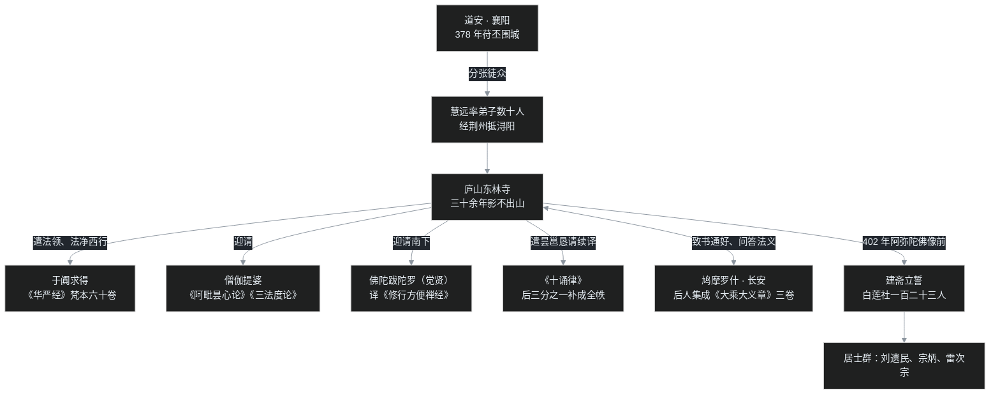

> 公元 402 年，庐山。一百二十三人在一尊阿弥陀佛像前焚香立誓，约定此生之后共往西方。领誓的老僧叫慧远，已经在这座山里住了二十多年，此后也再没打算下山。这是中国佛教史上最著名的一场誓约，也是误会最多的一场：莲社后来成了净土宗的图腾，可慧远当年念的佛，跟后世老奶奶口里的「南无阿弥陀佛」根本不是一回事；而真正让这位老僧名垂青史的，还不是念佛，是一篇写给权臣的书论——沙门不敬王者。

## 先给小白交个底

在正式上山前，先把四件事说在前面：

- **慧远（334–416）是道安的弟子，但师徒俩的「画风」很不一样。** 道安一辈子颠沛流离、在乱世里搭制度骨架（中04 讲过）；慧远则在江南一座山里稳稳坐了三十多年，把庐山经营成了全国佛教的信息枢纽：西域来的经、长安来的论、南下的禅师，第一站几乎都到这里。
- **这篇有两条线，别缠在一起。** 明线是慧远的一生：儒生出身、南下、上山、组织译经、立莲社、对抗皇帝；暗线是一个哲学问题——**人死之后，那个「我」还在不在？** 慧远的答案是「形尽神不灭」，这个答案深刻塑造了此后一千年的中国佛教，也让慧远跟自己最敬佩的罗什，在书信里吵了一辈子也没吵明白。
- **「净土宗初祖」这顶帽子，先别急着给慧远戴上。** 慧远当年的念佛是禅修（在心里把佛国观想得清清楚楚），不是口称名号；称名念佛要到北魏昙鸾、唐代善导才成主流。认祖是后人的追认，事实层面得掰清楚。
- **两名「慧远」别搞混。** 本篇的主角是东晋庐山慧远；隋代还有一位净影寺慧远，写过一部大部头《大乘义章》。古书里只写「慧远」两个字，读者很容易撞车——这个坑放到「卡壳角」细说。

---

## 一、儒生慧远：二十一岁那年的频道切换

慧远是雁门楼烦人（今山西宁武一带），生于公元 334 年。少年慧远走的是标准的读书人路线：十三岁时随舅父游学许昌、洛阳，很快以精通儒典、尤其谙熟老庄成名。如果世道太平，这大概会是一个清谈名士的简历。

二十一岁那年，慧远打算渡江去豫章（今南昌），投奔当时名声极大的隐士、大儒范宣，一起过「读书耕隐」的日子。可北路正乱：石虎死后中原板荡，战乱把南下的道路整个切断，豫章去不成了。

滞留期间，慧远听说恒山一带有位叫道安的僧人在讲《放光般若经》，便去听了一次。这一听，人生换了频道。《高僧传》记下了慧远当场的慨叹：

> 儒道九流，皆糠秕耳。

糠秕就是稻谷的外壳——看起来像那么回事，嚼起来没有米。在一个二十一岁的儒生嘴里，这句话相当重：儒家经典、道家玄理，一夜之间都成了外壳。慧远当即拉着同来的弟弟慧持，一起在道安座下落发为僧（慧持后来入蜀弘法，事见《高僧传》）。

道安门下的慧远是出名的拼命。《高僧传》说慧远「厉然不群，常欲总摄纲维，以大法为己任」，昼夜研读经论，常常读到深夜。贫困的僧团里灯烛金贵，同门师兄弟被这份用功劲儿打动，干脆把自己的灯烛让给慧远——道安听说后，对同门之间这份友爱也很赞叹。

**这里有个很妙的转折：道安本人是反对格义的**（中04 讲过，道安嫌「以经中事数拟配外书」容易把佛理讲走样），可道安偏偏给慧远开了格义的特许状。事情是这样的：慧远二十四岁开始代师讲经，有位来客听「实相」听不明白，来回辩难，越听越糊涂。慧远索性引《庄子》的义理来连类比方，那人一下子就通了。事后道安特别批准：慧远讲经可以不废俗书——别人不许拿老庄配佛经，慧远可以。

这件小事已经埋下了慧远一生思想的双重性：**慧远是当时最懂佛教的人之一，也是最忘不掉老庄的人。** 师父的特许等于承认：要让佛经真正进中国人的脑子，这座桥一时半会儿拆不掉。

---

## 二、新野分张与荆州一战

### 1. 南下

慧远三十二岁那年（365 年），随道安分张南下。前燕大军压境，道安决定率僧团离开北方根据地、南投襄阳——中04 讲过的「新野分张」就发生在这一路：道安在新野把手下人分成几拨，竺法汰一路去扬州，法和一路入蜀，自己带着慧远等主力奔襄阳。

慧远的「初战」发生在荆州。竺法汰在前往扬州途中病倒，滞留荆州（治所江陵）；道安派慧远前去探视。这一探，正好撞上一场大辩论——心无义。

### 2. 心无义与「负如来」的嘱托

要讲这场辩论，得先讲心无义的来历。这个故事出自《世说新语》，是佛教思想史上最有「黑色幽默」的一段：

西晋末年，僧人支愍度准备渡江南下，同行搭伙的还有一位北方来的僧人。两人路上商量：到了江东，如果还照旧义讲般若，恐怕连饭都吃不上——江南流行的是另一套话术。于是两人合伙「标新立异」，共同创立了「心无义」：核心讲法是，所谓空，就是心里不执着于万物；至于万物本身，那是实有的。

后来那位同伴没能渡成江，留在了北方。多年以后，有人南来，给支愍度捎来旧人的口信：

> 为我致意愍度：心无义哪能当真？当年立这个说法，不过是权且救饥罢了，可别就此辜负了如来啊！

一个为吃饭而发明的教义，发明者自己心里门儿清。但教义一旦讲开就有了自己的生命：到东晋太和年间，心无义在荆州由一位极富才辩的僧人道恒大力弘扬，信众甚多。

### 3. 慧远上场

竺法汰的态度很明确：「此是邪说，应须破之。」于是召集名僧大会，先让弟子昙壹出马，依经据理，层层驳难。道恒辩才极好，麈尾在手里挥得风生水起，昙壹竟压不住。天色向晚，双方约定明晨再战。

第二天，慧远就席。几个回合下来，慧远「问责锋起」，道恒渐渐觉得自己这一路义理对不上了，神色微动，手里的麈尾扣在案几上，半天答不出话。慧远补了一句：

> 不疾而速，杼轴何为？

「不疾而速」出自《周易》，意谓不思而自得；「杼轴」是织布机，比喻组织辞句的心思——都这时候了，还在那儿斟酌辞令干什么？满座大笑。心无义在荆州就此消沉。

这里要顺带交代一个容易写错的坑：这场辩论的在场者是道恒、竺法汰、昙壹、慧远，**并没有桓玄**——桓玄生于 369 年，当时年纪尚幼。后人常把先后坐镇荆州的桓家两代人记串，把桓玄也写进会场。

道恒的后半生也值得一句：后来姚兴在长安多次逼迫道恒还俗做官，道恒避入深山禅修，终老于林野。一个为「心无」辩了一辈子的人，最终用行动表明：这颗心，宁可还给山林。

---

## 三、上庐山：一个三十年不下山的人

### 1. 师父的最后一句话

公元 378 年，前秦苻丕率大军围攻襄阳。城破之前，道安再一次「分张徒众」，弟子们各奔前程。临行时，别的弟子都受到了师父的当面训诫，唯独慧远没有。

慧远跪下来问：大家都有训勉，独独没有给我的，是不是我不配列入门人之例？

道安笑了，回答了一句：

> 如汝之人，岂复相忧？

像你这样的人，还有什么可担心的？这是道安一生对弟子的最高评语。襄阳城破后道安被苻丕带回长安，师徒从此再未见面。

### 2. 东林寺

慧远率弟子数十人先到荆州上明寺，原计划继续南下罗浮山，行至浔阳（今九江），望见庐山清静，足以息心，便停了下来，先住龙泉精舍。

巧的是，慧远的旧同学慧永已经先在庐山西林寺驻锡，邀请慧远同住。可弟子越来越多，西林寺容纳不下，慧永便去找江州刺史桓伊：慧远大师正要弘道，徒属已广、来者方多，我那小庙装不下了，怎么办？

桓伊是谁？淝水之战里与谢玄、谢琰并肩大破苻坚的功臣，也是号称「江左第一」的吹笛名家——古琴名曲《梅花三弄》，传说就是由桓伊的笛曲改编而来。这位名将听完慧永的话，拍板为慧远在庐山东面另建一寺，这就是**东林寺**。

从此慧远「卜居庐阜三十余年，影不出山，迹不入俗」，连送客都以寺前虎溪为界，从不过溪——后世传说慧远一过溪，溪畔神虎便会吼叫提醒。

### 3. 山上的威仪

庐山僧团的规矩严到什么程度？《高僧传》里有两则侧面照：

一位外地比丘随身带了一柄竹制如意，想送给慧远。到了东林寺，在方丈门外转了半天，最终也没敢把如意献出来。

另有一位以辩才自负的京师沙门（名号在诸本传写中异写不一），入山准备向慧远问难，人还没开口，先心跳加速、汗流浃背，最后一个问题也没敢问出来。

这种「气场」不是神秘主义，是一个三十年如一日、律身极严的僧团给人的压力。后来慧远六十岁后干脆不再下山，庐山上一举一动，都成了东晋佛教的风向标。

---

## 四、庐山的远距协作网络

慧远本人影不出山，庐山却是当时全国佛教的「总交换机」。《高僧传》有一句总评：

> 葱外妙典，关中胜说，所以来集兹土者，远之力也。

葱岭之外的珍贵经典、长安译场的精彩学说，之所以能汇聚到汉地，靠的都是慧远。下面这张图，画的就是这张以庐山为中心的网络：

逐件说说这张「网络拓扑」上的大事：

### 1. 西行求经：华严的来路

慧远派弟子法领、法净西行，一直走到南疆的于阗（今和田），寻得《华严经》六十卷梵本带回。当时西域的信仰版图很有意思：于阗盛行大乘，龟兹、疏勒则以小乘为主。这部梵本后来由佛陀跋陀罗在江南译出，成为六十卷《华严经》——再过两百年，唐代华严宗立宗，根本经典的第一块基石是从庐山发出去的。

### 2. 南下的禅师：佛陀跋陀罗

佛陀跋陀罗（意译名「觉贤」）是罽宾来的禅师，师承当时大名鼎鼎的禅修大德佛陀斯那（佛大先）。觉贤先到长安，却跟罗什僧团处不好：排挤觉贤的是罗什的弟子道恒、道标，而罗什本人性情温厚，并未参与。觉贤索性率门徒南下庐山。

慧远如获至宝，礼请觉贤译出《修行方便禅经》——这是一部系统的禅法教本。要知道，汉地长期「禅典未备」，道理讲了一堆，具体怎么坐、怎么观，没有教材；禅经的译出补上了这块短板。

### 3. 有部论书：一个影响了慧远一生的「外援」

另一位来到庐山的重要译师是僧伽提婆，译出《阿毗昙心论》和《三法度论》。二论皆出说一切有部学统：《阿毗昙心论》是有部本系的纲要书，《三法度论》则更属犊子部系，主张一种「不可说我」（胜义我）——承认有一个不能用「常」「无常」来描述的「我」。

这个外援对慧远的影响怎么估计都不过分：**慧远后来的「神不灭」，思想资源里很大一块就来自这里。** 这条暗线放到第七节专门结账。

### 4. 戒律：一封恳请书补全的《十诵律》

中国第一部完整的广律《十诵律》，其译出过程是一场接力：弗若多罗在长安背诵出律文，罗什译为汉语，刚译完三分之二，弗若多罗圆寂。后来昙摩流支携梵本东来，慧远闻讯，专门派弟子昙邕致书恳请，请昙摩流支与罗什把缺的后三分之一续完。全律译成后，又经卑摩罗叉带到江南弘扬，成为南朝戒律的主流。

### 5. 与罗什的通信：《大乘大义章》

401 年罗什到长安（中05 详讲），慧远立刻致书通好、问决法义。罗什虽然年少，对这位江南老僧极为恭敬；慧远也派弟子赴长安参与译事，再把关河新学带回南方。两人往返问答的书信，后来由门人编成 **《大乘大义章》三卷**。

书里问的大多是硬核问题：法身到底是什么？佛的色像有没有生灭？菩萨如何住于空而不退转？——而恰恰在「法身」这个问题上，两位大哲的通信成了一场礼貌而深刻的「自说自话」。这场争论也留到第七节。

---

## 五、402：阿弥陀佛像前的那场立誓

### 1. 念佛本不是「口称名号」

先说清楚一件被误会了上千年的事：早期佛教里的「念佛」，跟动嘴没关系。

据后世整理，佛陀时代教弟子修行的念住法，其纲目有「六念」——念佛、念法、念僧、念戒、念施、念天。其中「念佛」，是忆念佛陀的智慧功德、断烦恼的功德、度众生的恩德：在佛不在身边时、在病中、在夜路恐惧时，把佛的功德在心里过一遍，心就安定了。后世集结的《阿含经》里可以读到这样的教诫：比丘在空舍、旷野、树下若感到恐惧，当念如来之事，恐怖便会消除。

后来历史发生了一个变化：佛灭后四百多年间，佛教是没有佛像的，信徒多以法轮、足印、菩提树等作纪念象征。直到公元一世纪下半叶，随着贵霜王朝和希腊化的犍陀罗美术兴起，佛像才第一次被雕刻出来。有了像，就发展出**观像念佛**：面对佛像仔细端详每一个细节，然后闭眼，让佛像在心里栩栩如生地呈现。

这是禅修，是一门需要长期训练的「心理成像」技术，不是嘴皮子功夫。

### 2. 一百二十三人的誓约

到了 402 年（东晋元兴元年，岁在壬寅），庐山聚集了一批「弃世遗荣」的精英居士：今可确考者有刘遗民（刘程之）、雷次宗、宗炳等；周续之、张莱民、张季硕等名氏，则见于后世《莲社高贤传》一类的追述。慧远率领大家在般若台精舍的阿弥陀佛像前建斋立誓，共期往生西方。

誓文由刘遗民执笔，至今保存在《高僧传》和《广弘明集》里。文字庄严：「法师释慧远，贞感幽奥，宿怀特发，乃延命同志息心贞信之士，**百有二十三人**，集于庐山之阴、般若台精舍阿弥陀像前，率以香花敬荐而誓焉。」

这个团体后世称为**白莲社**（白莲社一名出于后世，如宋代《庐山记》等追述），「莲社」从此成为净土结社的代称，直到元明白莲教还在借用这块招牌——当然那是后话，跟慧远已经没什么关系了。

### 3. 慧远到底在「念」什么

关键问题来了：402 年的这场念佛，是怎么个念法？

答案是**观想念佛**——依《观无量寿佛经》（此经汉译稍晚，但同类禅观当时已在流传）一类的禅法，在禅定中把西方极乐世界、阿弥陀佛的相好光明，一层一层观想得明明白白，心定在这片「心造佛国」上，由此发愿往生。这是念佛禅，是定功，跟后世手持念珠、口诵「南无阿弥陀佛」十万遍的做法完全是两套技术路线。

要补一层概念上的衔接：观像与观想本是一脉两级——先对佛像详观相好（观像），再于禅定中令佛国依正庄严全体现前（观想）。慧远这一路，当场以阿弥陀佛像为所缘、入定后所观便不止于一尊像。所以有的课程文本称之为「观相念佛」，与「观想念佛」指的是同一件事的两个阶段。

所以，净土宗后来奉慧远为初祖，其后是昙鸾、道绰、善导一系称名念佛——**严格讲，这个初祖是「追封」的，而且追得有点误会。** 中国早期的净土念佛全部是禅修；口称名号为主流，是唐代善导以后的事；专主称名而废其他，则要到明清。慧远不反对称名（当时译经里已有称名的记载），但慧远的本行，是在禅心里看见佛。

下面这张卡片，把「念佛」的四种形态按时代排开——慧远站在第三档，离后世熟悉的第四档还隔着两百多年：

---

## 六、沙门不敬王者

慧远晚年遇上了一个比军事围城更棘手的问题：当世俗权力伸手来规范僧团，怎么办？

### 1. 料简沙门

公元 402 年，控制朝政的桓玄下令「料简沙门」——对全国僧尼做资格审查，淘汰不合格者。这把火其实烧得有道理：当时僧团确实混入了不少避役逃赋之徒。桓玄还专门致书慧远，把这位山中老僧当作佛教界公认的领袖来咨询。

慧远的回答非常务实：淘汰，赞成；但希望不要波及无辜。慧远同时提出，有三类僧人应当保护：禅思入微者、讽味遗典者、兴建福业者——真修行、真研学、真做善事的人，不能一刀切。桓玄采纳了这个意见。

### 2. 一篇书论划出的边界

紧接着是更尖锐的试探。桓玄图谋代晋称帝，需要确认一切力量都在自己的礼制秩序之内，于是下诏：**沙门必须礼敬王者。** 理由很堂皇：君臣之序是天下大伦，出家人凭什么见了皇帝不跪拜？

慧远立即执笔，写下了中国佛教史上最重要的护教文献之一—— **《沙门不敬王者论》**。

文章分五篇，核心思路是把世界分成两个域：

- **方内**：世俗社会之内。这里的规则是「顺化」——顺应道生万物的演化、接受王者的教化，君臣父子，一切照旧。
- **方外**：世俗社会之外。出家人是「方外之宾」，修行的方向是「返本」——返归生命的本源，所以「求宗不顺化」，不以世俗礼法为规矩。

慧远的论证极其精彩的一步在于：没有把两域说成你死我活，而是提出「**内外之道，可合而明**」——方内方外在**教化**的层面上可以互相发明：僧人虽然不拜王侯，但持戒修善、教化民俗，客观上同样在帮王者治理天下。这是中国思想史上最早的「三教关系」论述之一：佛教承认儒家秩序在世俗范围内的有效性，以此换取自身在方外的独立空间。

但边界就是边界：**这一拜若拜下去，佛教就永远被置于权力的统理之下，再无独立可言。** 桓玄读完，知道这位老僧不可屈，反而更加敬重，下诏搁置了礼敬之议。慧远又作《袒服论》，为僧人的「袒右肩」服饰辩护——剃发、袒服、弃家室，这些与中国礼制处处冲突的形式，都是「方外」身份的标志，每一样都得守住。

这里不妨记一句道安的名言：「**不依国主，则法事难立。**」师父承认现实：没有权力的默许，佛法在乱世里立不住。弟子则补上了后半句：依国主，但不拜国主。东晋偏安、皇权衰弱，给了慧远可以据理力争的缝隙；等到隋唐大一统，这样的空间就小得多了。

---

## 七、神不灭：慧远的哲学账单

现在收暗线。慧远一辈子真正在「想」的问题，是成佛之后、身死之后，那个终极的东西到底是什么。

### 1. 《法性论》：把「空」变成「本体」

慧远写过一篇《法性论》，原书已佚，只在《高僧传》等处留下两句：

> 至极以不变为性，得性以体极为宗。

大意：终极的东西（至极／法性）以「不变」为其本性；体证这个不变本性，就是修行的最高宗旨。

傅新毅先生的分析点破了其中的机关：慧远有两个「前理解」——一是道安本无宗和玄学的熏陶，二是僧伽提婆带来的说一切有部思想。**有部讲「自性」**：万事万物各有自己确定不变的本性（七十五法，法法有自性）。这个概念本来是中观要破的对象——中观说「无自性」，是个纯粹否定性的说法。慧远却借用「自性」来理解「空」：在有部那里是「多」的自性（每个法一个自性），到慧远手里被压成了「一」——万物背后那一个统一的、不变的终极本体。

就这样，否定性的「空」，被慧远改写成了**肯定性的万物本源**。《法性论》写成后传去长安，罗什读后的赞叹很有意思：「边国人未有经，便暗与理合，岂不妙哉！」——经典还没译全，居然能自己推到这一步。但罗什说的「理」是中观的空性之理，慧远讲的「至极」是实体化的本源之理：赞许是真的，两人说的却未必是同一个东西。

### 2. 形尽神不灭：薪与火

与「法性」配套的，是慧远最著名也最受争议的主张：**形尽神不灭。**

肉身（形）会死，「神」不会灭。神是什么？不是灵魂实体那么简单，而是那个能觉知、能造业、能感受果报、最终能解脱的根本主体。慧远用了一个著名的比喻——薪火：

> 火之传于薪，犹神之传于形；火之传异薪，犹神之传异形。

火在这捆柴上烧尽了，又传到另一捆柴上；神识寄在这具身体里，身体死了，又随业力转到下一世的身体上。形是一捆一捆的柴，神是那个传下去的火。轮回需要一个「轮回者」，业报需要一个「受报者」，修行需要一个「解脱者」——慧远让「神」一以贯之：本来是解脱主体，因为造业而「进入」轮回成为轮回主体，烦恼消尽，又回归为解脱主体。从凡夫到成佛，始终是这一个。

这套思路在当时的居士圈里影响极大。宗炳作《明佛论》（一名《神不灭论》），直接把话说透：

> 无生则无身，无身而有神，法身之谓也。

不再受生就没有身体，没有身体而「神」独存——这就是法身。到了梁武帝，更演化出「神明成佛」论：成佛的那个东西，就是这一点常存的「神明」。空性（来自本体）与觉性（来自神）在中国人这里合了体——印度佛教里讲「空性与觉性不二」的如来藏路径，在中国是沿着「本无→自性→神」的路线独立长出来的。

### 3. 三报论：为什么好人没好报

神不灭要解决的另一个现实难题，是因果的「时间差」：为什么好人受苦、恶人享福？

慧远在《三报论》里给出了经典解释。业有三种报：

- **现报**：今生作业，今生即受；
- **生报**：今生作业，下一世受；
- **后报**：今生作业，或经二生三生、百生千生，然后才受。

肉眼只看得到一辈子，当然觉得因果不公；把镜头拉到三世多生，每一笔业账都在排队，只是有的结算得晚。这个说法抚慰力极强，后世中国民间的因果观基本就是这个框架。

但要诚实标注来源：**三报并非慧远首创。** 说一切有部本来就把业分为「顺现受、顺次生受、顺后次受（一名顺次受）」三类，慧远做的是用汉语把它讲清楚、接进「神不灭」的体系。还是那个老模式：素材是印度的，组装是中国的。

### 4. 罗什不能认可的东西

绕回《大乘大义章》。两人通信里反复纠缠的，正是「法身」。

罗什一再说：法身就是空，不是一个正面要去确立的「东西」；佛身的生灭相好，都是为接引众生而有的假名。慧远始终想确认的是：成佛之后，那个最终的、解脱的主体究竟是什么——总得「有个什么」吧？受慧远影响的居士们已经替老师把答案说出口了：就是神，神就是法身。

罗什当然不能认可。中观的「法身」是一切执着散尽后的如是，立一个「神」作实体，恰恰是最根本的执着。两位第一流的头脑，隔着千里书信往返，礼数周到，根子上谁也没说服谁。

也不必急着判输赢。傅新毅先生的总评值得记住：从道安到慧远，中国佛教学者开始「自主」消化佛法，标志着中国佛教走上了自主化道路；但由于译典未备、玄学笼罩，这一代人总体上并未完全摆脱格义的影子。**真正的根本性转折，要等罗什的译笔；而慧远这一系「以神为法身」的探索，则作为另一条思想基因，在后世的涅槃、华严、禅宗里不断回响**——两支潮流的合流，恰是此后几百年中国佛教的主旋律。

---

## 程序员类比

- **庐山像什么？** 像一个不在一线城市、却靠网络协作维持顶级影响力的开源社区：maintainer（慧远）三十年不挪窝，但 issue 队列（四方来投的经论僧人）质量极高，远程分支（法领法净于阗线、长安罗什线、荆襄居士线）到处在跑。地理位置的偏僻，反而保证了项目的独立性和稳定性。
- **「影不出山」而「葱外妙典来集」，** 是典型的「核心节点不移动、网络全连通」：真正的枢纽不需要到处出差，把接口和标准敞开，资源会自己流过来。
- **「神」这个设计，** 相当于慧远在架构里坚持保留一个贯穿「轮回系统」和「涅槃系统」的全局唯一 ID——没有它，业力账本的外键关联就断了，跨生事务无法追踪。而罗什的方案是 event sourcing：只有事件流（缘起），根本没有这个 ID，所谓「我」只是事件的投影。中03 讲过这个类比——在「无我数据库」的问题上，罗什是正统派，慧远是「兼容派」：为了系统能跑通传统业务（三世因果、成佛主体），宁可在底层留一个句柄。
- **料简沙门的三类白名单**（禅思、研学、兴福），就是一次温和的资源治理：不搞全量删库，只清僵尸账号和薅羊毛用户，同时保住核心贡献者——比一刀切的封号高明得多。
- **「内外之道可合而明」，** 相当于两个系统做边界对接：方内系统（王权）管世俗事务，方外系统（僧团）管精神事务，通过「教化民俗」这个共享接口互通，但双方数据库不合并——独立空间，是靠清晰的边界协议换来的。
- **戳个洞：** 慧远借有部的「自性」解释空，相当于为了给团队讲明白一个否定性概念，引入了一个看似好懂的实体模型，结果模型本身被当成了产品需求——后人抓住「神」这个实体不放，反而把「空」忘在了一边。技术传播里这种「方便解释反噬本义」的事，叶扬见得太多了。

---

## 吵架现场

**争点一：神到底灭不灭？**

这是真打过皇帝级笔墨官司的题目。慧远一系（含宗炳、梁武帝）主「神不灭」，理由是轮回业报和解脱必须有个主体；反对派从齐梁范缜《神灭论》达到顶峰——「形者神之质，神者形之用」，神是身体的功能，利（锋利）离不开刃（刀刃），身体死了神就没了，好比仓库里根本没有「灵魂用户表」。范缜那一战的故事留到中10 细讲。这里先记住：慧远的薪火喻看起来漂亮，论敌也有反将——火能传到另一捆柴，恰恰因为柴是可以分开的「外物」；神识若真是身体的「功能」而非「寄居者」，这个比喻就不成立。

**争点二：法身是空，还是神？**

罗什讲空、慧远讲神，两人在通信里没吵出结论。一派说立「神」即落入我执，是中观要破的头号对象；一派说无主体则因果、成佛全部落空，伦理和修行都无法成立。这场争论从《大乘大义章》一直绵延到近代——本质上是「印度原义」与「中国需求」之争，而不是简单的对错之争。

**争点三：沙门该不该拜皇帝？**

慧远争下了「不拜」，但这是东晋皇权衰弱时的特殊缝隙。历史上的实际走向是：唐代以后僧人对帝王行世俗礼逐渐成为常态，「方外之宾」退守到宗教仪轨内部。所以一派看慧远是胜利的立法者，一派看那不过是历史夹缝里的短暂成果——但也正是这短暂成果，给佛教守住了「不纯粹是权力附庸」的身份底线。

**争点四：念佛是观想还是称名？**

慧远代表的早期禅修路线技术门槛极高（要在定中心造出整个佛国），称名念佛简单直接、人人可入。后来历史选择了称名：门槛低的技术方案总会赢得大众市场。但一派始终认为，没有定功支撑的称名容易流为口头仪式，把「念佛」从心理工程降格成了复读机——这场张力，净土宗内部一直争到今天。

---

## 卡壳角

写这篇时踩在资料边界上的点，统一交代：

- **直接引文的出处体例。** 本篇所引「儒道九流皆糠秕耳」「如汝之人，岂复相忧」「葱外妙典，关中胜说……」「卜居庐阜三十余年……」「厉然不群……」「不疾而速，杼轴何为」以及刘遗民所撰誓文等，均据《高僧传》《广弘明集》等通行典籍录入原文；课程素材所记为口语转述，未逐字载录。人物生卒、寺名（龙泉精舍、上明寺等）、行旅路线（如法和入蜀、原拟罗浮）、论著篇第（《沙门不敬王者论》分五篇）、料简三类名目（禅思、讽味、兴福）等细节，同样以《高僧传》等为准。
- **两个慧远，两部书。** 本篇是东晋庐山慧远（334–416，道安弟子）；隋代另有净影寺慧远（523–592），地论南道代表，撰有大部头 **《大乘义章》**（后世分合卷数不同）。两部书名字只差一个字：

- **《大乘大义章》**：庐山慧远与罗什的问答集（三卷）；
- **《大乘义章》**：净影慧远的佛学总汇。

文献里只署「慧远」时极易张冠李戴，本文严格区分。
- **虎溪三笑无据。** 「慧远送陶渊明、陆修静，不觉过虎溪，三人相与大笑」的故事宋以后流传极广，但陆修静（406–477，南天师道领袖、整理道藏者）比慧远晚七十余年——慧远圆寂时陆修静才十岁，三人不可能同席。这个传说把儒（陶渊明）、释（慧远）、道（陆修静）捏在一起，是后人「三教合一」愿望的精神投射。虎溪送客、以溪为界倒是《高僧传》有明文，添的只是「三笑」。
- **白莲社的名目**出于后世追述（如宋代陈舜俞《庐山记》等），402 年当场只有「建斋立誓」的事实和刘遗民的誓文；123 人之数据誓文。
- **慧远的生卒年**：生年 334 确定；卒于义熙十二年（416），《高僧传》明文「春秋八十三，一云八十二」，本文从八十三之说。
- **《法性论》** 早佚，今仅存《高僧传》所引「至极以不变为性，得性以体极为宗」两句及别书所引零星佚文；全貌不可得。
- **《观无量寿佛经》** 汉译时间稍晚于 402 年，故本篇只说慧远修的是「同类观想禅法」，不把经名直接挂到莲社当场。
- **心无义荆州之会**的当事人是道恒、竺法汰、昙壹、慧远（一说慧远参与与否记载有细微出入，本文从《高僧传》）；桓温时镇江陵，桓玄（369 生）当时年幼，不在场。
- **《梅花三弄》** 与桓伊的关系出自后世传说（桓伊善笛、曾为王子猷吹《三调》见《世说》，琴曲《梅花三弄》托名于其笛曲），作为文化常识讲，不坐实为桓伊作曲。
- 威仪各故事（竹如意、问难流汗）出《高僧传》，作为山僧气象读最妥，夸饰成分自不待言。

---

## 术语表

| 术语 | 一句话解释 |
|---|---|
| 慧远 | 334–416，雁门楼烦人，道安弟子，庐山东林寺开山，东晋佛教领袖 |
| 道安 | 慧远之师，本无宗创立者，制度奠基者（中04 主角） |
| 慧持 | 慧远之弟，随兄出家，后入蜀弘法 |
| 慧永 | 慧远同学，先住庐山西林寺，促成东林寺的建立 |
| 桓伊 | 江州刺史，淝水之战功臣，为慧远建东林寺 |
| 范宣 | 东晋豫章隐士、大儒，慧远青年时本欲渡江投奔的对象 |
| 格义 | 以本土典籍概念配解佛理的早期方法；道安特准慧远「不废俗书」 |
| 糠秕之叹 | 慧远闻《放光般若》后叹「儒道九流，皆糠秕耳」，见《高僧传》 |
| 心无义 | 支愍度为渡江传教而立：空心不执着即是空，外境实有 |
| 支愍度 | 西晋末东晋僧，心无义的创立者，受旧友「无为负如来」之嘱 |
| 道恒 | 东晋僧，在荆州大弘心无义，被慧远驳倒；后避姚兴之征入山 |
| 昙壹 | 竺法汰弟子，荆州辩难的第一阵主将 |
| 东林寺 | 慧远在庐山的根本道场，桓伊所建，后世净土宗圣地 |
| 虎溪 | 东林寺前溪流，慧远送客以此为界；「三笑」故事为后世虚构 |
| 法领、法净 | 慧远弟子，西行至于阗求得《华严经》梵本六十卷 |
| 佛陀跋陀罗（觉贤） | 罽宾禅师，佛大先弟子，被长安僧团排挤后南下庐山，译禅经、华严 |
| 佛大先（佛陀斯那） | 罽宾禅法大德，觉贤之师 |
| 僧伽提婆 | 罽宾译师，在庐山译《阿毗昙心论》《三法度论》 |
| 《三法度论》 | 犊子部系论书，主「不可说我」，深刻影响慧远神不灭思想 |
| 不可说我／胜义我 | 犊子部主张的一种不能以常、无常论说的「我」 |
| 说一切有部 | 印度小乘上座部系，主张三世实有、法体恒有、自性不空 |
| 《十诵律》 | 中国第一部完整广律，弗若多罗诵、罗什译，慧远促成续完 |
| 昙摩流支 | 携《十诵律》梵本来华的西域僧，应慧远之请续译 |
| 昙邕 | 慧远弟子，负责奔走通信、恳请续律 |
| 《大乘大义章》 | 三卷，庐山慧远与罗什的法义问答集（勿与《大乘义章》混） |
| 《大乘义章》 | 隋·净影慧远撰佛学总汇，非本篇慧远所作 |
| 白莲社 | 402 年慧远与 123 人立誓共期西方的团体（名出后世追述） |
| 刘遗民 | 名程之，莲社核心居士，立誓文的执笔者 |
| 宗炳 | 居士，作《明佛论》（《神不灭论》），「无身而有神，法身之谓也」 |
| 雷次宗 | 豫章名士，莲社重要居士，以礼学著称 |
| 六念 | 念佛、念法、念僧、念戒、念施、念天；早期念佛是忆念功德 |
| 观像念佛 | 佛像出现后（一世纪下半叶），观佛形象令心现前的禅法 |
| 观想念佛 | 禅定中观想佛国依正庄严；慧远 402 年所修即此，非口称名号 |
| 称名念佛 | 口称「南无阿弥陀佛」，经昙鸾、道绰至善导成主流，非慧远本行 |
| 桓玄 | 东晋权臣，曾料简沙门、令沙门礼敬王者，后篡位败死 |
| 料简沙门 | 桓玄对僧尼的资格淘汰；慧远赞成并提出禅思、研学、兴福三类白名单 |
| 《沙门不敬王者论》 | 慧远护教名著，分五篇，立「方内／方外」「顺化／返本」 |
| 方内／方外 | 世俗秩序之内／之外；在俗顺化，出家返本 |
| 顺化／返本 | 方内之民顺万物之化、受王者教；方外之宾返归本源 |
| 内外之道可合而明 | 慧远命题：佛教与王权在教化层面可相成，但域不混同 |
| 《袒服论》 | 慧远为僧人袒右肩服饰辩护的文章 |
| 不依国主则法事难立 | 道安名言，承认佛教对世俗权力的现实依赖 |
| 《法性论》 | 慧远已佚论著，「至极以不变为性，得性以体极为宗」 |
| 法性 | 慧远指万物背后不变的终极本体；罗什则用以指诸法空性 |
| 形尽神不灭 | 慧远核心命题：身体可灭，神识不灭，随业转世 |
| 薪火之喻 | 火传异薪如神传异形，喻神识跨世相续 |
| 《三报论》 | 慧远论因果时间差：现报、生报、后报（本于有部三业） |
| 现报／生报／后报 | 今生受／次生受／多生之后受 |
| 法身之争 | 罗什主法身即空，慧远一系主「神即法身」，终未一致 |
| 神明成佛 | 梁武帝之说，以常存「神明」为成佛主体，与慧远一线相承 |
| 犍陀罗美术 | 公元一世纪兴起于希腊化西北印的佛像艺术，观像念佛之缘起 |

---

## 结尾

慧远在庐山住了一辈子，把一座江南名山变成了全国佛教的信息枢纽、戒律的后勤基地、译经的远程分场，以及一面写给皇权看的旗帜——沙门可以与王化并行，但沙门不拜王者。

只是这位老僧心里始终装着一个没能被罗什签字确认的答案：火会从这捆柴传到下一捆柴，神会从这一世走到下一世，直到「无身而有神」的那一天。这个答案后来在中国的土地上长成了参天大树，也在齐梁之际迎来了最锋利的一篇檄文——范缜的《神灭论》。

而在慧远圆寂前后，建康城里还有一位比谁都更敢「抢跑」的僧人：当所有人还在等经文把道理讲全，此人已经凭「理」字断言——连一阐提（断善根的人）都能成佛，顿悟才是正道。这种话在当时简直是异端，据后世记载此人也因此被逐出建康；而历史将证明，被赶出去的那个人走在了时代前面。这位「异端」正是竺道生。下一篇，中08，看一个人如何用一个「理」字，给「空」的中国消化补上最后一环。
