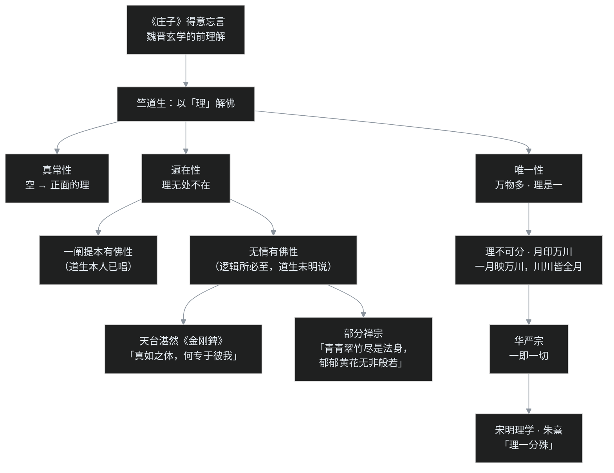

> 公元 5 世纪 20 年代末至 30 年代初，建康（今南京）。僧团开了一次大会，要把一位年高德劭的老僧赶出都城。罪名是「违背经文」——当时新译流行的《泥洹经》白纸黑字写着「一阐提人不能成佛」，这位老僧偏要讲「一阐提也能成佛」。老僧当众立誓：若所说违背佛意，愿身生癞疾溃烂而死；若不违佛意，将来据狮子座而终。不久，四十卷《大般涅槃经》全本传到建康，经上赫然写着——一阐提也能成佛。这位被赶走的老僧，就是竺道生，人称生公；「生公说法，顽石点头」八个字，从此流传了一千六百年。

## 先给小白交个底

正式开讲前，先把四件事交代清楚：

- **竺道生（约 354–434）是东晋晋宋之际最「敢想」的僧人。** 道生的履历相当豪华：先是建康高僧竺法汰的弟子，再上庐山依慧远七年，又赴长安进过鸠摩罗什的译场——三大名师串成一条线。但道生最大的本事不是「学」，是「想」：敢于在经文没写全的时候，凭义理把话补出来。
- **这篇要讲的核心是一个字：「理」。** 在道生之前，中国人围绕「空」已争论了几代——中06 的六家七宗、中07 慧远的法性论，都还在消化外来概念；道生换了个频道，用玄学里的「理」来讲：真理是一、是整全、是无处不在。这个「理」字一立，一阐提成佛、顿悟成佛、乃至宋明理学的「理一分殊」，全都顺着长了出来。
- **「生公说法，顽石点头」是个比喻，不是法术。** 被赶出建康后，道生在苏州虎丘山对着石头讲经——不是真跟石头说话，是举世无人可谈时的孤愤；石头点头象征的是：道理本身站在这位被放逐者一边。
- **「顿悟」也有两个版本。** 道生之前的「小顿悟」主张修行到第七地时顿悟；道生的「大顿悟」主张不到成佛那一刻无悟可谈——要悟就是最后一悟、一悟即是成佛。道生此说深刻影响了后世禅宗，但禅宗把「悟」挪到了修行最前头，二者位置相反、并不等同（这点课程特意叮嘱过，第六节细辨）。

---

## 一、三段问学：从竺法汰到庐山到长安

### 1. 巨鹿魏氏

竺道生俗姓魏，巨鹿人（今河北平乡县一带），生于一个知识分子家庭，父亲是位心地仁厚的县令。小道生自幼聪慧，父亲疼爱异常。后来高僧竺法汰到建康（南京）弘法，县令便将儿子托付给法汰——道生由此在建康出家。

竺法汰是谁？中06 出场过的大人物：道安新野分张时派往扬州的那一路，后来成为建康佛教的领袖。道生拜入法汰门下时年纪很小（十岁出头），法汰圆寂时道生尚不满十五岁。但这位少年早慧得惊人：十五岁便开始登座讲法，口才与学养都扎实，在座的长辈竟没人辩得过。二十岁受具足戒。

### 2. 庐山七年

师父圆寂后，道生离开建康，上了庐山，依止慧远——这一年道生约二十出头，在庐山一住七年。

要注意辈分：慧远本人是道安的弟子，道生是竺法汰的弟子，竺法汰也是道安的弟子，所以慧远与道生在法门辈分上是平辈，只是年龄差了二十多岁。庐山七年里，道生把当时能找到的禅数经论几乎读遍，为日后的义理大厦夯实地基（中07 讲过，慧远僧团规矩极严、道风重禅）。

### 3. 长安的「早退生」

鸠摩罗什 401 年入长安后，慧远派弟子赴关中助译，道生也在其列，与慧睿、慧观等同学一起进了罗什译场。长安僧众对道生的领悟力极为惊叹，称之为神悟。

但道生在罗什门下待的时间并不长。原因说起来有点「学霸脾气」：罗什译经极其认真，不肯删略，进度慢、文句繁，道生不耐烦，中途便走了。所以罗什后来译出《中论》《百论》《十二门论》这三部龙树中观的核心论典时，道生已经不在场——**没有系统受过龙树中观的训练**。

这个「缺席」深刻影响了道生的思想走向：日后道生长出的那套「理」与「佛性」，走的不是印度中观「一切无自性」的否定路线，而是更接近后期大乘如来藏的肯定路线。得失很难讲：少了一层中观的规矩，反而少了一层束缚。

离开长安后，道生回到建康。此时的道生已非吴下阿蒙：集三大名师之学，又带着一身独立思考的胆量，一场惊动朝野的思想事件，正在酝酿。

---

## 二、孤明先发：一阐提事件

### 1. 六卷《泥洹》

先说清楚当时的新经典。法显和尚 4 世纪末从长安出发、陆路去印度、海路归国，千辛万苦带回了《大般涅槃经》的部分梵本，在建康译出（据《出三藏记集》等经录记载，译者为佛陀跋陀罗等人），共六卷，当时叫《大般泥洹经》（「泥洹」是「涅槃」的早期音译）。

这部经一译出，建康城纷纷讲说。经的核心有两句话（据经文意思括述，非逐字原文）：

> 一切众生，皆有佛性；唯独一阐提人，除外。

「一阐提」是梵文音译，指断了善根的极恶之人——经文明说：这类人没有佛性、不能成佛。

### 2. 「我偏说一阐提能成佛」

道生也讲六卷《泥洹》，反复研思之后，得出了一个跟经文字面**正好相反**的结论：

> 一阐提人，皆得成佛。

道生的逻辑极其简单直接：涅槃经的大前提是「一切众生皆有佛性」，一阐提再恶，难道不是众生？是众生，就有佛性；有佛性，就能成佛。把一类众生从「众生」里开除，义理上讲不通。

这在当时不只是「新说」，是**离经叛道**——经文明明写着「除外」，一个僧人竟敢公然说经不对。建康僧团此前已对道生的几篇新论（《善不受报论》等）颇为不满，此次新账旧账一起算，直接上表给宋文帝，召开僧团大会，将道生「摒斥」——逐出建康僧团。

### 3. 当众立誓

「摒斥」在僧团里是奇耻大辱，实质等于宣告此人丧失僧格。大会上，道生当众立了一个重誓（《高僧传》记载）：

> 若我所说反于经义者，请于现身即表厉疾（癞疾）；若与实相不相违背者，愿舍寿之时，据师子座。

——若我错了，今生就全身溃烂；若我没错，死时要坐在讲经的狮子座上。说罢，当年九月，道生被迫南遁。

### 4. 虎丘顽石

道生先到了苏州虎丘山。传说道生在虎丘孤寂至极，举世无人可以论道，便堆起一排石头当听众，对着石头讲《涅槃经》，讲到「一阐提皆有佛性」时，问石头（后世传说所载的问语，大意是：我所说的，契合佛意吗）——石头们竟纷纷点头。

这就是「生公说法，顽石点头」的来历。今天苏州虎丘的千人石（一说点头石）旁，还立着「生公说法处」的碑。当然，石头不会真点头：**这个故事讲的不是神迹，是历史把「正确」判给了被放逐的人。** 道生南遁之后，追随其南下的僧俗信众其实不少——江南自有一批肯独立思考的人。

### 5. 大本来了

转折来得不算太晚。早在北凉，天竺译师昙无谶（从于阗等地寻得梵本）已经在凉州译出了《大般涅槃经》全本四十卷。只是南北割据、路途遥远，全本传到建康，距道生被摈已经过了一段时日。

四十卷本的后分三十卷中，经义已明确转过来：一切众生皆有佛性，连一阐提也不例外、皆当成佛（此据课程对经义的转述，非逐字引文）。

建康僧界读到全本，举城惭愧：当年驱逐道生的人，凭的只是一部不完整的经；道生在全本到来之前，已经凭义理走到了终点。史书上为此送了道生四个字——**孤明先发**。

那么，道生是怎么「先发」的？若说神秘感应，那是宗教解释；若拆义理，就得回到道生手里那个最关键的字——「理」。

---

## 三、佛性「当有」：一部经的两种读法

六卷《泥洹》与四十卷《大般涅槃经》，字面差异只在「一阐提」；但在现代学者（如傅新毅先生）对文本的细密分析下，两部分代表的其实是**两套佛性观**。

### 1. 前分：本有佛性

四十卷全本可分两段：前分十卷，内容正相当于法显带回的六卷《泥洹》；后分三十卷，思想与前分有明显差异——两部分很可能是在不同时间、不同地点分别形成、后来才编集到一起的（前分近印度源头，后分或集成于于阗）。

前分的思路是「本有」：**佛性是一切众生本来就有的**——佛的清净本性，众生先天具足，所以对众生而言，佛性就是未来成佛的「因」。但前分又坚持一阐提不能成佛。

这里有个极要紧的逻辑区分：

> **「有佛性」与「能成佛」不是等价命题。**

没有佛性固然一定不能成佛；但有佛性，未必就能成佛——佛性被烦恼盖着，你不修行、不把它显现出来，它就只是沉睡的可能性。所以：**有佛性是成佛的必要条件，不是充分条件。** 一阐提佛性本有，但善根已断、显发无望，故前分判定不能成佛。

### 2. 后分：当有佛性

后分换了个说法，不再强调「本来具足」，而讲「当有」——**佛性是将来可以证得的**。

这个改换大有深意。「我本来就有一个清净佛性」——这话很容易让人联想到印度教讲的「梵」：每个人内在本有一个小我，与宇宙的大我本是同一物。为了跟梵我思想划清界限，后分不立「本有」，而立「当有」：

- 「当有」不是佛性从无到有地生出来；
- 而是说：现在我证不到它，将来通过修行能够证到它。

### 3. 能与所：微积分的比方

这里要引入一对概念：**能证与所证**。

- **所证**＝佛性、真理（被认识的对象）；
- **能证**＝菩提、智慧（能认识它的那个能力）。

凡夫不是没有佛性，而是没有能证佛性的智慧；智慧一生，佛性就被证得，由此成佛。傅先生课上打了个极妙的比方（据课堂讲述整理）——**微积分**：微积分这门学问，不管你学没学会，它都在那里；小学生学不会，它依然在；将来上了大学把微积分学通了，变的不是微积分本身（它没有从无到有），变的是学的人（从不能认识，变成能认识）。

佛性「当有」正是这个意思：不是佛性本来没有、成佛时才有；而是众生当下没有智慧证它，将来智慧起时可以证它。

而道生当年写的，恰恰就叫《佛性当有论》。这里要留神一个微妙之处：论文名目虽称「当有」，但按傅先生的分析，道生那套「理」的逻辑——遍在性是已然——推出的其实是「**本有**」（详见下一节）；道生唱一阐提能成佛，落点正是「一阐提也本有佛性」。所以道生与后分的关系，是殊途同归，而非事先站到了「当有」的位置上。下面这张表，先把前后分的差别一次摆清：

| 维度 | 前分（≈六卷《泥洹》） | 后分（三十卷） |
|---|---|---|
| 佛性观 | **本有**：本来具足 | **当有**：将来证得 |
| 一阐提 | 佛性本有，但不能成佛 | 悉有佛性，皆当成佛 |
| 关键区分 | 有佛性≠能成佛（必要非充分） | 无智慧则证不到，非佛性不存在 |
| 设防对象 | 执理废事（不修行） | 梵我合一（实体化） |

---

## 四、一个「理」字：三性与千年下游

道生为什么能「孤明先发」？因为道生解读佛经时，带着一个从魏晋玄学来的「前理解」——《庄子》讲「得意忘言」（抓住意思、放下文字），道生便不被经文字句捆住，处处追问经文背后那个整全的「理」。

这个「理」有三个特性：

### 1. 真常性：正面的理

在道生之前，「空」主要是个否定性概念（无自性）。到了道生，空被从正面理解为「理」——真实、恒常、可以体证的真理本身。把否定性的「空」转成正面的「理」，是汉传路径的关键一跃；这个开端，就在竺道生。

### 2. 唯一性：理是一

玄学讲「一多」（同类于「体用」「有无」）：**万物是多，理是一**。形形色色的现象背后，是同一个真理，不能是许多个真理。理既为一，便整全、不可切割。

### 3. 遍在性：无处不在

「理」遍在于万事万物——没有任何东西落在理之外，正如《庄子》讲「道」遍在于一切、连稊稗、瓦甓里都有道。从遍在性，立刻得出两个推论：

- **其一，遍在是「已然」，不是「当然」。** 理不是将来才实现的目标，此刻当下已经遍在万物——所以佛性「本有」，这从理上直接成立。
- **其二，遍在不能把任何东西排除在外。** 理若真无处不在，一阐提身上也照样有理——一阐提本有佛性，成了题中应有之义。

### 4. 逻辑的下游：一阐提、无情、月印万川

把「理」的逻辑继续往下推，推出了道生本人未必走到、但后人逐一实现的三大下游：

逐一说图上的下游：

- **无情有性。** 理的遍在若不限于有情（有情＝有情识的众生），便逻辑地推到草木瓦石——「无情有佛性」是**中国佛教特有的命题**，印度如来藏系统只讲到「一切众生」。唐代天台湛然在《金刚錍》中正式立此说，两大依据正是《大乘起信论》与「理的遍在性」，原话：「真如之体，何专于彼我」——真理不会只局限在你或我身上。部分禅宗也接此义：「青青翠竹，尽是法身；郁郁黄花，无非般若。」
- **月印万川。** 一个追问随之而来：理只是「一」，万物是「多」——这一个理，如何存在于万物之中？每物分到十分之一的理？华严宗以「月印万川」作答：天上只有一个月亮，地上万条江河，每一条河里映出的都是**整个月亮**，不是月亮的碎片——理以全体的方式完整地存在于每一事中，因为理不可分割。这一比喻后来被宋儒朱熹吸收，凝成「**理一分殊**」四字。
- **双向改造。** 思想线索由此看得极清楚：道生→华严宗→朱熹。这就是「佛教中国化」的真义——**不是单向的「佛教征服中国」（许里和有同名名著），而是双向互动**：中国人先以自己的文化传统系统改造了印度佛教，再用改造后的佛教反过来滋养中国思想。儒家能从一套伦理学升格为宋明理学那种哲学形态，缺了这一环便不可能。

---

## 五、小小戒之争：道生不踞

道生还有一副面孔，见之于两桩「生活戒律」事件——「入道之要，慧解为本」八个字，在这两桩事上体现得淋漓尽致。

### 1. 踞坐之辩

建康的祇洹寺是当时招待西域、印度来华高僧的大道场，住持慧义性格刚猛，寺中僧众连生活方式都学印度——包括「踞坐」（蹲踞箕坐，双脚乱放）。按中国古礼，踞坐是极无礼的坐姿：古人席地而坐，正确的姿势是跪坐（双膝跪地、臀部落在小腿上）；箕踞见客是侮辱。《论语》里孔子骂老相识原壤「老而不死是为贼」，由头正是踞坐无礼。

时任国子监祭酒（国立最高学府负责人）的范泰，见寺里连中国僧人也踞坐，大怒，联合朝中大臣上表宋文帝（即著名的《论踞食表》，文存《弘明集》；以下据课程对表文大意的转述，非逐字引文），核心思路与道生的治学一脉相承：言语是用来传达意思的，意思到了就不必执着文字；礼仪是用来养成恭敬的，恭敬立了就不必死守形式；圣人本就因事制戒、随俗变法。范泰还特意标举：道生和尚就不踞坐——这就是「道生不踞」的出典。

### 2. 过午不食

另一桩发生在皇宫。宋文帝请僧众入宫应供，饭菜耽搁了时辰，有僧人看太阳说：「过午了——」印度有「过午不食」戒，午后便不能进食。文帝大急：自己费心设斋，难道大家要饿肚子？

这时道生开口：太阳正挂在中天，天子都说还没到正午，谁说过午了？说罢便端起钵进食（据课程讲述，非逐字引文）。众人见状，纷纷跟着吃。

道生不是耍无赖，而是看清了这条戒的来龙去脉：僧团起初并无此戒，原本一日两餐；后来发现午后外出乞食问题丛生（天黑路险、遇到野象毒蛇、俗家供养两餐负担太重、夜叩门曾惊吓到孕妇），佛陀才参照当时其他修行团的做法，改为日中一食、过午不食——炎热的印度食物无法久存，也是一条现实原因。戒律是为护持修行、随顺现实而立的，不是为了卡着太阳角度做文章。老人、病人、孩童，戒律本就开了「药食」（把晚餐当医药进补）的方便门。

这些生活小戒（衣、食、住、医药）从印度传到风土迥异的中国，哪些守、哪些随俗调整，自东晋起便是大问题——道生给出的答案始终是：**抓住戒律背后的「理」，不被形式反客为主。**

---

## 六、大顿悟：最后那一悟

### 1. 小顿悟：七地而悟

「顿悟」不是道生的发明。道安、慧远、僧肇都谈过顿悟，但都属于「小顿悟」：修行到**第七地**时获得顿悟。

背景是后来形成的「五十二位」修行次第（十信、十住、十行、十回向、十地，加等觉、妙觉，见《菩萨璎珞本业经》等；早期的「十住」其实就是「十地」的异译）。七地顿悟说给出的两条理由，以印度佛教本义衡量都站不住：

- 一说七地是「由凡入圣」的转折点——实则初地（初入圣位）即已转凡成圣；
- 一说从七地起才能「有无并观」（同时观有、观空）——实则五地以上便能如此。

### 2. 大顿悟：十地而悟

道生一语推翻：七地之后还有八、九、十三地的路要走，七地怎么能叫「悟」？**真正的顿悟必须在十地**——十地证理，顿悟即成佛；十地之前，一律是渐修，无悟可谈。

道生的论证只有两条，却如铁锤：

> **其一，见理即成佛。** 证得了那个整全的真理，就是成佛，不是见理之后还有另一桩「成佛」的事。
> **其二，理不可分。** 理是「一」、是整全，对理的领悟不可能切成碎片——不能今天悟三分之一、明天悟十分之三；对理而言，**要么不悟，要么全悟**，没有中间状态。

两条合起来：悟只能是对理之全体的一次彻悟，而彻悟即是成佛——所以悟必在最后一刻。此前所有努力都是渐修积累，为这「一次」做准备。

### 3. 印度体系里的「见道」与「修道」

公允地说，道生这套「见理即成佛」，在印度佛教里找不到依据。印度的修行框架是「见道＋修道」两段：

- **见道**：亲见真理、进入初地，就此转凡成圣——但见道断的是「理惑」（道理上的迷惑、认知上的错误）；
- **修道**：见道之后还要历经多世实地修行，断的是「事惑」（习气、惯性），全部断尽才成佛。

有个极直白的比方：一个惯偷，某天痛心疾首、真心认识到「偷盗是错的」——这是见道，理惑断了；可第二天看见一台好电脑，手还会痒，为什么？**习气还在**——事惑要靠一件事一件事上磨，才断得掉。见道好比看懂了正确的架构图，修道才是把旧代码库里成千上万处坏味道逐行改完。

所以在印度体系里，「顿悟」最多发生在见道那一刻，但见道远不是成佛。唯有在「佛性＝整全的理」「理不可分」的汉传前提下，「一悟即至佛地」才成立。道生的大顿悟，后来深刻影响了禅宗的顿悟说——当然，禅宗主张悟在修先、悟后起修，与道生的「悟在最后」位置相反，又有自家的展开（中21 再讲）。

> 补一句：上文卡片中禅宗一行标了「本来是佛」，按课程口径应理解为「本性本自圆满、当下顿见」，悟后仍须起修，并非「不用修」。

---

## 七、据狮子座而卒

晚年的道生重回庐山——禅修毕竟是这位老僧骨子里的最爱。

宋文帝元嘉十一年（434 年），道生在庐山精舍升座说法。法会将毕，众人忽见道生手中的麈尾飘然落地，近前看时——道生已端坐而寂。当年在建康大会上立下的重誓，分毫不差地应验了：**舍寿之时，据师子座。**（狮子座即弘法之座：佛陀说法如狮子吼，百兽慑伏，故以「狮子座」称讲经之席。）道生享寿约八十岁（《高僧传》作「春秋八十」，一云七十九）。

道生走后，好友慧琳法师所作诔文中有四句，堪称一生定评：

> 重衿云披，群疑冰释。释迦之旨，淡然可寻；珍怪之辞，皆成通论。

——重重疑云被拨开，释迦教义平淡中便可寻见；连经文中那些神奇怪诞之辞，也都被讲成了通达的道理。

这便是道生的信仰姿态：**入道之要，慧解为本。** 佛教是理性的宗教（近代梁启超先生也曾分辨：佛教是「智信」，不是迷信），经文随时代地域掺入了许多神话与方便，后人的职责是把可信的道理从中「净化」、合理化出来——正如印顺导师考证「龙树龙宫取经」，指出经典实为海港龙王庙中所得，而非真有水晶龙宫：剥掉神话外壳，救出来的恰恰是佛法本身。

---

## 程序员类比

- **三大名师串成一条师承链，** 道生相当于本科跟着架构大师（竺法汰）、读研进了顶级实验室（庐山慧远）、又去官方核心团队做过访问（长安罗什）——但真正定义此人的不是简历，是敢在官方文档不全时自己推结论的能力。
- **孤明先发像什么？** 像只拿到部分接口文档（六卷《泥洹》），却凭系统的内在一致性，断言「这个系统必然支持 X 特性」——几年后完整文档（四十卷涅槃）公开，果然如此。道生用的方法是：不盯字句、抓系统背后统一的设计原理（「理」）。
- **「理是一、万物是多」，** 好比系统里业务形态千变万化（多），底层架构原理只有一套（一）；「月印万川」更像同一个内核镜像完整地跑在成千上万台节点上——每台节点上都是完整内核，不是分到一小块。朱熹的「理一分殊」，就是把这个模型搬进了儒家。
- **顿悟 vs 渐修，** 用工程话说：「理」的领悟不是进度条（无法完成 30%、70%），它更像一次原子提交——要么没合并，要么整体合并；但为这次提交所做的阅读、调试、积累，全是渐修。而印度佛教的「见道＋修道」提醒得也对：看懂架构图（断理惑）只是开始，把旧系统的坏习气一行行改完（断事惑），才算完。
- **小小戒之争，** 像团队里「死守过时流程」还是「理解流程当初为什么设立」：过午不食、踞坐之禁都是针对当年环境的解决方案；环境变了，方案该随俗调整——抓住的是规则背后的设计意图，不是把规则本身当图腾。
- **戳个洞：** 道生以「理」把「空」实体化，讲出了一个整全的终极真理——模型是好懂了，可这也正是印度中观最警惕的：一旦把「理」抓成一个东西，它就成了新的执着点。方便和本义，永远在拉锯，叶扬对此不陌生。

---

## 吵架现场

**争点一：一阐提到底能不能成佛？**

六卷《泥洹》说不能，四十卷《大般涅槃经》说能——经文自己在打架。一派主张尊奉纸面文字、一字不可易；道生一系主张义理优先、经文有不圆满处。这场争论的本质是「经文字句」与「义理推断」谁优先——而道生赢的方式不是辩赢，是等来了更全的经。

**争点二：佛性是本有还是当有？**

前分讲本有，后分讲当有，据后世教史通说，玄奘门下后来都还在为此分宗（窥基一系与别系口径不同）。主本有者担心：说「将来才有」，佛性就成了后天产物；主当有者担心：说「本来就有」，便与梵我划不清界限。这是「实体化」与「外在化」两头的永恒拉扯。

**争点三：顿悟该在七地还是十地？**

小顿悟派（道安、慧远、僧肇皆与其列）主七地顿悟，大顿悟派（道生）主十地顿悟。一派看七地已证无生、理该顿悟；道生一系看七地之后路还长，悟必在最后。再往后，禅宗又把顿悟提到修行最前头（主张本性本自圆满、当下即可顿见）——同一「悟」字，位置竟有三种摆法。

**争点四：无情之物有没有佛性？**

湛然与部分禅宗主「翠竹黄花」皆是佛性，反对者（包括多数唯识学者）坚持：佛性是「成佛的可能性」，无情之物根本不能成佛，奢谈佛性纯属概念泛滥。这个命题在中国才出现，恰说明「理的遍在性」是个纯粹本土的推导——也正因如此，一派视之为哲学高峰，一派视之为越界。

---

## 卡壳角

写这篇时踩在资料边界上的点，统一交代：

- **道生的著述全部早佚。** 《善不受报论》《顿悟成佛论》《二谛论》《佛性当有论》《法身无色论》《佛无净土论》《应有缘论》等今皆不存，仅有《出三藏记集》《高僧传》存其名目与后人转述的片段；本文所论皆依二手记载，无法以原著逐字核对。
- **生卒年有异辞。** 卒于元嘉十一年（434）确定；《高僧传》作「春秋八十，一云七十九」，故生年约在 354/355，本文取约 354。
- **被摈的具体年份**史无明文，学界一般系于 428–430 年前后（六卷《泥洹》学界一般系于 418 年译出，四十卷本学界一般系于约 430 年南传），本文只写先后、不系死年份。
- **「前分／后分」的文本分析**（异时异地形成、本有 vs 当有）是现代学者的研究结论（课程采傅新毅先生说），并非古人的自我说明；四十卷本的分卷与内容对应，学界尚有细节争论。
- **五十二位次第**（十信、十住、十行、十回向、十地等）出于《菩萨璎珞本业经》等，学界多判此类经为中国人所撰（旧称「伪经」，更中性的说法是「中土伪撰」），印度佛教无完整对应；道生所用的是当时已流行的阶位话语。
- **七地顿悟的两条理由**（由凡入圣、有无并观）被傅先生判为在印度体系中不成立，但此为现代评判，当年道安、慧远、僧肇皆持小顿悟，本文如实并呈。
- **踞坐之争的人物**：范泰《论踞食表》、祇洹寺住持慧义，王弘、郑鲜之（郑道子）等大臣参与其事，均见《高僧传》《宋书》；道生本人在事件中是被标举的正面榜样，并非上书的发起者。
- 「**生公说法，顽石点头**」自始即传说（最早记载已带神异色彩），本文作为信念与历史评价的象征使用；虎丘「千人石」「点头石」地名至今尚存。
- 诔文「重衿云披……」出慧琳《竺道生法师诔》；龙树龙宫的考证出印顺导师有关龙树的一系论述（课程口语引及，未具书名篇名），本文标其名而不展开。
- 范泰、慧琳、梁启超、印顺诸条评论所代表的「理性佛教」立场是一家之言；推崇朱熹、批评阳明后学的部分更是傅先生个人见解，正文仅取其佛理分析，不代表历史定论。

---

## 术语表

| 术语 | 一句话解释 |
|---|---|
| 竺道生（生公） | 约 354–434，巨鹿魏氏，东晋晋宋之际涅槃学者，「孤明先发」 |
| 竺法汰 | 道安弟子，建康佛教领袖，道生的出家本师 |
| 慧远 | 庐山高僧，道生在庐山依止七年的法门平辈（中07 主角） |
| 慧睿、慧观 | 与道生同赴长安罗什译场的同学 |
| 十住 | 早期译法，即「十地」（住/柱＝阶位） |
| 《大般泥洹经》 | 六卷，法显取回梵本，据《出三藏记集》等经录记载为佛陀跋陀罗等译，四十卷《涅槃》之前分 |
| 《大般涅槃经》 | 四十卷，北凉昙无谶译，大本，主一切众生皆有佛性 |
| 昙无谶 | 北凉天竺译师，从于阗等地寻得梵本，译出四十卷涅槃 |
| 泥洹／涅槃 | 早期／后来的异译，意译寂灭、究竟解脱 |
| 一阐提 | 梵文音译，断善根的极恶之人；道主唱其皆得成佛 |
| 摒斥（摈出） | 僧团的开除处分，道生因此离开建康南遁虎丘 |
| 孤明先发 | 史称道生在全本南来之前独先悟明佛性之义 |
| 虎丘说法 | 道生在苏州虎丘对石讲经，「顽石点头」传说之地 |
| 佛性 | 佛的清净本性；对众生而言是成佛的因／依据 |
| 本有 | 前分义：佛性众生本来具足 |
| 当有 | 后分义：佛性为将来修行所证得；道生有《佛性当有论》 |
| 能证／所证 | 能证的智慧（菩提）与所证的对象（佛性、真理） |
| 菩提 | 意译「觉」，能证得真理的智慧 |
| 必要非充分 | 有佛性是成佛的必要条件，但不修行则不能成佛 |
| 理 | 道生佛学的核心：整全、唯一、遍在的真理 |
| 真常性 | 「理」的特性一：空被从正面理解为真实恒常 |
| 唯一性 | 「理」的特性二：万物是多，理是一 |
| 遍在性 | 「理」的特性三：理无处不在、当下已然 |
| 无情有性 | 草木瓦石亦有佛性，中国佛教特有命题，湛然《金刚錍》立之 |
| 湛然 | 唐代天台宗九祖，著《金刚錍》：「真如之体，何专于彼我」 |
| 《金刚錍》 | 湛然论无情有性的名著（「錍」是眼科手术刀） |
| 月印万川 | 华严宗比喻：一理在万物中各以全体呈现，如一月映万川 |
| 理一分殊 | 朱熹命题，源头可溯道生、华严；一理整全而分见万殊 |
| 华严宗 | 依《华严经》立宗，擅法界缘起、一多相即 |
| 佛教征服中国 | 许里和名著；实际过程是双向改造与互动 |
| 小顿悟 | 道安、慧远、僧肇所主：七地顿悟 |
| 大顿悟 | 道生所主：十地顿悟、顿悟即成佛、理不可分 |
| 五十二位 | 十信、十住、十行、十回向、十地、等觉、妙觉的修行次第 |
| 《菩萨璎珞本业经》 | 载五十二位次第之经，学界多判为中土伪撰 |
| 七地 | 小顿悟所系的阶位；两条例证（凡圣转折、有无并观）均受质疑 |
| 见道 | 印度体系：亲见真理、入初地、断「理惑」 |
| 修道 | 见道之后的多世修行，断「事惑」（习气） |
| 理惑／事惑 | 道理上的迷惑／习气上的惯性；见道、修道各断其一 |
| 惯偷喻 | 认识偷盗错误（见理）而手痒犹在（习气），喻须修道 |
| 善不受报 | 道生论义：善的终极果是成佛，不在轮回受报 |
| 法身无色 | 道生论义：法身非色身、无形色 |
| 佛无净土 | 道生论义：净秽之分出于众生执着，佛自无净土相 |
| 应有缘 | 道生论义：法身遍在，与有缘众生相应而施教 |
| 踞坐／跪坐 | 无礼的蹲踞／合礼的正坐；范泰《论踞食表》之争 |
| 范泰 | 国子监祭酒，反对祇洹寺踞坐，上表宋文帝 |
| 慧义 | 祇洹寺住持，性刚猛，踞坐之争的当事者 |
| 《论踞食表》 | 范泰所上表，主意达言忘、敬立礼废，圣人随俗变法 |
| 过午不食 | 日中一食戒，因午后乞食多患而立；道生有「太阳中天、天子言未过午」之辩 |
| 药食 | 戒律开缘：老人、病人、孩童以晚餐为医药进补 |
| 据狮子座 | 弘法之座（佛说法如狮子吼）；道生誓愿与最终应验之事 |
| 慧琳 | 道生好友，作诔：「释迦之旨，淡然可寻；珍怪之辞，皆成通论」 |
| 入道之要慧解为本 | 道生为学宗旨，重理解、贵理性 |
| 智信 | 梁启超语：佛教是智信而非迷信 |
| 净化、合理化 | 印顺主张：从神话外壳中还原佛法的可信道理 |

---

## 结尾

道生这一生，像极了历史上一切「跑在文档前面」的人：凭着对系统原理的信任，在经文只写了一半时，把后半句替佛陀讲了出来；代价是被逐出当时最繁华的都城、在虎丘对着石头说话。而历史的答复是一部四十卷的经，和一块至今还在的点头石。

「理」这个字从此在中国扎了根：从道生的「理一」，到华严宗的「月印万川」，再到朱熹的「理一分殊」——印度的空，就这样长成了中国哲学的参天大树；而「顿悟」二字，还将在几百年后的禅宗那里，掀起更壮阔的波澜。

与道生同属一个时代、却走了相反方向的路的，还有一批真正用双脚丈量信仰的人：当建康的僧人为经文字句争论不休，法显等一批僧人已经翻过雪山、渡过沧海，去圣地寻找更完整的经典。求法者为什么前赴后继？路上又见过怎样的世界？下一篇，中09，跟着法显上路。
